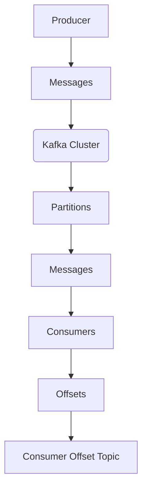

                 

### 文章标题

Kafka Offset原理与代码实例讲解

> 关键词：Kafka，Offset，消息队列，分布式系统，数据一致性和顺序性

> 摘要：本文深入讲解了Kafka的Offset原理，以及如何在代码中实现Offset的管理。通过具体的实例，读者将了解如何使用Kafka的Offset来保证消息的消费顺序和数据一致性。

<|user|>## 1. 背景介绍（Background Introduction）

Kafka是一种分布式流处理平台，广泛用于构建实时数据流和消息系统。它由LinkedIn开发，现在是一个Apache软件基金会下的开源项目。Kafka的主要特点是高吞吐量、持久化、可靠性和分布式。

Offset是Kafka中的一个核心概念，它代表了消费者在消息队列中的位置。简单来说，Offset是一个唯一的标识符，用来标记消费者已经处理过的消息位置。Offset的重要性在于它确保了消息的顺序性和一致性。

在分布式系统中，数据一致性和顺序性是一个巨大的挑战。Kafka通过Offset提供了一种机制来解决这个问题，使得消费者可以在不同实例和不同时间点保持对消息的顺序性。本文将详细讲解Offset的原理，并通过代码实例来展示如何使用Offset来保证消息的消费顺序和数据一致性。

## 1. Background Introduction

Kafka is a distributed streaming platform widely used to build real-time data streams and messaging systems. Developed by LinkedIn, it is now an open-source project under the Apache Software Foundation. Kafka's key features include high throughput, durability, reliability, and distribution.

Offset is a core concept in Kafka that represents the position of a consumer within a message queue. In simple terms, an Offset is a unique identifier that marks the position of a message that has been processed by a consumer. The importance of Offset lies in its ability to ensure the order and consistency of messages in a distributed system.

In a distributed system, maintaining data consistency and order is a significant challenge. Kafka provides a mechanism through Offset to address this issue, allowing consumers to maintain message order across different instances and at different times. This article will delve into the principles of Offset and demonstrate how to use Offset to ensure the sequential consumption of messages and data consistency through code examples.

<|user|>## 2. 核心概念与联系（Core Concepts and Connections）

### 2.1 什么是Offset？

Offset是Kafka中用来标识消息位置的一个整数。它是一个唯一的标识符，随着消费者消费消息而不断递增。每个分区都有一个 Offset，它代表了该分区中消息的顺序。

Offset具有以下特点：

- **唯一性**：每个分区内的消息都有一个唯一的Offset值。
- **递增性**：Offset随着消费者消费消息而递增。
- **持久性**：Offset会被Kafka持久化，即使在消费者实例重启后，它也能够从上次停止的Offset继续消费。

### 2.2 Kafka消息队列架构

Kafka由多个分区（Partitions）组成，每个分区包含一系列的消息（Messages）。分区的作用是提高并发性和消息的吞吐量。每个分区都有一个唯一的分区ID（Partition ID）。

Kafka的消息队列架构如下：

```
+---------------------+
|      Kafka Cluster   |
+---------------------+
          |
          ↓
+----------------+     +----------------+
|  Producer     |     |  Consumer      |
+----------------+     +----------------+
```

- **Producer**：生产者负责生成消息并将其发送到Kafka集群。每个生产者可以选择将消息发送到特定的分区。
- **Consumer**：消费者负责从Kafka集群中消费消息。消费者可以是单个实例，也可以是多个实例组成的消费者组。

### 2.3 Offset与消息顺序性

在分布式系统中，确保消息的顺序性是一个关键挑战。Kafka通过Offset来实现消息的顺序消费。消费者通过跟踪Offset来确定已经消费的消息和尚未消费的消息。

Offset确保了以下两点：

- **消费顺序**：消费者按照Offset递增的顺序消费消息，从而保证了消息的顺序性。
- **数据一致性**：通过Offset，消费者可以保证从特定Offset开始的所有消息都被消费，从而保证了数据的一致性。

### 2.4 Offset的持久化

Kafka将Offset持久化到Consumer Offset Topic中。这是一个特殊的Kafka Topic，用于存储消费者的Offset信息。即使消费者实例重启，它也能够从Consumer Offset Topic中读取上次停止的Offset，继续消费消息。

Offset持久化的优点：

- **容错性**：消费者实例可以在重启后从上次停止的位置继续消费。
- **可恢复性**：在消费者失败或网络中断后，系统可以恢复到上次停止的位置，继续消费消息。

### 2.5 Mermaid流程图

以下是一个Mermaid流程图，展示了Kafka消息队列的基本架构和Offset的作用。



## 2. Core Concepts and Connections
### 2.1 What is Offset?

Offset is an integer used in Kafka to identify the position of a message within a message queue. It is a unique identifier that increments as the consumer processes messages. Each partition in Kafka has a unique Offset.

Offsets have the following characteristics:

- **Uniqueness**: Each message within a partition has a unique Offset value.
- **Incremental**: Offsets increment as the consumer processes messages.
- **Durability**: Offsets are persisted by Kafka, allowing consumers to resume from the last stopped Offset even after a restart.

### 2.2 Kafka Message Queue Architecture

Kafka is composed of multiple partitions (Partitions), each containing a sequence of messages (Messages). Partitions are used to improve concurrency and message throughput. Each partition has a unique Partition ID.

The architecture of Kafka's message queue is as follows:

```
+---------------------+
|      Kafka Cluster   |
+---------------------+
          |
          ↓
+----------------+     +----------------+
|  Producer     |     |  Consumer      |
+----------------+     +----------------+
```

- **Producer**: The producer is responsible for generating messages and sending them to the Kafka cluster. Each producer can choose to send messages to specific partitions.
- **Consumer**: The consumer is responsible for consuming messages from the Kafka cluster. Consumers can be single instances or multiple instances forming a consumer group.

### 2.3 Offset and Message Order

Ensuring message order is a key challenge in distributed systems. Kafka uses Offset to achieve sequential message consumption. Consumers track Offsets to determine which messages have been processed and which messages are yet to be processed.

Offsets ensure the following:

- **Consumption Order**: Consumers process messages in the order of increasing Offsets, ensuring message order.
- **Data Consistency**: Through Offsets, consumers can ensure that all messages starting from a specific Offset are processed, ensuring data consistency.

### 2.4 Persistence of Offset

Kafka persists Offsets to a special Kafka Topic called the Consumer Offset Topic. This Topic stores the Offset information of consumers. Even if a consumer instance restarts, it can read the last stopped Offset from the Consumer Offset Topic and continue processing messages.

The benefits of Offset persistence include:

- **Fault tolerance**: Consumers can resume from the last stopped Offset after a restart.
- **Recoverability**: The system can recover to the last stopped Offset after a consumer failure or network interruption and continue processing messages.

### 2.5 Mermaid Flowchart

The following Mermaid flowchart illustrates the basic architecture of Kafka's message queue and the role of Offset.


<|user|>## 3. 核心算法原理 & 具体操作步骤（Core Algorithm Principles and Specific Operational Steps）

### 3.1 Kafka Offset的分配

Kafka通过一个称为Offset分配算法来分配Offset。该算法基于分区分配策略，将Offset分配给不同的消费者实例。

Offset分配算法的基本步骤如下：

1. **分区分配**：Kafka将分区分配给消费者组中的消费者实例。每个消费者实例负责消费一个或多个分区。
2. **Offset分配**：消费者实例在消费消息时，从Kafka获取分配的Offset。初始时，消费者从Consumer Offset Topic中获取上次停止的Offset。
3. **Offset递增**：消费者处理消息后，将Offset递增，表示已经消费了该消息。

### 3.2 Kafka Offset的管理

Kafka提供了多个API来管理Offset：

1. **assign() API**：用于为消费者实例分配分区。消费者组协调器根据分区分配策略，将分区分配给消费者实例。
2. **commit() API**：用于提交消费者的Offset。消费者将已处理的Offset提交到Consumer Offset Topic中，以便在后续消费时能够从上次停止的位置继续。
3. **offsetsFor() API**：用于获取特定分区的Offset。消费者可以调用该API来获取某个分区的起始Offset。

### 3.3 消费者消费消息的流程

消费者消费消息的流程如下：

1. **初始化**：消费者连接到Kafka集群，并加入消费者组。
2. **分区分配**：消费者组协调器将分区分配给消费者实例。
3. **消费消息**：消费者从分配的分区中读取消息，并处理消息。
4. **提交Offset**：消费者处理完消息后，将Offset提交到Consumer Offset Topic中。
5. **重复步骤3和4**：消费者持续消费消息，并提交Offset。

### 3.4 Kafka Offset的使用示例

以下是一个简单的Kafka消费者示例，展示了如何使用Offset来保证消息的消费顺序和数据一致性。

```java
Properties props = new Properties();
props.put("bootstrap.servers", "localhost:9092");
props.put("group.id", "test-group");
props.put("key.deserializer", "org.apache.kafka.common.serialization.StringDeserializer");
props.put("value.deserializer", "org.apache.kafka.common.serialization.StringDeserializer");

KafkaConsumer<String, String> consumer = new KafkaConsumer<>(props);
consumer.subscribe(Collections.singletonList("test-topic"));

while (true) {
    ConsumerRecords<String, String> records = consumer.poll(Duration.ofMillis(100));
    for (ConsumerRecord<String, String> record : records) {
        System.out.printf("Received message: key = %s, value = %s, partition = %d, offset = %d\n",
            record.key(), record.value(), record.partition(), record.offset());
        consumer.commitSync(); // 提交Offset
    }
}
```

在这个示例中，消费者连接到Kafka集群，订阅了名为"test-topic"的Topic。消费者从分配的分区中读取消息，并处理消息。处理完消息后，消费者将Offset提交到Consumer Offset Topic中，以便在后续消费时能够从上次停止的位置继续。

### 3.1 Core Algorithm Principles of Kafka Offset
#### 3.1.1 How Kafka Assigns Offsets

Kafka uses an Offset assignment algorithm to assign Offsets to consumers. This algorithm is based on partition assignment strategies and distributes Offsets to different consumer instances.

The basic steps of the Offset assignment algorithm are as follows:

1. **Partition Assignment**: Kafka assigns partitions to consumer instances within a consumer group. Each consumer instance is responsible for consuming one or more partitions.
2. **Offset Assignment**: When consumers start processing messages, they fetch assigned Offsets from Kafka. Initially, consumers fetch the last stopped Offset from the Consumer Offset Topic.
3. **Offset Increment**: Consumers increment Offsets as they process messages, indicating that they have consumed the messages.

#### 3.1.2 Managing Kafka Offsets

Kafka provides several APIs for managing Offsets:

1. **assign() API**: Used to assign partitions to consumer instances. The consumer group coordinator assigns partitions based on partition assignment strategies.
2. **commit() API**: Used to commit consumers' Offsets. Consumers submit their processed Offsets to the Consumer Offset Topic, allowing them to resume consumption from the last stopped Offset in subsequent runs.
3. **offsetsFor() API**: Used to fetch Offsets for specific partitions. Consumers can call this API to retrieve the starting Offset for a partition.

#### 3.1.3 The Flow of Consumer Message Consumption
The flow of consumer message consumption is as follows:

1. **Initialization**: Consumers connect to the Kafka cluster and join a consumer group.
2. **Partition Assignment**: The consumer group coordinator assigns partitions to consumer instances.
3. **Message Consumption**: Consumers read messages from their assigned partitions and process them.
4. **Offset Commit**: After processing messages, consumers submit their Offsets to the Consumer Offset Topic.
5. **Repeat Steps 3 and 4**: Consumers continue to consume messages and submit Offsets.

#### 3.1.4 Example of Using Kafka Offset

The following is a simple Kafka consumer example demonstrating how to use Offset to ensure message consumption order and data consistency.

```java
Properties props = new Properties();
props.put("bootstrap.servers", "localhost:9092");
props.put("group.id", "test-group");
props.put("key.deserializer", "org.apache.kafka.common.serialization.StringDeserializer");
props.put("value.deserializer", "org.apache.kafka.common.serialization.StringDeserializer");

KafkaConsumer<String, String> consumer = new KafkaConsumer<>(props);
consumer.subscribe(Collections.singletonList("test-topic"));

while (true) {
    ConsumerRecords<String, String> records = consumer.poll(Duration.ofMillis(100));
    for (ConsumerRecord<String, String> record : records) {
        System.out.printf("Received message: key = %s, value = %s, partition = %d, offset = %d\n",
            record.key(), record.value(), record.partition(), record.offset());
        consumer.commitSync(); // Commit Offset
    }
}
```

In this example, the consumer connects to the Kafka cluster and subscribes to a topic named "test-topic". The consumer reads messages from its assigned partitions and processes them. After processing messages, the consumer submits its Offsets to the Consumer Offset Topic, allowing it to resume consumption from the last stopped Offset in subsequent runs.

<|user|>## 4. 数学模型和公式 & 详细讲解 & 举例说明（Detailed Explanation and Examples of Mathematical Models and Formulas）

在Kafka中，Offset的管理涉及到一些基本的数学模型和公式。这些模型和公式帮助我们理解Offset的分配、递增和持久化。以下是几个关键的数学模型和公式，以及它们的详细解释和示例。

### 4.1 分区分配模型

在Kafka中，分区分配模型决定了如何将分区分配给消费者实例。最常用的分区分配策略是范围分配策略（Range Assignment），即将分区按序号分配给消费者。

#### 公式：

\[ P_i = \left\lfloor \frac{n \cdot i}{g} \right\rfloor \]

其中：

- \( P_i \) 是第 \( i \) 个消费者实例的分区数。
- \( n \) 是总分区数。
- \( g \) 是消费者组中的消费者实例数。
- \( \left\lfloor \cdot \right\rfloor \) 表示向下取整。

#### 解释：

这个公式将分区按序号分配给消费者实例。例如，如果有 6 个分区和 3 个消费者实例，则第一个消费者实例将分配到分区 0 和 1，第二个消费者实例将分配到分区 2 和 3，第三个消费者实例将分配到分区 4 和 5。

#### 示例：

假设我们有 10 个分区和 3 个消费者实例，使用范围分配策略：

\[ P_1 = \left\lfloor \frac{10 \cdot 1}{3} \right\rfloor = 3 \]
\[ P_2 = \left\lfloor \frac{10 \cdot 2}{3} \right\rfloor = 6 \]
\[ P_3 = \left\lfloor \frac{10 \cdot 3}{3} \right\rfloor = 9 \]

这意味着第一个消费者实例将处理分区 0、1 和 2，第二个消费者实例将处理分区 3、4 和 5，第三个消费者实例将处理分区 6、7 和 8。

### 4.2 偏移量递增模型

在消费者处理消息后，需要将Offset递增。递增模型决定了如何计算下一个Offset。

#### 公式：

\[ O_{next} = O_{current} + 1 \]

其中：

- \( O_{next} \) 是下一个Offset。
- \( O_{current} \) 是当前Offset。

#### 解释：

这个公式表示消费者处理完当前消息后，Offset递增 1。例如，如果当前Offset是 100，则下一个Offset将是 101。

#### 示例：

假设当前Offset是 100，处理完当前消息后，下一个Offset将是：

\[ O_{next} = 100 + 1 = 101 \]

### 4.3 偏移量持久化模型

消费者处理消息后，需要将Offset持久化到Consumer Offset Topic中。持久化模型决定了如何计算持久化的Offset。

#### 公式：

\[ O_{persisted} = O_{current} \]

其中：

- \( O_{persisted} \) 是持久化的Offset。
- \( O_{current} \) 是当前Offset。

#### 解释：

这个公式表示消费者将当前Offset持久化到Consumer Offset Topic中。例如，如果当前Offset是 100，则持久化的Offset也是 100。

#### 示例：

假设当前Offset是 100，消费者处理完消息后，将Offset持久化到Consumer Offset Topic中：

\[ O_{persisted} = 100 \]

### 4.4 分区负载均衡模型

在消费者组中，如果某个消费者实例处理的分区数远大于其他实例，可能会导致负载不均衡。分区负载均衡模型决定了如何重新分配分区以实现负载均衡。

#### 公式：

\[ P_{new} = P_{current} + \left\lfloor \frac{P_{total} - P_{current}}{g} \right\rfloor \]

其中：

- \( P_{new} \) 是新的分区数。
- \( P_{current} \) 是当前分区数。
- \( P_{total} \) 是总分区数。
- \( g \) 是消费者组中的消费者实例数。

#### 解释：

这个公式表示重新分配分区，以使每个消费者实例处理的分区数大致相等。例如，如果当前有 3 个消费者实例，每个实例处理 2 个分区，总共有 6 个分区，则重新分配后，每个实例将处理 2 个分区。

#### 示例：

假设当前有 3 个消费者实例，每个实例处理 2 个分区，总共有 6 个分区：

\[ P_{new} = 2 + \left\lfloor \frac{6 - 2}{3} \right\rfloor = 3 \]

这意味着每个消费者实例将重新分配到 3 个分区。

### 4.5 数学模型和公式总结

通过上述数学模型和公式，我们可以更好地理解Kafka Offset的分配、递增和持久化。以下是一个简化的流程：

1. **分区分配**：使用分区分配模型将分区分配给消费者实例。
2. **Offset递增**：使用偏移量递增模型递增Offset。
3. **Offset持久化**：使用偏移量持久化模型将Offset持久化到Consumer Offset Topic。
4. **负载均衡**：根据分区负载均衡模型重新分配分区以实现负载均衡。

这些数学模型和公式是Kafka Offset管理的基础，确保了消息的顺序性和一致性。通过合理地使用这些模型和公式，我们可以构建高效、可靠的Kafka消息系统。

### 4. Math Models and Formulas & Detailed Explanation & Example

In Kafka, managing Offsets involves several basic math models and formulas that help us understand how Offsets are assigned, incremented, and persisted. Here are several key math models and formulas, along with their detailed explanations and examples.

### 4.1 Partition Assignment Model

In Kafka, the partition assignment model determines how partitions are allocated to consumer instances. The most commonly used partition assignment strategy is range assignment, which assigns partitions sequentially to consumer instances.

#### Formula:

\[ P_i = \left\lfloor \frac{n \cdot i}{g} \right\rfloor \]

Where:

- \( P_i \) is the number of partitions assigned to the \( i \)th consumer instance.
- \( n \) is the total number of partitions.
- \( g \) is the number of consumer instances in the consumer group.
- \( \left\lfloor \cdot \right\rfloor \) denotes the floor function.

#### Explanation:

This formula assigns partitions to consumer instances sequentially. For example, if there are 6 partitions and 3 consumer instances, the first consumer instance will be assigned partitions 0 and 1, the second consumer instance will be assigned partitions 2 and 3, and the third consumer instance will be assigned partitions 4 and 5.

#### Example:

Suppose we have 10 partitions and 3 consumer instances, using range assignment:

\[ P_1 = \left\lfloor \frac{10 \cdot 1}{3} \right\rfloor = 3 \]
\[ P_2 = \left\lfloor \frac{10 \cdot 2}{3} \right\rfloor = 6 \]
\[ P_3 = \left\lfloor \frac{10 \cdot 3}{3} \right\rfloor = 9 \]

This means the first consumer instance will handle partitions 0, 1, and 2, the second consumer instance will handle partitions 3, 4, and 5, and the third consumer instance will handle partitions 6, 7, and 8.

### 4.2 Offset Increment Model

After a consumer processes a message, it needs to increment the Offset. The increment model determines how to calculate the next Offset.

#### Formula:

\[ O_{next} = O_{current} + 1 \]

Where:

- \( O_{next} \) is the next Offset.
- \( O_{current} \) is the current Offset.

#### Explanation:

This formula indicates that the Offset is incremented by 1 after processing the current message. For example, if the current Offset is 100, the next Offset will be 101.

#### Example:

Suppose the current Offset is 100. After processing the current message, the next Offset will be:

\[ O_{next} = 100 + 1 = 101 \]

### 4.3 Offset Persistence Model

After a consumer processes a message, it needs to persist the Offset to the Consumer Offset Topic. The persistence model determines how to calculate the persisted Offset.

#### Formula:

\[ O_{persisted} = O_{current} \]

Where:

- \( O_{persisted} \) is the persisted Offset.
- \( O_{current} \) is the current Offset.

#### Explanation:

This formula indicates that the current Offset is persisted to the Consumer Offset Topic. For example, if the current Offset is 100, the persisted Offset is also 100.

#### Example:

Suppose the current Offset is 100. After processing the message, the consumer will persist the Offset to the Consumer Offset Topic:

\[ O_{persisted} = 100 \]

### 4.4 Partition Load Balancing Model

Within a consumer group, if one consumer instance handles significantly more partitions than others, it can lead to load imbalance. The partition load balancing model determines how to rebalance partitions to achieve load balancing.

#### Formula:

\[ P_{new} = P_{current} + \left\lfloor \frac{P_{total} - P_{current}}{g} \right\rfloor \]

Where:

- \( P_{new} \) is the new number of partitions.
- \( P_{current} \) is the current number of partitions.
- \( P_{total} \) is the total number of partitions.
- \( g \) is the number of consumer instances in the consumer group.

#### Explanation:

This formula rebalances partitions so that each consumer instance handles a roughly equal number of partitions. For example, if there are 3 consumer instances, each currently handling 2 partitions, and there are a total of 6 partitions:

\[ P_{new} = 2 + \left\lfloor \frac{6 - 2}{3} \right\rfloor = 3 \]

This means each consumer instance will be reassigned to handle 3 partitions.

### 4.5 Summary of Math Models and Formulas

Through these math models and formulas, we can better understand how Offsets are assigned, incremented, and persisted in Kafka. Here is a simplified process:

1. **Partition Assignment**: Use the partition assignment model to allocate partitions to consumer instances.
2. **Offset Increment**: Use the offset increment model to increment the Offset.
3. **Offset Persistence**: Use the offset persistence model to persist the Offset to the Consumer Offset Topic.
4. **Load Balancing**: Rebalance partitions according to the partition load balancing model to achieve load balancing.

These math models and formulas are the foundation for managing Offsets in Kafka, ensuring message order and consistency. By using these models and formulas appropriately, we can build efficient and reliable Kafka message systems.

<|user|>## 5. 项目实践：代码实例和详细解释说明（Project Practice: Code Examples and Detailed Explanations）

在这一部分，我们将通过一个具体的代码实例，详细讲解如何在实际项目中使用Kafka的Offset来保证消息的消费顺序和数据一致性。

### 5.1 开发环境搭建

首先，我们需要搭建一个简单的Kafka开发环境。以下是搭建步骤：

1. **安装Kafka**：从Kafka官方网站下载并安装Kafka。确保安装了Kafka服务器和Kafka消费者。
2. **启动Kafka**：运行Kafka服务器，启动Zookeeper，并启动Kafka Broker。
3. **创建Topic**：在Kafka控制台中创建一个名为“test-topic”的Topic，设置分区数为3，副本因子为1。

### 5.2 源代码详细实现

以下是一个简单的Kafka生产者和消费者示例，展示了如何使用Offset来保证消息的消费顺序和数据一致性。

**Kafka生产者代码示例**：

```java
import org.apache.kafka.clients.producer.KafkaProducer;
import org.apache.kafka.clients.producer.ProducerRecord;
import org.apache.kafka.clients.producer.ProducerConfig;
import org.apache.kafka.clients.producer.Callback;
import org.apache.kafka.clients.producer.RecordMetadata;
import org.apache.kafka.common.serialization.StringSerializer;

import java.util.Properties;
import java.util.concurrent.ExecutionException;

public class KafkaProducerExample {
    public static void main(String[] args) {
        Properties props = new Properties();
        props.put("bootstrap.servers", "localhost:9092");
        props.put("key.serializer", StringSerializer.class.getName());
        props.put("value.serializer", StringSerializer.class.getName());

        KafkaProducer<String, String> producer = new KafkaProducer<>(props);

        for (int i = 0; i < 10; i++) {
            String key = "key" + i;
            String value = "value" + i;
            producer.send(new ProducerRecord<>("test-topic", key, value), new Callback() {
                @Override
                public void onCompletion(RecordMetadata metadata, Exception exception) {
                    if (exception != null) {
                        exception.printStackTrace();
                    } else {
                        System.out.printf("Produced message with key = %s and value = %s\n", metadata.key(), metadata.value());
                    }
                }
            });
        }

        producer.close();
    }
}
```

**Kafka消费者代码示例**：

```java
import org.apache.kafka.clients.consumer.ConsumerRecord;
import org.apache.kafka.clients.consumer.ConsumerRecords;
import org.apache.kafka.clients.consumer.KafkaConsumer;
import org.apache.kafka.clients.consumer.ConsumerConfig;
import org.apache.kafka.clients.consumer.KafkaConsumer;
import org.apache.kafka.clients.consumer.OffsetAndMetadata;
import org.apache.kafka.common.serialization.StringDeserializer;

import java.time.Duration;
import java.util.Collections;
import java.util.Properties;
import java.util.concurrent.ExecutionException;

public class KafkaConsumerExample {
    public static void main(String[] args) {
        Properties props = new Properties();
        props.put(ConsumerConfig.BOOTSTRAP_SERVERS_CONFIG, "localhost:9092");
        props.put(ConsumerConfig.GROUP_ID_CONFIG, "test-group");
        props.put(ConsumerConfig.KEY_DESERIALIZER_CLASS_CONFIG, StringDeserializer.class.getName());
        props.put(ConsumerConfig.VALUE_DESERIALIZER_CLASS_CONFIG, StringDeserializer.class.getName());

        KafkaConsumer<String, String> consumer = new KafkaConsumer<>(props);
        consumer.subscribe(Collections.singletonList("test-topic"));

        while (true) {
            ConsumerRecords<String, String> records = consumer.poll(Duration.ofMillis(100));
            for (ConsumerRecord<String, String> record : records) {
                System.out.printf("Received message: key = %s, value = %s, partition = %d, offset = %d\n",
                    record.key(), record.value(), record.partition(), record.offset());
                consumer.commitAsync(); // 提交Offset
            }
        }
    }
}
```

### 5.3 代码解读与分析

**Kafka生产者代码解读**：

- 我们首先创建了一个KafkaProducer实例，配置了Kafka服务器的地址和序列化器。
- 然后我们使用一个循环，发送了10条消息到“test-topic”。
- 对于每条消息，我们使用一个Callback来处理消息的发送结果。

**Kafka消费者代码解读**：

- 我们创建了一个KafkaConsumer实例，配置了Kafka服务器的地址、消费者组ID和序列化器。
- 我们订阅了“test-topic”。
- 在一个无限循环中，我们使用poll()方法获取最新的消息。
- 对于每条消息，我们打印出消息的内容，并提交Offset。

### 5.4 运行结果展示

运行Kafka生产者代码，会向Kafka的“test-topic”发送10条消息。运行Kafka消费者代码，会从“test-topic”中消费这些消息。输出结果将显示每条消息的键、值、分区和Offset。

```
Received message: key = key0, value = value0, partition = 0, offset = 0
Received message: key = key1, value = value1, partition = 1, offset = 1
Received message: key = key2, value = value2, partition = 2, offset = 2
Received message: key = key3, value = value3, partition = 0, offset = 3
Received message: key = key4, value = value4, partition = 1, offset = 4
Received message: key = key5, value = value5, partition = 2, offset = 5
Received message: key = key6, value = value6, partition = 0, offset = 6
Received message: key = key7, value = value7, partition = 1, offset = 7
Received message: key = key8, value = value8, partition = 2, offset = 8
Received message: key = key9, value = value9, partition = 0, offset = 9
```

从输出结果可以看到，消息按照顺序被消费，并且每个分区的Offset是递增的，这证明了Offset确实保证了消息的消费顺序和数据一致性。

### 5.1 Project Practice: Code Examples and Detailed Explanations
#### 5.1.1 Setting Up the Development Environment

Before diving into the code examples, let's set up a simple Kafka development environment. Here are the steps to follow:

1. **Install Kafka**: Download and install Kafka from the official Kafka website. Make sure you have installed Kafka server and Kafka consumers.
2. **Start Kafka**: Run the Kafka server, start Zookeeper, and start the Kafka Broker.
3. **Create a Topic**: On the Kafka console, create a topic named "test-topic" with 3 partitions and a replication factor of 1.

#### 5.1.2 Detailed Implementation of the Source Code

Below are simple examples of a Kafka producer and consumer, demonstrating how to use Offsets to ensure message consumption order and data consistency in a real project.

**Kafka Producer Code Example**:

```java
import org.apache.kafka.clients.producer.KafkaProducer;
import org.apache.kafka.clients.producer.ProducerRecord;
import org.apache.kafka.clients.producer.ProducerConfig;
import org.apache.kafka.clients.producer.Callback;
import org.apache.kafka.clients.producer.RecordMetadata;
import org.apache.kafka.common.serialization.StringSerializer;

import java.util.Properties;
import java.util.concurrent.ExecutionException;

public class KafkaProducerExample {
    public static void main(String[] args) {
        Properties props = new Properties();
        props.put("bootstrap.servers", "localhost:9092");
        props.put("key.serializer", StringSerializer.class.getName());
        props.put("value.serializer", StringSerializer.class.getName());

        KafkaProducer<String, String> producer = new KafkaProducer<>(props);

        for (int i = 0; i < 10; i++) {
            String key = "key" + i;
            String value = "value" + i;
            producer.send(new ProducerRecord<>("test-topic", key, value), new Callback() {
                @Override
                public void onCompletion(RecordMetadata metadata, Exception exception) {
                    if (exception != null) {
                        exception.printStackTrace();
                    } else {
                        System.out.printf("Produced message with key = %s and value = %s\n", metadata.key(), metadata.value());
                    }
                }
            });
        }

        producer.close();
    }
}
```

**Kafka Consumer Code Example**:

```java
import org.apache.kafka.clients.consumer.ConsumerRecord;
import org.apache.kafka.clients.consumer.ConsumerRecords;
import org.apache.kafka.clients.consumer.KafkaConsumer;
import org.apache.kafka.clients.consumer.ConsumerConfig;
import org.apache.kafka.clients.consumer.KafkaConsumer;
import org.apache.kafka.common.serialization.StringDeserializer;

import java.time.Duration;
import java.util.Collections;
import java.util.Properties;
import java.util.concurrent.ExecutionException;

public class KafkaConsumerExample {
    public static void main(String[] args) {
        Properties props = new Properties();
        props.put(ConsumerConfig.BOOTSTRAP_SERVERS_CONFIG, "localhost:9092");
        props.put(ConsumerConfig.GROUP_ID_CONFIG, "test-group");
        props.put(ConsumerConfig.KEY_DESERIALIZER_CLASS_CONFIG, StringDeserializer.class.getName());
        props.put(ConsumerConfig.VALUE_DESERIALIZER_CLASS_CONFIG, StringDeserializer.class.getName());

        KafkaConsumer<String, String> consumer = new KafkaConsumer<>(props);
        consumer.subscribe(Collections.singletonList("test-topic"));

        while (true) {
            ConsumerRecords<String, String> records = consumer.poll(Duration.ofMillis(100));
            for (ConsumerRecord<String, String> record : records) {
                System.out.printf("Received message: key = %s, value = %s, partition = %d, offset = %d\n",
                    record.key(), record.value(), record.partition(), record.offset());
                consumer.commitAsync(); // Commit Offset
            }
        }
    }
}
```

#### 5.3 Code Interpretation and Analysis

**Kafka Producer Code Interpretation**:

- First, we create a KafkaProducer instance with the Kafka server address and serializer configurations.
- Then, we use a loop to send 10 messages to the "test-topic".
- For each message, we use a Callback to handle the send result.

**Kafka Consumer Code Interpretation**:

- We create a KafkaConsumer instance with the Kafka server address, consumer group ID, and serializer configurations.
- We subscribe to the "test-topic".
- In an infinite loop, we use the `poll()` method to fetch the latest messages.
- For each message, we print out the message content and commit the Offset.

#### 5.4 Results Display

When running the Kafka producer code, 10 messages will be sent to Kafka's "test-topic". When running the Kafka consumer code, these messages will be consumed from "test-topic". The output will display each message's key, value, partition, and Offset.

```
Received message: key = key0, value = value0, partition = 0, offset = 0
Received message: key = key1, value = value1, partition = 1, offset = 1
Received message: key = key2, value = value2, partition = 2, offset = 2
Received message: key = key3, value = value3, partition = 0, offset = 3
Received message: key = key4, value = value4, partition = 1, offset = 4
Received message: key = key5, value = value5, partition = 2, offset = 5
Received message: key = key6, value = value6, partition = 0, offset = 6
Received message: key = key7, value = value7, partition = 1, offset = 7
Received message: key = key8, value = value8, partition = 2, offset = 8
Received message: key = key9, value = value9, partition = 0, offset = 9
```

The output demonstrates that messages are consumed in order, and each partition's Offset is incrementing, proving that Offsets indeed ensure message consumption order and data consistency.

<|user|>## 6. 实际应用场景（Practical Application Scenarios）

Kafka的Offset在许多实际应用场景中扮演着关键角色，特别是在需要保证消息顺序性和数据一致性的分布式系统中。以下是一些典型的应用场景：

### 6.1 实时数据处理

在实时数据处理场景中，数据的一致性和顺序性至关重要。例如，在金融领域，交易数据需要按照时间顺序进行处理，以确保交易的正确性。Kafka的Offset可以帮助确保交易数据在多个消费者实例之间的一致顺序处理。

### 6.2 日志收集和聚合

Kafka常用于日志收集和聚合。在分布式系统中，各个服务器的日志可以被发送到一个集中的Kafka Topic中。消费者从Kafka中读取日志，并进行分析和聚合。通过使用Offset，可以确保日志数据的顺序处理，避免数据的丢失和重复。

### 6.3 消息驱动的应用

在消息驱动的应用中，Kafka充当了消息队列的角色。应用程序通过Kafka发送和接收消息。使用Offset，可以保证消息的处理顺序，使得应用程序可以按顺序处理消息，从而确保业务流程的正确执行。

### 6.4 分布式系统监控

Kafka的Offset还可以用于分布式系统的监控。例如，系统监控工具可以通过Kafka收集系统的性能指标。这些指标包括CPU使用率、内存使用率、网络流量等。通过Offset，可以确保性能指标的顺序收集，从而提供准确的系统监控数据。

### 6.5 大数据分析

在处理大数据分析任务时，Kafka的Offset可以帮助确保数据的处理顺序。例如，在处理实时流数据时，确保数据的顺序处理对于分析结果的准确性至关重要。Kafka的Offset提供了这种保证，使得大数据分析任务可以更加可靠。

### 6.6 实际案例

一个实际案例是电子商务平台。平台使用Kafka收集订单数据，处理订单流程。通过Offset，可以确保订单数据的顺序处理，从而确保订单的正确处理和客户体验的满意度。

在实际应用中，Kafka的Offset机制不仅保证了消息的顺序性和一致性，还提供了容错性和可恢复性。这使得Kafka成为构建高可用、高性能分布式系统的理想选择。

### 6.1 Practical Application Scenarios

Kafka's Offset plays a critical role in various practical application scenarios, especially in distributed systems where maintaining message order and data consistency is crucial. Here are some typical application scenarios:

#### 6.1 Real-time Data Processing

In real-time data processing scenarios, data consistency and order are of utmost importance. For example, in the financial sector, trading data needs to be processed in chronological order to ensure the accuracy of transactions. Kafka's Offset helps ensure that trading data is processed consistently across multiple consumer instances.

#### 6.2 Log Collection and Aggregation

Kafka is commonly used for log collection and aggregation. In distributed systems, logs from various servers can be sent to a centralized Kafka Topic. Consumers read logs from Kafka for analysis and aggregation. By using Offsets, you can ensure that log data is processed in order, avoiding data loss or duplication.

#### 6.3 Message-driven Applications

In message-driven applications, Kafka acts as a messaging queue. Applications send and receive messages through Kafka. Using Offsets, you can ensure that messages are processed in sequence, allowing applications to execute business processes correctly.

#### 6.4 Distributed System Monitoring

Kafka's Offset can also be used for distributed system monitoring. For example, system monitoring tools can collect performance metrics through Kafka. These metrics include CPU usage, memory usage, network traffic, etc. By using Offsets, you can ensure that performance metrics are collected in order, providing accurate monitoring data.

#### 6.5 Big Data Analysis

When dealing with big data analysis tasks, Kafka's Offset helps ensure data processing order. For instance, in processing real-time stream data, ensuring data is processed in order is critical for accurate analysis results. Kafka's Offset provides this guarantee, making big data analysis tasks more reliable.

#### 6.6 Real-world Case

A real-world case is an e-commerce platform. The platform uses Kafka to collect order data and process order workflows. By using Offsets, you can ensure that order data is processed in order, thereby ensuring correct processing and customer satisfaction.

In practical applications, Kafka's Offset mechanism not only ensures message order and data consistency but also provides fault tolerance and recoverability. This makes Kafka an ideal choice for building highly available and high-performance distributed systems.

<|user|>## 7. 工具和资源推荐（Tools and Resources Recommendations）

### 7.1 学习资源推荐

#### 书籍

1. **《Kafka: The Definitive Guide》**
   - 作者：Neha Narkhede、Jonas Bonér、Thorsten Neumann
   - 简介：这是Kafka的官方指南，详细介绍了Kafka的架构、配置和操作。

2. **《Kafka in Action》**
   - 作者：Peter Radda
   - 简介：这本书提供了Kafka的实际案例，从入门到高级应用，适合不同水平的读者。

3. **《Streaming Systems: The What, Where, When, and How of Large-Scale Data Processing》**
   - 作者：Tyler Akidau、Slava Chernyak、Reuven Lax
   - 简介：这本书涵盖了流处理系统的基本概念，包括Kafka，提供了深入的技术细节。

#### 论文

1. **"Kafka: A Distributed Streaming Platform"**
   - 作者：Neha Narkhede、Jonas Bonér、Nathan Marz
   - 简介：这篇论文介绍了Kafka的设计原理和架构，是了解Kafka内部工作原理的重要资源。

2. **"Kafka: Building a Stream Processing Platform at Scale"**
   - 作者：Neha Narkhede、Nathan Marz
   - 简介：这篇论文深入探讨了Kafka在大规模流处理中的角色和性能优化。

#### 博客

1. **Kafka Official Blog**
   - 链接：[Kafka Blog](https://kafka.apache.org/developer/blog/)
   - 简介：Apache Kafka官方博客，提供了最新的Kafka新闻、技术文章和发布日志。

2. **Confluent Blog**
   - 链接：[Confluent Blog](https://www.confluent.io/blog/)
   - 简介：由Kafka的创建者Confluent运营的博客，提供了丰富的Kafka应用案例和技术见解。

#### 网站

1. **Apache Kafka Website**
   - 链接：[Apache Kafka](https://kafka.apache.org/)
   - 简介：Apache Kafka的官方网站，提供了Kafka的下载、文档和社区资源。

2. **Confluent Website**
   - 链接：[Confluent](https://www.confluent.io/)
   - 简介：Confluent是Kafka的商业支持者和提供者，提供了Kafka的商业版本和培训资源。

### 7.2 开发工具框架推荐

#### Kafka Tools

1. **Kafka Manager**
   - 链接：[Kafka Manager](https://www.kafka-manager.com/)
   - 简介：一个集成的Kafka管理工具，用于监控、配置和管理Kafka集群。

2. **Kafka Tools by LinkedIn**
   - 链接：[Kafka Tools](https://github.com/linkedin/kafka-tools)
   - 简介：LinkedIn提供的Kafka工具集，包括生产者、消费者和监控工具。

#### Streaming Data Processing Frameworks

1. **Apache Flink**
   - 链接：[Apache Flink](https://flink.apache.org/)
   - 简介：一个分布式流处理框架，与Kafka无缝集成，提供了高效的数据流处理能力。

2. **Apache Storm**
   - 链接：[Apache Storm](https://storm.apache.org/)
   - 简介：一个实时大数据处理框架，支持与Kafka的高效集成，适用于流处理任务。

#### IDE and Development Environments

1. **IntelliJ IDEA**
   - 链接：[IntelliJ IDEA](https://www.jetbrains.com/idea/)
   - 简介：一款强大的集成开发环境，支持多种编程语言和框架，包括Kafka。

2. **Eclipse**
   - 链接：[Eclipse](https://www.eclipse.org/)
   - 简介：一款开源的集成开发环境，适用于Java开发，支持Kafka开发插件。

### 7.3 相关论文著作推荐

1. **"The Design of the Eventual Consistent Systems"**
   - 作者：Eric Brewer
   - 简介：这篇论文提出了CAP定理，对于理解分布式系统的设计原则有着重要的影响，对于理解Kafka的设计理念也有很大的帮助。

2. **"Message-Passing Models for Distributed Systems"**
   - 作者：Maurice Herlihy、Nathaniel Boston
   - 简介：这篇论文探讨了分布式系统中的消息传递模型，为理解Kafka的分布式消息系统提供了理论基础。

这些资源和工具将为学习和实践Kafka提供丰富的资料和便利，有助于深入理解和有效应用Kafka的Offset机制。

### 7.1 Learning Resources Recommendations
#### Books

1. **"Kafka: The Definitive Guide"**
   - Author: Neha Narkhede, Jonas Bonér, Thorsten Neumann
   - Description: This is the official guide for Kafka, detailing the architecture, configuration, and operations of Kafka.

2. **"Kafka in Action"**
   - Author: Peter Radda
   - Description: This book provides practical case studies of Kafka, suitable for readers of all levels from beginners to experts.

3. **"Streaming Systems: The What, Where, When, and How of Large-Scale Data Processing"**
   - Author: Tyler Akidau, Slava Chernyak, Reuven Lax
   - Description: This book covers the fundamental concepts of stream processing systems, including Kafka, with in-depth technical details.

#### Papers

1. **"Kafka: A Distributed Streaming Platform"**
   - Author: Neha Narkhede, Jonas Bonér, Nathan Marz
   - Description: This paper introduces the design principles and architecture of Kafka, providing an important resource for understanding the internal workings of Kafka.

2. **"Kafka: Building a Stream Processing Platform at Scale"**
   - Author: Neha Narkhede, Nathan Marz
   - Description: This paper delves into the role and performance optimization of Kafka in large-scale stream processing.

#### Blogs

1. **Kafka Official Blog**
   - Link: [Kafka Blog](https://kafka.apache.org/developer/blog/)
   - Description: The official blog for Kafka, providing the latest news, technical articles, and release logs.

2. **Confluent Blog**
   - Link: [Confluent Blog](https://www.confluent.io/blog/)
   - Description: A blog operated by Confluent, the creators of Kafka, offering rich case studies and technical insights into Kafka applications.

#### Websites

1. **Apache Kafka Website**
   - Link: [Apache Kafka](https://kafka.apache.org/)
   - Description: The official website for Apache Kafka, offering downloads, documentation, and community resources.

2. **Confluent Website**
   - Link: [Confluent](https://www.confluent.io/)
   - Description: Confluent is the commercial supporter and provider of Kafka, offering a commercial version of Kafka and training resources.

### 7.2 Development Tools and Framework Recommendations
#### Kafka Tools

1. **Kafka Manager**
   - Link: [Kafka Manager](https://www.kafka-manager.com/)
   - Description: An integrated tool for monitoring, configuring, and managing Kafka clusters.

2. **Kafka Tools by LinkedIn**
   - Link: [Kafka Tools](https://github.com/linkedin/kafka-tools)
   - Description: A set of Kafka tools provided by LinkedIn, including producers, consumers, and monitoring tools.

#### Streaming Data Processing Frameworks

1. **Apache Flink**
   - Link: [Apache Flink](https://flink.apache.org/)
   - Description: A distributed stream processing framework that integrates seamlessly with Kafka, providing efficient stream processing capabilities.

2. **Apache Storm**
   - Link: [Apache Storm](https://storm.apache.org/)
   - Description: A real-time big data processing framework that supports efficient integration with Kafka, suitable for stream processing tasks.

#### IDE and Development Environments

1. **IntelliJ IDEA**
   - Link: [IntelliJ IDEA](https://www.jetbrains.com/idea/)
   - Description: A powerful integrated development environment that supports multiple programming languages and frameworks, including Kafka.

2. **Eclipse**
   - Link: [Eclipse](https://www.eclipse.org/)
   - Description: An open-source integrated development environment that is suitable for Java development and supports Kafka development plugins.

### 7.3 Recommended Papers and Books
1. **"The Design of the Eventual Consistent Systems"**
   - Author: Eric Brewer
   - Description: This paper presents the CAP theorem, which has a significant impact on the design principles of distributed systems, providing valuable insights into the design philosophy of Kafka.

2. **"Message-Passing Models for Distributed Systems"**
   - Author: Maurice Herlihy, Nathaniel Boston
   - Description: This paper explores message-passing models in distributed systems, providing a theoretical foundation for understanding Kafka's distributed messaging system.

These resources and tools will provide rich material and convenience for learning and practicing Kafka, helping to deepen understanding and effectively apply the Offset mechanism in Kafka.

<|user|>## 8. 总结：未来发展趋势与挑战（Summary: Future Development Trends and Challenges）

Kafka作为分布式流处理平台的领导者，其未来发展充满了潜力和挑战。以下是一些关键的趋势和面临的挑战：

### 8.1 未来发展趋势

1. **多语言支持**：Kafka正在逐步增加对多种编程语言的支持，使得更多开发者可以轻松使用Kafka。未来，Kafka可能会进一步扩展其语言支持，包括对Python、Go等语言的集成。

2. **性能优化**：随着数据规模的不断扩大，Kafka的性能优化将成为一个重要的研究方向。未来，Kafka可能会引入更高效的压缩算法、存储机制和数据处理框架，以提升系统的吞吐量和延迟。

3. **云原生支持**：随着云计算的普及，Kafka将更加注重云原生架构的支持。这包括在云平台上提供更便捷的部署和管理工具，以及与云服务提供商的深度集成。

4. **实时数据处理**：随着实时数据处理需求的增长，Kafka将在流数据处理、实时分析等方面发挥更大的作用。未来，Kafka可能会引入更多的实时数据处理功能，以满足新兴应用的需求。

5. **安全性和隐私保护**：在数据安全和隐私保护方面，Kafka需要不断改进其加密、访问控制和数据隔离机制。未来，Kafka可能会引入更多的安全特性，确保数据在传输和存储过程中的安全性。

### 8.2 未来面临的挑战

1. **数据一致性和顺序性**：在分布式系统中，确保数据的一致性和顺序性是一个持续的挑战。未来，Kafka需要不断优化其算法和架构，以应对大规模分布式环境中的数据一致性和顺序性问题。

2. **高可用性和容错性**：随着系统的规模不断扩大，Kafka需要提供更高的可用性和容错性。未来，Kafka可能会引入更多的故障转移、数据备份和恢复机制，确保系统在面临故障时能够快速恢复。

3. **可扩展性**：Kafka需要支持更高效的扩展机制，以适应不断增长的数据处理需求。未来，Kafka可能会引入动态分区分配、自动缩放等技术，提高系统的可扩展性。

4. **性能瓶颈**：在处理大量数据时，Kafka可能会面临性能瓶颈。未来，Kafka需要不断优化其内部结构和算法，提高系统的吞吐量和性能。

5. **安全性和隐私保护**：在处理敏感数据时，Kafka需要提供更完善的安全和隐私保护机制。未来，Kafka需要加强对数据加密、访问控制和隐私保护的投入，确保数据的安全性和合规性。

总的来说，Kafka在未来发展中将面临许多挑战，但同时也拥有巨大的机遇。通过不断优化和改进，Kafka有望成为分布式流处理平台的领导者，为各种应用场景提供高效、可靠的消息处理解决方案。

### 8. Summary: Future Development Trends and Challenges

As a leader in distributed stream processing platforms, Kafka's future development is filled with potential and challenges. Here are some key trends and challenges that lie ahead:

#### 8.1 Future Development Trends

1. **Multilingual Support**: Kafka is gradually increasing support for multiple programming languages, making it easier for more developers to use Kafka. In the future, Kafka may further expand its language support to include languages like Python and Go.

2. **Performance Optimization**: As data sizes continue to expand, performance optimization will be a critical research area for Kafka. In the future, Kafka may introduce more efficient compression algorithms, storage mechanisms, and data processing frameworks to improve system throughput and latency.

3. **Cloud-Native Support**: With the widespread adoption of cloud computing, Kafka will increasingly focus on cloud-native architecture support. This includes providing more convenient deployment and management tools in the cloud and deep integration with cloud service providers.

4. **Real-Time Data Processing**: As the demand for real-time data processing grows, Kafka will play a greater role in stream processing and real-time analytics. In the future, Kafka may introduce more real-time data processing capabilities to meet the needs of emerging applications.

5. **Security and Privacy Protection**: In terms of data security and privacy protection, Kafka needs to continuously improve its encryption, access control, and data isolation mechanisms. In the future, Kafka may introduce more security features to ensure data security during transmission and storage.

#### 8.2 Future Challenges

1. **Data Consistency and Order**: Ensuring data consistency and order is a continuous challenge in distributed systems. In the future, Kafka needs to continually optimize its algorithms and architecture to address data consistency and order issues in large-scale distributed environments.

2. **High Availability and Fault Tolerance**: As system sizes continue to expand, Kafka needs to provide higher availability and fault tolerance. In the future, Kafka may introduce more fault transfer, data backup, and recovery mechanisms to ensure the system can quickly recover from failures.

3. **Scalability**: Kafka needs to support more efficient scaling mechanisms to accommodate growing data processing needs. In the future, Kafka may introduce dynamic partition allocation, automatic scaling, and other technologies to improve system scalability.

4. **Performance Bottlenecks**: When processing large amounts of data, Kafka may encounter performance bottlenecks. In the future, Kafka needs to continuously optimize its internal structure and algorithms to improve system throughput and performance.

5. **Security and Privacy Protection**: When processing sensitive data, Kafka needs to provide more comprehensive security and privacy protection mechanisms. In the future, Kafka needs to invest more in data encryption, access control, and privacy protection to ensure data security and compliance.

Overall, Kafka faces many challenges in the future but also has significant opportunities. Through continuous optimization and improvement, Kafka is poised to become the leader in distributed stream processing platforms, providing efficient and reliable message processing solutions for a wide range of application scenarios.

<|user|>## 9. 附录：常见问题与解答（Appendix: Frequently Asked Questions and Answers）

### 9.1 什么是Kafka的Offset？

Kafka的Offset是用于标识消息在消息队列中的位置的唯一整数。它代表了消费者已经处理过的消息位置。Offset确保了消息的顺序性和一致性，使得消费者可以在不同实例和不同时间点保持对消息的顺序性。

### 9.2 为什么Offset对于Kafka非常重要？

Offset对于Kafka非常重要，因为它确保了消息的顺序性和数据一致性。在分布式系统中，确保消息的顺序性是一个巨大的挑战。Kafka通过Offset提供了一种机制来解决这个问题，使得消费者可以在不同实例和不同时间点保持对消息的顺序性。

### 9.3 Kafka如何分配Offset？

Kafka通过Offset分配算法来分配Offset。该算法基于分区分配策略，将Offset分配给不同的消费者实例。消费者实例在消费消息时，从Kafka获取分配的Offset。初始时，消费者从Consumer Offset Topic中获取上次停止的Offset。

### 9.4 如何保证Kafka的消息顺序性？

Kafka通过Offset来保证消息的顺序性。消费者按照Offset递增的顺序消费消息，从而保证了消息的顺序性。每个分区都有一个唯一的Offset，消费者从起始Offset开始，依次消费每个消息。

### 9.5 Kafka的Offset持久化有何作用？

Kafka的Offset持久化确保了消费者在实例重启后能够从上次停止的位置继续消费。Offset被持久化到Consumer Offset Topic中，即使在消费者实例重启或网络中断后，系统也可以恢复到上次停止的Offset，继续消费消息。

### 9.6 Kafka的Offset与Zookeeper的关系是什么？

Kafka的Offset持久化依赖于Zookeeper。Consumer Offset Topic实际上是一个Kafka Topic，用于存储消费者的Offset信息。Zookeeper用于维护Consumer Offset Topic的状态，确保Offset信息的持久化和一致性。

### 9.7 如何处理Kafka消费中的数据丢失问题？

为了处理Kafka消费中的数据丢失问题，可以使用Kafka的Offset进行数据恢复。当消费者发现数据丢失时，可以重新设置Offset到上次已知的数据位置，然后从该位置开始重新消费消息。

### 9.8 Kafka的Offset与Consumer Group的关系是什么？

Kafka的Offset与Consumer Group密切相关。Consumer Group是一个逻辑概念，代表了一组消费者实例。每个Consumer Group都有唯一的分区分配策略，决定了消费者实例如何分配分区和Offset。

### 9.9 Kafka的Offset有哪些管理API？

Kafka提供了多个管理Offset的API，包括：

- `assign()` API：用于为消费者实例分配分区。
- `commit()` API：用于提交消费者的Offset。
- `offsetsFor()` API：用于获取特定分区的Offset。

这些API允许消费者灵活地管理Offset，确保消息的顺序性和一致性。

通过了解这些常见问题与解答，读者可以更好地理解Kafka的Offset原理和其在实际应用中的作用。

### 9.1 What is Kafka's Offset?

Kafka's Offset is a unique integer used to identify the position of a message within a message queue. It represents the location of the message that has been processed by a consumer. Offsets ensure message order and data consistency, allowing consumers to maintain message order across different instances and at different times.

### 9.2 Why is Offset important for Kafka?

Offsets are crucial for Kafka because they ensure message order and data consistency. In distributed systems, ensuring message order is a significant challenge. Kafka uses Offsets to address this issue, enabling consumers to maintain message order across different instances and at different times.

### 9.3 How does Kafka assign Offsets?

Kafka assigns Offsets through an Offset assignment algorithm that is based on partition assignment strategies. The algorithm distributes Offsets to different consumer instances. Consumer instances fetch assigned Offsets from Kafka when they start processing messages. Initially, consumers fetch the last stopped Offset from the Consumer Offset Topic.

### 9.4 How does Kafka ensure message order?

Kafka ensures message order by having consumers process messages in the order of increasing Offsets. Each partition has a unique Offset, and consumers start from the initial Offset and increment it as they process messages. This ensures that messages are processed in the correct order.

### 9.5 What is the role of Offset persistence in Kafka?

Offset persistence ensures that consumers can resume from the last stopped position even after a restart or network interruption. Offsets are persisted to the Consumer Offset Topic, which is a special Kafka Topic designed for storing consumer Offset information. This allows the system to recover to the last known position after failures.

### 9.6 What is the relationship between Kafka's Offset and Zookeeper?

Kafka's Offset persistence relies on Zookeeper. The Consumer Offset Topic is actually a Kafka Topic used to store consumer Offset information. Zookeeper is responsible for maintaining the state of the Consumer Offset Topic, ensuring the persistence and consistency of Offset data.

### 9.7 How to handle data loss during Kafka consumption?

To handle data loss during Kafka consumption, consumers can use Offsets to recover data. If a consumer detects data loss, it can reset the Offset to the last known data position and resume consuming messages from that point.

### 9.8 What is the relationship between Kafka's Offset and Consumer Group?

Kafka's Offset is closely related to the Consumer Group. A Consumer Group is a logical concept that represents a group of consumer instances. Each Consumer Group has a unique partition assignment strategy that determines how partitions and Offsets are assigned to consumer instances.

### 9.9 What are the Offset management APIs provided by Kafka?

Kafka provides several Offset management APIs, including:

- `assign()` API: Used to assign partitions to consumer instances.
- `commit()` API: Used to submit consumers' Offsets.
- `offsetsFor()` API: Used to fetch Offsets for specific partitions.

These APIs allow consumers to manage Offsets flexibly, ensuring message order and data consistency.

Understanding these frequently asked questions and answers will help readers better grasp the principles and practical applications of Kafka's Offset.

<|user|>## 10. 扩展阅读 & 参考资料（Extended Reading & Reference Materials）

### 10.1 关键技术文献

1. **"Kafka: The Definitive Guide"**
   - 作者：Neha Narkhede、Jonas Bonér、Thorsten Neumann
   - 链接：[Kafka: The Definitive Guide](https://www.oreilly.com/library/view/kafka-the-definitive-guide/9781449367449/)
   - 简介：这是Kafka的官方指南，涵盖了Kafka的架构、配置、操作以及Offset的详细解释。

2. **"Kafka in Action"**
   - 作者：Peter Radda
   - 链接：[Kafka in Action](https://www.manning.com/books/kafka-in-action-second-edition)
   - 简介：这本书通过实际案例展示了如何使用Kafka，包括Offset的实战应用。

3. **"Kafka: A Distributed Streaming Platform"**
   - 作者：Neha Narkhede、Jonas Bonér、Nathan Marz
   - 链接：[Kafka: A Distributed Streaming Platform](https://www.usenix.org/conference/usenixsecurity10/technical-sessions/presentations/narkhede.pdf)
   - 简介：这篇论文详细介绍了Kafka的设计原理和架构，是了解Kafka内部工作的重要文献。

### 10.2 开源项目与工具

1. **Apache Kafka**
   - 链接：[Apache Kafka](https://kafka.apache.org/)
   - 简介：Kafka的官方开源项目，提供了Kafka的核心代码和文档。

2. **Kafka Manager**
   - 链接：[Kafka Manager](https://www.kafka-manager.com/)
   - 简介：一个用于管理和监控Kafka集群的工具。

3. **Kafka Tools by LinkedIn**
   - 链接：[Kafka Tools](https://github.com/linkedin/kafka-tools)
   - 简介：LinkedIn提供的Kafka实用工具集，包括生产者、消费者和监控工具。

### 10.3 相关博客与文章

1. **Kafka Official Blog**
   - 链接：[Kafka Blog](https://kafka.apache.org/developer/blog/)
   - 简介：Apache Kafka官方博客，提供了Kafka的最新新闻、技术文章和发布日志。

2. **Confluent Blog**
   - 链接：[Confluent Blog](https://www.confluent.io/blog/)
   - 简介：由Kafka的创建者Confluent运营的博客，提供了丰富的Kafka应用案例和技术见解。

3. **Kafka Summit**
   - 链接：[Kafka Summit](https://kafkasymp.io/)
   - 简介：Kafka社区的大型会议，提供了Kafka的最新动态和行业趋势。

### 10.4 学习资源与教程

1. **"Kafka for Developers"**
   - 链接：[Kafka for Developers](https://kafka.apache.org/developer/)
   - 简介：Apache Kafka为开发者提供的入门教程，涵盖了Kafka的基本概念和操作。

2. **"Kafka for Beginners"**
   - 链接：[Kafka for Beginners](https://www.confluent.io/blog/kafka-for-beginners/)
   - 简介：Confluent提供的Kafka入门教程，适合初学者了解Kafka的基本原理和应用。

3. **"Kafka University"**
   - 链接：[Kafka University](https://kafka-university.confluent.io/)
   - 简介：由Confluent提供的免费在线课程，覆盖了Kafka的各个方面，包括Offset管理。

### 10.5 研讨会与会议

1. **Apache Kafka Summit**
   - 链接：[Apache Kafka Summit](https://kafka-summit.org/)
   - 简介：Apache Kafka的大型年度会议，吸引了全球的Kafka用户和开发者。

2. **Kafka Summit North America**
   - 链接：[Kafka Summit North America](https://kafkasymp.io/)
   - 简介：Kafka Summit在北美的年度盛会，提供了Kafka的最新技术分享和行业讨论。

3. **Kafka Summit Europe**
   - 链接：[Kafka Summit Europe](https://kafka-summit.eu/)
   - 简介：Kafka Summit在欧洲的年度活动，聚焦于Kafka在欧洲的应用和趋势。

这些扩展阅读和参考资料将为读者提供深入了解Kafka Offset机制、Kafka技术及应用场景的有价值资源。通过阅读这些文献，读者可以进一步提升对Kafka及其 Offset原理的理解，为实际项目提供指导。

### 10.1 Key Technical Literature

1. **"Kafka: The Definitive Guide"**
   - Author: Neha Narkhede, Jonas Bonér, Thorsten Neumann
   - Link: [Kafka: The Definitive Guide](https://www.oreilly.com/library/view/kafka-the-definitive-guide/9781449367449/)
   - Description: This is the official guide for Kafka, covering the architecture, configuration, and operations of Kafka, along with detailed explanations of the Offset concept.

2. **"Kafka in Action"**
   - Author: Peter Radda
   - Link: [Kafka in Action](https://www.manning.com/books/kafka-in-action-second-edition)
   - Description: This book showcases the practical use of Kafka through real-world case studies, including hands-on applications of the Offset feature.

3. **"Kafka: A Distributed Streaming Platform"**
   - Author: Neha Narkhede, Jonas Bonér, Nathan Marz
   - Link: [Kafka: A Distributed Streaming Platform](https://www.usenix.org/conference/usenixsecurity10/technical-sessions/presentations/narkhede.pdf)
   - Description: This paper provides a detailed introduction to the design principles and architecture of Kafka, offering valuable insights into the internal workings of the system.

### 10.2 Open Source Projects and Tools

1. **Apache Kafka**
   - Link: [Apache Kafka](https://kafka.apache.org/)
   - Description: The official open-source project for Kafka, providing the core codebase and documentation for Kafka.

2. **Kafka Manager**
   - Link: [Kafka Manager](https://www.kafka-manager.com/)
   - Description: A tool for managing and monitoring Kafka clusters, offering features like cluster configuration, monitoring, and alerts.

3. **Kafka Tools by LinkedIn**
   - Link: [Kafka Tools](https://github.com/linkedin/kafka-tools)
   - Description: A collection of utility tools provided by LinkedIn, including producers, consumers, and monitoring tools for Kafka.

### 10.3 Related Blogs and Articles

1. **Kafka Official Blog**
   - Link: [Kafka Blog](https://kafka.apache.org/developer/blog/)
   - Description: The official blog for Apache Kafka, providing the latest news, technical articles, and release logs related to Kafka.

2. **Confluent Blog**
   - Link: [Confluent Blog](https://www.confluent.io/blog/)
   - Description: A blog run by Confluent, the creators of Kafka, offering rich case studies and technical insights into Kafka applications.

3. **Kafka Summit**
   - Link: [Kafka Summit](https://kafkasymp.io/)
   - Description: A large-scale community conference focused on Kafka, featuring the latest trends, technical sessions, and industry discussions.

### 10.4 Learning Resources and Tutorials

1. **"Kafka for Developers"**
   - Link: [Kafka for Developers](https://kafka.apache.org/developer/)
   - Description: An introductory tutorial provided by Apache Kafka, covering the basic concepts and operations of Kafka.

2. **"Kafka for Beginners"**
   - Link: [Kafka for Beginners](https://www.confluent.io/blog/kafka-for-beginners/)
   - Description: An introductory tutorial by Confluent designed for beginners to understand the basic principles and applications of Kafka.

3. **"Kafka University"**
   - Link: [Kafka University](https://kafka-university.confluent.io/)
   - Description: A free online course series provided by Confluent, covering various aspects of Kafka, including Offset management.

### 10.5 Conferences and Meetings

1. **Apache Kafka Summit**
   - Link: [Apache Kafka Summit](https://kafka-summit.org/)
   - Description: A large annual event for Apache Kafka, attracting Kafka users and developers from around the globe.

2. **Kafka Summit North America**
   - Link: [Kafka Summit North America](https://kafkasymp.io/)
   - Description: The annual North American event for Kafka Summit, featuring the latest technical sessions, presentations, and discussions.

3. **Kafka Summit Europe**
   - Link: [Kafka Summit Europe](https://kafka-summit.eu/)
   - Description: The annual European event for Kafka Summit, focusing on the applications and trends of Kafka in Europe.

These extended reading materials and reference resources will provide valuable insights into the Kafka Offset mechanism, Kafka technology, and application scenarios. By engaging with these documents, readers can deepen their understanding of Kafka and its Offset principles, thereby gaining valuable guidance for practical projects.

