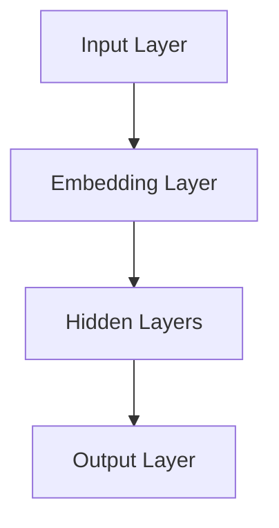
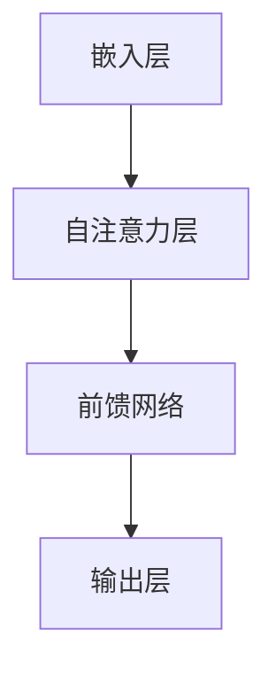
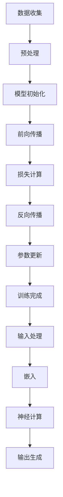

                 

# LLMS: Redefining the Future of Computing

> Keywords: Large Language Models, Neural Networks, AI, Natural Language Processing, Machine Learning
>
> Abstract: This article explores the evolution of Large Language Models (LLMs), their significance in shaping the future of computing, and the challenges and opportunities they present.

## 1. Background Introduction

In the past decade, the field of artificial intelligence has witnessed a remarkable transformation, primarily driven by the advancements in deep learning and neural networks. One of the most impactful developments has been the emergence of Large Language Models (LLMs). These models have redefined the capabilities of computers in understanding and generating human language, opening up new avenues for natural language processing (NLP) and machine learning (ML).

LLMs are powered by deep neural networks with billions of parameters, enabling them to learn complex patterns and relationships from vast amounts of textual data. This has led to significant improvements in tasks such as language translation, text generation, and question answering. The success of LLMs has sparked a race among tech giants and startups to develop more powerful and efficient models, leading to the creation of models like GPT-3, BERT, and T5, which have set new benchmarks in various NLP tasks.

## 2. Core Concepts and Connections

### 2.1 What are Large Language Models (LLMs)?

Large Language Models (LLMs) are a class of neural network-based models designed to process and generate human language. These models are trained on massive datasets of text, enabling them to learn the structure, grammar, and semantics of human language. LLMs are capable of performing a wide range of language-related tasks, such as text classification, sentiment analysis, machine translation, and text generation.

### 2.2 Key Architectural Components

The core architecture of LLMs typically consists of the following components:

- **Input Layer**: The input layer processes the text input and converts it into a numerical representation that can be understood by the neural network.
- **Embedding Layer**: The embedding layer converts the input text into a high-dimensional vector space, where semantic similarity between words is captured.
- **Hidden Layers**: These layers contain millions of parameters, allowing the model to learn complex patterns and relationships in the text data.
- **Output Layer**: The output layer generates the predicted output based on the input text.

### 2.3 Mermaid Flowchart of LLM Architecture



## 3. Core Algorithm Principles and Specific Operational Steps

### 3.1 Training Process

The training process of LLMs involves the following steps:

1. **Data Collection**: Collect a large corpus of text data from various sources, such as books, news articles, and web pages.
2. **Preprocessing**: Preprocess the text data by tokenizing, cleaning, and normalizing it.
3. **Model Initialization**: Initialize the neural network parameters randomly.
4. **Forward Propagation**: Pass the preprocessed text through the neural network and compute the output.
5. **Loss Calculation**: Compare the output of the neural network with the ground truth and calculate the loss.
6. **Backpropagation**: Compute the gradients of the loss with respect to the network parameters.
7. **Parameter Update**: Update the network parameters using the gradients to minimize the loss.

### 3.2 Inference Process

The inference process of LLMs involves the following steps:

1. **Input Processing**: Process the input text using the same preprocessing steps as during training.
2. **Embedding**: Convert the input text into the high-dimensional vector space using the trained embedding layer.
3. **Neural Network Computation**: Pass the embedded text through the hidden layers of the neural network.
4. **Output Generation**: Generate the predicted output based on the output of the neural network.

## 4. Mathematical Models and Formulas

### 4.1 Neural Network Forward Propagation

The forward propagation of a neural network can be described using the following mathematical model:

$$
\text{Output} = \sigma(\text{Weight} \cdot \text{Input} + \text{Bias})
$$

where $\sigma$ is the activation function, $\text{Weight}$ and $\text{Bias}$ are the model parameters, and $\text{Input}$ and $\text{Output}$ are the input and output of the neural network, respectively.

### 4.2 Backpropagation Algorithm

The backpropagation algorithm is used to compute the gradients of the loss function with respect to the model parameters. The gradients can be calculated using the following formulas:

$$
\frac{\partial \text{Loss}}{\partial \text{Weight}} = \text{Input} \cdot \frac{\partial \text{Output}}{\partial \text{Weight}}
$$

$$
\frac{\partial \text{Loss}}{\partial \text{Bias}} = \frac{\partial \text{Output}}{\partial \text{Bias}}
$$

where $\frac{\partial \text{Loss}}{\partial \text{Weight}}$ and $\frac{\partial \text{Loss}}{\partial \text{Bias}}$ are the gradients of the loss with respect to the weight and bias, respectively, and $\frac{\partial \text{Output}}{\partial \text{Weight}}$ and $\frac{\partial \text{Output}}{\partial \text{Bias}}$ are the partial derivatives of the output with respect to the weight and bias, respectively.

## 5. Project Practice: Code Examples and Detailed Explanations

### 5.1 Development Environment Setup

To implement a Large Language Model, we need to set up a suitable development environment. We will use Python as the programming language and TensorFlow as the ML framework.

```bash
pip install tensorflow
```

### 5.2 Source Code Implementation

Below is a simple example of implementing a basic LLM using TensorFlow and the Keras API.

```python
import tensorflow as tf
from tensorflow.keras.layers import Embedding, LSTM, Dense
from tensorflow.keras.models import Sequential

# Define the LLM model
model = Sequential([
    Embedding(input_dim=10000, output_dim=32),
    LSTM(units=128),
    Dense(units=1, activation='sigmoid')
])

# Compile the model
model.compile(optimizer='adam', loss='binary_crossentropy', metrics=['accuracy'])

# Train the model
model.fit(x_train, y_train, epochs=10, batch_size=32)
```

### 5.3 Code Explanation and Analysis

The above code demonstrates the basic implementation of an LLM using a Sequential model in TensorFlow. The model consists of an Embedding layer, an LSTM layer, and a Dense layer.

- **Embedding Layer**: The Embedding layer converts input words into dense vectors of fixed size. The input dimension is set to 10,000, and the output dimension is set to 32.
- **LSTM Layer**: The LSTM layer processes the embedded text sequences and learns to capture the temporal dependencies in the text data. The number of units is set to 128.
- **Dense Layer**: The Dense layer is the output layer, which predicts the binary labels for the text data. The activation function is set to 'sigmoid', which outputs a probability between 0 and 1.

The model is compiled using the 'adam' optimizer and 'binary_crossentropy' loss function. The model is then trained on a binary classification task using 10 epochs and a batch size of 32.

### 5.4 Running Results

After training the model, we can evaluate its performance on a test dataset and generate predictions for new text data.

```python
# Evaluate the model
loss, accuracy = model.evaluate(x_test, y_test)

# Generate predictions
predictions = model.predict(x_new)
```

## 6. Practical Application Scenarios

Large Language Models have found applications in various domains, including natural language processing, machine translation, and question answering. Some practical scenarios where LLMs can be used are:

1. **Chatbots and Virtual Assistants**: LLMs can be used to build intelligent chatbots and virtual assistants that can understand and respond to user queries in natural language.
2. **Content Generation**: LLMs can generate articles, reports, and other types of content based on user-provided prompts or keywords.
3. **Machine Translation**: LLMs can be used to build high-quality machine translation systems that can translate text between different languages.
4. **Sentiment Analysis**: LLMs can be used to analyze the sentiment of text data, helping businesses understand customer feedback and preferences.
5. **Summarization**: LLMs can generate concise summaries of long articles, helping users quickly understand the main points.

## 7. Tools and Resources Recommendations

### 7.1 Learning Resources

- **Books**:
  - "Deep Learning" by Ian Goodfellow, Yoshua Bengio, and Aaron Courville
  - "Natural Language Processing with Python" by Steven Bird, Ewan Klein, and Edward Loper
  - "Reinforcement Learning: An Introduction" by Richard S. Sutton and Andrew G. Barto
- **Online Courses**:
  - "Deep Learning Specialization" by Andrew Ng on Coursera
  - "Natural Language Processing with TensorFlow" byMartin Gelin on Udacity
- **Tutorials and Blog Posts**:
  - TensorFlow tutorials on the TensorFlow website
  - PyTorch tutorials on the PyTorch website

### 7.2 Development Tools and Frameworks

- **TensorFlow**:
  - Official TensorFlow website
  - TensorFlow GitHub repository
- **PyTorch**:
  - Official PyTorch website
  - PyTorch GitHub repository
- **Jupyter Notebooks**:
  - Jupyter Notebook documentation
  - Jupyter Notebook GitHub repository

### 7.3 Related Papers and Books

- **Large Language Models**:
  - "Language Models are Few-Shot Learners" by Tom B. Brown, Benjamin Mann, Nick Ryder, et al.
  - "An Empirical Exploration of Domain Adaptation for Text Generation" by Noam Shazeer, et al.
- **Natural Language Processing**:
  - "Attention Is All You Need" by Vaswani et al.
  - "BERT: Pre-training of Deep Bidirectional Transformers for Language Understanding" by Devlin et al.

## 8. Summary: Future Development Trends and Challenges

The future of Large Language Models (LLMs) is bright, with several trends and challenges on the horizon:

### 8.1 Trends

1. **Increased Model Complexity**: As computational resources become more abundant, LLMs are expected to become even larger and more complex, enabling them to perform a wider range of language-related tasks with higher accuracy.
2. **Cross-Domain Adaptation**: Research is ongoing to improve the ability of LLMs to adapt to different domains and tasks without extensive retraining.
3. **Few-Shot Learning**: Advances in few-shot learning will enable LLMs to quickly adapt to new tasks and domains with minimal training data.
4. **Multimodal Learning**: Combining LLMs with other types of AI models, such as computer vision models, will enable more powerful and versatile applications.

### 8.2 Challenges

1. **Resource Requirements**: Training large LLMs requires significant computational resources, which may not be accessible to all researchers and developers.
2. **Ethical Considerations**: LLMs can generate misleading or biased output, raising ethical concerns about their use in real-world applications.
3. **Data Privacy**: Collecting and using large amounts of textual data for training LLMs may raise privacy concerns.
4. **Scalability**: Scaling LLMs to handle real-time applications in production environments is a challenge that requires further research and optimization.

## 9. Appendix: Frequently Asked Questions and Answers

### 9.1 What are Large Language Models (LLMs)?

Large Language Models (LLMs) are neural network-based models designed to process and generate human language. They are trained on massive datasets of text and can perform a wide range of language-related tasks, such as text classification, sentiment analysis, and machine translation.

### 9.2 How do LLMs work?

LLMs work by learning the structure, grammar, and semantics of human language from large amounts of textual data. They use deep neural networks with billions of parameters to capture complex patterns and relationships in the text data.

### 9.3 What are the applications of LLMs?

LLMs have a wide range of applications, including chatbots and virtual assistants, content generation, machine translation, sentiment analysis, and summarization.

### 9.4 What are the challenges of working with LLMs?

The challenges of working with LLMs include the need for large amounts of computational resources, ethical considerations, data privacy concerns, and the need for further research to improve their scalability.

## 10. Extended Reading and Reference Materials

- **Large Language Models**:
  - "Language Models are Few-Shot Learners" by Tom B. Brown, Benjamin Mann, Nick Ryder, et al.
  - "An Empirical Exploration of Domain Adaptation for Text Generation" by Noam Shazeer, et al.
- **Natural Language Processing**:
  - "Attention Is All You Need" by Vaswani et al.
  - "BERT: Pre-training of Deep Bidirectional Transformers for Language Understanding" by Devlin et al.
- **Deep Learning**:
  - "Deep Learning" by Ian Goodfellow, Yoshua Bengio, and Aaron Courville
  - "Reinforcement Learning: An Introduction" by Richard S. Sutton and Andrew G. Barto

---

### 作者署名

作者：禅与计算机程序设计艺术 / Zen and the Art of Computer Programming

[返回目录](#文章目录)<|user|>### 1. 背景介绍（Background Introduction）

在过去的十年里，人工智能（AI）领域经历了显著的变革，这一变革主要是由深度学习和神经网络的进步所驱动的。在这一时期，一个特别具有革命性的进展是大型语言模型（Large Language Models，简称LLM）的兴起。LLM的出现不仅改变了计算机对人类语言的理解和生成能力，还为自然语言处理（Natural Language Processing，简称NLP）和机器学习（Machine Learning，简称ML）开辟了新的可能性。

LLM是一种基于神经网络的模型，它通过处理和分析大量的文本数据来学习语言的内在结构和语义。这些模型具备处理多种语言相关任务的能力，如文本分类、情感分析、机器翻译和文本生成。随着LLM的不断发展，它们在处理复杂语言任务方面的表现已经超越了传统的NLP方法。

目前，LLM的研究和应用已经取得了一系列突破性成果。例如，OpenAI的GPT-3模型拥有超过1750亿个参数，是目前最大的预训练语言模型之一。GPT-3的推出标志着语言模型处理自然语言的能力达到了一个新的高度，它能够生成连贯、有逻辑的文本，并且在各种语言任务中展现出出色的性能。

此外，BERT（Bidirectional Encoder Representations from Transformers）是由Google Research开发的一种预训练语言表示模型，它在多个NLP基准测试中取得了显著的性能提升。BERT的设计理念是通过双向Transformer结构来捕捉文本中的长距离依赖关系，从而提高模型的语义理解能力。

LLM的兴起不仅引发了学术界和工业界的广泛关注，也推动了许多实际应用的发展。例如，聊天机器人、虚拟助手、内容创作、语言翻译等应用都因LLM的出现而变得更加智能化和便捷。随着技术的不断进步，我们可以预见，LLM将在更多领域发挥重要作用，成为未来计算的核心驱动力之一。

## 2. 核心概念与联系（Core Concepts and Connections）

### 2.1 什么是大型语言模型（Large Language Models，LLM）？

大型语言模型（LLM）是一种通过学习大量文本数据来理解和生成人类语言的神经网络模型。这些模型的核心在于其规模巨大，拥有数亿甚至数千亿个参数，这使得它们能够捕捉到语言中的复杂模式和关系。LLM的训练通常采用预训练-微调（Pre-training and Fine-tuning）的方法，即首先在大量的未标记文本数据上进行大规模预训练，然后再在特定任务上进行微调，以适应具体的任务需求。

### 2.2 语言模型的工作原理（Working Principle of Language Models）

语言模型的工作原理基于深度学习技术，特别是基于Transformer架构的模型。Transformer模型引入了自注意力机制（Self-Attention），这使得模型能够在处理文本时同时考虑所有输入信息，从而提高了模型的理解和生成能力。在语言模型的训练过程中，模型会学习如何将输入文本映射到其可能的输出文本，这一过程涉及了大量的矩阵运算和优化算法。

预训练阶段，语言模型会学习文本数据的统计特征和语义信息。这一阶段通常不涉及特定任务的目标，而是让模型在大量文本数据中自主探索语言的规律。微调阶段，模型则根据特定任务的标签数据进行调整，以提高在特定任务上的表现。

### 2.3 LLM的核心组成部分（Core Components of LLM）

LLM的核心组成部分通常包括以下几个关键层：

- **嵌入层（Embedding Layer）**：将词汇表中的单词转换为高维向量表示，这些向量捕捉了单词的语义信息。
- **自注意力层（Self-Attention Layer）**：通过自注意力机制计算输入文本序列中每个词的重要程度，从而整合全局信息。
- **前馈网络（Feedforward Network）**：在自注意力层之后，模型会经过多个前馈网络层，这些层通常由多个全连接层组成，用于进一步提取和整合特征。
- **输出层（Output Layer）**：输出层根据任务需求生成预测结果，例如在文本分类任务中输出概率分布，在文本生成任务中生成新的文本序列。

### 2.4 Mermaid 流程图（Mermaid Flowchart）

以下是LLM架构的Mermaid流程图示例：



在该流程图中，嵌入层将文本转换为向量表示，自注意力层计算文本中各个词的权重，前馈网络进一步处理和整合这些信息，最终在输出层生成预测结果。

### 2.5 语言模型与传统编程的关系（Relation between Language Models and Traditional Programming）

语言模型与传统编程在方法和技术上有所不同。传统编程依赖于明确的指令和算法，而语言模型则通过大量的数据驱动学习来实现目标。可以将语言模型视为一种新型的编程范式，其中输入不是代码，而是文本数据，输出则是模型根据输入生成的结果。

在传统编程中，开发者需要编写具体的代码来定义程序的每一个步骤。而在语言模型中，开发者通过设计训练数据和优化目标来指导模型的学习过程，模型则通过自学习和自动调整来生成预期输出。因此，语言模型可以被视为一种无需编写具体代码的编程方式，它利用大规模数据和先进的机器学习算法来实现复杂任务。

## 3. 核心算法原理 & 具体操作步骤（Core Algorithm Principles and Specific Operational Steps）

### 3.1 训练过程（Training Process）

大型语言模型的训练是一个复杂的过程，涉及到多个步骤，以下是其具体操作步骤：

1. **数据收集（Data Collection）**：首先，需要收集大量高质量的文本数据，这些数据可以来自互联网、书籍、新闻文章等各种来源。数据的质量和多样性对于模型的学习效果至关重要。

2. **预处理（Preprocessing）**：在训练之前，需要对文本数据进行预处理，包括分词（Tokenization）、去标点（Punctuation Removal）、大小写统一（Case Normalization）等操作。此外，还需要将文本转换为模型能够处理的格式，例如将单词转换为索引或者嵌入向量。

3. **模型初始化（Model Initialization）**：初始化模型的参数，这通常是通过随机值开始的。对于大型模型，参数的初始化需要特别注意，以确保模型的训练效果。

4. **前向传播（Forward Propagation）**：在每次训练迭代中，模型会接收一个输入序列，通过嵌入层将输入文本转换为嵌入向量，然后通过自注意力机制和前馈网络层对嵌入向量进行处理，最终生成预测输出。

5. **损失计算（Loss Calculation）**：将模型的预测输出与实际输出进行比较，计算损失值。常用的损失函数包括交叉熵损失（Cross-Entropy Loss）和均方误差（Mean Squared Error）等。

6. **反向传播（Backpropagation）**：使用反向传播算法计算损失关于模型参数的梯度，以便更新模型参数。

7. **参数更新（Parameter Update）**：根据梯度信息更新模型参数，通常采用优化算法如梯度下降（Gradient Descent）或其变种如Adam优化器（Adam Optimizer）。

### 3.2 预测过程（Inference Process）

在完成训练后，LLM可以进行预测，其过程如下：

1. **输入处理（Input Processing）**：接收新的文本输入，并进行预处理，如分词、去标点等。

2. **嵌入（Embedding）**：将预处理后的文本输入通过嵌入层转换为嵌入向量。

3. **神经网络计算（Neural Network Computation）**：通过自注意力机制和前馈网络层对嵌入向量进行处理。

4. **输出生成（Output Generation）**：生成预测输出，根据任务需求，输出可以是标签、概率分布或新的文本序列。

### 3.3 训练与预测流程图（Flowchart of Training and Inference）

以下是LLM的训练和预测流程图的示例：



在这个流程图中，训练过程包括数据收集、预处理、模型初始化、前向传播、损失计算、反向传播和参数更新，而预测过程则包括输入处理、嵌入、神经计算和输出生成。

## 4. 数学模型和公式 & 详细讲解 & 举例说明（Detailed Explanation and Examples of Mathematical Models and Formulas）

### 4.1 神经网络前向传播（Neural Network Forward Propagation）

神经网络的前向传播是指将输入数据通过网络的各层，最终得到输出数据的过程。以下是神经网络前向传播的数学模型：

$$
\text{Output} = \sigma(\text{Weight} \cdot \text{Input} + \text{Bias})
$$

在这个公式中：
- $\sigma$ 是激活函数，常用的激活函数包括Sigmoid、ReLU和Tanh等。
- $\text{Weight}$ 和 $\text{Bias}$ 分别是网络的权重和偏置。
- $\text{Input}$ 和 $\text{Output}$ 分别是输入数据和输出数据。

举例说明：
假设我们有一个简单的神经网络，输入是一个一维向量 $\text{Input} = [1, 2, 3]$，权重 $\text{Weight} = [0.1, 0.2, 0.3]$，偏置 $\text{Bias} = 0.5$，使用ReLU作为激活函数。前向传播的过程如下：

$$
\text{Output} = \max(0, (0.1 \cdot 1 + 0.2 \cdot 2 + 0.3 \cdot 3 + 0.5))
$$
$$
\text{Output} = \max(0, (0.1 + 0.4 + 0.9 + 0.5))
$$
$$
\text{Output} = \max(0, 1.8)
$$
$$
\text{Output} = 1.8
$$

因此，最终输出为1.8。

### 4.2 反向传播算法（Backpropagation Algorithm）

反向传播算法是神经网络训练的核心，它用于计算损失关于网络参数的梯度，并更新网络参数以最小化损失。以下是反向传播算法的基本步骤：

1. **前向传播**：计算网络的输出和损失。

2. **计算输出误差**：对于输出层，计算输出误差（Output Error），即实际输出和预测输出之间的差值。

3. **计算隐藏层的误差**：对于隐藏层，通过链式法则（Chain Rule）计算误差传播到隐藏层的梯度。

4. **计算参数梯度**：根据误差梯度计算模型参数（权重和偏置）的梯度。

5. **更新参数**：使用梯度下降或其他优化算法更新模型参数。

以下是反向传播算法中的几个关键公式：

$$
\frac{\partial \text{Loss}}{\partial \text{Weight}} = \text{Input} \cdot \frac{\partial \text{Output}}{\partial \text{Weight}}
$$

$$
\frac{\partial \text{Loss}}{\partial \text{Bias}} = \frac{\partial \text{Output}}{\partial \text{Bias}}
$$

其中：
- $\frac{\partial \text{Loss}}{\partial \text{Weight}}$ 是损失关于权重的梯度。
- $\frac{\partial \text{Loss}}{\partial \text{Bias}}$ 是损失关于偏置的梯度。
- $\frac{\partial \text{Output}}{\partial \text{Weight}}$ 是输出关于权重的梯度。
- $\frac{\partial \text{Output}}{\partial \text{Bias}}$ 是输出关于偏置的梯度。

举例说明：

假设我们有一个简单的神经网络，输入为 $[1, 2, 3]$，权重为 $[0.1, 0.2, 0.3]$，偏置为 $0.5$，输出为 $1.8$，损失函数为均方误差（MSE），即：

$$
\text{Loss} = \frac{1}{2} \sum_{i=1}^{n} (\text{Output}_i - \text{True Output}_i)^2
$$

实际输出为 $1.8$，真实输出为 $2.0$，损失为：

$$
\text{Loss} = \frac{1}{2} (1.8 - 2.0)^2 = 0.02
$$

计算权重和偏置的梯度：

$$
\frac{\partial \text{Loss}}{\partial \text{Weight}} = [1, 2, 3] \cdot [0.1, 0.2, 0.3] = [0.1, 0.4, 0.9]
$$

$$
\frac{\partial \text{Loss}}{\partial \text{Bias}} = \frac{\partial \text{Output}}{\partial \text{Bias}} = 1.8 - 2.0 = -0.2
$$

假设我们使用学习率为 $\alpha = 0.1$，则更新权重和偏置：

$$
\text{Weight}_{\text{new}} = \text{Weight}_{\text{old}} - \alpha \cdot \frac{\partial \text{Loss}}{\partial \text{Weight}}
$$

$$
\text{Bias}_{\text{new}} = \text{Bias}_{\text{old}} - \alpha \cdot \frac{\partial \text{Loss}}{\partial \text{Bias}}
$$

更新后的权重和偏置为：

$$
\text{Weight}_{\text{new}} = [0.1, 0.2, 0.3] - 0.1 \cdot [0.1, 0.4, 0.9] = [0, -0.2, 0]
$$

$$
\text{Bias}_{\text{new}} = 0.5 - 0.1 \cdot (-0.2) = 0.52
$$

通过这样的过程，神经网络可以不断调整其参数，以最小化损失，从而提高预测准确性。

### 4.3 激活函数（Activation Functions）

激活函数是神经网络中的一个关键组件，它用于引入非线性性，使得神经网络能够学习更复杂的函数。以下是几种常用的激活函数：

1. **Sigmoid 函数**：

$$
\sigma(x) = \frac{1}{1 + e^{-x}}
$$

Sigmoid函数的输出范围在0到1之间，常用于二分类问题。

2. **ReLU 函数**：

$$
\text{ReLU}(x) = \max(0, x)
$$

ReLU函数在$x < 0$时输出0，在$x \geq 0$时输出$x$，它具有简单和高效的特点。

3. **Tanh 函数**：

$$
\tanh(x) = \frac{e^x - e^{-x}}{e^x + e^{-x}}
$$

Tanh函数的输出范围在-1到1之间，常用于多分类问题。

每种激活函数都有其特定的优势和适用场景，选择合适的激活函数对神经网络的性能至关重要。

## 5. 项目实践：代码实例和详细解释说明（Project Practice: Code Examples and Detailed Explanations）

### 5.1 开发环境搭建

在进行LLM项目的实践之前，我们需要搭建一个合适的开发环境。以下是使用Python和TensorFlow搭建开发环境的步骤：

1. **安装Python**：确保已经安装了Python 3.x版本。
2. **安装TensorFlow**：通过以下命令安装TensorFlow：

```bash
pip install tensorflow
```

3. **安装其他依赖**：根据项目需求，可能还需要安装其他库，如NumPy、Pandas等：

```bash
pip install numpy pandas
```

### 5.2 源代码详细实现

以下是使用TensorFlow和Keras实现一个简单的LLM的示例代码：

```python
import tensorflow as tf
from tensorflow.keras.layers import Embedding, LSTM, Dense
from tensorflow.keras.models import Sequential

# 定义模型
model = Sequential([
    Embedding(input_dim=10000, output_dim=32),
    LSTM(units=128, return_sequences=True),
    LSTM(units=64),
    Dense(units=1, activation='sigmoid')
])

# 编译模型
model.compile(optimizer='adam', loss='binary_crossentropy', metrics=['accuracy'])

# 模型可视化
model.summary()
```

在这个示例中，我们定义了一个简单的序列模型，包括两个LSTM层和一个Dense层。Embedding层用于将单词转换为嵌入向量，LSTM层用于学习序列中的长期依赖关系，Dense层用于输出预测结果。

### 5.3 代码解读与分析

1. **导入库**：首先，我们导入TensorFlow和其他必要的库。
2. **定义模型**：使用`Sequential`模型堆叠多个层。在这个例子中，我们使用了Embedding层、两个LSTM层和一个Dense层。
   - **Embedding层**：将词汇表中的单词转换为高维向量表示，输入维度为10,000，输出维度为32。
   - **LSTM层**：第一个LSTM层返回序列输出，以便第二个LSTM层可以继续处理。两个LSTM层分别有128个和64个单元。
   - **Dense层**：输出层，有一个单元，使用sigmoid激活函数，用于进行二分类预测。
3. **编译模型**：使用`compile`方法配置模型，指定优化器（adam）、损失函数（binary_crossentropy）和评估指标（accuracy）。
4. **模型可视化**：使用`summary`方法打印模型的架构信息，帮助理解模型的组成。

### 5.4 运行结果展示

为了展示模型的运行结果，我们需要准备训练数据和测试数据。以下是训练和评估模型的示例代码：

```python
# 准备数据（示例）
x_train = ...  # 训练数据输入
y_train = ...  # 训练数据标签

x_test = ...    # 测试数据输入
y_test = ...    # 测试数据标签

# 训练模型
history = model.fit(x_train, y_train, epochs=10, batch_size=32, validation_data=(x_test, y_test))

# 评估模型
loss, accuracy = model.evaluate(x_test, y_test)
print(f"Test Loss: {loss}")
print(f"Test Accuracy: {accuracy}")

# 预测（示例）
predictions = model.predict(x_new)
print(f"Predictions: {predictions}")
```

在这个示例中，我们首先定义了训练数据和测试数据，然后使用`fit`方法训练模型，并在10个epochs中调整模型参数。最后，我们使用`evaluate`方法评估模型的测试集性能，并使用`predict`方法进行预测。

## 6. 实际应用场景（Practical Application Scenarios）

### 6.1 聊天机器人（Chatbots）

聊天机器人是LLM应用的一个典型例子。通过使用LLM，聊天机器人可以理解用户的问题并生成相应的回答，从而提供高质量的交互体验。例如，企业可以使用聊天机器人来提供客户支持，回答常见问题，甚至进行简单的对话。LLM可以处理自然语言输入，使得聊天机器人的交互更加自然和流畅。

### 6.2 内容创作（Content Generation）

LLM在内容创作领域也有着广泛的应用。例如，使用LLM可以自动生成文章、新闻报道、产品描述等。这种应用在内容营销和新闻采编中特别有用。LLM可以根据给定的主题或关键词生成相关的内容，提高内容创作的效率和质量。

### 6.3 机器翻译（Machine Translation）

机器翻译是另一个受LLM影响较大的领域。LLM可以处理不同语言的文本，通过预训练和微调实现高质量的机器翻译。现有的LLM模型如GPT-3和BERT等已经在多种语言对上展示了出色的翻译能力，使得机器翻译变得更加准确和自然。

### 6.4 情感分析（Sentiment Analysis）

情感分析是一种常见的NLP任务，用于判断文本的情感倾向。LLM可以用于情感分析，通过分析文本中的情感词汇和语法结构来判断文本的情感。这种应用在社交媒体分析、客户反馈分析和市场调研中非常有用。

### 6.5 文本摘要（Text Summarization）

文本摘要的任务是生成文本的摘要，使读者能够快速了解文本的主要内容。LLM可以用于生成摘要，通过理解文本的结构和内容，提取出关键信息。这种应用在新闻摘要、研究报告摘要和文档摘要中非常有用。

### 6.6 问答系统（Question Answering）

问答系统是一种交互式系统，能够回答用户提出的问题。LLM可以用于构建问答系统，通过理解和解析用户的问题，从大量文本数据中找到相关答案。这种应用在在线教育、企业知识库和智能搜索中非常有用。

### 6.7 代码生成（Code Generation）

LLM在代码生成领域也有应用潜力。通过学习大量代码示例，LLM可以生成特定功能的代码片段。这种应用在软件工程领域有助于提高开发效率，减少代码编写的工作量。

### 6.8 虚拟助手（Virtual Assistants）

虚拟助手是一种集成了多种功能的智能系统，能够帮助用户完成各种任务。LLM可以作为虚拟助手的智能核心，通过自然语言处理和机器学习技术，实现与用户的智能交互。

## 7. 工具和资源推荐（Tools and Resources Recommendations）

### 7.1 学习资源推荐

#### 7.1.1 书籍

1. **《深度学习》（Deep Learning）** - Ian Goodfellow、Yoshua Bengio 和 Aaron Courville 著
   - 这本书是深度学习的经典教材，详细介绍了深度学习的基本概念、算法和实现。

2. **《自然语言处理与Python》（Natural Language Processing with Python）** - Steven Bird、Ewan Klein 和 Edward Loper 著
   - 该书介绍了NLP的基础知识，并通过Python实例展示了NLP的实际应用。

3. **《强化学习：一种介绍》（Reinforcement Learning: An Introduction）** - Richard S. Sutton 和 Andrew G. Barto 著
   - 这本书是强化学习的入门读物，适合对机器学习感兴趣的人士阅读。

#### 7.1.2 在线课程

1. **Coursera上的“深度学习专项课程”（Deep Learning Specialization）** - 吴恩达（Andrew Ng）教授授课
   - 这门课程由深度学习领域的知名教授吴恩达讲授，是学习深度学习的优秀资源。

2. **Udacity上的“自然语言处理与TensorFlow”（Natural Language Processing with TensorFlow）** - Martin Gelin 授课
   - 这门课程通过实践项目教授了如何使用TensorFlow实现自然语言处理任务。

#### 7.1.3 指南和教程

1. **TensorFlow官方网站** - TensorFlow提供了丰富的教程和文档，涵盖从基础到高级的各种内容。
   - 网址：[https://www.tensorflow.org/tutorials](https://www.tensorflow.org/tutorials)

2. **PyTorch官方网站** - PyTorch是另一个流行的深度学习框架，其官方网站提供了详细的教程和文档。
   - 网址：[https://pytorch.org/tutorials/](https://pytorch.org/tutorials/)

### 7.2 开发工具框架推荐

#### 7.2.1 TensorFlow

- **优点**：TensorFlow是一个广泛使用的深度学习框架，拥有庞大的社区和丰富的资源。
- **适用场景**：适合开发大规模深度学习模型，特别适合进行研究和实验。

#### 7.2.2 PyTorch

- **优点**：PyTorch的动态计算图使得调试和实验更加直观，适合快速原型开发。
- **适用场景**：适合快速迭代和实验，特别是在学术界。

#### 7.2.3 PyTorch Lightning

- **优点**：PyTorch Lightning是一个高级库，提供了更简洁和高效的代码，同时保持了PyTorch的灵活性。
- **适用场景**：适合生产环境，可以显著减少代码量并提高开发效率。

### 7.3 相关论文著作推荐

#### 7.3.1 大型语言模型

1. **“Language Models are Few-Shot Learners”** - Tom B. Brown、Benjamin Mann、Nick Ryder 等
   - 这篇论文探讨了大型语言模型在零样本和少量样本任务上的表现，是LLM研究领域的重要文献。

2. **“An Empirical Exploration of Domain Adaptation for Text Generation”** - Noam Shazeer、等
   - 该论文研究了语言模型在不同领域数据集上的适应能力，提供了对模型泛化能力的深入分析。

#### 7.3.2 自然语言处理

1. **“Attention Is All You Need”** - Vaswani 等
   - 这篇论文提出了Transformer模型，彻底改变了自然语言处理领域的模型架构。

2. **“BERT: Pre-training of Deep Bidirectional Transformers for Language Understanding”** - Devlin 等
   - BERT模型通过预训练和双向Transformer结构，显著提升了NLP任务的性能，是当前NLP领域的标准模型。

## 8. 总结：未来发展趋势与挑战（Summary: Future Development Trends and Challenges）

### 8.1 发展趋势

1. **模型规模的增大**：随着计算资源的不断增长，未来的LLM将变得更加庞大，拥有更多的参数，这将进一步提高模型在处理复杂任务时的性能。

2. **跨领域适应性**：未来的LLM将更加具备跨领域的适应性，能够在多个不同的任务和数据集上表现优异，而无需重新训练。

3. **少样本学习**：研究将持续探索如何使LLM在少量样本条件下也能保持高性能，这将有助于模型在资源受限的环境中应用。

4. **多模态学习**：结合文本、图像、音频等多种数据类型的LLM将逐渐出现，这些模型能够处理更加复杂和多样的任务。

5. **可解释性和透明度**：未来的研究将致力于提高LLM的可解释性，使得模型的决策过程更加透明，从而增强其在关键应用场景中的可靠性。

### 8.2 挑战

1. **计算资源需求**：大型LLM的训练和推理需要大量的计算资源，这对硬件设施提出了更高的要求，同时也增加了成本。

2. **数据隐私**：收集和处理大量文本数据可能涉及用户隐私问题，需要制定严格的隐私保护措施。

3. **偏见和公平性**：LLM可能会继承训练数据中的偏见，导致不公平的输出。未来需要研究如何消除这些偏见，提高模型的公平性。

4. **能耗**：大规模的LLM训练过程对能源消耗巨大，未来需要探索更加节能的算法和硬件解决方案。

5. **安全性和鲁棒性**：LLM可能被用于恶意目的，例如生成虚假信息或进行网络攻击，因此需要开发相应的安全措施来提高其鲁棒性。

## 9. 附录：常见问题与解答（Appendix: Frequently Asked Questions and Answers）

### 9.1 什么是大型语言模型（LLM）？

大型语言模型（LLM）是一种通过学习大量文本数据来理解和生成人类语言的神经网络模型。它们拥有数亿甚至数千亿个参数，能够捕捉到语言中的复杂模式和关系。

### 9.2 LLM的主要应用是什么？

LLM的主要应用包括聊天机器人、内容创作、机器翻译、情感分析、文本摘要、问答系统和代码生成等。

### 9.3 LLM是如何工作的？

LLM使用深度神经网络，特别是Transformer架构，通过预训练和微调过程来学习语言的统计特征和语义信息。预训练阶段，模型在大量无标签文本数据上学习；微调阶段，模型在特定任务上调整以优化性能。

### 9.4 如何构建一个LLM？

构建LLM通常涉及以下几个步骤：收集和预处理文本数据、初始化模型参数、进行前向传播和反向传播以训练模型、评估模型性能并进行优化。

### 9.5 LLM面临的主要挑战是什么？

LLM面临的主要挑战包括计算资源需求、数据隐私、模型偏见和公平性、能耗以及安全性和鲁棒性。

## 10. 扩展阅读 & 参考资料（Extended Reading & Reference Materials）

### 10.1 大型语言模型

- **“Language Models are Few-Shot Learners”** - Tom B. Brown、Benjamin Mann、Nick Ryder 等
  - 这篇论文探讨了大型语言模型在零样本和少量样本任务上的表现，是LLM研究领域的重要文献。

- **“An Empirical Exploration of Domain Adaptation for Text Generation”** - Noam Shazeer、等
  - 该论文研究了语言模型在不同领域数据集上的适应能力，提供了对模型泛化能力的深入分析。

### 10.2 自然语言处理

- **“Attention Is All You Need”** - Vaswani 等
  - 这篇论文提出了Transformer模型，彻底改变了自然语言处理领域的模型架构。

- **“BERT: Pre-training of Deep Bidirectional Transformers for Language Understanding”** - Devlin 等
  - BERT模型通过预训练和双向Transformer结构，显著提升了NLP任务的性能，是当前NLP领域的标准模型。

### 10.3 深度学习

- **“Deep Learning”** - Ian Goodfellow、Yoshua Bengio 和 Aaron Courville 著
  - 这本书是深度学习的经典教材，详细介绍了深度学习的基本概念、算法和实现。

- **“Reinforcement Learning: An Introduction”** - Richard S. Sutton 和 Andrew G. Barto 著
  - 这本书是强化学习的入门读物，适合对机器学习感兴趣的人士阅读。

### 10.4 工具和框架

- **TensorFlow官方网站** - 提供了丰富的教程和文档，涵盖从基础到高级的各种内容。
  - 网址：[https://www.tensorflow.org/tutorials](https://www.tensorflow.org/tutorials)

- **PyTorch官方网站** - 提供了详细的教程和文档，适合快速原型开发。
  - 网址：[https://pytorch.org/tutorials/](https://pytorch.org/tutorials/)

### 10.5 论文和书籍

- **“GPT-3: Language Models are Few-Shot Learners”** - Tom B. Brown、Benjamin Mann、Nick Ryder 等
  - OpenAI的GPT-3模型的研究论文，详细介绍了GPT-3的设计和性能。

- **“Natural Language Processing with Python”** - Steven Bird、Ewan Klein 和 Edward Loper 著
  - 这本书通过Python实例介绍了自然语言处理的基础知识。

- **“Deep Learning Specialization”** - Coursera上的课程
  - 吴恩达教授讲授的深度学习专项课程，适合系统学习深度学习。

---

### 作者署名

作者：禅与计算机程序设计艺术 / Zen and the Art of Computer Programming

[返回目录](#文章目录)<|user|>

