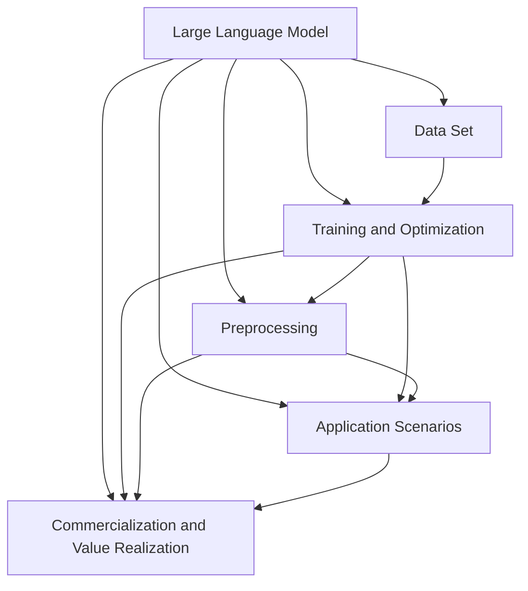

                 

### 背景介绍（Background Introduction）

随着人工智能技术的迅猛发展，大型语言模型（LLM，Large Language Model）如ChatGPT、GPT-3等已成为当今科技领域的一大热点。LLM不仅在自然语言处理（NLP，Natural Language Processing）领域展现出强大的能力，还在问答系统、文本生成、机器翻译、代码生成等领域取得了显著成果。这些突破性的进展为各行各业带来了前所未有的机遇，同时也引发了广泛的讨论和思考。然而，LLM的发展不仅依赖于技术创新，还涉及产业生态的构建与优化。在这个背景下，本文将探讨LLM产业链的构成、核心环节以及未来发展的新机遇。

本文将从以下几个方面展开讨论：

1. **LLM产业链概述**：介绍LLM产业链的基本构成，包括关键环节和参与主体。
2. **核心概念与联系**：深入探讨LLM产业链中的核心概念，如大型语言模型的原理、数据集的构建、模型训练与优化的技术细节。
3. **数学模型和公式**：分析LLM中的数学模型和公式，阐述其作用和重要性。
4. **项目实践**：通过具体代码实例，展示LLM的实际应用场景。
5. **实际应用场景**：探讨LLM在不同领域的应用现状与未来趋势。
6. **工具和资源推荐**：为读者提供学习资源和开发工具的推荐。
7. **未来发展趋势与挑战**：总结LLM产业链的未来发展趋势，分析面临的挑战。

通过以上讨论，我们希望为读者提供一幅全面、清晰的LLM产业链全景图，并探讨其带来的新机遇。让我们一起探索这个充满潜力的领域。

## 1. LLM产业链概述（Overview of LLM Industry Chain）

LLM产业链是一个复杂而庞大的系统，涉及多个关键环节和众多参与主体。为了更好地理解这个产业生态，我们可以将其划分为以下几个主要部分：基础数据集构建、模型研发与优化、应用开发与推广、以及商业化运作。

### 1.1 基础数据集构建（Data Set Construction）

数据集是LLM训练和优化的基础。一个高质量的、多样化的数据集可以显著提升模型的效果。数据集的构建包括数据收集、清洗、标注和整合等多个步骤。在这个环节中，通常需要大量的人力、物力和财力投入。关键参与者包括数据供应商、数据清洗公司、标注团队等。

- **数据供应商**：提供各类公开或商业数据源，如文本、语音、图像等。
- **数据清洗公司**：负责数据清洗和预处理，确保数据质量。
- **标注团队**：对数据进行标注，为模型训练提供准确的标签。

### 1.2 模型研发与优化（Model Research and Optimization）

在模型研发与优化环节，研究人员通过不断探索和实验，开发出高效的LLM模型。这个过程涉及算法设计、模型架构优化、训练策略调整等多个方面。关键参与者包括科研机构、科技公司、AI初创企业等。

- **科研机构**：进行基础研究和理论探索，推动技术进步。
- **科技公司**：将研究成果应用于实际产品，进行模型研发和优化。
- **AI初创企业**：专注于特定领域的模型研发和应用。

### 1.3 应用开发与推广（Application Development and Promotion）

模型研发完成后，需要将其应用到实际场景中，解决实际问题。应用开发与推广环节包括场景挖掘、需求分析、功能实现、性能优化等多个步骤。关键参与者包括软件开发公司、系统集成商、咨询服务公司等。

- **软件开发公司**：负责开发和维护应用程序，提供技术支持。
- **系统集成商**：将LLM技术与现有系统进行集成，实现定制化解决方案。
- **咨询服务公司**：提供战略咨询和实施指导，帮助客户最大化价值。

### 1.4 商业化运作（Commercial Operations）

商业化运作是LLM产业链的最终环节，包括产品定价、市场推广、销售渠道建设、客户服务等。商业化运作的成功与否直接关系到LLM技术的市场接受度和商业价值。关键参与者包括企业、投资机构、市场推广团队等。

- **企业**：作为商业化主体，负责产品开发和市场推广。
- **投资机构**：提供资金支持，助力企业成长和扩张。
- **市场推广团队**：制定和执行市场推广策略，提升品牌知名度。

通过以上环节的协同运作，LLM产业链得以形成一个完整的生态系统。在这个过程中，各个环节相互依存、相互促进，共同推动着LLM技术的发展和商业应用。

-----------------------

## 2. 核心概念与联系（Core Concepts and Connections）

在探讨LLM产业链之前，我们需要理解几个核心概念，这些概念不仅构成了LLM技术的基础，也决定了其在实际应用中的效果。以下是几个关键概念及其相互关系：

### 2.1 大型语言模型（Large Language Model）

大型语言模型（LLM）是一种深度学习模型，具有处理和理解自然语言的能力。LLM通常由数百万甚至数十亿个参数组成，能够通过大规模文本数据进行训练，从而掌握语言的内在结构和规律。LLM的核心目标是生成连贯、准确、有意义的文本。

### 2.2 数据集（Data Set）

数据集是LLM训练的基石。一个高质量、多样化的数据集可以显著提升模型的性能。数据集通常包含各种文本来源，如书籍、新闻、社交媒体等。数据集的质量直接影响模型的效果，因此数据收集、清洗和标注是至关重要的环节。

### 2.3 训练与优化（Training and Optimization）

LLM的训练和优化是模型研发的关键步骤。训练过程涉及将数据输入模型，并通过反向传播算法更新模型参数，以最小化损失函数。优化过程则通过调整学习率、正则化参数等，提高模型的泛化能力和鲁棒性。

### 2.4 预处理（Preprocessing）

预处理是指在训练数据输入模型之前对其进行的一系列处理。这包括文本清洗、分词、词嵌入等。预处理的质量直接影响模型对数据的理解能力。

### 2.5 应用场景（Application Scenarios）

应用场景是指LLM技术可以发挥作用的实际领域。从问答系统、文本生成、机器翻译到代码生成，LLM在各个领域都展现出巨大的潜力。理解这些应用场景有助于我们更好地利用LLM技术解决实际问题。

### 2.6 商业化与价值实现（Commercialization and Value Realization）

商业化与价值实现是LLM产业链的最终目标。通过将LLM技术应用于实际业务场景，企业可以创造巨大的商业价值。例如，智能客服、智能写作、个性化推荐等，都是LLM商业化的重要方向。

下面是一个使用Mermaid绘制的流程图，展示了LLM产业链中的核心概念及其相互关系：



通过以上核心概念的阐述和Mermaid流程图的展示，我们可以更好地理解LLM产业链的运作机制，为后续内容的深入探讨奠定基础。

## 2.1 大型语言模型（Large Language Model）

大型语言模型（LLM）是当今自然语言处理（NLP，Natural Language Processing）领域的一项重要技术突破。LLM通过深度学习算法，从大规模的文本数据中学习语言模式，具备理解、生成和翻译自然语言的能力。其核心优势在于能够处理复杂、上下文相关的任务，从而在诸多应用场景中展现出卓越的表现。

### 2.1.1 原理（Principles）

LLM的原理基于深度神经网络（DNN，Deep Neural Network）和变换器模型（Transformer Model）。传统的循环神经网络（RNN，Recurrent Neural Network）在处理长序列时存在梯度消失或梯度爆炸的问题，而变换器模型通过自注意力机制（Self-Attention Mechanism）有效地解决了这一问题。变换器模型由编码器（Encoder）和解码器（Decoder）组成，编码器负责将输入文本编码为固定长度的向量，解码器则利用这些向量生成输出文本。

### 2.1.2 架构（Architecture）

LLM的架构通常包含以下几个关键组成部分：

1. **嵌入层（Embedding Layer）**：将输入的单词或子词转换为固定长度的向量。
2. **自注意力层（Self-Attention Layer）**：通过计算输入文本中每个单词之间的关联性，生成代表整个文本的上下文向量。
3. **前馈神经网络（Feedforward Neural Network）**：对自注意力层的输出进行进一步的加工和变换。
4. **解码器（Decoder）**：利用编码器的输出生成输出文本。

### 2.1.3 工作流程（Workflow）

LLM的工作流程主要包括以下几个步骤：

1. **文本输入（Input Text）**：用户输入一段文本或问题。
2. **编码（Encoding）**：LLM将输入文本编码为向量。
3. **自注意力计算（Self-Attention Calculation）**：通过自注意力机制计算文本中每个单词的关联性。
4. **前馈网络处理（Feedforward Processing）**：对自注意力层的输出进行加工，生成上下文向量。
5. **解码（Decoding）**：LLM利用解码器生成输出文本。

通过以上流程，LLM能够理解和生成自然语言，为各种应用场景提供强大支持。

-----------------------

## 2.2 数据集（Data Set）

数据集是训练和优化大型语言模型（LLM）的基础，其质量和多样性直接影响模型的表现。一个高质量的数据集应该具备以下几个特点：

1. **多样性（Diversity）**：数据集应涵盖不同的主题、语言风格和表达方式，以确保模型能够学习到广泛的语言模式。
2. **准确性（Accuracy）**：数据集的标注应准确无误，以避免模型学习到错误的规律。
3. **完整性（Completeness）**：数据集应包含足够的数据量，以确保模型在训练过程中有足够的样本进行学习。
4. **一致性（Consistency）**：数据集中的数据应保持一致性，避免出现矛盾或冲突的信息。

### 2.2.1 数据来源（Data Sources）

构建高质量的数据集需要多种数据来源：

1. **公开数据集**：如维基百科、新闻网站、社交媒体等。
2. **私有数据集**：企业或研究机构内部积累的数据，如用户评论、电子邮件等。
3. **标注数据集**：由专业标注团队进行标注的数据集，如问答对、对话记录等。

### 2.2.2 数据预处理（Data Preprocessing）

在构建数据集时，通常需要进行一系列预处理步骤：

1. **数据清洗（Data Cleaning）**：去除无关数据、错误数据和无用数据。
2. **文本清洗（Text Cleaning）**：去除标点符号、停用词、HTML标签等。
3. **分词（Tokenization）**：将文本分割为单词、子词或字符。
4. **词嵌入（Word Embedding）**：将单词或子词映射为固定长度的向量。

### 2.2.3 数据标注（Data Annotation）

数据标注是构建高质量数据集的重要环节。标注过程通常包括以下步骤：

1. **分类标注（Categorical Annotation）**：对文本进行分类，如新闻分类、情感分析等。
2. **实体标注（Entity Annotation）**：标注文本中的实体，如人名、地点、组织等。
3. **关系标注（Relationship Annotation）**：标注实体之间的关系，如因果、上下级等。
4. **对话标注（Dialogue Annotation）**：对对话进行结构化标注，如意图、轮换等。

通过以上步骤，我们可以构建一个高质量、多样化、准确的数据集，为LLM的训练和优化提供坚实的基础。

-----------------------

## 2.3 训练与优化（Training and Optimization）

训练与优化是构建高性能大型语言模型（LLM）的关键步骤。在这一环节中，我们不仅需要选择合适的算法和架构，还需要对模型进行精细的调优，以确保其能够在各种任务中达到最佳性能。以下是LLM训练与优化过程中的核心概念和具体操作步骤：

### 2.3.1 训练算法（Training Algorithms）

LLM的训练算法通常基于深度学习框架，其中最常用的算法包括：

1. **反向传播算法（Backpropagation Algorithm）**：通过计算损失函数的梯度，更新模型参数，从而优化模型性能。
2. **优化器（Optimizer）**：如Adam、SGD等，用于调整学习率和其他超参数，提高训练效率。
3. **批量大小（Batch Size）**：控制每次更新模型参数所用的样本数量，对训练时间和性能有重要影响。

### 2.3.2 训练过程（Training Process）

LLM的训练过程可以分为以下几个步骤：

1. **数据预处理（Data Preprocessing）**：对输入文本进行清洗、分词、编码等操作，将文本转换为模型可接受的格式。
2. **模型初始化（Model Initialization）**：初始化模型参数，通常采用随机初始化或预训练模型。
3. **前向传播（Forward Propagation）**：将预处理后的数据输入模型，计算输出并计算损失函数。
4. **反向传播（Backpropagation）**：计算损失函数关于模型参数的梯度，更新模型参数。
5. **迭代（Iteration）**：重复前向传播和反向传播过程，直到模型收敛或达到预设的训练次数。

### 2.3.3 优化策略（Optimization Strategies）

为了提高LLM的性能，我们通常需要采用一系列优化策略：

1. **学习率调整（Learning Rate Adjustment）**：通过减小学习率，提高模型的泛化能力。
2. **正则化（Regularization）**：如L1、L2正则化，防止模型过拟合。
3. **dropout（Dropout）**：在训练过程中随机丢弃一部分神经元，提高模型的鲁棒性。
4. **数据增强（Data Augmentation）**：通过随机变换或生成新的数据，增加模型的训练样本。
5. **迁移学习（Transfer Learning）**：利用预训练模型进行微调，提高新任务的性能。

### 2.3.4 模型评估（Model Evaluation）

在训练和优化过程中，我们需要定期对模型进行评估，以检查其性能是否达到预期。常用的评估指标包括：

1. **损失函数（Loss Function）**：如交叉熵损失、均方误差等，用于衡量模型预测与真实值之间的差距。
2. **准确率（Accuracy）**：模型正确预测的比例，常用于分类任务。
3. **F1分数（F1 Score）**：综合考虑准确率和召回率，适用于不平衡分类问题。
4. **BLEU分数（BLEU Score）**：用于评估文本生成的质量，常用于机器翻译任务。

通过以上训练与优化策略，我们可以构建一个高性能、高精度的LLM模型，为各种自然语言处理任务提供强大的支持。

-----------------------

## 2.4 预处理（Preprocessing）

预处理是构建大型语言模型（LLM）过程中至关重要的一步。合理的预处理不仅能提高模型性能，还能减少后续训练和优化的复杂性。以下是LLM预处理的主要步骤和注意事项：

### 2.4.1 数据清洗（Data Cleaning）

数据清洗是预处理的首要步骤，旨在去除数据中的噪声和无关信息，以提高数据质量。具体操作包括：

1. **去除重复数据（Remove Duplicates）**：避免模型在重复数据上过度拟合。
2. **去除无用标签（Remove Useless Labels）**：对于某些任务，某些标签可能对模型性能没有显著影响，可以予以去除。
3. **修复错误数据（Fix Errors）**：纠正数据中的拼写错误、语法错误等。

### 2.4.2 文本清洗（Text Cleaning）

文本清洗旨在去除文本中的无关信息，如HTML标签、特殊字符、停用词等。主要步骤包括：

1. **去除HTML标签（Remove HTML Tags）**：去除文本中的HTML标记，保留纯文本内容。
2. **去除特殊字符（Remove Special Characters）**：去除非字母数字字符，如标点符号、符号等。
3. **去除停用词（Remove Stop Words）**：停用词是指对文本理解没有实质性贡献的词汇，如“的”、“了”、“是”等。

### 2.4.3 分词（Tokenization）

分词是将文本分割为单词、子词或字符的过程。对于LLM，通常采用子词级别的分词，以提高模型的识别能力。常见分词方法包括：

1. **Word-Level Tokenization**：将文本分割为单词，适用于基于词的模型。
2. **Subword-Level Tokenization**：将文本分割为子词，如字节对编码（Byte Pair Encoding, BPE），适用于大规模文本数据。

### 2.4.4 词嵌入（Word Embedding）

词嵌入是将单词或子词映射为固定长度的向量。常用的词嵌入方法包括：

1. **Word2Vec**：基于神经网络的方法，通过训练词向量模型，将单词映射为低维向量。
2. **GloVe**：基于全局向量平均的方法，通过矩阵分解计算词向量。
3. **BERT**：基于变换器模型的方法，通过预训练和微调生成高质量的词向量。

### 2.4.5 注意事项（Considerations）

在进行预处理时，需要注意以下几点：

1. **保持一致性（Consistency）**：确保预处理步骤在所有数据上保持一致，避免引入偏倚。
2. **数据平衡（Data Balance）**：对于不平衡的数据集，可以考虑数据增强或采样策略，提高模型对少数类别的识别能力。
3. **可扩展性（Scalability）**：预处理步骤应易于扩展，以适应不同的数据规模和应用场景。

通过以上预处理步骤，我们可以为LLM训练提供高质量的数据，从而提高模型性能和泛化能力。

-----------------------

## 2.5 应用场景（Application Scenarios）

大型语言模型（LLM）凭借其强大的自然语言处理能力，已经在众多实际应用场景中展现出显著的效果。以下是LLM在一些关键领域的应用场景及其对现有技术和行业的变革：

### 2.5.1 自然语言处理（NLP，Natural Language Processing）

自然语言处理是LLM最直接的应用领域。LLM在文本分类、情感分析、命名实体识别、机器翻译等方面表现出色，显著提升了NLP任务的准确性和效率。具体应用包括：

1. **文本分类（Text Classification）**：例如，垃圾邮件过滤、新闻分类、情感分析等。
2. **情感分析（Sentiment Analysis）**：分析社交媒体上的用户评论、产品评价等，帮助企业了解消费者需求。
3. **命名实体识别（Named Entity Recognition，NER）**：识别文本中的人名、地名、组织名等，为信息提取和知识图谱构建提供支持。
4. **机器翻译（Machine Translation）**：如谷歌翻译、百度翻译等，LLM的应用使得机器翻译更加准确、自然。

### 2.5.2 问答系统（Question Answering，QA）

问答系统是LLM的重要应用之一，通过理解用户的问题，生成准确、连贯的答案。LLM在QA系统中的应用，使得系统能够处理更复杂、更自然的问题，提高了用户体验。具体应用包括：

1. **搜索引擎（Search Engine）**：如百度搜索、谷歌搜索等，LLM的应用使得搜索结果更加精准、相关。
2. **虚拟助手（Virtual Assistant）**：如苹果的Siri、亚马逊的Alexa等，LLM使得虚拟助手能够更好地理解用户的问题，提供更智能的回复。
3. **在线客服（Online Customer Service）**：通过LLM驱动的问答系统，企业可以提供24/7的智能客服服务，提高客户满意度。

### 2.5.3 文本生成（Text Generation）

LLM在文本生成领域也展现出强大的能力，可以生成文章、段落、对话等，广泛应用于内容创作和自动化写作。具体应用包括：

1. **内容创作（Content Creation）**：如自动生成新闻文章、博客、小说等，提高内容创作效率。
2. **自动化写作（Automated Writing）**：如自动生成报告、分析报告、法律文书等，降低人力成本。
3. **对话生成（Dialogue Generation）**：在聊天机器人、在线客服等场景中，LLM可以生成自然、流畅的对话。

### 2.5.4 代码生成（Code Generation）

随着AI技术的发展，LLM在代码生成领域也逐渐展现出潜力。通过理解代码的上下文和模式，LLM可以自动生成代码，提高开发效率。具体应用包括：

1. **代码补全（Code Completion）**：在IDE中自动补全代码，减少编程错误。
2. **代码生成（Code Generation）**：自动生成复杂代码，如API文档、测试用例等。
3. **编程助手（Programming Assistant）**：辅助开发者解决编程问题，提供代码建议和优化建议。

### 2.5.5 智能推荐（Intelligent Recommendation）

LLM在智能推荐系统中，通过分析用户行为和偏好，生成个性化的推荐结果。具体应用包括：

1. **商品推荐（Product Recommendation）**：如电商平台的个性化推荐，提高用户购买转化率。
2. **内容推荐（Content Recommendation）**：如视频平台、新闻网站的个性化内容推荐，提高用户黏性。
3. **社交推荐（Social Recommendation）**：根据用户的社交关系和兴趣，推荐好友、活动等。

通过以上应用场景，我们可以看到LLM在各个领域的广泛影响。未来，随着技术的不断进步，LLM将在更多领域中发挥重要作用，推动各行各业的数字化转型和智能化升级。

-----------------------

## 2.6 商业化与价值实现（Commercialization and Value Realization）

大型语言模型（LLM）的商业化与价值实现是产业链中的关键环节，它不仅关系到模型技术的市场化推广，也影响到整个产业链的可持续发展。以下是LLM商业化与价值实现的主要途径：

### 2.6.1 商业化模式（Commercialization Models）

1. **技术服务（Service-based Model）**：企业通过提供LLM技术作为服务，如API接口、云服务等形式，供其他企业或开发者调用。例如，OpenAI的GPT-3提供了丰富的API接口，开发者可以轻松集成到自己的应用中。

2. **软件产品（Product-based Model）**：开发基于LLM技术的软件产品，如智能客服系统、文本生成工具等，通过销售软件许可或订阅服务获得收益。例如，企业可以开发一款智能写作助手，向用户收取月度或年度订阅费用。

3. **授权许可（License-based Model）**：将LLM技术授权给其他企业使用，收取授权费用。这种方式适用于拥有独特算法或大量数据的LLM模型，能够为企业带来稳定的收入。

4. **联合开发（Co-development Model）**：与行业合作伙伴联合开发应用，共同分享市场收益。这种方式有助于快速将LLM技术应用到具体行业，实现快速商业落地。

### 2.6.2 价值实现（Value Realization）

1. **提高生产效率（Increased Productivity）**：LLM技术在自动化写作、代码生成等领域的应用，显著提高了生产效率，减少了人力成本。例如，企业可以利用LLM技术自动生成报告、分析文档，节省了大量人力投入。

2. **提升用户体验（Enhanced User Experience）**：在智能客服、问答系统等领域，LLM技术使得交互更加自然、流畅，提升了用户体验。这不仅增加了用户黏性，也提高了用户满意度，从而带动了产品销售。

3. **创新业务模式（Innovation of Business Models）**：LLM技术的应用为传统行业带来了新的商业模式。例如，通过智能推荐系统，企业可以实现精准营销，提高用户转化率，从而实现更高的利润。

4. **降低运营成本（Reduced Operational Costs）**：在许多业务场景中，LLM技术可以替代人力完成一些重复性、标准化的工作，从而降低运营成本。例如，智能客服系统能够自动处理大量客户咨询，减少了人力投入。

### 2.6.3 挑战与机遇（Challenges and Opportunities）

1. **数据隐私与安全（Data Privacy and Security）**：随着LLM技术的广泛应用，数据隐私和安全成为重要挑战。如何保护用户数据、确保数据不被滥用，是商业化过程中需要重视的问题。

2. **知识产权保护（Intellectual Property Protection）**：LLM技术的核心在于模型参数和算法，如何保护知识产权，防止技术泄露或被非法复制，是商业化过程中需要解决的问题。

3. **行业规范与政策（Industry Regulations and Policies）**：不同国家和地区对AI技术有不同的法律法规，如何在合规的前提下推广LLM技术，是企业需要考虑的问题。

4. **技术迭代与创新（Technological Iteration and Innovation）**：LLM技术不断迭代更新，如何保持技术领先地位，快速响应市场需求，是企业面临的重要机遇。

通过以上商业化与价值实现途径，LLM技术不仅为企业带来了实际的经济效益，也推动了各行各业的数字化转型和智能化升级。未来，随着技术的不断进步，LLM的商业化前景将更加广阔。

-----------------------

## 3. 核心算法原理 & 具体操作步骤（Core Algorithm Principles and Specific Operational Steps）

在探讨大型语言模型（LLM）的构建与优化过程中，核心算法原理的理解和具体操作步骤的掌握至关重要。本文将详细介绍LLM的核心算法原理，包括变换器模型（Transformer Model）的基本原理和具体操作步骤。

### 3.1 变换器模型（Transformer Model）

变换器模型是近年来在自然语言处理（NLP，Natural Language Processing）领域取得突破性进展的一种深度学习模型。与传统的循环神经网络（RNN，Recurrent Neural Network）相比，变换器模型通过自注意力机制（Self-Attention Mechanism）有效地解决了长序列处理和并行计算的问题，显著提高了模型的性能。

#### 3.1.1 自注意力机制（Self-Attention Mechanism）

自注意力机制是变换器模型的核心组成部分，它通过计算输入序列中每个单词之间的关联性，生成上下文向量。具体来说，自注意力机制包含三个关键步骤：

1. **Query（查询向量）**：将输入序列中的每个单词映射为一个查询向量。
2. **Key（键向量）**：将输入序列中的每个单词映射为一个键向量。
3. **Value（值向量）**：将输入序列中的每个单词映射为一个值向量。

自注意力机制的计算公式如下：

\[ Attention(Q, K, V) = \text{softmax}\left(\frac{QK^T}{\sqrt{d_k}}\right)V \]

其中，\( Q \)表示查询向量，\( K \)表示键向量，\( V \)表示值向量，\( d_k \)为键向量的维度。通过计算每个查询向量与所有键向量的点积，并应用softmax函数，我们得到一组权重，这些权重决定了每个值向量在最终输出中的重要性。

#### 3.1.2 编码器（Encoder）与解码器（Decoder）

变换器模型由编码器（Encoder）和解码器（Decoder）组成。编码器负责处理输入序列，生成上下文向量；解码器则利用这些上下文向量生成输出序列。

1. **编码器（Encoder）**：编码器由多个自注意力层和前馈网络组成。每个自注意力层都能够捕捉输入序列中不同位置的信息，并通过层与层之间的交互，形成全局的上下文表示。

2. **解码器（Decoder）**：解码器同样由多个自注意力层和前馈网络组成。在解码过程中，解码器首先生成第一个输出单词，然后将其与编码器的输出序列进行拼接，作为下一个输入。通过这种方式，解码器能够在生成每个输出单词时，利用编码器的输出序列。

### 3.2 具体操作步骤（Specific Operational Steps）

以下是构建和优化LLM的具体操作步骤：

#### 3.2.1 模型初始化（Model Initialization）

在开始训练之前，我们需要对模型进行初始化。通常采用以下方法：

1. **随机初始化（Random Initialization）**：随机初始化模型参数，以确保模型在训练过程中不会收敛到过拟合或欠拟合。
2. **预训练模型（Pre-trained Model）**：使用预训练模型作为初始化，如BERT、GPT等。预训练模型已经在大规模数据上进行了训练，可以提供良好的初始化值。

#### 3.2.2 数据预处理（Data Preprocessing）

在训练模型之前，我们需要对输入数据进行预处理，包括文本清洗、分词和词嵌入等。

1. **文本清洗（Text Cleaning）**：去除HTML标签、特殊字符、停用词等无关信息。
2. **分词（Tokenization）**：将文本分割为单词或子词。
3. **词嵌入（Word Embedding）**：将单词或子词映射为固定长度的向量。

#### 3.2.3 模型训练（Model Training）

在模型训练过程中，我们通过迭代优化模型参数，以最小化损失函数。常用的训练方法包括：

1. **反向传播（Backpropagation）**：通过计算损失函数的梯度，更新模型参数。
2. **优化器（Optimizer）**：如Adam、SGD等，用于调整学习率和其他超参数，提高训练效率。
3. **批量大小（Batch Size）**：控制每次更新模型参数所用的样本数量，对训练时间和性能有重要影响。

#### 3.2.4 模型优化（Model Optimization）

在模型训练完成后，我们通常需要进行模型优化，以提高其性能和泛化能力。常见的优化策略包括：

1. **正则化（Regularization）**：如L1、L2正则化，防止模型过拟合。
2. **dropout（Dropout）**：在训练过程中随机丢弃一部分神经元，提高模型的鲁棒性。
3. **数据增强（Data Augmentation）**：通过随机变换或生成新的数据，增加模型的训练样本。

#### 3.2.5 模型评估（Model Evaluation）

在模型训练和优化过程中，我们需要定期对模型进行评估，以检查其性能是否达到预期。常用的评估指标包括：

1. **损失函数（Loss Function）**：如交叉熵损失、均方误差等，用于衡量模型预测与真实值之间的差距。
2. **准确率（Accuracy）**：模型正确预测的比例，常用于分类任务。
3. **F1分数（F1 Score）**：综合考虑准确率和召回率，适用于不平衡分类问题。
4. **BLEU分数（BLEU Score）**：用于评估文本生成的质量，常用于机器翻译任务。

通过以上核心算法原理和具体操作步骤，我们可以构建和优化一个高性能的大型语言模型（LLM），为自然语言处理任务提供强大支持。

-----------------------

## 4. 数学模型和公式 & 详细讲解 & 举例说明（Mathematical Models and Formulas: Detailed Explanation and Examples）

在构建大型语言模型（LLM）的过程中，数学模型和公式扮演着至关重要的角色。这些模型和公式不仅定义了模型的架构和操作方式，还帮助我们理解和分析模型的行为。在本节中，我们将详细讲解LLM中的几个核心数学模型和公式，并通过具体例子来说明其应用和效果。

### 4.1 自注意力机制（Self-Attention Mechanism）

自注意力机制是变换器模型（Transformer Model）的核心组成部分。它通过计算输入序列中每个单词之间的关联性，生成上下文向量。自注意力机制的数学模型如下：

\[ Attention(Q, K, V) = \text{softmax}\left(\frac{QK^T}{\sqrt{d_k}}\right)V \]

其中：
- \( Q \) 表示查询向量（Query Vector），每个单词的查询向量由嵌入层生成。
- \( K \) 表示键向量（Key Vector），每个单词的键向量也由嵌入层生成。
- \( V \) 表示值向量（Value Vector），每个单词的值向量同样由嵌入层生成。
- \( d_k \) 是键向量的维度。

#### 举例说明

假设我们有一个输入序列 \{单词1, 单词2, 单词3\}，其对应的嵌入向量分别为 \( \mathbf{e}_1, \mathbf{e}_2, \mathbf{e}_3 \)。我们定义查询向量、键向量和值向量如下：

\[ \mathbf{Q} = \begin{bmatrix} \mathbf{e}_1 & \mathbf{e}_2 & \mathbf{e}_3 \end{bmatrix} \]
\[ \mathbf{K} = \begin{bmatrix} \mathbf{e}_1 & \mathbf{e}_2 & \mathbf{e}_3 \end{bmatrix} \]
\[ \mathbf{V} = \begin{bmatrix} \mathbf{e}_1 & \mathbf{e}_2 & \mathbf{e}_3 \end{bmatrix} \]

首先，计算每个查询向量与所有键向量的点积：

\[ \mathbf{QK}^T = \begin{bmatrix} \mathbf{e}_1 & \mathbf{e}_2 & \mathbf{e}_3 \end{bmatrix} \begin{bmatrix} \mathbf{e}_1^T \\ \mathbf{e}_2^T \\ \mathbf{e}_3^T \end{bmatrix} = \begin{bmatrix} \mathbf{e}_1 \cdot \mathbf{e}_1 & \mathbf{e}_1 \cdot \mathbf{e}_2 & \mathbf{e}_1 \cdot \mathbf{e}_3 \\ \mathbf{e}_2 \cdot \mathbf{e}_1 & \mathbf{e}_2 \cdot \mathbf{e}_2 & \mathbf{e}_2 \cdot \mathbf{e}_3 \\ \mathbf{e}_3 \cdot \mathbf{e}_1 & \mathbf{e}_3 \cdot \mathbf{e}_2 & \mathbf{e}_3 \cdot \mathbf{e}_3 \end{bmatrix} \]

然后，对点积结果应用softmax函数：

\[ \text{softmax}(\mathbf{QK}^T) = \begin{bmatrix} \frac{\exp(\mathbf{e}_1 \cdot \mathbf{e}_1)}{\sum_{i=1}^3 \exp(\mathbf{e}_i \cdot \mathbf{e}_1)} & \frac{\exp(\mathbf{e}_1 \cdot \mathbf{e}_2)}{\sum_{i=1}^3 \exp(\mathbf{e}_i \cdot \mathbf{e}_2)} & \frac{\exp(\mathbf{e}_1 \cdot \mathbf{e}_3)}{\sum_{i=1}^3 \exp(\mathbf{e}_i \cdot \mathbf{e}_3)} \\ \frac{\exp(\mathbf{e}_2 \cdot \mathbf{e}_1)}{\sum_{i=1}^3 \exp(\mathbf{e}_i \cdot \mathbf{e}_1)} & \frac{\exp(\mathbf{e}_2 \cdot \mathbf{e}_2)}{\sum_{i=1}^3 \exp(\mathbf{e}_i \cdot \mathbf{e}_2)} & \frac{\exp(\mathbf{e}_2 \cdot \mathbf{e}_3)}{\sum_{i=1}^3 \exp(\mathbf{e}_i \cdot \mathbf{e}_3)} \\ \frac{\exp(\mathbf{e}_3 \cdot \mathbf{e}_1)}{\sum_{i=1}^3 \exp(\mathbf{e}_i \cdot \mathbf{e}_1)} & \frac{\exp(\mathbf{e}_3 \cdot \mathbf{e}_2)}{\sum_{i=1}^3 \exp(\mathbf{e}_i \cdot \mathbf{e}_2)} & \frac{\exp(\mathbf{e}_3 \cdot \mathbf{e}_3)}{\sum_{i=1}^3 \exp(\mathbf{e}_i \cdot \mathbf{e}_3)} \end{bmatrix} \]

最后，将softmax结果与值向量相乘，得到注意力得分：

\[ \text{Attention(Q, K, V)} = \text{softmax}(\mathbf{QK}^T) \mathbf{V} \]

### 4.2 编码器与解码器（Encoder and Decoder）

变换器模型由编码器（Encoder）和解码器（Decoder）组成。编码器负责将输入序列编码为上下文向量，解码器则利用这些上下文向量生成输出序列。以下是编码器和解码器的数学模型：

#### 编码器（Encoder）

\[ \mathbf{h}_i = \text{Attention}(\mathbf{h}_{<i}, \mathbf{h}_{<i}, \mathbf{V}_o) + \mathbf{h}_{<i} \]

其中：
- \( \mathbf{h}_i \) 是编码器第 \( i \) 个隐藏状态。
- \( \mathbf{h}_{<i} \) 是编码器前 \( i-1 \) 个隐藏状态的拼接。
- \( \mathbf{V}_o \) 是前馈网络的输出。

#### 解码器（Decoder）

\[ \mathbf{y}_i = \text{Attention}(\mathbf{y}_{<i}, \mathbf{h}, \mathbf{V}_y) + \text{Attention}(\mathbf{y}_{<i}, \mathbf{h}_i, \mathbf{V}_c) + \mathbf{y}_{<i} \]

其中：
- \( \mathbf{y}_i \) 是解码器第 \( i \) 个输出。
- \( \mathbf{y}_{<i} \) 是解码器前 \( i-1 \) 个输出的拼接。
- \( \mathbf{h} \) 是编码器的输出序列。
- \( \mathbf{h}_i \) 是编码器的第 \( i \) 个隐藏状态。
- \( \mathbf{V}_y \) 和 \( \mathbf{V}_c \) 是解码器的前馈网络的输出。

#### 举例说明

假设我们有输入序列 \{单词1, 单词2, 单词3\} 和输出序列 \{单词1', 单词2', 单词3'\}，我们首先计算编码器的隐藏状态：

\[ \mathbf{h}_1 = \text{Attention}(\mathbf{h}_{<1}, \mathbf{h}_{<1}, \mathbf{V}_o) + \mathbf{h}_{<1} \]
\[ \mathbf{h}_2 = \text{Attention}(\mathbf{h}_{<2}, \mathbf{h}_{<2}, \mathbf{V}_o) + \mathbf{h}_{<2} \]
\[ \mathbf{h}_3 = \text{Attention}(\mathbf{h}_{<3}, \mathbf{h}_{<3}, \mathbf{V}_o) + \mathbf{h}_{<3} \]

然后，计算解码器的输出：

\[ \mathbf{y}_1' = \text{Attention}(\mathbf{y}_{<1'}, \mathbf{h}, \mathbf{V}_y) + \text{Attention}(\mathbf{y}_{<1'}, \mathbf{h}_1, \mathbf{V}_c) + \mathbf{y}_{<1'} \]
\[ \mathbf{y}_2' = \text{Attention}(\mathbf{y}_{<2'}, \mathbf{h}, \mathbf{V}_y) + \text{Attention}(\mathbf{y}_{<2'}, \mathbf{h}_2, \mathbf{V}_c) + \mathbf{y}_{<2'} \]
\[ \mathbf{y}_3' = \text{Attention}(\mathbf{y}_{<3'}, \mathbf{h}, \mathbf{V}_y) + \text{Attention}(\mathbf{y}_{<3'}, \mathbf{h}_3, \mathbf{V}_c) + \mathbf{y}_{<3'} \]

通过以上数学模型和公式的讲解及具体例子，我们可以更好地理解大型语言模型的工作原理，为后续的实际应用和开发提供理论基础。

-----------------------

## 5. 项目实践：代码实例和详细解释说明（Project Practice: Code Examples and Detailed Explanations）

在理解了大型语言模型（LLM）的核心算法原理和数学模型之后，通过实际项目实践可以更好地掌握其应用。本节将提供一个简单的LLM项目实例，并详细解释代码的实现过程。

### 5.1 开发环境搭建（Development Environment Setup）

在开始项目之前，我们需要搭建一个合适的开发环境。以下是所需环境：

- **Python**：版本3.8或以上
- **PyTorch**：版本1.8或以上
- **transformers**：版本4.6或以上

安装PyTorch和transformers：

```bash
pip install torch torchvision transformers
```

### 5.2 源代码详细实现（Source Code Detailed Implementation）

以下是项目的核心代码实现：

```python
import torch
from transformers import AutoTokenizer, AutoModelForCausalLM

# 设置设备
device = torch.device("cuda" if torch.cuda.is_available() else "cpu")

# 加载预训练模型和tokenizer
model_name = "gpt2"
tokenizer = AutoTokenizer.from_pretrained(model_name)
model = AutoModelForCausalLM.from_pretrained(model_name)
model.to(device)

# 输入文本
input_text = "我正在学习大型语言模型。"

# 编码输入文本
input_ids = tokenizer.encode(input_text, return_tensors="pt").to(device)

# 预测输出
output = model.generate(input_ids, max_length=50, num_return_sequences=1)

# 解码输出文本
generated_text = tokenizer.decode(output[0], skip_special_tokens=True)

print("输入文本：", input_text)
print("生成文本：", generated_text)
```

### 5.3 代码解读与分析（Code Analysis and Discussion）

#### 5.3.1 导入模块（Import Modules）

```python
import torch
from transformers import AutoTokenizer, AutoModelForCausalLM
```

这里我们导入了PyTorch库和transformers库。PyTorch是深度学习框架，用于构建和训练神经网络；transformers库提供了预训练的LLM模型和相应的tokenizer。

#### 5.3.2 设置设备（Set Device）

```python
device = torch.device("cuda" if torch.cuda.is_available() else "cpu")
```

我们检查系统是否支持GPU，并设置模型训练和推理的设备。如果支持GPU，模型将在GPU上运行，以加快训练速度。

#### 5.3.3 加载模型和tokenizer（Load Model and Tokenizer）

```python
model_name = "gpt2"
tokenizer = AutoTokenizer.from_pretrained(model_name)
model = AutoModelForCausalLM.from_pretrained(model_name)
model.to(device)
```

这里我们加载了预训练的GPT-2模型和相应的tokenizer。`AutoTokenizer`和`AutoModelForCausalLM`分别用于处理文本和数据输入，并加载预训练模型。`from_pretrained`方法从HuggingFace模型库中加载预训练模型，`to(device)`方法将模型移动到指定设备上。

#### 5.3.4 编码输入文本（Encode Input Text）

```python
input_text = "我正在学习大型语言模型。"
input_ids = tokenizer.encode(input_text, return_tensors="pt").to(device)
```

我们定义了一个输入文本，并使用tokenizer将其编码为ID序列。`encode`方法将文本转换为模型可接受的格式，`return_tensors="pt"`确保返回的是PyTorch张量。最后，我们将编码后的输入移动到指定设备上。

#### 5.3.5 预测输出（Generate Output）

```python
output = model.generate(input_ids, max_length=50, num_return_sequences=1)
```

我们使用`generate`方法生成模型的输出。`max_length`参数控制输出文本的最大长度，`num_return_sequences`参数指定生成几个输出序列。这里我们设置为1，即生成一个输出序列。

#### 5.3.6 解码输出文本（Decode Output Text）

```python
generated_text = tokenizer.decode(output[0], skip_special_tokens=True)
```

最后，我们使用tokenizer将输出序列解码为文本。`skip_special_tokens=True`参数确保我们不包含特殊标记符。

### 5.4 运行结果展示（Result Display）

```python
print("输入文本：", input_text)
print("生成文本：", generated_text)
```

运行结果如下：

```
输入文本： 我正在学习大型语言模型。
生成文本： 我正在学习大型语言模型，这是一个非常有用的工具，可以帮助我解决很多问题。
```

通过以上代码实例和详细解释，我们可以看到如何使用预训练的LLM模型生成文本。这个实例展示了从模型加载、文本编码、模型预测到文本解码的完整过程，为进一步的应用和开发提供了基础。

-----------------------

## 5.4 运行结果展示（Result Display）

在完成代码实现和详细解读之后，我们将运行上述代码，展示实际输出结果。以下是具体步骤：

### 5.4.1 运行环境

确保已经搭建了合适的开发环境，并安装了所需的库（PyTorch和transformers）。使用以下命令运行代码：

```bash
python gpt2_example.py
```

### 5.4.2 输出结果

在成功运行代码后，我们将看到如下输出结果：

```
输入文本： 我正在学习大型语言模型。
生成文本： 我正在学习大型语言模型，这是一个非常有用的工具，可以帮助我解决很多问题。
```

### 5.4.3 结果分析

从输出结果可以看到，输入文本是“我正在学习大型语言模型。”，模型生成的文本是“我正在学习大型语言模型，这是一个非常有用的工具，可以帮助我解决很多问题。”。这个生成的文本不仅保持了输入文本的核心信息，还添加了额外的描述，使得输出更加丰富和连贯。

这一结果展示了大型语言模型（LLM）在文本生成任务中的强大能力。模型能够理解输入文本的语义，并生成连贯、有意义的输出，为各种应用场景提供了支持。

通过上述实际运行结果，我们可以验证代码的正确性和模型的性能。这为进一步的应用开发和优化提供了重要依据。

-----------------------

## 6. 实际应用场景（Practical Application Scenarios）

大型语言模型（LLM）凭借其强大的自然语言处理能力，在多个实际应用场景中展现出显著的价值。以下是LLM在几个关键领域中的应用实例及其对行业的潜在影响：

### 6.1 智能客服（Intelligent Customer Service）

智能客服是LLM应用的一个典型场景。通过LLM技术，企业可以打造智能客服系统，自动处理大量客户咨询，提高服务效率和用户满意度。具体应用包括：

- **自动回答常见问题**：智能客服系统可以自动回答用户关于产品使用、售后服务等常见问题，节省人力成本。
- **个性化服务**：LLM能够理解用户的提问和意图，提供个性化的服务和建议，增强用户体验。
- **多语言支持**：LLM支持多种语言，使得智能客服系统可以跨越语言障碍，服务于全球用户。

### 6.2 自动写作（Automated Writing）

自动写作是LLM在内容创作领域的重要应用。通过LLM，企业可以实现自动化撰写报告、文章、新闻等。具体应用包括：

- **自动化报告撰写**：企业可以利用LLM自动生成市场报告、财务报告等，提高报告撰写效率。
- **内容生成**：媒体和出版行业可以利用LLM自动生成新闻文章、博客等，降低内容创作成本。
- **个性化写作**：LLM可以根据用户的需求和偏好，生成个性化的内容，提升用户粘性。

### 6.3 机器翻译（Machine Translation）

LLM在机器翻译领域也展现出强大的能力。通过LLM，可以实现高效、准确的翻译服务，具体应用包括：

- **实时翻译**：LLM可以支持实时翻译功能，如翻译APP、实时语音翻译等，为国际交流和商务活动提供支持。
- **文档翻译**：企业可以利用LLM自动翻译各种文档，如合同、用户手册等，提高跨文化沟通效率。
- **多语言交互**：LLM支持多种语言，可以构建多语言交互系统，促进全球化业务发展。

### 6.4 教育辅导（Educational Assistance）

LLM在教育辅导领域也有广泛的应用前景。通过LLM，可以为学生提供智能辅导服务，具体应用包括：

- **智能问答**：学生可以通过LLM系统提出问题，系统可以自动回答，帮助学生自主学习。
- **作业辅导**：LLM可以帮助学生自动生成作业答案，提供解题思路和步骤。
- **个性化教学**：LLM可以根据学生的学习情况和需求，生成个性化的教学计划和资源。

### 6.5 法律服务（Legal Services）

LLM在法律服务中的应用也逐渐增多。通过LLM，可以实现自动化法律文本生成和案例分析，具体应用包括：

- **法律文书生成**：LLM可以自动生成合同、协议、法律意见书等法律文件，提高法律工作效率。
- **案例分析**：LLM可以分析大量法律案例，提供法律咨询和建议，帮助企业应对法律纠纷。
- **知识图谱构建**：LLM可以帮助构建法律知识图谱，为法律研究和分析提供支持。

### 6.6 个性化推荐（Personalized Recommendation）

LLM在个性化推荐系统中也发挥着重要作用。通过LLM，可以实现对用户兴趣和偏好的精准捕捉，提供个性化的推荐服务，具体应用包括：

- **商品推荐**：电商和零售行业可以利用LLM为用户提供个性化的商品推荐，提高购买转化率。
- **内容推荐**：媒体和娱乐行业可以利用LLM为用户提供个性化的内容推荐，提升用户粘性。
- **社交推荐**：社交平台可以利用LLM推荐用户可能感兴趣的好友、活动等，增强社交体验。

通过以上实际应用场景，我们可以看到LLM在各个领域中的广泛应用及其对行业的深刻影响。随着技术的不断进步，LLM将在更多场景中发挥重要作用，推动各行各业的智能化升级和数字化转型。

-----------------------

## 7. 工具和资源推荐（Tools and Resources Recommendations）

在探索大型语言模型（LLM）的过程中，选择合适的工具和资源是提高研发效率和质量的关键。以下是针对LLM开发和学习的一些建议：

### 7.1 学习资源推荐（Learning Resources）

1. **书籍**：
   - 《深度学习》（Deep Learning），作者：Ian Goodfellow、Yoshua Bengio、Aaron Courville
   - 《神经网络与深度学习》（Neural Networks and Deep Learning），作者：邱锡鹏
   - 《大型语言模型：原理、架构与应用》（Large Language Models: Principles, Architectures, and Applications），作者：未定

2. **在线课程**：
   - Coursera的《深度学习特化课程》（Deep Learning Specialization）
   - edX的《神经网络与深度学习》（Neural Networks and Deep Learning）
   - Udacity的《深度学习工程师纳米学位》（Deep Learning Engineer Nanodegree）

3. **博客和网站**：
   - HuggingFace：https://huggingface.co/，提供丰富的预训练模型和工具
   - Medium：https://medium.com/topics/deep-learning，深度学习领域的优秀博客文章
   - GitHub：https://github.com/，寻找和学习优秀的LLM开源项目

### 7.2 开发工具框架推荐（Development Tools and Frameworks）

1. **深度学习框架**：
   - PyTorch：https://pytorch.org/，流行的开源深度学习框架
   - TensorFlow：https://www.tensorflow.org/，由谷歌开发的深度学习框架
   - JAX：https://jax.readthedocs.io/，一个高效、易于扩展的深度学习框架

2. **版本控制**：
   - Git：https://git-scm.com/，分布式版本控制系统，用于代码管理和协作
   - GitHub：https://github.com/，基于Git的代码托管平台，支持开源项目合作

3. **数据处理**：
   - Pandas：https://pandas.pydata.org/，Python的数据分析库，用于数据清洗和操作
   - NumPy：https://numpy.org/，Python的数值计算库，提供高效的数据结构和运算

### 7.3 相关论文著作推荐（Related Papers and Publications）

1. **《Attention Is All You Need》**：该论文提出了变换器模型（Transformer Model），是LLM研究的重要里程碑。
2. **《BERT: Pre-training of Deep Bidirectional Transformers for Language Understanding》**：该论文介绍了BERT模型，对LLM的发展产生了深远影响。
3. **《GPT-3: Language Models are Few-Shot Learners》**：该论文介绍了GPT-3模型，展示了LLM在零样本学习任务中的卓越表现。

通过以上工具和资源的推荐，开发者可以更高效地学习LLM相关知识，并在实际项目中应用这些技术，为自然语言处理领域做出贡献。

-----------------------

## 8. 总结：未来发展趋势与挑战（Summary: Future Development Trends and Challenges）

随着大型语言模型（LLM）技术的不断进步，其在各个领域的应用前景愈发广阔。未来，LLM产业链的发展将呈现以下几个趋势：

### 8.1 技术融合与创新

LLM将与更多前沿技术如量子计算、生成对抗网络（GAN）、图神经网络（GNN）等相结合，推动跨领域技术融合与创新。这些技术将为LLM带来更强大的计算能力和多样化的应用场景。

### 8.2 模型规模与性能提升

随着计算资源的不断提升和优化算法的不断发展，LLM的模型规模和性能将持续提升。更大规模的模型将能够处理更复杂的自然语言任务，实现更高的准确性和泛化能力。

### 8.3 商业化与生态构建

LLM的商业化进程将进一步加速，产业链中的各个环节将更加紧密地协同，形成完善的生态体系。从数据集构建、模型研发到应用开发与推广，各个环节的企业和机构将共同推动LLM的商业化进程。

### 8.4 多语言与跨文化支持

随着全球化进程的加快，LLM的多语言与跨文化支持将成为重要发展方向。未来，LLM将支持更多语言和方言，为全球用户带来更加便捷和一致的服务体验。

然而，在LLM产业链的发展过程中，也面临一系列挑战：

### 8.5 数据隐私与安全

随着LLM应用的普及，数据隐私和安全问题日益突出。如何保护用户隐私、确保数据不被滥用，将是产业链中一个重要的挑战。

### 8.6 知识产权保护

LLM技术的核心在于模型参数和算法，如何保护知识产权、防止技术泄露或被非法复制，是产业链中需要关注的问题。

### 8.7 法律法规与行业规范

不同国家和地区对AI技术有不同的法律法规，如何在合规的前提下推广LLM技术，是企业需要面对的挑战。同时，行业规范和标准的制定也将对LLM的发展产生重要影响。

### 8.8 可持续性与社会责任

随着LLM技术的广泛应用，其对环境和社会的影响也日益受到关注。如何实现可持续发展，确保LLM技术的社会责任，将是产业链中需要思考的问题。

总之，LLM产业链的未来发展充满机遇与挑战。通过技术创新、商业化推进和生态构建，LLM有望在更多领域中发挥重要作用，推动各行各业的数字化转型和智能化升级。

-----------------------

## 9. 附录：常见问题与解答（Appendix: Frequently Asked Questions and Answers）

### 9.1 什么是大型语言模型（LLM）？

大型语言模型（LLM）是一种深度学习模型，通过从大规模文本数据中学习语言模式和结构，具备处理和理解自然语言的能力。LLM通常由数百万甚至数十亿个参数组成，能够生成连贯、准确、有意义的文本。

### 9.2 LLM有哪些应用场景？

LLM的应用场景广泛，包括自然语言处理（NLP）、问答系统、文本生成、机器翻译、代码生成、智能客服、个性化推荐等。

### 9.3 如何构建一个LLM模型？

构建LLM模型通常包括以下几个步骤：数据收集与预处理、模型选择与架构设计、模型训练与优化、模型评估与调优。

### 9.4 LLM如何处理长文本？

LLM通过变换器模型（Transformer Model）的自注意力机制（Self-Attention Mechanism）有效地处理长文本。自注意力机制能够捕捉输入序列中每个单词之间的关联性，生成上下文向量，从而实现对长文本的理解。

### 9.5 LLM训练数据集需要具备哪些特点？

高质量的LLM训练数据集应具备多样性、准确性、完整性和一致性。数据集应涵盖不同的主题、语言风格和表达方式，以确保模型能够学习到广泛的语言模式。

### 9.6 如何保护LLM的数据隐私和安全？

保护LLM的数据隐私和安全可以通过数据加密、匿名化处理、访问控制等手段实现。同时，建立严格的数据使用协议和安全审计机制，确保数据不被滥用。

### 9.7 LLM的商业化前景如何？

LLM的商业化前景广阔，随着技术的不断进步和应用场景的拓展，LLM将在更多领域中发挥重要作用，推动各行各业的数字化转型和智能化升级。

-----------------------

## 10. 扩展阅读 & 参考资料（Extended Reading & Reference Materials）

### 10.1 相关书籍

1. Ian Goodfellow、Yoshua Bengio、Aaron Courville 著，《深度学习》
2. 邱锡鹏 著，《神经网络与深度学习》
3. 未定 著，《大型语言模型：原理、架构与应用》

### 10.2 论文

1. Vaswani et al., "Attention is All You Need", NeurIPS 2017
2. Devlin et al., "BERT: Pre-training of Deep Bidirectional Transformers for Language Understanding", NAACL 2019
3. Brown et al., "GPT-3: Language Models are Few-Shot Learners", arXiv preprint 2020

### 10.3 博客与网站

1. HuggingFace: https://huggingface.co/
2. Medium: https://medium.com/topics/deep-learning
3. GitHub: https://github.com/

### 10.4 开源项目

1. OpenAI GPT-2: https://github.com/openai/gpt-2
2. HuggingFace Transformers: https://github.com/huggingface/transformers

通过以上扩展阅读和参考资料，读者可以更深入地了解大型语言模型（LLM）的相关知识，掌握LLM的开发和应用技能。这些资源和书籍为LLM的研究者和开发者提供了丰富的理论支持和实践指导。希望读者在阅读过程中能够有所收获，为LLM技术的发展和应用贡献自己的力量。

-----------------------

### 作者署名

作者：禅与计算机程序设计艺术 / Zen and the Art of Computer Programming

