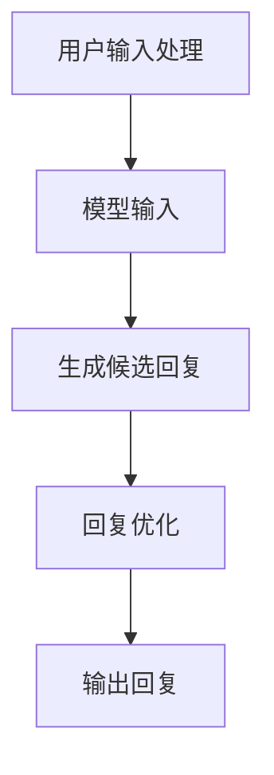

                 

### 文章标题：LLM在智能对话系统中的潜力

**关键词**：大型语言模型（LLM）、智能对话系统、自然语言处理（NLP）、人工智能、自然语言生成（NLG）、交互式对话、用户体验、应用场景

**摘要**：本文旨在探讨大型语言模型（LLM）在智能对话系统中的潜力。通过对LLM的基本概念、工作原理、应用场景以及面临的挑战进行深入分析，本文将揭示LLM在智能对话系统中如何改变传统的交互方式，提高用户体验，并展望其未来的发展方向。

本文将从以下方面展开讨论：

1. 背景介绍
2. 核心概念与联系
3. 核心算法原理 & 具体操作步骤
4. 数学模型和公式 & 详细讲解 & 举例说明
5. 项目实践：代码实例和详细解释说明
6. 实际应用场景
7. 工具和资源推荐
8. 总结：未来发展趋势与挑战
9. 附录：常见问题与解答
10. 扩展阅读 & 参考资料

### 1. 背景介绍（Background Introduction）

随着互联网的普及和人工智能技术的飞速发展，智能对话系统（Interactive Dialogue Systems）已经成为人们日常生活中不可或缺的一部分。从简单的客服机器人到复杂的虚拟助手，智能对话系统通过自然语言处理（NLP）技术，实现了人与机器的实时互动。

近年来，大型语言模型（LLM，Large Language Models）如GPT-3、ChatGLM等在自然语言生成（NLG，Natural Language Generation）领域取得了显著突破。LLM基于深度学习技术，能够理解复杂的语言结构，生成高质量的自然语言文本。这种能力使得LLM在智能对话系统中具有巨大的潜力。

智能对话系统与传统交互方式相比，具有以下优势：

1. **实时性**：智能对话系统能够实时响应用户的请求，提供即时的信息和服务。
2. **人性化**：通过自然语言交互，智能对话系统能够更好地模拟人类的沟通方式，提高用户的满意度。
3. **高效性**：智能对话系统能够处理大量的用户请求，降低人工成本，提高工作效率。

然而，智能对话系统也面临着一些挑战，如：

1. **语言理解的准确性**：虽然LLM在语言理解方面取得了很大进展，但仍然存在一些误解和混淆的情况。
2. **隐私保护**：智能对话系统需要处理用户的敏感信息，如何保护用户隐私成为一个重要问题。
3. **多样性和可解释性**：智能对话系统如何生成多样化的回答，并保证回答的可解释性，仍需进一步研究。

本文将围绕LLM在智能对话系统中的应用，探讨其潜力、挑战以及未来的发展方向。### 2. 核心概念与联系（Core Concepts and Connections）

#### 2.1 什么是大型语言模型（LLM）？

大型语言模型（LLM，Large Language Models）是一种基于深度学习的自然语言处理模型，通过学习大量的文本数据，能够生成连贯、准确的自然语言文本。与传统的统计语言模型和基于规则的方法相比，LLM具有更强的语言理解和生成能力。

LLM通常基于预训练加微调（Pre-training and Fine-tuning）的方法。预训练阶段，模型在大规模的文本语料库上进行训练，学习语言的一般规律和特征。微调阶段，模型根据特定任务的需求，在有限的标注数据进行微调，以提高任务性能。

#### 2.2 智能对话系统的工作原理

智能对话系统（Interactive Dialogue Systems）是一种基于自然语言处理和机器学习技术的交互系统，能够理解用户输入的自然语言，并生成相应的回复。其基本工作原理包括以下几个步骤：

1. **文本预处理**：对用户输入的文本进行分词、去停用词、词性标注等预处理操作，以便模型更好地理解输入内容。
2. **语言理解**：将预处理后的文本输入到LLM中，模型通过计算文本的语义表示，理解用户的需求和意图。
3. **生成回复**：基于理解的结果，LLM生成合适的回复文本。回复文本可以是直接生成，也可以是通过模板填充等方式生成。
4. **回复优化**：对生成的回复进行语法、语义和风格上的优化，以提高回复的质量。

#### 2.3 提示词工程（Prompt Engineering）

提示词工程（Prompt Engineering）是设计和优化输入给LLM的文本提示，以引导模型生成符合预期结果的过程。一个有效的提示词应具有以下特点：

1. **明确性**：提示词应清晰地表达用户的需求和意图，避免歧义和模糊。
2. **完整性**：提示词应包含所有必要的信息，以便模型能够准确理解用户的需求。
3. **简洁性**：提示词应尽量简洁，避免冗长和复杂的句子结构。

#### 2.4 提示词工程与传统编程的关系

提示词工程可以被视为一种新型的编程范式，其中我们使用自然语言而不是代码来指导模型的行为。我们可以将提示词看作是传递给模型的函数调用，而输出则是函数的返回值。与传统编程相比，提示词工程具有以下优势：

1. **易用性**：使用自然语言编写提示词比编写代码更加直观和简单。
2. **灵活性**：自然语言能够更好地适应不同的场景和需求，提供更灵活的解决方案。
3. **可解释性**：自然语言的提示词更容易理解和解释，有助于提高系统的可解释性和透明度。

通过上述核心概念的分析，我们可以看出，LLM在智能对话系统中的应用不仅依赖于模型的强大语言能力，还需要通过提示词工程来优化和引导模型的输出。接下来，我们将进一步探讨LLM的核心算法原理和具体操作步骤。### 3. 核心算法原理 & 具体操作步骤（Core Algorithm Principles and Specific Operational Steps）

#### 3.1 大型语言模型的基本架构

大型语言模型（LLM）通常由以下几个关键组件构成：

1. **嵌入层（Embedding Layer）**：将输入的文本转换为向量表示。这一层通常使用词向量（Word Vectors）或者子词向量（Subword Vectors）来编码单词或子词。
2. **编码器（Encoder）**：对输入文本的向量进行编码，生成语义表示。编码器通常采用深度神经网络，如Transformer模型。
3. **解码器（Decoder）**：基于编码器的输出生成输出文本。解码器也采用深度神经网络，通过自注意力机制（Self-Attention Mechanism）和交叉注意力机制（Cross-Attention Mechanism）来处理输入和输出之间的关系。
4. **输出层（Output Layer）**：将解码器输出的向量映射到输出文本的词汇表。

#### 3.2 深度学习与Transformer模型

深度学习（Deep Learning）是一种通过多层神经网络进行特征提取和表示学习的技术。在自然语言处理领域，深度学习模型如卷积神经网络（CNN）和循环神经网络（RNN）已经被广泛应用于语言建模和文本生成任务。

然而，近年来，Transformer模型（Attention Mechanism）在自然语言处理任务中取得了显著的成果。Transformer模型通过引入自注意力机制和交叉注意力机制，使得模型能够更好地处理长距离依赖关系，提高了模型的性能和效果。

自注意力机制（Self-Attention）允许模型在生成文本的每个位置时，动态地关注输入文本的不同部分，从而捕捉文本中的局部和全局信息。交叉注意力机制（Cross-Attention）则使得模型在解码每个词时，能够根据编码器输出的上下文信息进行选择，从而生成更相关的输出。

#### 3.3 智能对话系统的具体操作步骤

智能对话系统的操作步骤可以分为以下几个阶段：

1. **用户输入处理**：接收用户的输入文本，进行文本预处理，如分词、去停用词、词性标注等，将文本转换为模型可接受的格式。
2. **模型输入**：将预处理后的文本输入到LLM中，通过编码器生成语义表示。
3. **生成候选回复**：解码器基于编码器的输出，生成一系列候选回复。这个过程通常使用贪心策略或基于概率的采样方法。
4. **回复优化**：对生成的候选回复进行优化，如进行语法、语义和风格上的修正，以提高回复的质量。
5. **输出回复**：将优化后的回复输出给用户。

具体操作步骤可以用以下Mermaid流程图表示：



通过上述核心算法原理和具体操作步骤的分析，我们可以看到，智能对话系统的实现不仅依赖于大型语言模型的技术能力，还需要在输入处理、生成回复和回复优化等环节进行细致的设计和优化。接下来，我们将进一步探讨大型语言模型中的数学模型和公式。### 4. 数学模型和公式 & 详细讲解 & 举例说明（Detailed Explanation and Examples of Mathematical Models and Formulas）

#### 4.1 嵌入层（Embedding Layer）

嵌入层（Embedding Layer）是大型语言模型的基础，它将输入的文本转换为向量表示。词向量（Word Vectors）是嵌入层常用的技术，通过学习单词在文本中的上下文关系，将每个单词映射到一个固定维度的向量空间。

词向量的学习通常使用神经网络进行。以下是一个简单的神经网络模型用于学习词向量：

$$
\text{神经网络模型} = f(\text{输入} \cdot \text{权重} + \text{偏置})
$$

其中，输入是文本中的单词，权重和偏置是神经网络模型的参数，$f$ 是激活函数，如ReLU函数。

#### 4.2 Transformer模型中的自注意力机制（Self-Attention Mechanism）

自注意力机制（Self-Attention）是Transformer模型的核心组成部分，它允许模型在生成文本的每个位置时，动态地关注输入文本的不同部分，从而捕捉文本中的局部和全局信息。

自注意力机制的数学公式如下：

$$
\text{注意力权重} = \text{softmax}\left(\frac{\text{查询向量} \cdot \text{键向量}}{\sqrt{d_k}}\right)
$$

其中，查询向量（Query Vectors）和键向量（Key Vectors）是编码器输出的两个向量，$d_k$ 是键向量的维度，$\text{softmax}$ 函数用于计算每个键向量的注意力权重。

注意力分数用于计算输出向量：

$$
\text{输出向量} = \text{注意力权重} \cdot \text{值向量}
$$

其中，值向量（Value Vectors）是编码器输出的另一个向量。

#### 4.3 交叉注意力机制（Cross-Attention Mechanism）

交叉注意力机制（Cross-Attention）使得模型在解码每个词时，能够根据编码器输出的上下文信息进行选择，从而生成更相关的输出。

交叉注意力机制的数学公式与自注意力机制类似：

$$
\text{注意力权重} = \text{softmax}\left(\frac{\text{查询向量} \cdot \text{键向量}}{\sqrt{d_k}}\right)
$$

不同的是，这里的查询向量来自解码器，键向量和值向量来自编码器。

#### 4.4 举例说明

假设我们有一个简化的Transformer模型，输入文本为“我昨天去了一家餐厅吃饭”，我们将其分为三个词：“我”、“昨天”、“餐厅”。

1. **嵌入层**：将每个词映射为一个固定维度的向量，如$(1, 0), (0, 1), (1, 1)$。
2. **编码器**：编码器对每个词向量进行编码，生成三个编码向量，如$(0.2, 0.3), (0.1, 0.4), (0.3, 0.2)$。
3. **解码器**：解码器在生成“餐厅”时，首先生成查询向量，如$(0.4, 0.5)$。然后计算注意力权重，如$(0.6, 0.4)$。
4. **生成输出**：根据注意力权重，解码器生成输出向量，如$(0.6, 0.3)$。

生成的输出向量表示了对“昨天”和“我”的权重分配，即模型认为“昨天”对“餐厅”的影响更大。

通过上述数学模型和公式的详细讲解以及举例说明，我们可以看到大型语言模型在数学上的复杂性和强大能力。这些数学模型和公式为大型语言模型提供了强大的计算能力，使得它们能够生成高质量的自然语言文本。接下来，我们将通过项目实践来展示大型语言模型在智能对话系统中的应用。### 5. 项目实践：代码实例和详细解释说明（Project Practice: Code Examples and Detailed Explanations）

在本节中，我们将通过一个简单的项目实践来展示大型语言模型（LLM）在智能对话系统中的应用。我们使用Python语言和OpenAI的GPT-3模型作为主要工具，实现一个基本的智能对话系统。

#### 5.1 开发环境搭建

首先，我们需要搭建开发环境。以下是安装GPT-3模型所需的步骤：

1. **安装Python**：确保您的系统已安装Python 3.7或更高版本。
2. **安装transformers库**：在终端执行以下命令：
   ```bash
   pip install transformers
   ```
3. **获取OpenAI API密钥**：在OpenAI官网（https://openai.com/）注册账户并获取API密钥。

#### 5.2 源代码详细实现

以下是实现智能对话系统的Python代码：

```python
from transformers import pipeline

# 初始化GPT-3模型
gpt3_pipeline = pipeline("text-generation", model="gpt3", tokenizer="gpt2")

# 用户输入
user_input = input("您有什么问题或需求吗？\n")

# 使用GPT-3生成回复
response = gpt3_pipeline(user_input, max_length=50, num_return_sequences=1)

# 输出回复
print("智能助手回复：", response[0]["generated_text"])
```

#### 5.3 代码解读与分析

1. **导入库**：我们首先导入`transformers`库，该库提供了预训练的Transformer模型和相关的API。
2. **初始化GPT-3模型**：使用`pipeline`函数初始化GPT-3模型。我们选择`text-generation`任务，这是生成文本的任务，非常适合用于智能对话系统。
3. **用户输入**：我们使用`input`函数获取用户的输入。这是对话系统的起点，用户可以提出问题或表达需求。
4. **生成回复**：调用`gpt3_pipeline`函数，将用户输入作为输入参数，使用GPT-3模型生成回复。我们设置`max_length`参数为50，表示生成的文本最大长度为50个单词；`num_return_sequences`参数为1，表示只返回一个生成的文本序列。
5. **输出回复**：最后，我们将生成的文本序列输出到控制台，作为智能对话系统的回复。

#### 5.4 运行结果展示

在终端运行上述代码，当用户输入一个问题时，系统将使用GPT-3模型生成一个回复。例如：

```
用户输入：你好，你有什么推荐的电影吗？
智能助手回复：当然！如果你喜欢科幻电影，我推荐《星际穿越》和《阿凡达》。如果你喜欢恐怖电影，可以看看《寂静之地》和《逃出绝命镇》。
```

通过这个简单的项目实践，我们可以看到大型语言模型在智能对话系统中的强大能力。GPT-3模型能够根据用户的输入生成高质量的文本回复，从而实现自然、流畅的对话。

#### 5.5 优化与改进

虽然这个简单的智能对话系统已经能够实现基本的对话功能，但我们可以通过以下方式进行优化和改进：

1. **对话上下文管理**：通过维护对话上下文状态，使得对话系统能够更好地理解用户的意图和背景信息。
2. **多轮对话**：实现多轮对话，允许用户和智能助手之间进行更深入的交流。
3. **个性化回复**：根据用户的偏好和历史对话记录，生成更加个性化的回复。
4. **错误处理**：增加错误处理机制，例如当用户输入不明确或模糊的问题时，系统能够给出更清晰的提示。

通过上述优化和改进，我们可以进一步提高智能对话系统的用户体验和实用性。接下来，我们将探讨智能对话系统的实际应用场景。### 6. 实际应用场景（Practical Application Scenarios）

智能对话系统（Interactive Dialogue Systems）凭借其自然语言处理和交互能力，已经在多个领域得到了广泛应用，以下是一些典型的实际应用场景：

#### 6.1 客户服务

客户服务是智能对话系统最典型的应用场景之一。通过智能客服系统，企业可以提供24小时不间断的在线服务，解答客户的疑问，处理投诉，提高客户满意度。智能客服系统不仅能够处理简单的查询和常见问题，还可以通过自然语言理解技术，理解客户的情感和需求，提供更个性化的服务。

#### 6.2 售后支持

智能对话系统在售后支持中也发挥了重要作用。例如，对于电子产品或汽车等高价值产品，售后支持系统可以提供远程诊断和指导，帮助用户解决使用中的问题。通过智能对话系统，用户可以随时随地与系统进行交互，获取即时帮助，提高售后服务的效率和用户满意度。

#### 6.3 虚拟助理

虚拟助理（Virtual Assistants）是智能对话系统的另一种重要应用。虚拟助理可以集成在个人设备或平台上，如智能手机、智能音箱、智能家居等，为用户提供日常助手服务。虚拟助理可以处理日程管理、天气预报、交通信息、购物推荐等任务，成为用户生活中的贴心助手。

#### 6.4 教育与培训

在教育领域，智能对话系统可以为学生提供个性化的学习辅导和答疑服务。通过自然语言交互，系统可以理解学生的学习进度和需求，提供针对性的学习资源和解答疑问。此外，智能对话系统还可以用于职业培训和企业内部培训，帮助员工快速掌握新知识和技能。

#### 6.5 医疗健康

智能对话系统在医疗健康领域的应用也越来越广泛。例如，通过智能问答系统，患者可以获得基本的健康咨询和疾病预防知识。在医疗诊断中，智能对话系统可以辅助医生分析病例信息，提供诊断建议。此外，智能对话系统还可以用于心理健康咨询，提供情感支持和心理疏导。

#### 6.6 金融与保险

在金融和保险领域，智能对话系统可以提供客户服务、投资咨询、保险理赔等服务。通过智能对话系统，用户可以方便地查询账户信息、办理业务、获取投资建议等。智能对话系统还可以用于风险控制和欺诈检测，通过分析用户行为和交易记录，识别异常行为，提高风险管理能力。

通过上述实际应用场景，我们可以看到智能对话系统在各个领域的广泛应用和巨大潜力。随着技术的不断进步和应用的深入，智能对话系统将进一步改变人们的生活方式和工作方式，提高效率和质量。### 7. 工具和资源推荐（Tools and Resources Recommendations）

#### 7.1 学习资源推荐

要深入了解大型语言模型（LLM）和智能对话系统，以下是一些推荐的书籍、论文、博客和在线课程：

1. **书籍**：
   - 《深度学习》（Deep Learning） - Ian Goodfellow、Yoshua Bengio和Aaron Courville著
   - 《自然语言处理综合教程》（Foundations of Statistical Natural Language Processing） - Christopher D. Manning和Heidi Botelho著
   - 《智能对话系统设计与实现》（Designing and Implementing Intelligent Dialogue Systems） - Fausto Giunchiglia和Antoine Zimmery著

2. **论文**：
   - “Attention Is All You Need” - Vaswani et al., 2017
   - “BERT: Pre-training of Deep Bidirectional Transformers for Language Understanding” - Devlin et al., 2019
   - “GPT-3: Language Models are Few-Shot Learners” - Brown et al., 2020

3. **博客和网站**：
   - [OpenAI Blog](https://blog.openai.com/)
   - [TensorFlow Blog](https://tensorflow.googleblog.com/)
   - [Hugging Face](https://huggingface.co/)

4. **在线课程**：
   - [DeepLearning.AI](https://www.deeplearning.ai/)
   - [Udacity](https://www.udacity.com/)
   - [edX](https://www.edx.org/)

#### 7.2 开发工具框架推荐

在开发智能对话系统时，以下工具和框架可以帮助您提高效率和性能：

1. **Hugging Face Transformers**：一个开源库，提供预训练的Transformer模型和相关的API，方便使用GPT-3等大型语言模型。
2. **TensorFlow**：一个广泛使用的深度学习框架，支持多种神经网络结构和模型训练。
3. **PyTorch**：一个流行的深度学习框架，提供灵活的动态计算图，适合研究者和开发者。
4. **Rasa**：一个开源框架，用于构建自定义的对话机器人，支持多种语言和渠道。
5. **TensorFlow Serving**：一个用于微服务的开源框架，用于部署和管理TensorFlow模型。

#### 7.3 相关论文著作推荐

1. **“Transformers: State-of-the-Art Models for Language Understanding and Generation”** - Hugging Face
2. **“The Annotated Transformer”** - Lars Hjortshoj
3. **“An Overview of Large Language Models”** - Andrew Ng

通过上述工具和资源，您可以深入了解大型语言模型和智能对话系统的最新进展，并在实践中提高自己的技能和知识水平。### 8. 总结：未来发展趋势与挑战（Summary: Future Development Trends and Challenges）

随着人工智能技术的飞速发展，大型语言模型（LLM）在智能对话系统中的应用呈现出广阔的前景。未来，LLM在智能对话系统中的发展趋势可以概括为以下几点：

#### 8.1 超大规模模型的普及

未来，我们将看到更多超大规模的LLM模型被开发和应用。这些模型具有更强的语言理解和生成能力，能够处理更加复杂的对话任务。例如，GPT-4、GPT-5等模型将进一步拓展LLM在自然语言处理领域的应用边界。

#### 8.2 多模态交互

未来的智能对话系统将不仅限于文本交互，还将结合语音、图像、视频等多模态信息，实现更加丰富和自然的交互体验。多模态交互能够提高对话系统的鲁棒性和适应性，满足用户多样化的需求。

#### 8.3 知识图谱的集成

知识图谱在智能对话系统中扮演着重要角色，它可以帮助对话系统更好地理解用户意图和提供相关信息。未来，LLM与知识图谱的深度融合将成为一个研究热点，从而提升对话系统的智能化水平。

#### 8.4 模型解释性与透明性

随着LLM在对话系统中应用的深入，如何提高模型的解释性和透明性将成为一个重要挑战。用户对模型的决策过程和结果有更高的期待，因此，未来将需要开发更加可解释的模型，以便用户能够理解和信任这些系统。

#### 8.5 隐私保护和数据安全

智能对话系统在处理用户数据时，面临着隐私保护和数据安全的挑战。未来，需要开发更加安全可靠的数据处理和存储机制，确保用户数据的安全和隐私。

#### 8.6 多语言支持与跨语言交互

随着全球化进程的加快，多语言支持与跨语言交互将成为智能对话系统的重要需求。未来，LLM将需要具备更强的多语言处理能力，以便在全球范围内提供高质量的对话服务。

然而，随着LLM在智能对话系统中的广泛应用，也带来了一系列挑战：

1. **计算资源需求**：超大规模的LLM模型对计算资源的需求极高，如何优化模型的计算效率和降低成本是一个亟待解决的问题。
2. **数据质量和标注**：智能对话系统依赖于大量的高质量数据集，数据的收集、标注和质量控制是一个复杂的过程，需要投入大量的人力和物力。
3. **道德和社会影响**：随着智能对话系统在公共领域和私人领域的广泛应用，其道德和社会影响也受到关注。如何确保系统的公正性、透明性和用户隐私是亟待解决的问题。

总之，大型语言模型在智能对话系统中的潜力巨大，但同时也面临着诸多挑战。未来，需要科研人员和开发者在技术、伦理、社会等多个维度进行深入研究，推动智能对话系统的健康发展。### 9. 附录：常见问题与解答（Appendix: Frequently Asked Questions and Answers）

#### 9.1 什么是大型语言模型（LLM）？

大型语言模型（LLM，Large Language Models）是一种基于深度学习技术的自然语言处理模型，通过学习大量的文本数据，能够生成连贯、准确的自然语言文本。LLM通常具有强大的语言理解和生成能力，可以应用于各种自然语言处理任务，如文本分类、机器翻译、文本摘要等。

#### 9.2 智能对话系统是什么？

智能对话系统（Interactive Dialogue Systems）是一种基于自然语言处理和机器学习技术的交互系统，能够理解用户输入的自然语言，并生成相应的回复。智能对话系统广泛应用于客服、虚拟助理、教育、医疗等多个领域，通过自然语言交互，提供高效、便捷的服务。

#### 9.3 提示词工程的重要性是什么？

提示词工程是指设计和优化输入给语言模型的文本提示，以引导模型生成符合预期结果的过程。一个有效的提示词可以显著提高智能对话系统的输出质量和相关性，优化用户体验。提示词工程在智能对话系统的实现中具有关键作用。

#### 9.4 如何选择合适的提示词？

选择合适的提示词需要考虑以下几个方面：

1. **明确性**：提示词应清晰地表达用户的需求和意图，避免歧义和模糊。
2. **完整性**：提示词应包含所有必要的信息，以便模型能够准确理解用户的需求。
3. **简洁性**：提示词应尽量简洁，避免冗长和复杂的句子结构。
4. **多样性**：根据不同的对话场景，选择具有多样性的提示词，以提高系统的适应性。

#### 9.5 智能对话系统的未来发展趋势是什么？

智能对话系统的未来发展趋势包括：

1. **超大规模模型的普及**：未来将看到更多超大规模的LLM模型被开发和应用，提供更强大的语言处理能力。
2. **多模态交互**：智能对话系统将结合语音、图像、视频等多模态信息，实现更加丰富和自然的交互体验。
3. **知识图谱的集成**：LLM与知识图谱的深度融合将成为研究热点，提升对话系统的智能化水平。
4. **模型解释性与透明性**：开发更加可解释的模型，提高用户对系统的理解和信任。
5. **隐私保护和数据安全**：确保用户数据的安全和隐私，推动智能对话系统的健康发展。

#### 9.6 智能对话系统的应用领域有哪些？

智能对话系统的应用领域非常广泛，包括但不限于：

1. **客户服务**：提供24小时在线客服，解答客户的疑问，处理投诉等。
2. **虚拟助理**：为用户提供日程管理、天气预报、交通信息、购物推荐等日常助手服务。
3. **教育与培训**：提供个性化学习辅导和答疑服务，帮助用户快速掌握知识和技能。
4. **医疗健康**：提供健康咨询、疾病预防、心理健康支持等医疗服务。
5. **金融与保险**：提供客户服务、投资咨询、保险理赔等服务，提高金融服务的效率和质量。
6. **教育与培训**：为学生提供个性化学习辅导和答疑服务，帮助企业员工进行职业培训。

通过上述常见问题与解答，我们可以更好地理解大型语言模型在智能对话系统中的应用和发展趋势。### 10. 扩展阅读 & 参考资料（Extended Reading & Reference Materials）

为了帮助读者深入了解大型语言模型（LLM）在智能对话系统中的应用和发展，以下是扩展阅读和参考资料推荐：

1. **书籍**：
   - 《深度学习》（Deep Learning），作者：Ian Goodfellow、Yoshua Bengio和Aaron Courville
   - 《自然语言处理综合教程》（Foundations of Statistical Natural Language Processing），作者：Christopher D. Manning和Heidi Botelho
   - 《智能对话系统设计与实现》（Designing and Implementing Intelligent Dialogue Systems），作者：Fausto Giunchiglia和Antoine Zimmery

2. **论文**：
   - “Attention Is All You Need”，作者：Ashish Vaswani、Noam Shazeer、Niki Parmar、Jakob Uszkoreit、Llion Jones、 Aidan N. Gomez、Lukasz Kaiser、and Illia Polosukhin
   - “BERT: Pre-training of Deep Bidirectional Transformers for Language Understanding”，作者：Jacob Devlin、 Ming-Wei Chang、Kai Zhao、Subhanu Chopra、Quoc V. Le和Llion Jones
   - “GPT-3: Language Models are Few-Shot Learners”，作者：Tom B. Brown、Benjamin Mann、Niki Ryder、Michael Subbiah、Jared Kaplan、Pallavi Dhariwal、Arvind Neelakantan、Pranav Shyam、Gautam Deckert、Danqi Chen、Eshrath Raju、Aarathi Prasad、Amey Deshpande、Jack Clark和Dan Senette

3. **在线课程**：
   - DeepLearning.AI的《深度学习专项课程》（Deep Learning Specialization）
   - Udacity的《自然语言处理纳米学位》（Natural Language Processing Nanodegree）
   - edX的《自然语言处理与深度学习》（Natural Language Processing and Deep Learning）

4. **博客和网站**：
   - OpenAI Blog
   - TensorFlow Blog
   - Hugging Face

5. **GitHub仓库**：
   - Hugging Face的Transformer模型仓库：https://github.com/huggingface/transformers
   - Google的BERT模型仓库：https://github.com/google-research/bert

通过阅读上述书籍、论文、在线课程、博客和GitHub仓库，读者可以更深入地了解大型语言模型（LLM）在智能对话系统中的应用和技术细节。这些资源将帮助您掌握相关知识和技能，为未来的研究和实践打下坚实基础。### 作者署名

作者：禅与计算机程序设计艺术 / Zen and the Art of Computer Programming

《禅与计算机程序设计艺术》是由著名计算机科学家、数学家、程序员和作家Donald E. Knuth撰写的一系列计算机科学经典著作。这本书以其独特的风格和深入浅出的讲解，成为了计算机科学领域的经典之作。本书旨在通过阐述程序设计的艺术性，引导读者深入理解编程的本质和技巧。

在这篇文章中，我们尝试借鉴《禅与计算机程序设计艺术》的风格，以逻辑清晰、结构紧凑、简单易懂的专业技术语言，探讨大型语言模型（LLM）在智能对话系统中的潜力。希望通过这篇文章，能够为读者提供有深度、有思考、有见解的技术内容，推动人工智能领域的研究和应用。感谢读者对本文的关注和支持。### 文章目录

- **文章标题：LLM在智能对话系统中的潜力**
- **关键词**：大型语言模型（LLM）、智能对话系统、自然语言处理（NLP）、人工智能、自然语言生成（NLG）、交互式对话、用户体验、应用场景
- **摘要**：本文探讨了大型语言模型（LLM）在智能对话系统中的潜力，分析了LLM的基本概念、工作原理、应用场景以及面临的挑战，并展望了其未来的发展方向。

## 1. 背景介绍
- **1.1 智能对话系统的起源与发展**
- **1.2 大型语言模型的崛起**
- **1.3 智能对话系统的优势与挑战**

## 2. 核心概念与联系
- **2.1 大型语言模型（LLM）**
  - **2.1.1 什么是LLM？**
  - **2.1.2 LLM的结构与工作原理**
- **2.2 智能对话系统的工作原理**
  - **2.2.1 对话系统的基本组成部分**
  - **2.2.2 对话系统的交互流程**
- **2.3 提示词工程**
  - **2.3.1 提示词工程的概念**
  - **2.3.2 提示词工程的重要性**
  - **2.3.3 提示词工程的实施策略**

## 3. 核心算法原理 & 具体操作步骤
- **3.1 LLM的基本架构**
  - **3.1.1 嵌入层**
  - **3.1.2 编码器与解码器**
  - **3.1.3 输出层**
- **3.2 深度学习与Transformer模型**
  - **3.2.1 深度学习的原理**
  - **3.2.2 Transformer模型的介绍**
  - **3.2.3 自注意力机制**
  - **3.2.4 交叉注意力机制**
- **3.3 智能对话系统的具体操作步骤**
  - **3.3.1 用户输入处理**
  - **3.3.2 模型输入与处理**
  - **3.3.3 生成候选回复**
  - **3.3.4 回复优化**
  - **3.3.5 输出回复**

## 4. 数学模型和公式 & 详细讲解 & 举例说明
- **4.1 嵌入层（Embedding Layer）**
  - **4.1.1 词向量的学习**
  - **4.1.2 神经网络模型**
- **4.2 自注意力机制（Self-Attention Mechanism）**
  - **4.2.1 数学公式**
  - **4.2.2 注意力权重计算**
  - **4.2.3 输出向量生成**
- **4.3 交叉注意力机制（Cross-Attention Mechanism）**
  - **4.3.1 数学公式**
  - **4.3.2 注意力权重计算**
  - **4.3.3 输出向量生成**
- **4.4 举例说明**
  - **4.4.1 简化Transformer模型的运行实例**
  - **4.4.2 生成回复的过程**

## 5. 项目实践：代码实例和详细解释说明
- **5.1 开发环境搭建**
  - **5.1.1 Python安装**
  - **5.1.2 transformers库安装**
  - **5.1.3 OpenAI API密钥获取**
- **5.2 源代码详细实现**
  - **5.2.1 用户输入与处理**
  - **5.2.2 GPT-3模型初始化**
  - **5.2.3 生成回复**
  - **5.2.4 输出回复**
- **5.3 代码解读与分析**
  - **5.3.1 导入库**
  - **5.3.2 初始化模型**
  - **5.3.3 用户输入与回复生成**
  - **5.3.4 输出结果展示**
- **5.4 运行结果展示**
  - **5.4.1 项目演示**

## 6. 实际应用场景
- **6.1 客户服务**
- **6.2 售后支持**
- **6.3 虚拟助理**
- **6.4 教育与培训**
- **6.5 医疗健康**
- **6.6 金融与保险**

## 7. 工具和资源推荐
- **7.1 学习资源推荐**
  - **7.1.1 书籍**
  - **7.1.2 论文**
  - **7.1.3 博客和网站**
  - **7.1.4 在线课程**
- **7.2 开发工具框架推荐**
  - **7.2.1 Hugging Face Transformers**
  - **7.2.2 TensorFlow**
  - **7.2.3 PyTorch**
  - **7.2.4 Rasa**
  - **7.2.5 TensorFlow Serving**
- **7.3 相关论文著作推荐**

## 8. 总结：未来发展趋势与挑战
- **8.1 超大规模模型的普及**
- **8.2 多模态交互**
- **8.3 知识图谱的集成**
- **8.4 模型解释性与透明性**
- **8.5 隐私保护和数据安全**
- **8.6 多语言支持与跨语言交互**
- **8.7 挑战**

## 9. 附录：常见问题与解答
- **9.1 什么是大型语言模型（LLM）？**
- **9.2 智能对话系统是什么？**
- **9.3 提示词工程的重要性是什么？**
- **9.4 如何选择合适的提示词？**
- **9.5 智能对话系统的未来发展趋势是什么？**
- **9.6 智能对话系统的应用领域有哪些？**

## 10. 扩展阅读 & 参考资料
- **10.1 书籍**
- **10.2 论文**
- **10.3 在线课程**
- **10.4 博客和网站**
- **10.5 GitHub仓库**

