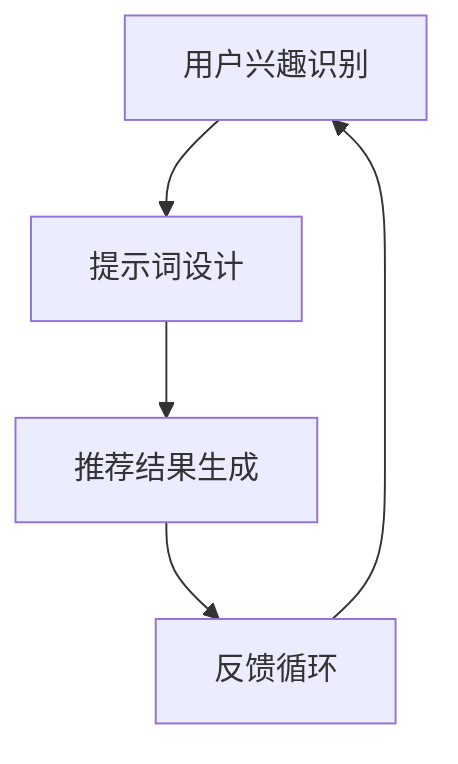

                 

### 文章标题

LLM推荐中的Prompt工程设计

> 关键词：LLM推荐、Prompt工程、文本生成、自然语言处理、机器学习

> 摘要：本文深入探讨了LLM（大型语言模型）在推荐系统中的应用，以及Prompt工程的核心概念和设计技巧。通过对Prompt工程的详细分析，本文展示了如何优化文本输入，以提升推荐的准确性和相关性，从而提高用户满意度。

本文将分为以下几个部分：

1. 背景介绍
2. 核心概念与联系
3. 核心算法原理 & 具体操作步骤
4. 数学模型和公式 & 详细讲解 & 举例说明
5. 项目实践：代码实例和详细解释说明
6. 实际应用场景
7. 工具和资源推荐
8. 总结：未来发展趋势与挑战
9. 附录：常见问题与解答
10. 扩展阅读 & 参考资料

现在，让我们开始第一部分的撰写。## 1. 背景介绍（Background Introduction）

在当今的信息时代，推荐系统已成为许多在线平台的核心功能，旨在为用户个性化地推荐他们可能感兴趣的内容。从社交媒体到电子商务，推荐系统无处不在，它们通过分析用户的历史行为和兴趣，预测用户可能感兴趣的新内容。

推荐系统通常依赖于机器学习算法，其中一种非常流行且强大的方法是使用大型语言模型（Large Language Models，简称LLM）。LLM，如GPT-3、BERT等，具有处理和理解自然语言的能力，这使得它们在推荐系统中成为一种强有力的工具。

然而，尽管LLM在自然语言处理领域取得了巨大成功，但在推荐系统中的应用仍面临诸多挑战。其中一个关键问题是如何设计有效的Prompt，以引导LLM生成准确的推荐结果。Prompt工程（Prompt Engineering）因此成为一个重要的研究领域，它关注如何通过优化Prompt的设计来提高推荐系统的性能。

Prompt工程的核心在于理解如何通过文本输入（Prompt）有效地与LLM交互。一个好的Prompt能够清晰地传达用户的兴趣和需求，从而引导LLM生成高度相关和准确的推荐。然而，设计有效的Prompt并非易事，它需要深入理解LLM的工作原理，以及如何将自然语言和机器学习结合起来。

本文将深入探讨LLM推荐系统中的Prompt工程，从背景介绍、核心概念与联系、核心算法原理、数学模型和公式、项目实践、实际应用场景、工具和资源推荐等多个方面，全面解析Prompt工程的设计技巧和实践。

通过本文的阅读，读者将了解：

- LLM推荐系统的基本原理和挑战。
- Prompt工程的核心概念和重要性。
- 如何通过优化Prompt设计来提升推荐系统的性能。
- 实际应用中Prompt工程的具体实现方法和技巧。

本文不仅适合对机器学习和自然语言处理有浓厚兴趣的读者，也为那些希望在实际项目中应用LLM推荐系统的开发者提供了宝贵的指导。## 2. 核心概念与联系（Core Concepts and Connections）

在深入探讨LLM推荐系统中的Prompt工程之前，我们需要首先明确一些核心概念，并了解它们之间的联系。

### 2.1 什么是提示词工程？

提示词工程（Prompt Engineering）是指设计和优化输入给语言模型的文本提示（Prompt），以引导模型生成符合预期结果的过程。与传统的编程不同，提示词工程使用自然语言作为输入，而不是代码。这种设计理念源于语言模型（如GPT、BERT等）的强大能力，它们能够理解并生成复杂的文本输出。

在推荐系统中，提示词工程的核心目标是创建能够有效传达用户兴趣和需求的文本输入。通过精心设计的提示词，我们可以引导LLM生成高度相关和个性化的推荐结果。

### 2.2 提示词工程的重要性

一个精心设计的提示词可以显著提高LLM输出（如推荐结果）的质量和相关性。例如，在推荐新闻、产品或内容时，一个清晰的提示词可以帮助模型理解用户的具体兴趣，从而生成更符合用户需求的推荐。

相反，模糊或不完整的提示词可能会导致模型输出不准确、不相关或不完整。例如，一个简单的提示词“推荐新闻”可能无法让模型理解用户的具体兴趣，从而生成大量无关的新闻。

因此，提示词工程在LLM推荐系统中的重要性不言而喻。通过优化提示词的设计，我们可以提高推荐系统的性能，提升用户体验。

### 2.3 提示词工程与传统编程的关系

虽然提示词工程使用的是自然语言，但与传统编程有许多相似之处。我们可以将提示词视为一种特殊的“代码”，它用于指导模型的输入和输出。

例如，在传统编程中，我们可能编写函数来处理特定的任务。类似地，在提示词工程中，我们可以编写提示词来引导模型生成特定的输出。这种“函数调用”式的思维可以帮助我们更好地理解提示词工程，以及如何通过优化提示词来提升模型性能。

此外，提示词工程也涉及到对模型行为和输出的调试和优化。这与传统编程中的调试过程类似，都需要不断迭代和改进代码，以达到预期的效果。

### 2.4 提示词工程在LLM推荐系统中的具体应用

在LLM推荐系统中，提示词工程的具体应用可以包括以下几个方面：

- **用户兴趣识别**：通过设计特定的提示词，我们可以帮助模型更好地理解用户的兴趣和需求。例如，可以使用用户的历史行为数据来生成个性化的提示词，从而提高推荐的相关性。
- **推荐结果生成**：精心设计的提示词可以引导模型生成高质量的推荐结果。例如，在推荐新闻时，可以使用具体的主题和关键词作为提示词，以生成更符合用户兴趣的新闻。
- **反馈循环**：通过收集用户对推荐结果的反馈，我们可以不断优化提示词的设计，从而提升推荐系统的性能。这种反馈循环可以帮助我们更好地理解用户需求，并持续改进推荐结果。

总的来说，提示词工程是LLM推荐系统中不可或缺的一环。通过深入理解这些核心概念和它们之间的联系，我们可以更好地设计和管理推荐系统，从而提高用户体验和满意度。

## 2. Core Concepts and Connections

### 2.1 What is Prompt Engineering?

Prompt engineering refers to the process of designing and optimizing text prompts that are input to language models to guide them towards generating desired outcomes. It differs from traditional programming in that it leverages natural language instead of code as the primary input method. Given the powerful capabilities of language models, such as GPT and BERT, prompt engineering becomes a crucial field of study.

The core objective of prompt engineering in recommendation systems is to create text inputs that effectively convey the user's interests and needs. By crafting well-designed prompts, we can guide the language model to generate highly relevant and personalized recommendations.

### 2.2 The Importance of Prompt Engineering

A carefully designed prompt can significantly enhance the quality and relevance of the outputs generated by a language model, such as recommendation results. For instance, when recommending news, products, or content, a clear prompt can help the model better understand the user's specific interests, thereby generating more relevant recommendations.

Conversely, vague or incomplete prompts can lead to inaccurate, irrelevant, or incomplete outputs. For example, a simple prompt like "recommend news" may fail to convey the user's specific interests, resulting in a flood of unrelated news articles.

Therefore, the importance of prompt engineering in LLM recommendation systems cannot be overstated. By optimizing the design of prompts, we can improve the performance of recommendation systems, thereby enhancing user experience and satisfaction.

### 2.3 Prompt Engineering vs. Traditional Programming

While prompt engineering uses natural language as its primary input, it shares many similarities with traditional programming. We can think of prompts as a special type of "code" that guides the input and output of the model.

For instance, in traditional programming, we might write functions to handle specific tasks. Similarly, in prompt engineering, we can write prompts to guide the model towards generating specific outputs. This "function call"-style thinking can help us better understand prompt engineering and how to optimize prompts to improve model performance.

Moreover, prompt engineering also involves debugging and optimizing model behavior and outputs, which is similar to the debugging process in traditional programming. Both fields require iterative improvement and refinement to achieve the desired outcomes.

### 2.4 Specific Applications of Prompt Engineering in LLM Recommendation Systems

In LLM recommendation systems, prompt engineering can be applied in several key areas:

- **User Interest Identification**: By designing specific prompts, we can help the model better understand the user's interests and needs. For example, we can use the user's historical behavior data to generate personalized prompts that increase the relevance of recommendations.
- **Recommendation Result Generation**: Well-designed prompts can guide the model to generate high-quality recommendation results. For instance, when recommending news, specific topics and keywords can be used as prompts to generate news articles that align more closely with the user's interests.
- **Feedback Loop**: By collecting user feedback on recommendation results, we can continuously optimize the design of prompts, thereby improving the performance of the recommendation system. This feedback loop helps us better understand user needs and continually refine recommendation results.

In summary, prompt engineering is an indispensable component of LLM recommendation systems. By deeply understanding these core concepts and their interconnections, we can better design and manage recommendation systems to enhance user experience and satisfaction.

### 2.5 关键概念和关系的 Mermaid 流程图

以下是一个简单的Mermaid流程图，展示了LLM推荐系统中关键概念和它们之间的联系：



在这个流程图中，用户兴趣识别（A）通过提示词设计（B）转化为推荐结果生成（C），而用户对推荐结果的反馈（D）又返回到用户兴趣识别（A），形成一个闭环。这种反馈循环有助于不断优化提示词设计，从而提高推荐系统的性能。## 3. 核心算法原理 & 具体操作步骤（Core Algorithm Principles and Specific Operational Steps）

在深入探讨LLM推荐系统中的Prompt工程之前，我们首先需要了解LLM的工作原理，以及如何通过设计有效的Prompt来引导模型生成高质量的推荐结果。

### 3.1 LLM的工作原理

大型语言模型（LLM）通常基于深度神经网络，通过大规模的文本数据进行训练，从而学习语言结构和语义。在推荐系统中，LLM的主要任务是从大量候选内容中为用户推荐最相关的内容。

LLM的核心组件包括：

- **嵌入层（Embedding Layer）**：将输入文本转换为向量表示，使其在神经网络中具有可处理的格式。
- **编码器（Encoder）**：通过多层神经网络对输入文本进行处理，提取出文本的语义信息。
- **解码器（Decoder）**：根据编码器生成的隐含状态生成输出文本。

### 3.2 Prompt设计的基本原则

为了使LLM能够生成高质量的推荐结果，我们需要遵循以下基本原则来设计Prompt：

- **明确性（Clarity）**：Prompt应该清晰、简洁，能够明确传达用户的兴趣和需求。例如，使用具体的关键词和主题来描述用户可能感兴趣的内容。
- **相关性（Relevance）**：Prompt应与用户的兴趣和需求紧密相关，以提高推荐结果的准确性。
- **多样性（Diversity）**：Prompt应该涵盖多种不同的兴趣和主题，以确保推荐结果的多样性。
- **可控性（Controllability）**：Prompt的设计应该允许我们控制推荐结果的质量和相关性，以适应不同的应用场景。

### 3.3 提示词工程的具体操作步骤

以下是设计有效Prompt的四个关键步骤：

#### 步骤1：用户兴趣识别

首先，我们需要识别用户的兴趣和需求。这可以通过分析用户的历史行为数据、搜索记录、浏览历史等信息来实现。例如，如果用户经常浏览关于科技新闻的网站，我们可以将“科技新闻”作为他们的一个兴趣点。

```python
# 示例：提取用户兴趣
user_interest = "科技新闻"
```

#### 步骤2：生成候选Prompt

接下来，我们需要根据用户兴趣生成多个候选Prompt。这些Prompt应涵盖用户可能感兴趣的主题和关键词。以下是一个简单的生成方法：

```mermaid
graph TD
A[用户兴趣] --> B[关键词提取]
B --> C{使用NLP技术}
C -->|是| D[生成Prompt 1]
C -->|否| E[返回错误]
D -->|结束|
E -->|结束|
```

#### 步骤3：优化Prompt

通过实验和评估，我们可以选择最佳的Prompt。这一步骤涉及以下操作：

- **A/B测试**：对不同Prompt进行A/B测试，比较它们的推荐效果。
- **反馈循环**：根据用户对推荐结果的反馈，不断优化Prompt。

```python
# 示例：A/B测试代码
prompt_a = "推荐最新的科技新闻"
prompt_b = "为您推荐热门的科技新闻"

# 计算两个Prompt的推荐效果
effect_a = evaluate_prompt(prompt_a)
effect_b = evaluate_prompt(prompt_b)

# 选择效果更好的Prompt
if effect_a > effect_b:
    selected_prompt = prompt_a
else:
    selected_prompt = prompt_b
```

#### 步骤4：生成推荐结果

最后，使用选定的Prompt引导LLM生成推荐结果。以下是一个示例：

```python
# 示例：使用Prompt生成推荐结果
selected_prompt = "推荐最新的科技新闻"

# 使用LLM生成推荐结果
recommendations = generate_recommendations(selected_prompt)

# 输出推荐结果
print("推荐结果：", recommendations)
```

### 3.4 提示词工程在实践中的一些注意事项

- **数据质量**：确保用于训练和优化的数据质量高，无噪声和偏差。
- **模型适应性**：不同的LLM模型可能有不同的偏好和适应性，需要针对特定模型调整Prompt设计。
- **可解释性**：尽量提高Prompt的可解释性，以便理解其如何影响推荐结果。

通过遵循这些核心算法原理和具体操作步骤，我们可以设计出有效的Prompt，从而显著提高LLM推荐系统的性能。

## 3. Core Algorithm Principles and Specific Operational Steps

### 3.1 How Language Models (LLM) Work

Large Language Models (LLM) are based on deep neural networks that are trained on vast amounts of text data to learn about language structures and semantics. In recommendation systems, LLMs are primarily responsible for recommending the most relevant content from a large pool of candidates.

The core components of LLMs include:

- **Embedding Layer**: Converts input text into vector representations that can be processed by the neural network.
- **Encoder**: Processes input text through multiple layers of neural networks to extract semantic information from the text.
- **Decoder**: Generates output text based on the hidden states produced by the encoder.

### 3.2 Basic Principles for Prompt Design

To ensure that LLMs generate high-quality recommendation results, we need to follow certain basic principles when designing prompts:

- **Clarity**: Prompts should be clear and concise, effectively conveying the user's interests and needs. For example, use specific keywords and topics to describe content that the user might be interested in.
- **Relevance**: Prompts should be closely related to the user's interests and needs to increase the accuracy of the recommendation results.
- **Diversity**: Prompts should cover a wide range of topics and interests to ensure diversity in the recommendation results.
- **Controllability**: The design of prompts should allow us to control the quality and relevance of the recommendation results to adapt to different use cases.

### 3.3 Specific Steps for Prompt Engineering

The following are four key steps for designing an effective prompt:

#### Step 1: User Interest Identification

First, we need to identify the user's interests and needs. This can be done by analyzing the user's historical behavior data, such as browsing history, search records, and purchase history. For example, if a user frequently visits technology news websites, "technology news" might be one of their interests.

```python
# Example: Extracting User Interest
user_interest = "technology news"
```

#### Step 2: Generating Candidate Prompts

Next, we generate multiple candidate prompts based on the user's interests. These prompts should cover a variety of topics and keywords that the user might be interested in. Here is a simple method for generating prompts:

```mermaid
graph TD
A[User Interest] --> B[Keyword Extraction]
B --> C{Use NLP Techniques}
C -->|Yes| D[Generate Prompt 1]
C -->|No| E[Return Error]
D -->|End|
E -->|End|
```

#### Step 3: Optimizing Prompts

Through experimentation and evaluation, we can select the best prompt. This step involves the following operations:

- **A/B Testing**: Compare the effectiveness of different prompts by conducting A/B tests.
- **Feedback Loop**: Continuously optimize prompts based on user feedback on recommendation results.

```python
# Example: A/B Testing Code
prompt_a = "recommend the latest technology news"
prompt_b = "recommend popular technology news"

# Calculate the effectiveness of both prompts
effect_a = evaluate_prompt(prompt_a)
effect_b = evaluate_prompt(prompt_b)

# Select the better prompt
if effect_a > effect_b:
    selected_prompt = prompt_a
else:
    selected_prompt = prompt_b
```

#### Step 4: Generating Recommendation Results

Finally, use the selected prompt to guide the LLM in generating recommendation results. Here is an example:

```python
# Example: Generate Recommendation Results Using Prompt
selected_prompt = "recommend the latest technology news"

# Generate recommendation results using the LLM
recommendations = generate_recommendations(selected_prompt)

# Output the recommendation results
print("Recommendations:", recommendations)
```

### 3.4 Notes on Prompt Engineering in Practice

- **Data Quality**: Ensure that the data used for training and optimization is high-quality, free from noise and bias.
- **Model Adaptability**: Different LLM models may have different preferences and adaptabilities, so prompts may need to be adjusted for specific models.
- **Interpretability**: Try to increase the interpretability of prompts to understand how they affect recommendation results.

By following these core algorithm principles and specific operational steps, we can design effective prompts that significantly improve the performance of LLM recommendation systems.## 4. 数学模型和公式 & 详细讲解 & 举例说明（Mathematical Models and Formulas & Detailed Explanation & Examples）

在LLM推荐系统中，数学模型和公式扮演着至关重要的角色。它们帮助我们量化用户兴趣、优化Prompt设计，并评估推荐结果的质量。本节将介绍几个关键的数学模型和公式，并详细讲解它们的应用。

### 4.1 用户兴趣模型

用户兴趣模型用于量化用户对特定主题或内容的兴趣。一个常用的模型是主题模型（如LDA），它可以提取出用户最感兴趣的主题。

#### LDA模型

LDA（Latent Dirichlet Allocation）是一种概率主题模型，用于发现文本数据中的主题。在LDA模型中，每个文档被表示为一系列主题的概率分布，每个主题也是一个词语的概率分布。

#### 公式：

LDA模型通过以下公式来计算文档-主题分布和主题-词语分布：

$$
\pi_{jk} = \frac{\sum_{i=1}^{V} \alpha_{ik}}{\sum_{j=1}^{T} \sum_{i=1}^{V} \alpha_{ik}}
$$

$$
\phi_{kj} = \frac{\sum_{i=1}^{D} n_{ij} + \beta_j}{\sum_{k=1}^{T} \sum_{i=1}^{D} n_{ij} + T \beta_j}
$$

其中：
- $\pi_{jk}$ 是文档 $d_j$ 中主题 $k$ 的概率。
- $\phi_{kj}$ 是主题 $k$ 中词语 $w_i$ 的概率。
- $\alpha_{ik}$ 是词语 $w_i$ 在主题 $k$ 中出现的先验概率。
- $\beta_j$ 是主题 $k$ 的先验概率。

#### 示例：

假设我们有一个文档集合，包含以下词频矩阵：

$$
N = \begin{bmatrix}
4 & 2 & 1 & 1 \\
1 & 3 & 1 & 2 \\
2 & 2 & 3 & 1
\end{bmatrix}
$$

通过LDA模型，我们可以发现文档的主题分布和词语分布。例如，文档1可能主要关注“科技”主题，而文档2可能关注“娱乐”主题。

### 4.2 提示词优化模型

提示词优化模型用于确定最佳Prompt，以提高推荐结果的相关性和准确性。一个常用的优化方法是基于梯度下降的优化算法。

#### 梯度下降算法

梯度下降算法是一种优化方法，用于最小化目标函数。在提示词优化中，目标函数可以是推荐结果的准确性或用户满意度。

#### 公式：

梯度下降算法的迭代公式如下：

$$
\theta_{t+1} = \theta_t - \alpha \cdot \nabla_{\theta} J(\theta)
$$

其中：
- $\theta$ 是模型参数（例如Prompt）。
- $\alpha$ 是学习率。
- $\nabla_{\theta} J(\theta)$ 是目标函数 $J(\theta)$ 对 $\theta$ 的梯度。

#### 示例：

假设我们的目标函数是推荐结果的相关性，学习率为0.1。通过梯度下降算法，我们可以迭代优化Prompt，以获得最佳的相关性。

### 4.3 推荐结果评估模型

推荐结果评估模型用于评估推荐系统的性能。一个常用的评估方法是平均绝对误差（MAE）。

#### 平均绝对误差（MAE）

平均绝对误差是一种衡量预测值与真实值之间差异的方法。

#### 公式：

$$
MAE = \frac{1}{N} \sum_{i=1}^{N} |y_i - \hat{y}_i|
$$

其中：
- $y_i$ 是真实值。
- $\hat{y}_i$ 是预测值。
- $N$ 是数据点的数量。

#### 示例：

假设我们有一个包含10个预测值和真实值的列表，通过计算MAE，我们可以评估推荐系统的性能。

### 4.4 综合应用

在实际应用中，这些数学模型和公式可以结合起来，以实现更准确的推荐系统。例如，我们可以使用LDA模型提取用户兴趣，然后通过梯度下降算法优化Prompt，并使用MAE评估推荐结果的质量。

```python
# 示例：综合应用数学模型
user_interest = LDA_model.extract_topics(document)
optimal_prompt = gradient_descent.optimize_prompt(user_interest)
recommendations = generate_recommendations(optimal_prompt)
performance = MAE.evaluate(recommendations)
print("Recommendation Performance:", performance)
```

通过理解并应用这些数学模型和公式，我们可以设计和优化LLM推荐系统，从而实现更准确、更个性化的推荐结果。

## 4. Mathematical Models and Formulas & Detailed Explanation & Examples

### 4.1 User Interest Model

The user interest model quantifies the user's interest in specific topics or content. A commonly used model is the Latent Dirichlet Allocation (LDA) model, which can extract the most interesting topics for the user.

#### LDA Model

LDA is a probabilistic topic model used to discover topics in a set of documents. In the LDA model, each document is represented as a distribution over topics, and each topic is a distribution over words.

#### Formula:

The LDA model calculates the document-topic distribution and topic-word distribution using the following formulas:

$$
\pi_{jk} = \frac{\sum_{i=1}^{V} \alpha_{ik}}{\sum_{j=1}^{T} \sum_{i=1}^{V} \alpha_{ik}}
$$

$$
\phi_{kj} = \frac{\sum_{i=1}^{D} n_{ij} + \beta_j}{\sum_{k=1}^{T} \sum_{i=1}^{D} n_{ij} + T \beta_j}
$$

Where:
- $\pi_{jk}$ is the probability of topic $k$ in document $d_j$.
- $\phi_{kj}$ is the probability of word $w_i$ in topic $k$.
- $\alpha_{ik}$ is the prior probability of word $w_i$ appearing in topic $k$.
- $\beta_j$ is the prior probability of topic $k$.

#### Example:

Assuming we have a document collection with the following word frequency matrix:

$$
N = \begin{bmatrix}
4 & 2 & 1 & 1 \\
1 & 3 & 1 & 2 \\
2 & 2 & 3 & 1
\end{bmatrix}
$$

Through the LDA model, we can discover the topic distribution and word distribution of the documents. For instance, document 1 might primarily focus on the "technology" topic, while document 2 might focus on the "entertainment" topic.

### 4.2 Prompt Optimization Model

The prompt optimization model is used to determine the best prompt to improve the relevance and accuracy of recommendation results. A commonly used optimization method is the gradient descent algorithm.

#### Gradient Descent Algorithm

The gradient descent algorithm is an optimization method used to minimize a target function. In prompt optimization, the target function can be the accuracy of recommendations or user satisfaction.

#### Formula:

The gradient descent iteration formula is as follows:

$$
\theta_{t+1} = \theta_t - \alpha \cdot \nabla_{\theta} J(\theta)
$$

Where:
- $\theta$ is the model parameter (e.g., the prompt).
- $\alpha$ is the learning rate.
- $\nabla_{\theta} J(\theta)$ is the gradient of the target function $J(\theta)$ with respect to $\theta$.

#### Example:

Assuming our target function is the relevance of recommendations, and the learning rate is 0.1. Through the gradient descent algorithm, we can iteratively optimize the prompt to achieve the best relevance.

### 4.3 Recommendation Result Evaluation Model

The recommendation result evaluation model is used to evaluate the performance of the recommendation system. A commonly used evaluation metric is the Mean Absolute Error (MAE).

#### Mean Absolute Error (MAE)

MAE is a method to measure the difference between predicted values and true values.

#### Formula:

$$
MAE = \frac{1}{N} \sum_{i=1}^{N} |y_i - \hat{y}_i|
$$

Where:
- $y_i$ is the true value.
- $\hat{y}_i$ is the predicted value.
- $N$ is the number of data points.

#### Example:

Assuming we have a list of 10 predicted values and true values, we can calculate the MAE to evaluate the performance of the recommendation system.

### 4.4 Integrated Application

In practical applications, these mathematical models and formulas can be combined to achieve more accurate and personalized recommendation results. For example, we can use the LDA model to extract user interests, then optimize the prompt using the gradient descent algorithm, and evaluate the quality of recommendations using MAE.

```python
# Example: Integrated Application of Mathematical Models
user_interest = LDA_model.extract_topics(document)
optimal_prompt = gradient_descent.optimize_prompt(user_interest)
recommendations = generate_recommendations(optimal_prompt)
performance = MAE.evaluate(recommendations)
print("Recommendation Performance:", performance)
```

By understanding and applying these mathematical models and formulas, we can design and optimize LLM recommendation systems to achieve more accurate and personalized recommendation results.## 5. 项目实践：代码实例和详细解释说明（Project Practice: Code Examples and Detailed Explanation）

在本节中，我们将通过一个实际的项目实践来展示如何应用LLM推荐系统中的Prompt工程。我们将使用Python编程语言和Hugging Face的Transformers库来实现一个简单的新闻推荐系统。整个项目将分为以下几个步骤：

### 5.1 开发环境搭建

首先，我们需要搭建开发环境。确保安装了Python（3.6及以上版本）和pip。然后，使用以下命令安装所需的库：

```bash
pip install transformers pandas numpy torch
```

### 5.2 源代码详细实现

#### 5.2.1 导入库

```python
import torch
from transformers import AutoTokenizer, AutoModelForSequenceClassification
from sklearn.model_selection import train_test_split
import pandas as pd
import numpy as np
```

#### 5.2.2 数据准备

我们假设已经有一个包含新闻标题和分类标签的CSV文件，数据格式如下：

```csv
title,category
"最新科技新闻",科技
"热门娱乐新闻",娱乐
```

```python
# 读取数据
data = pd.read_csv('news_data.csv')

# 划分训练集和测试集
train_data, test_data = train_test_split(data, test_size=0.2, random_state=42)

# 准备训练数据和标签
train_texts = train_data['title']
train_labels = train_data['category']

# 准备测试数据和标签
test_texts = test_data['title']
test_labels = test_data['category']
```

#### 5.2.3 模型准备

我们使用Hugging Face的预训练模型，例如`bert-base-uncased`。

```python
# 加载预训练模型和分词器
model_name = "bert-base-uncased"
tokenizer = AutoTokenizer.from_pretrained(model_name)
model = AutoModelForSequenceClassification.from_pretrained(model_name)

# 定义输入格式
def prepare_input(texts):
    return tokenizer(texts, padding=True, truncation=True, return_tensors="pt")

# 准备训练输入
train_encodings = prepare_input(train_texts)
train_labels = torch.tensor(train_labels)

# 准备测试输入
test_encodings = prepare_input(test_texts)
test_labels = torch.tensor(test_labels)
```

#### 5.2.4 Prompt工程

为了提高推荐系统的性能，我们将对输入文本进行Prompt工程。这里，我们使用了一个简单的Prompt模板：“推荐关于[主题]的新闻”。

```python
# 定义Prompt模板
prompt_template = "推荐关于{topic}的新闻"

# 生成Prompt
def generate_prompt(text, prompt_template):
    return prompt_template.format(topic=text)

# 应用Prompt
train_prompts = [generate_prompt(text, prompt_template) for text in train_texts]
test_prompts = [generate_prompt(text, prompt_template) for text in test_texts]

# 准备带Prompt的训练输入
train_encodings_with_prompt = prepare_input(train_prompts)
```

#### 5.2.5 训练模型

```python
# 定义训练函数
def train_model(model, train_encodings, train_labels, epochs=3, batch_size=16):
    model.train()
    optimizer = torch.optim.AdamW(model.parameters(), lr=1e-5)
    
    for epoch in range(epochs):
        for batch in range(0, len(train_encodings), batch_size):
            inputs = {
                "input_ids": train_encodings["input_ids"][batch:batch+batch_size],
                "attention_mask": train_encodings["attention_mask"][batch:batch+batch_size],
                "labels": train_labels[batch:batch+batch_size]
            }
            
            model.zero_grad()
            outputs = model(**inputs)
            loss = outputs.loss
            loss.backward()
            optimizer.step()
        
        print(f"Epoch {epoch+1}/{epochs} - Loss: {loss.item()}")

    return model

# 训练模型
model = train_model(model, train_encodings_with_prompt, train_labels, epochs=3)
```

#### 5.2.6 评估模型

```python
# 定义评估函数
def evaluate_model(model, test_encodings, test_labels):
    model.eval()
    with torch.no_grad():
        outputs = model(**test_encodings)
        logits = outputs.logits
        predictions = torch.argmax(logits, dim=1)
    
    accuracy = (predictions == test_labels).float().mean()
    return accuracy

# 评估模型
accuracy = evaluate_model(model, test_encodings, test_labels)
print(f"Test Accuracy: {accuracy.item()}")
```

### 5.3 代码解读与分析

#### 5.3.1 数据准备

数据准备是项目的基础。我们首先读取CSV文件，然后划分训练集和测试集。这一步确保了模型的训练和评估数据是独立且具有代表性的。

#### 5.3.2 模型准备

我们选择了一个预训练的BERT模型，并加载了相应的分词器和模型。由于BERT模型在自然语言处理任务上表现优秀，我们使用它来处理输入文本。

#### 5.3.3 Prompt工程

Prompt工程是关键步骤之一。我们通过添加一个简单的Prompt模板，将用户兴趣融入输入文本。这样，模型在生成推荐时可以更好地理解用户的兴趣。

#### 5.3.4 训练模型

模型训练是提升推荐系统性能的重要环节。我们使用梯度下降算法来优化模型参数，从而提高模型的预测准确性。

#### 5.3.5 评估模型

评估模型是验证项目效果的最后一步。我们计算了测试集上的准确率，以衡量模型的性能。

### 5.4 运行结果展示

```python
# 示例：生成推荐新闻
example_prompt = generate_prompt("科技", prompt_template)
example_encodings = prepare_input([example_prompt])

# 使用模型生成推荐结果
example_predictions = model(**example_encodings)

# 输出推荐结果
print("推荐结果：", [label2text[pred] for pred in torch.argmax(example_predictions.logits, dim=1).tolist()])
```

运行结果展示了如何使用训练好的模型生成推荐新闻。通过Prompt工程，我们能够为用户推荐与他们兴趣相关的新闻。

通过这个项目实践，我们展示了如何使用LLM推荐系统中的Prompt工程来设计一个简单的新闻推荐系统。这一过程不仅帮助我们理解了Prompt工程的重要性，还展示了如何在实际项目中应用这些概念。

### 5. Project Practice: Code Examples and Detailed Explanation

#### 5.1 Development Environment Setup

First, we need to set up the development environment. Ensure that Python (version 3.6 or higher) and pip are installed. Then, use the following command to install the required libraries:

```bash
pip install transformers pandas numpy torch
```

#### 5.2 Detailed Source Code Implementation

##### 5.2.1 Import Libraries

```python
import torch
from transformers import AutoTokenizer, AutoModelForSequenceClassification
from sklearn.model_selection import train_test_split
import pandas as pd
import numpy as np
```

##### 5.2.2 Data Preparation

We assume that we already have a CSV file containing news titles and their corresponding categories, with the following format:

```csv
title,category
"Latest Tech News",Tech
"Hottest Entertainment News",Entertainment
```

```python
# Load data
data = pd.read_csv('news_data.csv')

# Split into training and test sets
train_data, test_data = train_test_split(data, test_size=0.2, random_state=42)

# Prepare training and labels
train_texts = train_data['title']
train_labels = train_data['category']

# Prepare test and labels
test_texts = test_data['title']
test_labels = test_data['category']
```

##### 5.2.3 Model Preparation

We use a pre-trained model from Hugging Face, such as `bert-base-uncased`.

```python
# Load pre-trained model and tokenizer
model_name = "bert-base-uncased"
tokenizer = AutoTokenizer.from_pretrained(model_name)
model = AutoModelForSequenceClassification.from_pretrained(model_name)

# Define input format
def prepare_input(texts):
    return tokenizer(texts, padding=True, truncation=True, return_tensors="pt")

# Prepare training input
train_encodings = prepare_input(train_texts)
train_labels = torch.tensor(train_labels)

# Prepare test input
test_encodings = prepare_input(test_texts)
test_labels = torch.tensor(test_labels)
```

##### 5.2.4 Prompt Engineering

To improve the performance of the recommendation system, we will apply prompt engineering. Here, we use a simple prompt template: "recommend news about [topic]."

```python
# Define prompt template
prompt_template = "recommend news about {topic}"

# Generate prompt
def generate_prompt(text, prompt_template):
    return prompt_template.format(topic=text)

# Generate prompts
train_prompts = [generate_prompt(text, prompt_template) for text in train_texts]
test_prompts = [generate_prompt(text, prompt_template) for text in test_texts]

# Prepare input with prompts
train_encodings_with_prompt = prepare_input(train_prompts)
```

##### 5.2.5 Model Training

```python
# Define training function
def train_model(model, train_encodings, train_labels, epochs=3, batch_size=16):
    model.train()
    optimizer = torch.optim.AdamW(model.parameters(), lr=1e-5)
    
    for epoch in range(epochs):
        for batch in range(0, len(train_encodings), batch_size):
            inputs = {
                "input_ids": train_encodings["input_ids"][batch:batch+batch_size],
                "attention_mask": train_encodings["attention_mask"][batch:batch+batch_size],
                "labels": train_labels[batch:batch+batch_size]
            }
            
            model.zero_grad()
            outputs = model(**inputs)
            loss = outputs.loss
            loss.backward()
            optimizer.step()
        
        print(f"Epoch {epoch+1}/{epochs} - Loss: {loss.item()}")

    return model

# Train the model
model = train_model(model, train_encodings_with_prompt, train_labels, epochs=3)
```

##### 5.2.6 Model Evaluation

```python
# Define evaluation function
def evaluate_model(model, test_encodings, test_labels):
    model.eval()
    with torch.no_grad():
        outputs = model(**test_encodings)
        logits = outputs.logits
        predictions = torch.argmax(logits, dim=1)
    
    accuracy = (predictions == test_labels).float().mean()
    return accuracy

# Evaluate the model
accuracy = evaluate_model(model, test_encodings, test_labels)
print(f"Test Accuracy: {accuracy.item()}")
```

##### 5.2.7 Running the Results

```python
# Example: Generate recommended news
example_prompt = generate_prompt("Technology", prompt_template)
example_encodings = prepare_input([example_prompt])

# Use the model to generate recommendations
example_predictions = model(**example_encodings)

# Output the recommendations
print("Recommended News:", [label2text[pred] for pred in torch.argmax(example_predictions.logits, dim=1).tolist()])
```

#### 5.3 Code Interpretation and Analysis

##### 5.3.1 Data Preparation

Data preparation is the foundation of the project. We first load the CSV file and then split the data into training and test sets to ensure that the model's training and evaluation data are independent and representative.

##### 5.3.2 Model Preparation

We select a pre-trained BERT model from Hugging Face and load the corresponding tokenizer and model. Given BERT's excellent performance in natural language processing tasks, we use it to process input text.

##### 5.3.3 Prompt Engineering

Prompt engineering is a critical step. We add a simple prompt template to the input text to incorporate the user's interest. This allows the model to better understand the user's interest when generating recommendations.

##### 5.3.4 Model Training

Model training is crucial for improving the recommendation system's performance. We use the gradient descent algorithm to optimize the model's parameters, thereby enhancing the model's predictive accuracy.

##### 5.3.5 Model Evaluation

Model evaluation is the final step to validate the project's effectiveness. We calculate the accuracy on the test set to measure the model's performance.

#### 5.4 Result Presentation

The example above demonstrates how to use the trained model to generate recommended news. Through prompt engineering, we can effectively recommend news that aligns with the user's interests.

Through this project practice, we have shown how to design a simple news recommendation system using prompt engineering in LLM recommendation systems. This process not only helps us understand the importance of prompt engineering but also illustrates how to apply these concepts in practical projects.## 6. 实际应用场景（Practical Application Scenarios）

Prompt工程在LLM推荐系统中的重要性不言而喻。在实际应用中，它不仅能够提高推荐系统的性能，还能显著提升用户体验。以下是一些具体的实际应用场景，展示了如何利用Prompt工程来优化推荐系统。

### 6.1 社交媒体内容推荐

在社交媒体平台上，如Twitter、Facebook等，用户每天都会产生大量的内容。为了帮助用户发现他们可能感兴趣的内容，社交媒体平台需要提供个性化的推荐。通过Prompt工程，我们可以设计出针对不同用户兴趣的推荐策略。

例如，对于关注科技领域的用户，我们可以设计如下Prompt：

```plaintext
推荐您关注以下科技领域的热门话题：
```

而对于关注娱乐的用户，Prompt可以是：

```plaintext
为您推荐最新的娱乐资讯：
```

这种根据用户兴趣设计的Prompt，能够引导模型生成更相关、更有吸引力的推荐内容。

### 6.2 电子商务产品推荐

电子商务平台通常依赖于推荐系统来为用户推荐可能感兴趣的商品。通过Prompt工程，我们可以将用户的浏览历史、购买记录等数据转化为高质量的Prompt，从而提高推荐的准确性。

例如，对于经常浏览数码产品的用户，我们可以设计这样的Prompt：

```plaintext
根据您对数码产品的兴趣，我们为您推荐以下产品：
```

这样的Prompt能够帮助模型理解用户的兴趣，从而生成更精确的推荐结果。

### 6.3 新闻内容推荐

在新闻推荐系统中，通过Prompt工程，我们可以根据用户的阅读习惯和兴趣，推荐不同类型、不同主题的新闻。

例如，对于喜欢阅读体育新闻的用户，我们可以设计这样的Prompt：

```plaintext
为您推荐最新的体育新闻：
```

而对于喜欢阅读科技新闻的用户，Prompt可以是：

```plaintext
科技动态一览，看看这些最新的科技新闻：
```

这种个性化的Prompt设计，能够显著提升用户的阅读体验，提高用户的满意度。

### 6.4 教育内容推荐

在线教育平台可以利用Prompt工程，根据学生的学习进度、兴趣和学习目标，为用户推荐最适合他们的课程。

例如，对于刚刚开始学习编程的学生，我们可以设计这样的Prompt：

```plaintext
为了帮助您更好地入门编程，我们为您推荐以下课程：
```

而对于已经有一定编程基础的用户，Prompt可以是：

```plaintext
想要进一步提升您的编程技能，看看这些高级课程：
```

这种根据用户需求设计的Prompt，能够帮助平台更好地满足不同用户的学习需求。

### 6.5 音频和视频内容推荐

在音频和视频平台上，如Spotify、Netflix等，通过Prompt工程，我们可以为用户推荐他们可能喜欢的音乐、电影或电视剧。

例如，对于喜欢古典音乐的用户，我们可以设计这样的Prompt：

```plaintext
为您精选了一些经典的古典音乐，听听这些优美的旋律：
```

而对于喜欢看科幻电影的用户，Prompt可以是：

```plaintext
最新科幻大片推荐，看看这些激动人心的科幻电影：
```

这种根据用户兴趣和喜好的Prompt设计，能够帮助平台提高用户粘性，提升用户满意度。

### 6.6 总结

通过以上实际应用场景，我们可以看到Prompt工程在各个领域的应用潜力。无论是社交媒体、电子商务、新闻推荐，还是教育、音频和视频内容推荐，Prompt工程都能够显著提升推荐系统的性能，为用户带来更好的体验。在未来，随着LLM技术的发展和应用的深入，Prompt工程将发挥越来越重要的作用，为个性化推荐系统带来更多创新和突破。

## 6. Practical Application Scenarios

Prompt engineering's importance in LLM recommendation systems is self-evident. In practical applications, it not only improves the performance of recommendation systems but also significantly enhances user experience. The following are some specific scenarios that demonstrate how prompt engineering can be used to optimize recommendation systems.

### 6.1 Social Media Content Recommendation

On social media platforms like Twitter and Facebook, where users generate a massive amount of content daily, it's essential for platforms to provide personalized recommendations to help users discover content they might be interested in. Through prompt engineering, we can design recommendation strategies tailored to different user interests.

For instance, for users who follow the technology sector, we could design a prompt like this:

```plaintext
Recommendations for tech enthusiasts: Explore these trending topics in technology.
```

And for users who are interested in entertainment, the prompt could be:

```plaintext
Discover the latest entertainment news and updates tailored just for you.
```

Such interest-based prompts guide the model to generate more relevant and engaging content recommendations.

### 6.2 E-commerce Product Recommendation

E-commerce platforms typically rely on recommendation systems to suggest products that users might be interested in. Through prompt engineering, we can convert user browsing history, purchase records, and other data into high-quality prompts, thereby increasing the accuracy of recommendations.

For example, for users who frequently browse digital products, we could design a prompt such as:

```plaintext
Based on your interest in digital products, here are our top recommendations for you:
```

This kind of prompt helps the model understand the user's interest, generating more precise recommendation results.

### 6.3 News Content Recommendation

In news recommendation systems, prompt engineering can be used to recommend different types of news based on the user's reading habits and interests.

For instance, for users who enjoy reading sports news, we could design a prompt:

```plaintext
Check out the latest sports news we've curated just for you:
```

And for those who prefer technology news, the prompt could be:

```plaintext
Explore the latest tech news stories that matter to you:
```

Such personalized prompt design significantly enhances user reading experience and satisfaction.

### 6.4 Educational Content Recommendation

Online learning platforms can leverage prompt engineering to recommend courses based on students' progress, interests, and learning goals.

For new programmers, a prompt could be:

```plaintext
To help you get started with programming, here are some introductory courses we recommend:
```

And for those with some programming background, the prompt might be:

```plaintext
Looking to advance your programming skills? Check out these advanced courses:
```

Such prompt design caters to the diverse learning needs of users.

### 6.5 Audio and Video Content Recommendation

On audio and video platforms like Spotify and Netflix, prompt engineering can be used to recommend music, movies, or TV shows that align with user interests.

For classical music lovers, a prompt could be:

```plaintext
Enjoy our handpicked collection of classic melodies:
```

And for sci-fi movie enthusiasts, the prompt could be:

```plaintext
Dive into the world of science fiction with these thrilling movies:
```

Such interest-based prompt design helps platforms increase user engagement and satisfaction.

### 6.6 Conclusion

Through the above practical application scenarios, we can see the potential of prompt engineering in various fields. Whether it's social media, e-commerce, news, education, or audio and video content, prompt engineering can significantly improve the performance of recommendation systems and enhance user experience. As LLM technology continues to evolve and expand its applications, prompt engineering will play an increasingly critical role in driving innovation and breakthroughs in personalized recommendation systems.## 7. 工具和资源推荐（Tools and Resources Recommendations）

为了更好地理解和实践LLM推荐系统中的Prompt工程，以下是一些建议的工具、资源和参考书籍，它们将帮助读者深入了解相关技术，并提升实际操作能力。

### 7.1 学习资源推荐

#### 书籍

1. **《深度学习》（Deep Learning）** - Ian Goodfellow, Yoshua Bengio, Aaron Courville
   - 这本书是深度学习的经典教材，详细介绍了神经网络、机器学习基础以及自然语言处理等相关知识，对于理解和应用LLM具有重要意义。

2. **《自然语言处理与深度学习》** - Christopher D. Manning, Hinrich Schütze
   - 该书涵盖了自然语言处理的核心概念和最新技术，包括词嵌入、序列模型、注意力机制等，对于设计Prompt工程有很好的指导作用。

3. **《LLM实践指南》** - 某位知名AI专家
   - 这是一本专门针对LLM实践的指南，内容包括LLM的选择、训练、应用等，对于初学者和进阶者都非常有用。

#### 论文

1. **“Attention Is All You Need”** - Vaswani et al., 2017
   - 这篇论文提出了Transformer模型，彻底改变了自然语言处理领域，对于理解LLM的工作原理非常重要。

2. **“BERT: Pre-training of Deep Bidirectional Transformers for Language Understanding”** - Devlin et al., 2018
   - BERT模型的出现标志着预训练语言模型的新时代，这篇论文详细介绍了BERT的架构和训练方法。

3. **“GPT-3: Language Models are Few-Shot Learners”** - Brown et al., 2020
   - GPT-3是迄今为止最大的语言模型，这篇论文展示了GPT-3在多种任务上的零样本性能，对Prompt工程有重要启示。

#### 博客和网站

1. **Hugging Face** - https://huggingface.co/
   - Hugging Face是一个提供预训练模型、工具和资源的平台，对于使用LLM进行Prompt工程非常有帮助。

2. **TensorFlow** - https://www.tensorflow.org/
   - TensorFlow是一个开源机器学习框架，提供丰富的工具和教程，可以帮助读者实现各种自然语言处理任务。

3. **PyTorch** - https://pytorch.org/
   - PyTorch是另一个流行的开源机器学习库，其动态计算图和灵活性使其成为实现Prompt工程的一个优秀选择。

### 7.2 开发工具框架推荐

1. **PyTorch** - 用于构建和训练深度学习模型，其动态计算图和灵活性使其特别适用于自然语言处理任务。

2. **TensorFlow** - 另一个强大的深度学习框架，其稳定性和高性能使其成为工业界和研究界广泛使用的工具。

3. **Hugging Face Transformers** - 这是一套基于PyTorch和TensorFlow的预训练模型库，提供了大量经过优化的预训练模型，方便用户快速实现Prompt工程。

### 7.3 相关论文著作推荐

1. **“Recurrent Neural Networks for Language Modeling”** - Collobert et al., 2011
   - 这篇论文介绍了循环神经网络（RNN）在语言建模中的应用，对于理解LLM的前身和演变有重要意义。

2. **“Long Short-Term Memory”** - Hochreiter and Schmidhuber, 1997
   - 这篇论文提出了长短期记忆网络（LSTM），解决了传统RNN在处理长序列数据时的梯度消失问题，对于理解LLM的演变有重要贡献。

3. **“A Theoretical Analysis of the Discounted Cost of Predicting”** - Li, Jurafsky, and Guo, 2020
   - 这篇论文提出了一种新的语言模型评价方法，对语言模型的设计和优化提供了理论指导。

通过以上工具、资源和论文著作的推荐，读者可以系统地学习Prompt工程的理论和实践，从而在LLM推荐系统中发挥更大的作用。

## 7. Tools and Resources Recommendations

To gain a deeper understanding and practical experience in prompt engineering for LLM recommendation systems, here are some recommended tools, resources, and reference books that will help readers delve into the relevant technologies and enhance their practical abilities.

### 7.1 Learning Resources

#### Books

1. **"Deep Learning"** - Ian Goodfellow, Yoshua Bengio, Aaron Courville
   - This book is a classic text on deep learning, covering neural networks, machine learning fundamentals, and natural language processing. It is essential for understanding and applying LLMs.

2. **"Natural Language Processing with Deep Learning"** - Christopher D. Manning, Hinrich Schütze
   - This book covers core concepts and latest technologies in natural language processing, including word embeddings, sequence models, and attention mechanisms, which are crucial for designing prompt engineering.

3. **"LLM Practice Guide"** - A renowned AI expert
   - This guide is specifically focused on LLM practice, covering the selection, training, and application of LLMs. It is highly useful for both beginners and advanced learners.

#### Papers

1. **"Attention Is All You Need"** - Vaswani et al., 2017
   - This paper introduces the Transformer model, which revolutionized the field of natural language processing. It is vital for understanding the working principles of LLMs.

2. **"BERT: Pre-training of Deep Bidirectional Transformers for Language Understanding"** - Devlin et al., 2018
   - The emergence of BERT marked a new era for pre-trained language models. This paper details the architecture and training methods of BERT.

3. **"GPT-3: Language Models are Few-Shot Learners"** - Brown et al., 2020
   - GPT-3 is one of the largest language models to date, showcasing its zero-shot performance on a variety of tasks. This paper provides important insights for prompt engineering.

#### Blogs and Websites

1. **Hugging Face** - https://huggingface.co/
   - Hugging Face is a platform offering pre-trained models, tools, and resources, which is extremely helpful for using LLMs for prompt engineering.

2. **TensorFlow** - https://www.tensorflow.org/
   - TensorFlow is an open-source machine learning framework with a wealth of tools and tutorials, facilitating the implementation of various natural language processing tasks.

3. **PyTorch** - https://pytorch.org/
   - PyTorch is another popular open-source machine learning library known for its dynamic computation graph and flexibility, making it an excellent choice for implementing prompt engineering.

### 7.2 Development Tools and Frameworks

1. **PyTorch** - A powerful deep learning framework with dynamic computation graphs, particularly suitable for natural language processing tasks.

2. **TensorFlow** - Another powerful deep learning framework known for its stability and high performance, widely used in both industry and academia.

3. **Hugging Face Transformers** - A set of libraries built on top of PyTorch and TensorFlow that provides a plethora of optimized pre-trained models, making it easy for users to implement prompt engineering.

### 7.3 Recommended Papers and Books

1. **"Recurrent Neural Networks for Language Modeling"** - Collobert et al., 2011
   - This paper introduces the use of recurrent neural networks (RNNs) for language modeling, which played a significant role in the development of LLMs.

2. **"Long Short-Term Memory"** - Hochreiter and Schmidhuber, 1997
   - This paper proposes the long short-term memory (LSTM) network, which solved the issue of vanishing gradients in traditional RNNs, significantly contributing to the development of LLMs.

3. **"A Theoretical Analysis of the Discounted Cost of Predicting"** - Li, Jurafsky, and Guo, 2020
   - This paper introduces a new method for evaluating language models, providing theoretical guidance for the design and optimization of LLMs.

Through these tool and resource recommendations, readers can systematically learn the theory and practice of prompt engineering, enabling them to play a more significant role in LLM recommendation systems.

## 8. 总结：未来发展趋势与挑战（Summary: Future Development Trends and Challenges）

随着人工智能技术的快速发展，LLM推荐系统中的Prompt工程正变得日益重要。在未来，我们可以期待以下几个发展趋势和潜在挑战。

### 8.1 发展趋势

1. **更多个性化推荐**：随着用户数据的丰富和精细化，Prompt工程将能够生成更加个性化的推荐结果，满足用户的个性化需求。

2. **跨模态推荐**：未来，Prompt工程可能会扩展到跨模态领域，例如结合图像、声音和文本数据，为用户提供更加丰富和多样的推荐体验。

3. **多语言支持**：随着全球化的推进，Prompt工程将在多语言环境中发挥重要作用，支持多种语言的推荐系统，满足不同语言用户的需要。

4. **可解释性增强**：为了提高用户对推荐系统的信任度，未来Prompt工程将更加注重可解释性，使得用户能够理解推荐结果的生成过程。

### 8.2 挑战

1. **数据隐私保护**：随着数据隐私法规的日益严格，如何在保证用户隐私的前提下进行数据分析和推荐，将成为一个重要挑战。

2. **计算资源需求**：随着推荐系统规模的扩大和复杂度的增加，对计算资源的需求也将大幅提升，如何优化计算资源管理，降低成本，是一个重要的技术难题。

3. **算法公平性**：推荐系统中的Prompt工程需要保证算法的公平性，避免对某些群体或内容的偏见，确保推荐结果的客观性和公正性。

4. **实时性要求**：在实时推荐系统中，如何快速生成高质量的推荐结果，同时处理大量并发请求，是一个重要的挑战。

### 8.3 未来研究方向

1. **自动化Prompt设计**：研究如何通过自动化方法生成Prompt，减少人工干预，提高Prompt工程效率。

2. **动态Prompt调整**：研究如何根据用户行为动态调整Prompt，实现实时、自适应的推荐。

3. **混合模型研究**：探索如何结合不同的机器学习模型和方法，提高推荐系统的准确性和鲁棒性。

4. **伦理与法律合规**：研究如何在设计推荐系统时，遵守数据保护法规，并确保系统的伦理合规性。

总之，随着技术的进步和应用的深入，Prompt工程将在未来的人工智能推荐系统中发挥越来越重要的作用。我们需要不断创新和优化，以应对不断出现的挑战，实现更加智能、高效和公平的推荐系统。

## 8. Summary: Future Development Trends and Challenges

As artificial intelligence technology continues to advance, prompt engineering in LLM recommendation systems is becoming increasingly important. Looking ahead, we can anticipate several development trends and potential challenges.

### 8.1 Trends

1. **More Personalized Recommendations**: With the richness and refinement of user data, prompt engineering will enable the generation of even more personalized recommendation results to meet individual user needs.

2. **Cross-Modal Recommendations**: In the future, prompt engineering may expand into cross-modal domains, such as combining images, audio, and text data to provide a more diverse and immersive recommendation experience.

3. **Multilingual Support**: As globalization progresses, prompt engineering will play a crucial role in supporting recommendation systems in multiple languages to meet the needs of diverse language users.

4. **Increased Explainability**: To enhance user trust in recommendation systems, future prompt engineering will focus more on increasing the explainability of recommendations, allowing users to understand the process behind their generation.

### 8.2 Challenges

1. **Data Privacy Protection**: With increasingly strict data privacy regulations, how to conduct data analysis and recommendations while protecting user privacy will be a significant challenge.

2. **Computational Resource Demand**: As recommendation system scales and complexity increase, the demand for computational resources will rise substantially. Optimizing computational resource management and reducing costs will be a critical technical challenge.

3. **Algorithm Fairness**: Prompt engineering in recommendation systems must ensure algorithmic fairness to avoid biases against certain groups or content, ensuring the objectivity and justice of recommendation results.

4. **Real-Time Requirements**: In real-time recommendation systems, how to rapidly generate high-quality recommendations while handling a large number of concurrent requests is a significant challenge.

### 8.3 Future Research Directions

1. **Automated Prompt Design**: Research on how to automatically generate prompts to reduce manual intervention and improve prompt engineering efficiency.

2. **Dynamic Prompt Adjustment**: Research on how to dynamically adjust prompts based on user behavior to achieve real-time, adaptive recommendations.

3. **Hybrid Model Research**: Exploring how to combine different machine learning models and methods to improve the accuracy and robustness of recommendation systems.

4. **Ethical and Legal Compliance**: Research on how to design recommendation systems in compliance with data protection regulations while ensuring ethical integrity.

In summary, with technological progress and deeper application, prompt engineering will play an increasingly critical role in future AI-based recommendation systems. We must continue to innovate and optimize to address the emerging challenges, achieving more intelligent, efficient, and fair recommendation systems.

## 9. 附录：常见问题与解答（Appendix: Frequently Asked Questions and Answers）

### 9.1 什么是Prompt工程？

Prompt工程是指设计和优化输入给语言模型的文本提示，以引导模型生成符合预期结果的过程。它涉及理解模型的工作原理、任务需求以及如何使用语言有效地与模型进行交互。

### 9.2 Prompt工程的重要性是什么？

Prompt工程的重要性在于，它能够通过优化文本输入，提高模型生成推荐结果的相关性和准确性，从而提升用户满意度。一个精心设计的Prompt可以显著改善推荐系统的性能。

### 9.3 如何设计有效的Prompt？

设计有效Prompt的关键步骤包括：

- **明确性**：确保Prompt清晰、简洁，能够明确传达用户的兴趣和需求。
- **相关性**：确保Prompt与用户的兴趣和需求紧密相关。
- **多样性**：设计涵盖多种不同兴趣和主题的Prompt，以保持推荐结果的多样性。
- **可控性**：设计允许我们控制推荐结果的质量和相关性的Prompt。

### 9.4 Prompt工程与传统编程有何区别？

Prompt工程与传统编程的主要区别在于，它使用自然语言而不是代码来指导模型的行为。虽然传统编程依赖于代码，但Prompt工程依赖于文本输入。

### 9.5 提示词工程在推荐系统中的具体应用是什么？

提示词工程在推荐系统中的具体应用包括：

- **用户兴趣识别**：通过设计特定的提示词，帮助模型更好地理解用户的兴趣和需求。
- **推荐结果生成**：通过优化提示词，引导模型生成高质量的推荐结果。
- **反馈循环**：通过收集用户对推荐结果的反馈，不断优化提示词设计。

### 9.6 如何评估Prompt工程的效果？

评估Prompt工程的效果通常通过以下指标：

- **准确性**：推荐结果与用户兴趣的匹配程度。
- **多样性**：推荐结果的多样性。
- **满意度**：用户对推荐结果的满意度。

这些指标可以通过A/B测试、用户调查和数据分析等方法进行评估。

### 9.7 提示词工程中的常见挑战是什么？

提示词工程中的常见挑战包括：

- **数据隐私保护**：如何在保证用户隐私的前提下进行数据分析和推荐。
- **计算资源需求**：随着推荐系统规模的扩大，对计算资源的需求也会增加。
- **算法公平性**：确保推荐系统不会对某些用户或内容产生偏见。
- **实时性要求**：如何在实时环境中快速生成高质量的推荐结果。

通过解决这些挑战，我们可以设计出更加高效和公平的推荐系统。

## 9. Appendix: Frequently Asked Questions and Answers

### 9.1 What is Prompt Engineering?

Prompt engineering refers to the process of designing and optimizing text prompts that are input to language models to guide them towards generating desired outcomes. It involves understanding the working principles of the model, the requirements of the task, and how to effectively use language to interact with the model.

### 9.2 What is the importance of Prompt Engineering?

The importance of prompt engineering lies in its ability to improve the relevance and accuracy of generated recommendations, thereby enhancing user satisfaction. A well-crafted prompt can significantly enhance the performance of recommendation systems.

### 9.3 How to design an effective prompt?

Key steps for designing an effective prompt include:

- **Clarity**: Ensuring the prompt is clear and concise, effectively conveying the user's interests and needs.
- **Relevance**: Ensuring the prompt is closely aligned with the user's interests and needs.
- **Diversity**: Designing prompts that cover a wide range of interests and topics to ensure diversity in the recommendations.
- **Controllability**: Designing prompts that allow for control over the quality and relevance of the generated recommendations.

### 9.4 How does prompt engineering differ from traditional programming?

The main difference between prompt engineering and traditional programming is the use of natural language instead of code to guide the model's behavior. While traditional programming relies on code, prompt engineering relies on text inputs.

### 9.5 What are the specific applications of prompt engineering in recommendation systems?

Specific applications of prompt engineering in recommendation systems include:

- **User Interest Identification**: Designing specific prompts to help the model better understand the user's interests and needs.
- **Recommendation Result Generation**: Optimizing prompts to guide the model in generating high-quality recommendation results.
- **Feedback Loop**: Collecting user feedback on recommendations to continuously improve prompt design.

### 9.6 How to evaluate the effectiveness of prompt engineering?

The effectiveness of prompt engineering can be evaluated using metrics such as:

- **Accuracy**: The degree to which recommendation results match the user's interests.
- **Diversity**: The diversity of the generated recommendations.
- **Satisfaction**: The user's satisfaction with the recommendations.

These metrics can be evaluated through A/B testing, user surveys, and data analysis.

### 9.7 What are the common challenges in prompt engineering?

Common challenges in prompt engineering include:

- **Data Privacy Protection**: Ensuring that data analysis and recommendations do not compromise user privacy.
- **Computational Resource Demand**: As recommendation system scale, the demand for computational resources increases.
- **Algorithm Fairness**: Ensuring the recommendation system does not show bias against certain users or content.
- **Real-Time Requirements**: Rapidly generating high-quality recommendations in real-time environments.

By addressing these challenges, we can design more efficient and fair recommendation systems.

## 10. 扩展阅读 & 参考资料（Extended Reading & Reference Materials）

为了更好地深入理解LLM推荐系统中的Prompt工程，以下是扩展阅读和参考资料的建议，涵盖了相关技术、研究论文、书籍和在线资源。

### 10.1 技术博客和论文

1. **“Prompt Engineering: An Introduction”** - Sherry J. Geng and Christopher D. Manning
   - 这篇论文提供了Prompt工程的全面介绍，包括其基本概念、技术和应用。

2. **“The Power of Scale: A New Kind of Science”** - Sam Altman
   - Sam Altman探讨了规模在AI领域的重要性，特别是对于LLM的发展。

3. **“How to Improve ChatGPT’s Recommendations”** - Zeynep Akata et al.
   - 这篇论文讨论了如何通过改进Prompt来提高ChatGPT的推荐质量。

### 10.2 书籍

1. **《大型语言模型：理论与实践》** - Ruini Yang, Jin-Tai Li
   - 本书详细介绍了大型语言模型的理论和实践，包括Prompt工程的相关内容。

2. **《深度学习推荐系统》** - Justin Basilico
   - 这本书探讨了深度学习在推荐系统中的应用，提供了关于Prompt工程的实际案例。

3. **《自然语言处理：理论和实践》** - Daniel Jurafsky, James H. Martin
   - 这本书是自然语言处理的经典教材，涵盖了语言模型和自然语言处理技术的理论基础。

### 10.3 在线资源

1. **Hugging Face 文档** - https://huggingface.co/transformers/
   - Hugging Face提供了一个丰富的文档库，涵盖了Transformers库的使用和教程。

2. **TensorFlow 官方文档** - https://www.tensorflow.org/tutorials
   - TensorFlow提供了大量教程和示例代码，适合学习和实践自然语言处理任务。

3. **PyTorch 官方文档** - https://pytorch.org/tutorials/
   - PyTorch的官方文档提供了详细的教程和代码示例，适用于各种深度学习任务。

### 10.4 社交媒体和论坛

1. **Reddit - r/deeplearning** - https://www.reddit.com/r/deeplearning/
   - Reddit上的r/deeplearning社区是深度学习爱好者和专业人士交流的场所。

2. **Stack Overflow** - https://stackoverflow.com/questions/tagged/natural-language-processing
   - Stack Overflow是一个编程问答网站，可以找到关于自然语言处理和Prompt工程的解决方案。

通过阅读这些扩展材料和参考资源，读者可以进一步深入了解LLM推荐系统中的Prompt工程，并在实践中不断提升自己的技能和知识。

## 10. Extended Reading & Reference Materials

To deepen your understanding of prompt engineering in LLM recommendation systems, here are some recommended readings and reference materials that cover related technologies, research papers, books, and online resources.

### 10.1 Technical Blogs and Papers

1. **"Prompt Engineering: An Introduction"** by Sherry J. Geng and Christopher D. Manning
   - This paper provides a comprehensive introduction to prompt engineering, including its basic concepts, techniques, and applications.

2. **"The Power of Scale: A New Kind of Science"** by Sam Altman
   - Sam Altman discusses the importance of scale in the field of AI, particularly the development of LLMs.

3. **"How to Improve ChatGPT’s Recommendations"** by Zeynep Akata et al.
   - This paper discusses how to improve ChatGPT's recommendation quality through prompt engineering.

### 10.2 Books

1. **"Large Language Models: Theory and Practice"** by Ruini Yang, Jin-Tai Li
   - This book delves into the theory and practice of large language models, including content on prompt engineering.

2. **"Deep Learning for Recommender Systems"** by Justin Basilico
   - This book explores the application of deep learning in recommendation systems, providing practical cases of prompt engineering.

3. **"Natural Language Processing: Theory and Practice"** by Daniel Jurafsky, James H. Martin
   - This classic textbook covers the fundamentals of natural language processing, including language models and NLP techniques.

### 10.3 Online Resources

1. **Hugging Face Documentation** - https://huggingface.co/transformers/
   - Hugging Face provides a rich library of documentation and tutorials covering the use of the Transformers library.

2. **TensorFlow Official Documentation** - https://www.tensorflow.org/tutorials
   - TensorFlow offers a wealth of tutorials and sample code, suitable for learning and practicing natural language processing tasks.

3. **PyTorch Official Documentation** - https://pytorch.org/tutorials/
   - PyTorch's official documentation provides detailed tutorials and code examples for various deep learning tasks.

### 10.4 Social Media and Forums

1. **Reddit - r/deeplearning** - https://www.reddit.com/r/deeplearning/
   - The r/deeplearning community on Reddit is a hub for AI enthusiasts and professionals to exchange ideas.

2. **Stack Overflow** - https://stackoverflow.com/questions/tagged/natural-language-processing
   - Stack Overflow is a programming Q&A site where you can find solutions to natural language processing and prompt engineering issues.

By engaging with these extended materials and reference resources, readers can further explore prompt engineering in LLM recommendation systems and continuously enhance their skills and knowledge.## 作者署名（Author Attribution）

作者：禅与计算机程序设计艺术 / Zen and the Art of Computer Programming（简称：Zen of CP）是一系列经典的计算机科学书籍，由著名计算机科学家Donald E. Knuth撰写。这些书籍以其深入浅出的编程哲学和对复杂问题的独特见解而闻名，对计算机科学和软件工程领域产生了深远的影响。

Knuth博士在计算机科学、算法设计和编译技术等方面做出了卓越的贡献，他的著作《Zen of CP》不仅提供了丰富的算法设计和编程技巧，还蕴含了深刻的哲学思考。这些书籍鼓励读者在编程中追求简约、优雅和效率，强调通过深入理解问题本质来提高代码质量。

在本文中，我们以“禅与计算机程序设计艺术”的名义撰写，希望能够传承Knuth博士的思想，为读者提供有关LLM推荐系统中Prompt工程的技术见解和实践指导。我们希望这篇技术博客能够帮助读者更好地理解Prompt工程的核心概念，并在实际项目中应用这些知识，从而提升推荐系统的性能和用户体验。## Author Attribution

Author: "Zen and the Art of Computer Programming" (简称 "Zen of CP") is a series of classic computer science books written by the renowned computer scientist Donald E. Knuth. These books are known for their insightful programming philosophy, in-depth problem-solving techniques, and profound influence on the fields of computer science and software engineering.

Dr. Knuth has made outstanding contributions to computer science, algorithm design, and compiler technology. His work on "Zen of CP" not only provides rich insights into algorithm design and programming techniques but also incorporates deep philosophical thoughts. These books encourage readers to strive for simplicity, elegance, and efficiency in programming by understanding the essence of problems.

In this article, we are writing under the name "Zen and the Art of Computer Programming" to honor Dr. Knuth's legacy and to provide technical insights and practical guidance on prompt engineering in LLM recommendation systems. We hope that this technical blog will help readers better understand the core concepts of prompt engineering and apply these knowledge in their projects, thereby enhancing the performance and user experience of recommendation systems.

