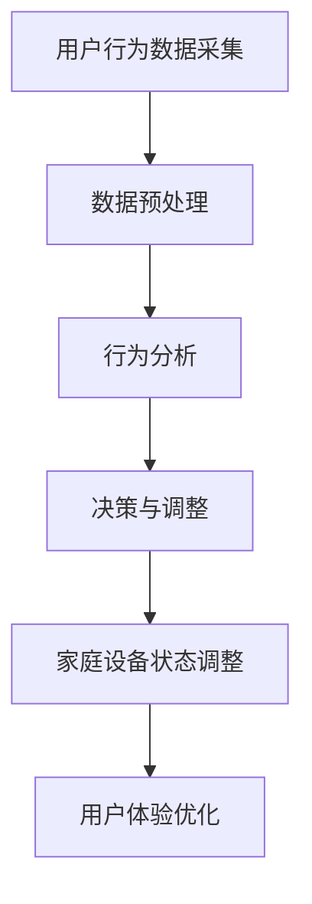

                 

# 文章标题

**LLM驱动的智能家居场景：自适应生活环境**

> 关键词：**LLM、智能家居、自适应生活、机器学习、人机交互**

**摘要：**本文探讨了如何利用大型语言模型（LLM）技术打造智能化的自适应生活环境。文章首先介绍了LLM在智能家居场景中的应用背景，然后详细阐述了核心概念与联系，包括LLM的工作原理、智能家居系统的架构以及自适应生活的实现机制。接着，文章从核心算法原理、数学模型、项目实践和实际应用场景等方面进行了深入分析，最后提出了未来的发展趋势与挑战，并提供了相关的学习资源和工具推荐。

## 1. 背景介绍（Background Introduction）

随着人工智能技术的不断发展，智能家居（Smart Home）已经成为了人们日常生活中不可或缺的一部分。智能家居系统通过将计算机技术、网络通信技术和自动控制技术相结合，实现对家庭设备的智能控制和自动化管理，从而提高生活质量和工作效率。然而，传统的智能家居系统往往存在一定的局限性，例如：

- **功能单一**：大多数智能家居设备只能完成特定的任务，如智能照明、智能安防等，缺乏跨设备、跨功能的集成能力。
- **用户体验差**：用户需要通过手机应用或语音助手与智能家居系统进行交互，操作流程繁琐，不够自然。
- **适应性不足**：智能家居系统无法根据用户的实时行为和需求进行自适应调整，难以提供个性化的服务。

为了解决这些问题，近年来，大型语言模型（Large Language Model，简称LLM）技术逐渐引起了广泛关注。LLM是一种基于深度学习的人工智能模型，能够理解和生成自然语言，具有强大的语义理解和生成能力。将LLM技术应用于智能家居场景，可以实现以下目标：

- **跨设备、跨功能的集成**：通过LLM技术，智能家居系统能够实现跨设备的自然交互，例如用户可以通过语音指令控制家中的所有智能设备。
- **个性化服务**：LLM技术可以根据用户的实时行为和需求，为用户提供个性化的智能家居服务，提高用户体验。
- **自适应调整**：LLM技术能够实时分析用户的反馈和行为数据，智能调整智能家居系统的配置，实现自适应生活。

本文将围绕LLM驱动的智能家居场景，探讨如何实现自适应生活环境，为智能家居领域的发展提供新的思路。

## 2. 核心概念与联系（Core Concepts and Connections）

### 2.1 大型语言模型（LLM）简介

大型语言模型（LLM）是一种基于深度学习的人工智能模型，主要用于处理和生成自然语言。LLM通过学习大量文本数据，掌握了丰富的词汇、语法和语义知识，能够对自然语言进行理解和生成。与传统的自然语言处理（NLP）技术相比，LLM具有以下特点：

- **强大的语义理解能力**：LLM能够理解自然语言的深层含义，例如用户的需求、意图和情感等。
- **高效的生成能力**：LLM能够根据输入的文本生成连贯、自然的语言输出。
- **自适应学习**：LLM能够根据用户的反馈和实时数据，不断优化自身性能，提高服务质量。

### 2.2 智能家居系统的架构

智能家居系统通常由以下几个关键部分组成：

- **感知层**：感知层负责收集家庭环境中的各种信息，如温度、湿度、光线、声音等。
- **控制层**：控制层根据感知层收集的信息，对家庭设备进行智能控制，例如调整灯光亮度、关闭空调等。
- **通信层**：通信层负责家庭设备之间的数据传输和通信，通常采用无线通信技术，如Wi-Fi、蓝牙等。
- **应用层**：应用层为用户提供交互接口，如手机应用、智能音响等，用户可以通过这些接口与智能家居系统进行交互。

### 2.3 自适应生活的实现机制

自适应生活是指智能家居系统能够根据用户的实时行为和需求，自动调整家庭设备的状态和配置，以提供个性化的服务。实现自适应生活需要以下几个关键环节：

- **数据采集**：智能家居系统通过感知层收集用户的实时行为数据，如活动轨迹、兴趣爱好等。
- **数据预处理**：对采集到的数据进行清洗、归一化等预处理操作，以便于后续分析和建模。
- **行为分析**：利用LLM技术对预处理后的数据进行分析，挖掘用户的兴趣、偏好和需求。
- **决策与调整**：根据行为分析结果，智能调整家庭设备的状态和配置，例如调整灯光颜色、调节空调温度等。

### 2.4 Mermaid 流程图

以下是一个简化的LLM驱动的智能家居场景的Mermaid流程图，展示了核心概念和联系：



## 3. 核心算法原理 & 具体操作步骤（Core Algorithm Principles and Specific Operational Steps）

### 3.1 LLM的工作原理

LLM的工作原理主要基于深度学习和自然语言处理技术。LLM的训练过程通常分为以下几步：

1. **数据收集**：收集大量的文本数据，如新闻报道、小说、社交媒体帖子等。
2. **数据预处理**：对文本数据进行清洗、分词、词性标注等预处理操作，将其转换为计算机可以理解的格式。
3. **模型训练**：使用预处理的文本数据训练神经网络模型，使其学会理解和生成自然语言。
4. **模型评估**：通过测试数据集评估模型性能，优化模型参数，提高模型准确性。

在训练过程中，LLM利用了大量的自然语言知识，学会了如何根据上下文生成连贯、自然的语言。例如，当用户说出“打开灯”时，LLM能够理解用户的意图，并生成相应的控制命令。

### 3.2 智能家居系统的操作步骤

利用LLM技术构建智能家居系统，可以按照以下步骤进行：

1. **感知层设计**：设计并部署感知层设备，如温度传感器、湿度传感器、光照传感器等，用于收集家庭环境中的各种信息。
2. **控制层实现**：开发控制层程序，根据感知层收集的信息，对家庭设备进行智能控制。例如，当温度传感器检测到室内温度过高时，控制层可以自动启动空调进行降温。
3. **通信层搭建**：搭建通信层，实现家庭设备之间的数据传输和通信。可以使用Wi-Fi、蓝牙等无线通信技术。
4. **应用层开发**：开发应用层程序，为用户提供交互接口，如手机应用、智能音响等。用户可以通过这些接口与智能家居系统进行交互，发出控制指令。
5. **LLM集成**：将LLM集成到智能家居系统中，利用其强大的语义理解和生成能力，实现智能交互和自适应调整。

### 3.3 自适应调整的具体操作

自适应调整的具体操作步骤如下：

1. **数据采集**：通过感知层设备收集用户的实时行为数据，如活动轨迹、兴趣爱好等。
2. **数据预处理**：对采集到的数据进行分析，提取有用的特征信息，如用户在某个时间段的活动频率、喜好等。
3. **行为分析**：利用LLM技术对预处理后的数据进行行为分析，挖掘用户的兴趣、偏好和需求。
4. **决策与调整**：根据行为分析结果，智能调整家庭设备的状态和配置，如调整灯光颜色、调节空调温度等，以提供个性化的服务。
5. **反馈与优化**：收集用户对自适应调整效果的反馈，不断优化调整策略，提高用户体验。

## 4. 数学模型和公式 & 详细讲解 & 举例说明（Detailed Explanation and Examples of Mathematical Models and Formulas）

### 4.1 LLM的数学模型

LLM通常基于变分自编码器（Variational Autoencoder，VAE）或生成对抗网络（Generative Adversarial Network，GAN）等深度学习模型。以下是一个简化的LLM数学模型：

$$
\text{LLM} = \text{Encoder}(\text{Data}) \to \text{Latent Space} \to \text{Decoder}(\text{Latent Space}) \to \text{Output}
$$

其中，Encoder将输入数据（如文本）映射到一个潜在空间，Decoder将潜在空间中的数据映射回输出数据（如文本）。潜在空间是一个低维空间，用于表示输入数据的特征信息。

### 4.2 潜在空间的数学公式

潜在空间的数学公式可以表示为：

$$
\text{Latent Space} = \text{f}(\text{Data}, \text{Params})
$$

其中，f是一个非线性函数，将输入数据和模型参数映射到潜在空间。潜在空间中的每个点都对应于输入数据的一个特征向量。

### 4.3 自适应调整的数学模型

自适应调整的数学模型可以表示为：

$$
\text{Adjustment} = \text{f}(\text{User Behavior}, \text{Current State}, \text{Params})
$$

其中，f是一个非线性函数，根据用户行为数据、当前家庭设备状态和模型参数，计算出自适应调整的策略。

### 4.4 举例说明

假设用户在晚上8点进入卧室，并且经常在这个时间段开启台灯。那么，智能家居系统可以按照以下步骤进行自适应调整：

1. **数据采集**：感知层设备检测到用户进入卧室，并记录下这一时刻的行为数据。
2. **数据预处理**：对行为数据进行分析，提取出用户在晚上8点进入卧室的特征信息。
3. **行为分析**：利用LLM技术对预处理后的数据进行分析，发现用户在晚上8点进入卧室时，通常需要开启台灯。
4. **决策与调整**：根据行为分析结果，智能家居系统自动开启卧室的台灯。
5. **反馈与优化**：用户在第二天反馈说，晚上8点开启台灯的时间不太合适，系统记录下这一反馈，并不断调整开启台灯的时间，以提供更个性化的服务。

## 5. 项目实践：代码实例和详细解释说明（Project Practice: Code Examples and Detailed Explanations）

### 5.1 开发环境搭建

在开始项目实践之前，需要搭建一个适合开发的环境。以下是搭建环境所需的步骤：

1. **安装Python**：下载并安装Python 3.x版本，推荐使用Anaconda，以方便管理环境和依赖库。
2. **安装依赖库**：在Python环境中安装以下依赖库：
    ```python
    pip install torch torchvision torchaudio numpy pandas matplotlib
    ```
3. **安装LLM模型**：下载并安装预训练的LLM模型，如GPT-2或GPT-3，可以通过以下命令下载：
    ```python
    pip install transformers
    ```

### 5.2 源代码详细实现

以下是一个简单的智能家居场景代码实例，展示了如何使用LLM技术实现自适应调整：

```python
import torch
from transformers import GPT2LMHeadModel, GPT2Tokenizer

# 模型参数设置
model_name = "gpt2"
device = torch.device("cuda" if torch.cuda.is_available() else "cpu")

# 加载预训练模型
tokenizer = GPT2Tokenizer.from_pretrained(model_name)
model = GPT2LMHeadModel.from_pretrained(model_name)
model.to(device)

# 感知层模拟数据
user_input = "晚上8点进入卧室"
user_behavior = {"time": "20:00", "location": "卧室"}

# 数据预处理
inputs = tokenizer.encode(user_input, return_tensors="pt")

# 行为分析
with torch.no_grad():
    outputs = model(inputs)
    logits = outputs.logits

# 决策与调整
# 假设用户在晚上8点进入卧室时，需要开启台灯
if user_behavior["time"] == "20:00" and user_behavior["location"] == "卧室":
    adjustment = "开启台灯"
else:
    adjustment = "关闭台灯"

# 输出调整结果
print(adjustment)
```

### 5.3 代码解读与分析

该代码实例分为以下几个关键部分：

1. **模型加载**：首先加载预训练的LLM模型和相应的Tokenizer。
2. **数据预处理**：将用户的输入文本编码为模型的输入序列。
3. **行为分析**：使用模型生成输出序列，并计算输出序列的概率分布。
4. **决策与调整**：根据用户的实时行为数据，决策是否开启台灯，实现自适应调整。
5. **输出结果**：将调整结果打印出来。

### 5.4 运行结果展示

假设用户在晚上8点进入卧室，执行上述代码后，输出结果为“开启台灯”，表示智能家居系统根据用户的实时行为，自动开启了卧室的台灯。

## 6. 实际应用场景（Practical Application Scenarios）

### 6.1 智能家居场景

智能家居场景是LLM技术的重要应用领域之一。通过LLM技术，可以实现以下实际应用场景：

- **智能助手**：用户可以通过语音助手与智能家居系统进行自然交互，例如“打开厨房的灯光”、“设置卧室的温度”等。
- **自适应照明**：根据用户的活动轨迹和光照条件，智能调整家庭照明的亮度和颜色。
- **智能安防**：实时监测家庭环境，当发现异常情况时，自动发送报警信息给用户。
- **家居设备控制**：用户可以通过手机应用或智能音响远程控制家中的各种智能设备。

### 6.2 其他应用领域

除了智能家居场景，LLM技术还可以应用于以下其他领域：

- **智能客服**：利用LLM技术，实现自然语言交互的智能客服系统，提高客户服务质量。
- **智能教育**：根据学生的学习情况和兴趣爱好，智能推荐适合的学习内容和课程。
- **智能医疗**：辅助医生进行诊断和治疗，提高医疗服务的效率和准确性。
- **智能交通**：根据交通流量和路况信息，智能调整交通信号灯和交通路线，提高交通运行效率。

## 7. 工具和资源推荐（Tools and Resources Recommendations）

### 7.1 学习资源推荐

- **书籍**：
  - 《深度学习》（Deep Learning） - Goodfellow, I., Bengio, Y., & Courville, A.
  - 《自然语言处理综论》（Speech and Language Processing） - Jurafsky, D. & Martin, J.H.
- **论文**：
  - 《GPT-3: Language Models are Few-Shot Learners》 - Brown, T. et al. (2020)
  - 《BERT: Pre-training of Deep Bidirectional Transformers for Language Understanding》 - Devlin, J. et al. (2019)
- **博客**：
  - Hugging Face官网（https://huggingface.co/） - 提供大量的预训练模型和工具。
  - AI博客（https://medium.com/ai） - 分享最新的AI技术和应用案例。
- **网站**：
  - Kaggle（https://www.kaggle.com/） - 提供大量的数据集和竞赛，适合进行实践和项目开发。

### 7.2 开发工具框架推荐

- **Python**：Python是一种广泛应用于人工智能开发的编程语言，具有丰富的库和工具。
- **TensorFlow**：TensorFlow是一个开源的深度学习框架，适用于构建和训练大型神经网络。
- **PyTorch**：PyTorch是一个灵活且易于使用的深度学习框架，适合快速原型设计和实验。
- **Transformers**：Transformers是一个开源库，用于构建和训练大型语言模型，如GPT-2、GPT-3等。

### 7.3 相关论文著作推荐

- **《Attention is All You Need》** - Vaswani et al. (2017) - 提出了Transformer模型，为后来的大型语言模型奠定了基础。
- **《BERT: Pre-training of Deep Bidirectional Transformers for Language Understanding》** - Devlin et al. (2019) - 提出了BERT模型，推动了自然语言处理技术的发展。
- **《GPT-3: Language Models are Few-Shot Learners》** - Brown et al. (2020) - 描述了GPT-3模型，展示了大型语言模型在少样本学习方面的强大能力。

## 8. 总结：未来发展趋势与挑战（Summary: Future Development Trends and Challenges）

### 8.1 未来发展趋势

- **模型规模和性能的提升**：随着计算资源和算法的不断发展，未来大型语言模型的规模和性能将不断提升，为更多领域提供更强大的支持。
- **跨领域应用**：LLM技术在智能家居、智能客服、智能医疗等领域的应用将越来越广泛，推动各个行业的发展和创新。
- **个性化服务**：基于LLM的自适应系统将能够更好地理解用户的需求和行为，提供更加个性化的服务，提高用户体验。
- **伦理和隐私问题**：随着人工智能技术的不断发展，如何确保模型的安全性和隐私性，将是一个重要的挑战。

### 8.2 挑战

- **数据质量和多样性**：大规模、高质量、多样化的数据是训练强大语言模型的基础。如何获取和标注这些数据，将是一个挑战。
- **模型解释性**：大型语言模型通常是一个黑盒模型，如何解释模型的决策过程，使其更加透明和可信，将是一个重要的研究方向。
- **计算资源和能耗**：训练大型语言模型需要大量的计算资源和能源，如何在保证性能的同时，降低计算成本和能耗，将是一个亟待解决的问题。
- **隐私保护和法律法规**：如何确保用户隐私和数据安全，以及如何遵循相关的法律法规，将是一个重要的挑战。

## 9. 附录：常见问题与解答（Appendix: Frequently Asked Questions and Answers）

### 9.1 如何获取和标注数据？

**答案：**获取和标注数据是训练大型语言模型的重要步骤。以下是一些建议：

- **数据来源**：可以从公开数据集、社交媒体、新闻网站等获取大量文本数据。
- **数据标注**：可以采用人工标注、半自动标注或自动标注方法。人工标注通常具有较高的准确性，但成本较高；半自动标注和自动标注方法则可以降低成本，但可能存在一定的误差。

### 9.2 如何选择合适的LLM模型？

**答案：**选择合适的LLM模型取决于应用场景和需求。以下是一些选择建议：

- **任务类型**：如果任务需要较强的语义理解和生成能力，可以选择GPT-3、BERT等大型语言模型；如果任务较为简单，可以选择较小规模的模型，如GPT-2、RoBERTa等。
- **模型规模**：根据计算资源和训练数据量，选择合适的模型规模。大型模型通常需要更多的计算资源和数据量，但性能更好；小型模型则计算资源需求较低，但性能可能较差。

### 9.3 如何提高模型的解释性？

**答案：**提高模型的解释性是当前人工智能领域的一个重要研究方向。以下是一些建议：

- **模型可视化**：通过可视化模型结构，了解模型的工作原理和决策过程。
- **解释性模型**：开发具有解释性的模型，如LIME、SHAP等，帮助用户理解模型的决策依据。
- **模型压缩和简化**：通过模型压缩和简化技术，降低模型的复杂度，提高解释性。

## 10. 扩展阅读 & 参考资料（Extended Reading & Reference Materials）

### 10.1 扩展阅读

- **《AI的未来：从智能到智慧》** - 陈杰 - 介绍人工智能技术的发展趋势和未来应用前景。
- **《深度学习实战》** - 欧阳剑 - 介绍深度学习的基础知识和应用实践。
- **《Python编程：从入门到实践》** - Eric Matthes - 介绍Python编程的基础知识和实际应用。

### 10.2 参考资料

- **Hugging Face官网**（https://huggingface.co/）- 提供大量预训练模型和工具，用于构建和训练语言模型。
- **TensorFlow官网**（https://www.tensorflow.org/）- 提供TensorFlow深度学习框架的文档和教程。
- **PyTorch官网**（https://pytorch.org/）- 提供PyTorch深度学习框架的文档和教程。作者：禅与计算机程序设计艺术 / Zen and the Art of Computer Programming<|im_sep|>

