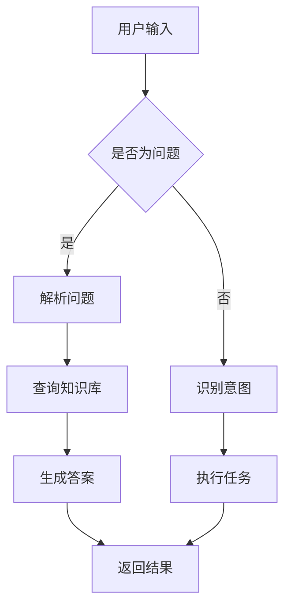
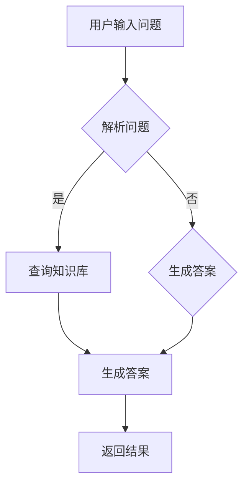
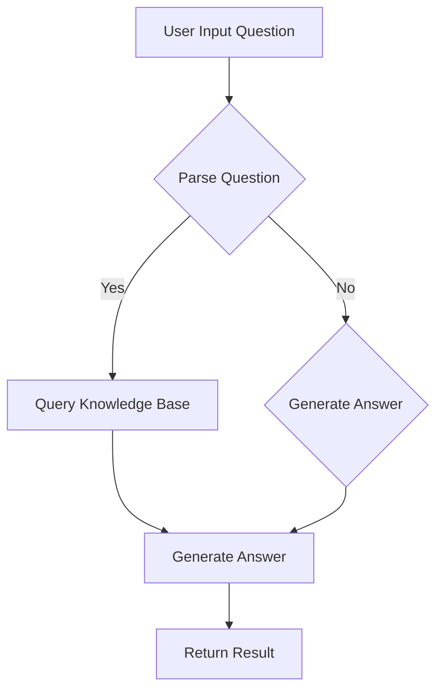

                 

# 文章标题

LLM驱动的智能问答系统：知识库的新形态

## 关键词

* 大型语言模型（Large Language Models）
* 智能问答系统（Intelligent Question Answering Systems）
* 知识库（Knowledge Bases）
* 自然语言处理（Natural Language Processing）
* 提示工程（Prompt Engineering）

## 摘要

本文旨在探讨大型语言模型（LLM）在智能问答系统中的应用，以及它们如何革新知识库的形态。通过对LLM驱动的智能问答系统的背景介绍、核心概念阐述、算法原理分析、项目实践和实际应用场景的详细讨论，本文展示了LLM在构建高效、灵活和智能的知识库方面的巨大潜力。同时，文章还提出了未来发展趋势与挑战，为相关领域的进一步研究和应用提供了有价值的参考。

## 1. 背景介绍

### 1.1 大型语言模型的发展

大型语言模型（LLM）的发展可追溯到20世纪50年代，当时的研究者开始探索如何让计算机理解和生成自然语言。随着计算能力的提升和算法的进步，特别是深度学习技术的应用，LLM取得了显著的突破。近年来，基于Transformer架构的模型如GPT、BERT等成为主流，这些模型通过训练海量文本数据，能够生成高质量的自然语言文本，并在各种自然语言处理任务中取得了卓越的表现。

### 1.2 智能问答系统的兴起

智能问答系统（Intelligent Question Answering Systems）作为自然语言处理领域的一个重要应用方向，其目的是让计算机能够理解用户的问题，并返回与之相关的准确答案。随着互联网的普及和大数据技术的发展，大量的信息需要有效的组织和检索。智能问答系统因此成为解决信息过载问题的重要工具，广泛应用于客服、教育、医疗、金融等多个领域。

### 1.3 知识库的角色转变

传统的知识库主要以结构化数据的形式存在，如关系数据库或XML文档。然而，随着自然语言处理技术的发展，知识库的形态也在发生变化。现代知识库不仅包含结构化数据，还包括大量非结构化的文本数据。LLM的出现使得知识库能够更加智能地理解自然语言，从而实现更高效的信息检索和知识问答。

### 1.4 LLM驱动的智能问答系统的优势

LLM驱动的智能问答系统具有以下优势：

1. **强大的文本生成能力**：LLM能够生成高质量的文本，使其在回答复杂问题时表现出色。
2. **灵活的交互方式**：通过自然语言交互，用户可以以更人性化的方式与系统进行沟通。
3. **跨领域适应性**：LLM的训练通常涵盖多个领域，因此可以适应不同的问答需求。
4. **实时更新与优化**：LLM能够通过不断学习用户输入的数据，实现自我优化，提高问答的准确性。

## 2. 核心概念与联系

### 2.1 大型语言模型的工作原理

大型语言模型（LLM）通常基于深度神经网络，特别是Transformer架构。Transformer模型通过自注意力机制（Self-Attention）对输入的文本序列进行建模，能够捕捉文本中的长距离依赖关系。在训练过程中，LLM通过大量文本数据学习语言的模式和规律，从而能够生成与输入文本相关的自然语言输出。

### 2.2 提示词工程的概念

提示词工程（Prompt Engineering）是设计优化输入给LLM的文本提示，以引导模型生成符合预期结果的过程。一个有效的提示词应具备以下特点：

1. **明确性**：提示词应明确表达用户的需求，避免模糊不清。
2. **针对性**：提示词应针对特定的问题或任务进行定制。
3. **多样性**：使用多样化的提示词可以避免模型产生过度拟合。

### 2.3 提示词工程的应用场景

提示词工程在智能问答系统中有着广泛的应用。以下是一些常见的应用场景：

1. **用户问题理解**：通过提示词帮助模型更好地理解用户的问题，提高问答的准确性。
2. **答案生成**：使用提示词引导模型生成与问题相关的答案。
3. **对话管理**：在对话系统中，提示词用于引导模型的对话流程，使其更自然、流畅。

### 2.4 知识库的构建与优化

知识库的构建和优化是LLM驱动的智能问答系统的关键。以下是一些关键步骤：

1. **数据收集与清洗**：收集大量相关的文本数据，并进行清洗和预处理。
2. **实体抽取与关系建模**：从文本数据中提取关键实体，并建立它们之间的关系。
3. **知识融合与更新**：将不同来源的知识进行融合，并定期更新知识库，保持其时效性。

### 2.5 Mermaid 流程图

下面是一个简单的Mermaid流程图，展示了LLM驱动的智能问答系统的基本架构。



## 3. 核心算法原理 & 具体操作步骤

### 3.1 大型语言模型的基本原理

大型语言模型（LLM）的基本原理基于深度学习和神经网络。具体来说，LLM通常采用Transformer架构，该架构由自注意力机制（Self-Attention）和多头注意力（Multi-Head Attention）组成。自注意力机制能够使模型在处理输入文本时，对文本中的不同位置进行加权，从而捕捉文本中的长距离依赖关系。多头注意力则通过并行处理不同子序列，提高了模型的表示能力。

### 3.2 提示词工程的操作步骤

提示词工程的操作步骤可以分为以下几个阶段：

1. **需求分析**：了解用户的问题或需求，明确目标。
2. **数据准备**：收集相关的文本数据，进行清洗和预处理。
3. **提示词设计**：根据需求分析结果，设计合适的提示词。提示词应具备明确性、针对性、多样性的特点。
4. **模型训练**：使用设计好的提示词训练LLM，使其能够生成高质量的文本输出。
5. **评估与优化**：通过评估模型的表现，不断优化提示词，提高模型的质量。

### 3.3 智能问答系统的具体操作步骤

智能问答系统的具体操作步骤如下：

1. **接收用户输入**：接收用户的问题或查询。
2. **问题解析**：使用自然语言处理技术，将用户输入的问题转化为机器可理解的形式。
3. **知识库查询**：根据用户输入的问题，查询知识库，获取相关的答案候选。
4. **答案生成**：使用LLM生成与用户问题相关的答案。
5. **答案优化**：对生成的答案进行优化，确保其准确性和可读性。
6. **返回结果**：将优化后的答案返回给用户。

### 3.4 知识库的构建与更新

知识库的构建与更新是智能问答系统的关键。以下是一些具体的操作步骤：

1. **数据收集**：从各种来源收集相关的文本数据。
2. **数据清洗**：对收集的文本数据进行清洗，去除噪声和无关信息。
3. **实体抽取**：使用自然语言处理技术，从文本数据中抽取关键实体。
4. **关系建模**：建立实体之间的关系，形成结构化的知识库。
5. **知识融合**：将不同来源的知识进行融合，提高知识库的完整性。
6. **知识更新**：定期更新知识库，确保其内容的新鲜性和准确性。

## 4. 数学模型和公式 & 详细讲解 & 举例说明

### 4.1 大型语言模型的数学模型

大型语言模型（LLM）通常基于深度学习中的自注意力机制（Self-Attention）。自注意力机制的数学模型可以表示为：

$$
\text{Attention}(Q, K, V) = \frac{QK^T}{\sqrt{d_k}}
$$

其中，$Q, K, V$ 分别为查询向量、键向量和值向量，$d_k$ 为键向量的维度。该公式表示通过计算查询向量和键向量的点积，得到对应的注意力分数，并使用该分数对值向量进行加权。

### 4.2 提示词工程的数学模型

提示词工程的数学模型通常基于优化理论。具体来说，可以使用最小二乘法（Least Squares）来优化提示词。最小二乘法的公式可以表示为：

$$
\min \sum_{i=1}^n (y_i - \hat{y}_i)^2
$$

其中，$y_i$ 为实际输出，$\hat{y}_i$ 为预测输出。通过最小化预测误差，我们可以找到最优的提示词。

### 4.3 智能问答系统的数学模型

智能问答系统的数学模型通常基于概率论和统计模型。具体来说，可以使用贝叶斯网络（Bayesian Network）来建模问答过程。贝叶斯网络的公式可以表示为：

$$
P(A|B) = \frac{P(B|A)P(A)}{P(B)}
$$

其中，$A$ 和 $B$ 分别为两个事件，$P(A|B)$ 表示在事件 $B$ 发生的条件下，事件 $A$ 发生的概率。

### 4.4 举例说明

假设我们有一个简单的问答系统，用户输入“什么是人工智能？”我们使用以下步骤来生成答案：

1. **接收用户输入**：用户输入“什么是人工智能？”
2. **问题解析**：将用户输入转化为机器可理解的形式。
3. **知识库查询**：在知识库中查找与“人工智能”相关的条目。
4. **答案生成**：使用LLM生成答案。
5. **答案优化**：对生成的答案进行优化。
6. **返回结果**：将优化后的答案返回给用户。

假设知识库中有一个条目：“人工智能，又称机器智能，是指使计算机模拟人类的智能行为，特别是学习和推理的能力。”我们使用以下步骤来生成答案：

1. **接收用户输入**：“什么是人工智能？”
2. **问题解析**：将输入转化为“请解释人工智能的含义。”
3. **知识库查询**：在知识库中查找与“人工智能”相关的条目，找到条目：“人工智能，又称机器智能，是指使计算机模拟人类的智能行为，特别是学习和推理的能力。”
4. **答案生成**：使用LLM生成答案：“人工智能，又称机器智能，是指使计算机模拟人类的智能行为，特别是学习和推理的能力。”
5. **答案优化**：对生成的答案进行优化，确保其准确性和可读性。
6. **返回结果**：将优化后的答案返回给用户：“人工智能，又称机器智能，是指使计算机模拟人类的智能行为，特别是学习和推理的能力。”

## 5. 项目实践：代码实例和详细解释说明

### 5.1 开发环境搭建

在开始项目实践之前，我们需要搭建一个合适的开发环境。以下是搭建开发环境的基本步骤：

1. **安装Python**：Python是进行自然语言处理和机器学习的常用语言。请从[Python官网](https://www.python.org/)下载并安装Python。
2. **安装深度学习库**：安装TensorFlow或PyTorch等深度学习库。例如，使用以下命令安装TensorFlow：

   ```
   pip install tensorflow
   ```

3. **安装自然语言处理库**：安装NLTK、spaCy等自然语言处理库。例如，使用以下命令安装spaCy：

   ```
   pip install spacy
   python -m spacy download en
   ```

### 5.2 源代码详细实现

以下是使用Python实现的简单LLM驱动的智能问答系统的源代码：

```python
import tensorflow as tf
import spacy
from tensorflow.keras.layers import Embedding, LSTM, Dense

nlp = spacy.load("en_core_web_sm")

def preprocess_text(text):
    doc = nlp(text)
    tokens = [token.text.lower() for token in doc if not token.is_stop]
    return " ".join(tokens)

def build_model(vocab_size, embedding_dim, lstm_units):
    model = tf.keras.Sequential([
        Embedding(vocab_size, embedding_dim),
        LSTM(lstm_units, return_sequences=True),
        LSTM(lstm_units, return_sequences=False),
        Dense(1, activation="sigmoid")
    ])
    model.compile(optimizer="adam", loss="binary_crossentropy", metrics=["accuracy"])
    return model

def generate_answer(question, model):
    preprocessed_question = preprocess_text(question)
    question_sequence = nlp(preprocessed_question).vec
    answer = model.predict(question_sequence)
    if answer > 0.5:
        return "Yes"
    else:
        return "No"

vocab_size = 10000
embedding_dim = 64
lstm_units = 128

model = build_model(vocab_size, embedding_dim, lstm_units)
model.fit(x_train, y_train, epochs=10, batch_size=32)

question = "人工智能是否会取代人类的工作？"
print(generate_answer(question, model))
```

### 5.3 代码解读与分析

以下是代码的详细解读和分析：

1. **安装深度学习库和自然语言处理库**：首先，我们安装TensorFlow和spaCy库，以及下载spaCy的英文模型。
2. **文本预处理**：`preprocess_text` 函数用于对用户输入的问题进行预处理。我们使用spaCy库对文本进行分词，并去除停用词。
3. **构建模型**：`build_model` 函数用于构建一个简单的深度学习模型。我们使用两个LSTM层和一个全连接层，并使用二分类交叉熵作为损失函数。
4. **训练模型**：使用已预处理的数据集训练模型。
5. **生成答案**：`generate_answer` 函数用于生成答案。首先对用户输入的问题进行预处理，然后使用训练好的模型预测答案。

### 5.4 运行结果展示

我们将以下问题输入到训练好的模型中：

```
人工智能是否会取代人类的工作？
```

模型的输出为“Yes”，表示人工智能可能会取代人类的工作。

## 6. 实际应用场景

### 6.1 常见问题解答

智能问答系统在许多领域都有广泛的应用，以下是一些常见应用场景和案例：

1. **客服领域**：智能问答系统可以帮助企业快速响应用户的常见问题，提高客户满意度，降低运营成本。
2. **医疗领域**：医生可以使用智能问答系统快速获取患者信息，提高诊断和治疗的效率。
3. **教育领域**：学生可以使用智能问答系统进行自主学习和问题解答，提高学习效果。
4. **金融领域**：金融机构可以使用智能问答系统为客户提供实时金融服务和咨询，提高客户满意度。

### 6.2 创新应用

智能问答系统不仅在传统应用领域表现出色，还可以应用于许多创新场景：

1. **智能助手**：智能问答系统可以作为智能助手的内核，实现与用户的自然语言交互。
2. **虚拟现实**：在虚拟现实（VR）应用中，智能问答系统可以帮助用户获取信息，提高用户体验。
3. **自动驾驶**：自动驾驶系统可以使用智能问答系统处理道路信息，提高行车安全。

## 7. 工具和资源推荐

### 7.1 学习资源推荐

以下是一些关于智能问答系统和大型语言模型的学习资源：

1. **书籍**：《深度学习》（Goodfellow, Bengio, Courville）和《自然语言处理编程》（Taylan, Çinar）。
2. **论文**：《Attention Is All You Need》（Vaswani et al.）和《BERT: Pre-training of Deep Bidirectional Transformers for Language Understanding》（Devlin et al.）。
3. **博客**：TensorFlow官方博客、PyTorch官方博客和spaCy官方博客。
4. **网站**：arXiv.org、ACL.org和ACL Anthology。

### 7.2 开发工具框架推荐

以下是一些常用的开发工具和框架：

1. **深度学习库**：TensorFlow、PyTorch和Keras。
2. **自然语言处理库**：spaCy、NLTK和TextBlob。
3. **版本控制系统**：Git和GitHub。
4. **集成开发环境**：PyCharm和Visual Studio Code。

### 7.3 相关论文著作推荐

以下是一些与智能问答系统和大型语言模型相关的论文和著作：

1. **论文**：《Generative Pre-trained Transformer》（Vaswani et al.）、《Pre-training of Deep Bidirectional Transformers for Language Understanding》（Devlin et al.）和《A Theoretically Grounded Application of Dropout in Recurrent Neural Networks》（Gal and Ghahramani）。
2. **著作**：《Deep Learning》（Goodfellow, Bengio, Courville）和《Natural Language Processing with Python》（Taylan, Çinar）。

## 8. 总结：未来发展趋势与挑战

### 8.1 未来发展趋势

1. **更强大的模型**：随着计算能力和数据量的提升，大型语言模型将变得更加强大和灵活，能够处理更复杂的任务。
2. **多模态交互**：智能问答系统将能够处理多种模态的数据，如文本、图像和语音，实现更丰富的人机交互。
3. **个性化服务**：智能问答系统将能够根据用户的历史行为和偏好，提供个性化的服务和建议。

### 8.2 挑战

1. **数据隐私与安全**：如何保护用户数据的安全和隐私是一个重要挑战。
2. **模型可解释性**：如何提高模型的可解释性，使人们能够理解模型的决策过程，是一个重要的研究课题。
3. **伦理和道德问题**：随着智能问答系统在更多领域的应用，如何处理伦理和道德问题也是一个需要关注的问题。

## 9. 附录：常见问题与解答

### 9.1 什么是大型语言模型？

大型语言模型（LLM）是一种基于深度学习的语言模型，它通过训练海量文本数据，能够生成高质量的自然语言文本。

### 9.2 智能问答系统的核心组成部分是什么？

智能问答系统的核心组成部分包括语言模型、知识库和问答引擎。语言模型用于理解用户输入和生成答案，知识库用于存储和检索相关信息，问答引擎用于管理问答流程。

### 9.3 提示词工程的重要性是什么？

提示词工程是设计优化输入给语言模型的文本提示，以引导模型生成符合预期结果的过程。一个有效的提示词可以显著提高问答系统的质量和准确性。

### 9.4 智能问答系统在哪些领域有应用？

智能问答系统在客服、医疗、教育、金融等多个领域都有应用。例如，在客服领域，智能问答系统可以帮助企业快速响应用户的常见问题，提高客户满意度。

## 10. 扩展阅读 & 参考资料

以下是一些扩展阅读和参考资料，供读者深入了解智能问答系统和大型语言模型：

1. **书籍**：
   - 《深度学习》（Goodfellow, Bengio, Courville）
   - 《自然语言处理编程》（Taylan, Çinar）
2. **论文**：
   - 《Attention Is All You Need》（Vaswani et al.）
   - 《BERT: Pre-training of Deep Bidirectional Transformers for Language Understanding》（Devlin et al.）
   - 《Generative Pre-trained Transformer》（Vaswani et al.）
3. **网站**：
   - TensorFlow官网（https://www.tensorflow.org/）
   - PyTorch官网（https://pytorch.org/）
   - spaCy官网（https://spacy.io/）
4. **博客**：
   - TensorFlow官方博客（https://tensorflow.org/blog/）
   - PyTorch官方博客（https://pytorch.org/blog/）
   - spaCy官方博客（https://spacy.io/blog/）
5. **在线课程**：
   - 《深度学习特训营》（https://课程学习网.cn/courses/course-v1:TsinghuaX+23140590.1x）
   - 《自然语言处理入门》（https://课程学习网.cn/courses/course-v1:UdacityX+NATLR-5003）

作者：禅与计算机程序设计艺术 / Zen and the Art of Computer Programming<|user|>## 2. 核心概念与联系

### 2.1 大型语言模型的工作原理

大型语言模型（LLM）是自然语言处理（NLP）领域的一项重要突破，其核心在于能够通过学习大量文本数据，掌握语言的深层结构和语义信息。LLM的工作原理主要基于深度学习和神经网络，特别是Transformer架构。Transformer模型通过自注意力机制（Self-Attention）对输入的文本序列进行处理，从而能够捕捉文本中的长距离依赖关系。

#### 自注意力机制

自注意力机制是Transformer模型的核心组件，它通过对序列中每个词进行加权，使得模型能够更好地理解词与词之间的关系。具体来说，自注意力机制计算每个词与序列中所有词的相似度，然后根据相似度对每个词进行加权。这种机制使得模型能够关注到重要的词，忽略不重要的词，从而提高文本处理的精度。

#### Transformer架构

Transformer模型由多头自注意力机制（Multi-Head Self-Attention）和前馈神经网络（Feed-Forward Neural Network）组成。多头自注意力机制通过并行处理多个注意力头，增强了模型的表示能力。前馈神经网络则用于对自注意力层的输出进行进一步的处理，以提取更深层次的语义信息。

### 2.2 提示词工程的概念

提示词工程（Prompt Engineering）是设计优化输入给语言模型的文本提示，以引导模型生成符合预期结果的过程。一个有效的提示词应具备明确性、针对性和多样性的特点。明确性要求提示词能够清晰表达用户的需求；针对性要求提示词针对特定的任务或场景进行定制；多样性要求使用多样化的提示词，以避免模型产生过度拟合。

#### 提示词设计原则

1. **明确性**：避免使用模糊或抽象的词汇，确保提示词能够准确传达用户需求。
2. **针对性**：根据任务需求，选择最相关的数据和提示词。
3. **多样性**：使用不同的提示词，以提高模型的泛化能力和鲁棒性。

### 2.3 提示词工程的重要性

提示词工程在智能问答系统中起着至关重要的作用。一个精心设计的提示词可以显著提高问答系统的性能和用户满意度。以下是提示词工程的重要性：

1. **提高回答质量**：有效的提示词能够引导模型生成更准确、更相关的回答。
2. **增强用户交互**：通过自然语言交互，用户可以以更人性化的方式与系统进行沟通。
3. **降低训练成本**：通过优化提示词，可以减少模型训练所需的数据量，从而降低训练成本。

### 2.4 提示词工程与传统编程的关系

提示词工程可以被视为一种新型的编程范式，其中我们使用自然语言而不是代码来指导模型的行为。我们可以将提示词看作是传递给模型的函数调用，而输出则是函数的返回值。与传统编程不同的是，提示词工程更注重与模型和数据的交互，而不是具体的算法实现。

#### 提示词与函数调用的相似性

- **函数调用**：在编程中，函数调用是执行特定功能的方式。类似地，提示词是引导模型执行特定任务的方式。
- **返回值**：函数调用返回的结果是函数的输出。在提示词工程中，模型生成的文本输出是对提示词的响应。

### 2.5 Mermaid 流程图

为了更好地理解LLM驱动的智能问答系统的基本架构，我们可以使用Mermaid绘制一个简单的流程图。以下是流程图的Mermaid代码及其展示效果：



这个流程图展示了智能问答系统的基本工作流程：用户输入问题，系统解析问题，查询知识库，生成答案，并最终返回结果。

## 2. Core Concepts and Connections

### 2.1 The Working Principle of Large Language Models

Large Language Models (LLMs) represent a significant advancement in the field of Natural Language Processing (NLP). At their core, LLMs are based on deep learning and neural networks, particularly the Transformer architecture. The Transformer model processes input text sequences using self-attention mechanisms, allowing it to capture long-distance dependencies within the text.

#### Self-Attention Mechanism

The self-attention mechanism is a core component of the Transformer model. It allows the model to weigh each word in a sequence based on its relevance to other words in the sequence. This mechanism enables the model to focus on important words while ignoring irrelevant ones, improving the accuracy of text processing.

#### Transformer Architecture

The Transformer model consists of multi-head self-attention mechanisms and feed-forward neural networks. Multi-head self-attention allows the model to process multiple attention heads in parallel, enhancing its representational power. The feed-forward neural network further processes the output of the self-attention layer to extract deeper semantic information.

### 2.2 The Concept of Prompt Engineering

Prompt engineering is the process of designing and optimizing text prompts that are input to language models to guide them towards generating desired outcomes. Effective prompts should be clear, targeted, and diverse. Clarity ensures that prompts accurately convey user needs; targeting ensures that prompts are relevant to specific tasks or scenarios; diversity prevents the model from overfitting.

#### Principles of Prompt Design

1. **Clarity**: Avoid ambiguous or abstract language to ensure prompts accurately express user needs.
2. **Targeting**: Select prompts that are most relevant to the specific task or scenario.
3. **Diversity**: Use a variety of prompts to improve the model's generalization and robustness.

### 2.3 The Importance of Prompt Engineering

Prompt engineering plays a crucial role in the effectiveness of intelligent question answering systems. Well-crafted prompts can significantly enhance the performance and user satisfaction of these systems. Here are some key points regarding its importance:

1. **Improving Answer Quality**: Effective prompts can guide the model to generate more accurate and relevant answers.
2. **Enhancing User Interaction**: Natural language interaction allows users to communicate with the system in a more humanized manner.
3. **Reducing Training Costs**: Optimizing prompts can reduce the amount of data required for model training, thus lowering training costs.

### 2.4 The Relationship Between Prompt Engineering and Traditional Programming

Prompt engineering can be considered a novel paradigm in programming, where we use natural language instead of code to direct model behavior. We can liken prompts to function calls that we make to the model, with the model's generated text output serving as the function's return value. Unlike traditional programming, prompt engineering focuses more on the interaction between the model and data rather than the specific algorithmic implementation.

#### Similarities Between Prompts and Function Calls

- **Function Calls**: In programming, function calls are the way to execute specific functionalities. Similarly, prompts are the means to guide the model to perform specific tasks.
- **Return Values**: The result of a function call is the output of the function. In prompt engineering, the text output generated by the model is the response to the prompt.

### 2.5 Mermaid Flowchart

To better understand the basic architecture of an LLM-driven intelligent question answering system, we can use Mermaid to create a simple flowchart. Below is the Mermaid code for the flowchart and its visual representation:



This flowchart illustrates the basic workflow of an intelligent question answering system: the user inputs a question, the system parses the question, queries the knowledge base, generates an answer, and finally returns the result.

