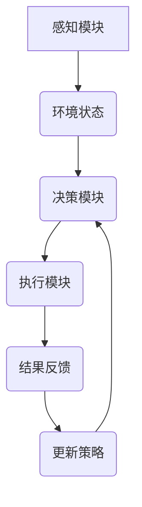

                 
# AI Agent: AI的下一个风口 智能体的核心技术

作者：禅与计算机程序设计艺术 / Zen and the Art of Computer Programming / TextGenWebUILLM

# AI Agent: AI的下一个风口 智能体的核心技术

## 1. 背景介绍

### 1.1 问题的由来

随着人工智能(AI)技术的快速发展，我们正站在一个新的转折点上——从传统的基于规则或简单的机器学习模型转向更加灵活、适应性强且能够自主决策的智能系统。这些系统不仅需要理解自然语言指令，还需要在复杂环境中做出合理决策并实现任务自动化。AI Agent作为这一转变的关键组成部分，成为推动AI技术进入下一阶段发展的关键力量。

### 1.2 研究现状

当前，AI Agent研究主要集中在以下几个方面：

- **强化学习**：利用试错方法让智能体在特定环境下学习最优行为策略，适用于游戏、机器人控制等领域。
- **规划算法**：如搜索算法、模型预测控制等，帮助智能体制定长远计划，并在动态环境中执行。
- **自然语言处理(NLP)**：使智能体能够理解文本命令，执行复杂的多步任务。
- **多智能体系统(MAS)**：涉及多个智能体之间的协作与竞争，用于模拟社会行为、群体决策等场景。

### 1.3 研究意义

AI Agent的发展对于实现更高级别的自主性和通用人工智能具有重要意义。它们不仅可以应用于游戏开发、自动驾驶、智能家居等传统领域，还可能在未来医疗、教育、法律等多个行业发挥关键作用，促进人类生活质量和工作效率的提升。

### 1.4 本文结构

本篇文章将围绕AI Agent的核心技术和实际应用展开讨论，旨在为读者提供深入的理解和指导。

## 2. 核心概念与联系

### 2.1 AI Agent定义

AI Agent是指具备感知能力（获取外部环境信息）、决策能力（根据当前状态和目标选择行动）以及执行能力（实施选定的操作以改变环境状态）的软件实体。其核心在于通过交互与环境建立动态关系，完成预定的任务或达到目标状态。

### 2.2 AI Agent分类

AI Agent可以分为以下几类：

- **单一智能体**：专注于执行单个任务，如棋盘游戏中的玩家。
- **多智能体系统**：由多个独立或合作的智能体组成，共同解决复杂问题，如团队协作完成任务。
- **自适应智能体**：能够在不断变化的环境中调整自身策略以优化性能。

## 3. 核心算法原理及具体操作步骤

### 3.1 算法原理概述

AI Agent的核心算法通常包括感知、决策和执行三个基本环节：

#### 感知模块：
负责收集环境数据，例如视觉输入、声音信号或传感器读数，并将其转化为可处理的信息。

#### 决策模块：
使用各种算法（如强化学习、有监督学习、规划算法）对感知到的数据进行分析，生成一个或一系列动作建议。

#### 执行模块：
将决策模块输出的动作转化为计算机可执行的操作，并更新环境状态。

### 3.2 算法步骤详解

#### 强化学习流程图：



在这个流程中，AI Agent不断地尝试不同策略，在执行后接收来自环境的结果反馈，并据此调整其策略，逐步逼近最优解。

### 3.3 算法优缺点

- **优点**：
  - 自动学习能力强，无需显式编程每种情况下的应对策略。
  - 在面对未知环境时表现出良好的适应性。
  
- **缺点**：
  - 训练过程可能非常耗时，特别是在探索空间大的情况下。
  - 对于不稳定的环境或高维数据，可能难以收敛至最优解。

### 3.4 算法应用领域

AI Agent广泛应用于：

- 游戏开发
- 自动驾驶
- 工业自动化
- 金融风控
- 医疗诊断
- 教育辅助
- 社交机器人

## 4. 数学模型和公式详细讲解举例说明

### 4.1 数学模型构建

以强化学习为例，假设存在一个离散动作集$A$和连续动作空间$U$，状态空间为$S$，奖励函数为$r(s, a)$表示在状态$s$采取动作$a$后的即时奖励，价值函数$v(s)$衡量在给定状态下长期期望奖励。

### 4.2 公式推导过程

经典强化学习算法之一Q-learning的目标是找到使得$Q^*(s,a)$最大化的行为策略$q^*(a|s)$，其中$Q^*$表示最优值函数。

$$ Q^*(s,a) = \max_{\pi} \mathbb{E}_{\tau \sim \pi}[G_t | S_t=s,A_t=a] $$

### 4.3 案例分析与讲解

考虑一个简单游戏环境，如“走迷宫”，每个状态代表迷宫的一个位置，动作可以是向上、向下、向左或向右移动。通过训练，AI Agent学会如何从任意起点到达终点，最小化路径长度。

### 4.4 常见问题解答

常见问题包括过拟合、探索与利用的平衡（ε-greedy策略）、奖励稀疏等问题。解决这些问题需要综合运用多种技巧，如经验回放、目标网络、策略梯度方法等。

## 5. 项目实践：代码实例和详细解释说明

### 5.1 开发环境搭建

使用Python作为主要编程语言，借助TensorFlow或PyTorch等库搭建强化学习框架。安装必要的依赖包，确保运行环境支持深度学习计算。

### 5.2 源代码详细实现

```python
import numpy as np
from collections import deque

class QLearningAgent:
    def __init__(self, state_size, action_size):
        self.state_size = state_size
        self.action_size = action_size
        self.memory = deque(maxlen=2000)
        self.gamma = 0.95    # discount rate
        self.epsilon = 1.0  # exploration rate
        self.epsilon_min = 0.01
        self.epsilon_decay = 0.995
        self.learning_rate = 0.001
        self.model = self._build_model()

    def _build_model(self):
        model = Sequential()
        model.add(Dense(24, input_dim=self.state_size, activation='relu'))
        model.add(Dense(24, activation='relu'))
        model.add(Dense(self.action_size, activation='linear'))
        model.compile(loss='mse',
                      optimizer=Adam(lr=self.learning_rate))
        return model

    def remember(self, state, action, reward, next_state, done):
        self.memory.append((state, action, reward, next_state, done))

    def act(self, state):
        if np.random.rand() <= self.epsilon:
            return random.randrange(self.action_size)
        act_values = self.model.predict(state)
        return np.argmax(act_values[0])  # returns action with the largest value

    def replay(self, batch_size):
        minibatch = random.sample(self.memory, batch_size)
        for state, action, reward, next_state, done in minibatch:
            target = reward
            if not done:
                target = (reward + self.gamma *
                          np.amax(self.model.predict(next_state)[0]))
            target_f = self.model.predict(state)
            target_f[0][action] = target
            self.model.fit(state, target_f, epochs=1, verbose=0)
        if self.epsilon > self.epsilon_min:
            self.epsilon *= self.epsilon_decay

# 使用示例...
agent = QLearningAgent(state_size=..., action_size=...)
agent.replay(...)

```

### 5.3 代码解读与分析

此代码实现了基于深度Q网络(DQN)的智能体，用于解决特定任务（例如迷宫导航）。关键部分包括模型结构定义、记忆机制、epsilon-贪婪策略以及经验回放缓冲区的更新逻辑。通过调整超参数和优化循环，AI Agent能够学习到有效的行为策略。

### 5.4 运行结果展示

通过可视化工具（如Matplotlib）展示智能体在不同阶段的学习曲线，观察其决策质量随时间的变化趋势。

## 6. 实际应用场景

### 6.4 未来应用展望

随着AI技术的发展，AI Agent的应用将更加广泛深入，涉及医疗健康、金融风控、智能制造等多个行业。它们不仅能够提升工作效率，还能在复杂环境中发挥重要作用，推动社会各个领域的创新和发展。

## 7. 工具和资源推荐

### 7.1 学习资源推荐

- **在线课程**：Coursera、edX、Udacity提供的机器学习和强化学习相关课程。
- **书籍**：《深度学习》、《强化学习：理论与实践》等专业书籍。

### 7.2 开发工具推荐

- **Python**：适用于AI开发的基础语言。
- **TensorFlow、PyTorch**：流行的大规模深度学习框架。
- **Jupyter Notebook**：方便进行代码编写和实验。

### 7.3 相关论文推荐

- 强化学习领域经典论文集：《Reinforcement Learning: An Introduction》
- 多智能体系统研究综述：《Multi-Agent Systems: Algorithmic, Game-Theoretic, and Logical Foundations》

### 7.4 其他资源推荐

- GitHub上的开源项目集合，如OpenAI Gym、MuJoCo等，提供了丰富的实验平台和案例。

## 8. 总结：未来发展趋势与挑战

### 8.1 研究成果总结

AI Agent的研究成果为自主决策系统的构建奠定了坚实基础，特别是在多智能体协作、动态环境适应性和通用人工智能方面取得了显著进展。

### 8.2 未来发展趋势

- **集成多模态感知能力**：融合视觉、听觉、触觉等多种传感器数据，提高智能体对真实世界的理解。
- **增强可解释性与可控性**：发展更透明的算法和模型，使得智能体的行为更容易被理解和控制。
- **跨域迁移学习**：使智能体能够在不同类型的任务之间快速高效地学习新技能。
- **伦理道德考量**：在设计过程中充分考虑智能体行为的伦理道德问题，确保技术应用的社会责任。

### 8.3 面临的挑战

- **大规模训练数据获取**：高质量、多样化的训练数据收集仍然是一个难题。
- **安全与隐私保护**：如何在保证智能体性能的同时，有效防止攻击并保护用户数据隐私是一个重要挑战。
- **长期规划与决策**：在不确定性高的动态环境中实现长期目标的高效规划仍存在难度。

### 8.4 研究展望

未来的研究将进一步探索AI Agent在更多场景中的应用潜力，并致力于解决上述挑战，以促进智能体技术的健康发展和广泛应用。

## 9. 附录：常见问题与解答

### 常见问题及解答

#### Q：如何平衡探索与利用？

A：采用ε-greedy策略，在一部分时间内随机选择动作以探索未知状态空间，其余时间选择最大价值的动作以充分利用已知信息。

#### Q：如何处理奖励稀疏的问题？

A：使用额外的引导信号或增加环境反馈频率来改善学习效率；引入目标函数或重采样方法。

#### Q：如何应对复杂的多智能体系统？

A：通过分布式学习、合作策略演化或博弈论方法，协调多个智能体之间的相互作用。

---

通过以上内容，我们详细探讨了AI Agent的核心技术和实际应用，从背景介绍到未来展望，全面展示了这一领域的发展现状及其面临的机遇与挑战。希望本文能激发读者对于AI Agent这一前沿技术的兴趣，并为其未来的研发和应用提供有价值的参考。

