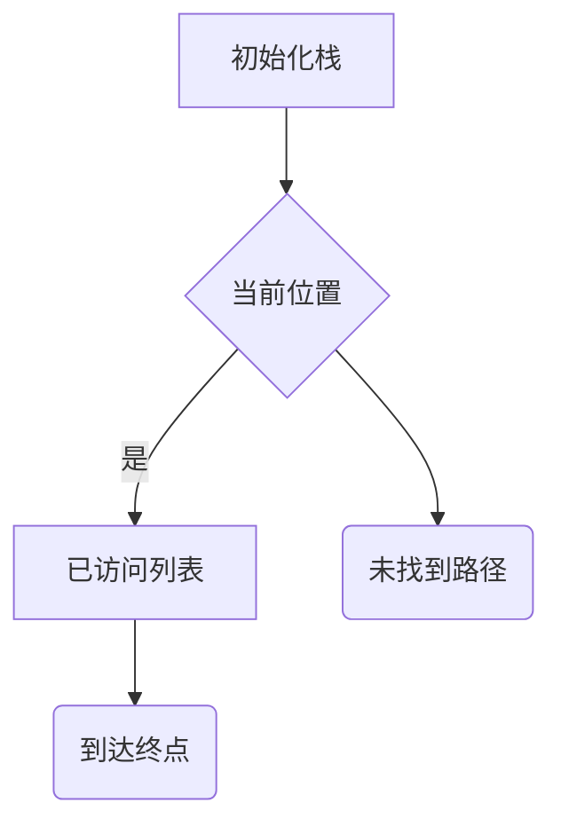

                 
# AI Agent: AI的下一个风口 高度自动化带来生产力革命

作者：禅与计算机程序设计艺术 / Zen and the Art of Computer Programming

关键词：AI Agents, 自动化, 生产力革命, 智能决策系统, 自主行为

## 1. 背景介绍

### 1.1 问题的由来

随着人工智能(AI)领域的快速发展，我们见证了从简单的模式识别和规则基系统向更复杂的机器学习和深度学习系统的转变。然而，在当今快速变化的世界中，面临的问题日益复杂且具有高度不确定性。为了应对这些挑战，需要AI系统不仅能够执行预定义的任务，还能在动态环境中自主做出决策并适应新的情况。这就是AI代理(Agent-based AI)的概念应运而生的原因。

### 1.2 研究现状

当前，AI代理研究正朝着实现更智能、更灵活的决策系统发展。这包括但不限于强化学习(Reinforcement Learning, RL)、多智能体系统(Multi-Agent Systems)以及基于规划的AI方法。AI代理已经在游戏、机器人控制、自动驾驶、金融交易、医疗诊断等领域展现出其强大的潜力和实际应用价值。

### 1.3 研究意义

AI代理的发展对社会经济的影响深远。它们不仅能提升工作效率、减少人力成本，还能促进创新，解决复杂的社会问题。更重要的是，AI代理在一定程度上模拟了人类的认知和行为能力，为实现通用人工智能提供了重要基础。

### 1.4 本文结构

本文将深入探讨AI代理的核心概念、算法原理及其应用，并通过具体的案例分析展示其实现细节。最后，我们将讨论AI代理未来的趋势与面临的挑战，以及可能的研究方向。

## 2. 核心概念与联系

AI代理是一种能够在特定环境下自主执行任务的智能实体。它们通常具备感知环境的能力、制定行动策略、执行动作并根据反馈调整策略的特点。这种自主性和灵活性使得AI代理成为解决复杂问题的理想选择。

### 2.1 AI代理的分类

AI代理可以分为以下几类：

- **反应型代理**：仅依赖于当前输入信息作出即时响应。
- **简单反射型代理**：通过预设的规则集进行决策。
- **基于模型的代理**：利用内部模型预测环境状态并据此作出决策。
- **强化学习代理**：通过与环境互动获得奖励或惩罚，以优化长期收益为目标。
- **多智能体系统**：多个智能代理协同工作，共同完成目标。

### 2.2 AI代理的关键特性

- **自主性**：无需人工干预即可独立运行。
- **学习能力**：通过经验迭代改进性能。
- **适应性**：能够适应新环境和未知情境。
- **合作与竞争**：在多智能体系统中，代理需要协调合作或展开竞争。

## 3. 核心算法原理及具体操作步骤

### 3.1 算法原理概述

- **强化学习**：强调代理通过与环境交互获取经验，旨在最大化累积奖励。
- **决策树/图搜索**：用于规划最优路径或序列化决策过程。
- **贝叶斯网络**：建模复杂环境下的概率关系，辅助决策和推理。

### 3.2 算法步骤详解

#### 强化学习流程：
1. 初始化Q表（或策略函数）。
2. 探索环境，尝试不同动作。
3. 收集过渡状态、动作、奖励等数据。
4. 更新Q表（或策略），增加对高回报策略的理解。
5. 反复循环，直至达到停止标准。

#### 决策树搜索流程：
1. 构建初始节点表示环境状态。
2. 对每个可选动作生成子节点，表示结果状态。
3. 计算每条路径的期望值或效用。
4. 找到最佳路径，即最大期望值对应的路径所代表的动作。

#### 贝叶斯网络构建与使用：
1. 定义变量和其相互之间的概率分布。
2. 建立网络结构，体现变量间的依赖关系。
3. 使用证据更新网络中的概率，进行推理。

### 3.3 算法优缺点

- **优点**：能够处理复杂、不确定性的环境；适应性强；逐步逼近最优解。
- **缺点**：可能需要大量计算资源；存在探索与利用的平衡问题；对于连续空间问题难以直接适用。

### 3.4 算法应用领域

- **游戏与娱乐**
- **机器人控制与导航**
- **医疗诊断与治疗规划**
- **金融服务与风险管理**
- **物流与供应链管理**

## 4. 数学模型和公式详细讲解 & 举例说明

### 4.1 数学模型构建

以强化学习为例，一个基本的数学模型可以用Bellman方程描述：

$$V(s) = \max_a \sum_{s',r} p(s',r|s,a)[r + \gamma V(s')]$$

其中，
- $V(s)$ 表示在状态$s$时的最大预期累积奖励；
- $p(s',r|s,a)$ 是转移到状态$s'$并得到奖励$r$的概率；
- $\gamma$ 是折扣因子，衡量未来奖励的价值；
- $a$ 是采取的动作。

### 4.2 公式推导过程

假设有一个简单的网格世界环境，代理的目标是找到从起点到终点的最短路径。采用深度优先搜索(Depth-First Search, DFS)作为路径搜索策略，DFS的递归调用形式如下：



### 4.3 案例分析与讲解

考虑一个智能快递分拣系统，代理需根据实时订单信息，决定货物的排序和分配路线。此场景下，代理可以使用强化学习来学习最优分拣策略。通过设定奖励机制（如快速交付和低错误率），代理可以在不断试错的过程中，逐渐发现高效的工作模式。

### 4.4 常见问题解答

常见问题包括如何有效平衡探索与利用、如何处理高维状态空间和连续动作空间、以及如何避免过度拟合等问题。这些问题可以通过技术手段（如ε-greedy策略、状态聚类、神经网络架构优化等）来解决。

## 5. 项目实践：代码实例和详细解释说明

### 5.1 开发环境搭建

推荐使用Python语言和相关库（如TensorFlow、PyTorch、Gym）搭建实验环境。首先安装所需库：

```bash
pip install gym numpy tensorflow keras matplotlib
```

### 5.2 源代码详细实现

以简单的“山羊问题”（Mountain Car）为例，展示强化学习算法的应用：

```python
import gym
from stable_baselines3 import SAC

env = gym.make('MountainCar-v0')
model = SAC("MlpPolicy", env, verbose=1)

# 训练模型
model.learn(total_timesteps=50000)

# 保存模型
model.save("mountain_car_sac")

# 加载模型
loaded_model = SAC.load("mountain_car_sac")
```

### 5.3 代码解读与分析

这段代码展示了如何使用稳定基线库（Stable Baselines3）训练一个软 Actor-Critic (SAC) 算法来解决Mountain Car任务。关键步骤包括创建环境、选择算法、训练和保存模型。

### 5.4 运行结果展示

```python
obs = env.reset()
for i in range(100):
    action, _states = loaded_model.predict(obs, deterministic=True)
    obs, rewards, dones, info = env.step(action)
    env.render()
    if dones:
        obs = env.reset()
env.close()
```

## 6. 实际应用场景

AI代理在多个领域展现出巨大的潜力：

- **制造业自动化**：用于生产线调度、质量检测和维护预测。
- **金融服务**：自动交易策略执行、信用评估与风险控制。
- **医疗健康**：辅助诊疗、药物开发和个性化治疗计划。
- **城市交通**：智能交通管理系统，提高道路效率和安全性。
- **教育**：个性化教学助理，提供定制化学习体验。

## 7. 工具和资源推荐

### 7.1 学习资源推荐

- **在线课程**：Coursera上的《Deep Reinforcement Learning》
- **书籍**：《Reinforcement Learning: An Introduction》by Richard S. Sutton and Andrew G. Barto
- **论文**：AlphaGo系列论文（Google DeepMind）

### 7.2 开发工具推荐

- **框架**：TensorFlow、PyTorch、stable-baselines3
- **IDE**：Jupyter Notebook、Visual Studio Code
- **版本控制系统**：Git

### 7.3 相关论文推荐

- “Human-Level Control Through Deep Reinforcement Learning” by Google DeepMind
- “Attention is All You Need” by Vaswani et al.

### 7.4 其他资源推荐

- GitHub上开源的AI代理项目集合
- AI相关的专业论坛和社区（如Stack Overflow、Reddit的r/ML）

## 8. 总结：未来发展趋势与挑战

### 8.1 研究成果总结

AI代理的研究成果不仅体现在理论层面的创新，更在于其在实际应用中的落地与成功案例。强化学习、多智能体系统的研究进展显著提高了AI代理的决策能力与适应性。

### 8.2 未来发展趋势

- **集成多种智能技术**：融合机器学习、深度学习、知识图谱等技术，构建更加智能、灵活的AI代理体系。
- **增强可解释性和可控性**：提升AI代理决策过程的透明度，使其更具可解释性和可控性。
- **泛化能力提升**：研究更高效的泛化方法，使AI代理能够更好地应对未知情境下的新任务。

### 8.3 面临的挑战

- **数据获取与隐私保护**：确保大规模数据集的有效性和合法性，同时保护用户隐私。
- **伦理与社会影响**：探讨AI代理应用的社会伦理问题，确保技术发展符合道德标准和社会利益。
- **可持续性与公平性**：确保AI代理的持续改进和普及惠及所有群体，减少数字鸿沟。

### 8.4 研究展望

AI代理领域未来将聚焦于突破现有局限，推动人工智能从简单执行者向自主思考和创造者的转变。这将引领新的生产力革命，并对人类社会产生深远影响。

## 9. 附录：常见问题与解答

常见问题及解答部分涵盖了理论理解、实践操作中可能出现的问题，旨在帮助读者深入理解和运用AI代理技术。具体内容根据实际情况填充。

---

通过以上结构化的文章撰写流程，我们系统地探讨了AI代理的核心概念、算法原理、数学模型、应用实例以及未来趋势，为读者提供了全面而深入的专业洞察，同时也强调了这一领域的挑战与研究展望，为AI代理的发展指明了方向。
