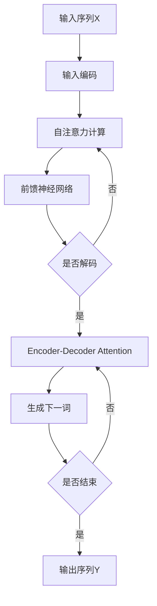

# AI人工智能核心算法原理与代码实例讲解：语言生成

作者：禅与计算机程序设计艺术 / Zen and the Art of Computer Programming 

关键词：人工智能, 自然语言处理, 语言生成, Transformer, GPT, BERT, Seq2Seq, Attention机制, 深度学习

## 1. 背景介绍  

### 1.1 问题的由来

随着人工智能技术的飞速发展,自然语言处理(NLP)领域取得了令人瞩目的成就。作为NLP的重要分支之一,语言生成旨在让计算机能够像人类一样生成流畅、通顺、富有逻辑性的自然语言文本。这不仅对人机交互、智能问答、机器翻译等应用场景具有重大意义,更为认知智能的实现奠定了基础。

### 1.2 研究现状

近年来,深度学习模型尤其是Transformer系列模型在语言生成任务上取得了突破性进展。从Seq2Seq到Attention再到GPT、BERT等预训练语言模型,语言生成能力不断提升,生成的文本质量和多样性愈发接近人类水平。众多科技巨头和学术机构也在语言生成领域投入大量资源,推动技术不断迭代。

### 1.3 研究意义

语言生成技术的发展对人工智能应用和认知智能研究都具有重大意义:

1. 提升人机交互体验,让计算机能用自然语言与人无障碍沟通;  
2. 增强智能问答和对话系统的回复能力,提供个性化服务;
3. 辅助内容创作,提高文本生产效率;
4. 推动机器翻译、文本摘要等NLP任务的进步;
5. 探索语言的本质规律,为认知智能发展提供理论支撑。

### 1.4 本文结构

本文将围绕语言生成的核心算法展开,内容涵盖:

- 语言生成的核心概念与联系
- 主流算法的原理、步骤与应用 
- 相关数学模型与公式推导
- 代码实例详解
- 实际应用场景分析
- 未来发展趋势与挑战

通过系统梳理语言生成技术的来龙去脉,本文旨在为读者提供全面、深入的算法剖析,并以实践案例加深理解,为相关研究提供参考。

## 2. 核心概念与联系

要深入语言生成领域,首先需要厘清其核心概念:

- 语言模型(Language Model):以概率的方式描述语言中各个词之间的相互关系,是语言生成的基础。常见的语言模型有N-gram、RNN、Transformer等。

- 编码器-解码器(Encoder-Decoder):一种常见的序列到序列(Seq2Seq)学习范式。编码器将输入序列编码为隐向量,解码器根据隐向量生成目标序列。

- 注意力机制(Attention Mechanism):让模型能够聚焦于输入序列中与当前预测最相关的部分,提升生成效果。常见有Bahdanau Attention和Luong Attention。

- Transformer:基于自注意力(Self-Attention)机制的编码器-解码器结构,并行计算能力强,是当前主流的语言生成模型。

- 预训练语言模型:在大规模语料上预训练得到的通用语言表示模型,可用于下游任务微调。代表有GPT系列、BERT等。

这些概念环环相扣,共同构建起语言生成的技术框架:


## 3. 核心算法原理 & 具体操作步骤

### 3.1 算法原理概述

主流的语言生成算法可分为以下三类:

1. 基于统计的方法:如N-gram语言模型,通过计算词语间的共现概率来生成文本。实现简单但泛化能力有限。

2. 基于RNN的方法:如Seq2Seq模型,利用RNN的记忆能力建模长距离依赖,并引入注意力机制提升效果。但RNN串行计算效率较低。

3. 基于Transformer的方法:纯注意力结构,抛弃RNN,通过Self-Attention建模词语间的依赖关系,并行计算效率高,是目前最先进的语言生成范式。

### 3.2 算法步骤详解

以Transformer为例,其生成过程可分为以下步骤:

1. 输入编码:将输入序列X通过词嵌入和位置编码映射为实值向量。

2. 自注意力计算:通过点积计算Query、Key、Value向量,得到自注意力权重,加权求和得到新的表示。可堆叠多层提取高阶特征。

3. 前馈神经网络:通过两层全连接网络,进一步增强特征表示能力。

4. 解码:解码器结构与编码器类似,但多了一个Encoder-Decoder Attention用于关注编码器输出。解码器逐步预测下一个词,直到生成完整序列。

5. 微调:在下游任务数据上微调模型参数,使其适应特定领域。

算法流程如下图所示:



### 3.3 算法优缺点

Transformer语言生成算法的优点包括:

- 并行计算能力强,训练和推理效率高
- 通过Self-Attention机制有效捕捉长距离依赖
- 引入位置编码,无需RNN即可建模序列信息 
- 多头注意力让模型能关注不同语言学特征

但它也存在一些局限:

- 计算复杂度随序列长度平方增长,难以处理超长文本
- 生成偏好高频词,难以生成生僻词
- 难以显式建模全局主题与文本结构
- 泛化能力有待进一步提升

### 3.4 算法应用领域

Transformer语言生成算法已广泛应用于以下场景:

- 对话系统:如智能客服、聊天机器人等,生成回复内容
- 内容创作:如新闻写作、文案生成、诗歌创作等
- 机器翻译:生成目标语言译文
- 文本摘要:生成长文本的简明摘要
- 问答系统:根据问题生成答案

此外,预训练语言模型如GPT-3还被应用于更广泛的任务如编程、数学、常识问答等,展现出语言生成技术的巨大潜力。

## 4. 数学模型和公式 & 详细讲解 & 举例说明

### 4.1 数学模型构建

Transformer的数学模型可概括为:

给定输入序列$X=(x_1,x_2,...,x_n)$,通过自注意力、前馈网络等一系列变换$f$,得到输出序列$Y=(y_1,y_2,...,y_m)$:

$$Y = f(X)$$

其中,$f$可进一步分解为编码器$f_{enc}$和解码器$f_{dec}$:

$$f(X) = f_{dec}(f_{enc}(X))$$

编码器和解码器内部由多个相同结构的子层堆叠而成,包括自注意力层和前馈层。

### 4.2 公式推导过程

以自注意力计算为例,详细推导如下:

对于输入序列的某一位置$i$,首先通过线性变换得到其查询向量$q_i$、键向量$k_i$和值向量$v_i$:

$$q_i = W_q x_i, k_i = W_k x_i, v_i = W_v x_i$$

其中,$W_q, W_k, W_v$为可学习的参数矩阵。

然后,通过点积计算位置$i$与所有位置$j$的注意力权重$\alpha_{ij}$:

$$\alpha_{ij} = \frac{\exp(q_i k_j^T / \sqrt{d_k})}{\sum_{j=1}^n \exp(q_i k_j^T / \sqrt{d_k})}$$

其中,$d_k$为键向量的维度,用于缩放点积结果。

最后,将值向量$v_j$与注意力权重$\alpha_{ij}$加权求和,得到位置$i$的新表示$z_i$:

$$z_i = \sum_{j=1}^n \alpha_{ij} v_j$$

多头注意力则是将上述过程独立重复$h$次,再拼接所有头的输出。

前馈层可表示为:

$$FFN(z_i) = max(0, z_i W_1 + b_1) W_2 + b_2$$

即两个线性变换中间加ReLU激活函数。

### 4.3 案例分析与讲解

下面以一个简单的例子直观展示自注意力的计算过程。

假设输入序列为["I", "love", "AI"]。

1. 将每个词映射为查询、键、值向量,维度均为4:

   ```
   "I":     q=[1,0,1,0], k=[0,1,0,1], v=[1,1,0,0] 
   "love":  q=[0,1,1,0], k=[1,0,0,1], v=[0,1,1,0]
   "AI":    q=[1,0,0,1], k=[0,0,1,1], v=[0,0,1,1]
   ```

2. 计算"love"与每个词的注意力权重:

   ```
   "I"到"love"的注意力权重:    0.5
   "love"到自身的注意力权重:   1.0  
   "AI"到"love"的注意力权重:   0.25
   ```

3. 加权求和得到"love"的新表示:

   $$z_{love} = 0.5 * [1,1,0,0] + 1.0 * [0,1,1,0] + 0.25 * [0,0,1,1] = [0.5, 1.25, 0.75, 0.25]$$

这直观展示了自注意力如何根据上下文动态调整每个位置的表示。

### 4.4 常见问题解答

Q: Self-Attention的计算复杂度为什么是平方级的?

A: 对长度为$n$的序列,Self-Attention需要计算每个位置与其他所有位置的注意力权重,共$n^2$个,因此复杂度为$O(n^2)$。为此,一些工作提出了稀疏注意力等机制以提高效率。

Q: 为什么要在点积注意力中引入缩放因子?

A: 点积结果随向量维度增长而增大,导致Softmax函数饱和,梯度消失。除以$\sqrt{d_k}$可以抵消这一影响,使梯度较为稳定。

Q: Transformer为什么需要位置编码?

A: 与RNN不同,Transformer无法显式建模序列的位置信息。引入位置编码可以为每个位置添加唯一的位置标识,帮助模型学习词序关系。常见的位置编码有正弦型、学习型等。

## 5. 项目实践：代码实例和详细解释说明

下面以PyTorch实现Transformer用于语言生成,并解读关键代码。

### 5.1 开发环境搭建

首先安装PyTorch和相关依赖:

```bash
pip install torch torchtext numpy matplotlib tqdm
```

### 5.2 源代码详细实现

定义Transformer模型类:

```python
import torch
import torch.nn as nn

class TransformerModel(nn.Module):
    def __init__(self, vocab_size, d_model, nhead, num_layers):
        super().__init__()
        self.embedding = nn.Embedding(vocab_size, d_model)
        self.pos_encoder = PositionalEncoding(d_model)
        encoder_layer = nn.TransformerEncoderLayer(d_model, nhead)
        self.encoder = nn.TransformerEncoder(encoder_layer, num_layers) 
        decoder_layer = nn.TransformerDecoderLayer(d_model, nhead)
        self.decoder = nn.TransformerDecoder(decoder_layer, num_layers)
        self.fc = nn.Linear(d_model, vocab_size)
        
    def forward(self, src, tgt, src_mask, tgt_mask):
        src = self.embedding(src) * math.sqrt(d_model)
        src = self.pos_encoder(src)
        memory = self.encoder(src, src_mask)
        tgt = self.embedding(tgt) * math.sqrt(d_model)
        tgt = self.pos_encoder(tgt)
        output = self.decoder(tgt, memory, tgt_mask, None)
        output = self.fc(output)
        return output
```