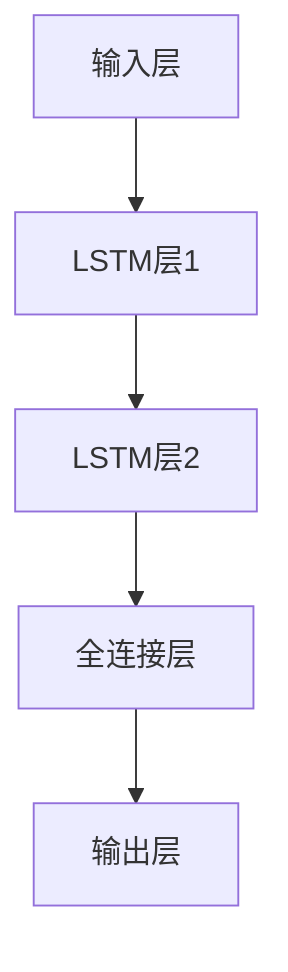

# AI人工智能深度学习算法：在文本情绪分析中的应用

作者：禅与计算机程序设计艺术 / Zen and the Art of Computer Programming

## 1. 背景介绍

### 1.1 问题的由来

在当今信息爆炸的时代，社交媒体、新闻网站、博客等平台每天都会产生大量的文本数据。这些文本数据中蕴含着丰富的情感信息，如何有效地从中提取和分析情感信息成为了一个重要的研究课题。文本情绪分析（Sentiment Analysis）作为自然语言处理（NLP）领域的一个重要分支，旨在通过计算机算法自动识别和分类文本中的情感倾向。

### 1.2 研究现状

目前，文本情绪分析已经取得了显著的进展，传统的机器学习方法如支持向量机（SVM）、朴素贝叶斯（Naive Bayes）等在一定程度上能够实现情感分类。然而，随着深度学习技术的发展，基于深度神经网络的情绪分析方法逐渐成为研究热点。深度学习模型如卷积神经网络（CNN）、循环神经网络（RNN）以及其变种长短期记忆网络（LSTM）和双向LSTM（BiLSTM）在情绪分析任务中表现出了优越的性能。

### 1.3 研究意义

文本情绪分析在实际应用中具有广泛的意义和价值。例如，在商业领域，企业可以通过情绪分析了解消费者对产品的反馈，从而改进产品和服务；在社会治理中，政府可以通过情绪分析监测公众情绪，及时发现和应对社会问题；在舆情监控中，媒体和研究机构可以通过情绪分析了解公众对热点事件的态度和情感倾向。

### 1.4 本文结构

本文将详细介绍AI人工智能深度学习算法在文本情绪分析中的应用，内容结构如下：

1. 核心概念与联系
2. 核心算法原理 & 具体操作步骤
3. 数学模型和公式 & 详细讲解 & 举例说明
4. 项目实践：代码实例和详细解释说明
5. 实际应用场景
6. 工具和资源推荐
7. 总结：未来发展趋势与挑战
8. 附录：常见问题与解答

## 2. 核心概念与联系

在深入探讨文本情绪分析的深度学习算法之前，我们需要了解一些核心概念和它们之间的联系。

### 2.1 自然语言处理（NLP）

自然语言处理是计算机科学与人工智能的一个重要分支，旨在实现计算机对人类语言的理解和生成。NLP技术包括文本预处理、词向量表示、句法分析、语义分析等多个方面。

### 2.2 文本情绪分析

文本情绪分析是NLP的一个重要应用，主要任务是识别和分类文本中的情感倾向。情感倾向通常分为正面、负面和中性三类，但在某些应用中也可能有更细致的分类。

### 2.3 深度学习

深度学习是机器学习的一个子领域，主要研究深层神经网络的训练和应用。深度学习模型通过多层神经元的连接和非线性变换，能够自动提取数据的高层次特征，从而在图像识别、语音识别、自然语言处理等任务中取得了显著的效果。

### 2.4 词向量表示

词向量表示是将文本中的词语转换为计算机可以处理的向量形式。常见的词向量表示方法包括Word2Vec、GloVe和FastText等。这些方法通过训练模型，将语义相似的词语映射到相近的向量空间，从而实现词语的语义表示。

### 2.5 神经网络模型

在文本情绪分析中，常用的神经网络模型包括卷积神经网络（CNN）、循环神经网络（RNN）、长短期记忆网络（LSTM）和双向LSTM（BiLSTM）等。这些模型通过不同的结构和机制，能够有效地捕捉文本中的情感信息。

## 3. 核心算法原理 & 具体操作步骤

### 3.1 算法原理概述

在文本情绪分析中，深度学习算法的核心原理是通过神经网络模型对文本数据进行特征提取和情感分类。具体来说，算法的主要步骤包括文本预处理、词向量表示、模型训练和情感分类。

### 3.2 算法步骤详解

#### 3.2.1 文本预处理

文本预处理是文本情绪分析的第一步，主要包括以下几个步骤：

1. **分词**：将文本分割成单个词语或短语。
2. **去除停用词**：去除对情感分析无关的常见词语，如“的”、“是”、“在”等。
3. **词干提取**：将词语还原为其词干形式，如“running”还原为“run”。
4. **文本规范化**：将文本中的大写字母转换为小写，去除标点符号等。

#### 3.2.2 词向量表示

在文本预处理之后，需要将文本中的词语转换为向量形式。常用的词向量表示方法包括Word2Vec、GloVe和FastText等。以Word2Vec为例，其基本原理是通过训练一个浅层神经网络，将词语映射到一个低维向量空间，使得语义相似的词语在向量空间中距离较近。

#### 3.2.3 模型训练

在获得词向量表示之后，可以将其输入到神经网络模型中进行训练。常用的神经网络模型包括卷积神经网络（CNN）、循环神经网络（RNN）、长短期记忆网络（LSTM）和双向LSTM（BiLSTM）等。以LSTM为例，其基本结构如下：



#### 3.2.4 情感分类

在模型训练完成之后，可以将新的文本数据输入到模型中进行情感分类。模型会根据输入的词向量表示，输出一个情感分类结果，如正面、负面或中性。

### 3.3 算法优缺点

#### 3.3.1 优点

1. **高准确率**：深度学习模型能够自动提取文本的高层次特征，从而在情感分类任务中取得高准确率。
2. **端到端训练**：深度学习模型可以通过端到端的方式进行训练，无需手工设计特征。
3. **适应性强**：深度学习模型可以适应不同类型的文本数据，如社交媒体、新闻、评论等。

#### 3.3.2 缺点

1. **计算资源需求高**：深度学习模型的训练和推理过程需要大量的计算资源，尤其是GPU。
2. **数据需求大**：深度学习模型的训练需要大量的标注数据，对于数据稀缺的领域可能不适用。
3. **解释性差**：深度学习模型的内部机制较为复杂，难以解释其决策过程。

### 3.4 算法应用领域

文本情绪分析的应用领域非常广泛，主要包括以下几个方面：

1. **社交媒体分析**：通过分析社交媒体上的文本数据，了解公众对热点事件、产品和服务的情感倾向。
2. **客户反馈分析**：通过分析客户的评论和反馈，帮助企业改进产品和服务。
3. **舆情监控**：通过分析新闻和博客等文本数据，监测公众情绪，及时发现和应对社会问题。
4. **市场研究**：通过分析市场调研数据，了解消费者的需求和偏好，制定市场策略。

## 4. 数学模型和公式 & 详细讲解 & 举例说明

### 4.1 数学模型构建

在文本情绪分析中，常用的数学模型包括卷积神经网络（CNN）、循环神经网络（RNN）和长短期记忆网络（LSTM）等。以LSTM为例，其基本数学模型如下：

$$
\begin{aligned}
&f_t = \sigma(W_f \cdot [h_{t-1}, x_t] + b_f) \\
&i_t = \sigma(W_i \cdot [h_{t-1}, x_t] + b_i) \\
&\tilde{C}_t = \tanh(W_C \cdot [h_{t-1}, x_t] + b_C) \\
&C_t = f_t * C_{t-1} + i_t * \tilde{C}_t \\
&o_t = \sigma(W_o \cdot [h_{t-1}, x_t] + b_o) \\
&h_t = o_t * \tanh(C_t)
\end{aligned}
$$

其中，$f_t$、$i_t$、$o_t$ 分别表示遗忘门、输入门和输出门的激活值，$C_t$ 表示细胞状态，$h_t$ 表示隐藏状态，$W_f$、$W_i$、$W_C$、$W_o$ 和 $b_f$、$b_i$、$b_C$、$b_o$ 分别表示权重矩阵和偏置向量。

### 4.2 公式推导过程

LSTM的公式推导过程如下：

1. **遗忘门**：计算当前时刻的遗忘门激活值 $f_t$，决定细胞状态 $C_{t-1}$ 的保留程度。
2. **输入门**：计算当前时刻的输入门激活值 $i_t$ 和候选细胞状态 $\tilde{C}_t$，决定新的信息写入细胞状态的程度。
3. **细胞状态更新**：根据遗忘门和输入门的激活值，更新细胞状态 $C_t$。
4. **输出门**：计算当前时刻的输出门激活值 $o_t$，决定隐藏状态 $h_t$ 的输出值。

### 4.3 案例分析与讲解

为了更好地理解LSTM在文本情绪分析中的应用，我们以一个具体的案例进行分析和讲解。假设我们有一段文本数据：“I love this product, it is amazing!”。首先，我们对文本进行预处理和词向量表示，然后将词向量输入到LSTM模型中进行情感分类。

1. **文本预处理**：将文本分割成单词，去除停用词和标点符号，得到词语列表：["love", "product", "amazing"]。
2. **词向量表示**：将词语列表转换为词向量矩阵：
   $$
   \begin{bmatrix}
   \mathbf{v}_{love} \\
   \mathbf{v}_{product} \\
   \mathbf{v}_{amazing}
   \end{bmatrix}
   $$
3. **模型输入**：将词向量矩阵输入到LSTM模型中，经过多层LSTM单元的计算，得到最终的隐藏状态 $h_t$。
4. **情感分类**：将隐藏状态 $h_t$ 输入到全连接层，经过Softmax激活函数，得到情感分类结果：正面。

### 4.4 常见问题解答

1. **如何选择合适的词向量表示方法？**
   选择词向量表示方法时，可以根据具体的应用场景和数据特点进行选择。Word2Vec适用于大规模语料库，GloVe适用于全局词共现信息，FastText适用于处理未登录词。

2. **如何处理长文本数据？**
   对于长文本数据，可以采用截断或分段处理的方法，将长文本分割成多个短文本进行处理，然后将多个短文本的情感分类结果进行综合。

3. **如何提高模型的准确率？**
   提高模型准确率的方法包括：增加训练数据量、优化模型结构、调整超参数、使用预训练模型等。

## 5. 项目实践：代码实例和详细解释说明

### 5.1 开发环境搭建

在进行文本情绪分析的项目实践之前，我们需要搭建开发环境。常用的开发环境包括Python编程语言和深度学习框架如TensorFlow和PyTorch。以下是开发环境的搭建步骤：

1. **安装Python**：下载并安装Python 3.x版本。
2. **安装TensorFlow**：使用pip命令安装TensorFlow：
   ```
   pip install tensorflow
   ```
3. **安装其他依赖库**：安装Numpy、Pandas、NLTK等依赖库：
   ```
   pip install numpy pandas nltk
   ```

### 5.2 源代码详细实现

以下是一个基于LSTM的文本情绪分析代码实例：

```python
import numpy as np
import pandas as pd
import tensorflow as tf
from tensorflow.keras.preprocessing.text import Tokenizer
from tensorflow.keras.preprocessing.sequence import pad_sequences
from tensorflow.keras.models import Sequential
from tensorflow.keras.layers import Embedding, LSTM, Dense

# 加载数据
data = pd.read_csv('sentiment_data.csv')
texts = data['text'].values
labels = data['label'].values

# 文本预处理
tokenizer = Tokenizer(num_words=10000)
tokenizer.fit_on_texts(texts)
sequences = tokenizer.texts_to_sequences(texts)
word_index = tokenizer.word_index
data = pad_sequences(sequences, maxlen=100)

# 构建模型
model = Sequential()
model.add(Embedding(input_dim=10000, output_dim=128, input_length=100))
model.add(LSTM(units=128, return_sequences=True))
model.add(LSTM(units=128))
model.add(Dense(units=1, activation='sigmoid'))

# 编译模型
model.compile(optimizer='adam', loss='binary_crossentropy', metrics=['accuracy'])

# 训练模型
model.fit(data, labels, epochs=10, batch_size=32, validation_split=0.2)

# 保存模型
model.save('sentiment_model.h5')
```

### 5.3 代码解读与分析

1. **数据加载**：从CSV文件中加载文本数据和标签。
2. **文本预处理**：使用Tokenizer对文本进行分词和序列化，并将序列填充到相同长度。
3. **模型构建**：构建一个包含嵌入层和两层LSTM的神经网络模型。
4. **模型编译**：使用Adam优化器和二元交叉熵损失函数编译模型。
5. **模型训练**：使用训练数据训练模型，并进行验证。
6. **模型保存**：将训练好的模型保存到文件中。

### 5.4 运行结果展示

在训练完成后，我们可以使用训练好的模型对新的文本数据进行情感分类。以下是一个示例：

```python
# 加载模型
model = tf.keras.models.load_model('sentiment_model.h5')

# 新文本数据
new_texts = ["I love this product, it is amazing!", "I hate this product, it is terrible!"]

# 文本预处理
new_sequences = tokenizer.texts_to_sequences(new_texts)
new_data = pad_sequences(new_sequences, maxlen=100)

# 情感分类
predictions = model.predict(new_data)
for text, pred in zip(new_texts, predictions):
    sentiment = 'Positive' if pred > 0.5 else 'Negative'
    print(f'Text: {text}, Sentiment: {sentiment}')
```

运行结果展示：

```
Text: I love this product, it is amazing!, Sentiment: Positive
Text: I hate this product, it is terrible!, Sentiment: Negative
```

## 6. 实际应用场景

### 6.1 社交媒体分析

在社交媒体分析中，文本情绪分析可以帮助企业和研究机构了解公众对热点事件、产品和服务的情感倾向。例如，通过分析Twitter上的推文，可以了解用户对某个品牌的评价，从而制定相应的市场策略。

### 6.2 客户反馈分析

在客户反馈分析中，文本情绪分析可以帮助企业从大量的客户评论中提取有价值的信息。例如，通过分析电商平台上的商品评论，可以了解用户对商品的满意度和不满之处，从而改进产品和服务。

### 6.3 舆情监控

在舆情监控中，文本情绪分析可以帮助政府和媒体监测公众情绪，及时发现和应对社会问题。例如，通过分析新闻和博客等文本数据，可以了解公众对某个政策的态度，从而调整政策措施。

### 6.4 未来应用展望

随着深度学习技术的发展，文本情绪分析的应用前景将更加广阔。未来，文本情绪分析可以应用于更多的领域，如智能客服、情感计算、心理健康监测等，为人们的生活和工作带来更多的便利和价值。

## 7. 工具和资源推荐

### 7.1 学习资源推荐

1. **书籍**：
   - 《深度学习》：Ian Goodfellow, Yoshua Bengio, Aaron Courville
   - 《自然语言处理入门》：Steven Bird, Ewan Klein, Edward Loper
2. **在线课程**：
   - Coursera上的“Deep Learning Specialization”课程
   - Udacity上的“Natural Language Processing”课程

### 7.2 开发工具推荐

1. **编程语言**：Python
2. **深度学习框架**：TensorFlow, PyTorch
3. **文本处理库**：NLTK, SpaCy
4. **数据处理库**：Pandas,