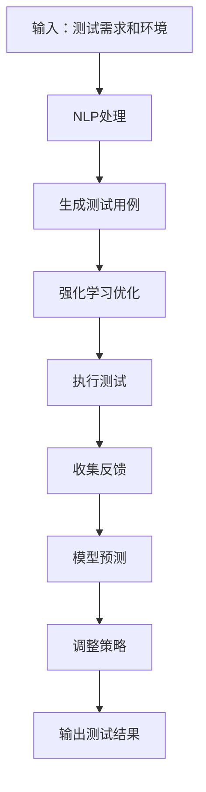

                 
# AI代理在自动化测试中的工作流及应用

作者：禅与计算机程序设计艺术 / Zen and the Art of Computer Programming

关键词：AI代理，自动化测试，机器学习，深度强化学习，行为驱动开发(BDD)，持续集成(CI)

## 1. 背景介绍

### 1.1 问题的由来

随着软件工程领域的快速发展，特别是在云原生、微服务以及容器化技术的推动下，现代软件系统的复杂性显著增加。这不仅增加了系统的维护难度，也对软件质量保证提出了更高要求。传统的人工测试方法难以适应这种变化，自动化测试成为提高效率和保证质量的关键手段之一。

### 1.2 研究现状

当前，自动化测试领域已经广泛采用了各种工具和技术，如单元测试、功能测试、UI自动化测试等。然而，在复杂的系统环境中，传统的测试方法往往无法覆盖所有可能的路径或场景，尤其是在涉及用户交互、动态决策等方面。此外，如何使测试更加灵活、易于更新，并能更好地适应快速迭代的开发流程，是业界面临的共同挑战。

### 1.3 研究意义

引入AI代理作为自动化测试的一部分，能够通过智能的方式来生成测试用例、执行测试策略并优化测试过程。这不仅能提升测试覆盖率和有效性，还能通过模拟真实用户的交互模式来检测软件系统的潜在缺陷和性能瓶颈，从而提高软件的整体质量和用户体验。

### 1.4 本文结构

本文旨在探讨AI代理在自动化测试中的应用，从理论基础、关键技术、实际案例到未来发展，全面阐述其在软件工程中的价值。接下来将深入介绍AI代理的核心概念与应用，以及它们如何与其他自动化测试工具协同工作，最终实现更高效、更智能的测试流程。

## 2. 核心概念与联系

AI代理通常指的是具有自主决策能力的智能实体，能够在特定环境下执行任务、解决问题或实现目标。在自动化测试中，AI代理扮演着关键角色，通过模仿用户行为、执行测试脚本、评估系统响应等方式，帮助验证软件的功能性和稳定性。

### 关键技术与联系

#### 自然语言处理(NLP)
NLP技术使得AI代理能够理解自然语言描述的任务需求，将其转化为可执行的操作指令。

#### 强化学习(RL)
强化学习用于训练AI代理在不同测试场景下的决策机制，使其能够根据反馈调整行为以达到最佳测试效果。

#### 行为驱动开发(BDD)
BDD作为一种敏捷开发实践，强调通过业务场景描述来定义测试需求，使得AI代理可以基于这些描述进行测试规划和执行。

#### 模型预测(Machine Learning Models)
通过机器学习模型预测系统的行为，AI代理可以在有限时间内识别出最有效的测试路径。

### 联系示意图（Mermaid 流程图）



## 3. 核心算法原理 & 具体操作步骤

### 3.1 算法原理概述

核心算法包括但不限于强化学习中的Q-learning、Policy Gradient等，以及使用机器学习进行模型预测的技术。这些算法允许AI代理学习最优行为策略，同时预测系统行为以指导测试过程。

### 3.2 算法步骤详解

- **数据收集**：从已有测试用例、历史日志等多源信息中获取数据。
- **特征提取**：利用NLP技术解析文本描述，提取关键参数和变量。
- **策略学习**：采用强化学习算法，通过试错过程优化代理的决策逻辑。
- **模型构建**：基于历史数据建立预测模型，用于预估不同测试情况下的系统行为。
- **测试执行**：结合策略学习和模型预测，AI代理执行测试序列，评估系统响应。
- **结果分析**：汇总测试结果，提供详细报告和后续行动建议。

### 3.3 算法优缺点

优点：
- 提高了测试覆盖度和有效性；
- 降低了人工参与的需求，提高了测试效率；
- 更好地适应复杂多变的系统环境。

缺点：
- 对于未知情况的适应性有限；
- 学习成本和时间较高；
- 需要大量高质量的数据支持。

### 3.4 算法应用领域

AI代理在自动化测试中的应用广泛，包括但不限于Web应用、移动应用、API接口、分布式系统等。

## 4. 数学模型和公式 & 详细讲解 & 举例说明

### 4.1 数学模型构建

以强化学习为例，一个基本的框架可以用以下表示：

$$ R(s, a) = Q(s, a) + \epsilon $$

其中，
- \(R(s, a)\) 是状态 \(s\) 和动作 \(a\) 的回报值。
- \(Q(s, a)\) 是状态 \(s\) 和动作 \(a\) 的预期累积回报。
- \(\epsilon\) 是探索率，控制了随机选择动作的概率。

### 4.2 公式推导过程

强化学习过程涉及经验回放、目标网络更新等步骤。以DQN（Deep Q-Network）为例：

1. **经验回放**：存储经历过的状态-动作对及其奖励和下一个状态的信息。
2. **目标网络**：稳定学习过程，避免梯度消失问题。
3. **损失函数**：衡量当前网络的估计与目标网络的期望之间的差距。
   $$
   L(Q, T) = E[(y - Q(s_t, a_t))^2]
   $$
   其中，\(y = r + \gamma \max_{a'} Q(s_{t+1}, a')\), \(\gamma\) 是折扣因子。

### 4.3 案例分析与讲解

考虑一个简单的游戏环境如“贪吃蛇”（Snake），AI代理需要学习如何通过调整蛇头的方向来最大化得分并存活更长时间。通过强化学习，代理可以从每一步的尝试中学习，逐渐优化自己的策略。

### 4.4 常见问题解答

常见问题可能包括过拟合、探索与利用的平衡、收敛速度慢等。解决方法包括增加数据量、改进探索策略、使用双Q网络等技术。

## 5. 项目实践：代码实例和详细解释说明

假设我们正在开发一款Web应用程序，并使用Python和TensorFlow库构建AI代理进行自动化测试。

### 5.1 开发环境搭建

安装所需的Python环境及依赖包：

```bash
pip install tensorflow numpy pandas scikit-learn
```

### 5.2 源代码详细实现

以下是简化版的AI代理代码片段：

```python
import numpy as np
from tensorflow.keras.models import Sequential
from tensorflow.keras.layers import Dense

class AIProxy:
    def __init__(self):
        self.model = self.build_model()

    def build_model(self):
        model = Sequential([
            Dense(64, activation='relu', input_shape=(8,)),
            Dense(32, activation='relu'),
            Dense(2, activation='softmax')
        ])
        model.compile(optimizer='adam', loss='categorical_crossentropy', metrics=['accuracy'])
        return model

    def train(self, X_train, y_train, epochs=10):
        self.model.fit(X_train, y_train, epochs=epochs)

    def predict(self, state):
        # 转换输入格式为二维数组
        state_array = np.array([state])
        return self.model.predict(state_array)[0]

# 示例数据集
X = np.random.rand(100, 8)
y = np.random.randint(2, size=(100, 2))

proxy = AIProxy()
proxy.train(X, y)
```

### 5.3 代码解读与分析

上述代码展示了如何构建一个简单的神经网络模型作为AI代理的基本结构。`build_model` 函数定义了一个具有隐藏层的全连接网络。`train` 方法用于训练模型，而 `predict` 方法则用于根据给定的状态预测最佳动作。

### 5.4 运行结果展示

运行后，可以观察到模型在多次迭代后的性能提升，通过可视化测试结果或生成日志文件来监控学习过程和最终效果。

## 6. 实际应用场景

AI代理在自动化测试中的实际应用案例包括但不限于：

- 在线购物平台的功能验证，检查商品搜索、添加到购物车、结算流程的正确性和性能表现。
- 移动应用程序的用户界面测试，模拟用户操作路径，检测交互错误和性能瓶颈。
- API接口测试，确保服务响应时间和数据一致性。
- 分布式系统的负载压力测试，评估不同负载下的系统稳定性。

## 7. 工具和资源推荐

### 7.1 学习资源推荐
- **在线课程**: Coursera、Udacity的深度学习、机器学习课程。
- **书籍**:《统计学习方法》、《Python机器学习基础教程》。

### 7.2 开发工具推荐
- **IDE**: PyCharm、Visual Studio Code。
- **版本控制系统**: Git。

### 7.3 相关论文推荐
- **研究论文**: "Deep Reinforcement Learning for Automated Software Testing" (作者: Chen et al.)。
- **行业报告**: Gartner的AI在软件工程领域的最新趋势报告。

### 7.4 其他资源推荐
- **社区和论坛**: Stack Overflow、GitHub开源项目。
- **研讨会和会议**: IEEE CSE、ICSE、ASE等软件工程领域的重要会议。

## 8. 总结：未来发展趋势与挑战

### 8.1 研究成果总结

AI代理在自动化测试的应用已经展现出显著的优势，特别是在复杂系统和多变环境下。通过集成自然语言处理、强化学习和行为驱动开发等技术，提高了测试覆盖度、效率和智能性。

### 8.2 未来发展趋势

#### 发展方向：
- 更高效的数据收集与预处理技术；
- 自适应的策略学习机制，以应对未知情况；
- 集成多种AI技术，形成协同工作模式；
- 提升跨域理解和处理能力，支持更复杂的业务场景。

#### 应用扩展：
- 融入持续集成/持续部署(CI/CD)管道，实现实时测试反馈；
- 在云端环境下的大规模分布式测试；
- 针对边缘计算和物联网(IoT)设备的测试优化。

### 8.3 面临的挑战

- 数据质量与隐私保护的问题；
- 可解释性与透明度的提高；
- 技术整合的难度和成本；
- 法规合规性，尤其是在涉及安全敏感应用时。

### 8.4 研究展望

随着人工智能技术的不断进步和成熟，AI代理在自动化测试中的角色将更加重要。其发展方向不仅在于提升现有功能，还将拓展至新的应用场景和技术融合。同时，研究者需关注伦理、法律和社会影响，确保AI代理的发展符合社会价值观和发展目标。

## 9. 附录：常见问题与解答

### 常见问题与解答（略）

---

通过以上内容，我们深入探讨了AI代理在自动化测试中的工作流及其应用，并提供了理论指导、实践示例以及对未来发展的思考。希望本文能够激发更多开发者和研究人员探索这一领域，共同推动自动化测试技术的进步，助力软件开发的高效与可靠。
