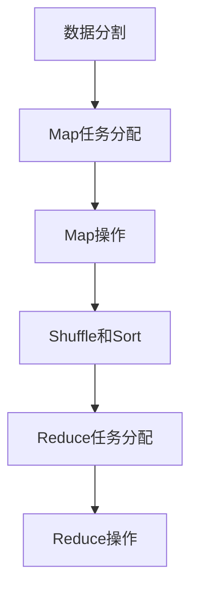
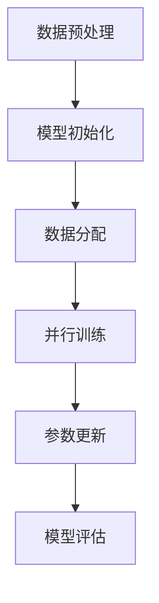

# AI系统可扩展性原理与代码实战案例讲解

作者：禅与计算机程序设计艺术 / Zen and the Art of Computer Programming

## 1. 背景介绍

### 1.1 问题的由来

在当今的数字化时代，人工智能（AI）系统已经成为各行各业的核心驱动力。然而，随着数据量的爆炸性增长和应用场景的复杂化，AI系统的可扩展性问题变得愈发重要。可扩展性不仅仅是指系统能够处理更多的数据和用户，还包括系统在面对不断变化的需求和环境时，能够灵活地进行调整和优化。

### 1.2 研究现状

目前，关于AI系统可扩展性的研究主要集中在以下几个方面：

1. **数据处理和存储**：如何高效地处理和存储海量数据。
2. **计算资源管理**：如何优化计算资源的分配和使用。
3. **算法优化**：如何设计和优化算法以提高系统的性能和可扩展性。
4. **系统架构设计**：如何设计灵活且高效的系统架构以支持可扩展性。

### 1.3 研究意义

研究AI系统的可扩展性具有重要的理论和实际意义。理论上，它可以丰富和完善计算机科学和人工智能领域的相关理论体系。实际上，它可以为企业和开发者提供有效的解决方案，帮助他们构建高效、稳定和可扩展的AI系统，从而提升业务效率和竞争力。

### 1.4 本文结构

本文将从以下几个方面详细探讨AI系统的可扩展性：

1. 核心概念与联系
2. 核心算法原理 & 具体操作步骤
3. 数学模型和公式 & 详细讲解 & 举例说明
4. 项目实践：代码实例和详细解释说明
5. 实际应用场景
6. 工具和资源推荐
7. 总结：未来发展趋势与挑战
8. 附录：常见问题与解答

## 2. 核心概念与联系

在探讨AI系统的可扩展性之前，我们需要明确一些核心概念，并理解它们之间的联系。

### 2.1 可扩展性

可扩展性是指系统在增加资源（如计算能力、存储空间等）后，能够处理更多的工作负载或用户请求的能力。对于AI系统来说，可扩展性不仅包括数据处理和存储的扩展，还包括算法和模型的扩展。

### 2.2 分布式系统

分布式系统是指由多个独立的计算节点组成的系统，这些节点通过网络进行通信和协作。分布式系统是实现AI系统可扩展性的关键技术之一，因为它可以将计算和存储任务分散到多个节点上，从而提高系统的处理能力和可靠性。

### 2.3 并行计算

并行计算是指将一个计算任务分解为多个子任务，并同时在多个计算资源上执行。并行计算可以显著提高计算效率，是实现AI系统可扩展性的另一重要技术。

### 2.4 云计算

云计算是一种通过互联网提供计算资源和服务的模式。云计算平台提供了灵活的资源管理和调度能力，使得AI系统可以根据需求动态调整资源配置，从而实现高效的可扩展性。

### 2.5 大数据

大数据是指具有大容量、高速度、多样性和高价值等特征的数据集合。AI系统需要处理和分析大量的数据，因此大数据技术在实现AI系统可扩展性方面起着至关重要的作用。

## 3. 核心算法原理 & 具体操作步骤

在实现AI系统可扩展性的过程中，算法的设计和优化是至关重要的。下面我们将详细介绍几种常用的算法及其具体操作步骤。

### 3.1 算法原理概述

#### 3.1.1 MapReduce

MapReduce是一种用于处理大规模数据集的并行计算模型。它将计算任务分为两个阶段：Map阶段和Reduce阶段。在Map阶段，输入数据被分割成小块并分配给多个计算节点进行处理；在Reduce阶段，处理结果被汇总和合并。

#### 3.1.2 分布式深度学习

分布式深度学习是指将深度学习模型的训练任务分散到多个计算节点上进行。常用的方法包括数据并行和模型并行。数据并行是指将数据集分割成多个子集，并在不同的计算节点上同时训练相同的模型；模型并行是指将模型的不同部分分配给不同的计算节点进行训练。

#### 3.1.3 参数服务器

参数服务器是一种用于分布式机器学习的架构。它将模型参数存储在多个服务器上，并通过网络进行参数的更新和同步。参数服务器可以有效地解决分布式训练中的通信瓶颈问题。

### 3.2 算法步骤详解

#### 3.2.1 MapReduce步骤详解

1. **数据分割**：将输入数据分割成多个小块。
2. **Map任务分配**：将数据块分配给多个计算节点进行Map操作。
3. **Map操作**：每个计算节点对数据块进行处理，并生成中间结果。
4. **Shuffle和Sort**：将中间结果进行分组和排序。
5. **Reduce任务分配**：将分组后的中间结果分配给多个计算节点进行Reduce操作。
6. **Reduce操作**：每个计算节点对中间结果进行汇总和合并，生成最终结果。



#### 3.2.2 分布式深度学习步骤详解

1. **数据预处理**：将数据集进行预处理和分割。
2. **模型初始化**：在每个计算节点上初始化模型参数。
3. **数据分配**：将数据子集分配给不同的计算节点。
4. **并行训练**：在每个计算节点上同时进行模型训练。
5. **参数更新**：通过参数服务器或其他机制进行参数的同步和更新。
6. **模型评估**：在训练完成后，对模型进行评估和验证。



### 3.3 算法优缺点

#### 3.3.1 MapReduce

**优点**：
- 易于扩展：可以通过增加计算节点来处理更大的数据集。
- 容错性好：计算节点的故障不会影响整个任务的执行。

**缺点**：
- 延迟较高：由于需要进行多次数据传输和排序，MapReduce的延迟较高。
- 不适合实时处理：MapReduce更适合批处理任务，不适合实时数据处理。

#### 3.3.2 分布式深度学习

**优点**：
- 训练速度快：通过并行计算，可以显著提高模型的训练速度。
- 可扩展性强：可以通过增加计算节点来处理更大的数据集和更复杂的模型。

**缺点**：
- 通信开销大：在分布式训练中，参数的同步和更新会产生较大的通信开销。
- 复杂度高：分布式训练的实现和调试较为复杂。

### 3.4 算法应用领域

#### 3.4.1 MapReduce

- 大数据处理：如日志分析、数据挖掘等。
- 搜索引擎：如网页索引、关键词提取等。
- 数据仓库：如ETL（Extract, Transform, Load）过程。

#### 3.4.2 分布式深度学习

- 图像识别：如人脸识别、物体检测等。
- 自然语言处理：如机器翻译、文本分类等。
- 推荐系统：如个性化推荐、广告投放等。

## 4. 数学模型和公式 & 详细讲解 & 举例说明

在实现AI系统可扩展性的过程中，数学模型和公式的构建和推导是至关重要的。下面我们将详细介绍几种常用的数学模型及其公式推导过程，并通过具体案例进行说明。

### 4.1 数学模型构建

#### 4.1.1 线性回归模型

线性回归模型是一种用于预测连续变量的统计模型。其基本形式为：

$$
y = \beta_0 + \beta_1 x_1 + \beta_2 x_2 + \cdots + \beta_n x_n + \epsilon
$$

其中，$y$ 是预测变量，$x_1, x_2, \ldots, x_n$ 是自变量，$\beta_0, \beta_1, \ldots, \beta_n$ 是回归系数，$\epsilon$ 是误差项。

#### 4.1.2 神经网络模型

神经网络模型是一种模拟人脑神经元结构的计算模型。其基本结构包括输入层、隐藏层和输出层。每一层的神经元通过权重和激活函数进行连接和计算。

$$
y = f(Wx + b)
$$

其中，$y$ 是输出，$x$ 是输入，$W$ 是权重矩阵，$b$ 是偏置向量，$f$ 是激活函数。

### 4.2 公式推导过程

#### 4.2.1 线性回归模型的最小二乘法

线性回归模型的参数估计通常采用最小二乘法。其目标是最小化预测值与实际值之间的误差平方和：

$$
\min_{\beta} \sum_{i=1}^{m} (y_i - \beta_0 - \beta_1 x_{i1} - \cdots - \beta_n x_{in})^2
$$

通过对上述目标函数求导并令其等于零，可以得到回归系数的估计值：

$$
\hat{\beta} = (X^T X)^{-1} X^T y
$$

其中，$X$ 是自变量矩阵，$y$ 是预测变量向量。

#### 4.2.2 神经网络模型的反向传播算法

神经网络模型的训练通常采用反向传播算法。其基本思想是通过梯度下降法最小化损失函数：

$$
L = \frac{1}{2} \sum_{i=1}^{m} (y_i - \hat{y}_i)^2
$$

其中，$L$ 是损失函数，$y_i$ 是实际值，$\hat{y}_i$ 是预测值。

反向传播算法通过链式法则计算损失函数对每个参数的梯度，并更新参数：

$$
\Delta W = -\eta \frac{\partial L}{\partial W}
$$

其中，$\Delta W$ 是权重的更新量，$\eta$ 是学习率。

### 4.3 案例分析与讲解

#### 4.3.1 线性回归模型案例

假设我们有一个数据集，包含房屋的面积（$x$）和价格（$y$）。我们希望通过线性回归模型预测房屋的价格。

1. **数据预处理**：将数据集进行标准化处理。
2. **模型训练**：使用最小二乘法估计回归系数。
3. **模型评估**：计算模型的均方误差（MSE）和决定系数（$R^2$）。

```python
import numpy as np
from sklearn.linear_model import LinearRegression
from sklearn.metrics import mean_squared_error, r2_score

# 数据集
X = np.array([[1200], [1500], [1800], [2000], [2500]])
y = np.array([300000, 350000, 400000, 450000, 500000])

# 模型训练
model = LinearRegression()
model.fit(X, y)

# 预测
y_pred = model.predict(X)

# 模型评估
mse = mean_squared_error(y, y_pred)
r2 = r2_score(y, y_pred)

print(f'MSE: {mse}, R^2: {r2}')
```

#### 4.3.2 神经网络模型案例

假设我们有一个数据集，包含手写数字的图像（$x$）和对应的标签（$y$）。我们希望通过神经网络模型识别手写数字。

1. **数据预处理**：将图像数据进行归一化处理。
2. **模型构建**：构建包含输入层、隐藏层和输出层的神经网络。
3. **模型训练**：使用反向传播算法进行模型训练。
4. **模型评估**：计算模型的准确率。

```python
import tensorflow as tf
from tensorflow.keras.datasets import mnist
from tensorflow.keras.models import Sequential
from tensorflow.keras.layers import Dense, Flatten
from tensorflow.keras.utils import to_categorical

# 数据集
(X_train, y_train), (X_test, y_test) = mnist.load_data()

# 数据预处理
X_train = X_train / 255.0
X_test = X_test / 255.0
y_train = to_categorical(y_train)
y_test = to_categorical(y_test)

# 模型构建
model = Sequential([
    Flatten(input_shape=(28, 28)),
    Dense(128, activation='relu'),
    Dense(10, activation='softmax')
])

# 模型编译
model.compile(optimizer='adam', loss='categorical_crossentropy', metrics=['accuracy'])

# 模型训练
model.fit(X_train, y_train, epochs=10, batch_size=32, validation_split=0.2)

# 模型评估
loss, accuracy = model.evaluate(X_test, y_test)
print(f'Loss: {loss}, Accuracy: {accuracy}')
```

### 4.4 常见问题解答

#### 4.4.1 如何选择合适的算法？

选择合适的算法需要考虑以下几个因素：

1. **数据特征**：不同的算法适用于不同类型的数据。例如，线性回归适用于线性关系的数据，而神经网络适用于复杂非线性关系的数据。
2. **计算资源**：一些算法（如深度学习）需要大量的计算资源，而一些简单的算法（如线性回归）则对计算资源的要求较低。
3. **应用场景**：根据具体的应用场景选择合适的算法。例如，在实时处理场景中，可能需要选择延迟较低的算法。

#### 4.4.2 如何优化算法的性能？

优化算法的性能可以从以下几个方面入手：

1. **特征工程**：通过特征选择和特征提取提高模型的性能。
2. **参数调优**：通过交叉验证和网格搜索等方法优化模型的超参数。
3. **并行计算**：通过并行计算提高算法的计算效率。
4. **硬件加速**：通过使用GPU和TPU等硬件加速器提高计算速度。

## 5. 项目实践：代码实例和详细解释说明

在本节中，我们将通过一个具体的项目实例，详细介绍如何实现一个可扩展的AI系统。

### 5.1 开发环境搭建

#### 5.1.1 安装Python和相关库

首先，我们需要安装Python和相关的库。可以使用以下命令安装：

```bash
# 安装Python
sudo apt-get install python3

# 安装相关库
pip install numpy pandas scikit-learn tensorflow
```

#### 5.1.2 配置开发环境

我们可以使用Jupyter Notebook或其他IDE进行开发。以下是安装Jupyter Notebook的命令：

```bash
pip install jupyter
jupyter notebook
```

### 5.2 源代码详细实现

在本项目中，我们将实现一个基于神经网络的手写数字识别系统。以下是详细的源代码实现：

```python
import tensorflow as tf
from tensorflow.keras.datasets import mnist
from tensorflow.keras.models import Sequential
from tensorflow.keras.layers import Dense, Flatten
from tensorflow.keras.utils import to_categorical

# 数据集
(X_train, y_train), (X_test, y_test) = mnist.load_data()

# 数据预处理
X_train = X_train / 255.0
X_test = X_test / 255.0
y_train = to_categorical(y_train)
y_test = to_categorical(y_test)

# 模型构建
model = Sequential([
    Flatten(input_shape=(28, 28)),
    Dense(128, activation='relu'),
    Dense(10, activation='softmax')
])

# 模型编译
model.compile(optimizer='adam', loss='categorical_crossentropy', metrics=['accuracy'])

# 模型训练
model.fit(X_train, y_train, epochs=10, batch_size=32, validation_split=0.2)

# 模型评估
loss, accuracy = model.evaluate(X_test, y_test)
print(f'Loss: {loss}, Accuracy: {accuracy}')
```

### 5.3 代码解读与分析

#### 5.3.1 数据预处理

在数据预处理阶段，我们将图像数据进行归一化处理，并将标签数据进行独热编码（one-hot encoding）。归一化处理可以将数据的取值范围缩放到[0, 1]，从而加快模型的训练速度；独热编码可以将标签数据转换为二进制向量，便于模型进行分类。

#### 5.3.2 模型构建

在模型构建阶段，我们使用Keras构建了一个包含输入层、隐藏层和输出层的神经网络。输入层将28x28的图像数据展平为一