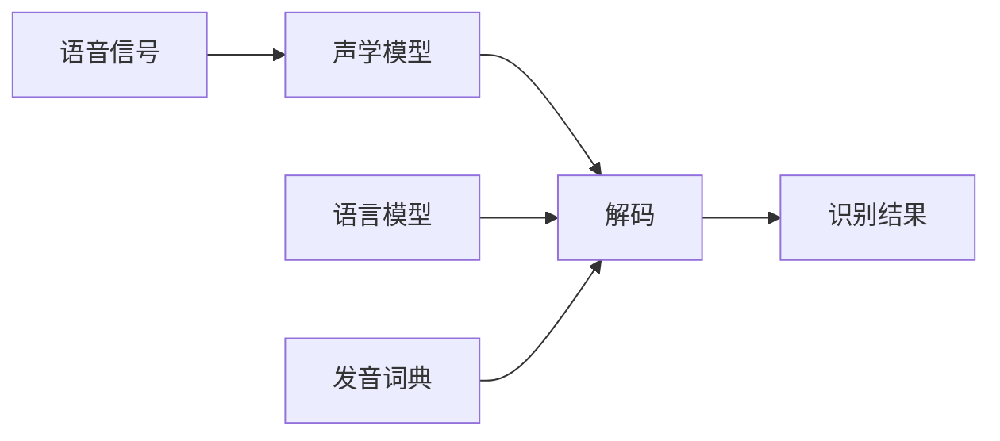

# Automatic Speech Recognition (ASR)原理与代码实例讲解

作者：禅与计算机程序设计艺术 / Zen and the Art of Computer Programming 

关键词：语音识别、声学模型、语言模型、深度学习、端到端模型、Kaldi、PyTorch

## 1. 背景介绍

### 1.1 问题的由来
语音是人类最自然、最便捷的交互方式之一。让机器能够像人一样"听懂"语音,进而实现人机语音交互,一直是人工智能领域的重要课题。自动语音识别(Automatic Speech Recognition, ASR)技术就是为了解决这一问题而发展起来的。

### 1.2 研究现状
经过几十年的发展,语音识别技术已经取得了长足的进步。传统的 ASR 系统主要基于隐马尔可夫模型(HMM)和高斯混合模型(GMM),通过声学模型和语言模型的结合来实现语音到文本的转换。近年来,随着深度学习的兴起,越来越多的研究开始尝试将深度神经网络(DNN)引入语音识别任务中,极大地提升了 ASR 系统的性能。目前,业界主流的语音识别系统大都采用了基于深度学习的端到端建模方法。

### 1.3 研究意义 
语音识别技术在智能语音交互、语音信息处理、语音内容检索等诸多领域有着广泛的应用前景。研究高效、鲁棒的语音识别算法,对于推动人工智能在更多场景的落地应用具有重要意义。同时,语音识别中的声学建模、语言建模等技术也可以为其他模式识别任务提供有益的思路和借鉴。

### 1.4 本文结构
本文将围绕语音识别的基本原理和实现方法展开论述。第2部分介绍语音识别涉及的一些核心概念;第3部分重点阐述语音识别的算法原理和流程;第4部分给出相关的数学模型和公式推导;第5部分通过代码实例演示语音识别系统的具体实现;第6部分讨论语音识别技术的实际应用场景;第7部分推荐语音识别相关的学习资源和开发工具;第8部分总结全文并展望语音识别技术的未来发展方向。

## 2. 核心概念与联系

在语音识别领域,有几个核心概念需要了解:

- 语音信号(Speech Signal):携带语言信息的声音信号,是语音识别的输入。
- 声学模型(Acoustic Model):用于将语音信号映射为音素或词的发音的概率模型。常用高斯混合模型(GMM)、深度神经网络(DNN)等方法构建。  
- 语言模型(Language Model):刻画语言中词与词之间的依赖关系,为识别提供语言学约束。常用统计 N-gram 模型或 RNN 语言模型。
- 发音词典(Pronunciation Lexicon):存储每个词的发音信息,连接声学模型和语言模型。
- 解码(Decoding):在声学模型和语言模型的约束下,搜索与输入语音最匹配的词序列,得到识别结果。常用 Viterbi 解码算法。

下图展示了语音识别系统的基本架构和各模块之间的关系:



## 3. 核心算法原理 & 具体操作步骤

### 3.1 算法原理概述
传统的语音识别系统通常采用声学模型(AM)和语言模型(LM)相结合的方式。其基本原理可以用贝叶斯公式表示:

$$\hat{W} = \arg\max_W P(W|O) = \arg\max_W \frac{P(O|W)P(W)}{P(O)} = \arg\max_W P(O|W)P(W)$$

其中,$W$表示候选的词序列,$O$表示观测到的语音特征序列。$P(O|W)$由声学模型计算,$P(W)$由语言模型计算。解码过程就是找到使 $P(O|W)P(W)$ 最大的词序列 $\hat{W}$。

### 3.2 算法步骤详解

1. 特征提取:将语音信号转换为适合建模的特征表示,如 MFCC、FBANK 等。
2. 声学模型训练:在标注数据上训练声学模型,学习语音到音素或词的发音的映射关系。
3. 语言模型训练:在大规模文本语料上训练语言模型,学习词与词之间的依赖关系。 
4. 解码搜索:在新的语音输入上,利用声学模型和语言模型进行解码,得到识别结果。

端到端语音识别模型如 CTC、RNN-Transducer、Attention 等,将声学模型、发音词典和语言模型整合为一个端到端可训练的神经网络,直接学习语音到文本的映射关系,简化了传统语音识别流程。

### 3.3 算法优缺点

传统 HMM-GMM 方法的优点是:
- 模型可解释性强,各模块可独立优化
- 资源占用小,性能稳定

缺点是:
- 模型假设较强,难以刻画语音的长距离依赖
- 需要大量标注数据,对噪声、口音等变化敏感

基于深度学习的端到端方法的优点是:
- 一体化建模,避免了模块间的信息损失
- 从数据中自动学习特征表示,对噪声更鲁棒

缺点是:
- 模型参数量大,训练推理耗时
- 可解释性差,调优困难
- 对训练数据的质量和数量要求更高

### 3.4 算法应用领域
语音识别算法被广泛应用于以下领域:

- 智能语音助手:如 Siri、Alexa、小爱同学等
- 语音输入法:提供便捷的文字输入方式
- 语音内容检索:从音/视频中检索关键词,实现声音搜索
- 会议记录转写:将会议音频实时转为文字记录
- 医疗领域:医生口述记录电子病历,辅助诊断等
- 智能客服:通过语音交互引导用户、解答问题
- 车载交互:实现车内免提语音控制

## 4. 数学模型和公式 & 详细讲解 & 举例说明

### 4.1 数学模型构建
语音识别的数学模型可以用概率图模型来刻画。记语音特征序列为 $O=(o_1,o_2,...,o_T)$,词序列为 $W=(w_1,w_2,...,w_L)$,语音识别的目标是找到后验概率 $P(W|O)$ 最大的 $\hat{W}$:

$$\hat{W} = \arg\max_W P(W|O) = \arg\max_W \frac{P(O|W)P(W)}{P(O)} = \arg\max_W P(O|W)P(W)$$

其中,$P(O|W)$ 为声学模型,$P(W)$ 为语言模型。

### 4.2 公式推导过程

根据贝叶斯公式,有:

$$P(W|O) = \frac{P(O|W)P(W)}{P(O)}$$

因为 $P(O)$ 与 $W$ 无关,所以:

$$\arg\max_W P(W|O) = \arg\max_W P(O|W)P(W)$$

假设 HMM 的输出观测独立,则声学模型 $P(O|W)$ 可以表示为:

$$P(O|W) = \prod_{t=1}^T P(o_t|w_t)$$

语言模型 $P(W)$ 可以用 N-gram 模型刻画:

$$P(W) = \prod_{l=1}^L P(w_l|w_{l-1},...,w_{l-n+1})$$

将声学模型和语言模型代入,得到完整的语音识别数学模型:

$$\hat{W} = \arg\max_W \prod_{t=1}^T P(o_t|w_t) \prod_{l=1}^L P(w_l|w_{l-1},...,w_{l-n+1})$$

### 4.3 案例分析与讲解
下面以一个简单的例子来说明语音识别的数学模型。假设词汇表为 {我,你,他},语音特征序列为 $O=(o_1,o_2)$。

声学模型给出以下概率:

$$P(o_1|我)=0.6, P(o_1|你)=0.3, P(o_1|他)=0.1$$
$$P(o_2|我)=0.2, P(o_2|你)=0.7, P(o_2|他)=0.1$$

语言模型为 bigram 模型,给出以下概率:

$$P(我)=0.5, P(你)=0.3, P(他)=0.2$$
$$P(我|我)=0.4, P(我|你)=0.2, P(我|他)=0.1$$  
$$P(你|我)=0.4, P(你|你)=0.6, P(你|他)=0.5$$
$$P(他|我)=0.2, P(他|你)=0.2, P(他|他)=0.4$$

那么对于候选词序列 "我 你",其声学模型概率为:

$$P(O|我,你) = P(o_1|我)P(o_2|你) = 0.6 \times 0.7 = 0.42$$

语言模型概率为:

$$P(我,你) = P(我)P(你|我) = 0.5 \times 0.4 = 0.2$$

综合声学模型和语言模型,该词序列的后验概率为:

$$P(我,你|O) \propto P(O|我,你)P(我,你) = 0.42 \times 0.2 = 0.084$$

类似地,可以计算其他候选词序列的后验概率,选取概率最大的作为识别结果。

### 4.4 常见问题解答
Q: 声学模型和语言模型分别起什么作用?
A: 声学模型刻画语音特征和词之间的对应关系,语言模型刻画词序列的合理性。两者相结合,可以找到既与语音匹配、又符合语言规律的识别结果。

Q: 为什么语音识别要用概率图模型?
A: 语音识别是一个序列映射问题,涉及不同粒度(帧、音素、词)间的复杂依赖关系。概率图模型可以很好地建模这种层次化的随机过程,用条件独立假设来简化建模。同时,概率图模型也便于理解和推理。

Q: 端到端语音识别模型与传统模型有何区别?
A: 传统模型需要分别构建声学模型、发音词典和语言模型,再通过解码器集成。而端到端模型将这些模块整合为一个端到端可训练的神经网络,直接学习语音到文本的映射关系,避免了模块间的信息损失,但需要更多的训练数据。

## 5. 项目实践：代码实例和详细解释说明

### 5.1 开发环境搭建
以下示例代码基于 Python 3 和 PyTorch 1.8。需要安装以下依赖库:
```
numpy
scipy 
pytorch
torchaudio
```

### 5.2 源代码详细实现

下面给出一个简单的基于 CTC 损失的语音识别模型的 PyTorch 实现:

```python
import torch
import torch.nn as nn
import torchaudio

class CNNLayerNorm(nn.Module):
    """Layer norm after CNN"""
    def __init__(self, dim, eps=1e-05):
        super().__init__()
        self.eps = eps
        self.gamma = nn.Parameter(torch.ones(dim))
        self.beta = nn.Parameter(torch.zeros(dim))

    def forward(self, x):
        mean = x.mean(1, keepdim=True)
        var = x.var(1, keepdim=True)
        x = (x - mean) / torch.sqrt(var + self.eps)
        x = self.gamma * x + self.beta
        return x
        
class ResidualCNN(nn.Module):
    """Residual CNN block"""
    def __init__(self, in_channels, out_channels, kernel, stride, dropout):
        super().__init__()
        self.cnn1 = nn.Conv2d(in_channels, out_channels, kernel, stride, padding=kernel//2)
        self.cnn2 = nn.Conv2d(out_channels, out_channels, kernel, stride, padding=kernel//2)
        self.dropout1 = nn.Dropout(dropout)
        self.dropout2 = nn.Dropout(dropout)
        self.layer_norm1 = CNNLayerNorm(out_channels)
        self.layer_norm2 = CNNLayerNorm(out_channels)

    def forward(self, x):
        residual = x  
        x = self.