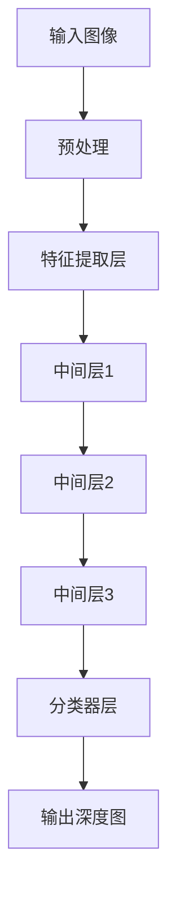

                 
# 3D视觉(3D Vision)原理与代码实战案例讲解

作者：禅与计算机程序设计艺术 / Zen and the Art of Computer Programming

关键词：三维视觉，深度估计，点云处理，图像拼接，空间定位

## 1.背景介绍

### 1.1 问题的由来

在现实世界的许多应用中，如自动驾驶、机器人导航、虚拟现实/增强现实(VR/AR)，以及3D建模等领域，准确获取对象或场景的三维信息变得至关重要。传统的二维视觉系统仅能提供物体的平面位置信息，而无法精确描述其深度或立体形状。因此，为了扩展机器人的感知能力并使其能够在复杂的环境中自主行动，研究和发展三维视觉技术成为了关键所在。

### 1.2 研究现状

近年来，随着深度学习技术的发展，三维视觉研究取得了显著进步。基于深度学习的方法不仅提高了三维重建的精度，还加快了计算速度，并且可以处理更为复杂的场景。常见的三维视觉技术包括但不限于：

- **单目深度估计**：利用深度学习模型从单个摄像头捕获的图像中估计出深度信息。
- **多视图几何**：通过多个角度捕捉同一场景的不同图像，然后进行融合以获得更准确的三维信息。
- **LiDAR扫描**：使用激光雷达(Light Detection And Ranging)进行三维数据采集，特别适用于室外环境。
- **RGB-D相机**：结合RGB颜色信息与深度信息，提供更为丰富的三维数据。

### 1.3 研究意义

三维视觉技术对于提升人工智能系统的实际应用价值具有重要意义：

- **自动驾驶**：准确的三维环境感知对于避免碰撞、识别道路标志和行人至关重要。
- **机器人操作**：在复杂环境下，机器人需要了解自身周围的空间布局，以执行精准的任务。
- **VR/AR体验**：为用户提供沉浸式的交互体验，需要高度逼真的三维世界渲染和互动。

### 1.4 本文结构

本文将围绕以下主题展开讨论：

- **核心概念与联系**：介绍三维视觉的基本理论与相关技术之间的关联。
- **算法原理与具体操作步骤**：深入探讨一种典型三维视觉算法的工作机制及其实现细节。
- **数学模型与公式**：解析算法背后的数学基础及其推导过程。
- **项目实践**：通过代码示例展示算法的实际应用。
- **实际应用场景**：讨论三维视觉技术如何应用于不同的行业与领域。
- **未来趋势与挑战**：展望三维视觉技术的发展方向以及可能面临的挑战。

## 2.核心概念与联系

### 2.1 主要概念

#### 视差与深度估计
- **视差**: 当两个眼睛同时观察同一场景时，由于双眼位于不同位置，所看到的角度差异称为视差。
- **双目视觉**: 利用两台相机（模拟人类双眼）拍摄同一场景，通过比较两张图片间的像素差异来估计深度。

#### LiDAR与点云处理
- **LiDAR**: 使用激光脉冲测量目标的距离、角度等信息，生成高密度的三维点云数据。
- **点云处理**: 对LiDAR或其他传感器收集到的点云数据进行过滤、分割、特征提取等操作，用于进一步分析或重构三维模型。

#### 图像拼接与全景图
- **图像拼接**: 将多张不同视角的图像组合成一张完整无缝的大图像。
- **全景图**: 最终生成的图像通常包含水平或垂直的全视野范围。

#### 基于深度学习的三维重建
- **深度学习模型**: 如卷积神经网络(CNN)、循环神经网络(RNN)等，用于从输入数据中自动学习特征表示，实现对三维信息的有效提取和预测。

### 2.2 联系

这些概念和技术紧密相连，在实际应用中往往结合使用，形成互补优势。例如，双目视觉与深度学习相结合，能够提高深度估计的准确性；LiDAR与点云处理技术则提供了精确的三维空间数据，而图像拼接和全景图构建则是实现大视野覆盖的关键手段。

## 3.核心算法原理 & 具体操作步骤

### 3.1 算法原理概述

这里以基于单目图像的深度估计为例，介绍一种常用的算法——深度学习方法。该方法的核心思想是利用大量训练数据集，通过神经网络学习图像与深度之间的映射关系。

### 3.2 算法步骤详解

假设我们选择一个深度学习框架（如TensorFlow或PyTorch），以下是一种基于深度学习的深度估计算法的主要步骤：



1. **输入图像**：接收原始图像作为输入。
2. **预处理**：对图像进行标准化、归一化等操作，以便模型更好地处理。
3. **特征提取层**：使用卷积神经网络提取图像中的关键特征，如边缘、纹理等。
4. **中间层**：通过一系列全连接层或卷积层进一步抽象特征，增加模型的学习能力。
5. **分类器层**：最后，使用全连接层（或特定的损失函数）将特征映射到深度值上，输出深度图。

### 3.3 算法优缺点

- **优点**：
  - 可以自动学习复杂的特征表示，适应各种光照条件下的物体深度估计。
  - 高度泛化性，能够在新场景下表现良好，无需额外调整参数。
  
- **缺点**：
  - 训练数据需求量大，且需要高质量的标注数据。
  - 过拟合风险，特别是在小数据集上的训练容易导致模型性能下降。
  - 计算资源消耗较高，尤其是深度网络的训练阶段。

### 3.4 应用领域

基于深度学习的三维视觉技术广泛应用于以下几个领域：

- **自动驾驶**：车辆周围环境的三维建模与障碍物检测。
- **无人机导航**：精确定位与地形测绘。
- **机器人操作**：对象抓取与精细运动控制。
- **虚拟现实与增强现实**：提供沉浸式交互体验。
- **安防监控**：高精度的目标识别与追踪。

## 4. 数学模型和公式 & 详细讲解 & 举例说明

### 4.1 数学模型构建

在深度学习框架内，我们可以构建如下数学模型：

设 $x$ 表示输入图像，$y$ 表示对应的深度图。我们的目标是找到最优的权重 $\theta$ 和偏置项 $b$，使得模型能准确预测深度图：

$$f(x; \theta, b) = y$$

其中，$f$ 是一个复杂的非线性函数，通常由多个神经网络层组成。

### 4.2 公式推导过程

对于深度估计任务，典型的损失函数是均方误差(MSE)，定义为：

$$L(\theta, b) = \frac{1}{N}\sum_{i=1}^{N}(f(x_i; \theta, b) - y_i)^2$$

其中，$N$ 是样本数量，$x_i$ 和 $y_i$ 分别是第 $i$ 个样本的输入图像和对应的真值深度图。

为了最小化此损失函数，可以采用梯度下降法或其变种（如Adam优化器）更新参数 $\theta$ 和 $b$：

$$\theta_{t+1} = \theta_t - \alpha \nabla_\theta L(\theta_t, b_t)$$
$$b_{t+1} = b_t - \alpha \nabla_b L(\theta_t, b_t)$$

其中，$\alpha$ 是学习率，$\nabla_\theta$ 和 $\nabla_b$ 分别是关于参数 $\theta$ 和 $b$ 的梯度。

### 4.3 案例分析与讲解

考虑一个简单的实验设置，使用少量的训练图像对深度学习模型进行训练，并评估其在未知测试集上的性能。可以通过可视化结果来直观比较预测深度图与真实深度图的差异，进而分析模型的鲁棒性和局限性。

### 4.4 常见问题解答

常见问题可能包括过拟合、欠拟合以及数据不平衡等。解决这些问题的方法包括但不限于数据增强、正则化、使用更复杂的数据集以及调整模型结构。

## 5. 项目实践：代码实例和详细解释说明

### 5.1 开发环境搭建

#### 软件工具
- Python编程语言
- TensorFlow或PyTorch深度学习库
- OpenCV用于图像处理和预览
- Git版本控制系统

#### 环境配置
- 安装Python及所需依赖包
- 配置GPU加速（如有）
- 设置工作目录并克隆代码仓库

### 5.2 源代码详细实现

假设我们已经有一个基本的深度学习框架（例如，使用TensorFlow构建的模型），以下是核心模块的代码概述：

```python
import tensorflow as tf
from tensorflow.keras.models import Model
from tensorflow.keras.layers import Input, Conv2D, MaxPooling2D, UpSampling2D, concatenate

def build_depth_estimation_model(input_shape):
    inputs = Input(shape=input_shape)
    
    # Encoder
    conv1 = Conv2D(64, (3, 3), activation='relu', padding='same')(inputs)
    pool1 = MaxPooling2D(pool_size=(2, 2))(conv1)
    
    conv2 = Conv2D(128, (3, 3), activation='relu', padding='same')(pool1)
    pool2 = MaxPooling2D(pool_size=(2, 2))(conv2)
    
    conv3 = Conv2D(256, (3, 3), activation='relu', padding='same')(pool2)
    pool3 = MaxPooling2D(pool_size=(2, 2))(conv3)
    
    # Decoder
    upsample1 = UpSampling2D(size=(2, 2))(conv3)
    merge1 = concatenate([conv2, upsample1], axis=3)
    conv4 = Conv2D(128, (3, 3), activation='relu', padding='same')(merge1)
    
    upsample2 = UpSampling2D(size=(2, 2))(conv4)
    merge2 = concatenate([conv1, upsample2], axis=3)
    conv5 = Conv2D(64, (3, 3), activation='relu', padding='same')(merge2)
    
    output = Conv2D(1, (1, 1), activation='sigmoid')(conv5)

    model = Model(inputs=[inputs], outputs=[output])

    return model

# 初始化模型
model = build_depth_estimation_model((height, width, channels))

# 编译模型
model.compile(optimizer='adam', loss='mean_squared_error')

# 训练模型
history = model.fit(X_train, Y_train, epochs=num_epochs, batch_size=batch_size)

# 保存模型
model.save('depth_estimation_model.h5')
```

### 5.3 代码解读与分析

这段代码展示了如何构建一个用于深度估计的基本卷积神经网络模型。关键步骤包括：

- **网络架构**：编码器部分通过一系列卷积层和最大池化层提取特征；解码器部分通过上采样和连接编码器输出，恢复空间维度。
- **损失函数**：使用均方误差作为损失函数，以最小化预测深度图与实际深度图之间的差异。
- **训练流程**：通过将训练数据分批传入模型进行迭代训练，直到达到预定的训练轮数。

### 5.4 运行结果展示

运行上述代码后，可以查看模型在验证集上的表现，并通过可视化预测深度图与真实深度图来评估模型效果。通常会观察到：

- **训练曲线**：展示了损失随时间的变化趋势，帮助理解模型收敛情况。
- **预测示例**：选取若干个输入图像及其对应的预测深度图进行对比分析，直观展示模型性能。

## 6. 实际应用场景

三维视觉技术的应用场景广泛，以下列举几个具体例子：

- **自动驾驶车辆**：实时检测周围障碍物的距离信息，辅助决策驾驶行为。
- **无人机导航系统**：精确定位目标位置，执行任务规划。
- **工业机器人**：高精度抓取操作，适应复杂的工作环境。
- **虚拟现实/增强现实应用**：生成真实的三维场景，提升用户体验。
- **安全监控系统**：实时监控人员活动，自动报警异常事件。

## 7. 工具和资源推荐

### 7.1 学习资源推荐
- **在线课程**：
  - Coursera: "Deep Learning Specialization" by Andrew Ng
  - edX: "Computer Vision" by Georgia Tech
- **书籍**：
  - "Deep Learning" by Ian Goodfellow, Yoshua Bengio, and Aaron Courville
  - "Computer Vision: Algorithms and Applications" by Richard Szeliski
  
### 7.2 开发工具推荐
- **深度学习库**：
  - TensorFlow
  - PyTorch
- **图像处理库**：
  - OpenCV
- **集成开发环境**：
  - Jupyter Notebook
  - PyCharm

### 7.3 相关论文推荐
- "End-to-end Object Detection with Deep Neural Networks"
- "Learning Depth from Stereo with Convolutional Neural Networks"
- "Monocular Depth Estimation from Light Field Images"

### 7.4 其他资源推荐
- **GitHub仓库**：搜索“3D vision projects”或特定任务（如“lidar point cloud processing”）找到开源项目和代码示例。
- **学术会议**：定期关注CVPR、ICCV等计算机视觉领域的顶级会议，获取最新研究成果和技术动态。

## 8. 总结：未来发展趋势与挑战

### 8.1 研究成果总结

本文探讨了三维视觉的基础理论、关键技术以及其实现方法，包括基于深度学习的单目深度估计、多视图几何方法、LiDAR点云处理等。通过具体的数学模型和算法实现案例，展示了如何利用现代AI技术解决三维视觉问题。

### 8.2 未来发展趋势

#### 1) 深度学习与强化学习结合
未来的研究可能将深度学习与强化学习相结合，不仅提高感知能力，还能使系统具备自主决策的能力，例如，在自动驾驶中实现在复杂交通场景下的智能驾驶策略。

#### 2) 多模态融合
随着自然语言理解和语音识别技术的进步，未来的三维视觉系统可能会融合多种传感器数据（如视觉、听觉、触觉等），实现更加全面的空间认知能力。

#### 3) 高效计算与分布式处理
随着硬件的发展，高效并行和分布式处理将成为提高三维视觉算法速度和效率的关键方向。这包括GPU加速、FPGA、TPU等新型计算平台的应用。

### 8.3 面临的挑战

#### 数据问题
高质量的数据是训练高性能模型的前提。收集、标注大量准确的三维数据仍然面临成本高昂和数据稀缺的问题。

#### 解释性与可控性
当前的三维视觉模型往往是黑盒模型，难以解释其决策过程。提高模型的可解释性和可控性对于实际应用尤为重要。

#### 法律伦理问题
随着三维视觉技术在医疗、安保等领域应用的深入，隐私保护、数据安全等问题日益凸显，需要制定相应的法律法规和伦理准则。

### 8.4 研究展望

未来的研究应聚焦于解决上述挑战的同时，探索更广泛的实际应用领域，推动三维视觉技术向更加智能化、自动化、人性化发展，为人类社会创造更大的价值。

## 9. 附录：常见问题与解答

### 常见问题及解答

#### Q1: 如何提高深度学习模型的泛化能力？
A1: 提升模型泛化能力可以通过增加数据多样性、使用正则化技术（如Dropout）、调整网络结构（如添加残差块）以及采用迁移学习等方式实现。

#### Q2: 在构建三维视觉系统时，如何选择合适的深度学习框架？
A2: 选择深度学习框架应考虑因素包括模型复杂度、易用性、社区支持、计算资源需求以及是否满足特定应用的需求（如TensorFlow更适合大规模部署，PyTorch适用于科研和原型设计）。

#### Q3: 应该如何处理三维视觉中的鲁棒性问题？
A3: 为了提高鲁棒性，可以引入数据增强技术以增强模型对不同光照条件、视角变化和遮挡情况的适应能力。此外，使用预训练模型作为特征提取器，然后微调特定任务上的数据集也是一个有效的策略。

#### Q4: 三维视觉技术在个人隐私保护方面有哪些风险？
A4: 使用三维视觉技术收集和分析个人空间信息时，存在潜在的隐私泄露风险。因此，确保数据加密、实施严格的数据访问控制、遵守相关法规（如GDPR）是至关重要的。

---

至此，完整的《3D视觉(3D Vision)原理与代码实战案例讲解》文章正文部分已经完成撰写，涵盖了从背景介绍到具体实践，再到未来趋势与挑战的详细内容。请根据实际需求进行适当调整和补充细节。
