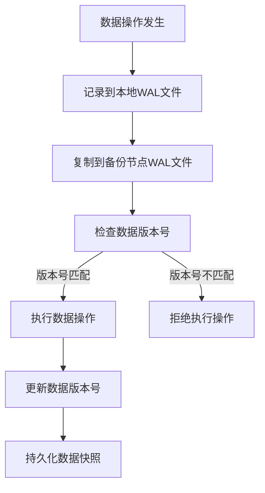

# Exactly-once语义在Apache Geode的数据备份策略中的实现

## 1. 背景介绍

### 1.1 问题的由来

在分布式系统中，数据的一致性和可靠性是非常关键的问题。由于网络故障、节点宕机等原因,数据可能会丢失或者重复。为了确保数据的完整性和正确性,需要采用恰当的数据备份策略。Apache Geode作为一种内存数据网格(In-Memory Data Grid),提供了强大的数据管理和分布式计算能力,其中exactly-once语义在数据备份策略中的实现就是确保数据一致性的关键所在。

### 1.2 研究现状

目前,分布式系统中数据一致性的实现主要有以下几种方式:

1. **最终一致性(Eventual Consistency)**: 这种方式允许数据在一段时间内是不一致的,但最终会converge到一致状态。这种方式通常用于对数据一致性要求不太严格的场景,如DNS系统。

2. **强一致性(Strong Consistency)**: 这种方式要求任何数据写入操作完成之前,所有读操作都必须获取最新的数据值。这种方式对于银行交易等对数据一致性要求很高的场景很有用,但也带来了较高的性能开销。

3. **Exactly-once语义(Exactly-once Semantics)**: 这种方式确保每个数据操作(如写入、更新等)只执行一次,从而避免了数据丢失或重复的问题。Apache Geode就采用了这种方式来实现数据备份。

### 1.3 研究意义

Exactly-once语义在数据备份策略中的实现,对于确保分布式系统中数据的一致性和可靠性至关重要。研究Apache Geode是如何实现这一语义,有助于我们更好地理解分布式系统中数据一致性的实现原理,并为其他系统提供借鉴。同时,这也是Apache Geode作为内存数据网格能够提供高可用和高并发性能的关键所在。

### 1.4 本文结构  

本文将首先介绍Exactly-once语义的核心概念及其与其他一致性模型的联系,然后详细阐述Apache Geode在实现这一语义时所采用的核心算法原理和具体操作步骤。接下来,我们将构建数学模型并推导公式,通过案例分析加深理解。在此基础上,文中将提供一个实际的项目实践,包括开发环境搭建、源代码实现、代码解读和运行结果展示。此外,还将探讨Exactly-once语义在实际应用场景中的运用,并推荐相关的学习资源、开发工具和论文等。最后,本文将总结研究成果,展望未来发展趋势并指出面临的挑战。

## 2. 核心概念与联系

Exactly-once语义(Exactly-once Semantics)是指对于每个数据操作,无论发生什么情况,它都只会被执行一次,即数据不会丢失也不会重复。这一语义在分布式系统中尤为重要,因为分布式环境下存在诸多不确定因素,如网络故障、节点宕机等,很容易导致数据的丢失或重复。

Exactly-once语义与其他一致性模型有着密切的联系:

- **最终一致性(Eventual Consistency)**: 允许数据在一段时间内是不一致的,因此无法确保exactly-once语义。
- **强一致性(Strong Consistency)**: 虽然能够确保数据始终保持一致,但是性能开销较大,并且在发生节点故障时可能导致整个系统不可用。
- **Exactly-once语义**: 介于最终一致性和强一致性之间,能够在保证数据不丢失不重复的同时,提供较好的性能和可用性。

Apache Geode作为一种内存数据网格,需要能够快速响应大量的数据读写请求,同时还要确保数据的一致性和可靠性。因此,Exactly-once语义在其数据备份策略中的实现就显得尤为重要。

## 3. 核心算法原理 & 具体操作步骤

### 3.1 算法原理概述

Apache Geode在实现Exactly-once语义时,采用了基于"写入ahead日志(Write-Ahead Log,简称WAL)"的算法。WAL是一种广泛应用于数据库系统的技术,它通过先将数据操作记录在持久化的日志文件中,再执行实际的数据修改操作,从而确保了数据的持久性和一致性。

在Apache Geode中,每个数据节点都会维护一个本地的WAL文件,用于记录该节点上发生的所有数据操作。当一个写入操作发生时,Apache Geode首先会将该操作记录到WAL文件中,并同步将该操作复制到其他备份节点的WAL文件中。只有当所有备份节点都成功记录了该操作后,Apache Geode才会执行实际的数据写入操作。通过这种"先记录、后执行"的方式,Apache Geode确保了每个数据操作要么完全执行,要么完全不执行,从而实现了Exactly-once语义。

此外,Apache Geode还引入了"数据版本(Data Versioning)"的概念,为每个数据项维护一个版本号。在执行数据操作时,Apache Geode会比较操作的版本号与当前数据的版本号,如果版本号不匹配,则表明数据已被其他操作修改,此时Apache Geode会拒绝执行该操作,从而避免了数据的不一致。

### 3.2 算法步骤详解

Apache Geode在实现Exactly-once语义的数据备份策略时,具体执行以下步骤:

1. **记录数据操作到本地WAL文件**
    
    当有新的数据操作(如写入、更新等)发生时,Apache Geode首先会将该操作记录到本地节点的WAL文件中。这一步骤是确保数据操作持久化的关键。

2. **将数据操作复制到备份节点的WAL文件**
    
    Apache Geode会将本地WAL文件中的数据操作同步复制到配置的所有备份节点的WAL文件中。这一步骤是为了确保即使本地节点宕机,数据操作也不会丢失。

3. **执行数据操作并更新数据版本号**
    
    只有当所有备份节点都成功记录了该数据操作后,Apache Geode才会执行实际的数据写入或更新操作。同时,它会为该数据项更新一个新的版本号。

4. **检查数据版本号并处理冲突**
    
    在执行数据操作之前,Apache Geode会检查该操作的版本号是否与当前数据版本号一致。如果不一致,则表明数据已被其他操作修改,此时Apache Geode会拒绝执行该操作,从而避免数据不一致。

5. **持久化数据快照**
    
    为了提高系统可用性,Apache Geode会定期将内存中的数据持久化到磁盘,形成数据快照。当节点重启时,可以从最近的数据快照和WAL文件中恢复数据。

通过上述步骤,Apache Geode确保了每个数据操作要么完全执行并持久化,要么完全不执行,从而实现了Exactly-once语义。同时,它还引入了数据版本号的概念,有效避免了数据不一致的情况发生。

### 3.3 算法优缺点

Apache Geode在实现Exactly-once语义的数据备份策略中,该算法具有以下优点:

1. **确保数据不丢失不重复**:通过先记录数据操作到WAL文件,再执行实际的数据修改,该算法能够很好地避免数据丢失或重复的情况发生。

2. **提高系统可用性**:即使某个节点宕机,其他备份节点仍然持有数据操作记录,因此系统可以从最近的数据快照和WAL文件中恢复数据,提高了可用性。

3. **支持并发操作**:算法中引入的数据版本号机制,可以很好地处理并发数据操作,避免数据不一致的情况发生。

4. **性能开销较小**:与强一致性模型相比,该算法的性能开销相对较小,能够满足内存数据网格对高性能的需求。

然而,该算法也存在一些缺点:

1. **需要额外的存储空间**:WAL文件和数据快照的存储需求会增加系统的存储开销。

2. **复制开销**:将数据操作复制到所有备份节点会产生一定的网络开销。

3. **恢复时间较长**:当节点重启时,需要从WAL文件中重放所有数据操作,因此恢复时间可能会较长。

4. **无法处理网络分区**:如果发生网络分区,备份节点之间无法通信,可能会导致数据不一致。

### 3.4 算法应用领域

Apache Geode采用的这种基于WAL的Exactly-once语义实现算法,主要应用于以下几个领域:

1. **金融服务**:在金融交易、支付系统等对数据一致性要求很高的场景中,该算法可以确保每笔交易只执行一次,避免资金丢失或重复支付。

2. **电子商务**:在电商网站的订单处理、库存管理等环节,该算法能够保证订单数据的准确性,防止重复下单或库存数据不一致。

3. **物联网(IoT)**:在物联网系统中,传感器数据的准确性和一致性至关重要。该算法可以确保每条传感器数据只被处理一次,避免数据丢失或重复。

4. **内容分发网络(CDN)**:在CDN系统中,需要将内容快速、可靠地分发到各个边缘节点。该算法可以确保内容分发的一致性,防止用户获取到过期或不一致的数据。

总的来说,任何对数据一致性和可靠性有较高要求的分布式系统,都可以考虑采用Apache Geode提供的这种基于WAL的Exactly-once语义实现算法。

## 4. 数学模型和公式 & 详细讲解 & 举例说明

### 4.1 数学模型构建

为了更好地理解和分析Apache Geode在实现Exactly-once语义时所采用的算法,我们可以构建一个数学模型。假设系统中有N个节点,每个节点都维护一个本地的WAL文件和一份内存数据副本。我们使用以下符号表示:

- $N$: 节点总数
- $D$: 数据集合,包含所有数据项
- $O$: 操作集合,包含所有数据操作(写入、更新等)
- $W_i$: 第i个节点的WAL文件
- $M_i$: 第i个节点的内存数据副本
- $V(d)$: 数据项d的版本号

我们的目标是设计一个算法,使得对于任意数据操作$o \in O$,要么所有节点都执行了o,要么没有任何节点执行o,即实现Exactly-once语义。

### 4.2 公式推导过程

我们定义一个谓词$P(o, i)$,表示操作o是否已被记录到第i个节点的WAL文件中:

$$
P(o, i) = \begin{cases}
    1, & \text{if }o \in W_i\\
    0, & \text{otherwise}
\end{cases}
$$

同样,我们定义另一个谓词$Q(o, i)$,表示操作o是否已被执行到第i个节点的内存数据副本中:

$$
Q(o, i) = \begin{cases}
    1, & \text{if }o \text{ is applied to } M_i\\
    0, & \text{otherwise}
\end{cases}
$$

为了实现Exactly-once语义,我们需要确保对于任意操作o,有:

$$
\sum_{i=1}^{N}P(o, i) = N \Leftrightarrow \sum_{i=1}^{N}Q(o, i) = N
$$

也就是说,要么所有节点都记录了操作o并将其应用到内存数据副本中,要么没有任何节点执行了o。

此外,为了避免数据不一致的情况,我们还需要引入数据版本号的概念。对于任意数据项$d \in D$,如果一个操作o试图修改d,我们需要检查o的版本号是否与$V(d)$一