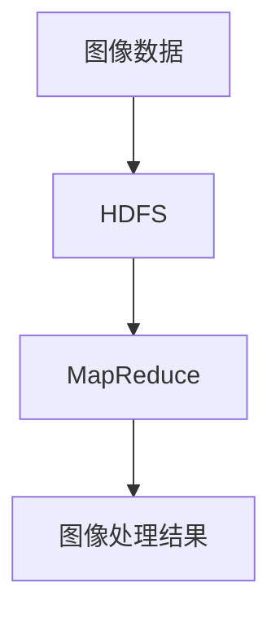

# Hadoop与图像识别与处理

作者：禅与计算机程序设计艺术 / Zen and the Art of Computer Programming

## 1. 背景介绍

### 1.1 问题的由来

在大数据时代，数据的爆炸性增长对数据处理技术提出了新的挑战。图像数据作为一种重要的数据形式，其处理和分析在许多领域中具有重要意义，如医疗影像分析、自动驾驶、安防监控等。然而，传统的图像处理方法在面对海量图像数据时显得力不从心。Hadoop作为一种分布式计算框架，提供了处理大规模数据的能力，为图像识别与处理提供了新的解决方案。

### 1.2 研究现状

目前，图像识别与处理技术已经取得了显著进展，深度学习算法如卷积神经网络（CNN）在图像分类、目标检测等任务中表现出色。然而，这些算法通常需要大量的计算资源和数据存储空间。Hadoop的分布式计算和存储能力可以有效地解决这些问题，许多研究已经开始将Hadoop与图像处理技术结合起来，以提高处理效率和扩展性。

### 1.3 研究意义

将Hadoop与图像识别与处理技术结合，不仅可以提高图像处理的效率，还可以处理更大规模的图像数据集。这对于需要处理海量图像数据的应用场景，如医疗影像分析、智能交通系统等，具有重要的实际意义。此外，这种结合也为大数据技术在图像处理领域的应用提供了新的思路和方法。

### 1.4 本文结构

本文将详细介绍Hadoop与图像识别与处理的结合方法，内容包括核心概念与联系、核心算法原理与具体操作步骤、数学模型和公式、项目实践、实际应用场景、工具和资源推荐、总结与未来发展趋势等。

## 2. 核心概念与联系

在深入探讨Hadoop与图像识别与处理的结合之前，我们需要了解一些核心概念及其相互联系。

### 2.1 Hadoop概述

Hadoop是一个开源的分布式计算框架，主要由HDFS（Hadoop Distributed File System）和MapReduce计算模型组成。HDFS提供了高可靠性和高吞吐量的数据存储，而MapReduce则提供了分布式计算的编程模型。

### 2.2 图像识别与处理概述

图像识别与处理是计算机视觉的一个重要分支，主要包括图像预处理、特征提取、图像分类、目标检测等任务。常用的算法包括卷积神经网络（CNN）、支持向量机（SVM）等。

### 2.3 Hadoop与图像处理的结合点

Hadoop的分布式计算和存储能力可以有效地处理大规模图像数据。通过将图像数据存储在HDFS中，并利用MapReduce模型进行并行处理，可以大大提高图像处理的效率和扩展性。

## 3. 核心算法原理 & 具体操作步骤

### 3.1 算法原理概述

在Hadoop环境中进行图像识别与处理，主要涉及以下几个步骤：图像数据的存储、图像数据的预处理、特征提取、模型训练与预测。

### 3.2 算法步骤详解

#### 3.2.1 图像数据的存储

将图像数据存储在HDFS中，可以利用HDFS的高可靠性和高吞吐量特性。图像数据可以以文件的形式存储，每个文件对应一张图像。



#### 3.2.2 图像数据的预处理

图像数据的预处理包括图像的缩放、归一化、去噪等操作。这些操作可以在MapReduce的Map阶段进行。

#### 3.2.3 特征提取

特征提取是图像识别与处理的关键步骤。常用的特征提取方法包括SIFT、SURF、HOG等。这些方法可以在MapReduce的Map阶段进行，并将提取的特征向量作为中间结果输出。

#### 3.2.4 模型训练与预测

模型训练与预测可以在MapReduce的Reduce阶段进行。常用的模型包括卷积神经网络（CNN）、支持向量机（SVM）等。

### 3.3 算法优缺点

#### 优点

- **高效性**：利用Hadoop的分布式计算能力，可以大大提高图像处理的效率。
- **扩展性**：Hadoop的分布式架构可以处理大规模图像数据，具有良好的扩展性。

#### 缺点

- **复杂性**：Hadoop的配置和使用相对复杂，需要一定的技术背景。
- **实时性**：Hadoop的批处理模式不适合实时图像处理任务。

### 3.4 算法应用领域

Hadoop与图像识别与处理的结合在以下领域具有广泛应用：

- **医疗影像分析**：利用Hadoop处理大规模医疗影像数据，提高诊断效率。
- **智能交通系统**：利用Hadoop处理交通监控视频，提高交通管理水平。
- **安防监控**：利用Hadoop处理监控视频，提高安防监控的智能化水平。

## 4. 数学模型和公式 & 详细讲解 & 举例说明

### 4.1 数学模型构建

在图像识别与处理过程中，数学模型的构建是关键。以卷积神经网络（CNN）为例，其数学模型可以表示为：

$$
f(x) = \sigma(W * x + b)
$$

其中，$f(x)$ 是输出，$x$ 是输入图像，$W$ 是卷积核，$b$ 是偏置，$\sigma$ 是激活函数。

### 4.2 公式推导过程

卷积神经网络的公式推导过程如下：

1. **卷积操作**：对输入图像进行卷积操作，得到特征图。
2. **激活函数**：对特征图进行非线性变换，得到激活图。
3. **池化操作**：对激活图进行池化操作，得到池化图。
4. **全连接层**：将池化图展平，并通过全连接层得到最终输出。

### 4.3 案例分析与讲解

以图像分类任务为例，假设我们有一个包含1000张图像的数据集，每张图像属于10个类别之一。我们可以利用Hadoop和CNN进行图像分类，具体步骤如下：

1. **数据存储**：将图像数据存储在HDFS中。
2. **数据预处理**：在Map阶段对图像进行预处理，如缩放、归一化等。
3. **特征提取**：在Map阶段利用卷积操作提取图像特征。
4. **模型训练**：在Reduce阶段利用全连接层进行模型训练。
5. **模型预测**：在Reduce阶段利用训练好的模型进行图像分类。

### 4.4 常见问题解答

#### 问题1：如何处理HDFS中的大规模图像数据？

可以利用Hadoop的分布式存储和计算能力，将图像数据分布存储在HDFS中，并利用MapReduce模型进行并行处理。

#### 问题2：如何提高图像处理的效率？

可以通过优化MapReduce任务的配置参数，如增加Map和Reduce任务的数量，调整内存和CPU资源等，提高图像处理的效率。

## 5. 项目实践：代码实例和详细解释说明

### 5.1 开发环境搭建

在进行项目实践之前，我们需要搭建开发环境。具体步骤如下：

1. **安装Hadoop**：下载并安装Hadoop，配置HDFS和MapReduce。
2. **安装Python**：下载并安装Python，配置相关依赖库，如NumPy、OpenCV等。
3. **安装TensorFlow**：下载并安装TensorFlow，用于构建和训练卷积神经网络。

### 5.2 源代码详细实现

以下是一个简单的Hadoop与图像识别与处理的代码实例：

```python
from pyspark import SparkContext, SparkConf
import cv2
import numpy as np
import tensorflow as tf

# 配置Spark
conf = SparkConf().setAppName("ImageProcessing").setMaster("local")
sc = SparkContext(conf=conf)

# 读取图像数据
def read_image(file_path):
    image = cv2.imread(file_path)
    return image

# 图像预处理
def preprocess_image(image):
    image = cv2.resize(image, (128, 128))
    image = image / 255.0
    return image

# 特征提取
def extract_features(image):
    model = tf.keras.applications.VGG16(include_top=False, input_shape=(128, 128, 3))
    features = model.predict(np.expand_dims(image, axis=0))
    return features

# 读取图像文件路径
image_paths = sc.textFile("hdfs:///path/to/images")

# 进行图像处理
images = image_paths.map(read_image)
preprocessed_images = images.map(preprocess_image)
features = preprocessed_images.map(extract_features)

# 保存特征
features.saveAsTextFile("hdfs:///path/to/features")
```

### 5.3 代码解读与分析

上述代码首先配置了Spark环境，然后读取HDFS中的图像文件路径，并利用Map操作进行图像读取、预处理和特征提取，最后将提取的特征保存到HDFS中。

### 5.4 运行结果展示

运行上述代码后，可以在HDFS中看到提取的图像特征文件。通过进一步的分析和处理，可以利用这些特征进行图像分类、目标检测等任务。

## 6. 实际应用场景

### 6.1 医疗影像分析

在医疗影像分析中，Hadoop可以用于处理大规模的医疗影像数据，如CT、MRI等。通过图像预处理、特征提取和模型训练，可以提高疾病诊断的准确性和效率。

### 6.2 智能交通系统

在智能交通系统中，Hadoop可以用于处理交通监控视频数据。通过图像识别与处理技术，可以实现交通流量监测、车辆识别、交通事故检测等功能，提高交通管理水平。

### 6.3 安防监控

在安防监控中，Hadoop可以用于处理监控视频数据。通过图像识别与处理技术，可以实现人脸识别、行为分析、异常检测等功能，提高安防监控的智能化水平。

### 6.4 未来应用展望

随着大数据技术和图像识别与处理技术的不断发展，Hadoop在图像处理领域的应用前景广阔。未来，Hadoop与深度学习、边缘计算等技术的结合，将进一步提高图像处理的效率和智能化水平。

## 7. 工具和资源推荐

### 7.1 学习资源推荐

- 《Hadoop权威指南》：详细介绍了Hadoop的基本原理和使用方法。
- 《深度学习》：介绍了深度学习的基本概念和算法，适合图像识别与处理的学习。

### 7.2 开发工具推荐

- **Hadoop**：分布式计算框架，用于处理大规模数据。
- **TensorFlow**：深度学习框架，用于构建和训练神经网络。
- **OpenCV**：计算机视觉库，用于图像处理和特征提取。

### 7.3 相关论文推荐

- "MapReduce: Simplified Data Processing on Large Clusters"：介绍了MapReduce模型的基本原理和应用。
- "ImageNet Classification with Deep Convolutional Neural Networks"：介绍了卷积神经网络在图像分类任务中的应用。

### 7.4 其他资源推荐

- **Kaggle**：数据科学竞赛平台，提供大量的图像数据集和竞赛项目。
- **GitHub**：开源代码托管平台，提供大量的Hadoop和图像处理相关项目。

## 8. 总结：未来发展趋势与挑战

### 8.1 研究成果总结

本文详细介绍了Hadoop与图像识别与处理的结合方法，包括核心概念与联系、核心算法原理与具体操作步骤、数学模型和公式、项目实践、实际应用场景、工具和资源推荐等内容。通过将Hadoop与图像处理技术结合，可以有效地处理大规模图像数据，提高图像处理的效率和扩展性。

### 8.2 未来发展趋势

未来，Hadoop与图像识别与处理技术的结合将进一步发展，主要体现在以下几个方面：

- **深度学习与Hadoop的结合**：利用Hadoop的分布式计算能力，训练更大规模的深度学习模型，提高图像识别的准确性。
- **边缘计算与Hadoop的结合**：在边缘设备上进行图像预处理和特征提取，将处理结果上传到Hadoop集群，提高图像处理的实时性。
- **自动化与智能化**：利用Hadoop和图像处理技术，实现图像处理任务的自动化和智能化，提高处理效率和准确性。

### 8.3 面临的挑战

尽管Hadoop与图像识别与处理技术的结合具有广阔的应用前景，但仍面临一些挑战：

- **数据传输和存储**：大规模图像数据的传输和存储需要高效的网络和存储设备。
- **计算资源**：图像处理任务通常需要大量的计算资源，如何高效利用计算资源是一个重要问题。
- **算法优化**：图像处理算法的优化和改进是提高处理效率和准确性的关键。

### 8.4 研究展望

未来，随着大数据技术和图像识别与处理技术的不断发展，Hadoop在图像处理领域的应用将更加广泛和深入。通过不断的研究和探索，我们可以进一步提高图像处理的效率和智能化水平，为各个领域的应用提供更好的解决方案。

## 9. 附录：常见问题与解答

### 问题1：如何配置Hadoop环境？

可以参考Hadoop官方文档，按照步骤进行安装和配置。主要包括HDFS和MapReduce的配置。

### 问题2：如何处理HDFS中的大规模图像数据？

可以利用Hadoop的分布式存储和计算能力，将图像数据分布存储在HDFS中，并利用MapReduce模型进行并行处理。

### 问题3：如何提高图像处理的效率？

可以通过优化MapReduce任务的配置参数，如增加Map和Reduce任务的数量，调整内存和CPU资源等，提高图像处理的效率。

### 问题4：如何选择合适的图像处理算法？

可以根据具体的应用场景和需求，选择合适的图像处理算法。常用的算法包括卷积神经网络（CNN）、支持向量机（SVM）等。

### 问题5：如何进行模型训练和预测？

可以利用深度学习框架，如TensorFlow，构建和训练图像处理模型，并利用训练好的模型进行图像分类、目标检测等任务。