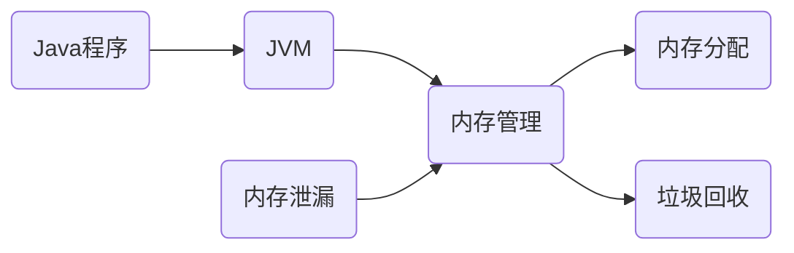
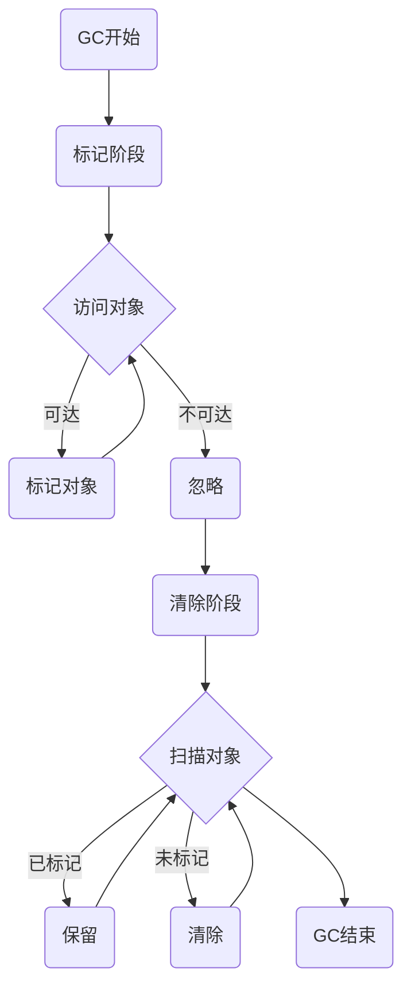
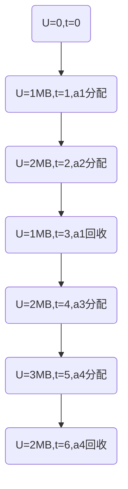
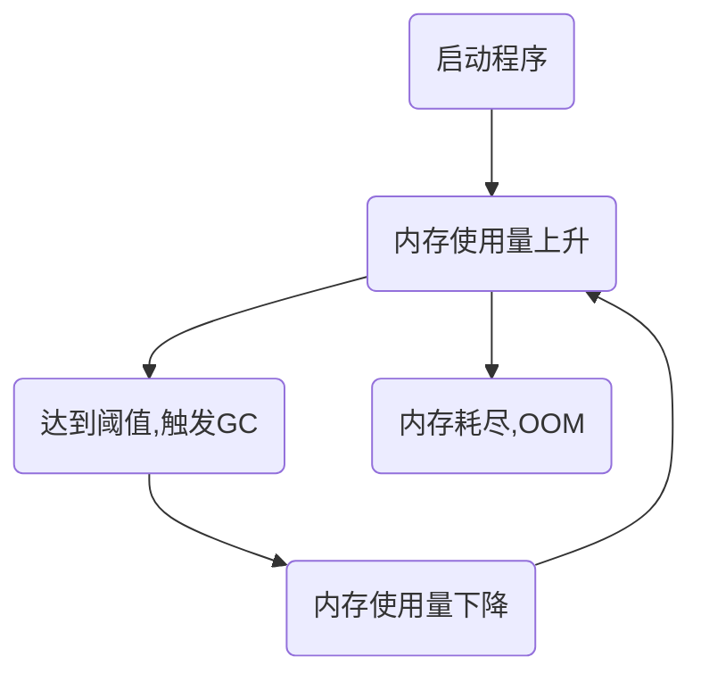

# Java内存管理原理与实践

作者：禅与计算机程序设计艺术 / Zen and the Art of Computer Programming 

关键词：Java, JVM, 内存管理, 垃圾回收, 性能优化

## 1. 背景介绍

### 1.1  问题的由来
Java作为当今最流行的编程语言之一,其内存管理机制一直是开发者关注的重点。高效合理的内存管理是保证Java程序性能的关键。然而,很多开发者对JVM的内存管理原理缺乏深入的理解,导致程序存在内存泄漏、GC停顿等问题,影响了系统的稳定性和性能。

### 1.2  研究现状
目前业界对Java内存管理的研究主要集中在以下几个方面:

1. 垃圾回收算法:标记-清除、复制、标记-整理等经典GC算法,以及G1、ZGC等新型垃圾回收器的原理与实现。

2. 内存分配策略:线程本地分配TLAB、栈上分配、直接内存等不同的内存分配方式。

3. JVM参数调优:根据实际应用场景,调整各个内存区域的大小、GC策略等参数以优化性能。

4. 内存泄漏排查:利用各种工具如JProfiler、MAT等分析内存快照,定位导致OOM的原因。

### 1.3  研究意义
深入理解Java内存管理原理,对于编写高质量、高性能的Java程序至关重要。一方面,开发者可以根据理论指导实践,编写出内存使用更高效、GC友好的代码;另一方面,当出现内存问题时,开发者能够利用相关工具快速定位问题根源,并给出优化方案。这对于提升系统的稳定性和性能都有极大的帮助。

### 1.4  本文结构
本文将全面深入地探讨Java内存管理的原理与实践,内容涵盖:

- JVM内存结构与内存分配策略
- 经典垃圾回收算法原理与实现  
- 常见垃圾回收器原理与比较
- 内存泄漏原因分析与排查实践
- JVM参数调优与最佳实践

通过理论结合实践的方式,帮助读者全面掌握Java内存管理的知识,提升开发与调优能力。

## 2. 核心概念与联系

在深入探讨Java内存管理之前,我们先来了解几个核心概念:

- JVM:Java Virtual Machine,Java虚拟机,Java程序的运行环境。
- 内存管理:JVM管理Java程序占用内存的机制,包括内存分配和垃圾回收。
- 垃圾回收:GC, Garbage Collection,JVM自动回收不再使用的内存的机制。
- 内存泄漏:程序中不再使用的对象无法被GC回收,长期占用内存,最终导致OOM。

下图展示了这些概念之间的关系:



可见,内存管理是JVM的核心功能之一,包括内存分配和垃圾回收两大部分。高效合理的内存管理可以提升Java程序的性能,避免内存泄漏,是Java开发者必须掌握的重要知识。

## 3. 核心算法原理 & 具体操作步骤

### 3.1  算法原理概述
垃圾回收是Java内存管理的核心,其基本原理是:自动识别并回收不再使用的内存。常见的GC算法有:

- 引用计数法:为每个对象维护一个引用计数器,当计数为0时回收对象。
- 可达性分析法:从GC Roots出发,遍历对象引用图,不可达的对象即为垃圾。

主流JVM采用可达性分析算法判断对象是否存活。在此基础上,经典的垃圾回收算法有:

- 标记-清除:标记存活对象,清除未标记的垃圾对象。
- 复制:将内存空间分为两个区域,每次只使用一个,存活对象复制到另一个区域。
- 标记-整理:标记存活对象,并将其移动到内存的一端,清除边界外的垃圾。

### 3.2  算法步骤详解
下面我们以标记-清除算法为例,详细讲解GC的步骤:

1. 标记阶段:从GC Roots出发,遍历对象引用图,标记所有可达对象。
2. 清除阶段:遍历堆,清除未被标记的对象,回收其内存空间。

可视化流程如下:



### 3.3  算法优缺点
标记-清除算法的优点是实现简单,不需要移动对象。但也存在一些缺点:

1. 标记和清除两个过程效率较低。
2. 容易产生内存碎片,降低内存利用率。

复制算法通过将内存分为两半,解决了碎片化问题,但需要浪费一半空间,适用于存活对象较少的场景。

标记-整理结合了两者的优点,既避免了碎片化,又不需要浪费太多空间,是目前主流JVM采用的方式。

### 3.4  算法应用领域
除了Java,其他高级语言如C#、Python、JavaScript等的垃圾回收器同样使用了这些经典算法。操作系统也会用类似的算法管理进程的内存分配与回收。

## 4. 数学模型和公式 & 详细讲解 & 举例说明

### 4.1  数学模型构建
为了定量分析内存管理的效率,我们可以构建数学模型。假设:

- $S$: 内存总大小
- $s_i$: 对象$i$的大小  
- $a_i$: 对象$i$的分配时间
- $f_i$: 对象$i$的回收时间
- $U(t)$: $t$时刻内存的使用量
- $A(t)$: $t$时刻内存的分配速率
- $F(t)$: $t$时刻内存的回收速率

根据内存使用量守恒,我们有:

$$U(t) = \int_{0}^{t} A(x)dx - \int_{0}^{t} F(x)dx$$

### 4.2  公式推导过程
假设在时刻$t$,有$n$个对象存活,则此时内存使用量为所有存活对象的大小之和:

$$U(t) = \sum_{i=1}^{n} s_i \cdot I(a_i \leq t < f_i)$$

其中$I$为示性函数:

$$I(a_i \leq t < f_i) = \begin{cases} 
1, & a_i \leq t < f_i \\
0, & otherwise
\end{cases}$$

对时间$t$求导,得到内存使用速率:

$$\frac{dU}{dt} = A(t) - F(t) = \sum_{i=1}^{n} s_i \cdot (\delta(t-a_i) - \delta(t-f_i))$$

其中$\delta$为狄拉克函数。这说明,内存使用速率为对象的分配速率与回收速率之差。

### 4.3  案例分析与讲解
我们以一个简单的Java程序为例,分析其内存使用情况:

```java
public static void main(String[] args) {
    int size = 1024 * 1024;
    byte[] a1 = new byte[size];
    byte[] a2 = new byte[size];
    a1 = null;
    byte[] a3 = new byte[size];
    byte[] a4 = new byte[size];
    a3 = a4;
}
```

这个程序依次分配了4个1MB的字节数组,其中a1被显式置为null,a3和a4指向同一个数组。根据我们的模型,内存使用量变化如下:



可以看出,由于a1被显式置为null,其内存得到及时回收;而a3和a4指向同一数组,避免了内存重复分配。这体现了GC的即时性和避免浪费的原则。

### 4.4  常见问题解答
Q: 对象在什么时候会被回收?
A: 当对象不再被引用,即成为不可达对象时,GC会在某个时刻回收其占用的内存。具体回收时间取决于GC算法和JVM实现。

Q: 如何避免内存泄漏?
A: 内存泄漏主要由于无用对象引用未被释放导致。因此,避免内存泄漏的关键是要及时将不再使用的对象置为null,尤其是生命周期长的对象如全局变量、静态变量等。

Q: 如何降低GC频率和停顿时间?
A: 选择合适的GC算法如G1、ZGC等,避免创建大量短生命周期的对象,合理设置内存区域大小,都可以降低GC频率和停顿时间。

## 5. 项目实践：代码实例和详细解释说明

### 5.1  开发环境搭建
我们以JDK 8为例,介绍如何搭建Java开发环境:

1. 下载JDK 8安装包,注意选择与操作系统匹配的版本。
2. 运行安装程序,按提示完成安装。
3. 配置环境变量JAVA_HOME和PATH,使Java命令全局可用。
4. 在命令行输入`java -version`,出现版本信息即安装成功。

### 5.2  源代码详细实现
下面我们编写一个简单的Java程序,演示内存泄漏的场景:

```java
public class MemoryLeak {
    private static List<Object> list = new ArrayList<>();

    public static void main(String[] args) {
        while (true) {
            list.add(new Object());
        }
    }
}
```

这个程序不断往一个静态List中添加新对象,而这些对象永远不会被使用,也不会被释放,从而导致内存泄漏。

我们可以通过JVisualVM等工具监控内存使用情况:



### 5.3  代码解读与分析
之所以会发生内存泄漏,是因为:

1. list是静态变量,其生命周期贯穿整个程序。
2. list中的对象永远不会被使用,但由于被list引用,无法被GC回收。
3. 随着时间推移,list中的对象越来越多,最终耗尽内存。

要修复这个问题,可以考虑:

1. 如果list不是必须为静态变量,可以将其改为局部变量。
2. 定期清理list,移除不再使用的对象。
3. 使用WeakReference等特殊引用类型,使对象在不被使用时能被GC回收。

例如,我们可以每次往list添加1000个对象后,就清理一次:

```java
public class MemoryLeakFixed {
    private static List<Object> list = new ArrayList<>();
    private static final int BATCH_SIZE = 1000;

    public static void main(String[] args) {
        int count = 0;
        while (true) {
            list.add(new Object());
            count++;
            if (count % BATCH_SIZE == 0) {
                list.clear();
            }
        }
    }
}
```

这样,内存使用量就会维持在一个稳定的水平,不会无限增长。

### 5.4  运行结果展示
我们分别运行MemoryLeak和MemoryLeakFixed,观察内存使用情况。

MemoryLeak会在几秒钟内耗尽内存,抛出OOM错误:

```
Exception in thread "main" java.lang.OutOfMemoryError: Java heap space
    at java.util.Arrays.copyOf(Arrays.java:3210)
    at java.util.Arrays.copyOf(Arrays.java:3181)
    at java.util.ArrayList.grow(ArrayList.java:265)
    at java.util.