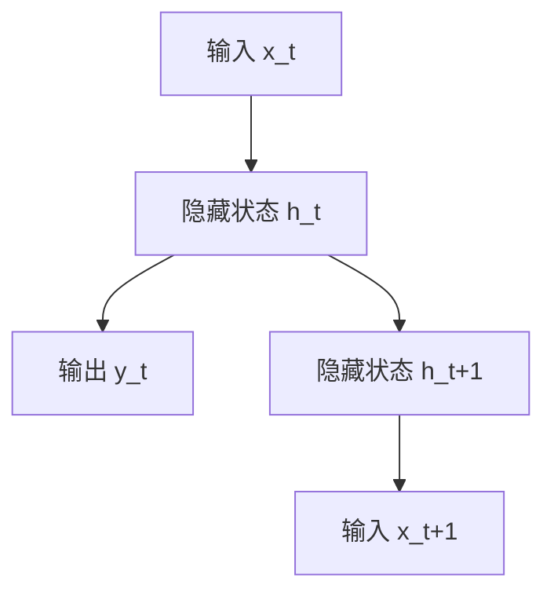
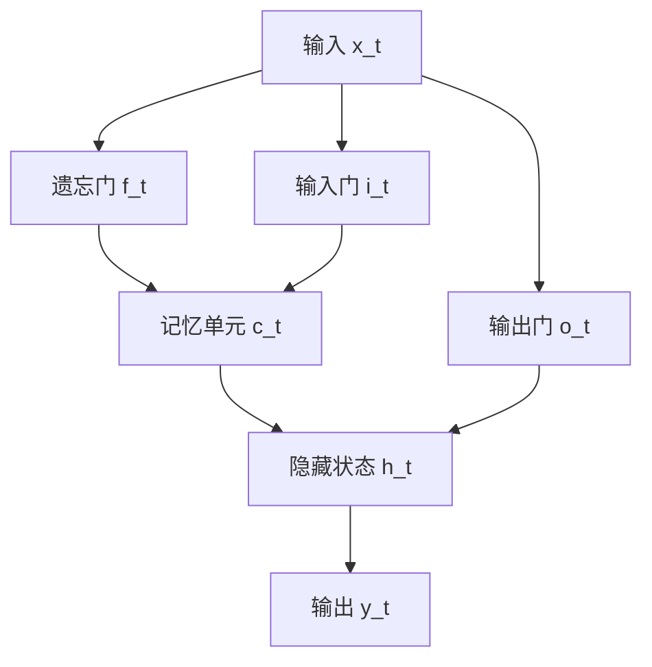
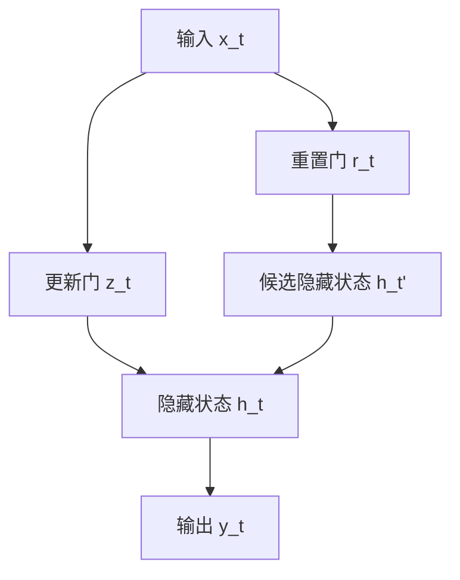

# LSTM与GRU:处理序列数据的神经网络

作者：禅与计算机程序设计艺术 / Zen and the Art of Computer Programming

## 1. 背景介绍

### 1.1 问题的由来

在处理序列数据时，传统的神经网络架构如多层感知器（MLP）和卷积神经网络（CNN）往往难以捕捉数据中的时间依赖性。序列数据广泛存在于自然语言处理、时间序列预测、语音识别等领域，这些数据的特征在于其时间顺序和上下文依赖性。为了解决这一问题，循环神经网络（RNN）应运而生。然而，标准的RNN在处理长序列时存在梯度消失和梯度爆炸问题，导致其在捕捉长时间依赖性方面表现不佳。

### 1.2 研究现状

为了解决RNN的局限性，研究人员提出了多种改进模型，其中最具代表性的是长短期记忆网络（LSTM）和门控循环单元（GRU）。LSTM通过引入记忆单元和门控机制，有效地缓解了梯度消失问题。GRU则是LSTM的简化版本，具有更少的参数，但在许多任务中表现同样出色。

### 1.3 研究意义

LSTM和GRU的提出极大地推动了序列数据处理技术的发展，使得神经网络在自然语言处理、时间序列预测、语音识别等领域取得了显著的进展。深入理解LSTM和GRU的原理和应用，对于从事人工智能和深度学习研究的人员具有重要意义。

### 1.4 本文结构

本文将详细介绍LSTM和GRU的核心概念、算法原理、数学模型、代码实现及其在实际应用中的表现。具体结构如下：

1. 背景介绍
2. 核心概念与联系
3. 核心算法原理 & 具体操作步骤
4. 数学模型和公式 & 详细讲解 & 举例说明
5. 项目实践：代码实例和详细解释说明
6. 实际应用场景
7. 工具和资源推荐
8. 总结：未来发展趋势与挑战
9. 附录：常见问题与解答

## 2. 核心概念与联系

在深入探讨LSTM和GRU之前，我们需要了解一些基本概念和它们之间的联系。

### 2.1 循环神经网络（RNN）

循环神经网络（RNN）是一类用于处理序列数据的神经网络。RNN通过在时间步之间共享参数，能够捕捉序列数据中的时间依赖性。其基本结构如下：



### 2.2 长短期记忆网络（LSTM）

长短期记忆网络（LSTM）是RNN的一种变体，通过引入记忆单元和门控机制，有效地缓解了梯度消失问题。LSTM的基本结构如下：



### 2.3 门控循环单元（GRU）

门控循环单元（GRU）是LSTM的简化版本，具有更少的参数。GRU的基本结构如下：



### 2.4 LSTM与GRU的联系

LSTM和GRU都是为了解决RNN在处理长序列时的梯度消失问题而提出的。它们都通过引入门控机制来控制信息的流动，从而更好地捕捉长时间依赖性。LSTM的结构相对复杂，包含三个门（遗忘门、输入门和输出门）和一个记忆单元；而GRU的结构较为简化，仅包含两个门（重置门和更新门）。

## 3. 核心算法原理 & 具体操作步骤

### 3.1 算法原理概述

#### 3.1.1 LSTM的算法原理

LSTM通过引入记忆单元和三个门（遗忘门、输入门和输出门），控制信息在时间步之间的流动。具体来说，遗忘门决定了前一时间步的记忆单元信息有多少被保留，输入门决定了当前时间步的输入信息有多少被写入记忆单元，输出门决定了记忆单元的信息有多少被输出。

#### 3.1.2 GRU的算法原理

GRU通过引入重置门和更新门，简化了LSTM的结构。重置门控制前一时间步的隐藏状态信息有多少被重置，更新门控制当前时间步的输入信息有多少被写入隐藏状态。

### 3.2 算法步骤详解

#### 3.2.1 LSTM的算法步骤

1. 计算遗忘门 $f_t$：
   $$
   f_t = \sigma(W_f \cdot [h_{t-1}, x_t] + b_f)
   $$

2. 计算输入门 $i_t$ 和候选记忆单元 $\tilde{c}_t$：
   $$
   i_t = \sigma(W_i \cdot [h_{t-1}, x_t] + b_i)
   $$
   $$
   \tilde{c}_t = \tanh(W_c \cdot [h_{t-1}, x_t] + b_c)
   $$

3. 更新记忆单元 $c_t$：
   $$
   c_t = f_t \cdot c_{t-1} + i_t \cdot \tilde{c}_t
   $$

4. 计算输出门 $o_t$：
   $$
   o_t = \sigma(W_o \cdot [h_{t-1}, x_t] + b_o)
   $$

5. 更新隐藏状态 $h_t$：
   $$
   h_t = o_t \cdot \tanh(c_t)
   $$

#### 3.2.2 GRU的算法步骤

1. 计算重置门 $r_t$：
   $$
   r_t = \sigma(W_r \cdot [h_{t-1}, x_t] + b_r)
   $$

2. 计算更新门 $z_t$：
   $$
   z_t = \sigma(W_z \cdot [h_{t-1}, x_t] + b_z)
   $$

3. 计算候选隐藏状态 $\tilde{h}_t$：
   $$
   \tilde{h}_t = \tanh(W_h \cdot [r_t \cdot h_{t-1}, x_t] + b_h)
   $$

4. 更新隐藏状态 $h_t$：
   $$
   h_t = (1 - z_t) \cdot h_{t-1} + z_t \cdot \tilde{h}_t
   $$

### 3.3 算法优缺点

#### 3.3.1 LSTM的优缺点

优点：
- 能够捕捉长时间依赖性
- 通过门控机制有效缓解梯度消失问题

缺点：
- 结构复杂，计算量大
- 参数较多，训练时间长

#### 3.3.2 GRU的优缺点

优点：
- 结构相对简化，计算量较小
- 参数较少，训练时间短

缺点：
- 在某些任务中性能可能不如LSTM

### 3.4 算法应用领域

LSTM和GRU广泛应用于以下领域：
- 自然语言处理（NLP）：如机器翻译、文本生成、情感分析等
- 时间序列预测：如股票价格预测、气象预测等
- 语音识别：如语音转文字、语音合成等
- 视频分析：如视频分类、动作识别等

## 4. 数学模型和公式 & 详细讲解 & 举例说明

### 4.1 数学模型构建

LSTM和GRU的数学模型基于RNN的基本结构，通过引入门控机制来控制信息的流动。具体来说，LSTM通过遗忘门、输入门和输出门来控制记忆单元的信息流动；GRU通过重置门和更新门来控制隐藏状态的信息流动。

### 4.2 公式推导过程

#### 4.2.1 LSTM的公式推导

1. 遗忘门 $f_t$：
   $$
   f_t = \sigma(W_f \cdot [h_{t-1}, x_t] + b_f)
   $$

2. 输入门 $i_t$ 和候选记忆单元 $\tilde{c}_t$：
   $$
   i_t = \sigma(W_i \cdot [h_{t-1}, x_t] + b_i)
   $$
   $$
   \tilde{c}_t = \tanh(W_c \cdot [h_{t-1}, x_t] + b_c)
   $$

3. 更新记忆单元 $c_t$：
   $$
   c_t = f_t \cdot c_{t-1} + i_t \cdot \tilde{c}_t
   $$

4. 输出门 $o_t$：
   $$
   o_t = \sigma(W_o \cdot [h_{t-1}, x_t] + b_o)
   $$

5. 更新隐藏状态 $h_t$：
   $$
   h_t = o_t \cdot \tanh(c_t)
   $$

#### 4.2.2 GRU的公式推导

1. 重置门 $r_t$：
   $$
   r_t = \sigma(W_r \cdot [h_{t-1}, x_t] + b_r)
   $$

2. 更新门 $z_t$：
   $$
   z_t = \sigma(W_z \cdot [h_{t-1}, x_t] + b_z)
   $$

3. 候选隐藏状态 $\tilde{h}_t$：
   $$
   \tilde{h}_t = \tanh(W_h \cdot [r_t \cdot h_{t-1}, x_t] + b_h)
   $$

4. 更新隐藏状态 $h_t$：
   $$
   h_t = (1 - z_t) \cdot h_{t-1} + z_t \cdot \tilde{h}_t
   $$

### 4.3 案例分析与讲解

#### 4.3.1 LSTM案例分析

假设我们有一个简单的序列数据任务：预测下一个时间步的值。我们使用LSTM来解决这个问题。

1. 输入序列 $x = [x_1, x_2, ..., x_T]$
2. 初始化隐藏状态 $h_0$ 和记忆单元 $c_0$
3. 对于每个时间步 $t$，计算遗忘门、输入门、候选记忆单元、记忆单元、输出门和隐藏状态
4. 最终输出预测值 $y_T$

#### 4.3.2 GRU案例分析

同样的任务，我们使用GRU来解决。

1. 输入序列 $x = [x_1, x_2, ..., x_T]$
2. 初始化隐藏状态 $h_0$
3. 对于每个时间步 $t$，计算重置门、更新门、候选隐藏状态和隐藏状态
4. 最终输出预测值 $y_T$

### 4.4 常见问题解答

#### 4.4.1 为什么LSTM和GRU能够缓解梯度消失问题？

LSTM和GRU通过引入门控机制，控制信息在时间步之间的流动，从而有效地缓解了梯度消失问题。具体来说，LSTM的遗忘门和输入门控制了记忆单元的信息流动，使得重要的信息能够在长时间内保留；GRU的重置门和更新门控制了隐藏状态的信息流动，起到了类似的作用。

#### 4.4.2 LSTM和GRU的选择标准是什么？

在选择LSTM和GRU时，可以根据具体任务的需求来决定。如果任务需要捕捉长时间依赖性且对计算资源要求不高，可以选择LSTM；如果任务对计算资源要求较高且对长时间依赖性要求不高，可以选择GRU。

## 5. 项目实践：代码实例和详细解释说明

### 5.1 开发环境搭建

在进行LSTM和GRU的项目实践之前，我们需要搭建开发环境。本文以Python和TensorFlow为例，介绍如何搭建开发环境。

1. 安装Python：
   ```bash
   sudo apt-get install python3
   ```

2. 安装TensorFlow：
   ```bash
   pip install tensorflow
   ```

3. 安装其他依赖库：
   ```bash
   pip install numpy pandas matplotlib
   ```

### 5.2 源代码详细实现

#### 5.2.1 LSTM的代码实现

以下是一个使用LSTM进行时间序列预测的示例代码：

```python
import numpy as np
import tensorflow as tf
from tensorflow.keras.models import Sequential
from tensorflow.keras.layers import LSTM, Dense

# 生成示例数据
def generate_data(seq_length, num_samples):
    X = np.random.rand(num_samples, seq_length, 1)
    y = np.sum(X, axis=1)
    return X, y

# 数据准备
seq_length = 10
num_samples = 1000
X, y = generate_data(seq_length, num_samples)

# 构建LSTM模型
model = Sequential()
model.add(LSTM(50, input_shape=(seq_length, 1)))
model.add(Dense(1))
model.compile(optimizer='adam', loss='mse')

# 训练模型
model.fit(X, y, epochs=20, batch_size=32)

# 预测
predictions = model.predict(X)
```

#### 5.2.2 GRU的代码实现

以下是一个使用GRU进行时间序列预测的示例代码：

```python
import numpy as np
import tensorflow as tf
from tensorflow.keras.models import Sequential
from tensorflow.keras.layers import GRU, Dense

# 生成示例数据
def generate_data(seq_length, num_samples):
    X = np.random.rand(num_samples, seq_length, 1)
    y = np.sum(X, axis=1)
    return X, y

# 数据准备
seq_length = 10
num_samples = 1000
X, y = generate_data(seq_length, num_samples)

# 构建GRU模型
model = Sequential()
model.add(GRU(50, input_shape=(seq_length, 1)))
model.add(Dense(1))
model.compile(optimizer='adam', loss='mse')

# 训练模型
model.fit(X, y, epochs=20, batch_size=32)

# 预测
predictions = model.predict(X)
```

### 5.3 代码解读与分析

#### 5.3.1 LSTM代码解读

1. 生成示例数据：生成长度为10的序列数据，每个序列包含10个随机数，目标值为序列的和。
2. 构建LSTM模型：使用Keras构建一个包含一个LSTM层和一个全连接层的模型。
3. 训练模型：使用Adam优化器和均方误差损失函数训练模型。
4. 预测：使用训练好的模型进行预测。

#### 5.3.2 GRU代码解读

1. 生成示例数据：生成长度为10的序列数据，每个序列包含10个随机数，目标值为序列的和。
2. 构建GRU模型：使用Keras构建一个包含一个GRU层和一个全连接层的模型。
3. 训练模型：使用Adam优化器和均方误差损失函数训练模型。
4. 预测：使用训练好的模型进行预测。

### 5.4 运行结果展示

#### 5.4.1 LSTM运行结果

训练完成后，使用LSTM模型进行预测，输出预测值和真实值的对比图：

```python
import matplotlib.pyplot as plt

plt.plot(y, label='True Values')
plt.plot(predictions, label='Predictions')
plt.legend()
plt.show()
```

#### 5.4.2 GRU运行结果

训练完成后，使用GRU模型进行预测，输出预测值和真实值的对比图：

```python
import matplotlib.pyplot as plt

plt.plot(y, label='True Values')
plt.plot(predictions, label='Predictions')
plt.legend()
plt.show()
```

## 6. 实际应用场景

### 6.1 自然语言处理

LSTM和GRU在自然语言处理（NLP）领域有广泛的应用，如机器翻译、文本生成、情感分析等。通过捕捉文本中的时间依赖性，LSTM和GRU能够生成更自然、更连贯的文本。

### 6.2 时间序列预测

LSTM和GRU在时间序列预测领域表现出色，如股票价格预测、气象预测等。通过捕捉时间序列中的长时间依赖性，LSTM和GRU能够提供更准确的预测结果。

### 6