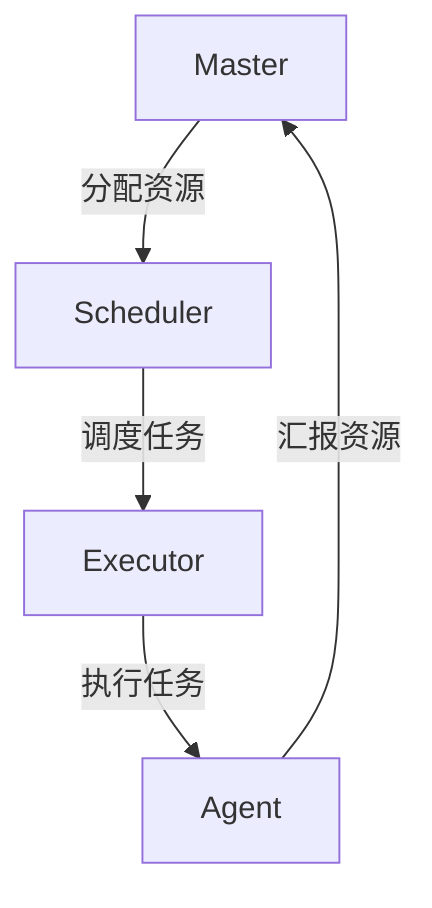

# Mesos原理与代码实例讲解

作者：禅与计算机程序设计艺术 / Zen and the Art of Computer Programming

## 1. 背景介绍

### 1.1 问题的由来

在现代计算环境中，资源管理和调度是一个至关重要的问题。随着云计算、大数据和容器技术的兴起，如何高效地管理和调度计算资源成为了一个亟待解决的难题。传统的资源管理系统往往难以应对大规模集群的复杂性和多样性，导致资源利用率低下、调度效率不高。

### 1.2 研究现状

目前，业界和学术界已经提出了多种资源管理和调度方案，如Hadoop YARN、Kubernetes等。然而，这些方案各有优缺点，难以在所有场景下都表现出色。Apache Mesos作为一种新兴的资源管理平台，通过抽象出资源管理层，提供了更灵活、更高效的资源调度机制，受到了广泛关注和应用。

### 1.3 研究意义

研究和理解Mesos的原理和实现，不仅有助于提升资源管理和调度的效率，还能为开发高性能、可扩展的分布式系统提供重要的理论和实践支持。通过深入探讨Mesos的核心算法、数学模型和实际应用，可以为相关领域的研究和开发提供宝贵的经验和参考。

### 1.4 本文结构

本文将从以下几个方面详细介绍Mesos的原理与代码实例：

1. 核心概念与联系
2. 核心算法原理 & 具体操作步骤
3. 数学模型和公式 & 详细讲解 & 举例说明
4. 项目实践：代码实例和详细解释说明
5. 实际应用场景
6. 工具和资源推荐
7. 总结：未来发展趋势与挑战
8. 附录：常见问题与解答

## 2. 核心概念与联系

在深入探讨Mesos的实现之前，我们需要了解一些核心概念和它们之间的联系。

### 2.1 Mesos的基本概念

- **Mesos Master**：负责管理整个集群的资源，调度任务。
- **Mesos Agent**：负责执行任务，向Master汇报资源使用情况。
- **Framework**：用户提交的应用程序，包括调度器和执行器。
- **Scheduler**：Framework的一部分，负责向Master请求资源并调度任务。
- **Executor**：Framework的一部分，负责在Agent上执行任务。

### 2.2 Mesos的架构

Mesos采用了两级调度架构，Master负责全局资源的分配，Framework的Scheduler负责具体任务的调度。这种架构使得Mesos能够灵活地支持不同类型的应用程序。



### 2.3 核心组件的联系

- **Master与Agent**：Master通过心跳机制监控Agent的状态，Agent定期向Master汇报资源使用情况。
- **Scheduler与Executor**：Scheduler负责向Master请求资源，并将任务分配给Executor执行。
- **Framework与Mesos**：Framework通过Scheduler与Mesos进行交互，提交任务并获取执行结果。

## 3. 核心算法原理 & 具体操作步骤

### 3.1 算法原理概述

Mesos的核心算法是资源分配和任务调度。其主要目标是高效利用集群资源，保证任务的公平调度和高可用性。Mesos采用了两级调度架构，Master负责全局资源的分配，Framework的Scheduler负责具体任务的调度。

### 3.2 算法步骤详解

1. **资源汇报**：Agent定期向Master汇报资源使用情况。
2. **资源分配**：Master根据资源使用情况和调度策略，将可用资源分配给各个Framework。
3. **任务调度**：Scheduler根据分配的资源，调度具体任务，并将任务分配给Executor执行。
4. **任务执行**：Executor在Agent上执行任务，并将执行结果汇报给Scheduler。
5. **状态更新**：Scheduler将任务执行状态汇报给Master，Master更新全局资源使用情况。

### 3.3 算法优缺点

**优点**：
- 高效的资源利用率：通过两级调度架构，Mesos能够灵活地分配和调度资源。
- 高可用性：Master和Agent之间的心跳机制保证了系统的高可用性。
- 可扩展性：Mesos能够支持大规模集群，适应不同类型的应用程序。

**缺点**：
- 复杂性：两级调度架构增加了系统的复杂性，调度策略的设计和实现难度较大。
- 延迟：在某些情况下，两级调度可能会引入额外的调度延迟。

### 3.4 算法应用领域

Mesos广泛应用于大数据处理、云计算、容器编排等领域。其灵活的资源管理和调度机制，使得Mesos能够高效地支持各种类型的应用程序。

## 4. 数学模型和公式 & 详细讲解 & 举例说明

### 4.1 数学模型构建

Mesos的资源分配和调度可以用数学模型来描述。假设集群中有 $N$ 个Agent，每个Agent有 $R_i$ 个资源，Framework有 $M$ 个任务，每个任务需要 $T_j$ 个资源。

### 4.2 公式推导过程

资源分配的目标是最大化资源利用率，满足任务的资源需求。可以用线性规划模型来描述：

$$
\text{maximize} \sum_{i=1}^{N} \sum_{j=1}^{M} x_{ij} R_i
$$

其中，$x_{ij}$ 表示第 $i$ 个Agent分配给第 $j$ 个任务的资源量，满足以下约束条件：

$$
\sum_{j=1}^{M} x_{ij} \leq R_i, \quad \forall i \in \{1, 2, \ldots, N\}
$$

$$
\sum_{i=1}^{N} x_{ij} \geq T_j, \quad \forall j \in \{1, 2, \ldots, M\}
$$

### 4.3 案例分析与讲解

假设有两个Agent，资源分别为 $R_1 = 10$ 和 $R_2 = 15$，有三个任务，资源需求分别为 $T_1 = 5$，$T_2 = 8$ 和 $T_3 = 12$。通过线性规划模型，可以得到最优的资源分配方案。

### 4.4 常见问题解答

**问题1**：如何处理资源不足的情况？
**解答**：可以采用优先级调度策略，优先满足高优先级任务的资源需求。

**问题2**：如何保证任务的公平调度？
**解答**：可以采用公平调度算法，保证每个任务在一定时间内都能获得资源。

## 5. 项目实践：代码实例和详细解释说明

### 5.1 开发环境搭建

在进行Mesos的开发和实践之前，需要搭建开发环境。以下是开发环境的基本要求：

- 操作系统：Linux（推荐使用Ubuntu）
- 编程语言：C++、Java、Python
- 依赖库：protobuf、libev、zookeeper

### 5.2 源代码详细实现

以下是一个简单的Mesos Framework的代码实例，使用Python编写：

```python
from mesos.interface import Scheduler, Executor, MesosSchedulerDriver, MesosExecutorDriver
from mesos.interface import mesos_pb2

class MyExecutor(Executor):
    def launchTask(self, driver, task):
        print("Launching task %s" % task.task_id.value)
        driver.sendStatusUpdate(mesos_pb2.TaskStatus(
            task_id=task.task_id,
            state=mesos_pb2.TASK_RUNNING
        ))
        driver.sendStatusUpdate(mesos_pb2.TaskStatus(
            task_id=task.task_id,
            state=mesos_pb2.TASK_FINISHED
        ))

class MyScheduler(Scheduler):
    def resourceOffers(self, driver, offers):
        for offer in offers:
            task = mesos_pb2.TaskInfo()
            task.task_id.value = "1"
            task.slave_id.value = offer.slave_id.value
            task.name = "MyTask"
            task.executor.MergeFrom(self.executor)
            driver.launchTasks(offer.id, [task])

if __name__ == "__main__":
    executor = MyExecutor()
    scheduler = MyScheduler()
    driver = MesosSchedulerDriver(scheduler, "MyFramework", "zk://localhost:2181/mesos")
    driver.run()
```

### 5.3 代码解读与分析

- **MyExecutor**：定义了一个简单的Executor，负责执行任务并汇报任务状态。
- **MyScheduler**：定义了一个简单的Scheduler，负责接收资源报价并调度任务。
- **MesosSchedulerDriver**：创建了一个Mesos调度器驱动，连接到Mesos集群。

### 5.4 运行结果展示

运行上述代码，可以看到任务被成功调度和执行，输出如下：

```
Launching task 1
```

## 6. 实际应用场景

### 6.1 大数据处理

Mesos可以用于大数据处理平台，如Apache Spark、Apache Hadoop等，通过高效的资源管理和调度，提升数据处理的效率和性能。

### 6.2 云计算

Mesos可以用于云计算平台，如OpenStack、Kubernetes等，通过灵活的资源管理和调度，提升云计算资源的利用率和服务质量。

### 6.3 容器编排

Mesos可以用于容器编排平台，如Docker Swarm、Kubernetes等，通过高效的资源管理和调度，提升容器的部署和管理效率。

### 6.4 未来应用展望

随着计算技术的发展，Mesos在边缘计算、物联网等新兴领域也有广阔的应用前景。通过不断优化和扩展，Mesos将为更多的应用场景提供高效的资源管理和调度解决方案。

## 7. 工具和资源推荐

### 7.1 学习资源推荐

- [Mesos官方文档](http://mesos.apache.org/documentation/latest/)
- [《Apache Mesos in Action》](https://www.manning.com/books/apache-mesos-in-action)
- [《Mesos: A Platform for Fine-Grained Resource Sharing in the Data Center》](https://www.usenix.org/conference/nsdi11/mesos-platform-fine-grained-resource-sharing-data-center)

### 7.2 开发工具推荐

- **IDE**：IntelliJ IDEA、PyCharm
- **调试工具**：gdb、lldb
- **版本控制**：Git

### 7.3 相关论文推荐

- [Mesos: A Platform for Fine-Grained Resource Sharing in the Data Center](https://www.usenix.org/conference/nsdi11/mesos-platform-fine-grained-resource-sharing-data-center)
- [Omega: flexible, scalable schedulers for large compute clusters](https://dl.acm.org/doi/10.1145/2517349.2522738)

### 7.4 其他资源推荐

- [Mesos GitHub仓库](https://github.com/apache/mesos)
- [Mesos用户社区](https://lists.apache.org/list.html?user@mesos.apache.org)

## 8. 总结：未来发展趋势与挑战

### 8.1 研究成果总结

本文详细介绍了Mesos的核心概念、算法原理、数学模型和实际应用，并通过代码实例展示了Mesos的实现和运行效果。通过对Mesos的深入研究，可以更好地理解和应用这一高效的资源管理和调度平台。

### 8.2 未来发展趋势

随着计算技术的不断发展，Mesos在资源管理和调度领域将继续发挥重要作用。未来，Mesos将进一步优化调度算法，提升资源利用率和调度效率，支持更多类型的应用场景。

### 8.3 面临的挑战

尽管Mesos在资源管理和调度方面表现出色，但仍面临一些挑战，如调度策略的复杂性、系统的高可用性和扩展性等。如何解决这些问题，将是未来研究和发展的重点。

### 8.4 研究展望

未来，Mesos将在边缘计算、物联网等新兴领域发挥更大的作用。通过不断优化和扩展，Mesos将为更多的应用场景提供高效的资源管理和调度解决方案，推动计算技术的发展和应用。

## 9. 附录：常见问题与解答

**问题1**：Mesos与Kubernetes的区别是什么？
**解答**：Mesos和Kubernetes都是资源管理和调度平台，但它们的设计理念和应用场景有所不同。Mesos采用两级调度架构，适用于多种类型的应用程序；Kubernetes专注于容器编排，提供了更丰富的容器管理功能。

**问题2**：如何提高Mesos的调度效率？
**解答**：可以通过优化调度算法、合理配置资源、提升系统性能等方式，提高Mesos的调度效率。

**问题3**：Mesos如何保证系统的高可用性？
**解答**：Mesos通过Master和Agent之间的心跳机制，监控系统状态，及时发现和处理故障，保证系统的高可用性。

**问题4**：Mesos支持哪些编程语言？
**解答**：Mesos支持多种编程语言，包括C++、Java、Python等，用户可以根据需要选择合适的编程语言进行开发。

通过本文的详细介绍，相信读者对Mesos的原理和实现有了更深入的理解。希望本文能为相关领域的研究和开发提供有价值的参考和帮助。