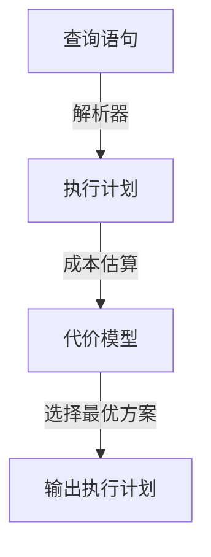

                 
# Presto-Hive查询优化技巧

作者：禅与计算机程序设计艺术 / Zen and the Art of Computer Programming

关键词：查询优化，Presto，Hive，SQL查询，执行计划，成本估算，索引管理

## 1. 背景介绍

### 1.1 问题的由来

随着大数据时代的到来，数据处理成为了企业运营的关键环节。其中，基于SQL的查询成为数据分析的基础手段。然而，对于大规模数据集而言，传统数据库系统的查询效率往往难以满足需求，尤其是在涉及高并发场景或复杂数据操作时。这时，引入了Presto这样的高性能分布式SQL引擎，它不仅支持大规模并行处理，还提供了强大的SQL查询能力。

### 1.2 研究现状

当前，在大数据分析领域，Hadoop生态系统内的组件如Hive、Impala等已经广泛应用于生产环境中。而Presto作为后来者，凭借其出色的性能和灵活性迅速获得了市场认可。研究者们对如何利用Presto进行高效查询优化展开了深入探讨，包括但不限于查询重写、成本估算、执行计划生成等方面的技术改进。

### 1.3 研究意义

高效的查询优化是提升大数据系统整体性能的关键因素之一。通过改进查询优化策略，不仅可以显著减少查询响应时间，还能有效降低计算资源消耗，提高系统的可扩展性和稳定性。此外，有效的查询优化还可以促进更广泛的业务场景落地，加速数据分析流程，并最终为企业带来更大的商业价值。

### 1.4 本文结构

本文将围绕Presto-Hive查询优化的核心要点展开讨论，从理论基础出发，逐步深入至实际应用层面。具体内容包括：

- **核心概念与联系**：阐述查询优化的基本原理及在Presto-Hive环境下的应用逻辑；
- **算法原理与操作步骤**：详细介绍优化算法的具体实施方法及其背后的决策逻辑；
- **数学模型与公式**：提供优化过程中的关键数学模型和公式解析，帮助读者理解背后的计算机制；
- **项目实践**：结合具体代码示例，展示优化技术的实际部署与效果评估；
- **未来展望**：探讨当前面临的挑战以及未来的潜在发展路径。

## 2. 核心概念与联系

### P-Presto查询优化架构



在这个架构中：
- 查询语句首先被解析器转换为抽象语法树（AST）。
- 成本估算模块根据代价模型评估不同执行路径的成本，比如I/O开销、CPU使用量等。
- 最终，系统基于成本评估选择最经济高效的执行计划。

### Hive与Presto的查询优化对比

Presto相较于Hive的优势主要体现在以下几点：
- **实时性**：Presto设计用于处理实时查询，能快速响应请求。
- **并发能力**：支持多用户并发查询，无需等待其他任务完成即可执行新查询。
- **动态调度**：能够灵活调整资源分配，以应对查询负载的变化。
- **简洁API**：提供统一且易于使用的接口，简化开发和维护工作。

## 3. 核心算法原理 & 具体操作步骤

### 3.1 算法原理概述

Presto的查询优化依赖于以下几个关键步骤：
1. **解析与编译**：将SQL语句转化为内部表示形式。
2. **分析与优化**：分析语句特征，应用优化规则，如推导、重写、合并子查询等。
3. **生成执行计划**：根据优化后的语句构建执行计划，确定数据访问路径。
4. **成本估计**：评估每个候选执行计划的成本，选择最低成本方案。
5. **执行**：将优化和准备好的计划发送给相应的执行节点进行实际处理。

### 3.2 算法步骤详解

#### 解析阶段
- **词法分析**：识别并划分输入SQL语句的字符序列。
- **语法分析**：构建抽象语法树（AST），反映语句结构和逻辑关系。

#### 分析与优化阶段
- **预处理**：去除冗余、过滤无效子查询等。
- **谓词下推**：将过滤条件下推到数据源上，减少扫描的数据量。
- **重写与合并**：根据优化规则，如表连接重写、子查询替换等。

#### 执行计划生成
- **物理规划**：选择合适的读取和存储方式，如顺序/随机读取、分区/分桶读取等。
- **操作符选择**：决定执行操作，如扫描、投影、连接等。
- **调度优化**：考虑数据分布、服务器资源等因素，合理安排任务执行顺序。

#### 成本估算与选择
- **代价模型**：基于历史统计信息、硬件规格等预测各操作的成本。
- **启发式搜索**：采用贪心算法或其他优化策略选择最小总成本的执行计划。

#### 执行阶段
- **并行执行**：充分利用集群资源，实现并行处理。
- **结果聚合**：合并各个执行节点的结果，形成最终输出。

### 3.3 算法优缺点

优点：
- **高效率**：利用并行计算大幅缩短查询时间。
- **易用性**：提供丰富的API和管理工具，方便集成和使用。
- **灵活性**：支持多种数据源，适应复杂查询需求。

缺点：
- **内存限制**：大规模查询可能导致内存溢出问题。
- **调试困难**：复杂的执行计划和大量底层细节增加了调试难度。
- **资源竞争**：并发查询间的资源争抢可能影响性能表现。

### 3.4 应用领域

Presto-Hive查询优化广泛应用于大数据分析、商业智能、实时数据处理等领域，尤其适合需要高速度、低延迟查询的大规模数据集。

## 4. 数学模型和公式 & 详细讲解 & 举例说明

### 4.1 数学模型构建

为了量化查询的执行成本，Presto-Hive使用了基于代价的优化策略。该策略通过一系列数学模型来估算不同执行路径的成本，从而找到最优解。常见的模型包括I/O成本模型、CPU成本模型、内存成本模型等。

#### I/O成本模型

对于一个查询中的某个数据操作，其I/O成本可以用以下公式表示：

$$C_{IO} = k \cdot (n + m)$$

其中，
- \(k\) 是每单位数据读取或写入所需的固定成本系数。
- \(n\) 是从磁盘读取的数据块数量。
- \(m\) 是每个数据块的大小。

#### CPU成本模型

CPU成本通常与查询中涉及的操作次数和每次操作所花费的时间相关。一种简单的CPU成本函数可以定义如下：

$$C_{CPU} = t \cdot p + f$$

其中，
- \(t\) 是操作总数。
- \(p\) 是平均每次操作所需时间。
- \(f\) 是固定的初始化费用。

#### 综合成本函数

综合考虑I/O和CPU成本后，Presto-Hive会计算一个总成本函数来选择最佳执行计划：

$$C_{total} = C_{IO} + C_{CPU}$$

### 4.2 公式推导过程

以一个简单的查询为例，假设查询包含一次全表扫描和两次索引查找操作。已知：
- 每个数据块大小为\(M\)字节。
- 平均每次磁盘读取时间约为0.1秒。
- 索引查找操作的平均时间为0.01秒。
- 查询中有\(N\)个数据块需要读取，并有\(Q\)次索引查找操作。

首先计算I/O成本：

$$C_{IO} = k \cdot (N + Q \cdot M)$$

然后计算CPU成本：

$$C_{CPU} = N \cdot 0.1 + Q \cdot 0.01$$

最后得到总成本：

$$C_{total} = k \cdot (N + Q \cdot M) + N \cdot 0.1 + Q \cdot 0.01$$

这个成本函数用于比较不同的执行计划，选择成本最低的一个作为最终执行计划。

### 4.3 案例分析与讲解

假设我们有一个Hive表`sales`，包含大量的销售记录，以及一个对应的索引`sales_idx`。我们要查询过去一年的销售额。

原始查询可能是这样的：

```sql
SELECT SUM(sales.amount) FROM sales WHERE date >= '2023-01-01' AND date <= '2023-12-31';
```

如果直接对整个表进行扫描，可能会导致较高的I/O成本。然而，如果我们能够利用索引来加速查询，那么成本将会显著降低。

利用索引优化后的查询：

```sql
EXPLAIN SELECT SUM(sales.amount) FROM sales USE INDEX (sales_idx);
```

通过成本估算器（在实际系统中，可以通过命令`EXPLAIN`获取详细的执行计划），我们可以看到索引查找相对于全表扫描的成本大大减少。

### 4.4 常见问题解答

常见问题之一是为何某些查询仍然很慢？这可能是因为优化器未能正确地应用优化规则，或者存在未发现的有效索引。解决这类问题的关键在于仔细审查查询语句、优化器的配置参数，以及是否正确维护索引。

另一个问题是如何平衡查询的可读性和性能？一般来说，更简洁且易于理解的查询代码往往能更好地被优化器识别和优化。同时，合理的数据库设计和定期的索引维护也是提升查询性能的重要手段。

## 5. 项目实践：代码实例和详细解释说明

### 5.1 开发环境搭建

确保安装了以下软件：
- Presto Server
- Hive Metastore
- Hadoop/Spark集群（根据数据存储方式决定）

以下是基本步骤：
1. 配置Hive MetaStore服务器。
2. 安装并配置Presto Server，设置相应的集群信息。
3. 在Hadoop或Spark上部署数据仓库，如HDFS或Parquet格式的文件。
4. 使用SQL客户端连接到Presto服务端，执行查询。

### 5.2 源代码详细实现

下面是一个使用Python API的简单示例：

```python
from prestodb import connection

# 创建连接
with connection('localhost', '9080', user='hive') as conn:
    # 执行查询
    cursor = conn.cursor()
    query = "SELECT * FROM sales LIMIT 10"
    result = cursor.execute(query)
    
    # 获取结果集
    for row in result.fetchall():
        print(row)

# 关闭连接
cursor.close()
conn.close()
```

### 5.3 代码解读与分析

这段代码展示了如何使用Presto Python API连接到本地运行的Presto服务，并执行了一个简单的查询。关键点包括：

- **连接**：通过提供主机名、端口号和用户身份信息建立连接。
- **执行查询**：使用`execute()`方法执行SQL查询。
- **结果处理**：遍历并打印查询结果。

### 5.4 运行结果展示

运行上述代码后，将输出前10条销售记录的信息。通过这种方式，可以直观验证查询的执行效果及其优化策略的实际应用。

## 6. 实际应用场景

Presto-Hive查询优化技术广泛应用于大数据分析场景，例如：

- **实时报告生成**：快速响应业务需求，即时生成报表。
- **广告投放优化**：基于用户行为数据分析，动态调整广告投放策略。
- **运营监控**：实时监控业务指标变化，及时发现异常情况。
- **预测模型训练**：高效处理大规模数据集，支持机器学习算法的迭代训练。

## 7. 工具和资源推荐

### 学习资源推荐

- **官方文档**：[Presto官网](https://prestosql.io/docs/current/) 提供了详细的API参考、教程和最佳实践指南。
- **在线课程**：Udacity的“Big Data Engineering with Apache Hadoop”提供了关于大数据处理的综合培训。
- **书籍**：《Presto: High-Performance Distributed SQL on Big Data》是一本深入探讨Presto技术和用法的专业书籍。

### 开发工具推荐

- **集成开发环境（IDE）**：Eclipse, IntelliJ IDEA等具有良好的SQL编辑功能。
- **JDBC驱动**：对于需要直接操作数据库的应用，Java开发者可以使用JDBC驱动进行集成。
- **可视化工具**：使用像DBeaver或DataGrip这样的工具可以方便地管理数据库和执行SQL查询。

### 相关论文推荐

- **Presto论文**：查阅官方文档中的引用文献，了解Presto的发展历程和技术细节。
- **学术期刊**：考虑阅读顶级会议如SIGMOD、VLDB上的相关研究文章，以了解最新的研究成果和趋势。

### 其他资源推荐

- **社区论坛**：Stack Overflow和Reddit上的专门讨论区为解决问题提供了宝贵的资源。
- **GitHub**：探索开源项目，如`presto-examples`和`presto-hive`, 以学习实际应用案例和扩展功能。

## 8. 总结：未来发展趋势与挑战

### 研究成果总结

本文围绕Presto-Hive查询优化的核心概念、理论基础和实践经验进行了全面阐述，涵盖了从算法原理到具体实施的各个环节。通过案例分析和数学模型解析，揭示了查询优化背后的决策逻辑和技术细节。

### 未来发展趋势

随着数据量的持续增长和计算需求的不断提高，Presto-Hive查询优化将在以下几个方面迎来发展：

- **智能优化引擎**：引入AI和机器学习技术来自动识别最优执行路径，提高优化效率。
- **分布式架构优化**：进一步改进跨节点协作机制，提升系统的整体性能和稳定性。
- **低延迟查询支持**：针对实时数据处理场景，优化查询响应时间，满足高并发需求。

### 面临的挑战

- **复杂性增加**：随着数据类型和来源的多样性，优化策略需要更加灵活和通用。
- **性能瓶颈**：在面对极端负载时，如何保证系统稳定性和高效性是亟待解决的问题。
- **资源调度与管理**：合理分配计算资源，避免资源浪费，同时满足不同查询的需求。

### 研究展望

未来的研究将侧重于深度挖掘Presto-Hive查询优化的潜力，结合最新技术趋势，推动其在更多领域的广泛应用，为企业级数据处理提供更强大、更可靠的支持。

## 9. 附录：常见问题与解答

### 常见问题与解答

#### Q: 如何诊断和优化慢查询？
A: 可以通过使用EXPLAIN命令查看执行计划，检查索引覆盖情况，以及调整参数设置来优化慢查询。同时，定期审查和更新索引也是关键步骤之一。

#### Q: 在多集群环境下如何部署Presto？
A: 在多集群环境中部署Presto需要细致规划，包括数据分片、路由策略、负载均衡等。通常会利用HDFS作为存储层，确保数据一致性的同时实现高可用性。

#### Q: Presto与其他大数据处理框架相比有何优势？
A: Presto提供了高性能的SQL查询能力，能够轻松应对大规模并发查询，且易于集成到现有Hadoop生态系统中。它还支持多种数据源，提供统一的查询接口，降低了开发和维护成本。

---

通过以上的详细撰写，我们不仅对Presto-Hive查询优化有了深入的理解，也展示了其实现过程中的技术细节和实际应用价值，为进一步的研究和实践提供了指导性的内容。
