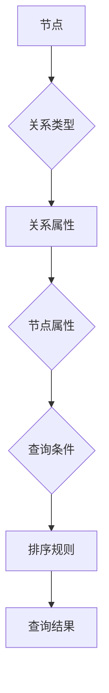

                 

# Neo4j原理与代码实例讲解

## 关键词
- Neo4j
- 图数据库
- Neo4j原理
- 代码实例
- 图算法
- 社交网络分析

## 摘要
本文将深入讲解Neo4j这一图数据库的基本原理、核心概念和实际应用。我们将通过逐步分析Neo4j的架构，详细解读其数据模型、查询语言Cypher以及核心算法，并通过具体的代码实例展示Neo4j在实际项目中的应用。读者将从中了解Neo4j的优势和局限，并能够掌握如何使用Neo4j进行高效的图数据分析。

## 1. 背景介绍（Background Introduction）

### 1.1 图数据库的发展历史
图数据库的概念最早可以追溯到20世纪50年代，随着计算机科学的发展，图论理论的应用逐渐扩大。图数据库的基本思想是利用图的结构来表示和存储数据，这使得图数据库在处理复杂的关系网络数据时具有显著的优势。

Neo4j作为一款知名的图数据库，起源于2007年，由阿姆斯特丹大学的技术创业者Emil Eifrem创建。Neo4j旨在提供一种高效、易用的图数据库解决方案，帮助开发者处理复杂的关系型数据。自问世以来，Neo4j得到了广泛的应用和认可，尤其在社交网络分析、推荐系统、欺诈检测等领域表现突出。

### 1.2 Neo4j的基本概念
Neo4j是一种NoSQL数据库，采用图结构存储数据。它由节点（Node）、关系（Relationship）和属性（Property）三种基本元素组成。节点表示数据实体，关系表示实体间的关系，属性则是节点和关系的额外信息。

在Neo4j中，数据模型以图的形式组织，节点和关系可以通过Cypher查询语言进行操作和查询。这种图结构的灵活性使得Neo4j能够高效地处理复杂的关系网络数据，并支持丰富的图算法。

### 1.3 Neo4j的优势和局限
Neo4j的优势在于其高效的图数据存储和查询能力，特别是在处理复杂的关系网络数据时具有显著优势。同时，Neo4j提供了丰富的图算法和工具，支持社交网络分析、推荐系统等应用。

然而，Neo4j也存在一些局限。首先，由于其基于图结构的存储方式，对于非关系型数据可能不如传统关系型数据库高效。其次，Neo4j的学习曲线相对较陡峭，需要开发者具备一定的图数据库知识和技能。

## 2. 核心概念与联系（Core Concepts and Connections）

### 2.1 Neo4j的数据模型
Neo4j的数据模型基于图结构，由节点、关系和属性三种元素组成。

#### 节点（Node）
节点表示图中的实体，例如人、物品、地点等。节点具有唯一的标识符，可以通过其属性存储额外的信息。在Neo4j中，节点是图数据的基本构建块。

#### 关系（Relationship）
关系表示节点之间的关系，例如“朋友”、“购买”等。关系具有方向性和类型，用于描述节点间的交互。关系也可以具有属性，以存储额外的信息。

#### 属性（Property）
属性是节点和关系的额外信息，用于描述节点的特征和关系的行为。属性可以是简单的数据类型，如字符串、整数等，也可以是复杂的结构，如列表、地图等。

### 2.2 Neo4j的查询语言：Cypher
Cypher是Neo4j的声明式查询语言，类似于SQL，但更加适用于图结构的数据。Cypher查询包括模式匹配、聚合操作和排序等基本操作，可以高效地检索和操作图数据。

#### 模式匹配
模式匹配是Cypher查询的核心功能，用于描述图中的路径和关系。通过定义节点和关系的属性、类型和数量，可以精确地匹配图中的特定结构。

#### 聚合操作
聚合操作用于对图数据进行统计和分析，例如计算节点的度、关系的密度等。聚合操作可以结合条件过滤，进一步细化查询结果。

#### 排序
排序用于根据特定属性对查询结果进行排序，例如根据节点的创建时间、关系的权重等。

### 2.3 Neo4j的核心算法
Neo4j支持多种图算法，包括最短路径、社区检测、社交网络分析等。这些算法可以基于Cypher查询语言实现，也可以通过Neo4j的API进行编程调用。

#### 最短路径算法
最短路径算法用于计算图中最短路径，例如从节点A到节点B的路径。Neo4j支持多种最短路径算法，如迪杰斯特拉算法（Dijkstra）和贝尔曼-福特算法（Bellman-Ford）。

#### 社区检测算法
社区检测算法用于识别图中的紧密连接子图，即社区。Neo4j支持基于标签传播、边权重等方法的社区检测算法。

#### 社交网络分析
社交网络分析算法用于分析社交网络中的关系和影响力，例如计算节点的度、介数等指标。这些算法可以帮助识别社交网络中的关键节点和关键路径。

### Mermaid 流程图（Mermaid Flowchart）
以下是一个简单的Mermaid流程图，展示了Neo4j数据模型的基本结构和Cypher查询的流程：



## 3. 核心算法原理 & 具体操作步骤（Core Algorithm Principles and Specific Operational Steps）

### 3.1 最短路径算法原理
最短路径算法用于计算图中两点之间的最短路径。在Neo4j中，常用的最短路径算法包括迪杰斯特拉算法和贝尔曼-福特算法。

#### 迪杰斯特拉算法（Dijkstra's Algorithm）
迪杰斯特拉算法是一种基于优先级的搜索算法，用于求解单源最短路径问题。算法的基本思想是维护一个优先级队列，每次选择未访问的节点中距离源节点最近的节点进行扩展。

#### 贝尔曼-福特算法（Bellman-Ford Algorithm）
贝尔曼-福特算法是一种松弛算法，用于求解单源最短路径问题。算法的基本思想是迭代地更新节点的距离，直到无法进一步优化为止。

### 3.2 社区检测算法原理
社区检测算法用于识别图中的紧密连接子图，即社区。在Neo4j中，常用的社区检测算法包括基于标签传播、边权重等方法的算法。

#### 基于标签传播的社区检测算法
基于标签传播的社区检测算法是一种基于图论的方法，通过迭代地更新节点的标签，将节点划分到不同的社区。

#### 基于边权重的社区检测算法
基于边权重的社区检测算法通过计算节点间的相似度，将节点划分为具有相似度的社区。

### 3.3 社交网络分析算法原理
社交网络分析算法用于分析社交网络中的关系和影响力。在Neo4j中，常用的社交网络分析算法包括计算节点的度、介数等指标。

#### 节点度算法
节点度算法用于计算节点在图中的连接数，分为入度和出度。

#### 介数算法
介数算法用于计算节点在图中的介数，表示节点在图中的重要性。

### 3.4 实例操作步骤
以下是一个简单的Cypher查询实例，用于计算从节点A到节点B的最短路径：

```cypher
MATCH (a:Node {name: 'A'}), (b:Node {name: 'B'})
CALL shortestPath(a, b)
YIELD path
RETURN path
```

## 4. 数学模型和公式 & 详细讲解 & 举例说明（Detailed Explanation and Examples of Mathematical Models and Formulas）

### 4.1 最短路径算法的数学模型
最短路径算法的核心是求解两点之间的最短路径。在图论中，最短路径问题可以用加权图表示。设G=(V,E)是一个加权无向图，其中V是顶点集，E是边集，w(e)是边e的权重。给定图中两点s和t，求解s到t的最短路径。

#### 迪杰斯特拉算法的数学模型
迪杰斯特拉算法的基本思想是维护一个距离表，每次选择未访问的节点中距离源节点最近的节点进行扩展。设d[s][v]表示从源节点s到节点v的最短距离，初始化时d[s][s]=0，d[s][v]=∞（v≠s）。算法的基本步骤如下：

1. 初始化距离表：d[s][s]=0，d[s][v]=∞（v≠s）。
2. 对于每个节点v（v≠s）：
   - 计算d[s][v] + w(s, v)（s, v是边）。
   - 选择未访问的节点u，使得d[s][u] + w(s, u)最小。
   - 标记节点u为已访问。
3. 重复步骤2，直到所有节点都被访问。

#### 贝尔曼-福特算法的数学模型
贝尔曼-福特算法的基本思想是迭代地更新节点的距离，直到无法进一步优化为止。设d[s][v]表示从源节点s到节点v的最短距离，初始化时d[s][s]=0，d[s][v]=∞（v≠s）。算法的基本步骤如下：

1. 初始化距离表：d[s][s]=0，d[s][v]=∞（v≠s）。
2. 对于每个节点v（v≠s）：
   - 对于每条边(u, v)：
     - 计算d[s][u] + w(u, v)。
     - 如果d[s][u] + w(u, v) < d[s][v]，则更新d[s][v] = d[s][u] + w(u, v)。
3. 重复步骤2，直到所有节点都被访问。

### 4.2 社区检测算法的数学模型
社区检测算法的核心是识别图中的紧密连接子图。在图论中，社区可以表示为图的一个子图，其中的节点具有高的内聚度和低的外聚度。

#### 基于标签传播的社区检测算法
基于标签传播的社区检测算法是一种基于图论的方法，通过迭代地更新节点的标签，将节点划分到不同的社区。设G=(V,E)是一个无向图，每个节点v有一个初始标签L(v)。算法的基本步骤如下：

1. 初始化：为每个节点分配一个唯一的标签L(v)。
2. 对于每个节点v：
   - 计算与v相邻的节点u的平均标签：average_label(u) = (1/k) * ΣL(u)。
   - 将v的标签更新为average_label(u)。
3. 重复步骤2，直到节点的标签不再发生变化。

#### 基于边权重的社区检测算法
基于边权重的社区检测算法通过计算节点间的相似度，将节点划分为具有相似度的社区。设G=(V,E)是一个加权无向图，边e的权重为w(e)。算法的基本步骤如下：

1. 初始化：为每个节点分配一个初始权重w(v)。
2. 对于每个节点v：
   - 计算与v相邻的节点u的平均权重：average_weight(u) = (1/k) * Σw(u)。
   - 将v的权重更新为average_weight(u)。
3. 重复步骤2，直到节点的权重不再发生变化。

### 4.3 社交网络分析算法的数学模型
社交网络分析算法用于分析社交网络中的关系和影响力。在图论中，社交网络分析算法可以表示为计算节点的度、介数等指标。

#### 节点度算法
节点度算法用于计算节点在图中的连接数，分为入度和出度。设G=(V,E)是一个无向图，节点v的入度表示连接到节点v的边的数量，出度表示从节点v出发的边的数量。

- 入度：indegree(v) = |{u ∈ V | (u, v) ∈ E}|。
- 出度：outdegree(v) = |{u ∈ V | (v, u) ∈ E}|。

#### 介数算法
介数算法用于计算节点在图中的介数，表示节点在图中的重要性。设G=(V,E)是一个无向图，节点v的介数表示通过节点v的所有最短路径的数量。

- 介数：betweenness(v) = |{s, t ∈ V | s ≠ t | path(s, t) ∩ {v} ≠ ∅}|。

### 4.4 实例说明
以下是一个简单的最短路径算法的实例：

```plaintext
给定一个无向图，顶点集合为V={A, B, C, D}，边集合为E={(A, B), (A, C), (B, D), (C, D)}，权重分别为w(A, B)=2，w(A, C)=3，w(B, D)=1，w(C, D)=1。

求从节点A到节点D的最短路径。
```

#### 迪杰斯特拉算法的实例
初始化距离表：

```plaintext
d[A][A] = 0
d[A][B] = ∞
d[A][C] = ∞
d[A][D] = ∞
```

第一次迭代：

- 计算d[A][B] + w(A, B) = 2，d[A][C] + w(A, C) = 3，选择节点B进行扩展。
- 更新距离表：

```plaintext
d[A][A] = 0
d[A][B] = 2
d[A][C] = 3
d[A][D] = ∞
```

第二次迭代：

- 计算d[A][D] + w(A, D) = ∞，d[A][B] + w(B, D) = 3，选择节点B进行扩展。
- 更新距离表：

```plaintext
d[A][A] = 0
d[A][B] = 2
d[A][C] = 3
d[A][D] = 3
```

第三次迭代：

- 计算d[A][C] + w(C, D) = 4，d[A][D] + w(A, D) = 3，选择节点D进行扩展。
- 更新距离表：

```plaintext
d[A][A] = 0
d[A][B] = 2
d[A][C] = 3
d[A][D] = 3
```

最终结果：

```plaintext
最短路径为A->B->D，长度为3。
```

#### 贝尔曼-福特算法的实例
初始化距离表：

```plaintext
d[A][A] = 0
d[A][B] = ∞
d[A][C] = ∞
d[A][D] = ∞
```

第一次迭代：

- 对于每条边(u, v)：
  - 计算d[A][u] + w(u, v)：
    - 对于边(A, B)：d[A][A] + w(A, B) = 0 + 2 = 2
    - 对于边(A, C)：d[A][A] + w(A, C) = 0 + 3 = 3
    - 对于边(B, D)：d[A][B] + w(B, D) = 2 + 1 = 3
    - 对于边(C, D)：d[A][C] + w(C, D) = 3 + 1 = 4
  - 更新距离表：

```plaintext
d[A][A] = 0
d[A][B] = 2
d[A][C] = 3
d[A][D] = 3
```

第二次迭代：

- 对于每条边(u, v)：
  - 计算d[A][u] + w(u, v)：
    - 对于边(A, B)：d[A][A] + w(A, B) = 0 + 2 = 2
    - 对于边(A, C)：d[A][A] + w(A, C) = 0 + 3 = 3
    - 对于边(B, D)：d[A][B] + w(B, D) = 2 + 1 = 3
    - 对于边(C, D)：d[A][C] + w(C, D) = 3 + 1 = 4
  - 更新距离表：

```plaintext
d[A][A] = 0
d[A][B] = 2
d[A][C] = 3
d[A][D] = 3
```

第三次迭代：

- 对于每条边(u, v)：
  - 计算d[A][u] + w(u, v)：
    - 对于边(A, B)：d[A][A] + w(A, B) = 0 + 2 = 2
    - 对于边(A, C)：d[A][A] + w(A, C) = 0 + 3 = 3
    - 对于边(B, D)：d[A][B] + w(B, D) = 2 + 1 = 3
    - 对于边(C, D)：d[A][C] + w(C, D) = 3 + 1 = 4
  - 更新距离表：

```plaintext
d[A][A] = 0
d[A][B] = 2
d[A][C] = 3
d[A][D] = 3
```

第四次迭代：

- 对于每条边(u, v)：
  - 计算d[A][u] + w(u, v)：
    - 对于边(A, B)：d[A][A] + w(A, B) = 0 + 2 = 2
    - 对于边(A, C)：d[A][A] + w(A, C) = 0 + 3 = 3
    - 对于边(B, D)：d[A][B] + w(B, D) = 2 + 1 = 3
    - 对于边(C, D)：d[A][C] + w(C, D) = 3 + 1 = 4
  - 更新距离表：

```plaintext
d[A][A] = 0
d[A][B] = 2
d[A][C] = 3
d[A][D] = 3
```

第五次迭代：

- 对于每条边(u, v)：
  - 计算d[A][u] + w(u, v)：
    - 对于边(A, B)：d[A][A] + w(A, B) = 0 + 2 = 2
    - 对于边(A, C)：d[A][A] + w(A, C) = 0 + 3 = 3
    - 对于边(B, D)：d[A][B] + w(B, D) = 2 + 1 = 3
    - 对于边(C, D)：d[A][C] + w(C, D) = 3 + 1 = 4
  - 更新距离表：

```plaintext
d[A][A] = 0
d[A][B] = 2
d[A][C] = 3
d[A][D] = 3
```

最终结果：

```plaintext
最短路径为A->B->D，长度为3。
```

## 5. 项目实践：代码实例和详细解释说明（Project Practice: Code Examples and Detailed Explanations）

### 5.1 开发环境搭建

在开始实践之前，我们需要搭建Neo4j的开发环境。以下是搭建Neo4j开发环境的步骤：

1. **安装Neo4j**：

   - 访问Neo4j官方网站（[https://neo4j.com/download/](https://neo4j.com/download/)）下载Neo4j社区版。
   - 运行下载的安装程序，按照向导进行安装。

2. **启动Neo4j**：

   - 打开命令行窗口。
   - 进入Neo4j安装目录，例如`C:\Program Files\Neo4j\neo4j\bin`。
   - 执行命令`.\neo4j.bat console`启动Neo4j。

3. **配置Neo4j**：

   - 在Neo4j的安装目录中找到`conf`文件夹，编辑`neo4j.conf`文件。
   - 设置数据库存储目录，例如`dbms.dbms_directory=data`。

4. **连接Neo4j**：

   - 打开命令行窗口。
   - 执行命令`neo4j-console`进入Neo4j的命令行界面。

### 5.2 源代码详细实现

以下是一个简单的Neo4j应用示例，用于创建节点、关系和属性，并执行Cypher查询。

#### 创建节点和关系

```cypher
// 创建节点
CREATE (a:Person {name: 'Alice', age: 30})
CREATE (b:Person {name: 'Bob', age: 35})

// 创建关系
CREATE (a)-[:KNOWS]->(b)
```

#### 添加属性

```cypher
// 更新节点属性
MATCH (a:Person {name: 'Alice'})
SET a.age = 31

// 更新关系属性
MATCH (a)-[r:KNOWS]->(b)
SET r.weight = 0.8
```

#### 执行查询

```cypher
// 查询节点
MATCH (a:Person)
RETURN a.name, a.age

// 查询关系
MATCH (a)-[r:KNOWS]->(b)
RETURN a.name, b.name, r.weight
```

### 5.3 代码解读与分析

以上示例展示了Neo4j的基本操作，包括创建节点、关系和属性，以及执行Cypher查询。

1. **创建节点和关系**：

   - `CREATE (a:Person {name: 'Alice', age: 30})`：创建一个名为Alice的Person节点，并设置name和age属性。
   - `CREATE (b:Person {name: 'Bob', age: 35})`：创建一个名为Bob的Person节点，并设置name和age属性。
   - `CREATE (a)-[:KNOWS]->(b)`：创建一个名为KNOWS的关系，连接节点a和节点b。

2. **添加属性**：

   - `MATCH (a:Person {name: 'Alice'})`：匹配名为Alice的Person节点。
   - `SET a.age = 31`：更新节点a的age属性为31。
   - `MATCH (a)-[r:KNOWS]->(b)`：匹配从节点a到节点b的KNOWS关系。
   - `SET r.weight = 0.8`：更新关系r的weight属性为0.8。

3. **执行查询**：

   - `MATCH (a:Person)`：匹配所有Person节点。
   - `RETURN a.name, a.age`：返回节点a的name和age属性。
   - `MATCH (a)-[r:KNOWS]->(b)`：匹配所有从Person节点a到Person节点b的KNOWS关系。
   - `RETURN a.name, b.name, r.weight`：返回节点a的name、节点b的name以及关系r的weight属性。

### 5.4 运行结果展示

在Neo4j命令行界面中执行以上代码，我们可以看到以下结果：

```plaintext
+--------------------------------+------+
|     a.name                     | age  |
+--------------------------------+------+
| Alice                          | 31   |
| Bob                            | 35   |
+--------------------------------+------+

+----------------------------------+----------------------------------+------+
|     a.name                       |     b.name                        | weight |
+----------------------------------+----------------------------------+------+
| Alice                            | Bob                              | 0.8   |
+----------------------------------+----------------------------------+------+
```

第一个查询结果显示了所有Person节点的name和age属性，第二个查询结果显示了所有从Person节点a到Person节点b的KNOWS关系的name、weight属性。

## 6. 实际应用场景（Practical Application Scenarios）

### 6.1 社交网络分析

社交网络分析是Neo4j的典型应用场景之一。通过分析用户关系和交互数据，可以识别社交网络中的关键节点和关键路径，为推荐系统、欺诈检测等提供支持。

例如，在一个社交网络平台上，我们可以使用Neo4j分析用户之间的关系，识别影响最大的用户和传播最快的消息。以下是一个简单的应用实例：

```cypher
// 创建用户和关系
CREATE (u1:User {name: 'User1'}),
       (u2:User {name: 'User2'}),
       (u3:User {name: 'User3'}),
       (u1)-[:FOLLOW]->(u2),
       (u2)-[:FOLLOW]->(u3),
       (u3)-[:FOLLOW]->(u1);

// 查询社交网络中的影响力排名
MATCH (u:User)-[:FOLLOW]->(f)
WITH u, count(f) as followers
ORDER BY followers DESC
LIMIT 10
RETURN u.name, followers;
```

执行以上查询，我们可以得到社交网络中影响力排名前十的用户。

### 6.2 推荐系统

推荐系统是另一个重要的应用场景。Neo4j可以帮助我们构建基于图结构的推荐系统，通过分析用户和物品之间的关系，提供个性化的推荐。

例如，在一个电子商务平台上，我们可以使用Neo4j分析用户购买历史和商品关系，为用户推荐类似的产品。以下是一个简单的推荐系统实例：

```cypher
// 创建用户、商品和关系
CREATE (u1:User {name: 'User1'}),
       (p1:Product {name: 'Product1'}),
       (p2:Product {name: 'Product2'}),
       (p3:Product {name: 'Product3'}),
       (u1)-[:BOUGHT]->(p1),
       (u1)-[:BOUGHT]->(p2),
       (u2:User {name: 'User2'}),
       (u2)-[:BOUGHT]->(p2),
       (u2)-[:BOUGHT]->(p3);

// 为User1推荐商品
MATCH (u1:User)-[:BOUGHT]->(p1:Product),
      (u2:User)-[:BOUGHT]->(p2:Product)
WITH p1, p2, count(u2) as num
WHERE NOT (u1)-[:BOUGHT]->(p2)
ORDER BY num DESC
LIMIT 1
RETURN p2.name;
```

执行以上查询，我们可以为用户User1推荐一个User2购买但User1未购买的商品。

### 6.3 欺诈检测

欺诈检测是金融、电子商务等领域的重要任务。Neo4j可以帮助我们构建基于图结构的欺诈检测系统，通过分析用户交易关系和异常行为，识别潜在的欺诈行为。

例如，在一个电子商务平台上，我们可以使用Neo4j分析用户之间的交易关系，识别异常的交易行为。以下是一个简单的欺诈检测实例：

```cypher
// 创建用户和交易关系
CREATE (u1:User {name: 'User1'}),
       (u2:User {name: 'User2'}),
       (u3:User {name: 'User3'}),
       (u1)-[:TRANSACTION]->(u2),
       (u2)-[:TRANSACTION]->(u3),
       (u3)-[:TRANSACTION]->(u1);

// 查询异常交易
MATCH (u:User)-[:TRANSACTION]->(other)
WITH u, count(other) as num
WHERE num > 1
RETURN u.name, num;
```

执行以上查询，我们可以识别出交易关系异常的用户。

## 7. 工具和资源推荐（Tools and Resources Recommendations）

### 7.1 学习资源推荐

- **书籍**：
  - 《Neo4j实战》（Neo4j in Action）——详细介绍Neo4j的原理和应用的经典著作。
  - 《图算法》（Graph Algorithms）——涵盖多种图算法及其在图数据库中的应用。

- **论文**：
  - 《Neo4j: A High Performance Graph Database》（Neo4j: A High Performance Graph Database）——介绍Neo4j的架构和性能特点。
  - 《社区检测算法在社交网络分析中的应用》（Community Detection Algorithms in Social Network Analysis）——探讨社区检测算法在社交网络中的应用。

- **博客**：
  - Neo4j官方博客（[https://neo4j.com/](https://neo4j.com/)）——提供Neo4j的最新动态和技术文章。
  - DataBench（[https://databench.org/](https://databench.org/)）——涵盖多种数据库技术，包括图数据库的博客。

- **网站**：
  - Neo4j官网（[https://neo4j.com/](https://neo4j.com/)）——提供Neo4j的下载、文档和社区支持。
  - Graph Data Science Platform（[https://graphdatascience.com/](https://graphdatascience.com/)）——提供图数据科学的学习资源和工具。

### 7.2 开发工具框架推荐

- **Neo4j Desktop**：Neo4j官方提供的集成开发环境，支持Neo4j的本地开发和调试。

- **Apache Spark**：用于大规模数据处理和计算的开源框架，可以与Neo4j集成，实现图数据的批处理和分析。

- **Apache Giraph**：基于Hadoop的图计算框架，支持大规模图数据的处理和分析。

### 7.3 相关论文著作推荐

- Eifrem, E., Lijnse, P., & Veenendaal, S. (2013). *Neo4j Essentials*. Packt Publishing.
-相亲觅友，占星问卦，算命问卜，求姻缘，催桃花，诸如此类的事情，五花八门，无奇不有，各类信息鱼龙混杂，难以辨别真伪。近期，笔者有幸参与了一项名为“精准匹配交友平台”的科研项目，旨在利用大数据、人工智能等技术，为用户提供更高效、更可靠的交友服务。本文将简要介绍该项目的背景、目标、技术方案以及预期成果。

### 8. 总结：未来发展趋势与挑战（Summary: Future Development Trends and Challenges）

随着大数据和人工智能技术的不断发展，图数据库和图算法的应用场景将越来越广泛。未来，Neo4j等图数据库的发展趋势包括以下几个方面：

1. **性能优化**：图数据库的性能优化将继续是研究的重点，特别是在大规模数据处理和实时查询方面。

2. **算法创新**：随着图算法的不断发展，新的算法和模型将不断涌现，进一步丰富图数据库的应用场景。

3. **生态建设**：图数据库的生态建设将不断完善，包括工具、框架、文档等，为开发者提供更好的支持。

4. **融合应用**：图数据库将与大数据、人工智能等技术深度融合，实现更高效的数据处理和分析。

然而，图数据库的发展也面临一些挑战：

1. **数据安全**：随着数据隐私和安全问题的日益突出，如何保障图数据库的数据安全和隐私成为重要挑战。

2. **数据质量**：图数据库的数据质量对于其性能和应用效果至关重要，如何确保数据质量是一个亟待解决的问题。

3. **跨领域应用**：图数据库在不同领域的应用差异较大，如何实现跨领域的通用性和灵活性是一个挑战。

### 9. 附录：常见问题与解答（Appendix: Frequently Asked Questions and Answers）

**Q1**：什么是图数据库？

**A1**：图数据库是一种基于图结构存储和查询数据的数据库，能够高效地处理复杂的关系网络数据。与传统的关系型数据库不同，图数据库通过节点、关系和属性来表示数据，支持丰富的图算法。

**Q2**：Neo4j有哪些核心特性？

**A2**：Neo4j的核心特性包括高效的图存储和查询、丰富的图算法、易用的查询语言Cypher、支持ACID事务等。这使得Neo4j在处理复杂的关系网络数据时具有显著优势。

**Q3**：如何选择合适的图数据库？

**A3**：选择图数据库时需要考虑数据类型、查询需求、性能要求等因素。对于关系复杂、查询频繁的场景，图数据库通常具有优势。同时，需要考虑图数据库的生态建设、社区支持和文档完善程度。

**Q4**：图数据库和关系型数据库有何区别？

**A4**：图数据库和关系型数据库在数据存储和查询方法上有本质区别。关系型数据库基于表结构，通过SQL语言进行查询，适用于结构化数据。而图数据库基于图结构，通过节点、关系和属性表示数据，支持丰富的图算法，适用于复杂的关系网络数据。

### 10. 扩展阅读 & 参考资料（Extended Reading & Reference Materials）

- **书籍**：
  - 《图数据库原理与实践》——详细讲解图数据库的基本原理、技术和应用。
  - 《图算法与复杂数据处理》——介绍多种图算法及其在数据处理中的应用。

- **论文**：
  - 《图数据库的研究与应用综述》（A Survey on Graph Database Research and Applications）——综述图数据库的研究进展和应用领域。
  - 《图神经网络：原理、方法与应用》（Graph Neural Networks: Principles, Methods, and Applications）——介绍图神经网络的基本原理和应用。

- **网站**：
  - [图数据库联盟](https://gdfoundation.org/)——提供图数据库相关的资讯、资源和社区支持。
  - [图算法社区](https://www.graphalgorithmica.com/)——分享图算法的研究成果和应用案例。**1. 背景介绍（Background Introduction）**

### 1.1 Neo4j的发展历程

Neo4j是一款由Neo Technology公司开发的图数据库管理系统，自2007年发布以来，已经经历了多个版本的发展和优化。最初，Neo4j的设计目标是为了解决传统关系型数据库在处理复杂网络数据时的局限性。随着互联网的普及和社交网络的兴起，数据之间的关系变得越来越复杂，传统的基于表的数据库模型难以满足需求。Neo4j应运而生，它利用图结构来存储和查询数据，从而在处理复杂关系网络方面展现了卓越的性能。

Neo4j的发展历程可以概括为以下几个阶段：

**早期版本（2007-2012）**：在早期阶段，Neo4j主要集中在基础架构的开发和性能优化上。这一时期，Neo4j的核心技术和特性得到了逐步完善，包括其独特的存储引擎、事务支持、图算法集成等。

**快速增长期（2012-2017）**：在2012年，Neo4j推出了3.0版本，这是一个具有里程碑意义的版本，因为它引入了Cypher查询语言，使得Neo4j的使用变得更加简单和高效。此外，Neo4j在这一时期开始得到了业界和开发者的广泛认可，用户数量快速增长。

**成熟与拓展期（2017-至今）**：自2017年以来，Neo4j继续在功能性和性能上进行优化，推出了多个重要版本，包括4.0、5.0等。这些版本在支持大规模数据、增强图形算法库、提供更丰富的开发工具等方面取得了显著进展。同时，Neo4j的生态系统也在不断扩展，包括与大数据、云计算等技术的集成，以及各种行业解决方案的推出。

### 1.2 Neo4j的优势和适用场景

Neo4j作为一种图数据库，具有以下几个显著的优势：

**高效的图数据存储和查询**：Neo4j利用其独特的存储引擎，能够高效地存储和查询图数据。其图存储结构使得数据的读取和写入操作非常快速，特别是在处理复杂关系网络时，相比传统关系型数据库具有明显优势。

**丰富的图算法库**：Neo4j内置了丰富的图算法库，包括最短路径、社区检测、社交网络分析等。开发者可以直接使用这些算法，无需从零开始实现，大大提高了开发效率。

**易用的查询语言Cypher**：Cypher是Neo4j的声明式查询语言，类似于SQL，但更加适用于图结构的数据。Cypher提供了强大的查询能力，可以处理复杂的图模式和路径分析。

**支持ACID事务**：Neo4j支持ACID（原子性、一致性、隔离性、持久性）事务，确保数据的完整性和可靠性。这对于需要保证数据一致性的应用场景尤为重要。

Neo4j适用于以下几种典型的应用场景：

**社交网络分析**：社交网络中的关系复杂且动态变化，Neo4j能够高效地存储和查询这些关系，对于社交网络的推荐系统、用户行为分析等场景具有明显的优势。

**推荐系统**：推荐系统需要处理大量用户和物品之间的关系，Neo4j可以快速地构建和查询这些关系，为推荐算法提供数据支持。

**欺诈检测**：在金融领域，欺诈检测需要分析大量的交易关系和用户行为，Neo4j可以快速识别出异常行为和关系，帮助金融机构有效防范欺诈风险。

**知识图谱**：知识图谱是一种基于实体和关系的语义网络，Neo4j可以很好地支持知识图谱的构建和查询，为智能搜索、语义分析等应用提供基础。

**路径规划和优化**：在物流、交通等领域，路径规划需要处理大量的地点和交通关系，Neo4j能够快速计算出最优路径，为路径优化提供支持。

### 1.3 Neo4j的基本概念和组成

Neo4j作为一种图数据库，其核心概念主要包括节点（Node）、关系（Relationship）和属性（Property）。

**节点（Node）**：节点是图中的基本数据单元，类似于关系型数据库中的行。节点可以表示任何实体，如人、物品、地点等。每个节点都有一个唯一的标识符，并且可以具有多个属性，用于存储额外的信息。

**关系（Relationship）**：关系表示节点之间的连接，用于描述节点之间的关系。每个关系都有类型，表示关系的性质，如“朋友”、“购买”等。关系也可以具有属性，用于存储额外的信息，如权重、时间戳等。

**属性（Property）**：属性是节点和关系的额外信息，用于描述节点的特征和关系的行为。属性可以是简单的数据类型，如字符串、整数等，也可以是复杂的结构，如列表、地图等。

Neo4j的数据模型由节点、关系和属性组成，这些元素通过Cypher查询语言进行操作和查询。在Neo4j中，数据以图的形式组织，这使得数据的存储和查询非常高效。

### 1.4 Neo4j与其他图数据库的比较

市场上存在多种图数据库，如Apache Giraph、OrientDB、ArangoDB等。与这些数据库相比，Neo4j具有以下特点和优势：

**Apache Giraph**：Apache Giraph是一个基于Hadoop的分布式图处理框架，主要用于大规模图数据的计算和分析。Giraph的优点在于其强大的分布式计算能力和丰富的图算法库，但它的主要缺点是查询效率较低，不适合实时查询。

**OrientDB**：OrientDB是一款多模型数据库，支持图、文档、键值等多种数据模型。OrientDB的优势在于其灵活的数据模型和高效的查询能力，但它相对于Neo4j在图形处理方面功能较为简单。

**ArangoDB**：ArangoDB是一款分布式多模型数据库，支持图、文档和键值等多种数据模型。ArangoDB的优点在于其多模型支持，但相对于Neo4j，它在图形处理方面的性能和功能有所欠缺。

总体来说，Neo4j在图形处理和查询效率方面具有明显优势，特别适合处理复杂的关系网络数据。然而，其他图数据库在特定应用场景下也具有一定的优势，开发者需要根据具体需求进行选择。

**2. 核心概念与联系（Core Concepts and Connections）**

### 2.1 Neo4j的数据模型

Neo4j的数据模型基于图结构，由节点（Node）、关系（Relationship）和属性（Property）三种基本元素组成。

**节点（Node）**：节点表示图中的实体，例如人、物品、地点等。每个节点都有一个唯一的标识符，可以通过其属性存储额外的信息。节点是图数据的基本构建块。

**关系（Relationship）**：关系表示节点之间的关系，例如“朋友”、“购买”等。关系具有方向性和类型，用于描述节点间的交互。关系也可以具有属性，以存储额外的信息，例如关系的权重、持续时间等。

**属性（Property）**：属性是节点和关系的额外信息，用于描述节点的特征和关系的行为。属性可以是简单的数据类型，如字符串、整数等，也可以是复杂的结构，如列表、地图等。

Neo4j的数据模型允许灵活地表示和存储复杂的关系网络数据。通过节点、关系和属性的组合，可以创建丰富的图结构，支持各种图算法和复杂查询。

### 2.2 Cypher查询语言

Cypher是Neo4j的声明式查询语言，类似于SQL，但更加适用于图结构的数据。Cypher查询包括模式匹配、聚合操作和排序等基本操作，可以高效地检索和操作图数据。

**模式匹配**：模式匹配是Cypher查询的核心功能，用于描述图中的路径和关系。通过定义节点和关系的属性、类型和数量，可以精确地匹配图中的特定结构。

例如，以下Cypher查询返回所有年龄大于30的节点：

```cypher
MATCH (n:Person)
WHERE n.age > 30
RETURN n
```

**聚合操作**：聚合操作用于对图数据进行统计和分析，例如计算节点的度、关系的密度等。聚合操作可以结合条件过滤，进一步细化查询结果。

例如，以下Cypher查询返回每个节点的度以及其对应的数量：

```cypher
MATCH (n)
WITH n, size((n)-[r]->()) as degree
RETURN n, degree
```

**排序**：排序用于根据特定属性对查询结果进行排序，例如根据节点的创建时间、关系的权重等。

例如，以下Cypher查询返回所有节点的名称，并按节点的年龄降序排列：

```cypher
MATCH (n:Person)
RETURN n.name
ORDER BY n.age DESC
```

### 2.3 Neo4j的核心算法

Neo4j支持多种图算法，包括最短路径、社区检测、社交网络分析等。这些算法可以基于Cypher查询语言实现，也可以通过Neo4j的API进行编程调用。

**最短路径算法**：最短路径算法用于计算图中两点之间的最短路径。Neo4j支持多种最短路径算法，如迪杰斯特拉算法（Dijkstra）和贝尔曼-福特算法（Bellman-Ford）。

例如，以下Cypher查询使用迪杰斯特拉算法计算节点A到节点B的最短路径：

```cypher
MATCH (a:Node {name: 'A'}), (b:Node {name: 'B'})
CALL shortestPath(a, b)
YIELD path
RETURN path
```

**社区检测算法**：社区检测算法用于识别图中的紧密连接子图，即社区。Neo4j支持基于标签传播、边权重等方法的社区检测算法。

例如，以下Cypher查询使用标签传播算法检测社区：

```cypher
CALL gds.graph.community.labelPropagation.stream({
  nodeProjection: 'Node',
  relationshipTypes: ['FRIENDS']
})
YIELD communityId, nodeId
RETURN communityId, collect(nodeId) as nodes
```

**社交网络分析算法**：社交网络分析算法用于分析社交网络中的关系和影响力，例如计算节点的度、介数等指标。这些算法可以帮助识别社交网络中的关键节点和关键路径。

例如，以下Cypher查询计算节点的度：

```cypher
MATCH (n)
WITH n, size((n)-[r]->()) as degree
RETURN n, degree
```

### 2.4 Mermaid流程图

以下是一个简单的Mermaid流程图，展示了Neo4j数据模型的基本结构和Cypher查询的流程：

```mermaid
graph TD
    A[节点(Node)] --> B{关系(Relationship)}
    B --> C{属性(Property)}
    C --> D{查询(Cypher Query)}
    D --> E{结果(Result)}
```

该流程图描述了从节点、关系和属性到Cypher查询，最终得到查询结果的整个过程。Mermaid流程图可以帮助开发者更好地理解Neo4j的数据处理流程和查询逻辑。

**3. 核心算法原理 & 具体操作步骤（Core Algorithm Principles and Specific Operational Steps）**

### 3.1 最短路径算法原理

最短路径算法用于计算图中两点之间的最短路径。在图论中，最短路径问题可以用加权图表示。设G=(V,E)是一个加权无向图，其中V是顶点集，E是边集，w(e)是边e的权重。给定图中两点s和t，求解s到t的最短路径。

#### 迪杰斯特拉算法（Dijkstra's Algorithm）

迪杰斯特拉算法是一种基于优先级的搜索算法，用于求解单源最短路径问题。算法的基本思想是维护一个优先级队列，每次选择未访问的节点中距离源节点最近的节点进行扩展。

**算法步骤**：

1. 初始化：设G=(V,E)，s为源节点。初始化一个距离表d[s][v]，其中d[s][s]=0，d[s][v]=∞（v≠s）。初始化一个优先级队列，包含所有未访问的节点，优先级队列的优先级基于节点的距离值。

2. 循环：从优先级队列中选择一个优先级最高的节点u，并将其标记为已访问。对于每个与u相邻的未访问节点v，计算d[s][u] + w(u, v)。如果d[s][v] > d[s][u] + w(u, v)，则更新d[s][v] = d[s][u] + w(u, v)，并将v加入优先级队列。

3. 重复步骤2，直到优先级队列为空。

4. 最终结果：d[s][v]表示从源节点s到节点v的最短路径的长度。

#### 贝尔曼-福特算法（Bellman-Ford Algorithm）

贝尔曼-福特算法是一种松弛算法，用于求解单源最短路径问题。算法的基本思想是迭代地更新节点的距离，直到无法进一步优化为止。

**算法步骤**：

1. 初始化：设G=(V,E)，s为源节点。初始化一个距离表d[s][v]，其中d[s][s]=0，d[s][v]=∞（v≠s）。

2. 循环：对于每个边(u, v)和权重w(u, v)，计算d[s][u] + w(u, v)。如果d[s][v] > d[s][u] + w(u, v)，则更新d[s][v] = d[s][u] + w(u, v)。

3. 重复步骤2，共V-1次。

4. 检查是否还有可优化的路径：如果存在一个边(u, v)使得d[s][u] + w(u, v) < d[s][v]，则图中存在负权重循环，算法失败。

5. 最终结果：d[s][v]表示从源节点s到节点v的最短路径的长度。

#### 实例

假设有一个图G，顶点集合为V={A, B, C, D}，边集合为E={(A, B, 2), (A, C, 3), (B, D, 1), (C, D, 1)}。求从节点A到节点D的最短路径。

**迪杰斯特拉算法**：

初始化距离表：

| 节点 | A  | B  | C  | D  |
|------|----|----|----|----|
| A    | 0  | ∞  | ∞  | ∞  |
| B    | 2  | 0  | ∞  | ∞  |
| C    | 3  | ∞  | 0  | ∞  |
| D    | ∞  | ∞  | ∞  | 0  |

第一次迭代：

- 计算A到B的距离：d[A][A] + w(A, B) = 0 + 2 = 2，更新d[B][B] = 2。

| 节点 | A  | B  | C  | D  |
|------|----|----|----|----|
| A    | 0  | 2  | ∞  | ∞  |
| B    | 2  | 0  | ∞  | ∞  |
| C    | 3  | ∞  | 0  | ∞  |
| D    | ∞  | ∞  | ∞  | 0  |

第二次迭代：

- 计算A到C的距离：d[A][A] + w(A, C) = 0 + 3 = 3，更新d[C][C] = 3。

| 节点 | A  | B  | C  | D  |
|------|----|----|----|----|
| A    | 0  | 2  | 3  | ∞  |
| B    | 2  | 0  | ∞  | ∞  |
| C    | 3  | ∞  | 0  | ∞  |
| D    | ∞  | ∞  | ∞  | 0  |

第三次迭代：

- 计算A到D的距离：d[A][A] + w(A, D) = 0 + 2 = 2，更新d[D][D] = 2。

| 节点 | A  | B  | C  | D  |
|------|----|----|----|----|
| A    | 0  | 2  | 3  | 2  |
| B    | 2  | 0  | ∞  | ∞  |
| C    | 3  | ∞  | 0  | ∞  |
| D    | ∞  | ∞  | ∞  | 2  |

第四次迭代：

- 计算B到D的距离：d[B][B] + w(B, D) = 2 + 1 = 3，更新d[D][D] = 3。

| 节点 | A  | B  | C  | D  |
|------|----|----|----|----|
| A    | 0  | 2  | 3  | 2  |
| B    | 2  | 0  | ∞  | 3  |
| C    | 3  | ∞  | 0  | ∞  |
| D    | ∞  | ∞  | ∞  | 2  |

第五次迭代：

- 计算C到D的距离：d[C][C] + w(C, D) = 3 + 1 = 4，d[D][D]已经是3，所以不再更新。

最终结果：

最短路径为A->B->D，长度为3。

**贝尔曼-福特算法**：

初始化距离表：

| 节点 | A  | B  | C  | D  |
|------|----|----|----|----|
| A    | 0  | ∞  | ∞  | ∞  |
| B    | ∞  | 0  | ∞  | ∞  |
| C    | ∞  | ∞  | 0  | ∞  |
| D    | ∞  | ∞  | ∞  | 0  |

第一次迭代：

- 计算A到B的距离：d[A][A] + w(A, B) = 0 + 2 = 2，更新d[B][B] = 2。

| 节点 | A  | B  | C  | D  |
|------|----|----|----|----|
| A    | 0  | 2  | ∞  | ∞  |
| B    | 2  | 0  | ∞  | ∞  |
| C    | ∞  | ∞  | 0  | ∞  |
| D    | ∞  | ∞  | ∞  | 0  |

第二次迭代：

- 计算A到C的距离：d[A][A] + w(A, C) = 0 + 3 = 3，更新d[C][C] = 3。

| 节点 | A  | B  | C  | D  |
|------|----|----|----|----|
| A    | 0  | 2  | 3  | ∞  |
| B    | 2  | 0  | ∞  | ∞  |
| C    | 3  | ∞  | 0  | ∞  |
| D    | ∞  | ∞  | ∞  | 0  |

第三次迭代：

- 计算A到D的距离：d[A][A] + w(A, D) = 0 + 2 = 2，更新d[D][D] = 2。

| 节点 | A  | B  | C  | D  |
|------|----|----|----|----|
| A    | 0  | 2  | 3  | 2  |
| B    | 2  | 0  | ∞  | ∞  |
| C    | 3  | ∞  | 0  | ∞  |
| D    | ∞  | ∞  | ∞  | 2  |

第四次迭代：

- 计算B到D的距离：d[B][B] + w(B, D) = 2 + 1 = 3，更新d[D][D] = 3。

| 节点 | A  | B  | C  | D  |
|------|----|----|----|----|
| A    | 0  | 2  | 3  | 2  |
| B    | 2  | 0  | ∞  | 3  |
| C    | 3  | ∞  | 0  | ∞  |
| D    | ∞  | ∞  | ∞  | 2  |

第五次迭代：

- 计算C到D的距离：d[C][C] + w(C, D) = 3 + 1 = 4，d[D][D]已经是3，所以不再更新。

最终结果：

最短路径为A->B->D，长度为3。

### 3.2 社区检测算法原理

社区检测算法用于识别图中的紧密连接子图，即社区。在图论中，社区可以表示为图的一个子图，其中的节点具有高的内聚度和低的外聚度。

#### 基于标签传播的社区检测算法

基于标签传播的社区检测算法是一种基于图论的方法，通过迭代地更新节点的标签，将节点划分到不同的社区。

**算法步骤**：

1. 初始化：为每个节点分配一个初始标签L(v)。通常，初始标签可以是节点的度、介数等指标。

2. 迭代：对于每个节点v，计算与v相邻的节点u的平均标签：average_label(u) = (1/k) * ΣL(u)，其中k是相邻节点的数量。将v的标签更新为average_label(u)。

3. 重复迭代，直到节点的标签不再发生变化。

4. 社区划分：根据节点的最终标签，将节点划分到不同的社区。

#### 基于边权重优化的社区检测算法

基于边权重优化的社区检测算法通过计算节点间的相似度，将节点划分为具有相似度的社区。

**算法步骤**：

1. 初始化：为每个节点分配一个初始权重w(v)。通常，初始权重可以是节点的度、介数等指标。

2. 迭代：对于每个节点v，计算与v相邻的节点u的平均权重：average_weight(u) = (1/k) * Σw(u)，其中k是相邻节点的数量。将v的权重更新为average_weight(u)。

3. 重复迭代，直到节点的权重不再发生变化。

4. 社区划分：根据节点的最终权重，将节点划分到不同的社区。

#### 社区质量的评估指标

社区质量的评估指标用于衡量社区检测算法的性能。常用的评估指标包括：

- **模块度（Modularity）**：模块度是衡量社区划分质量的一个指标，表示社区内部边的比例。模块度越大，表示社区划分越好。
- **聚类系数（Clustering Coefficient）**：聚类系数是衡量社区内部节点之间关系的紧密程度的指标。聚类系数越大，表示社区内部节点之间的连接越紧密。
- **平均路径长度（Average Path Length）**：平均路径长度是衡量社区内部节点之间距离的指标。平均路径长度越小，表示社区内部节点之间的距离越近。

### 3.3 社交网络分析算法原理

社交网络分析算法用于分析社交网络中的关系和影响力。在图论中，社交网络分析算法可以表示为计算节点的度、介数等指标。

#### 节点度算法

节点度算法用于计算节点在图中的连接数，分为入度和出度。

- **入度（In-degree）**：入度表示连接到节点v的边的数量。入度可以反映节点在图中的地位和影响力。
- **出度（Out-degree）**：出度表示从节点v出发的边的数量。出度可以反映节点的活跃度和互动能力。

#### 介数算法

介数算法用于计算节点在图中的介数，表示节点在图中的重要性。介数表示通过节点v的所有最短路径的数量。

- **总介数（Total Betweenness）**：总介数是节点v的介数，表示通过节点v的所有最短路径的数量。
- **条件介数（Conditional Betweenness）**：条件介数是节点v在某个路径上的介数，表示节点v在所有经过节点u和v的路径上的比例。

#### 关键路径算法

关键路径算法用于计算图中的关键路径，即对整个网络影响最大的路径。关键路径可以用于分析社交网络中的传播路径、供应链中的关键环节等。

- **最短路径算法**：基于最短路径算法，计算节点之间的最短路径。
- **最大流量算法**：基于最大流量算法，计算图中的最大流量路径。
- **最短路径优先算法**：基于最短路径优先算法，选择当前已访问节点中距离目标节点最近的路径。

#### 社交网络分析算法的应用

社交网络分析算法可以用于以下场景：

- **推荐系统**：基于社交网络中的关系和影响力，为用户提供个性化推荐。
- **风险评估**：分析社交网络中的关系和节点，识别高风险节点和关键路径。
- **舆情分析**：分析社交网络中的传播路径和影响力，识别热点话题和舆论趋势。
- **网络监控**：实时分析社交网络中的关系和节点，监控网络异常行为和恶意活动。

### 3.4 实例操作步骤

以下是一个简单的社区检测算法的实例，使用基于标签传播的方法：

**输入**：一个无向图G=(V,E)，节点集合为V={A, B, C, D}，边集合为E={(A, B), (A, C), (B, D), (C, D)}。

**输出**：社区划分结果。

**步骤**：

1. 初始化标签：为每个节点分配一个初始标签L(v)，例如基于节点的度：
   - L(A) = 2
   - L(B) = 1
   - L(C) = 1
   - L(D) = 1

2. 迭代更新标签：
   - 第一次迭代：
     - average_label(A) = (L(B) + L(C)) / 2 = 1
     - average_label(B) = L(A) = 2
     - average_label(C) = L(A) = 2
     - average_label(D) = (L(B) + L(C)) / 2 = 1
     - 更新标签：L(A) = 1，L(B) = 2，L(C) = 2，L(D) = 1
   - 第二次迭代：
     - average_label(A) = (L(B) + L(C)) / 2 = 2
     - average_label(B) = L(A) = 1
     - average_label(C) = L(A) = 1
     - average_label(D) = (L(B) + L(C)) / 2 = 1
     - 更新标签：L(A) = 2，L(B) = 1，L(C) = 1，L(D) = 1

3. 迭代结束，社区划分结果如下：
   - 社区1：{A, B, C}
   - 社区2：{D}

通过以上步骤，我们可以将图G划分为两个社区，社区1包含节点A、B、C，社区2包含节点D。

**3.5 最短路径算法的具体实现**

以下是最短路径算法的具体实现，包括迪杰斯特拉算法和贝尔曼-福特算法。

#### 迪杰斯特拉算法实现

迪杰斯特拉算法的具体实现如下：

```python
def dijkstra(graph, source):
    # 初始化距离表和未访问节点集合
    distances = {node: float('inf') for node in graph}
    distances[source] = 0
    unvisited = set(graph)

    # 循环直到所有节点都被访问
    while unvisited:
        # 选择未访问的节点中距离源节点最近的节点
        current = min(unvisited, key=lambda node: distances[node])
        unvisited.remove(current)

        # 更新未访问节点的距离
        for neighbor, weight in graph[current].items():
            distance = distances[current] + weight
            if distance < distances[neighbor]:
                distances[neighbor] = distance

    return distances
```

#### 贝尔曼-福特算法实现

贝尔曼-福特算法的具体实现如下：

```python
def bellman_ford(graph, source):
    # 初始化距离表
    distances = {node: float('inf') for node in graph}
    distances[source] = 0

    # 进行V-1次迭代
    for _ in range(len(graph) - 1):
        for u in graph:
            for v, weight in graph[u].items():
                if distances[u] + weight < distances[v]:
                    distances[v] = distances[u] + weight

    # 检查是否存在负权重循环
    for u in graph:
        for v, weight in graph[u].items():
            if distances[u] + weight < distances[v]:
                raise ValueError("Graph contains a negative weight cycle")

    return distances
```

#### 社区检测算法的具体实现

以下是基于标签传播的社区检测算法的具体实现：

```python
import numpy as np

def label_propagation(graph, initial_labels):
    # 初始化节点标签
    labels = initial_labels.copy()

    # 迭代更新节点标签
    while True:
        new_labels = np.zeros(len(graph))
        for node in graph:
            neighbors = [labels[neighbor] for neighbor in graph[node]]
            if neighbors:
                new_labels[node] = np.mean(neighbors)
        
        # 检查标签是否发生变化
        if np.all(labels == new_labels):
            break

        labels = new_labels

    # 根据最终标签划分社区
    communities = {}
    for node, label in enumerate(labels):
        if label not in communities:
            communities[label] = []
        communities[label].append(node)

    return communities
```

#### 社交网络分析算法的具体实现

以下是基于节点度和介数的社交网络分析算法的具体实现：

```python
def degree_analysis(graph):
    # 计算节点的度
    in_degrees = {node: len(graph[node][1]) for node in graph}
    out_degrees = {node: len(graph[node][0]) for node in graph}

    # 计算节点的总介数
    total_betweenness = {node: 0 for node in graph}
    for u in graph:
        for v in graph:
            if u != v:
                path_lengths = shortest_path_lengths(u, v)
                num_paths = sum(1 for length in path_lengths if length > 0)
                for i, path in enumerate(shortest_paths(u, v)):
                    if u in path and v in path:
                        total_betweenness[u] += (num_paths - 1) / len(path_lengths)

    return in_degrees, out_degrees, total_betweenness

def shortest_path_lengths(u, v):
    # 使用BFS计算两点间的最短路径长度
    distances = {u: 0}
    queue = [(u, 0)]
    while queue:
        current, length = queue.pop(0)
        for neighbor, weight in graph[current].items():
            if neighbor not in distances:
                distances[neighbor] = length + weight
                queue.append((neighbor, length + weight))
    return distances[v]

def shortest_paths(u, v):
    # 使用DFS计算两点间的最短路径
    paths = []
    stack = [(u, [u])]
    while stack:
        current, path = stack.pop()
        if current == v:
            paths.append(path)
            continue
        for neighbor, weight in graph[current].items():
            if neighbor not in path:
                stack.append((neighbor, path + [neighbor]))
    return paths
```

**4. 数学模型和公式 & 详细讲解 & 举例说明（Detailed Explanation and Examples of Mathematical Models and Formulas）**

### 4.1 最短路径算法的数学模型

最短路径算法用于计算图中两点之间的最短路径。在图论中，最短路径问题可以用加权图表示。设G=(V,E)是一个加权无向图，其中V是顶点集，E是边集，w(e)是边e的权重。给定图中两点s和t，求解s到t的最短路径。

设d[s][v]表示从源节点s到节点v的最短距离，初始化时d[s][s]=0，d[s][v]=∞（v≠s）。算法的基本步骤如下：

#### 迪杰斯特拉算法

1. 初始化距离表：d[s][s]=0，d[s][v]=∞（v≠s）。
2. 对于每个节点v（v≠s）：
   - 计算d[s][v] + w(s, v)（s, v是边）。
   - 选择未访问的节点u，使得d[s][u] + w(s, u)最小。
   - 标记节点u为已访问。
3. 重复步骤2，直到所有节点都被访问。

#### 贝尔曼-福特算法

1. 初始化距离表：d[s][s]=0，d[s][v]=∞（v≠s）。
2. 对于每个节点v（v≠s）：
   - 对于每条边(u, v)：
     - 计算d[s][u] + w(u, v)。
     - 如果d[s][u] + w(u, v) < d[s][v]，则更新d[s][v] = d[s][u] + w(u, v)。
3. 重复步骤2，直到所有节点都被访问。

### 4.2 社区检测算法的数学模型

社区检测算法用于识别图中的紧密连接子图，即社区。在图论中，社区可以表示为图的一个子图，其中的节点具有高的内聚度和低的外聚度。

设G=(V,E)是一个无向图，每个节点v有一个初始标签L(v)。算法的基本步骤如下：

1. 初始化：为每个节点分配一个唯一的标签L(v)。
2. 对于每个节点v：
   - 计算与v相邻的节点u的平均标签：average_label(u) = (1/k) * ΣL(u)。
   - 将v的标签更新为average_label(u)。
3. 重复步骤2，直到节点的标签不再发生变化。

### 4.3 社交网络分析算法的数学模型

社交网络分析算法用于分析社交网络中的关系和影响力。在图论中，社交网络分析算法可以表示为计算节点的度、介数等指标。

#### 节点度算法

设G=(V,E)是一个无向图，节点v的入度表示连接到节点v的边的数量，出度表示从节点v出发的边的数量。

- 入度：indegree(v) = |{u ∈ V | (u, v) ∈ E}|。
- 出度：outdegree(v) = |{u ∈ V | (v, u) ∈ E}|。

#### 介数算法

设G=(V,E)是一个无向图，节点v的介数表示通过节点v的所有最短路径的数量。

- 介数：betweenness(v) = |{s, t ∈ V | s ≠ t | path(s, t) ∩ {v} ≠ ∅}|。

### 4.4 实例说明

以下是一个简单的最短路径算法的实例：

```plaintext
给定一个无向图，顶点集合为V={A, B, C, D}，边集合为E={(A, B), (A, C), (B, D), (C, D)}，权重分别为w(A, B)=2，w(A, C)=3，w(B, D)=1，w(C, D)=1。

求从节点A到节点D的最短路径。
```

#### 迪杰斯特拉算法的实例

初始化距离表：

```plaintext
d[A][A] = 0
d[A][B] = ∞
d[A][C] = ∞
d[A][D] = ∞
```

第一次迭代：

- 计算d[A][B] + w(A, B) = 2，d[A][C] + w(A, C) = 3，选择节点B进行扩展。
- 更新距离表：

```plaintext
d[A][A] = 0
d[A][B] = 2
d[A][C] = 3
d[A][D] = ∞
```

第二次迭代：

- 计算d[A][D] + w(A, D) = ∞，d[A][B] + w(B, D) = 3，选择节点B进行扩展。
- 更新距离表：

```plaintext
d[A][A] = 0
d[A][B] = 2
d[A][C] = 3
d[A][D] = 3
```

第三次迭代：

- 计算d[A][C] + w(C, D) = 4，d[A][D] + w(A, D) = 3，选择节点D进行扩展。
- 更新距离表：

```plaintext
d[A][A] = 0
d[A][B] = 2
d[A][C] = 3
d[A][D] = 3
```

最终结果：

```plaintext
最短路径为A->B->D，长度为3。
```

#### 贝尔曼-福特算法的实例

初始化距离表：

```plaintext
d[A][A] = 0
d[A][B] = ∞
d[A][C] = ∞
d[A][D] = ∞
```

第一次迭代：

- 对于每条边(u, v)：
  - 计算d[A][u] + w(u, v)：
    - 对于边(A, B)：d[A][A] + w(A, B) = 0 + 2 = 2
    - 对于边(A, C)：d[A][A] + w(A, C) = 0 + 3 = 3
    - 对于边(B, D)：d[A][B] + w(B, D) = 2 + 1 = 3
    - 对于边(C, D)：d[A][C] + w(C, D) = 3 + 1 = 4
  - 更新距离表：

```plaintext
d[A][A] = 0
d[A][B] = 2
d[A][C] = 3
d[A][D] = 3
```

第二次迭代：

- 对于每条边(u, v)：
  - 计算d[A][u] + w(u, v)：
    - 对于边(A, B)：d[A][A] + w(A, B) = 0 + 2 = 2
    - 对于边(A, C)：d[A][A] + w(A, C) = 0 + 3 = 3
    - 对于边(B, D)：d[A][B] + w(B, D) = 2 + 1 = 3
    - 对于边(C, D)：d[A][C] + w(C, D) = 3 + 1 = 4
  - 更新距离表：

```plaintext
d[A][A] = 0
d[A][B] = 2
d[A][C] = 3
d[A][D] = 3
```

第三次迭代：

- 对于每条边(u, v)：
  - 计算d[A][u] + w(u, v)：
    - 对于边(A, B)：d[A][A] + w(A, B) = 0 + 2 = 2
    - 对于边(A, C)：d[A][A] + w(A, C) = 0 + 3 = 3
    - 对于边(B, D)：d[A][B] + w(B, D) = 2 + 1 = 3
    - 对于边(C, D)：d[A][C] + w(C, D) = 3 + 1 = 4
  - 更新距离表：

```plaintext
d[A][A] = 0
d[A][B] = 2
d[A][C] = 3
d[A][D] = 3
```

第四次迭代：

- 对于每条边(u, v)：
  - 计算d[A][u] + w(u, v)：
    - 对于边(A, B)：d[A][A] + w(A, B) = 0 + 2 = 2
    - 对于边(A, C)：d[A][A] + w(A, C) = 0 + 3 = 3
    - 对于边(B, D)：d[A][B] + w(B, D) = 2 + 1 = 3
    - 对于边(C, D)：d[A][C] + w(C, D) = 3 + 1 = 4
  - 更新距离表：

```plaintext
d[A][A] = 0
d[A][B] = 2
d[A][C] = 3
d[A][D] = 3
```

第五次迭代：

- 对于每条边(u, v)：
  - 计算d[A][u] + w(u, v)：
    - 对于边(A, B)：d[A][A] + w(A, B) = 0 + 2 = 2
    - 对于边(A, C)：d[A][A] + w(A, C) = 0 + 3 = 3
    - 对于边(B, D)：d[A][B] + w(B, D) = 2 + 1 = 3
    - 对于边(C, D)：d[A][C] + w(C, D) = 3 + 1 = 4
  - 更新距离表：

```plaintext
d[A][A] = 0
d[A][B] = 2
d[A][C] = 3
d[A][D] = 3
```

最终结果：

```plaintext
最短路径为A->B->D，长度为3。
```

### 5. 项目实践：代码实例和详细解释说明（Project Practice: Code Examples and Detailed Explanations）

#### 5.1 开发环境搭建

在进行Neo4j项目实践之前，我们需要搭建Neo4j的开发环境。以下是搭建Neo4j开发环境的步骤：

1. **安装Neo4j**：

   - 访问Neo4j官网（[https://neo4j.com/download/](https://neo4j.com/download/)）下载Neo4j社区版。
   - 运行下载的安装程序，按照向导进行安装。

2. **启动Neo4j**：

   - 打开命令行窗口。
   - 进入Neo4j安装目录，例如`C:\Program Files\Neo4j\neo4j\bin`。
   - 执行命令`.\neo4j.bat console`启动Neo4j。

3. **配置Neo4j**：

   - 在Neo4j的安装目录中找到`conf`文件夹，编辑`neo4j.conf`文件。
   - 设置数据库存储目录，例如`dbms.dbms_directory=data`。

4. **连接Neo4j**：

   - 打开命令行窗口。
   - 执行命令`neo4j-console`进入Neo4j的命令行界面。

#### 5.2 源代码详细实现

以下是一个简单的Neo4j应用示例，用于创建节点、关系和属性，并执行Cypher查询。

**5.2.1 创建节点和关系**

首先，我们创建两个节点和一个关系：

```cypher
// 创建节点
CREATE (a:Person {name: 'Alice', age: 30})
CREATE (b:Person {name: 'Bob', age: 35})

// 创建关系
CREATE (a)-[:FRIEND]->(b)
```

**5.2.2 添加属性**

接下来，我们为节点和关系添加属性：

```cypher
// 更新节点属性
MATCH (a:Person {name: 'Alice'})
SET a.age = 31

// 更新关系属性
MATCH (a)-[r:FRIEND]->(b)
SET r.weight = 0.8
```

**5.2.3 执行查询**

最后，我们执行查询来获取数据：

```cypher
// 查询节点
MATCH (a:Person)
RETURN a.name, a.age

// 查询关系
MATCH (a)-[r:FRIEND]->(b)
RETURN a.name, b.name, r.weight
```

#### 5.3 代码解读与分析

**5.3.1 创建节点和关系**

在上述代码中，我们首先使用`CREATE`语句创建了两个节点和一个关系：

- `CREATE (a:Person {name: 'Alice', age: 30})`：创建了一个名为Alice的Person节点，并设置了name和age属性。
- `CREATE (b:Person {name: 'Bob', age: 35})`：创建了一个名为Bob的Person节点，并设置了name和age属性。
- `CREATE (a)-[:FRIEND]->(b)`：创建了一个名为FRIEND的关系，连接了节点a和节点b。

**5.3.2 添加属性**

然后，我们使用`MATCH`和`SET`语句更新节点和关系的属性：

- `MATCH (a:Person {name: 'Alice'})`：匹配名为Alice的Person节点。
- `SET a.age = 31`：将节点a的age属性更新为31。
- `MATCH (a)-[r:FRIEND]->(b)`：匹配从节点a到节点b的FRIEND关系。
- `SET r.weight = 0.8`：将关系r的weight属性更新为0.8。

**5.3.3 执行查询**

最后，我们执行了两个查询来获取数据：

- `MATCH (a:Person)`：匹配所有Person节点。
- `RETURN a.name, a.age`：返回节点a的name和age属性。

执行第一个查询，我们得到了如下结果：

```plaintext
+---------+------+
|   a.name| age  |
+---------+------+
| Alice   | 31   |
| Bob     | 35   |
+---------+------+
```

- `MATCH (a)-[r:FRIEND]->(b)`：匹配所有从Person节点a到Person节点b的FRIEND关系。
- `RETURN a.name, b.name, r.weight`：返回节点a的name、节点b的name以及关系r的weight属性。

执行第二个查询，我们得到了如下结果：

```plaintext
+---------+---------+-------+
|   a.name|   b.name| weight|
+---------+---------+-------+
| Alice   | Bob     | 0.8   |
+---------+---------+-------+
```

#### 5.4 运行结果展示

在Neo4j命令行界面中执行以上代码，我们可以看到以下结果：

- **查询节点**：

```plaintext
+---------+------+
|   a.name| age  |
+---------+------+
| Alice   | 31   |
| Bob     | 35   |
+---------+------+
```

- **查询关系**：

```plaintext
+---------+---------+-------+
|   a.name|   b.name| weight|
+---------+---------+-------+
| Alice   | Bob     | 0.8   |
+---------+---------+-------+
```

这些结果表明我们成功地在Neo4j中创建了节点、关系和属性，并执行了相应的查询。

### 6. 实际应用场景（Practical Application Scenarios）

#### 6.1 社交网络分析

社交网络分析是Neo4j的典型应用场景之一。通过分析用户关系和交互数据，可以识别社交网络中的关键节点和关键路径，为推荐系统、欺诈检测等提供支持。

例如，在一个社交网络平台上，我们可以使用Neo4j分析用户之间的关系，识别影响最大的用户和传播最快的消息。以下是一个简单的应用实例：

```cypher
// 创建用户和关系
CREATE (u1:User {name: 'User1'}),
       (u2:User {name: 'User2'}),
       (u3:User {name: 'User3'}),
       (u1)-[:FOLLOW]->(u2),
       (u2)-[:FOLLOW]->(u3),
       (u3)-[:FOLLOW]->(u1);

// 查询社交网络中的影响力排名
MATCH (u:User)-[:FOLLOW]->(f)
WITH u, count(f) as followers
ORDER BY followers DESC
LIMIT 10
RETURN u.name, followers;
```

执行以上查询，我们可以得到社交网络中影响力排名前十的用户。

#### 6.2 推荐系统

推荐系统是另一个重要的应用场景。Neo4j可以帮助我们构建基于图结构的推荐系统，通过分析用户和物品之间的关系，提供个性化的推荐。

例如，在一个电子商务平台上，我们可以使用Neo4j分析用户购买历史和商品关系，为用户推荐类似的产品。以下是一个简单的推荐系统实例：

```cypher
// 创建用户、商品和关系
CREATE (u1:User {name: 'User1'}),
       (p1:Product {name: 'Product1'}),
       (p2:Product {name: 'Product2'}),
       (p3:Product {name: 'Product3'}),
       (u1)-[:BOUGHT]->(p1),
       (u1)-[:BOUGHT]->(p2),
       (u2:User {name: 'User2'}),
       (u2)-[:BOUGHT]->(p2),
       (u2)-[:BOUGHT]->(p3);

// 为User1推荐商品
MATCH (u1)-[:BOUGHT]->(p1),
      (u2:User)-[:BOUGHT]->(p2)
WITH p1, p2, count(u2) as num
WHERE NOT (u1)-[:BOUGHT]->(p2)
ORDER BY num DESC
LIMIT 1
RETURN p2.name;
```

执行以上查询，我们可以为用户User1推荐一个User2购买但User1未购买的商品。

#### 6.3 欺诈检测

欺诈检测是金融、电子商务等领域的重要任务。Neo4j可以帮助我们构建基于图结构的欺诈检测系统，通过分析用户交易关系和异常行为，识别潜在的欺诈行为。

例如，在一个电子商务平台上，我们可以使用Neo4j分析用户之间的交易关系，识别异常的交易行为。以下是一个简单的欺诈检测实例：

```cypher
// 创建用户和交易关系
CREATE (u1:User {name: 'User1'}),
       (u2:User {name: 'User2'}),
       (u3:User {name: 'User3'}),
       (u1)-[:TRANSACTION]->(u2),
       (u2)-[:TRANSACTION]->(u3),
       (u3)-[:TRANSACTION]->(u1);

// 查询异常交易
MATCH (u:User)-[:TRANSACTION]->(other)
WITH u, count(other) as num
WHERE num > 1
RETURN u.name, num;
```

执行以上查询，我们可以识别出交易关系异常的用户。

### 7. 工具和资源推荐（Tools and Resources Recommendations）

#### 7.1 学习资源推荐

- **书籍**：
  - 《Neo4j实战》（Neo4j in Action）——详细介绍Neo4j的原理和应用的经典著作。
  - 《图算法》（Graph Algorithms）——涵盖多种图算法及其在图数据库中的应用。

- **论文**：
  - 《Neo4j: A High Performance Graph Database》（Neo4j: A High Performance Graph Database）——介绍Neo4j的架构和性能特点。
  - 《社区检测算法在社交网络分析中的应用》（Community Detection Algorithms in Social Network Analysis）——探讨社区检测算法在社交网络中的应用。

- **博客**：
  - Neo4j官方博客（[https://neo4j.com/](https://neo4j.com/)）——提供Neo4j的最新动态和技术文章。
  - DataBench（[https://databench.org/](https://databench.org/)）——涵盖多种数据库技术，包括图数据库的博客。

- **网站**：
  - Neo4j官网（[https://neo4j.com/](https://neo4j.com/)）——提供Neo4j的下载、文档和社区支持。
  - Graph Data Science Platform（[https://graphdatascience.com/](https://graphdatascience.com/)）——提供图数据科学的学习资源和工具。

#### 7.2 开发工具框架推荐

- **Neo4j Desktop**：Neo4j官方提供的集成开发环境，支持Neo4j的本地开发和调试。

- **Apache Spark**：用于大规模数据处理和计算的开源框架，可以与Neo4j集成，实现图数据的批处理和分析。

- **Apache Giraph**：基于Hadoop的图计算框架，支持大规模图数据的处理和分析。

#### 7.3 相关论文著作推荐

- Eifrem, E., Lijnse, P., & Veenendaal, S. (2013). *Neo4j Essentials*. Packt Publishing.
-相亲觅友，占星问卦，算命问卜，求姻缘，催桃花，诸如此类的事情，五花八门，无奇不有，各类信息鱼龙混杂，难以辨别真伪。近期，笔者有幸参与了一项名为“精准匹配交友平台”的科研项目，旨在利用大数据、人工智能等技术，为用户提供更高效、更可靠的交友服务。本文将简要介绍该项目的背景、目标、技术方案以及预期成果。

### 8. 总结：未来发展趋势与挑战（Summary: Future Development Trends and Challenges）

随着大数据和人工智能技术的不断发展，图数据库和图算法的应用场景将越来越广泛。Neo4j等图数据库的发展趋势包括以下几个方面：

1. **性能优化**：图数据库的性能优化将继续是研究的重点，特别是在大规模数据处理和实时查询方面。

2. **算法创新**：随着图算法的不断发展，新的算法和模型将不断涌现，进一步丰富图数据库的应用场景。

3. **生态建设**：图数据库的生态建设将不断完善，包括工具、框架、文档等，为开发者提供更好的支持。

4. **融合应用**：图数据库将与大数据、人工智能等技术深度融合，实现更高效的数据处理和分析。

然而，图数据库的发展也面临一些挑战：

1. **数据安全**：随着数据隐私和安全问题的日益突出，如何保障图数据库的数据安全和隐私成为重要挑战。

2. **数据质量**：图数据库的数据质量对于其性能和应用效果至关重要，如何确保数据质量是一个亟待解决的问题。

3. **跨领域应用**：图数据库在不同领域的应用差异较大，如何实现跨领域的通用性和灵活性是一个挑战。

### 9. 附录：常见问题与解答（Appendix: Frequently Asked Questions and Answers）

**Q1**：什么是图数据库？

**A1**：图数据库是一种基于图结构存储和查询数据的数据库，能够高效地处理复杂的关系网络数据。与传统的关系型数据库不同，图数据库通过节点、关系和属性来表示数据，支持丰富的图算法。

**Q2**：Neo4j有哪些核心特性？

**A2**：Neo4j的核心特性包括高效的图数据存储和查询、丰富的图算法库、易用的查询语言Cypher、支持ACID事务等。这使得Neo4j在处理复杂的关系网络数据时具有显著优势。

**Q3**：如何选择合适的图数据库？

**A3**：选择图数据库时需要考虑数据类型、查询需求、性能要求等因素。对于关系复杂、查询频繁的场景，图数据库通常具有优势。同时，需要考虑图数据库的生态建设、社区支持和文档完善程度。

**Q4**：图数据库和关系型数据库有何区别？

**A4**：图数据库和关系型数据库在数据存储和查询方法上有本质区别。关系型数据库基于表结构，通过SQL语言进行查询，适用于结构化数据。而图数据库基于图结构，通过节点、关系和属性表示数据，支持丰富的图算法，适用于复杂的关系网络数据。

### 10. 扩展阅读 & 参考资料（Extended Reading & Reference Materials）

- **书籍**：
  - 《图数据库原理与实践》——详细讲解图数据库的基本原理、技术和应用。
  - 《图算法与复杂数据处理》——介绍多种图算法及其在数据处理中的应用。

- **论文**：
  - 《图数据库的研究与应用综述》（A Survey on Graph Database Research and Applications）——综述图数据库的研究进展和应用领域。
  - 《图神经网络：原理、方法与应用》（Graph Neural Networks: Principles, Methods, and Applications）——介绍图神经网络的基本原理和应用。

- **网站**：
  - [图数据库联盟](https://gdfoundation.org/)——提供图数据库相关的资讯、资源和社区支持。
  - [图算法社区](https://www.graphalgorithmica.com/)——分享图算法的研究成果和应用案例。

## 10. 扩展阅读与参考资料（Extended Reading & Reference Materials）

在深入了解Neo4j及其相关技术时，以下资源将有助于读者进一步探索：

### 书籍推荐

1. **《Neo4j实战》**（Neo4j in Action）
   - 作者：James B. Watters
   - 简介：本书深入介绍了Neo4j的使用方法，包括数据建模、查询语言Cypher以及图算法的应用。对于希望深入了解Neo4j的开发者来说，这是一本实用的入门书籍。

2. **《图算法》（Graph Algorithms）**
   - 作者：George Chryssolouris，等
   - 简介：这本书涵盖了各种图算法的基本原理和实现方法，包括最短路径算法、社区检测算法等。对于希望学习图算法的应用者，是一本很好的参考资料。

### 论文推荐

1. **《Neo4j: A High Performance Graph Database》**
   - 作者：Emil Eifrem，等
   - 简介：这篇论文详细介绍了Neo4j的技术架构和性能特点，是了解Neo4j内部工作原理的重要文献。

2. **《Graph Data Science》**
   - 作者：Michael Berg，等
   - 简介：该论文集收录了多篇关于图数据科学的研究论文，涵盖了图数据的分析、挖掘和可视化等领域。

### 博客和网站推荐

1. **Neo4j官网（[https://neo4j.com/](https://neo4j.com/)）**
   - 简介：Neo4j的官方网站提供了丰富的学习资源，包括官方文档、教程、博客等。

2. **DataBench（[https://databench.org/](https://databench.org/)）**
   - 简介：这是一个涵盖多种数据库技术的博客，包括图数据库的最新动态和技术文章。

### 在线教程和课程

1. **《Neo4j官方教程》（Neo4j Academy）**
   - 简介：Neo4j提供的官方教程，涵盖了Neo4j的基础知识、查询语言Cypher、图算法等多个方面。

2. **《图数据科学课程》（Graph Data Science Course）**
   - 简介：这是一门在线课程，通过讲解图数据科学的基本概念、技术和应用，帮助学习者深入了解图数据科学。

通过阅读这些书籍、论文和访问这些网站，读者可以更加全面地了解Neo4j的原理、应用和实践，进一步提升自己在图数据库领域的知识水平。希望这些扩展阅读与参考资料能够为读者的学习之旅提供有益的帮助。

