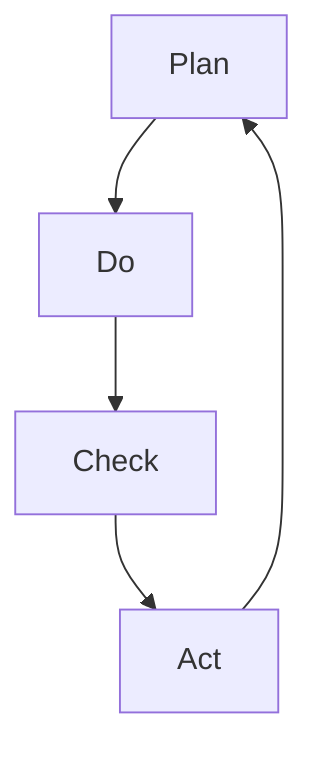

                 

### 文章标题

## PDCA循环：管理者落地执行的指南

### 关键词：PDCA循环，质量管理，持续改进，执行策略，管理实践

### 摘要：
本文旨在深入探讨PDCA循环——一种广泛应用于管理领域的经典方法论。通过详细阐述PDCA循环的四个核心阶段（计划、执行、检查、行动），并结合实际案例，本文将帮助管理者掌握如何有效地实施PDCA循环，实现组织绩效的持续提升。本文还将探讨PDCA循环在当今复杂商业环境中的适应性和重要性，为读者提供实用的执行指南和策略。

-------------------

### 1. 背景介绍

#### 1.1 PDCA循环的起源与发展

PDCA循环，又称为戴明循环，最早由著名的统计学家、质量管理先驱威廉·爱德华·戴明（William Edwards Deming）提出。在20世纪中叶，戴明博士将这一循环应用于质量管理，并迅速在全球范围内推广。PDCA循环代表了“计划（Plan）、执行（Do）、检查（Check）、行动（Act）”四个连续阶段，形成了一个闭环反馈系统，旨在通过不断循环和改进，实现质量控制和持续发展。

#### 1.2 PDCA循环的核心原则

PDCA循环的核心原则是持续改进（Continuous Improvement）。通过在每个阶段进行系统化的评估和调整，PDCA循环帮助企业识别问题、解决问题，并在整个过程中积累知识，从而逐步提升组织的运营效率和产品质量。

#### 1.3 PDCA循环在现代管理中的重要性

在当今快速变化的商业环境中，PDCA循环的重要性日益凸显。企业面临着市场需求的不断变化、竞争压力的增加以及客户期望的提升。通过PDCA循环，企业可以保持敏捷性和灵活性，快速响应市场变化，持续优化业务流程，提升客户满意度，实现长期的竞争优势。

-------------------

### 2. 核心概念与联系

#### 2.1 PDCA循环的四个阶段

PDCA循环由四个核心阶段组成，每个阶段都有其特定的目标和任务：

1. **计划（Plan）**：在这个阶段，团队需要明确目标、制定策略、规划资源，并制定详细的行动计划。目标是PDCA循环的起点，也是后续所有工作的基础。

2. **执行（Do）**：执行阶段是将计划转化为实际行动的过程。在这一阶段，团队按照既定的计划执行任务，确保所有资源和策略得到有效利用。

3. **检查（Check）**：检查阶段是对执行结果进行评估和分析。通过收集数据、分析绩效，团队可以判断计划是否达到了预期的效果，并识别存在的问题和改进的机会。

4. **行动（Act）**：行动阶段是基于检查结果采取的改进措施。团队需要根据检查阶段的分析，调整计划或策略，并实施改进措施，确保问题的解决和绩效的提升。

#### 2.2 PDCA循环的流程图



#### 2.3 PDCA循环与质量管理

PDCA循环是质量管理的基础，它通过持续改进和反馈机制，确保产品和服务的质量不断提升。在PDCA循环中，质量管理贯穿于每个阶段，从计划阶段的目标设定和策略制定，到执行阶段的任务执行，再到检查阶段的绩效评估和问题识别，最后到行动阶段的改进措施和实施。

-------------------

### 3. 核心算法原理 & 具体操作步骤

#### 3.1 PDCA循环的算法原理

PDCA循环的核心算法原理在于其闭环反馈机制。通过不断循环四个阶段，团队可以逐步优化流程、提升质量，并在每个阶段积累经验，为下一轮循环提供更好的基础。

#### 3.2 PDCA循环的具体操作步骤

1. **计划（Plan）**：
   - 确定目标：明确团队的目标和期望成果。
   - 制定策略：根据目标，制定具体的策略和行动计划。
   - 规划资源：确保所需的人、财、物等资源得到充分准备。

2. **执行（Do）**：
   - 按计划执行：严格按照计划执行任务，确保每个步骤都得到落实。
   - 跟踪进度：实时监控项目进度，确保任务按时完成。

3. **检查（Check）**：
   - 数据收集：收集与目标相关的关键数据，进行分析。
   - 绩效评估：评估任务完成情况，判断是否达到预期目标。
   - 问题识别：识别执行过程中存在的问题和不足。

4. **行动（Act）**：
   - 改进措施：根据检查结果，制定改进措施，解决存在的问题。
   - 实施改进：执行改进措施，确保问题的解决和绩效的提升。

#### 3.3 PDCA循环的示例

假设一个制造企业计划通过PDCA循环改进生产线的效率。以下是具体的操作步骤：

1. **计划（Plan）**：
   - 确定目标：提高生产线的效率，减少生产时间。
   - 制定策略：通过引入自动化设备，优化生产流程，减少人工干预。
   - 规划资源：购买自动化设备，培训员工。

2. **执行（Do）**：
   - 按计划执行：安装自动化设备，优化生产流程。
   - 跟踪进度：定期检查生产线的运行情况，确保设备正常运行。

3. **检查（Check）**：
   - 数据收集：收集生产时间、故障率、生产效率等数据。
   - 绩效评估：评估自动化设备引入后，生产线效率的提升情况。
   - 问题识别：发现自动化设备在某些特定情况下存在故障，导致生产中断。

4. **行动（Act）**：
   - 改进措施：对自动化设备进行维护和升级，解决故障问题。
   - 实施改进：重新优化生产流程，确保设备正常运行，提高生产效率。

-------------------

### 4. 数学模型和公式 & 详细讲解 & 举例说明

#### 4.1 PDCA循环的数学模型

PDCA循环的数学模型可以表示为一个闭环反馈系统。假设系统在每次迭代中的性能度量可以表示为 \( P \)，改进措施可以表示为 \( I \)，则PDCA循环的数学模型可以表示为：

\[ P_{next} = P \times (1 + I) \]

其中，\( P_{next} \) 表示下一次迭代中的性能度量，\( P \) 表示当前迭代中的性能度量，\( I \) 表示改进措施对性能的提升。

#### 4.2 PDCA循环的详细讲解

1. **计划（Plan）**：在这个阶段，团队需要明确目标，制定策略和行动计划。数学模型可以表示为：

   \[ Plan = \{ T, S, R \} \]

   其中，\( T \) 表示目标（Target），\( S \) 表示策略（Strategy），\( R \) 表示资源（Resource）。

2. **执行（Do）**：在这个阶段，团队按照计划执行任务，确保资源得到充分利用。数学模型可以表示为：

   \[ Do = \{ T, S, R \} \]

3. **检查（Check）**：在这个阶段，团队对执行结果进行评估，判断是否达到预期目标。数学模型可以表示为：

   \[ Check = \{ T, S, R, P \} \]

   其中，\( P \) 表示性能度量（Performance）。

4. **行动（Act）**：在这个阶段，团队根据检查结果采取改进措施，确保问题的解决和绩效的提升。数学模型可以表示为：

   \[ Act = \{ T, S, R, P, I \} \]

   其中，\( I \) 表示改进措施（Improvement）。

#### 4.3 PDCA循环的举例说明

假设一个软件开发团队计划通过PDCA循环改进软件的质量。以下是具体的操作步骤：

1. **计划（Plan）**：
   - 目标（Target）：提高软件的代码质量。
   - 策略（Strategy）：引入代码审查机制，定期进行代码检查。
   - 资源（Resource）：安排专业的代码审查人员，提供必要的工具和培训。

2. **执行（Do）**：
   - 按计划执行：实施代码审查机制，定期进行代码检查。

3. **检查（Check）**：
   - 性能度量（Performance）：收集代码质量数据，如代码缺陷率、代码复杂度等。
   - 评估结果：根据收集的数据，评估代码质量的提升情况。

4. **行动（Act）**：
   - 改进措施（Improvement）：根据评估结果，优化代码审查机制，提高代码质量。

-------------------

### 5. 项目实践：代码实例和详细解释说明

#### 5.1 开发环境搭建

在这个项目中，我们将使用Python编程语言来实现PDCA循环。首先，确保安装了Python环境。如果尚未安装，可以从Python官方网站下载并安装最新版本的Python。

#### 5.2 源代码详细实现

以下是实现PDCA循环的Python代码示例：

```python
import time

def plan():
    print("Plan阶段：制定目标和策略。")
    # 在这里，你可以定义具体的计划和目标
    time.sleep(1)

def do():
    print("执行阶段：按照计划执行任务。")
    # 在这里，你可以执行具体的任务和操作
    time.sleep(1)

def check():
    print("检查阶段：评估执行结果。")
    # 在这里，你可以收集数据并评估绩效
    time.sleep(1)

def act():
    print("行动阶段：根据检查结果采取改进措施。")
    # 在这里，你可以根据检查结果调整计划和策略
    time.sleep(1)

def pdca_loop():
    while True:
        plan()
        do()
        check()
        act()

pdca_loop()
```

#### 5.3 代码解读与分析

1. **计划（Plan）**：在这个函数中，我们定义了PDCA循环的计划阶段。这里我们简单地打印了一个消息，表示正在进入计划阶段。在实际应用中，你可以根据具体需求定义目标和策略。

2. **执行（Do）**：在这个函数中，我们定义了PDCA循环的执行阶段。同样，我们简单地打印了一个消息，表示正在执行任务。在实际应用中，你可以根据计划执行具体的操作和任务。

3. **检查（Check）**：在这个函数中，我们定义了PDCA循环的检查阶段。这里我们同样简单地打印了一个消息，表示正在评估执行结果。在实际应用中，你可以收集数据并评估任务的完成情况。

4. **行动（Act）**：在这个函数中，我们定义了PDCA循环的行动阶段。这里我们简单地打印了一个消息，表示正在采取改进措施。在实际应用中，你可以根据检查结果调整计划或策略。

5. **PDCA循环**：最后，我们定义了一个名为`pdca_loop`的函数，用于实现PDCA循环的连续迭代。这个函数使用了一个无限循环，在每个阶段调用相应的函数，并暂停一秒钟以模拟实际操作。

#### 5.4 运行结果展示

当你运行这个代码时，会看到一个连续的循环，每次迭代都按照计划、执行、检查、行动的顺序进行。每次迭代完成后，都会打印相应的消息。

-------------------

### 6. 实际应用场景

#### 6.1 制造业

在制造业中，PDCA循环广泛应用于生产流程的改进。企业可以通过计划阶段明确生产目标，执行阶段实施生产计划，检查阶段评估生产绩效，行动阶段进行改进措施，从而不断提高生产效率和质量。

#### 6.2 服务业

在服务业中，PDCA循环同样具有广泛的应用。例如，在客户服务领域，企业可以通过计划阶段确定服务标准，执行阶段提供客户服务，检查阶段收集客户反馈，行动阶段改进服务质量，从而提升客户满意度。

#### 6.3 IT行业

在IT行业，PDCA循环广泛应用于软件开发和维护。团队可以通过计划阶段明确项目目标，执行阶段进行编码和测试，检查阶段评估代码质量，行动阶段进行代码优化，从而提高软件的可靠性和性能。

-------------------

### 7. 工具和资源推荐

#### 7.1 学习资源推荐

- 《质量管理：理论与实践》（作者：詹姆斯·R·赫斯克特）：本书详细介绍了质量管理的基本原理和实践方法，对理解PDCA循环非常有帮助。
- 《PDCA循环：实践指南》（作者：威廉·爱德华·戴明）：戴明博士的这本著作是对PDCA循环的权威解释，适合深入学习和实践。

#### 7.2 开发工具框架推荐

- JIRA：一款功能强大的项目管理工具，支持PDCA循环的各个环节，适合用于团队协作和项目跟踪。
- Asana：一款简单易用的项目管理工具，可以帮助团队高效地执行PDCA循环的各个阶段。

#### 7.3 相关论文著作推荐

- Deming, W. E. (1986). Out of the Crisis. Massachusetts Institute of Technology Press.
- Juran, J. M. (1989). Juran on Leadership for Quality: An Executive Handbook. The Free Press.

-------------------

### 8. 总结：未来发展趋势与挑战

#### 8.1 发展趋势

随着数字化和自动化技术的不断进步，PDCA循环在各个行业中的应用将更加广泛和深入。人工智能、大数据分析等新兴技术的应用，将为PDCA循环提供更强大的数据支持和决策依据。

#### 8.2 挑战

1. **数据质量**：在PDCA循环中，数据的质量和准确性至关重要。企业需要确保数据的可靠性和完整性，以便做出准确的决策和改进措施。

2. **团队协作**：PDCA循环需要团队的高度协作和积极参与。企业需要建立有效的沟通和协作机制，确保团队成员能够充分理解PDCA循环的核心原则和目标。

3. **持续改进**：持续改进是PDCA循环的核心原则，但实际操作中，企业往往难以保持持续改进的动力。企业需要建立长期的文化和机制，确保持续改进得以持续。

-------------------

### 9. 附录：常见问题与解答

#### 9.1 什么是PDCA循环？

PDCA循环是一种广泛应用于管理领域的方法论，代表“计划（Plan）、执行（Do）、检查（Check）、行动（Act）”四个连续阶段，旨在通过不断循环和改进，实现质量控制和持续发展。

#### 9.2 PDCA循环适用于哪些场景？

PDCA循环适用于各种行业和领域，包括制造业、服务业、IT行业等。它可以帮助企业优化业务流程、提高产品质量、提升客户满意度等。

#### 9.3 如何实施PDCA循环？

实施PDCA循环的步骤包括：明确目标、制定计划、执行任务、评估结果、采取改进措施。关键在于确保每个阶段的工作都得到有效执行和评估。

-------------------

### 10. 扩展阅读 & 参考资料

- Deming, W. E. (1986). Out of the Crisis. Massachusetts Institute of Technology Press.
- Juran, J. M. (1989). Juran on Leadership for Quality: An Executive Handbook. The Free Press.
- Shewhart, W. A. (1931). Statistical Method from the Viewpoint of Quality Control. Bell System Technical Journal.
- ISO 9001:2015. ISO International.
- Lean Six Sigma: The Breakthrough Management Strategy Revolutionizing the World's Top Corporations. (2003). McGraw-Hill Education.

-------------------

### 作者署名

作者：禅与计算机程序设计艺术 / Zen and the Art of Computer Programming

