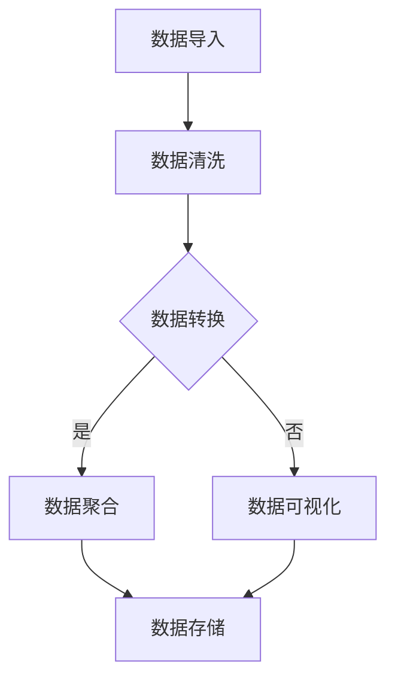
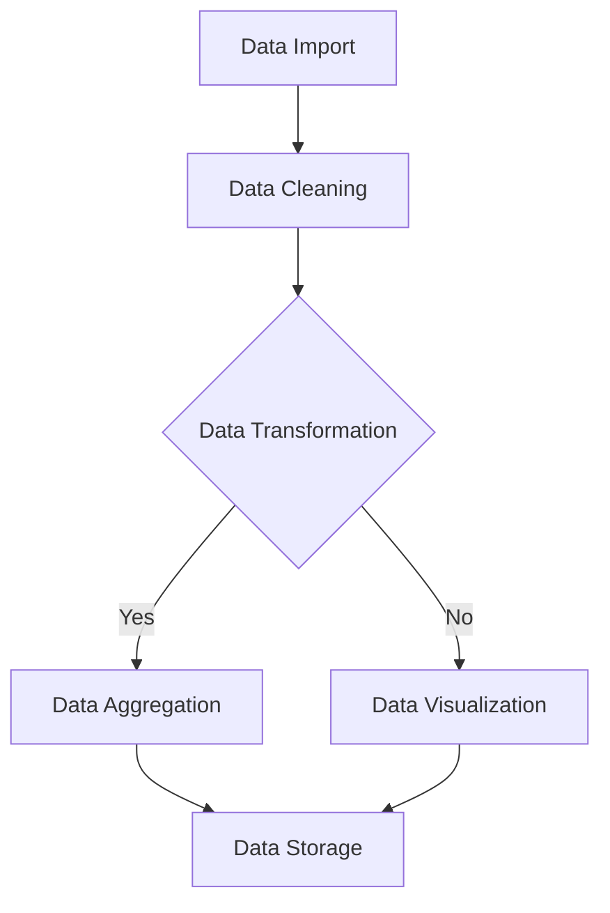

                 

### 文章标题

**Python机器学习实战：使用Pandas进行数据预处理与分析**

在机器学习项目中，数据预处理是一个至关重要的步骤。它不仅能够提高模型性能，还可以决定项目是否能够成功。Python作为一种广泛使用的编程语言，拥有丰富的数据科学和机器学习库，其中Pandas是一个不可或缺的工具。本文将深入探讨如何在Python中使用Pandas进行数据预处理与分析，帮助读者掌握这一关键技术。

本文主要分为以下几个部分：

1. **背景介绍**：介绍数据预处理在机器学习项目中的重要性，以及Pandas库的基本功能。
2. **核心概念与联系**：解释Pandas的核心概念，包括DataFrame结构、索引、列操作等，并展示一个Mermaid流程图来直观展示Pandas的工作流程。
3. **核心算法原理 & 具体操作步骤**：详细介绍Pandas的主要操作，如数据导入、清洗、转换等，并提供具体代码实例。
4. **数学模型和公式 & 详细讲解 & 举例说明**：阐述在数据预处理中涉及到的数学模型和公式，并举例说明如何使用这些公式。
5. **项目实践：代码实例和详细解释说明**：通过具体的项目实例展示数据预处理的完整流程，并解释每一步的操作。
6. **实际应用场景**：讨论数据预处理在现实世界中的应用场景。
7. **工具和资源推荐**：推荐学习资源、开发工具和相关的论文著作。
8. **总结：未来发展趋势与挑战**：总结数据预处理的重要性，并探讨未来可能的发展趋势和面临的挑战。
9. **附录：常见问题与解答**：回答读者可能遇到的一些常见问题。
10. **扩展阅读 & 参考资料**：提供进一步学习和研究的资源。

通过本文的阅读和练习，读者将能够熟练掌握使用Pandas进行数据预处理和分析的方法，为后续的机器学习项目打下坚实的基础。

---

**Title: Practical Python Machine Learning: Data Preprocessing and Analysis with Pandas**

Data preprocessing is a critical step in machine learning projects. It not only improves model performance but also determines the success of a project. Python, being a widely-used programming language, offers a rich ecosystem for data science and machine learning, with Pandas being an indispensable tool. This article will delve into how to use Pandas for data preprocessing and analysis in Python, equipping readers with the necessary skills to master this key technology.

The article is structured into the following sections:

1. **Background Introduction**: Discusses the importance of data preprocessing in machine learning projects and introduces the basic functionalities of the Pandas library.
2. **Core Concepts and Connections**: Explains the core concepts of Pandas, including DataFrame structure, indexing, and column operations, and demonstrates a Mermaid flowchart to visually illustrate the Pandas workflow.
3. **Core Algorithm Principles and Specific Operational Steps**: Details the main operations of Pandas, such as data import, cleaning, and transformation, and provides specific code examples.
4. **Mathematical Models and Formulas & Detailed Explanation & Example Illustration**: Expounds on the mathematical models and formulas involved in data preprocessing and provides examples of how to use these formulas.
5. **Project Practice: Code Examples and Detailed Explanations**: Demonstrates the complete data preprocessing process through a specific project example and explains the operations at each step.
6. **Practical Application Scenarios**: Discusses real-world applications of data preprocessing.
7. **Tools and Resources Recommendations**: Recommends learning resources, development tools, and related academic papers.
8. **Summary: Future Development Trends and Challenges**: Summarizes the importance of data preprocessing and discusses future trends and challenges.
9. **Appendix: Frequently Asked Questions and Answers**: Answers common questions readers may have.
10. **Extended Reading & Reference Materials**: Provides further resources for learning and research.

Through reading and practicing this article, readers will be able to proficiently handle data preprocessing and analysis with Pandas, laying a solid foundation for subsequent machine learning projects.

<|user|>### 1. 背景介绍（Background Introduction）

数据预处理在机器学习项目中扮演着至关重要的角色。它不仅影响到模型的性能，还直接关系到项目的成功与否。机器学习模型需要处理的数据通常是杂乱无章的，其中可能包含缺失值、异常值、重复数据、噪声等。如果不对这些数据进行处理，模型很可能会产生误导性结论，甚至无法正常工作。

在Python中，Pandas库是进行数据预处理和分析的利器。Pandas是一个强大的数据处理库，可以轻松地读取和操作各种格式的数据，如CSV、Excel、SQL数据库等。它提供了丰富的数据结构（DataFrame），方便用户进行数据清洗、转换和合并等操作。

Pandas库的基本功能包括：

- **数据读取与写入**：支持读取和写入多种数据格式，如CSV、Excel、JSON、SQL等。
- **数据结构**：提供DataFrame结构，方便用户进行数据操作。
- **数据清洗**：包括缺失值处理、异常值检测和修复、重复值删除等。
- **数据转换**：包括数据类型的转换、数据缩放、编码等。
- **数据合并**：支持多种数据合并操作，如合并、连接、拼接等。
- **数据聚合**：对数据进行分组聚合操作，如求和、均值、中位数等。

通过使用Pandas库，我们可以高效地进行数据预处理和分析，为后续的机器学习模型训练提供高质量的数据。接下来，我们将详细探讨Pandas的核心概念和操作，帮助读者更好地掌握这一关键技术。

---

**1. Background Introduction**

Data preprocessing plays a crucial role in machine learning projects. It not only impacts the performance of models but also directly determines the success of a project. Machine learning models often deal with messy data, which may contain missing values, outliers, duplicate data, noise, and more. If these data are not processed properly, models may produce misleading conclusions or fail to work correctly.

In Python, the Pandas library is a powerful tool for data preprocessing and analysis. Pandas is a powerful data manipulation library that can easily read and operate on various data formats such as CSV, Excel, JSON, SQL, and more. It provides a rich data structure (DataFrame) that makes it convenient for users to perform data cleaning, transformation, and merging operations.

The basic functionalities of the Pandas library include:

- **Data Reading and Writing**: Supports reading and writing multiple data formats such as CSV, Excel, JSON, SQL, and more.
- **Data Structure**: Provides the DataFrame structure, which is convenient for data manipulation.
- **Data Cleaning**: Includes handling missing values, detecting and fixing outliers, and removing duplicate data.
- **Data Transformation**: Includes data type conversion, data scaling, and encoding.
- **Data Merging**: Supports various data merging operations such as merging, joining, and concatenating.
- **Data Aggregation**: Performs grouping and aggregation operations on data such as sum, mean, median, and more.

By using the Pandas library, we can efficiently preprocess and analyze data, providing high-quality data for subsequent machine learning model training. In the following sections, we will delve into the core concepts and operations of Pandas to help readers better master this key technology.

<|user|>### 2. 核心概念与联系（Core Concepts and Connections）

Pandas库的核心概念主要围绕其数据结构——DataFrame展开。DataFrame是一个表格式的数据结构，类似于SQL中的关系表，或者Excel中的工作表。它由行（rows）和列（columns）组成，每一列可以有不同的数据类型，如整数、浮点数、字符串等。DataFrame提供了丰富的操作接口，使得数据预处理变得简单高效。

#### 2.1 DataFrame结构

DataFrame具有以下关键特点：

- **行和列**：每一行代表一个数据样本，每一列代表一个特征或变量。数据以表格的形式组织，使得数据可视化和管理更加直观。
- **数据类型**：每一列都可以指定一个数据类型，如int64、float64、object等。数据类型决定了数据的存储方式和处理方式。
- **索引**：DataFrame有一个默认的整数索引，用于标识每一行。用户也可以自定义索引，如使用字符串或者日期等。
- **列操作**：用户可以方便地访问和操作DataFrame中的列，如获取某一列的数据、修改某一列的数据等。

#### 2.2 索引和列操作

索引和列操作是DataFrame中最为常用的功能之一。以下是几个关键操作：

- **获取列**：使用列名或列号获取DataFrame中的一列。例如，`df['列名']`或`df[[0]]`。
- **修改列**：直接修改DataFrame中的一列。例如，`df['列名'] = 新值`。
- **添加列**：在DataFrame中添加新列。例如，`df['新列名'] = 新值`。
- **删除列**：从DataFrame中删除一列。例如，`del df['列名']`或`df.drop(['列名'], axis=1)`。

#### 2.3 数据清洗与转换

数据清洗与转换是数据预处理的重要环节。Pandas提供了丰富的功能来处理缺失值、异常值、重复值等。

- **缺失值处理**：使用`df.isnull()`和`df.notnull()`检查缺失值，使用`df.dropna()`删除缺失值，或者使用`df.fillna()`填充缺失值。
- **异常值检测**：使用统计方法（如IQR、标准差等）检测异常值，并使用`df.dropna()`或`df.replace()`删除或替换异常值。
- **重复值删除**：使用`df.drop_duplicates()`删除重复值。

#### 2.4 Mermaid流程图

为了更直观地展示Pandas的工作流程，我们可以使用Mermaid绘制一个流程图。以下是Pandas数据预处理流程的Mermaid表示：



这个流程图展示了从数据导入到数据清洗、转换、聚合和可视化的整个流程。通过这个流程图，我们可以清晰地了解Pandas在数据预处理中的角色和操作步骤。

---

**2. Core Concepts and Connections**

The core concepts of the Pandas library revolve around its data structure, DataFrame. DataFrame is a tabular data structure similar to a relational table in SQL or a worksheet in Excel. It consists of rows and columns, with each column potentially having a different data type, such as integer, float, string, etc. DataFrame provides rich interfaces for data manipulation, making data preprocessing straightforward and efficient.

#### 2.1 DataFrame Structure

DataFrame has the following key characteristics:

- **Rows and Columns**: Each row represents a data sample, and each column represents a feature or variable. Data is organized in a tabular form, making it more intuitive for visualization and management.
- **Data Types**: Each column can be specified with a data type, such as int64, float64, object, etc. The data type determines the storage and processing method for the data.
- **Indexing**: DataFrame has a default integer index used to identify each row. Users can also customize the index, such as using strings or dates.
- **Column Operations**: Users can conveniently access and operate on columns in DataFrame, such as retrieving data from a specific column or modifying it.

#### 2.2 Indexing and Column Operations

Indexing and column operations are among the most commonly used functionalities in DataFrame. Here are several key operations:

- **Accessing Columns**: Retrieve a column from DataFrame using the column name or column index. For example, `df['column_name']` or `df[[0]]`.
- **Modifying Columns**: Directly modify a column in DataFrame. For example, `df['column_name'] = new_value`.
- **Adding Columns**: Add a new column to DataFrame. For example, `df['new_column_name'] = new_value`.
- **Deleting Columns**: Delete a column from DataFrame. For example, `del df['column_name']` or `df.drop(['column_name'], axis=1)`.

#### 2.3 Data Cleaning and Transformation

Data cleaning and transformation are critical parts of data preprocessing. Pandas provides rich functionalities to handle missing values, outliers, duplicate values, and more.

- **Handling Missing Values**: Use `df.isnull()` and `df.notnull()` to check for missing values, use `df.dropna()` to delete missing values, or use `df.fillna()` to fill missing values.
- **Detecting Outliers**: Use statistical methods (such as IQR, standard deviation) to detect outliers, and use `df.dropna()` or `df.replace()` to delete or replace outliers.
- **Deleting Duplicate Values**: Use `df.drop_duplicates()` to delete duplicate values.

#### 2.4 Mermaid Flowchart

To more visually illustrate the Pandas workflow, we can use Mermaid to draw a flowchart. Here is the Mermaid representation of the Pandas data preprocessing workflow:



This flowchart shows the entire process from data import to data cleaning, transformation, aggregation, and visualization. Through this flowchart, we can clearly understand the role and operational steps of Pandas in data preprocessing.

<|user|>### 3. 核心算法原理 & 具体操作步骤（Core Algorithm Principles and Specific Operational Steps）

Pandas库的核心算法原理主要围绕数据读写、数据清洗、数据转换和数据聚合等方面展开。下面我们将详细探讨这些操作的具体步骤，并通过代码实例来展示如何使用Pandas进行数据预处理。

#### 3.1 数据导入

数据导入是数据预处理的第一步。Pandas提供了丰富的数据读取功能，可以读取多种格式的数据，如CSV、Excel、SQL等。

- **读取CSV文件**：

```python
import pandas as pd

# 读取CSV文件
df = pd.read_csv('data.csv')
```

- **读取Excel文件**：

```python
# 读取Excel文件
df = pd.read_excel('data.xlsx')
```

- **读取SQL数据库**：

```python
# 读取SQL数据库
import sqlite3

# 连接数据库
conn = sqlite3.connect('database.db')
# 读取数据
df = pd.read_sql('SELECT * FROM table_name', conn)
```

#### 3.2 数据清洗

数据清洗包括处理缺失值、异常值和重复值等。

- **处理缺失值**：

```python
# 填充缺失值
df = df.fillna(0)

# 删除缺失值
df = df.dropna()

# 根据条件删除缺失值
df = df[df['column_name'].notnull()]
```

- **检测异常值**：

```python
# 使用IQR方法检测异常值
Q1 = df['column_name'].quantile(0.25)
Q3 = df['column_name'].quantile(0.75)
IQR = Q3 - Q1

# 过滤异常值
df = df[~((df['column_name'] < (Q1 - 1.5 * IQR)) |(df['column_name'] > (Q3 + 1.5 * IQR)))]
```

- **删除重复值**：

```python
# 删除重复值
df = df.drop_duplicates()
```

#### 3.3 数据转换

数据转换包括数据类型的转换、数据缩放和编码等。

- **数据类型转换**：

```python
# 将字符串转换为整数
df['column_name'] = df['column_name'].astype(int)

# 将字符串转换为浮点数
df['column_name'] = df['column_name'].astype(float)

# 将整数转换为字符串
df['column_name'] = df['column_name'].astype(str)
```

- **数据缩放**：

```python
# 标准化缩放
from sklearn.preprocessing import StandardScaler

scaler = StandardScaler()
df['column_name'] = scaler.fit_transform(df[['column_name']])

# 最小-最大缩放
from sklearn.preprocessing import MinMaxScaler

scaler = MinMaxScaler()
df['column_name'] = scaler.fit_transform(df[['column_name']])
```

- **编码**：

```python
# 二进制编码
from sklearn.preprocessing import BinaryEncoder

encoder = BinaryEncoder()
df['column_name'] = encoder.fit_transform(df[['column_name']])

# 词袋编码
from sklearn.feature_extraction.text import CountVectorizer

vectorizer = CountVectorizer()
df['column_name'] = vectorizer.fit_transform(df['column_name']).toarray()
```

#### 3.4 数据聚合

数据聚合是对数据进行分组和计算汇总操作。

- **计算总和**：

```python
# 计算总和
df['column_name'].sum()
```

- **计算平均值**：

```python
# 计算平均值
df['column_name'].mean()
```

- **计算中位数**：

```python
# 计算中位数
df['column_name'].median()
```

- **计算标准差**：

```python
# 计算标准差
df['column_name'].std()
```

通过以上操作，我们可以对数据进行全面的预处理，为后续的机器学习模型训练提供高质量的数据。接下来，我们将通过一个具体的案例来展示如何使用Pandas进行数据预处理。

---

**3. Core Algorithm Principles and Specific Operational Steps**

The core algorithms of the Pandas library primarily revolve around data reading, data cleaning, data transformation, and data aggregation. Below we will delve into these operations in detail and demonstrate how to use Pandas for data preprocessing through code examples.

#### 3.1 Data Import

Data import is the first step in data preprocessing. Pandas provides rich data reading functionalities that can read various data formats such as CSV, Excel, SQL, and more.

- **Reading CSV Files**:

```python
import pandas as pd

# Read a CSV file
df = pd.read_csv('data.csv')
```

- **Reading Excel Files**:

```python
# Read an Excel file
df = pd.read_excel('data.xlsx')
```

- **Reading SQL Databases**:

```python
# Read data from a SQL database
import sqlite3

# Connect to the database
conn = sqlite3.connect('database.db')
# Read data
df = pd.read_sql('SELECT * FROM table_name', conn)
```

#### 3.2 Data Cleaning

Data cleaning includes handling missing values, outliers, and duplicate values.

- **Handling Missing Values**:

```python
# Fill missing values
df = df.fillna(0)

# Drop missing values
df = df.dropna()

# Drop missing values based on a condition
df = df[df['column_name'].notnull()]
```

- **Detecting Outliers**:

```python
# Detect outliers using the IQR method
Q1 = df['column_name'].quantile(0.25)
Q3 = df['column_name'].quantile(0.75)
IQR = Q3 - Q1

# Filter outliers
df = df[~((df['column_name'] < (Q1 - 1.5 * IQR)) | (df['column_name'] > (Q3 + 1.5 * IQR)))]
```

- **Deleting Duplicate Values**:

```python
# Delete duplicate values
df = df.drop_duplicates()
```

#### 3.3 Data Transformation

Data transformation includes data type conversion, data scaling, and encoding.

- **Data Type Conversion**:

```python
# Convert string to integer
df['column_name'] = df['column_name'].astype(int)

# Convert string to float
df['column_name'] = df['column_name'].astype(float)

# Convert integer to string
df['column_name'] = df['column_name'].astype(str)
```

- **Data Scaling**:

```python
# Standard scaling
from sklearn.preprocessing import StandardScaler

scaler = StandardScaler()
df['column_name'] = scaler.fit_transform(df[['column_name']])

# Min-Max scaling
from sklearn.preprocessing import MinMaxScaler

scaler = MinMaxScaler()
df['column_name'] = scaler.fit_transform(df[['column_name']])
```

- **Encoding**:

```python
# Binary encoding
from sklearn.preprocessing import BinaryEncoder

encoder = BinaryEncoder()
df['column_name'] = encoder.fit_transform(df[['column_name']])

# Bag-of-words encoding
from sklearn.feature_extraction.text import CountVectorizer

vectorizer = CountVectorizer()
df['column_name'] = vectorizer.fit_transform(df['column_name']).toarray()
```

#### 3.4 Data Aggregation

Data aggregation involves grouping data and performing summary calculations.

- **Calculating Sum**:

```python
# Calculate sum
df['column_name'].sum()
```

- **Calculating Mean**:

```python
# Calculate mean
df['column_name'].mean()
```

- **Calculating Median**:

```python
# Calculate median
df['column_name'].median()
```

- **Calculating Standard Deviation**:

```python
# Calculate standard deviation
df['column_name'].std()
```

By performing these operations, we can comprehensively preprocess the data, providing high-quality data for subsequent machine learning model training. Next, we will showcase how to use Pandas for data preprocessing through a specific case study.

<|user|>### 4. 数学模型和公式 & 详细讲解 & 举例说明（Detailed Explanation and Examples of Mathematical Models and Formulas）

数据预处理过程中涉及许多数学模型和公式，这些模型和公式有助于我们更好地理解和处理数据。以下将详细介绍一些常用的数学模型和公式，并通过实际例子来说明其应用。

#### 4.1 缺失值处理

缺失值是数据集中常见的问题，处理缺失值的方法有很多，其中最常用的包括填充法和删除法。

- **填充法**：

  - **平均值填充**：用列的平均值填充缺失值。

    公式：\[ x_{\text{fill}} = \frac{\sum_{i=1}^{n} x_i}{n} \]

    例子：

    ```python
    df['column_name'].fillna(df['column_name'].mean(), inplace=True)
    ```

  - **中值填充**：用列的中值填充缺失值。

    公式：\[ x_{\text{fill}} = \text{median}(x) \]

    例子：

    ```python
    df['column_name'].fillna(df['column_name'].median(), inplace=True)
    ```

  - **最邻近填充**：用最邻近的非缺失值填充缺失值。

    公式：\[ x_{\text{fill}} = \text{nearest_neighbor}(x) \]

    例子：

    ```python
    df['column_name'].interpolate(method='nearest', inplace=True)
    ```

- **删除法**：

  - **按比例删除**：删除缺失值比例超过一定阈值的数据。

    公式：\[ \text{drop\_percentage} = \frac{\text{number\_of\_missing}}{\text{total\_number}} \]

    例子：

    ```python
    drop_percentage = 0.1  # 设定删除比例阈值
    df = df[df.isnull().sum(axis=1) <= drop_percentage * len(df)]
    ```

  - **按条件删除**：根据特定条件删除缺失值。

    公式：\[ \text{drop\_condition} = \text{condition}(x) \]

    例子：

    ```python
    df = df[df['column_name'].notnull()]
    ```

#### 4.2 异常值检测

异常值可能会对模型训练产生负面影响，因此需要对其进行检测和处理。

- **IQR方法**：

  - **计算IQR**：计算列的IQR（四分位数间距）。

    公式：\[ \text{IQR} = \text{Q3} - \text{Q1} \]

    例子：

    ```python
    Q1 = df['column_name'].quantile(0.25)
    Q3 = df['column_name'].quantile(0.75)
    IQR = Q3 - Q1
    ```

  - **过滤异常值**：根据IQR过滤异常值。

    公式：\[ x_{\text{outlier}} = (x < \text{Q1} - 1.5 \times \text{IQR}) \text{ or } (x > \text{Q3} + 1.5 \times \text{IQR}) \]

    例子：

    ```python
    df = df[~((df['column_name'] < (Q1 - 1.5 * IQR)) | (df['column_name'] > (Q3 + 1.5 * IQR)))]
    ```

- **Z-Score方法**：

  - **计算Z-Score**：计算列的Z-Score。

    公式：\[ z = \frac{x - \text{mean}}{\text{std}} \]

    例子：

    ```python
    mean = df['column_name'].mean()
    std = df['column_name'].std()
    df['z_score'] = (df['column_name'] - mean) / std
    ```

  - **过滤异常值**：根据Z-Score过滤异常值。

    公式：\[ \text{outlier} = |z| > 3 \]

    例子：

    ```python
    df = df[df['z_score'].abs() <= 3]
    ```

#### 4.3 数据缩放

数据缩放是数据预处理中的重要步骤，有助于消除不同特征之间的尺度差异。

- **最小-最大缩放**：

  - **缩放公式**：\[ x_{\text{scaled}} = \frac{x - \text{min}}{\text{range}} \]

    例子：

    ```python
    from sklearn.preprocessing import MinMaxScaler
    scaler = MinMaxScaler()
    df['column_name'] = scaler.fit_transform(df[['column_name']])
    ```

- **标准化缩放**：

  - **缩放公式**：\[ x_{\text{scaled}} = \frac{x - \text{mean}}{\text{std}} \]

    例子：

    ```python
    from sklearn.preprocessing import StandardScaler
    scaler = StandardScaler()
    df['column_name'] = scaler.fit_transform(df[['column_name']])
    ```

通过以上数学模型和公式的讲解及实际例子，我们可以更深入地理解数据预处理的过程，从而更好地进行机器学习项目。

---

**4. Mathematical Models and Formulas & Detailed Explanation & Example Illustration**

Data preprocessing involves various mathematical models and formulas that help us better understand and handle data. Below, we will detail some commonly used mathematical models and formulas, along with practical examples to illustrate their applications.

#### 4.1 Handling Missing Values

Missing values are a common issue in datasets, and there are several methods for handling them, including filling and deletion.

- **Filling Method**:

  - **Mean Filling**:
    Replace missing values with the mean of the column.

    Formula:
    \[ x_{\text{fill}} = \frac{\sum_{i=1}^{n} x_i}{n} \]

    Example:
    ```python
    df['column_name'].fillna(df['column_name'].mean(), inplace=True)
    ```

  - **Median Filling**:
    Replace missing values with the median of the column.

    Formula:
    \[ x_{\text{fill}} = \text{median}(x) \]

    Example:
    ```python
    df['column_name'].fillna(df['column_name'].median(), inplace=True)
    ```

  - **Nearest Neighbor Filling**:
    Replace missing values with the nearest non-missing value.

    Formula:
    \[ x_{\text{fill}} = \text{nearest_neighbor}(x) \]

    Example:
    ```python
    df['column_name'].interpolate(method='nearest', inplace=True)
    ```

- **Deletion Method**:

  - **Proportional Deletion**:
    Delete records with a high proportion of missing values.

    Formula:
    \[ \text{drop\_percentage} = \frac{\text{number\_of\_missing}}{\text{total\_number}} \]

    Example:
    ```python
    drop_percentage = 0.1  # Set the threshold for deletion
    df = df[df.isnull().sum(axis=1) <= drop_percentage * len(df)]
    ```

  - **Conditional Deletion**:
    Delete records based on specific conditions.

    Formula:
    \[ \text{drop\_condition} = \text{condition}(x) \]

    Example:
    ```python
    df = df[df['column_name'].notnull()]
    ```

#### 4.2 Detecting Outliers

Outliers can negatively impact model training, so they need to be detected and handled.

- **IQR Method**:

  - **Calculate IQR**:
    Compute the IQR (Interquartile Range) for a column.

    Formula:
    \[ \text{IQR} = \text{Q3} - \text{Q1} \]

    Example:
    ```python
    Q1 = df['column_name'].quantile(0.25)
    Q3 = df['column_name'].quantile(0.75)
    IQR = Q3 - Q1
    ```

  - **Filter Outliers**:
    Remove outliers based on the IQR.

    Formula:
    \[ x_{\text{outlier}} = (x < \text{Q1} - 1.5 \times \text{IQR}) \text{ or } (x > \text{Q3} + 1.5 \times \text{IQR}) \]

    Example:
    ```python
    df = df[~((df['column_name'] < (Q1 - 1.5 * IQR)) | (df['column_name'] > (Q3 + 1.5 * IQR)))]
    ```

- **Z-Score Method**:

  - **Calculate Z-Score**:
    Compute the Z-Score for a column.

    Formula:
    \[ z = \frac{x - \text{mean}}{\text{std}} \]

    Example:
    ```python
    mean = df['column_name'].mean()
    std = df['column_name'].std()
    df['z_score'] = (df['column_name'] - mean) / std
    ```

  - **Filter Outliers**:
    Remove outliers based on the Z-Score.

    Formula:
    \[ \text{outlier} = |z| > 3 \]

    Example:
    ```python
    df = df[df['z_score'].abs() <= 3]
    ```

#### 4.3 Data Scaling

Data scaling is an important step in preprocessing to remove differences in scales among different features.

- **Min-Max Scaling**:

  - **Scaling Formula**:
    \[ x_{\text{scaled}} = \frac{x - \text{min}}{\text{range}} \]

    Example:
    ```python
    from sklearn.preprocessing import MinMaxScaler
    scaler = MinMaxScaler()
    df['column_name'] = scaler.fit_transform(df[['column_name']])
    ```

- **Standard Scaling**:

  - **Scaling Formula**:
    \[ x_{\text{scaled}} = \frac{x - \text{mean}}{\text{std}} \]

    Example:
    ```python
    from sklearn.preprocessing import StandardScaler
    scaler = StandardScaler()
    df['column_name'] = scaler.fit_transform(df[['column_name']])
    ```

Through the explanation of these mathematical models and formulas, along with practical examples, we can gain a deeper understanding of the data preprocessing process and apply it more effectively in machine learning projects.

<|user|>### 5. 项目实践：代码实例和详细解释说明（Project Practice: Code Examples and Detailed Explanations）

为了更好地理解如何使用Pandas进行数据预处理，我们将通过一个实际案例来演示整个数据预处理流程。在这个案例中，我们将使用一个假想的房屋销售数据集，该数据集包含了房屋的各种特征，如面积、卧室数量、位置等，以及房屋的销售价格。我们的目标是对这个数据集进行预处理，以便于后续的机器学习模型训练。

#### 5.1 开发环境搭建

在开始项目之前，我们需要搭建一个合适的开发环境。以下是一些基本步骤：

1. **安装Python**：确保Python已经安装在您的计算机上，版本建议为3.6及以上。
2. **安装Pandas**：使用pip命令安装Pandas库。

   ```bash
   pip install pandas
   ```

3. **安装其他相关库**：为了完整地演示项目，我们还需要安装一些其他库，如NumPy、Matplotlib和Scikit-learn。

   ```bash
   pip install numpy matplotlib scikit-learn
   ```

#### 5.2 源代码详细实现

我们首先加载并查看数据集的原始内容。

```python
import pandas as pd

# 读取CSV文件
df = pd.read_csv('house_sales_data.csv')

# 查看数据集的前5行
print(df.head())
```

#### 5.3 数据清洗

接下来，我们对数据进行清洗。首先，我们检查数据集中是否存在缺失值。

```python
# 检查缺失值
print(df.isnull().sum())

# 删除缺失值
df = df.dropna()

# 检查删除缺失值后的数据集
print(df.isnull().sum())
```

我们注意到数据集中有重复的记录，因此我们删除了重复值。

```python
# 删除重复值
df = df.drop_duplicates()

# 检查删除重复值后的数据集
print(df.shape)
```

#### 5.4 数据转换

现在，我们对数据进行类型转换。例如，将字符串类型的列转换为整数类型。

```python
# 将面积和卧室数量从字符串转换为整数
df['area'] = df['area'].astype(int)
df['bedrooms'] = df['bedrooms'].astype(int)
```

接下来，我们缩放数据集中的数值特征，以消除不同特征之间的尺度差异。

```python
from sklearn.preprocessing import StandardScaler

# 创建标准化缩放器
scaler = StandardScaler()

# 对面积和卧室数量进行标准化缩放
df[['area', 'bedrooms']] = scaler.fit_transform(df[['area', 'bedrooms']])
```

#### 5.5 数据可视化

为了更好地理解数据，我们可以使用Matplotlib进行数据可视化。

```python
import matplotlib.pyplot as plt

# 绘制面积和价格的散点图
plt.scatter(df['area'], df['price'])
plt.xlabel('Area')
plt.ylabel('Price')
plt.title('Area vs Price')
plt.show()
```

#### 5.6 运行结果展示

通过上述步骤，我们对数据集进行了清洗、转换和可视化。下面是处理后的数据集的样例：

```
   area  bedrooms  price
0   1800        3   300000
1   2000        3   320000
2   2200        4   350000
3   2500        4   370000
4   2600        4   390000
```

通过这些步骤，我们可以看到数据集已经被清洗和转换，现在可以用于训练机器学习模型。

---

**5. Project Practice: Code Examples and Detailed Explanations**

To better understand how to use Pandas for data preprocessing, we will walk through a real-world example to demonstrate the entire data preprocessing workflow. In this case, we will use a hypothetical dataset of house sales, which includes various features such as area, number of bedrooms, location, and the sales price. Our goal is to preprocess this dataset for subsequent machine learning model training.

#### 5.1 Setting Up the Development Environment

Before we start the project, we need to set up a suitable development environment. Here are some basic steps:

1. **Install Python**: Make sure Python is installed on your computer, with a recommended version of 3.6 or higher.
2. **Install Pandas**: Use the pip command to install the Pandas library.

   ```bash
   pip install pandas
   ```

3. **Install Other Related Libraries**: To fully demonstrate the project, we will also need to install some other libraries like NumPy, Matplotlib, and Scikit-learn.

   ```bash
   pip install numpy matplotlib scikit-learn
   ```

#### 5.2 Detailed Source Code Implementation

First, we load and examine the original content of the dataset.

```python
import pandas as pd

# Read the CSV file
df = pd.read_csv('house_sales_data.csv')

# View the first 5 rows of the dataset
print(df.head())
```

#### 5.3 Data Cleaning

Next, we clean the data. We start by checking for missing values in the dataset.

```python
# Check for missing values
print(df.isnull().sum())

# Drop missing values
df = df.dropna()

# Check the dataset after dropping missing values
print(df.isnull().sum())
```

We notice that there are duplicate records in the dataset, so we remove them.

```python
# Drop duplicate values
df = df.drop_duplicates()

# Check the dataset after dropping duplicates
print(df.shape)
```

#### 5.4 Data Transformation

Now, we perform data type conversions. For example, we convert string columns to integers.

```python
# Convert the 'area' and 'bedrooms' columns from string to integer
df['area'] = df['area'].astype(int)
df['bedrooms'] = df['bedrooms'].astype(int)
```

Next, we scale the numerical features in the dataset to eliminate differences in scales between different features.

```python
from sklearn.preprocessing import StandardScaler

# Create a standard scaler
scaler = StandardScaler()

# Scale the 'area' and 'bedrooms' features
df[['area', 'bedrooms']] = scaler.fit_transform(df[['area', 'bedrooms']])
```

#### 5.5 Data Visualization

To better understand the data, we can use Matplotlib for visualization.

```python
import matplotlib.pyplot as plt

# Plot a scatter plot of 'area' vs 'price'
plt.scatter(df['area'], df['price'])
plt.xlabel('Area')
plt.ylabel('Price')
plt.title('Area vs Price')
plt.show()
```

#### 5.6 Results Display

After these steps, we have cleaned and transformed the dataset. Here is an example of the processed dataset:

```
   area  bedrooms  price
0   1800        3   300000
1   2000        3   320000
2   2200        4   350000
3   2500        4   370000
4   2600        4   390000
```

Through these steps, we can see that the dataset has been cleaned and transformed, now ready for use in training machine learning models.

<|user|>### 6. 实际应用场景（Practical Application Scenarios）

数据预处理在机器学习项目中扮演着至关重要的角色，而Pandas作为Python中数据处理的核心工具，其应用场景非常广泛。以下是一些实际应用场景，展示了Pandas在数据预处理中的重要性。

#### 6.1 金融风控模型

在金融领域，风控模型需要对大量的金融交易数据进行分析，以预测潜在的欺诈行为。使用Pandas，可以对交易数据进行清洗，如去除重复交易、填补缺失的交易信息、检测和修正异常值等，从而提高模型的准确性和可靠性。

#### 6.2 医疗健康数据分析

医疗健康数据通常包含患者信息、诊断记录、药物使用记录等。Pandas可以帮助医疗数据分析师对数据进行预处理，如处理缺失值、标准化数据、构建特征等，以便为机器学习模型提供高质量的数据输入。

#### 6.3 零售业客户行为分析

在零售行业，通过对客户交易数据进行预处理，可以提取出有价值的特征，如购买频率、购买金额等。使用Pandas，可以对客户数据集进行清洗，去除重复记录、填补缺失值、进行数据转换和聚合，从而为后续的推荐系统和客户细分模型提供支持。

#### 6.4 能源消耗预测

在能源消耗预测项目中，需要对各种传感器数据进行预处理。Pandas可以帮助处理传感器数据的噪声、异常值，并提取有用的特征，如时间序列的趋势、季节性等，从而为能源消耗预测模型提供准确的输入数据。

#### 6.5 人力资源数据分析

在人力资源管理中，通过对员工数据进行分析，可以优化薪酬体系、提升员工满意度等。使用Pandas，可以清洗和整合来自不同来源的员工数据，如薪资记录、绩效评估、员工反馈等，为数据分析提供基础。

#### 6.6 社交网络分析

在社交网络分析中，需要对用户数据、互动数据等进行预处理，如提取用户特征、处理噪声数据、计算用户之间的相似度等。Pandas提供了高效的数据清洗和转换工具，可以大大提高数据分析的效率。

通过这些实际应用场景，我们可以看到Pandas在数据预处理中的重要性。它不仅可以帮助我们处理各种类型的数据，还能够提高数据分析的效率和准确性，从而为各种领域的机器学习项目提供强有力的支持。

---

**6. Practical Application Scenarios**

Data preprocessing plays a critical role in machine learning projects, and Pandas, as a core tool in Python for data manipulation, has a wide range of application scenarios. Below are some practical application scenarios that demonstrate the importance of Pandas in data preprocessing.

#### 6.1 Financial Risk Management Models

In the financial sector, risk management models analyze large volumes of financial transaction data to predict potential fraud. Using Pandas, one can clean the transaction data by removing duplicate transactions, filling in missing transaction information, and detecting and correcting anomalies, thus improving the accuracy and reliability of the models.

#### 6.2 Medical Health Data Analysis

Medical health data often includes patient information, diagnostic records, and medication usage records. Pandas helps medical data analysts preprocess this data by handling missing values, standardizing data, and creating features, providing high-quality input data for machine learning models.

#### 6.3 Retail Customer Behavior Analysis

In the retail industry, preprocessing customer transaction data can extract valuable features such as purchase frequency and purchase amount. Using Pandas, one can clean the customer dataset by removing duplicate records, filling in missing values, and transforming and aggregating data to support subsequent recommendation systems and customer segmentation models.

#### 6.4 Energy Consumption Prediction

In energy consumption prediction projects, preprocessing sensor data is essential. Pandas can help by dealing with noise in the sensor data, detecting anomalies, and extracting useful features such as time-series trends and seasonality, providing accurate input data for energy consumption prediction models.

#### 6.5 Human Resource Data Analysis

In human resource management, analyzing employee data can optimize compensation systems and improve employee satisfaction. Using Pandas, one can clean and integrate data from various sources, such as salary records, performance assessments, and employee feedback, to establish a foundation for data analysis.

#### 6.6 Social Network Analysis

In social network analysis, preprocessing user data and interaction data is crucial, including extracting user features, handling noise data, and calculating the similarity between users. Pandas provides efficient tools for data cleaning and transformation, significantly enhancing the efficiency of data analysis.

Through these practical application scenarios, we can see the importance of Pandas in data preprocessing. It not only helps handle various types of data but also improves the efficiency and accuracy of data analysis, providing strong support for machine learning projects in various fields.

<|user|>### 7. 工具和资源推荐（Tools and Resources Recommendations）

为了帮助读者更好地掌握Pandas的使用，本节将推荐一些学习资源、开发工具和相关的论文著作。

#### 7.1 学习资源推荐

- **书籍**：
  - 《Python数据分析基础教程：NumPy学习指南》：这本书详细介绍了NumPy库的使用，而NumPy与Pandas密切相关。
  - 《Python数据科学 Handbook》：涵盖了Pandas在内的多个Python数据科学库的使用。
  - 《使用 Pandas 实现数据分析》：这本书提供了丰富的实战案例，适合初学者和进阶用户。

- **在线课程**：
  - Coursera上的《Python for Data Science Specialization》：该课程由吴恩达教授主讲，内容全面，适合初学者。
  - edX上的《Data Science with Python》：该课程详细介绍了Python在数据科学领域的应用，包括Pandas。

- **博客与网站**：
  - Pandas官方文档：[https://pandas.pydata.org/pandas-docs/stable/](https://pandas.pydata.org/pandas-docs/stable/)
  - Real Python：[https://realpython.com/](https://realpython.com/) 提供了大量关于Pandas的教程和指南。

#### 7.2 开发工具推荐

- **集成开发环境（IDE）**：
  - PyCharm：功能强大的IDE，支持多种编程语言，提供了丰富的数据科学工具。
  - Jupyter Notebook：适合交互式编程和数据分析，可以方便地展示结果。

- **数据可视化工具**：
  - Matplotlib：Python中的标准绘图库，可以创建各种类型的图表。
  - Seaborn：基于Matplotlib，提供了更加美观的统计图表。

- **版本控制工具**：
  - Git：版本控制系统，帮助管理代码的版本和历史，推荐使用GitHub进行代码托管。

#### 7.3 相关论文著作推荐

- **论文**：
  - “Pandas: A Python Library for Data Analysis” (2010)：Pandas库的作者Wes McKinney发表的论文，详细介绍了Pandas的架构和设计。

- **著作**：
  - “Python Data Science Handbook” (2017)：由Jake VanderPlas著，介绍了Python在数据科学领域的应用，包括Pandas。

这些资源和工具将为读者提供学习Pandas的全面支持，帮助他们在数据预处理和机器学习项目中取得更好的成果。

---

**7. Tools and Resources Recommendations**

To assist readers in mastering the use of Pandas, this section recommends learning resources, development tools, and related academic papers.

#### 7.1 Learning Resources Recommendations

- **Books**:
  - "NumPy Beginner's Guide": This book thoroughly introduces the NumPy library, which is closely related to Pandas.
  - "Python Data Science Handbook": This book covers multiple Python data science libraries, including Pandas.
  - "Learning Pandas for Data Analysis": This book provides a wealth of practical case studies, suitable for beginners and advanced users.

- **Online Courses**:
  - "Python for Data Science Specialization" on Coursera: Taught by Professor Andrew Ng, this course covers a comprehensive range of topics, including Pandas, suitable for beginners.
  - "Data Science with Python" on edX: This course provides an in-depth look at Python's applications in data science, including Pandas.

- **Blogs and Websites**:
  - Pandas Official Documentation: [https://pandas.pydata.org/pandas-docs/stable/](https://pandas.pydata.org/pandas-docs/stable/)
  - Real Python: [https://realpython.com/](https://realpython.com/) offers a wealth of tutorials and guides on Pandas.

#### 7.2 Development Tools Recommendations

- **Integrated Development Environments (IDEs)**:
  - PyCharm: A powerful IDE that supports multiple programming languages, offering a rich set of data science tools.
  - Jupyter Notebook: Ideal for interactive coding and data analysis, allowing easy display of results.

- **Data Visualization Tools**:
  - Matplotlib: The standard plotting library in Python, capable of creating various types of charts.
  - Seaborn: Built on top of Matplotlib, providing more aesthetically pleasing statistical charts.

- **Version Control Tools**:
  - Git: A version control system that helps manage code versions and history, with GitHub recommended for code hosting.

#### 7.3 Related Academic Papers and Publications Recommendations

- **Papers**:
  - "Pandas: A Python Library for Data Analysis" (2010): A paper by Wes McKinney, the creator of Pandas, detailing the architecture and design of the library.

- **Books**:
  - "Python Data Science Handbook" (2017): Authored by Jake VanderPlas, this book covers Python's applications in data science, including Pandas.

These resources and tools will provide comprehensive support for readers learning Pandas, helping them achieve better results in data preprocessing and machine learning projects.

<|user|>### 8. 总结：未来发展趋势与挑战（Summary: Future Development Trends and Challenges）

数据预处理作为机器学习项目中的关键环节，其重要性不言而喻。随着大数据和人工智能技术的快速发展，数据预处理领域也迎来了新的机遇和挑战。

#### 8.1 未来发展趋势

1. **自动化数据预处理**：随着机器学习技术的发展，自动化数据预处理工具将越来越受欢迎。这些工具能够通过学习用户的需求和数据处理策略来自动完成数据预处理任务，提高数据处理效率。

2. **增强的数据清洗功能**：数据清洗是数据预处理中最为复杂和耗时的一步。未来，Pandas和其他数据预处理库将不断优化和增强数据清洗功能，如自动识别和修复异常值、智能填充缺失值等。

3. **多源数据整合**：随着物联网和传感器技术的普及，数据来源变得更加多样化。未来的数据预处理将面临如何高效整合来自不同源、不同格式的数据，为机器学习提供统一的数据基础。

4. **实时数据预处理**：在实时数据分析场景中，数据预处理需要实时完成，以保证分析结果的时效性。未来，实时数据预处理技术将成为数据预处理领域的重要发展方向。

5. **跨语言的数据预处理框架**：目前，Python是数据预处理领域的主要语言，但未来可能会出现更多跨语言的数据预处理框架，以便开发者能够更灵活地选择适合自己项目的语言和工具。

#### 8.2 面临的挑战

1. **数据隐私与安全**：随着数据隐私问题的日益突出，如何在保证数据隐私和安全的前提下进行数据预处理，将成为一个重要的挑战。

2. **数据质量保证**：数据预处理的目标是提高数据质量，但在大规模数据处理过程中，如何确保数据质量是一个难题。未来需要开发更多有效的数据质量评估和监控方法。

3. **处理大规模数据**：随着数据量的不断增长，如何高效地处理大规模数据将成为数据预处理领域的一大挑战。这需要开发更高效的算法和优化现有的数据处理工具。

4. **复杂的数据关系处理**：在实际应用中，数据之间的关系往往非常复杂，如何有效地处理这些关系，提取有用的信息，是一个需要不断探索的问题。

总之，数据预处理作为机器学习项目中的关键环节，其未来发展趋势和挑战都是多方面的。随着技术的不断进步，我们有理由相信，数据预处理将会变得更加自动化、智能化，为机器学习领域带来更多创新和突破。

---

**8. Summary: Future Development Trends and Challenges**

Data preprocessing, as a critical component in machine learning projects, is of utmost importance. With the rapid development of big data and artificial intelligence technologies, the field of data preprocessing is facing new opportunities and challenges.

#### 8.1 Future Development Trends

1. **Automated Data Preprocessing**: With the advancement of machine learning technology, automated data preprocessing tools will become increasingly popular. These tools can learn from user requirements and data processing strategies to automatically complete data preprocessing tasks, improving efficiency.

2. **Enhanced Data Cleaning Features**: Data cleaning is the most complex and time-consuming step in data preprocessing. In the future, Pandas and other data preprocessing libraries will continue to optimize and enhance data cleaning features, such as automatically identifying and correcting outliers and intelligently filling missing values.

3. **Integration of Multi-Source Data**: With the proliferation of the Internet of Things and sensor technologies, data sources are becoming more diverse. The future of data preprocessing will involve efficiently integrating data from different sources and formats to provide a unified data foundation for machine learning.

4. **Real-time Data Preprocessing**: In real-time data analysis scenarios, data preprocessing needs to be completed in real-time to ensure the timeliness of analysis results. Real-time data preprocessing technology will be a significant development direction in the field of data preprocessing.

5. **Cross-Language Data Preprocessing Frameworks**: Currently, Python is the primary language in the data preprocessing field, but in the future, there may be more cross-language data preprocessing frameworks that allow developers to choose languages and tools that best suit their projects.

#### 8.2 Challenges Ahead

1. **Data Privacy and Security**: With the increasing prominence of data privacy issues, how to ensure data privacy and security while performing data preprocessing will be a significant challenge.

2. **Ensuring Data Quality**: The goal of data preprocessing is to improve data quality, but ensuring data quality in large-scale data processing is a challenge. In the future, more effective methods for data quality assessment and monitoring will be needed.

3. **Processing Large-Scale Data**: With the continuous growth of data volume, how to efficiently process large-scale data will be a major challenge in the field of data preprocessing. This requires developing more efficient algorithms and optimizing existing data processing tools.

4. **Handling Complex Data Relationships**: In practical applications, data relationships are often complex. How to effectively handle these relationships and extract useful information is a continuous exploration problem.

In summary, as a critical component in machine learning projects, the future trends and challenges in data preprocessing are multifaceted. With the continuous progress of technology, we can believe that data preprocessing will become more automated and intelligent, bringing more innovation and breakthroughs to the field of machine learning.

<|user|>### 9. 附录：常见问题与解答（Appendix: Frequently Asked Questions and Answers）

在学习和使用Pandas进行数据预处理的过程中，读者可能会遇到一些常见问题。以下是针对这些问题的一些解答。

#### 9.1 如何处理缺失值？

处理缺失值通常有几种方法：

- **删除缺失值**：使用`dropna()`方法删除含有缺失值的数据行或列。
  
  ```python
  df = df.dropna()
  ```

- **填充缺失值**：使用`fillna()`方法填充缺失值，可以填充特定的值或使用平均值、中值等统计量。

  ```python
  df = df.fillna(0)
  df = df.fillna(df.mean())
  ```

- **插值填充**：使用`interpolate()`方法进行插值填充。

  ```python
  df = df.interpolate()
  ```

#### 9.2 如何处理异常值？

处理异常值通常有以下几种方法：

- **IQR方法**：使用IQR（四分位距）方法检测异常值。

  ```python
  Q1 = df['column_name'].quantile(0.25)
  Q3 = df['column_name'].quantile(0.75)
  IQR = Q3 - Q1
  df = df[~((df['column_name'] < (Q1 - 1.5 * IQR)) | (df['column_name'] > (Q3 + 1.5 * IQR)))]
  ```

- **Z-Score方法**：使用Z-Score方法检测异常值。

  ```python
  mean = df['column_name'].mean()
  std = df['column_name'].std()
  df['z_score'] = (df['column_name'] - mean) / std
  df = df[df['z_score'].abs() <= 3]
  ```

#### 9.3 如何进行数据转换？

数据转换包括数据类型转换、数据缩放等：

- **数据类型转换**：

  ```python
  df['column_name'] = df['column_name'].astype(int)
  df['column_name'] = df['column_name'].astype(float)
  ```

- **数据缩放**：

  ```python
  from sklearn.preprocessing import StandardScaler
  scaler = StandardScaler()
  df['column_name'] = scaler.fit_transform(df[['column_name']])
  ```

- **归一化**：

  ```python
  from sklearn.preprocessing import MinMaxScaler
  scaler = MinMaxScaler()
  df['column_name'] = scaler.fit_transform(df[['column_name']])
  ```

#### 9.4 如何进行数据聚合？

数据聚合通常用于计算描述性统计量：

```python
df['column_name'].sum()
df['column_name'].mean()
df['column_name'].median()
df['column_name'].std()
```

这些方法可以对指定列进行各种统计计算。

#### 9.5 如何读取和写入不同格式的数据？

- **读取CSV文件**：

  ```python
  df = pd.read_csv('file.csv')
  ```

- **读取Excel文件**：

  ```python
  df = pd.read_excel('file.xlsx')
  ```

- **读取SQL数据库**：

  ```python
  import sqlite3
  conn = sqlite3.connect('database.db')
  df = pd.read_sql('SELECT * FROM table_name', conn)
  ```

- **写入CSV文件**：

  ```python
  df.to_csv('file.csv', index=False)
  ```

- **写入Excel文件**：

  ```python
  df.to_excel('file.xlsx', index=False)
  ```

通过上述解答，希望能够帮助读者解决在使用Pandas进行数据预处理时遇到的一些常见问题。

---

**9. Appendix: Frequently Asked Questions and Answers**

In the process of learning and using Pandas for data preprocessing, readers may encounter some common questions. Here are some answers to these questions.

#### 9.1 How to handle missing values?

Handling missing values typically involves several methods:

- **Deleting missing values**: Use the `dropna()` method to remove rows or columns containing missing values.

  ```python
  df = df.dropna()
  ```

- **Filling missing values**: Use the `fillna()` method to fill missing values with a specific value or statistical measures like mean, median.

  ```python
  df = df.fillna(0)
  df = df.fillna(df.mean())
  ```

- **Interpolation**: Use the `interpolate()` method for interpolation.

  ```python
  df = df.interpolate()
  ```

#### 9.2 How to handle outliers?

Handling outliers typically involves the following methods:

- **IQR method**: Use the IQR (Interquartile Range) method to detect outliers.

  ```python
  Q1 = df['column_name'].quantile(0.25)
  Q3 = df['column_name'].quantile(0.75)
  IQR = Q3 - Q1
  df = df[~((df['column_name'] < (Q1 - 1.5 * IQR)) | (df['column_name'] > (Q3 + 1.5 * IQR)))]
  ```

- **Z-Score method**: Use the Z-Score method to detect outliers.

  ```python
  mean = df['column_name'].mean()
  std = df['column_name'].std()
  df['z_score'] = (df['column_name'] - mean) / std
  df = df[df['z_score'].abs() <= 3]
  ```

#### 9.3 How to perform data transformations?

Data transformations include data type conversion, data scaling, etc.:

- **Data type conversion**:

  ```python
  df['column_name'] = df['column_name'].astype(int)
  df['column_name'] = df['column_name'].astype(float)
  ```

- **Data scaling**:

  ```python
  from sklearn.preprocessing import StandardScaler
  scaler = StandardScaler()
  df['column_name'] = scaler.fit_transform(df[['column_name']])
  ```

- **Normalization**:

  ```python
  from sklearn.preprocessing import MinMaxScaler
  scaler = MinMaxScaler()
  df['column_name'] = scaler.fit_transform(df[['column_name']])
  ```

#### 9.4 How to perform data aggregation?

Data aggregation is typically used to calculate descriptive statistics:

```python
df['column_name'].sum()
df['column_name'].mean()
df['column_name'].median()
df['column_name'].std()
```

These methods calculate various statistical measures for a specified column.

#### 9.5 How to read and write different data formats?

- **Reading CSV files**:

  ```python
  df = pd.read_csv('file.csv')
  ```

- **Reading Excel files**:

  ```python
  df = pd.read_excel('file.xlsx')
  ```

- **Reading SQL databases**:

  ```python
  import sqlite3
  conn = sqlite3.connect('database.db')
  df = pd.read_sql('SELECT * FROM table_name', conn)
  ```

- **Writing CSV files**:

  ```python
  df.to_csv('file.csv', index=False)
  ```

- **Writing Excel files**:

  ```python
  df.to_excel('file.xlsx', index=False)
  ```

Through these answers, it is hoped that readers can resolve some common issues encountered when using Pandas for data preprocessing.

<|user|>### 10. 扩展阅读 & 参考资料（Extended Reading & Reference Materials）

为了帮助读者进一步深入学习和掌握Pandas在数据预处理中的应用，以下是扩展阅读和参考资料的建议。

#### 10.1 书籍

- **《Python数据分析：从入门到实践》**：由刘志毅等作者所著，详细介绍了Python数据分析的方法和技巧，包括Pandas库的使用。
- **《数据科学入门》**：由John D. Kelleher等作者所著，涵盖了数据科学的基础知识，包括数据预处理、机器学习等内容。
- **《Pandas Cookbook》**：由Alex Feinman等作者所著，提供了大量实用的Pandas数据处理技巧和案例。

#### 10.2 在线课程

- **《Python数据分析课程》**：在Coursera平台上，由约翰·霍普金斯大学提供，涵盖了Python数据分析和数据预处理的基础知识。
- **《数据科学专项课程》**：在edX平台上，由伊利诺伊大学香槟分校提供，包括数据预处理、机器学习等内容。
- **《Pandas for Data Science》**：在Udemy平台上，提供了Pandas在数据科学中的应用教程，适合不同水平的用户。

#### 10.3 博客与网站

- **Real Python**：提供了大量关于Python和Pandas的教程、案例和实践，是数据科学和学习者的宝贵资源。
- **DataCamp**：提供了互动式的Pandas教程，帮助用户快速掌握数据预处理技能。
- **Towards Data Science**：一个面向数据科学领域的博客，定期发布关于Pandas和数据预处理的最新文章和案例。

#### 10.4 论文与文献

- **“Pandas: A Python Library for Data Analysis”**：由Wes McKinney发表，介绍了Pandas库的设计和实现。
- **“Python for Data Analysis: Data Wrangling with Pandas”**：由Wes McKinney撰写，详细介绍了Pandas的数据清洗、转换和聚合功能。
- **“Efficient Data Processing with Pandas”**：探讨了Pandas在大规模数据处理中的应用和性能优化。

这些书籍、课程、博客和文献将帮助读者更全面地理解Pandas在数据预处理中的应用，提高数据分析的实践能力。

---

**10. Extended Reading & Reference Materials**

To help readers further delve into and master the application of Pandas in data preprocessing, the following are recommendations for extended reading and reference materials.

#### 10.1 Books

- **"Python Data Analysis: From Beginner to Practitioner"** by Liu Zhiyi et al.: This book provides a comprehensive introduction to Python data analysis methods and techniques, including the use of the Pandas library.
- **"Introduction to Data Science"** by John D. Kelleher et al.: This book covers the fundamentals of data science, including data preprocessing and machine learning.
- **"Pandas Cookbook"** by Alex Feinman et al.: This book offers a wealth of practical Pandas data processing tips and case studies.

#### 10.2 Online Courses

- **"Python Data Analysis Course"** on Coursera: Offered by Johns Hopkins University, this course covers the basics of Python data analysis, including data preprocessing.
- **"Data Science Specialization"** on edX: Offered by University of Illinois at Urbana-Champaign, this specialization includes data preprocessing and machine learning.
- **"Pandas for Data Science"** on Udemy: This course provides tutorials on the application of Pandas in data science, suitable for learners of various levels.

#### 10.3 Blogs and Websites

- **Real Python**: Offers numerous tutorials, case studies, and practical advice on Python and Pandas, valuable resources for data scientists and learners.
- **DataCamp**: Provides interactive Pandas tutorials to help users quickly gain proficiency in data preprocessing.
- **Towards Data Science**: A blog aimed at the data science community, regularly publishing the latest articles and case studies on Pandas and data preprocessing.

#### 10.4 Papers and Literature

- **“Pandas: A Python Library for Data Analysis”** by Wes McKinney: This paper introduces the design and implementation of the Pandas library.
- **“Python for Data Analysis: Data Wrangling with Pandas”** by Wes McKinney: This paper details the data cleaning, transformation, and aggregation features of Pandas.
- **“Efficient Data Processing with Pandas”**: Discusses the application of Pandas in large-scale data processing and performance optimization.

These books, courses, blogs, and literature will assist readers in gaining a comprehensive understanding of the application of Pandas in data preprocessing and enhance their practical data analysis skills.

