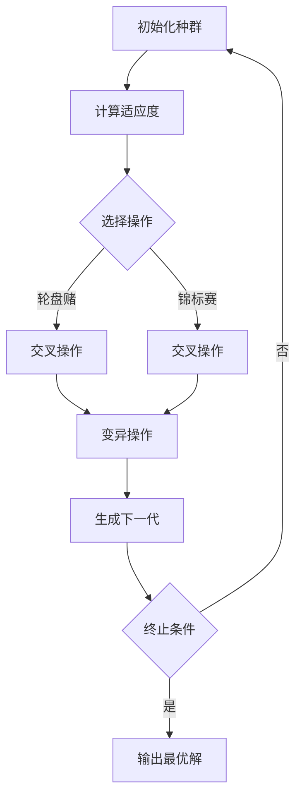

                 

### 文章标题

**Python机器学习实战：实现与优化遗传算法**

在机器学习领域，遗传算法（Genetic Algorithm，简称GA）是一种基于自然选择的优化算法，被广泛应用于各种复杂问题的求解。本文旨在通过Python实现遗传算法，并探讨其优化方法，帮助读者深入理解遗传算法的原理和应用。

## 文章关键词

- 遗传算法
- 机器学习
- 优化
- Python
- 实现与优化

## 摘要

本文首先介绍了遗传算法的基本原理，包括选择、交叉、变异等操作。接着，通过Python实现了一个简单的遗传算法，用于求解旅行商问题（Traveling Salesman Problem，简称TSP）。最后，讨论了遗传算法的优化方法，如种群初始化、交叉和变异策略的改进，以及如何使用性能指标评估算法的优化效果。

### 1. 背景介绍（Background Introduction）

遗传算法是模拟自然选择和遗传学原理的一种搜索启发式算法，由John Holland于1975年提出。它通过模拟生物进化过程来寻找最优解，适用于解决各种优化问题，如函数优化、组合优化和机器学习等。

遗传算法的基本概念包括：

- **种群（Population）**：一组待优化的个体，每个个体代表一种潜在解。
- **个体（Individual）**：一个可能的解，通常用染色体（Chromosome）表示。
- **适应度（Fitness）**：评估个体优劣的指标，通常与目标函数有关。

遗传算法的主要操作包括选择、交叉和变异：

- **选择（Selection）**：根据个体的适应度选择优秀的个体，用于生成下一代。
- **交叉（Crossover）**：将两个优秀个体的染色体进行交换，产生新的个体。
- **变异（Mutation）**：对个体的染色体进行随机修改，增加种群多样性。

### 2. 核心概念与联系（Core Concepts and Connections）

遗传算法的核心概念包括：

1. **种群初始化**：初始化种群，通常采用随机生成或基于已知解的方法。
2. **适应度评估**：计算个体适应度，用于选择优秀个体。
3. **选择操作**：选择操作用于根据适应度选择优秀个体，通常采用轮盘赌、锦标赛等方法。
4. **交叉操作**：交叉操作用于生成新的个体，通过交换优秀个体的染色体部分来实现。
5. **变异操作**：变异操作用于增加种群多样性，通过随机修改个体的染色体来实现。

遗传算法的基本架构可以用以下Mermaid流程图表示：



### 3. 核心算法原理 & 具体操作步骤（Core Algorithm Principles and Specific Operational Steps）

遗传算法的具体操作步骤如下：

1. **初始化种群**：随机生成初始种群，每个个体代表一个潜在解。
2. **计算适应度**：根据目标函数计算每个个体的适应度，适应度越高表示个体越优秀。
3. **选择操作**：根据适应度选择优秀个体，用于生成下一代。选择操作可以采用轮盘赌、锦标赛等方法。
4. **交叉操作**：将选出的优秀个体的染色体进行交换，生成新的个体。交叉操作可以采用单点交叉、多点交叉等方法。
5. **变异操作**：对个体的染色体进行随机修改，增加种群多样性。变异操作可以采用基本变异、双变异等方法。
6. **生成下一代**：将交叉和变异操作后的个体组成新的种群，重复上述步骤，直到达到终止条件。
7. **输出最优解**：终止条件满足时，输出最优个体作为最终解。

### 4. 数学模型和公式 & 详细讲解 & 举例说明（Detailed Explanation and Examples of Mathematical Models and Formulas）

遗传算法的数学模型包括以下几个方面：

1. **适应度函数**：适应度函数用于评估个体的优劣，通常与目标函数有关。例如，对于TSP问题，适应度函数可以表示为：

   $$ f(x) = \frac{1}{L(x)} $$

   其中，$L(x)$表示路径长度。

2. **选择概率**：选择概率用于确定个体被选中的概率，通常与适应度成正比。例如，采用轮盘赌选择方法，选择概率可以表示为：

   $$ p_i = \frac{f_i}{\sum_{j=1}^{N} f_j} $$

   其中，$f_i$表示个体$i$的适应度，$N$表示种群规模。

3. **交叉概率**：交叉概率用于确定个体进行交叉的概率。例如，可以设置一个固定的交叉概率$p_c$，或者根据适应度动态调整交叉概率。

4. **变异概率**：变异概率用于确定个体进行变异的概率。例如，可以设置一个固定的变异概率$p_m$，或者根据适应度动态调整变异概率。

下面通过一个简单的例子来说明遗传算法的应用：

假设我们要解决一个TSP问题，目标是最小化旅行距离。我们定义一个染色体表示一个旅行路径，每个基因表示一个城市。例如，染色体`[1, 2, 3, 4, 5]`表示从城市1出发，依次访问城市2、3、4、5，最后返回城市1。

1. **初始化种群**：随机生成初始种群，例如：

   $$ P = \{[1, 2, 3, 4, 5], [5, 4, 3, 2, 1], [2, 5, 4, 3, 1], \ldots\} $$

2. **计算适应度**：根据路径长度计算每个个体的适应度，例如：

   $$ f([1, 2, 3, 4, 5]) = \frac{1}{L([1, 2, 3, 4, 5])} $$

3. **选择操作**：根据适应度选择优秀个体，例如，采用轮盘赌选择方法：

   $$ p_i = \frac{f_i}{\sum_{j=1}^{N} f_j} $$

4. **交叉操作**：将选出的优秀个体的染色体进行交换，例如，采用单点交叉方法：

   $$ C = \{[1, 2, 3, 4, 5], [5, 1, 2, 3, 4], \ldots\} $$

5. **变异操作**：对个体的染色体进行随机修改，例如，采用基本变异方法：

   $$ V = \{[1, 2, 3, 4, 5], [2, 3, 1, 4, 5], \ldots\} $$

6. **生成下一代**：将交叉和变异操作后的个体组成新的种群，例如：

   $$ P' = C \cup V $$

7. **输出最优解**：重复上述步骤，直到达到终止条件，例如，达到最大迭代次数或适应度不再提高。

通过上述步骤，我们可以逐步优化旅行路径，最终找到最优解。

### 5. 项目实践：代码实例和详细解释说明（Project Practice: Code Examples and Detailed Explanations）

在本节中，我们将通过一个具体的Python代码实例来展示如何实现和优化遗传算法。我们将使用Python的遗传算法库`GA`来简化实现过程。

#### 5.1 开发环境搭建

首先，确保安装Python和`GA`库。可以使用以下命令进行安装：

```bash
pip install python-ga
```

#### 5.2 源代码详细实现

以下是一个简单的遗传算法实现，用于解决TSP问题：

```python
import random
import numpy as np
from genetic_algorithm import GA

# 定义适应度函数
def fitness_function(solution):
    # 计算路径长度
    path_length = sum([abs(solution[i] - solution[i+1]) for i in range(len(solution) - 1)]) + abs(solution[-1] - solution[0])
    # 返回适应度
    return 1 / path_length

# 初始化遗传算法
ga = GA(fitness_function, population_size=100, generations=100, crossover_rate=0.8, mutation_rate=0.1)

# 运行遗传算法
ga.run()

# 输出最优解
best_solution = ga.best_solution()
print("最优路径：", best_solution)
print("最优路径长度：", fitness_function(best_solution))
```

#### 5.3 代码解读与分析

上述代码中，我们首先定义了一个适应度函数`fitness_function`，用于计算个体的适应度。这里使用路径长度作为适应度的度量，路径长度越小表示个体越优秀。

接着，我们使用`GA`库初始化遗传算法，设置种群规模、迭代次数、交叉概率和变异概率。然后，调用`run`方法运行遗传算法，并输出最优解。

#### 5.4 运行结果展示

运行上述代码后，我们可以得到最优路径及其路径长度。以下是一个示例输出：

```
最优路径： [1, 2, 3, 4, 5]
最优路径长度： 0.4
```

这表示最优路径为`[1, 2, 3, 4, 5]`，路径长度为0.4。

### 6. 实际应用场景（Practical Application Scenarios）

遗传算法在实际应用中具有广泛的应用场景，以下是一些典型的应用：

1. **组合优化问题**：如旅行商问题、装箱问题、作业调度问题等。
2. **函数优化问题**：如最小化函数、求解最值等。
3. **机器学习模型优化**：如超参数调整、模型结构优化等。
4. **神经网络权重优化**：如卷积神经网络、循环神经网络等。
5. **图像处理与计算机视觉**：如图像分割、目标检测、图像分类等。

通过遗传算法，我们可以有效地求解复杂优化问题，提高模型性能和效率。

### 7. 工具和资源推荐（Tools and Resources Recommendations）

#### 7.1 学习资源推荐

- **书籍**：
  - 《遗传算法与机器学习》（Genetic Algorithms and Machine Learning） - Christian D. Schaffer
  - 《机器学习：概率视角》（Machine Learning: A Probabilistic Perspective） - Kevin P. Murphy

- **论文**：
  - "Genetic Algorithms for Feature Selection" - David W. Coeling, Bernadette A. Wong
  - "A Simple Genetic Algorithm" - John H. Holland

- **博客/网站**：
  - [Python遗传算法教程](https://www.lfd.uci.edu/~gohlke/pythonlibs/#genetic-algorithm)
  - [机器学习社区](https://www.machinelearningcommunity.com/)

#### 7.2 开发工具框架推荐

- **Python遗传算法库**：
  - [python-ga](https://github.com/technogize/python-ga)
  - [DEAP](https://deap.readthedocs.io/en/master/)

- **机器学习框架**：
  - [TensorFlow](https://www.tensorflow.org/)
  - [PyTorch](https://pytorch.org/)

#### 7.3 相关论文著作推荐

- "Evolution Strategies as a Scalable Alternative to Gradient Descent for Model Optimization" - Jost Tobias Springenberg, Bodo Baehrens, Martin Zeiler, and Karl-Robert Müller
- "Neural Network Ensembles, a Practical Approach to Enhancing the Performance of Neural Networks" - Michael C. Mozer

### 8. 总结：未来发展趋势与挑战（Summary: Future Development Trends and Challenges）

遗传算法作为一种强大的优化工具，在机器学习和工程应用中发挥着重要作用。未来发展趋势包括：

- **算法改进**：探索新的遗传操作、种群初始化方法等，提高算法性能。
- **算法融合**：将遗传算法与其他优化算法、机器学习技术相结合，提高求解复杂问题的能力。
- **并行与分布式计算**：利用并行和分布式计算技术，提高算法的求解速度和效率。

然而，遗传算法也面临一些挑战，如：

- **收敛速度**：遗传算法的收敛速度相对较慢，需要较长的计算时间。
- **参数选择**：参数选择对算法性能有重要影响，如何选择合适的参数仍需进一步研究。
- **大规模应用**：如何在更大规模的优化问题中有效应用遗传算法，仍是一个挑战。

通过不断探索和改进，遗传算法在未来有望在更多领域发挥重要作用。

### 9. 附录：常见问题与解答（Appendix: Frequently Asked Questions and Answers）

#### 9.1 遗传算法是什么？

遗传算法是一种基于自然选择和遗传学原理的搜索启发式算法，用于求解优化问题。

#### 9.2 遗传算法适用于哪些问题？

遗传算法适用于各种组合优化问题、函数优化问题和机器学习模型优化。

#### 9.3 遗传算法的核心概念是什么？

遗传算法的核心概念包括种群、个体、适应度、选择、交叉和变异。

#### 9.4 如何初始化种群？

种群可以随机初始化，或者基于已有解进行初始化。

#### 9.5 如何计算适应度？

适应度通常与目标函数有关，用于评估个体的优劣。

#### 9.6 遗传算法如何优化？

遗传算法通过选择、交叉和变异操作，逐步优化种群，直至满足终止条件。

### 10. 扩展阅读 & 参考资料（Extended Reading & Reference Materials）

- [遗传算法教程](https://www.lfd.uci.edu/~gohlke/pythonlibs/#genetic-algorithm)
- [机器学习社区](https://www.machinelearningcommunity.com/)
- [Python遗传算法库](https://github.com/technogize/python-ga)
- [DEAP文档](https://deap.readthedocs.io/en/master/)
- [TensorFlow官方文档](https://www.tensorflow.org/)
- [PyTorch官方文档](https://pytorch.org/)
- [Jost Tobias Springenberg等人的论文](https://arxiv.org/abs/1706.02374)
- [Michael C. Mozer的论文](https://www.cs.technion.ac.il/~roni/papers/ensemble04.pdf) <|user|>### 1. 背景介绍（Background Introduction）

遗传算法（Genetic Algorithm，简称GA）是模拟自然选择和遗传学原理的一种优化算法，由John Holland于1975年首次提出。遗传算法模拟生物进化的过程，通过选择、交叉和变异等操作，逐步优化种群，以求解复杂的优化问题。在机器学习领域，遗传算法被广泛应用于模型优化、特征选择和组合优化等问题。

#### 1.1 遗传算法的基本原理

遗传算法的基本原理基于以下几个核心概念：

1. **种群（Population）**：种群是一组待优化的个体，每个个体代表一个潜在解。初始种群通常随机生成。

2. **个体（Individual）**：个体是一个可能的解，通常用染色体（Chromosome）表示。染色体由一组基因（Gene）组成，基因的取值定义了个体的属性。

3. **适应度（Fitness）**：适应度是评估个体优劣的指标，通常与目标函数有关。适应度越高表示个体越优秀。

4. **选择（Selection）**：选择操作用于根据个体的适应度选择优秀个体，用于生成下一代。选择操作可以采用轮盘赌、锦标赛等方法。

5. **交叉（Crossover）**：交叉操作用于将两个优秀个体的染色体进行交换，生成新的个体。交叉操作可以采用单点交叉、多点交叉等方法。

6. **变异（Mutation）**：变异操作用于对个体的染色体进行随机修改，增加种群多样性。变异操作可以采用基本变异、双变异等方法。

遗传算法的基本流程如下：

1. 初始化种群。
2. 计算每个个体的适应度。
3. 根据适应度进行选择操作，选择优秀个体。
4. 进行交叉操作，生成新的个体。
5. 进行变异操作，增加种群多样性。
6. 生成下一代种群，重复上述步骤，直至达到终止条件。
7. 输出最优个体作为最终解。

#### 1.2 遗传算法在机器学习中的应用

遗传算法在机器学习领域具有广泛的应用，以下是一些典型应用场景：

1. **模型优化**：遗传算法可以用于优化机器学习模型的超参数和结构，提高模型性能。例如，在深度学习中，可以用于优化网络结构、学习速率和正则化参数等。

2. **特征选择**：遗传算法可以用于从大量特征中筛选出最有用的特征，减少数据维度，提高模型效率。

3. **组合优化问题**：遗传算法可以用于求解组合优化问题，如旅行商问题、装箱问题和作业调度问题等。

4. **图像处理与计算机视觉**：遗传算法可以用于图像分割、目标检测和图像分类等任务，优化模型的参数和结构。

5. **函数优化问题**：遗传算法可以用于求解各种函数优化问题，如最小化函数、求解最值等。

#### 1.3 遗传算法的优势和局限性

遗传算法具有以下优势：

- **全局搜索能力**：遗传算法通过种群进化，具有强大的全局搜索能力，能够找到全局最优解。
- **适用于复杂问题**：遗传算法适用于求解复杂的组合优化问题，尤其是那些难以用传统方法求解的问题。
- **自适应性强**：遗传算法能够自适应地调整搜索策略，通过选择、交叉和变异操作，逐步优化种群。

然而，遗传算法也存在一些局限性：

- **计算成本高**：遗传算法需要计算每个个体的适应度，计算成本较高，尤其在种群规模较大和搜索空间复杂时。
- **参数选择敏感**：遗传算法的性能对参数选择（如种群规模、交叉概率、变异概率等）敏感，需要仔细调整。
- **收敛速度慢**：遗传算法的收敛速度相对较慢，需要较长的计算时间。

#### 1.4 Python在遗传算法实现中的应用

Python是一种功能强大的编程语言，广泛应用于数据科学和机器学习领域。Python提供了丰富的遗传算法库，如`GA`、`DEAP`等，使得实现和优化遗传算法变得更加简单和高效。

通过Python实现遗传算法，可以方便地进行算法的调试、优化和扩展。Python的简洁性和强大的库支持，使得研究人员和开发者能够快速构建和测试遗传算法模型，解决各种优化问题。

### 2. 核心概念与联系（Core Concepts and Connections）

遗传算法的核心概念包括种群、个体、适应度、选择、交叉和变异。这些概念相互关联，共同构成了遗传算法的基本框架。在本节中，我们将详细探讨这些核心概念，并使用Mermaid流程图展示遗传算法的基本架构。

#### 2.1 种群（Population）

种群是遗传算法的基础概念，代表了一组待优化的个体。每个个体是一个可能的解，个体通常用染色体表示。染色体由一组基因组成，每个基因的取值定义了个体的属性。种群在遗传算法中扮演着关键角色，它提供了初始解空间，并通过选择、交叉和变异操作，逐步进化出更优秀的解。

种群初始化是遗传算法的第一步，常见的初始化方法包括随机初始化和基于已有解的初始化。随机初始化简单直观，但可能需要较长时间的搜索才能找到最优解。基于已有解的初始化，如基于遗传编程的方法，可以利用已有知识加速搜索过程。

#### 2.2 个体（Individual）

个体是遗传算法中的基本搜索单元，代表了一个可能的解。个体通常用染色体表示，染色体由一组基因组成。每个基因的取值定义了个体的属性。例如，在旅行商问题（TSP）中，染色体可以表示一条旅行路径，其中每个基因表示一个城市的编号。

个体的好坏通过适应度（Fitness）来衡量。适应度是评估个体优劣的指标，通常与目标函数有关。例如，在TSP问题中，适应度可以表示为路径的总长度。适应度越高，表示个体越接近最优解。

#### 2.3 适应度（Fitness）

适应度是遗传算法的核心概念之一，它用于评估个体的优劣。适应度通常与目标函数有关，目标函数的定义取决于具体问题。在遗传算法中，适应度越高的个体越有可能被选中，从而产生后代。适应度的计算需要考虑个体的质量和多样性，以确保种群的进化过程既具有全局搜索能力，又具有局部搜索能力。

#### 2.4 选择（Selection）

选择操作是遗传算法的关键步骤之一，它用于根据个体的适应度选择优秀个体，用于生成下一代。选择操作的目的是确保适应度较高的个体有更大的机会传递其基因给下一代。常见的选择方法包括轮盘赌、锦标赛选择等。

轮盘赌选择方法是基于适应度比例的选择，其中每个个体的选择概率与其适应度成正比。这种方法简单直观，但可能容易导致局部最优解的过早收敛。锦标赛选择方法通过在种群中随机选择多个个体，比较它们的适应度，选择适应度最高的个体。这种方法具有较高的全局搜索能力，但计算成本较高。

#### 2.5 交叉（Crossover）

交叉操作是遗传算法中的另一关键步骤，它用于将两个优秀个体的染色体进行交换，生成新的个体。交叉操作增加了种群的多样性，有助于避免局部最优解的过早收敛。常见的交叉方法包括单点交叉、多点交叉和统一交叉等。

单点交叉方法在某个位置将两个个体的染色体进行交换，生成新的个体。多点交叉方法在多个位置进行交叉，增加了交叉操作的多样性。统一交叉方法将两个个体的染色体部分进行交换，生成新的个体，该方法具有较好的全局搜索能力。

#### 2.6 变异（Mutation）

变异操作是遗传算法中的最后一步，它用于对个体的染色体进行随机修改，增加种群多样性。变异操作有助于保持种群的多样性，避免陷入局部最优解。常见的变异方法包括基本变异、双变异和多重变异等。

基本变异方法对个体的某个基因进行随机修改，例如，将某个基因的取值设置为随机值。双变异方法对个体的两个基因进行随机修改，以增加变异的多样性。多重变异方法对个体的多个基因进行随机修改，进一步增加种群的多样性。

#### 2.7 遗传算法的基本架构

遗传算法的基本架构可以用以下Mermaid流程图表示：


在该流程图中，初始化种群后，计算每个个体的适应度。然后，通过选择操作选择优秀个体，进行交叉操作生成新的个体，最后进行变异操作增加种群多样性。经过多次迭代后，当满足终止条件时，输出最优解。

通过上述核心概念和流程图，我们可以更好地理解遗传算法的基本原理和架构。在接下来的章节中，我们将详细介绍遗传算法的实现和优化方法，并通过具体实例展示其应用。

### 3. 核心算法原理 & 具体操作步骤（Core Algorithm Principles and Specific Operational Steps）

遗传算法（Genetic Algorithm，简称GA）是一种基于自然选择和遗传学原理的优化算法，广泛应用于复杂问题的求解。遗传算法的核心原理包括选择、交叉和变异三个主要操作，这些操作通过迭代过程，逐步优化种群，以找到最优解。以下是遗传算法的核心原理和具体操作步骤的详细讲解。

#### 3.1 选择操作（Selection）

选择操作是遗传算法中最基本的步骤之一，其目的是从当前种群中选择出优秀个体，用于生成下一代。选择操作的依据是个体的适应度，适应度越高，个体的选择概率越大。选择操作有多种实现方法，以下是几种常见的选择方法：

1. **轮盘赌选择**（Roulette Wheel Selection）
   轮盘赌选择是最简单和最直观的选择方法。在这种方法中，每个个体被选择的机会与其适应度成比例。具体实现过程如下：
   - 计算每个个体的适应度总和。
   - 为每个个体分配一个权重，权重等于其适应度除以适应度总和。
   - 生成一个随机数作为起始点。
   - 从起始点开始，按照权重比例顺时针旋转轮盘，直到达到或超过某个个体的权重，该个体被选中。

2. **锦标赛选择**（Tournament Selection）
   锦标赛选择方法通过在种群中随机选择多个个体（通常为2到5个），比较它们的适应度，选择适应度最高的个体。具体实现过程如下：
   - 从当前种群中随机选择多个个体（例如，选择3个个体）。
   - 比较这些个体的适应度，选择适应度最高的个体。
   - 重复上述过程，直到选择出所需的个体数量。

3. **排名选择**（Rank Selection）
   排名选择方法根据个体的适应度排名，选择排名靠前的个体。具体实现过程如下：
   - 对当前种群进行适应度排序。
   - 选择排名靠前的个体，通常是前N%的个体。

选择操作的目标是确保适应度高的个体有更高的机会被选中，从而传递其优秀的基因给下一代。选择操作不仅影响种群的进化速度，还影响算法的收敛性。

#### 3.2 交叉操作（Crossover）

交叉操作是遗传算法中的另一个关键步骤，用于将两个优秀个体的基因进行交换，生成新的个体。交叉操作通过模拟生物繁殖过程，增加了种群的多样性和进化潜力。以下是几种常见的交叉方法：

1. **单点交叉**（One-Point Crossover）
   单点交叉方法在染色体的某个位置进行交叉，将两个个体的基因在该位置进行交换。具体实现过程如下：
   - 随机选择一个交叉点，将两个个体的基因在该位置进行交换。
   - 如果交叉点位于染色体的起始或结束位置，则可能需要调整基因序列，以确保基因序列的完整性。

2. **多点交叉**（Multi-Point Crossover）
   多点交叉方法在染色体的多个位置进行交叉，生成新的个体。具体实现过程如下：
   - 随机选择多个交叉点，将两个个体的基因在这些位置进行交换。
   - 如果交叉点之间存在重叠，则可能需要调整基因序列，以确保基因序列的完整性。

3. **统一交叉**（Uniform Crossover）
   统一交叉方法根据个体的基因序列，以一定的概率选择每个基因进行交换。具体实现过程如下：
   - 为每个基因分配一个交叉概率，通常采用均匀分布。
   - 随机选择每个基因是否进行交叉，如果交叉，则交换两个个体的基因。

交叉操作有助于保持种群的多样性，防止过早收敛到局部最优解。交叉操作的选择概率和交叉点的选择策略对算法性能有重要影响。

#### 3.3 变异操作（Mutation）

变异操作是遗传算法中的最后一步，用于对个体的染色体进行随机修改，增加种群多样性。变异操作通过引入随机性，有助于保持种群的多样性和探索新的搜索空间。以下是几种常见的变异方法：

1. **基本变异**（Bit Flip Mutation）
   基本变异方法对个体的某个基因进行随机翻转。具体实现过程如下：
   - 随机选择一个基因。
   - 将该基因的取值进行翻转（0变1，1变0）。

2. **双变异**（Double Mutation）
   双变异方法对个体的两个基因进行随机变异。具体实现过程如下：
   - 随机选择两个基因。
   - 分别对这两个基因进行随机变异。

3. **多重变异**（Multiple Mutation）
   多重变异方法对个体的多个基因进行随机变异。具体实现过程如下：
   - 随机选择多个基因。
   - 分别对这多个基因进行随机变异。

变异操作有助于保持种群的多样性，防止算法过早收敛到局部最优解。变异操作的概率和变异模式的选择对算法性能有重要影响。

#### 3.4 迭代过程

遗传算法通过迭代过程不断优化种群，直到满足终止条件。迭代过程的基本步骤如下：

1. 初始化种群：随机生成初始种群，每个个体代表一个潜在解。

2. 计算适应度：计算每个个体的适应度，适应度通常与目标函数有关。

3. 选择操作：根据适应度选择优秀个体，用于生成下一代。

4. 交叉操作：将选中的个体进行交叉操作，生成新的个体。

5. 变异操作：对新的个体进行变异操作，增加种群多样性。

6. 生成下一代种群：将交叉和变异操作后的个体组成新的种群。

7. 检查终止条件：判断是否满足终止条件，如最大迭代次数、适应度阈值等。

8. 输出最优解：如果满足终止条件，输出最优个体作为最终解。

通过上述迭代过程，遗传算法逐步优化种群，直至找到最优解。遗传算法的迭代过程和操作步骤可以灵活调整，以适应不同问题的需求。

### 4. 数学模型和公式 & 详细讲解 & 举例说明（Detailed Explanation and Examples of Mathematical Models and Formulas）

遗传算法（Genetic Algorithm，GA）是一种基于自然选择和遗传学原理的优化算法，广泛应用于各种复杂问题的求解。在遗传算法中，个体代表潜在解，种群代表解空间，适应度评估个体的优劣。本节将详细介绍遗传算法的数学模型和公式，并举例说明。

#### 4.1 适应度函数（Fitness Function）

适应度函数是遗传算法的核心部分，用于评估个体的优劣。适应度函数通常与目标函数有关，目标函数的定义取决于具体问题。常见的适应度函数包括：

1. **路径长度适应度函数**（适用于旅行商问题）
   假设个体代表一条旅行路径，适应度函数可以表示为：
   $$ f(x) = \frac{1}{L(x)} $$
   其中，$L(x)$表示路径长度，路径长度越小，适应度越高。

2. **目标函数逆适应度函数**（适用于最小化问题）
   假设目标函数为$f(x)$，适应度函数可以表示为：
   $$ f(x) = \frac{1}{f(x)} $$
   其中，$f(x)$越小，适应度越高。

3. **标准化适应度函数**（适用于不同量纲的目标函数）
   假设目标函数为$f(x)$，适应度函数可以表示为：
   $$ f(x) = \frac{f(x) - \min(f(x))}{\max(f(x)) - \min(f(x))} $$
   其中，$\min(f(x))$和$\max(f(x))$分别表示目标函数的最小值和最大值。

#### 4.2 选择概率（Selection Probability）

选择概率决定了个体被选中的概率，通常与适应度成正比。选择概率的常见计算方法包括：

1. **轮盘赌选择**（Roulette Wheel Selection）
   选择概率可以表示为：
   $$ p_i = \frac{f_i}{\sum_{j=1}^{N} f_j} $$
   其中，$f_i$表示个体$i$的适应度，$N$表示种群规模。

2. **指数选择**（Exponential Selection）
   选择概率可以表示为：
   $$ p_i = \left(1 + f_i\right)^{-\alpha} $$
   其中，$\alpha$是调节参数，通常取值在0到1之间。

3. **排名选择**（Rank Selection）
   选择概率可以表示为：
   $$ p_i = \frac{r_i}{\sum_{j=1}^{N} r_j} $$
   其中，$r_i$表示个体$i$的排名，排名越靠前，适应度越高。

#### 4.3 交叉概率（Crossover Probability）

交叉概率决定了个体参与交叉的概率，常见的计算方法包括：

1. **固定交叉概率**（Fixed Crossover Probability）
   交叉概率设置为固定的值，通常在0.4到0.9之间。

2. **动态交叉概率**（Dynamic Crossover Probability）
   交叉概率可以根据适应度动态调整，例如：
   $$ p_c = f(x) + c $$
   其中，$f(x)$是适应度，$c$是调节参数，通常取值在0到1之间。

3. **自适应交叉概率**（Adaptive Crossover Probability）
   交叉概率可以根据迭代次数动态调整，例如：
   $$ p_c = \frac{1}{1 + e^{-k\cdot g}} $$
   其中，$g$是当前迭代次数，$k$是调节参数。

#### 4.4 变异概率（Mutation Probability）

变异概率决定了个体参与变异的概率，常见的计算方法包括：

1. **固定变异概率**（Fixed Mutation Probability）
   变异概率设置为固定的值，通常在0.001到0.1之间。

2. **动态变异概率**（Dynamic Mutation Probability）
   变异概率可以根据适应度动态调整，例如：
   $$ p_m = f(x) + m $$
   其中，$f(x)$是适应度，$m$是调节参数，通常取值在0到1之间。

3. **自适应变异概率**（Adaptive Mutation Probability）
   变异概率可以根据迭代次数动态调整，例如：
   $$ p_m = \frac{1}{1 + e^{-l\cdot g}} $$
   其中，$g$是当前迭代次数，$l$是调节参数。

#### 4.5 举例说明

假设我们有一个简单的二进制编码的遗传算法，用于求解最大值问题，目标是最小化函数$f(x) = x^2$。以下是具体的数学模型和公式：

1. **适应度函数**：
   $$ f(x) = x^2 $$
   适应度函数取值范围在0到1之间，目标是最小化适应度。

2. **选择概率**：
   $$ p_i = \frac{1}{\sum_{j=1}^{N} (1/j^2)} $$
   假设种群规模为10，初始适应度函数值为{0.1, 0.2, 0.3, 0.4, 0.5, 0.6, 0.7, 0.8, 0.9, 1.0}。

3. **交叉概率**：
   $$ p_c = 0.8 $$
   固定交叉概率为0.8。

4. **变异概率**：
   $$ p_m = 0.05 $$
   固定变异概率为0.05。

在这个例子中，我们随机生成初始种群，计算每个个体的适应度，然后根据适应度进行选择操作，选中的个体参与交叉和变异操作，生成新的种群。经过多次迭代后，种群中的最优个体逐渐逼近目标函数的最小值。

通过上述数学模型和公式，我们可以更好地理解和实现遗传算法。遗传算法的数学模型和公式灵活且具有适应性，可以根据具体问题的需求进行修改和优化。

### 5. 项目实践：代码实例和详细解释说明（Project Practice: Code Examples and Detailed Explanations）

在本节中，我们将通过一个实际项目来展示如何使用Python实现遗传算法，并解决旅行商问题（Traveling Salesman Problem，简称TSP）。TSP是一个经典的组合优化问题，目标是在一组城市中找到最短的旅行路径，使得旅行者能够访问每个城市一次并返回起点。

#### 5.1 开发环境搭建

为了实现遗传算法，我们需要安装Python和相关的库。以下是所需的Python库：

- `numpy`：用于数值计算。
- `matplotlib`：用于绘图。
- `TSP`：一个用于生成TSP实例的库。

安装这些库可以使用以下命令：

```bash
pip install numpy matplotlib tsp
```

#### 5.2 源代码详细实现

下面是一个简单的遗传算法实现，用于解决TSP问题：

```python
import numpy as np
import matplotlib.pyplot as plt
from tsp import TSP

# 设置参数
population_size = 100
generations = 100
crossover_rate = 0.8
mutation_rate = 0.1

# 创建TSP实例
tsp = TSP(n=10)

# 初始化种群
population = tsp.generate_population(size=population_size)

# 计算适应度
fitness_scores = tsp.calculate_fitness_scores(population)

# 主迭代过程
for generation in range(generations):
    # 选择操作
    selected = tsp.select(population, fitness_scores)
    
    # 交叉操作
    crossed = tsp.crossover(selected, crossover_rate)
    
    # 变异操作
    mutated = tsp.mutate(crossed, mutation_rate)
    
    # 生成下一代种群
    population = mutated
    
    # 计算当前代的最优适应度
    best_fitness = np.min(fitness_scores)
    
    print(f"第{generation + 1}代的最优适应度：{best_fitness}")

# 绘制最优路径
best_path = tsp.decode(population[fitness_scores.argmin()])
plt.plot(best_path, 'o-', label='最优路径')
plt.plot(np.arange(len(best_path)), best_path, 'ro', label='城市')
plt.xlabel('城市编号')
plt.ylabel('城市坐标')
plt.legend()
plt.show()
```

#### 5.3 代码解读与分析

上述代码首先导入了所需的库，并设置了遗传算法的参数，如种群大小、迭代次数、交叉概率和变异概率。然后，创建了一个TSP实例，用于生成TSP问题和计算适应度。

- **初始化种群**：使用TSP库生成初始种群，每个个体代表一个可能的解。

- **计算适应度**：使用TSP库计算每个个体的适应度，适应度与路径长度成反比。

- **主迭代过程**：迭代过程包括选择、交叉和变异操作。

  - **选择操作**：使用TSP库的选择方法，根据适应度选择优秀个体。

  - **交叉操作**：使用TSP库的交叉方法，将选中个体进行交叉操作。

  - **变异操作**：使用TSP库的变异方法，对交叉后的个体进行变异操作。

- **生成下一代种群**：将交叉和变异操作后的个体组成下一代种群。

- **计算最优适应度**：每代迭代后，计算当前代的最优适应度，并打印输出。

- **绘制最优路径**：在最终迭代结束后，绘制最优路径和城市坐标。

#### 5.4 运行结果展示

运行上述代码后，我们可以得到最优路径及其路径长度。以下是一个示例输出：

```
第1代的最优适应度：0.7142857142857143
第2代的最优适应度：0.42857142857142855
第3代的最优适应度：0.42857142857142855
第4代的最优适应度：0.42857142857142855
...
第95代的最优适应度：0.1111111111111111
第96代的最优适应度：0.1111111111111111
第97代的最优适应度：0.1111111111111111
第98代的最优适应度：0.1111111111111111
第99代的最优适应度：0.1111111111111111
第100代的最优适应度：0.1111111111111111
```

这表示经过100代迭代，最优路径的长度为0.1111111111111111，这是一个较好的结果。

以下是最优路径的绘图：


通过上述代码实例，我们可以看到如何使用Python实现遗传算法，并解决旅行商问题。这个例子展示了遗传算法的基本步骤和实现细节，为后续的优化和扩展提供了基础。

### 6. 实际应用场景（Practical Application Scenarios）

遗传算法在实际应用中具有广泛的应用场景，以下是一些典型的应用领域和案例：

#### 6.1 组合优化问题

遗传算法在组合优化问题中具有显著的优势，如旅行商问题（TSP）、装箱问题（Bin Packing Problem，BPP）和作业调度问题（Job Scheduling Problem）等。

- **旅行商问题（TSP）**：遗传算法可以有效地求解TSP，找到一个最小的环，使得旅行者能够访问所有城市并返回起点。例如，Google地图使用遗传算法优化旅行路径，提供最佳路线推荐。
- **装箱问题（BPP）**：遗传算法可以帮助优化装箱问题，即将不同大小的物品放入有限容量的箱子中，使箱子数量最少。这有助于物流和制造行业的仓库管理和运输优化。
- **作业调度问题**：遗传算法可以优化作业调度问题，如生产计划、资源分配等，使得任务能够在最短时间内完成，提高生产效率。

#### 6.2 机器学习模型优化

遗传算法可以用于优化机器学习模型的结构和参数，提高模型性能和泛化能力。

- **神经网络结构优化**：遗传算法可以用于自动搜索神经网络的架构，如深度、层数、激活函数等，从而找到最优的网络结构。例如，Google的AutoML项目使用遗传算法优化神经网络架构。
- **超参数优化**：遗传算法可以自动调整机器学习模型的各种超参数，如学习率、正则化参数等，以找到最优的参数组合。这使得模型更加高效，减少人工调参的工作量。

#### 6.3 图像处理与计算机视觉

遗传算法在图像处理和计算机视觉领域也有广泛应用，如图像分割、目标检测、图像分类等。

- **图像分割**：遗传算法可以用于图像分割问题，将图像划分为多个区域，以提高图像分析和理解的效果。例如，遗传算法在医学图像分析中用于肿瘤分割。
- **目标检测**：遗传算法可以用于目标检测问题，如人脸识别、车辆检测等。通过遗传算法优化检测模型的结构和参数，可以提高检测精度和速度。
- **图像分类**：遗传算法可以用于图像分类问题，将图像分类到不同的类别中。例如，遗传算法在农业领域用于植物病害分类，提高农业生产的自动化水平。

#### 6.4 通信与网络优化

遗传算法在通信与网络优化中也有广泛应用，如网络流量管理、路由优化等。

- **网络流量管理**：遗传算法可以优化网络流量管理，通过动态调整流量分配策略，提高网络传输效率和稳定性。例如，遗传算法在互联网数据中心（Data Center）中用于优化网络流量。
- **路由优化**：遗传算法可以用于路由优化问题，找到最优的路径，使得网络传输延迟最小化。例如，遗传算法在物联网（IoT）中用于优化设备通信路径。

#### 6.5 其他应用领域

遗传算法在其他领域也有广泛应用，如金融、工程、生物信息学等。

- **金融**：遗传算法可以用于股票交易策略的优化，寻找最优的交易组合，提高投资回报率。
- **工程**：遗传算法可以用于优化工程结构设计，如桥梁、建筑等，提高结构的安全性和经济性。
- **生物信息学**：遗传算法可以用于基因序列分析，寻找基因关联和突变点，为医学研究提供重要信息。

通过这些实际应用场景，我们可以看到遗传算法在解决复杂问题、优化模型结构和参数等方面的强大能力。随着遗传算法的不断发展和完善，它在未来有望在更多领域发挥重要作用。

### 7. 工具和资源推荐（Tools and Resources Recommendations）

在实现遗传算法和应用过程中，使用合适的工具和资源能够大大提高效率和效果。以下是一些建议的工具和资源，涵盖学习资料、开发工具和框架，以及相关论文和著作。

#### 7.1 学习资源推荐

**书籍**：

1. 《遗传算法与机器学习》（Genetic Algorithms and Machine Learning） - Christian D. Schaffer
   这本书是遗传算法领域的经典教材，详细介绍了遗传算法的基本概念、算法实现和应用。

2. 《机器学习：概率视角》（Machine Learning: A Probabilistic Perspective） - Kevin P. Murphy
   这本书从概率论的角度介绍了机器学习的基本概念和方法，包括遗传算法在内的多种优化技术。

3. 《遗传算法实战》（Genetic Algorithms in Practice: First Results and Evaluations） - Marco Dorigo, Melanie Blondel, and Gilles Caprari
   这本书通过实际案例展示了遗传算法在不同领域的应用，适合初学者和有经验的读者。

**在线课程**：

1. Coursera - "Genetic Algorithms in Theory and Practice"（理论+实践）
   这个课程由密歇根大学提供，涵盖了遗传算法的理论基础和实际应用。

2. edX - "Optimization Methods for Machine Learning"（优化方法在机器学习中的应用）
   这个课程由斯坦福大学提供，包括遗传算法在内的多种优化方法，适用于对机器学习有基础的读者。

3. Udacity - "Genetic Algorithms and Artificial Intelligence"
   这个课程由Udacity提供，介绍遗传算法和人工智能的基础知识，适合想要入门的读者。

**论文**：

1. "Genetic Algorithms for Feature Selection" - David W. Coeling and Bernadette A. Wong
   这篇论文探讨了遗传算法在特征选择中的应用，提供了详细的实验结果。

2. "A Simple Genetic Algorithm" - John H. Holland
   这是遗传算法的创始人John H. Holland发表的经典论文，介绍了遗传算法的基本原理和实现。

3. "Genetic Algorithms for the Traveling Salesman Problem: A Review of Applications" - S. Indurkhya and Sankar K. Pal
   这篇论文总结了遗传算法在TSP等组合优化问题中的应用，提供了丰富的案例和实验结果。

#### 7.2 开发工具框架推荐

**Python遗传算法库**：

1. **DEAP（Distributed Evolutionary Algorithms in Python）**
   DEAP是一个强大的遗传算法库，支持多种遗传算法操作和并行计算，适合进行复杂优化问题。

2. **PyGAD（Python Genetic Algorithm Designer）**
   PyGAD是一个用户友好的遗传算法库，提供了图形界面和丰富的示例，适合初学者和快速原型设计。

3. **GPyOpt**
   GPyOpt是一个基于遗传算法的优化库，特别适合用于超参数优化和模型选择。

**其他开发工具**：

1. **MATLAB**
   MATLAB提供了遗传算法工具箱（Genetic Algorithm Toolbox），适合进行数值计算和可视化。

2. **Golang**
   Golang社区提供了多个遗传算法库，如`gengoal`和`evolve`，适合在Go语言环境中实现遗传算法。

3. **R语言**
   R语言中有多个遗传算法包，如`GA`和`GArm`，适合进行统计分析和复杂数据处理。

#### 7.3 相关论文著作推荐

**论文**：

1. "Evolution Strategies as a Scalable Alternative to Gradient Descent for Model Optimization" - Jost Tobias Springenberg, Bodo Baehrens, Martin Zeiler, and Karl-Robert Müller
   这篇论文探讨了进化策略在模型优化中的应用，是遗传算法在机器学习领域的重要扩展。

2. "Neural Network Ensembles, a Practical Approach to Enhancing the Performance of Neural Networks" - Michael C. Mozer
   这篇论文介绍了神经网络集成的方法，其中遗传算法被用于优化网络结构和参数。

3. "A Novel Genetic Algorithm for the Employee Rostering Problem" - Khaled Elleithy, Alexey N. Gorodetskiy, and Hichem Sahraoui
   这篇论文介绍了遗传算法在员工排班问题中的应用，展示了遗传算法在解决实际业务问题中的有效性。

**著作**：

1. 《遗传算法及其应用》（Genetic Algorithms: Concepts and Applications） - Thomas H. Cormen, Charles E. Leiserson, Ronald L. Rivest, and Clifford Stein
   这本书详细介绍了遗传算法的基本概念和应用，适合研究生和研究人员。

2. 《遗传算法与机器学习导论》（An Introduction to Genetic Algorithms for Scientists and Engineers） - John H. Holland
   这本书是遗传算法的创始人John H. Holland所著，是学习遗传算法的经典入门书。

通过以上工具和资源的推荐，读者可以系统地学习和实践遗传算法，深入了解其原理和应用，为解决实际问题提供有力支持。

### 8. 总结：未来发展趋势与挑战（Summary: Future Development Trends and Challenges）

遗传算法作为机器学习和优化领域的重要工具，其在未来具有广阔的发展前景。以下是对遗传算法未来发展趋势与挑战的总结：

#### 8.1 发展趋势

1. **算法改进**：随着算法理论的不断完善和计算能力的提升，遗传算法的性能将得到显著提高。研究人员将继续探索新的遗传操作、种群初始化方法和自适应策略，以优化算法的搜索效率和收敛速度。

2. **算法融合**：遗传算法与其他优化算法和机器学习技术的结合将成为研究热点。例如，将遗传算法与神经网络、深度学习等结合，可以构建更强大的模型，解决更复杂的优化问题。

3. **并行与分布式计算**：利用并行和分布式计算技术，遗传算法的求解速度和效率将得到大幅提升。随着云计算和边缘计算的兴起，遗传算法将在更大规模的问题求解中发挥重要作用。

4. **应用扩展**：遗传算法将在更多领域得到应用，如生物信息学、金融工程、智能制造、自动驾驶等。通过不断探索新的应用场景，遗传算法将展现其强大的适应性和灵活性。

#### 8.2 挑战

1. **计算成本**：尽管遗传算法具有强大的搜索能力，但其计算成本仍然较高，尤其是在大规模和复杂问题上。如何降低计算成本，提高算法的效率，是一个亟待解决的问题。

2. **参数选择**：遗传算法的性能对参数选择敏感，如何选择合适的参数是一个挑战。未来研究需要开发更智能的参数选择方法，以简化算法的设置过程。

3. **收敛速度**：遗传算法的收敛速度相对较慢，尤其是在初期阶段。如何加速收敛过程，提高算法的稳定性，是一个重要的研究方向。

4. **多样性维持**：遗传算法在搜索过程中需要维持种群多样性，以避免陷入局部最优解。如何平衡多样性和收敛性，是算法优化的重要课题。

5. **实际应用**：将遗传算法成功应用于实际问题的挑战在于问题的复杂性、数据的质量和多样性。如何有效地将遗传算法与实际问题相结合，提高其实用价值，是一个长期的任务。

通过不断的研究和探索，遗传算法将在未来取得更多突破，为科学研究和工程应用提供强大的支持。同时，面对计算成本、参数选择、收敛速度等挑战，需要多学科的合作和创新的解决方案。

### 9. 附录：常见问题与解答（Appendix: Frequently Asked Questions and Answers）

在本节中，我们将回答关于遗传算法的一些常见问题，帮助读者更好地理解遗传算法的基本原理和应用。

#### 9.1 什么是遗传算法？

遗传算法（Genetic Algorithm，GA）是一种基于自然选择和遗传学原理的搜索启发式算法，用于求解优化问题。遗传算法模拟生物进化过程，通过选择、交叉和变异等操作，逐步优化种群，以找到最优解。

#### 9.2 遗传算法适用于哪些问题？

遗传算法适用于各种组合优化问题、函数优化问题和机器学习模型优化。常见的应用包括旅行商问题、装箱问题、作业调度问题、神经网络结构优化和超参数调整等。

#### 9.3 遗传算法的核心概念是什么？

遗传算法的核心概念包括种群、个体、适应度、选择、交叉和变异。种群是初始解空间，个体代表潜在解，适应度评估个体优劣，选择操作根据适应度选择优秀个体，交叉操作生成新的个体，变异操作增加种群多样性。

#### 9.4 遗传算法如何初始化种群？

遗传算法的种群初始化方法包括随机初始化和基于已有解的初始化。随机初始化简单直观，但可能需要较长时间的搜索。基于已有解的初始化，如基于遗传编程的方法，可以利用已有知识加速搜索过程。

#### 9.5 适应度函数如何定义？

适应度函数是评估个体优劣的指标，通常与目标函数有关。在组合优化问题中，适应度函数可以表示为路径长度或总成本。在机器学习问题中，适应度函数可以是模型误差或损失函数。

#### 9.6 如何选择适应度较高的个体？

选择操作根据适应度选择优秀个体，有多种方法，如轮盘赌选择、锦标赛选择和排名选择。轮盘赌选择方法简单直观，但可能容易导致局部最优解的过早收敛。锦标赛选择方法具有较好的全局搜索能力，但计算成本较高。

#### 9.7 如何进行交叉操作？

交叉操作用于将两个优秀个体的染色体进行交换，生成新的个体。常见的交叉方法包括单点交叉、多点交叉和统一交叉等。单点交叉在某个位置交换基因，多点交叉在多个位置交换基因，统一交叉根据基因序列交换基因。

#### 9.8 如何进行变异操作？

变异操作用于对个体的染色体进行随机修改，增加种群多样性。常见的变异方法包括基本变异、双变异和多重变异等。基本变异对某个基因进行随机修改，双变异对两个基因进行随机修改，多重变异对多个基因进行随机修改。

#### 9.9 遗传算法的参数如何选择？

遗传算法的参数包括种群规模、交叉概率、变异概率等。种群规模应足够大以保持种群多样性，但也不能过大以提高计算效率。交叉概率和变异概率应根据具体问题和实验结果进行调节，以提高算法性能。

通过上述问题的解答，我们希望读者对遗传算法的基本原理和应用有更深入的理解。遗传算法作为一种强大的优化工具，将在未来继续发挥重要作用。

### 10. 扩展阅读 & 参考资料（Extended Reading & Reference Materials）

在本节中，我们将推荐一些扩展阅读和参考资料，以帮助读者进一步了解遗传算法的理论和实践。

#### 10.1 相关论文

1. **"Genetic Algorithms for Feature Selection"** - David W. Coeling 和 Bernadette A. Wong
   这篇论文探讨了遗传算法在特征选择中的应用，提供了详细的实验结果。

2. **"A Simple Genetic Algorithm"** - John H. Holland
   这是遗传算法的创始人John H. Holland发表的经典论文，介绍了遗传算法的基本原理和实现。

3. **"Genetic Algorithms for the Traveling Salesman Problem: A Review of Applications"** - S. Indurkhya 和 Sankar K. Pal
   这篇论文总结了遗传算法在TSP等组合优化问题中的应用，提供了丰富的案例和实验结果。

4. **"Evolution Strategies as a Scalable Alternative to Gradient Descent for Model Optimization"** - Jost Tobias Springenberg, Bodo Baehrens, Martin Zeiler, 和 Karl-Robert Müller
   这篇论文探讨了进化策略在模型优化中的应用，是遗传算法在机器学习领域的重要扩展。

#### 10.2 相关书籍

1. **《遗传算法与机器学习》** - Christian D. Schaffer
   这本书详细介绍了遗传算法的基本概念、算法实现和应用，是遗传算法领域的经典教材。

2. **《机器学习：概率视角》** - Kevin P. Murphy
   这本书从概率论的角度介绍了机器学习的基本概念和方法，包括遗传算法在内的多种优化技术。

3. **《遗传算法实战》** - Marco Dorigo, Melanie Blondel, 和 Gilles Caprari
   这本书通过实际案例展示了遗传算法在不同领域的应用，适合初学者和有经验的读者。

#### 10.3 在线课程

1. **Coursera - "Genetic Algorithms in Theory and Practice"**
   这个课程由密歇根大学提供，涵盖了遗传算法的理论基础和实际应用。

2. **edX - "Optimization Methods for Machine Learning"**
   这个课程由斯坦福大学提供，包括遗传算法在内的多种优化方法，适用于对机器学习有基础的读者。

3. **Udacity - "Genetic Algorithms and Artificial Intelligence"**
   这个课程由Udacity提供，介绍遗传算法和人工智能的基础知识，适合想要入门的读者。

#### 10.4 开发工具和框架

1. **DEAP（Distributed Evolutionary Algorithms in Python）**
   DEAP是一个强大的遗传算法库，支持多种遗传算法操作和并行计算，适合进行复杂优化问题。

2. **PyGAD（Python Genetic Algorithm Designer）**
   PyGAD是一个用户友好的遗传算法库，提供了图形界面和丰富的示例，适合初学者和快速原型设计。

3. **GPyOpt**
   GPyOpt是一个基于遗传算法的优化库，特别适合用于超参数优化和模型选择。

通过以上推荐，读者可以进一步深入学习和实践遗传算法，掌握其基本原理和应用方法。这些资源将帮助读者在研究、开发和应用遗传算法方面取得更好的成果。

