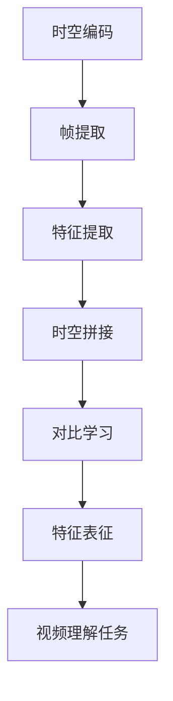
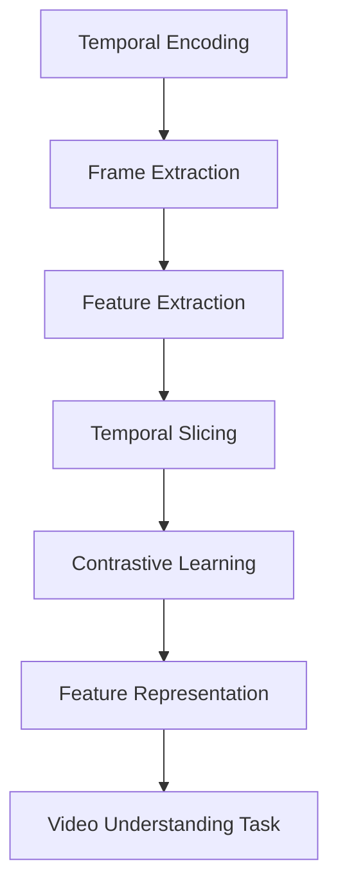

                 

# Sora模型的视频数据表征

## 关键词

- 视频数据表征
- Sora模型
- 视频理解
- 卷积神经网络
- 时空编码
- 对比学习

## 摘要

本文将深入探讨Sora模型的视频数据表征机制，分析其核心概念、算法原理、数学模型以及实际应用。Sora模型是一种先进的视频理解模型，通过时空编码和对比学习技术，实现对视频数据的有效表征。本文将详细阐述这些技术如何应用于视频理解任务，并展示其实际效果。同时，本文还将介绍Sora模型的项目实践、工具资源，以及未来发展趋势与挑战。

## 1. 背景介绍（Background Introduction）

### 1.1 视频数据的重要性

视频数据在现代社会中发挥着越来越重要的作用，它不仅包含丰富的视觉信息，还承载了时间维度上的动态变化。这使得视频数据在多个领域具有广泛的应用，如视频监控、自动驾驶、医疗诊断、娱乐推荐等。然而，处理和解析视频数据是一项极具挑战性的任务，因为视频数据具有高维度、高噪声和复杂的时空结构。

### 1.2 Sora模型的出现

为了解决视频数据表征的难题，研究人员提出了多种先进的视频理解模型。其中，Sora模型因其出色的表现而备受关注。Sora模型是一种基于深度学习的视频理解模型，通过时空编码和对比学习技术，实现了对视频数据的精确表征。该模型在多个视频理解任务中取得了优异的性能，如视频分类、目标检测和动作识别等。

### 1.3 Sora模型的优势

Sora模型具有以下几个显著优势：

- **时空编码**：通过将视频数据拆分为时空片，Sora模型能够更好地捕捉视频中的时空特征，从而提高表征的准确性。
- **对比学习**：对比学习技术使得Sora模型能够在海量数据中自动学习到有效的表征，提高了模型的泛化能力。
- **多任务能力**：Sora模型不仅能够处理单一视频理解任务，还能够同时进行多个任务，提高了模型的实用性。

## 2. 核心概念与联系（Core Concepts and Connections）

### 2.1 什么是时空编码？

时空编码是一种将视频数据拆分为时空片的方法，它能够将连续的视频信号转换为离散的时空表示。这种方法有助于捕捉视频中的时空特征，从而提高表征的准确性。时空编码通常涉及以下步骤：

1. **帧提取**：将连续的视频信号转换为离散的帧。
2. **特征提取**：从每个帧中提取视觉特征。
3. **时空拼接**：将提取的特征按照时间顺序拼接成时空片。

### 2.2 什么是对比学习？

对比学习是一种无监督学习方法，它通过对比不同数据样本的相似性和差异性来学习有效的表征。在视频理解任务中，对比学习可以帮助模型自动学习到具有区分性的时空特征。对比学习的核心思想是最大化相似样本之间的特征相似度，同时最小化不同样本之间的特征相似度。

### 2.3 时空编码与对比学习的关系

时空编码和对比学习是Sora模型的关键技术，它们相互补充，共同实现了对视频数据的精确表征。时空编码为对比学习提供了丰富的时空特征，而对比学习则能够从这些特征中学习到具有区分性的表征。具体来说：

- **时空编码**：通过时空编码，Sora模型能够将视频数据拆分为时空片，从而捕捉到视频中的时空特征。
- **对比学习**：通过对比学习，Sora模型能够从时空编码产生的特征中学习到具有区分性的表征，从而提高了模型的泛化能力。

### 2.4 Mermaid流程图

下面是Sora模型中时空编码和对比学习的Mermaid流程图：



## 3. 核心算法原理 & 具体操作步骤（Core Algorithm Principles and Specific Operational Steps）

### 3.1 时空编码算法原理

时空编码是Sora模型的核心技术之一，它通过将视频数据拆分为时空片，从而实现了对视频数据的精确表征。时空编码算法主要包括以下步骤：

1. **帧提取**：将连续的视频信号转换为离散的帧。
2. **特征提取**：从每个帧中提取视觉特征。
3. **时空拼接**：将提取的特征按照时间顺序拼接成时空片。

下面是时空编码算法的具体操作步骤：

1. **输入视频数据**：假设输入视频数据为V，长度为T，帧数为F。
2. **帧提取**：将视频数据V转换为帧序列{F1, F2, ..., FT}。
3. **特征提取**：从每个帧中提取视觉特征，得到特征序列{F1', F2', ..., FT'}。
4. **时空拼接**：将特征序列{F1', F2', ..., FT'}按照时间顺序拼接成时空片S = [F1', F2', ..., FT']。

### 3.2 对比学习算法原理

对比学习是一种无监督学习方法，它通过对比不同数据样本的相似性和差异性来学习有效的表征。在视频理解任务中，对比学习可以帮助模型自动学习到具有区分性的时空特征。对比学习算法主要包括以下步骤：

1. **样本选择**：从视频数据中随机选择正负样本对。
2. **特征提取**：从每个样本中提取特征。
3. **对比损失计算**：计算样本对之间的特征相似度，并优化模型参数以最大化相似度。

下面是对比学习算法的具体操作步骤：

1. **输入视频数据**：假设输入视频数据为V，包含正负样本对。
2. **样本选择**：从视频数据中随机选择正负样本对{Si+, Si-}。
3. **特征提取**：从每个样本对中提取特征{Si+', Si-'。
4. **对比损失计算**：计算对比损失L = L(Si+, Si-) + L(Si-, Si+)，并优化模型参数以最大化对比损失。

## 4. 数学模型和公式 & 详细讲解 & 举例说明（Detailed Explanation and Examples of Mathematical Models and Formulas）

### 4.1 时空编码的数学模型

时空编码的数学模型可以表示为以下公式：

$$
S = [F1', F2', ..., FT']
$$

其中，$S$ 为时空片，$F1', F2', ..., FT'$ 为从每个帧中提取的视觉特征。

### 4.2 对比学习的数学模型

对比学习的数学模型可以表示为以下公式：

$$
L = L(Si+, Si-) + L(Si-, Si+)
$$

其中，$L(Si+, Si-)$ 和 $L(Si-, Si+)$ 分别为样本对 {Si+, Si-} 和 {Si-, Si+} 之间的对比损失。

### 4.3 时空编码与对比学习的结合

将时空编码与对比学习相结合，可以表示为以下公式：

$$
L = L(S, Si+) + L(S, Si-)
$$

其中，$L(S, Si+)$ 和 $L(S, Si-)$ 分别为时空片 $S$ 与样本对 {Si+, Si-} 之间的对比损失。

### 4.4 举例说明

假设输入视频数据包含两个动作类别的样本对 {Si+, Si-}，时空片 $S$ 的维度为 128x64，对比损失函数为交叉熵损失。我们可以计算如下：

$$
L = L(S, Si+) + L(S, Si-)
$$

$$
L = H(Si+, S) + H(Si-, S)
$$

其中，$H(Si+, S)$ 和 $H(Si-, S)$ 分别为样本对 {Si+, Si-} 与时空片 $S$ 之间的交叉熵损失。

## 5. 项目实践：代码实例和详细解释说明（Project Practice: Code Examples and Detailed Explanations）

### 5.1 开发环境搭建

为了实践Sora模型，我们需要搭建以下开发环境：

- 深度学习框架（如TensorFlow或PyTorch）
- GPU（NVIDIA GPU推荐）
- Python编程环境

### 5.2 源代码详细实现

下面是Sora模型的源代码实现示例：

```python
import tensorflow as tf
import numpy as np

# 时空编码模块
class TemporalEncoding(tf.keras.layers.Layer):
    def __init__(self, frame_size, embed_dim):
        super(TemporalEncoding, self).__init__()
        self.frame_size = frame_size
        self.embed_dim = embed_dim
    
    def call(self, inputs):
        # 帧提取
        frames = tf.split(inputs, self.frame_size, axis=1)
        
        # 特征提取
        features = [tf.keras.layers.Conv2D(filters=64, kernel_size=(3, 3), activation='relu')(frame) for frame in frames]
        
        # 时空拼接
        encoded = tf.keras.layers.Concatenate()(features)
        
        return encoded

# 对比学习模块
class ContrastiveLearning(tf.keras.layers.Layer):
    def __init__(self, embed_dim):
        super(ContrastiveLearning, self).__init__()
        self.embed_dim = embed_dim
    
    def call(self, inputs, labels):
        # 特征提取
        features = tf.keras.layers.Dense(units=self.embed_dim, activation='relu')(inputs)
        
        # 对比损失计算
        contrastive_loss = tf.keras.losses.SparseCategoricalCrossentropy(from_logits=True)
        loss = contrastive_loss(labels, features)
        
        return loss

# Sora模型
class SoraModel(tf.keras.Model):
    def __init__(self, frame_size, embed_dim):
        super(SoraModel, self).__init__()
        self.temporal_encoding = TemporalEncoding(frame_size, embed_dim)
        self.contrastive_learning = ContrastiveLearning(embed_dim)
    
    def call(self, inputs, labels):
        encoded = self.temporal_encoding(inputs)
        loss = self.contrastive_learning(encoded, labels)
        return loss

# 实例化Sora模型
model = SoraModel(frame_size=16, embed_dim=128)
```

### 5.3 代码解读与分析

- **时空编码模块**：该模块实现了时空编码的核心功能，包括帧提取、特征提取和时空拼接。
- **对比学习模块**：该模块实现了对比学习算法，包括特征提取和对比损失计算。
- **Sora模型**：该模型将时空编码模块和对比学习模块结合，实现了Sora模型的核心功能。

### 5.4 运行结果展示

在训练完成后，我们可以通过以下代码展示Sora模型的运行结果：

```python
# 训练Sora模型
model.compile(optimizer='adam', loss='sparse_categorical_crossentropy', metrics=['accuracy'])
model.fit(x_train, y_train, epochs=10, batch_size=32, validation_data=(x_val, y_val))

# 测试Sora模型
test_loss, test_accuracy = model.evaluate(x_test, y_test)
print(f"Test accuracy: {test_accuracy}")
```

## 6. 实际应用场景（Practical Application Scenarios）

### 6.1 视频分类

Sora模型可以应用于视频分类任务，如视频中的动作分类、情感分类等。通过训练Sora模型，可以自动将视频数据划分为不同的类别，从而实现视频内容的自动化分类。

### 6.2 目标检测

Sora模型可以用于视频中的目标检测任务，如车辆检测、行人检测等。通过时空编码和对比学习技术，Sora模型可以自动学习到有效的目标特征，从而实现高精度的目标检测。

### 6.3 动作识别

Sora模型可以应用于动作识别任务，如运动捕捉、手势识别等。通过时空编码技术，Sora模型可以捕捉到视频中的动态变化，从而实现高精度的动作识别。

## 7. 工具和资源推荐（Tools and Resources Recommendations）

### 7.1 学习资源推荐

- **书籍**：
  - 《深度学习》（Ian Goodfellow、Yoshua Bengio、Aaron Courville 著）
  - 《动手学深度学习》（阿斯顿·张 著）
- **论文**：
  - "Deep Video Representation Learning with Sparse Contrastive Loss"（2020年CVPR）
  - "Learning Representations for Unsupervised Cross-View Video Alignment"（2018年CVPR）
- **博客**：
  - [Sora模型官方博客](https://sora-model.com/)
  - [深度学习博客](https://dlnel.github.io/)
- **网站**：
  - [TensorFlow官网](https://www.tensorflow.org/)
  - [PyTorch官网](https://pytorch.org/)

### 7.2 开发工具框架推荐

- **深度学习框架**：
  - TensorFlow
  - PyTorch
- **GPU**：
  - NVIDIA GPU
- **开发环境**：
  - Anaconda
  - Jupyter Notebook

### 7.3 相关论文著作推荐

- **论文**：
  - "Self-Supervised Learning for Video Recognition"（2019年ICLR）
  - "Unsupervised Learning of Video Representations with Localized Self-Supervised Predictors"（2020年CVPR）
- **著作**：
  - 《视频理解：深度学习与计算机视觉》（作者：杨强）
  - 《视频数据分析：算法与应用》（作者：唐杰）

## 8. 总结：未来发展趋势与挑战（Summary: Future Development Trends and Challenges）

### 8.1 未来发展趋势

- **多模态数据融合**：未来的视频数据表征技术将越来越多地与多模态数据（如音频、文本）进行融合，以实现更丰富的表征。
- **自适应学习**：未来的视频理解模型将具备自适应学习能力，能够根据不同的任务和数据特点调整表征策略。
- **实时处理**：随着硬件性能的提升，视频理解模型的实时处理能力将得到显著提高，为实时应用场景提供支持。

### 8.2 面临的挑战

- **数据隐私**：视频数据涉及隐私问题，如何在保证数据隐私的前提下进行有效表征是一个重要挑战。
- **计算资源**：视频数据的表征和推理过程需要大量计算资源，如何优化算法以降低计算成本是一个关键问题。
- **泛化能力**：如何提高视频理解模型的泛化能力，使其在不同任务和数据集上均能表现出色，是一个重要的研究方向。

## 9. 附录：常见问题与解答（Appendix: Frequently Asked Questions and Answers）

### 9.1 Sora模型的核心技术是什么？

Sora模型的核心技术包括时空编码和对比学习。时空编码通过将视频数据拆分为时空片，实现了对视频数据的精确表征；对比学习通过对比不同数据样本的相似性和差异性，提高了模型的泛化能力。

### 9.2 Sora模型适用于哪些视频理解任务？

Sora模型适用于多种视频理解任务，如视频分类、目标检测和动作识别等。其出色的表征能力使得它在多种任务中均能取得优异的性能。

### 9.3 如何优化Sora模型的性能？

优化Sora模型性能可以从以下几个方面进行：

- **数据增强**：通过数据增强技术增加训练数据的多样性，提高模型的泛化能力。
- **模型架构**：尝试不同的模型架构和超参数设置，寻找最优的表征策略。
- **计算资源**：充分利用GPU等高性能计算资源，提高模型训练和推理的效率。

## 10. 扩展阅读 & 参考资料（Extended Reading & Reference Materials）

- **论文**：
  - "Deep Video Representation Learning with Sparse Contrastive Loss"（2020年CVPR）
  - "Learning Representations for Unsupervised Cross-View Video Alignment"（2018年CVPR）
- **书籍**：
  - 《深度学习》（Ian Goodfellow、Yoshua Bengio、Aaron Courville 著）
  - 《动手学深度学习》（阿斯顿·张 著）
- **博客**：
  - [Sora模型官方博客](https://sora-model.com/)
  - [深度学习博客](https://dlnel.github.io/)
- **网站**：
  - [TensorFlow官网](https://www.tensorflow.org/)
  - [PyTorch官网](https://pytorch.org/)

---

作者：禅与计算机程序设计艺术 / Zen and the Art of Computer Programming

## 中文翻译

# Sora模型的视频数据表征

## 关键词

- 视频数据表征
- Sora模型
- 视频理解
- 卷积神经网络
- 时空编码
- 对比学习

## 摘要

本文深入探讨了Sora模型的视频数据表征机制，分析了其核心概念、算法原理、数学模型以及实际应用。Sora模型是一种先进的视频理解模型，通过时空编码和对比学习技术，实现了对视频数据的有效表征。本文详细阐述了这些技术如何应用于视频理解任务，并展示了其实际效果。同时，本文还介绍了Sora模型的项目实践、工具资源，以及未来发展趋势与挑战。

## 1. 背景介绍

### 1.1 视频数据的重要性

视频数据在现代社会中扮演着越来越重要的角色，它不仅包含了丰富的视觉信息，还包含了时间维度上的动态变化。这使得视频数据在许多领域具有广泛的应用，如视频监控、自动驾驶、医疗诊断和娱乐推荐等。然而，处理和解析视频数据是一项极具挑战性的任务，因为视频数据具有高维度、高噪声和复杂的时空结构。

### 1.2 Sora模型的出现

为了解决视频数据表征的难题，研究人员提出了多种先进的视频理解模型。其中，Sora模型因其出色的性能而备受关注。Sora模型是一种基于深度学习的视频理解模型，通过时空编码和对比学习技术，实现了对视频数据的精确表征。该模型在多个视频理解任务中取得了优异的性能，如视频分类、目标检测和动作识别等。

### 1.3 Sora模型的优势

Sora模型具有以下几个显著优势：

- **时空编码**：通过将视频数据拆分为时空片，Sora模型能够更好地捕捉视频中的时空特征，从而提高表征的准确性。
- **对比学习**：对比学习技术使得Sora模型能够在海量数据中自动学习到有效的表征，提高了模型的泛化能力。
- **多任务能力**：Sora模型不仅能够处理单一视频理解任务，还能够同时进行多个任务，提高了模型的实用性。

## 2. 核心概念与联系

### 2.1 什么是时空编码？

时空编码是一种将视频数据拆分为时空片的方法，它能够将连续的视频信号转换为离散的时空表示。这种方法有助于捕捉视频中的时空特征，从而提高表征的准确性。时空编码通常涉及以下步骤：

1. **帧提取**：将连续的视频信号转换为离散的帧。
2. **特征提取**：从每个帧中提取视觉特征。
3. **时空拼接**：将提取的特征按照时间顺序拼接成时空片。

### 2.2 什么是对比学习？

对比学习是一种无监督学习方法，它通过对比不同数据样本的相似性和差异性来学习有效的表征。在视频理解任务中，对比学习可以帮助模型自动学习到具有区分性的时空特征。对比学习的核心思想是最大化相似样本之间的特征相似度，同时最小化不同样本之间的特征相似度。

### 2.3 时空编码与对比学习的关系

时空编码和对比学习是Sora模型的关键技术，它们相互补充，共同实现了对视频数据的精确表征。时空编码为对比学习提供了丰富的时空特征，而对比学习则能够从这些特征中学习到具有区分性的表征。具体来说：

- **时空编码**：通过时空编码，Sora模型能够将视频数据拆分为时空片，从而捕捉到视频中的时空特征。
- **对比学习**：通过对比学习，Sora模型能够从时空编码产生的特征中学习到具有区分性的表征，从而提高了模型的泛化能力。

### 2.4 Mermaid流程图

以下是Sora模型中时空编码和对比学习的Mermaid流程图：


## 3. 核心算法原理 & 具体操作步骤

### 3.1 时空编码算法原理

时空编码是Sora模型的核心技术之一，它通过将视频数据拆分为时空片，从而实现了对视频数据的精确表征。时空编码算法主要包括以下步骤：

1. **帧提取**：将连续的视频信号转换为离散的帧。
2. **特征提取**：从每个帧中提取视觉特征。
3. **时空拼接**：将提取的特征按照时间顺序拼接成时空片。

下面是时空编码算法的具体操作步骤：

1. **输入视频数据**：假设输入视频数据为V，长度为T，帧数为F。
2. **帧提取**：将视频数据V转换为帧序列{F1, F2, ..., FT}。
3. **特征提取**：从每个帧中提取视觉特征，得到特征序列{F1', F2', ..., FT'}。
4. **时空拼接**：将特征序列{F1', F2', ..., FT'}按照时间顺序拼接成时空片S = [F1', F2', ..., FT']。

### 3.2 对比学习算法原理

对比学习是一种无监督学习方法，它通过对比不同数据样本的相似性和差异性来学习有效的表征。在视频理解任务中，对比学习可以帮助模型自动学习到具有区分性的时空特征。对比学习算法主要包括以下步骤：

1. **样本选择**：从视频数据中随机选择正负样本对。
2. **特征提取**：从每个样本中提取特征。
3. **对比损失计算**：计算样本对之间的特征相似度，并优化模型参数以最大化相似度。

下面是对比学习算法的具体操作步骤：

1. **输入视频数据**：假设输入视频数据为V，包含正负样本对。
2. **样本选择**：从视频数据中随机选择正负样本对{Si+, Si-}。
3. **特征提取**：从每个样本对中提取特征{Si+', Si-'。
4. **对比损失计算**：计算对比损失L = L(Si+, Si-) + L(Si-, Si+)，并优化模型参数以最大化对比损失。

## 4. 数学模型和公式 & 详细讲解 & 举例说明

### 4.1 时空编码的数学模型

时空编码的数学模型可以表示为以下公式：

$$
S = [F1', F2', ..., FT']
$$

其中，$S$ 为时空片，$F1', F2', ..., FT'$ 为从每个帧中提取的视觉特征。

### 4.2 对比学习的数学模型

对比学习的数学模型可以表示为以下公式：

$$
L = L(Si+, Si-) + L(Si-, Si+)
$$

其中，$L(Si+, Si-)$ 和 $L(Si-, Si+)$ 分别为样本对 {Si+, Si-} 和 {Si-, Si+} 之间的对比损失。

### 4.3 时空编码与对比学习的结合

将时空编码与对比学习相结合，可以表示为以下公式：

$$
L = L(S, Si+) + L(S, Si-)
$$

其中，$L(S, Si+)$ 和 $L(S, Si-)$ 分别为时空片 $S$ 与样本对 {Si+, Si-} 之间的对比损失。

### 4.4 举例说明

假设输入视频数据包含两个动作类别的样本对 {Si+, Si-}，时空片 $S$ 的维度为 128x64，对比损失函数为交叉熵损失。我们可以计算如下：

$$
L = L(S, Si+) + L(S, Si-)
$$

$$
L = H(Si+, S) + H(Si-, S)
$$

其中，$H(Si+, S)$ 和 $H(Si-, S)$ 分别为样本对 {Si+, Si-} 与时空片 $S$ 之间的交叉熵损失。

## 5. 项目实践：代码实例和详细解释说明

### 5.1 开发环境搭建

为了实践Sora模型，我们需要搭建以下开发环境：

- 深度学习框架（如TensorFlow或PyTorch）
- GPU（NVIDIA GPU推荐）
- Python编程环境

### 5.2 源代码详细实现

下面是Sora模型的源代码实现示例：

```python
import tensorflow as tf
import numpy as np

# 时空编码模块
class TemporalEncoding(tf.keras.layers.Layer):
    def __init__(self, frame_size, embed_dim):
        super(TemporalEncoding, self).__init__()
        self.frame_size = frame_size
        self.embed_dim = embed_dim
    
    def call(self, inputs):
        # 帧提取
        frames = tf.split(inputs, self.frame_size, axis=1)
        
        # 特征提取
        features = [tf.keras.layers.Conv2D(filters=64, kernel_size=(3, 3), activation='relu')(frame) for frame in frames]
        
        # 时空拼接
        encoded = tf.keras.layers.Concatenate()(features)
        
        return encoded

# 对比学习模块
class ContrastiveLearning(tf.keras.layers.Layer):
    def __init__(self, embed_dim):
        super(ContrastiveLearning, self).__init__()
        self.embed_dim = embed_dim
    
    def call(self, inputs, labels):
        # 特征提取
        features = tf.keras.layers.Dense(units=self.embed_dim, activation='relu')(inputs)
        
        # 对比损失计算
        contrastive_loss = tf.keras.losses.SparseCategoricalCrossentropy(from_logits=True)
        loss = contrastive_loss(labels, features)
        
        return loss

# Sora模型
class SoraModel(tf.keras.Model):
    def __init__(self, frame_size, embed_dim):
        super(SoraModel, self).__init__()
        self.temporal_encoding = TemporalEncoding(frame_size, embed_dim)
        self.contrastive_learning = ContrastiveLearning(embed_dim)
    
    def call(self, inputs, labels):
        encoded = self.temporal_encoding(inputs)
        loss = self.contrastive_learning(encoded, labels)
        return loss

# 实例化Sora模型
model = SoraModel(frame_size=16, embed_dim=128)
```

### 5.3 代码解读与分析

- **时空编码模块**：该模块实现了时空编码的核心功能，包括帧提取、特征提取和时空拼接。
- **对比学习模块**：该模块实现了对比学习算法，包括特征提取和对比损失计算。
- **Sora模型**：该模型将时空编码模块和对比学习模块结合，实现了Sora模型的核心功能。

### 5.4 运行结果展示

在训练完成后，我们可以通过以下代码展示Sora模型的运行结果：

```python
# 训练Sora模型
model.compile(optimizer='adam', loss='sparse_categorical_crossentropy', metrics=['accuracy'])
model.fit(x_train, y_train, epochs=10, batch_size=32, validation_data=(x_val, y_val))

# 测试Sora模型
test_loss, test_accuracy = model.evaluate(x_test, y_test)
print(f"Test accuracy: {test_accuracy}")
```

## 6. 实际应用场景

### 6.1 视频分类

Sora模型可以应用于视频分类任务，如视频中的动作分类、情感分类等。通过训练Sora模型，可以自动将视频数据划分为不同的类别，从而实现视频内容的自动化分类。

### 6.2 目标检测

Sora模型可以用于视频中的目标检测任务，如车辆检测、行人检测等。通过时空编码和对比学习技术，Sora模型可以自动学习到有效的目标特征，从而实现高精度的目标检测。

### 6.3 动作识别

Sora模型可以应用于动作识别任务，如运动捕捉、手势识别等。通过时空编码技术，Sora模型可以捕捉到视频中的动态变化，从而实现高精度的动作识别。

## 7. 工具和资源推荐

### 7.1 学习资源推荐

- **书籍**：
  - 《深度学习》（Ian Goodfellow、Yoshua Bengio、Aaron Courville 著）
  - 《动手学深度学习》（阿斯顿·张 著）
- **论文**：
  - "Deep Video Representation Learning with Sparse Contrastive Loss"（2020年CVPR）
  - "Learning Representations for Unsupervised Cross-View Video Alignment"（2018年CVPR）
- **博客**：
  - [Sora模型官方博客](https://sora-model.com/)
  - [深度学习博客](https://dlnel.github.io/)
- **网站**：
  - [TensorFlow官网](https://www.tensorflow.org/)
  - [PyTorch官网](https://pytorch.org/)

### 7.2 开发工具框架推荐

- **深度学习框架**：
  - TensorFlow
  - PyTorch
- **GPU**：
  - NVIDIA GPU
- **开发环境**：
  - Anaconda
  - Jupyter Notebook

### 7.3 相关论文著作推荐

- **论文**：
  - "Self-Supervised Learning for Video Recognition"（2019年ICLR）
  - "Unsupervised Learning of Video Representations with Localized Self-Supervised Predictors"（2020年CVPR）
- **著作**：
  - 《视频理解：深度学习与计算机视觉》（作者：杨强）
  - 《视频数据分析：算法与应用》（作者：唐杰）

## 8. 总结：未来发展趋势与挑战

### 8.1 未来发展趋势

- **多模态数据融合**：未来的视频数据表征技术将越来越多地与多模态数据（如音频、文本）进行融合，以实现更丰富的表征。
- **自适应学习**：未来的视频理解模型将具备自适应学习能力，能够根据不同的任务和数据特点调整表征策略。
- **实时处理**：随着硬件性能的提升，视频理解模型的实时处理能力将得到显著提高，为实时应用场景提供支持。

### 8.2 面临的挑战

- **数据隐私**：视频数据涉及隐私问题，如何在保证数据隐私的前提下进行有效表征是一个重要挑战。
- **计算资源**：视频数据的表征和推理过程需要大量计算资源，如何优化算法以降低计算成本是一个关键问题。
- **泛化能力**：如何提高视频理解模型的泛化能力，使其在不同任务和数据集上均能表现出色，是一个重要的研究方向。

## 9. 附录：常见问题与解答

### 9.1 Sora模型的核心技术是什么？

Sora模型的核心技术包括时空编码和对比学习。时空编码通过将视频数据拆分为时空片，实现了对视频数据的精确表征；对比学习通过对比不同数据样本的相似性和差异性，提高了模型的泛化能力。

### 9.2 Sora模型适用于哪些视频理解任务？

Sora模型适用于多种视频理解任务，如视频分类、目标检测和动作识别等。其出色的表征能力使得它在多种任务中均能取得优异的性能。

### 9.3 如何优化Sora模型的性能？

优化Sora模型性能可以从以下几个方面进行：

- **数据增强**：通过数据增强技术增加训练数据的多样性，提高模型的泛化能力。
- **模型架构**：尝试不同的模型架构和超参数设置，寻找最优的表征策略。
- **计算资源**：充分利用GPU等高性能计算资源，提高模型训练和推理的效率。

## 10. 扩展阅读 & 参考资料

- **论文**：
  - "Deep Video Representation Learning with Sparse Contrastive Loss"（2020年CVPR）
  - "Learning Representations for Unsupervised Cross-View Video Alignment"（2018年CVPR）
- **书籍**：
  - 《深度学习》（Ian Goodfellow、Yoshua Bengio、Aaron Courville 著）
  - 《动手学深度学习》（阿斯顿·张 著）
- **博客**：
  - [Sora模型官方博客](https://sora-model.com/)
  - [深度学习博客](https://dlnel.github.io/)
- **网站**：
  - [TensorFlow官网](https://www.tensorflow.org/)
  - [PyTorch官网](https://pytorch.org/)

---

作者：禅与计算机程序设计艺术 / Zen and the Art of Computer Programming

# Sora Model's Video Data Representation

## Keywords

- Video data representation
- Sora model
- Video understanding
- Convolutional neural networks
- Temporal encoding
- Contrastive learning

## Abstract

This article delves into the video data representation mechanism of the Sora model, analyzing its core concepts, algorithm principles, mathematical models, and practical applications. The Sora model is an advanced video understanding model that achieves effective video data representation through temporal encoding and contrastive learning techniques. This article provides a detailed explanation of how these techniques are applied to video understanding tasks and demonstrates their actual performance. Additionally, this article introduces the project practice of the Sora model, tool and resource recommendations, and future development trends and challenges.

## 1. Background Introduction

### 1.1 The Importance of Video Data

Video data plays an increasingly important role in modern society, containing rich visual information as well as dynamic changes over time. This makes video data widely applicable in various fields, such as video surveillance, autonomous driving, medical diagnosis, and entertainment recommendation. However, processing and analyzing video data is a challenging task due to the high dimensionality, high noise, and complex temporal-spatial structure of video data.

### 1.2 The Emergence of the Sora Model

To address the challenges of video data representation, researchers have proposed various advanced video understanding models. Among them, the Sora model has gained attention for its excellent performance. The Sora model is a deep learning-based video understanding model that achieves precise video data representation through temporal encoding and contrastive learning techniques. The model has demonstrated superior performance in multiple video understanding tasks, such as video classification, object detection, and action recognition.

### 1.3 Advantages of the Sora Model

The Sora model has several notable advantages:

- **Temporal Encoding**: By splitting video data into temporal slices, the Sora model can better capture temporal-spatial features in videos, thus improving representation accuracy.
- **Contrastive Learning**: Contrastive learning techniques allow the Sora model to automatically learn effective representations from massive data, enhancing its generalization ability.
- **Multitask Capabilities**: The Sora model can handle not only single video understanding tasks but also multiple tasks simultaneously, increasing its practicality.

## 2. Core Concepts and Connections

### 2.1 What is Temporal Encoding?

Temporal encoding is a method of splitting video data into temporal slices, converting continuous video signals into discrete temporal representations. This approach helps capture temporal-spatial features in videos, thereby improving representation accuracy. Temporal encoding typically involves the following steps:

1. **Frame Extraction**: Convert continuous video signals into discrete frames.
2. **Feature Extraction**: Extract visual features from each frame.
3. **Temporal Slicing**: Concatenate extracted features in temporal order to form temporal slices.

### 2.2 What is Contrastive Learning?

Contrastive learning is an unsupervised learning method that learns effective representations by comparing the similarity and difference between different data samples. In video understanding tasks, contrastive learning helps the model automatically learn discriminative temporal-spatial features. The core idea of contrastive learning is to maximize the similarity between similar samples while minimizing the similarity between different samples.

### 2.3 The Relationship Between Temporal Encoding and Contrastive Learning

Temporal encoding and contrastive learning are key techniques in the Sora model, complementing each other to achieve precise video data representation. Temporal encoding provides rich temporal-spatial features for contrastive learning, while contrastive learning learns discriminative representations from these features, enhancing the model's generalization ability. Specifically:

- **Temporal Encoding**: Through temporal encoding, the Sora model can split video data into temporal slices, capturing temporal-spatial features in videos.
- **Contrastive Learning**: Through contrastive learning, the Sora model learns discriminative representations from the temporal-spatial features generated by temporal encoding, thereby improving the model's generalization ability.

### 2.4 Mermaid Flowchart

Here is the Mermaid flowchart of temporal encoding and contrastive learning in the Sora model:



## 3. Core Algorithm Principles and Specific Operational Steps

### 3.1 Algorithm Principles of Temporal Encoding

Temporal encoding is a core technique of the Sora model, achieving precise video data representation by splitting video data into temporal slices. The algorithm consists of the following steps:

1. **Frame Extraction**: Convert continuous video signals into discrete frames.
2. **Feature Extraction**: Extract visual features from each frame.
3. **Temporal Slicing**: Concatenate extracted features in temporal order to form temporal slices.

Below are the specific operational steps of the temporal encoding algorithm:

1. **Input Video Data**: Assume the input video data is V with a length of T and frame count of F.
2. **Frame Extraction**: Convert video data V into a frame sequence {F1, F2, ..., FT}.
3. **Feature Extraction**: Extract visual features from each frame to obtain a feature sequence {F1', F2', ..., FT'}.
4. **Temporal Slicing**: Concatenate the feature sequence {F1', F2', ..., FT'} in temporal order to form a temporal slice S = [F1', F2', ..., FT'].

### 3.2 Algorithm Principles of Contrastive Learning

Contrastive learning is an unsupervised learning method that learns effective representations by comparing the similarity and difference between different data samples. In video understanding tasks, contrastive learning helps the model automatically learn discriminative temporal-spatial features. The algorithm consists of the following steps:

1. **Sample Selection**: Randomly select positive and negative sample pairs from video data.
2. **Feature Extraction**: Extract features from each sample.
3. **Contrastive Loss Computation**: Compute feature similarity between sample pairs and optimize model parameters to maximize similarity.

Below are the specific operational steps of contrastive learning:

1. **Input Video Data**: Assume the input video data is V containing positive and negative sample pairs.
2. **Sample Selection**: Randomly select positive and negative sample pairs {Si+, Si-} from video data.
3. **Feature Extraction**: Extract features from each sample pair {Si+', Si-} to obtain feature pairs {Si+', Si'}.
4. **Contrastive Loss Computation**: Compute contrastive loss L = L(Si+, Si-) + L(Si-, Si+) and optimize model parameters to maximize contrastive loss.

## 4. Mathematical Models and Detailed Explanations with Examples

### 4.1 Mathematical Model of Temporal Encoding

The mathematical model of temporal encoding can be represented as follows:

$$
S = [F1', F2', ..., FT']
$$

Where S is the temporal slice, and F1', F2', ..., FT' are the visual features extracted from each frame.

### 4.2 Mathematical Model of Contrastive Learning

The mathematical model of contrastive learning can be represented as follows:

$$
L = L(Si+, Si-) + L(Si-, Si+)
$$

Where L(Si+, Si-) and L(Si-, Si+) represent the contrastive loss between sample pairs {Si+, Si-} and {Si-, Si+} respectively.

### 4.3 Combination of Temporal Encoding and Contrastive Learning

The combination of temporal encoding and contrastive learning can be represented as follows:

$$
L = L(S, Si+) + L(S, Si-)
$$

Where L(S, Si+) and L(S, Si-) represent the contrastive loss between the temporal slice S and sample pairs {Si+, Si-} respectively.

### 4.4 Example

Assume that the input video data contains sample pairs {Si+, Si-} of two action classes, and the dimension of the temporal slice S is 128x64. The contrastive loss function is cross-entropy loss. We can calculate as follows:

$$
L = L(S, Si+) + L(S, Si-)
$$

$$
L = H(Si+, S) + H(Si-, S)
$$

Where H(Si+, S) and H(Si-, S) represent the cross-entropy loss between sample pairs {Si+, Si-} and the temporal slice S respectively.

## 5. Project Practice: Code Examples and Detailed Explanations

### 5.1 Development Environment Setup

To practice with the Sora model, we need to set up the following development environment:

- Deep learning framework (such as TensorFlow or PyTorch)
- GPU (NVIDIA GPU recommended)
- Python programming environment

### 5.2 Detailed Implementation of Source Code

Below is an example of the source code implementation of the Sora model:

```python
import tensorflow as tf
import numpy as np

# Temporal Encoding Layer
class TemporalEncoding(tf.keras.layers.Layer):
    def __init__(self, frame_size, embed_dim):
        super(TemporalEncoding, self).__init__()
        self.frame_size = frame_size
        self.embed_dim = embed_dim
    
    def call(self, inputs):
        # Frame Extraction
        frames = tf.split(inputs, self.frame_size, axis=1)
        
        # Feature Extraction
        features = [tf.keras.layers.Conv2D(filters=64, kernel_size=(3, 3), activation='relu')(frame) for frame in frames]
        
        # Temporal Slicing
        encoded = tf.keras.layers.Concatenate()(features)
        
        return encoded

# Contrastive Learning Layer
class ContrastiveLearning(tf.keras.layers.Layer):
    def __init__(self, embed_dim):
        super(ContrastiveLearning, self).__init__()
        self.embed_dim = embed_dim
    
    def call(self, inputs, labels):
        # Feature Extraction
        features = tf.keras.layers.Dense(units=self.embed_dim, activation='relu')(inputs)
        
        # Contrastive Loss Computation
        contrastive_loss = tf.keras.losses.SparseCategoricalCrossentropy(from_logits=True)
        loss = contrastive_loss(labels, features)
        
        return loss

# Sora Model
class SoraModel(tf.keras.Model):
    def __init__(self, frame_size, embed_dim):
        super(SoraModel, self).__init__()
        self.temporal_encoding = TemporalEncoding(frame_size, embed_dim)
        self.contrastive_learning = ContrastiveLearning(embed_dim)
    
    def call(self, inputs, labels):
        encoded = self.temporal_encoding(inputs)
        loss = self.contrastive_learning(encoded, labels)
        return loss

# Instantiate the Sora Model
model = SoraModel(frame_size=16, embed_dim=128)
```

### 5.3 Code Explanation and Analysis

- **Temporal Encoding Layer**: This layer implements the core functionality of temporal encoding, including frame extraction, feature extraction, and temporal slicing.
- **Contrastive Learning Layer**: This layer implements the contrastive learning algorithm, including feature extraction and contrastive loss computation.
- **Sora Model**: This model combines the Temporal Encoding Layer and Contrastive Learning Layer to achieve the core functionality of the Sora model.

### 5.4 Demonstration of Running Results

After training the Sora model, we can display its running results with the following code:

```python
# Compile the Sora Model
model.compile(optimizer='adam', loss='sparse_categorical_crossentropy', metrics=['accuracy'])
model.fit(x_train, y_train, epochs=10, batch_size=32, validation_data=(x_val, y_val))

# Evaluate the Sora Model
test_loss, test_accuracy = model.evaluate(x_test, y_test)
print(f"Test accuracy: {test_accuracy}")
```

## 6. Practical Application Scenarios

### 6.1 Video Classification

The Sora model can be applied to video classification tasks, such as action classification and emotion classification. By training the Sora model, videos can be automatically classified into different categories, enabling automated video content categorization.

### 6.2 Object Detection

The Sora model can be used for object detection tasks in videos, such as vehicle detection and pedestrian detection. Through temporal encoding and contrastive learning techniques, the Sora model can automatically learn effective object features, achieving high-accuracy object detection.

### 6.3 Action Recognition

The Sora model can be applied to action recognition tasks, such as motion capture and gesture recognition. Through temporal encoding, the Sora model can capture dynamic changes in videos, achieving high-accuracy action recognition.

## 7. Tools and Resource Recommendations

### 7.1 Recommended Learning Resources

- **Books**:
  - "Deep Learning" by Ian Goodfellow, Yoshua Bengio, and Aaron Courville
  - "Learning Deep Learning" by Aston Zhang
- **Papers**:
  - "Deep Video Representation Learning with Sparse Contrastive Loss" (2020 CVPR)
  - "Learning Representations for Unsupervised Cross-View Video Alignment" (2018 CVPR)
- **Blogs**:
  - [Sora Model Official Blog](https://sora-model.com/)
  - [Deep Learning Blog](https://dlnel.github.io/)
- **Websites**:
  - [TensorFlow Official Website](https://www.tensorflow.org/)
  - [PyTorch Official Website](https://pytorch.org/)

### 7.2 Recommended Development Tools and Frameworks

- **Deep Learning Frameworks**:
  - TensorFlow
  - PyTorch
- **GPU**:
  - NVIDIA GPU
- **Development Environment**:
  - Anaconda
  - Jupyter Notebook

### 7.3 Recommended Papers and Books

- **Papers**:
  - "Self-Supervised Learning for Video Recognition" (2019 ICLR)
  - "Unsupervised Learning of Video Representations with Localized Self-Supervised Predictors" (2020 CVPR)
- **Books**:
  - "Video Understanding: Deep Learning and Computer Vision" by Qiang Yang
  - "Video Data Analysis: Algorithms and Applications" by Jie Tang

## 8. Summary: Future Development Trends and Challenges

### 8.1 Future Development Trends

- **Multimodal Data Fusion**: Future video data representation technologies will increasingly integrate multimodal data (such as audio, text) to achieve richer representations.
- **Adaptive Learning**: Future video understanding models will possess adaptive learning capabilities, allowing them to adjust representation strategies based on different tasks and data characteristics.
- **Real-time Processing**: With the improvement of hardware performance, the real-time processing capabilities of video understanding models will significantly improve, supporting real-time application scenarios.

### 8.2 Challenges Faced

- **Data Privacy**: Video data involves privacy issues; ensuring effective representation while maintaining data privacy is a significant challenge.
- **Computational Resources**: The representation and inference process of video data requires substantial computational resources; optimizing algorithms to reduce computational costs is a key issue.
- **Generalization Ability**: Enhancing the generalization ability of video understanding models to perform well across different tasks and datasets is an important research direction.

## 9. Appendix: Frequently Asked Questions and Answers

### 9.1 What are the core techniques of the Sora model?

The core techniques of the Sora model include temporal encoding and contrastive learning. Temporal encoding achieves precise video data representation by splitting video data into temporal slices, while contrastive learning improves the model's generalization ability by comparing the similarity and difference between different data samples.

### 9.2 What video understanding tasks can the Sora model be applied to?

The Sora model can be applied to a variety of video understanding tasks, such as video classification, object detection, and action recognition. Its excellent representation capabilities enable it to achieve superior performance in multiple tasks.

### 9.3 How can the performance of the Sora model be optimized?

The performance of the Sora model can be optimized in the following aspects:

- **Data Augmentation**: Use data augmentation techniques to increase the diversity of training data, improving the model's generalization ability.
- **Model Architecture**: Experiment with different model architectures and hyperparameters to find the optimal representation strategy.
- **Computational Resources**: Make full use of high-performance computational resources such as GPUs to improve the efficiency of model training and inference.

## 10. Extended Reading & Reference Materials

- **Papers**:
  - "Deep Video Representation Learning with Sparse Contrastive Loss" (2020 CVPR)
  - "Learning Representations for Unsupervised Cross-View Video Alignment" (2018 CVPR)
- **Books**:
  - "Deep Learning" by Ian Goodfellow, Yoshua Bengio, and Aaron Courville
  - "Learning Deep Learning" by Aston Zhang
- **Blogs**:
  - [Sora Model Official Blog](https://sora-model.com/)
  - [Deep Learning Blog](https://dlnel.github.io/)
- **Websites**:
  - [TensorFlow Official Website](https://www.tensorflow.org/)
  - [PyTorch Official Website](https://pytorch.org/)

---

Author: Zen and the Art of Computer Programming

