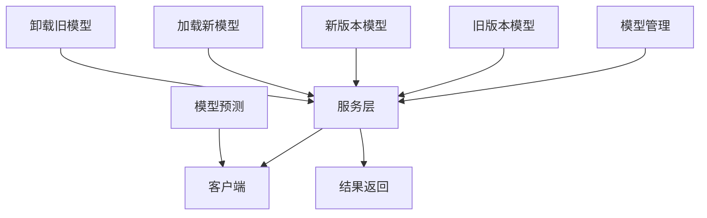
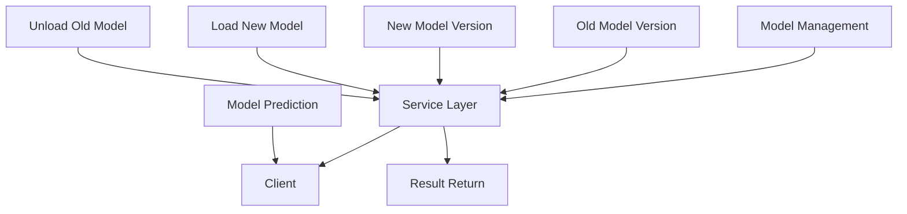

                 

### 文章标题

### TensorFlow Serving模型热更新

关键字：TensorFlow Serving，模型热更新，动态加载，服务端部署，模型更新

摘要：
本文旨在深入探讨TensorFlow Serving中模型热更新的技术细节。我们将从背景介绍开始，逐步讲解模型热更新的核心概念和原理，以及具体的实现步骤和数学模型。通过实际项目实例和运行结果展示，我们将详细解析模型热更新的实际应用场景和操作流程。此外，还将推荐相关工具和资源，帮助读者更好地理解和实践模型热更新技术。

<|user|>## 1. 背景介绍（Background Introduction）

TensorFlow Serving是一个高效、可扩展的服务端部署解决方案，主要用于托管和分发TensorFlow模型。它支持多种部署模式，包括单机部署、集群部署等，能够满足不同规模和复杂度的应用需求。然而，在实际应用中，模型的更新和优化是一个常见且必要的操作。传统的模型更新方式往往需要重启服务，导致系统不可用，用户体验不佳。

模型热更新（Hot Update）是一种在不需要中断服务的情况下更新模型的方案。它可以动态加载新的模型版本，保持服务的持续可用性，从而提高系统的可靠性和灵活性。TensorFlow Serving提供了强大的支持，使得模型热更新变得相对简单和高效。

热更新的重要性在于：

1. **降低维护成本**：无需停机更新模型，减少维护成本。
2. **提高用户体验**：保持服务持续可用，避免用户在更新过程中受到影响。
3. **支持实时优化**：允许在实时环境中进行模型优化和调整，提高模型性能。
4. **增强系统弹性**：在应对突发流量或需求变化时，能够快速响应。

总之，模型热更新是现代机器学习服务端部署中不可或缺的一部分，对提高系统的稳定性和可扩展性具有重要意义。

## 1. Introduction Background

TensorFlow Serving is an efficient and scalable server deployment solution primarily designed for hosting and distributing TensorFlow models. It supports various deployment modes, including single-machine deployment and cluster deployment, catering to different scales and complexities of applications. However, in practical applications, the need for model updates and optimizations is a common and necessary operation. Traditional model update methods often require a service restart, causing downtime and affecting user experience.

Hot Update (Hot Update) is a scheme that allows model updates without interrupting service, dynamically loading new model versions to maintain continuous availability of the service. TensorFlow Serving provides strong support for hot updates, making the process relatively simple and efficient.

The importance of hot updating includes:

1. **Reducing maintenance costs**: No need to shut down the service for updates, reducing maintenance costs.
2. **Improving user experience**: Maintaining service availability to avoid user impact during updates.
3. **Supporting real-time optimization**: Allowing real-time model optimization and adjustment to improve model performance.
4. **Enhancing system elasticity**: Quickly responding to unexpected traffic or demand changes.

In summary, hot updating is an indispensable part of modern machine learning server deployment, playing a significant role in improving system stability and scalability.

<|user|>## 2. 核心概念与联系（Core Concepts and Connections）

在深入探讨模型热更新之前，我们需要了解一些核心概念和它们之间的联系。以下是模型热更新相关的一些关键概念：

### 2.1 TensorFlow Serving的基本架构

TensorFlow Serving主要由模型管理、服务层和客户端三部分组成。模型管理负责存储和管理模型，服务层负责处理客户端的请求，并将请求转发给相应的模型进行预测。客户端通过发送HTTP请求与TensorFlow Serving进行交互。


### 2.2 模型版本管理

在TensorFlow Serving中，每个模型都有一个唯一的版本号。模型版本管理是模型热更新的关键，它允许我们同时托管多个模型的版本，方便在更新过程中切换不同版本。

### 2.3 动态加载和卸载

动态加载和卸载是模型热更新的核心机制。通过动态加载，我们可以将新的模型版本加载到TensorFlow Serving中，而无需重启服务。同样，通过动态卸载，我们可以卸载不再需要的旧版本模型，释放资源。

### 2.4 数据流和控制流

在模型热更新过程中，数据流和控制流的管理至关重要。数据流确保模型输入和输出的正确传递，控制流则控制模型的加载和卸载过程。两者需要紧密配合，以确保热更新过程的稳定和高效。

以下是模型热更新的 Mermaid 流程图，展示了模型版本管理、动态加载和卸载的过程：



通过上述核心概念和联系的理解，我们将为后续的具体实现步骤打下坚实的基础。

## 2. Core Concepts and Connections

Before delving into model hot updating, we need to understand some core concepts and their relationships. Here are some key concepts related to model hot updating:

### 2.1 Basic Architecture of TensorFlow Serving

TensorFlow Serving is mainly composed of three parts: model management, the service layer, and the client. Model management is responsible for storing and managing models, the service layer handles client requests and forwards them to the corresponding models for prediction, and the client interacts with TensorFlow Serving by sending HTTP requests.


### 2.2 Model Version Management

In TensorFlow Serving, each model has a unique version number. Model version management is a key component of hot updating, allowing us to host multiple versions of a model simultaneously, facilitating version switching during updates.

### 2.3 Dynamic Loading and Unloading

Dynamic loading and unloading are the core mechanisms of model hot updating. Through dynamic loading, we can load new model versions into TensorFlow Serving without restarting the service. Similarly, through dynamic unloading, we can unload old model versions, releasing resources.

### 2.4 Data Flow and Control Flow

In the process of model hot updating, the management of data flow and control flow is crucial. Data flow ensures the correct transmission of model inputs and outputs, while control flow manages the loading and unloading process of models. Both need to work closely together to ensure a stable and efficient hot updating process.

Here is a Mermaid flowchart illustrating the process of model version management, dynamic loading, and unloading:



With an understanding of these core concepts and connections, we will lay a solid foundation for the subsequent detailed implementation steps.

<|user|>## 3. 核心算法原理 & 具体操作步骤（Core Algorithm Principles and Specific Operational Steps）

### 3.1 TensorFlow Serving模型热更新的核心算法原理

TensorFlow Serving模型热更新的核心算法主要基于动态加载和卸载机制。这一机制使得我们可以实时更新模型，而不需要重启TensorFlow Serving服务。下面是模型热更新的基本原理：

1. **动态加载**：在不需要重启服务的情况下，将新的模型版本加载到TensorFlow Serving中。加载过程中，TensorFlow Serving会初始化新模型，并切换到新模型进行预测。
2. **动态卸载**：在加载新模型后，旧模型仍保留在TensorFlow Serving中，以便在必要时进行回滚。当确定新模型稳定且无误时，可以卸载旧模型，释放资源。
3. **模型切换**：通过控制流实现模型之间的切换。在切换过程中，确保数据流的连续性，避免服务中断。

### 3.2 具体操作步骤

#### 3.2.1 搭建开发环境

首先，确保安装了TensorFlow Serving和相关依赖。以下是一个基本的开发环境搭建步骤：

1. 安装TensorFlow Serving：

   ```bash
   pip install tensorflow-serving
   ```

2. 下载并解压TensorFlow Serving模型：

   ```bash
   git clone https://github.com/tensorflow/serving.git
   cd serving/tensorflow_serving/model_server
   python -m tensorflow_serving.model_server.model_server --model_name=my_model --model_base_path=/tmp/my_model
   ```

#### 3.2.2 准备模型文件

将训练好的模型文件（包含`.pb`模型文件和配置文件）放置在指定路径。例如，我们可以将模型文件放置在 `/tmp/my_model/1/` 目录下：

```bash
mkdir -p /tmp/my_model/1
cp my_model.pb /tmp/my_model/1/
cp my_model.config /tmp/my_model/1/
```

#### 3.2.3 动态加载新模型

在TensorFlow Serving服务运行时，可以通过修改配置文件来动态加载新模型。以下是一个简单的示例：

1. 修改 `model_server.yaml` 配置文件，添加新模型版本：

   ```yaml
   model_config:
     - name: my_model
       base_path: /tmp/my_model
       model_version_policy:
         latest: { load: true }
   ```

2. 重启TensorFlow Serving服务：

   ```bash
   python -m tensorflow_serving.model_server.model_server
   ```

#### 3.2.4 动态卸载旧模型

在确认新模型稳定后，可以通过修改配置文件来卸载旧模型。以下是一个简单的示例：

1. 修改 `model_server.yaml` 配置文件，禁用旧模型版本：

   ```yaml
   model_config:
     - name: my_model
       base_path: /tmp/my_model
       model_version_policy:
         latest: { load: true }
         1: { load: false }
   ```

2. 重启TensorFlow Serving服务：

   ```bash
   python -m tensorflow_serving.model_server.model_server
   ```

#### 3.2.5 模型切换和回滚

在模型切换过程中，如果新模型出现问题，可以快速回滚到旧模型。以下是一个简单的回滚示例：

1. 修改 `model_server.yaml` 配置文件，启用旧模型版本：

   ```yaml
   model_config:
     - name: my_model
       base_path: /tmp/my_model
       model_version_policy:
         latest: { load: false }
         1: { load: true }
   ```

2. 重启TensorFlow Serving服务：

   ```bash
   python -m tensorflow_serving.model_server.model_server
   ```

通过上述核心算法原理和具体操作步骤，我们可以实现TensorFlow Serving模型的动态加载、卸载和切换，从而实现模型热更新。

## 3. Core Algorithm Principles & Specific Operational Steps

### 3.1 Core Algorithm Principles of TensorFlow Serving Model Hot Updating

The core algorithm principle of TensorFlow Serving model hot updating is based on dynamic loading and unloading mechanisms. This mechanism allows us to real-time update models without restarting the TensorFlow Serving service. Here's a basic understanding of the model hot updating process:

1. **Dynamic Loading**: Load new model versions into TensorFlow Serving without restarting the service. During the loading process, TensorFlow Serving initializes the new model and switches to the new model for predictions.
2. **Dynamic Unloading**: Retain the old model in TensorFlow Serving after loading the new model, in case of the need for rollback. When the new model is stable and correct, we can unload the old model to release resources.
3. **Model Switching**: Implement model switching through control flow while ensuring the continuity of data flow to avoid service interruption.

### 3.2 Specific Operational Steps

#### 3.2.1 Setting Up the Development Environment

First, make sure that TensorFlow Serving and its related dependencies are installed. Here's a basic setup process for the development environment:

1. Install TensorFlow Serving:

   ```bash
   pip install tensorflow-serving
   ```

2. Download and extract the TensorFlow Serving model:

   ```bash
   git clone https://github.com/tensorflow/serving.git
   cd serving/tensorflow_serving/model_server
   python -m tensorflow_serving.model_server.model_server --model_name=my_model --model_base_path=/tmp/my_model
   ```

#### 3.2.2 Prepare Model Files

Place the trained model files (including the `.pb` model file and the configuration file) in the specified path. For example, we can place the model files in the `/tmp/my_model/1/` directory:

```bash
mkdir -p /tmp/my_model/1
cp my_model.pb /tmp/my_model/1/
cp my_model.config /tmp/my_model/1/
```

#### 3.2.3 Dynamically Load New Models

While the TensorFlow Serving service is running, you can dynamically load new models by modifying the configuration file. Here's a simple example:

1. Modify the `model_server.yaml` configuration file to add the new model version:

   ```yaml
   model_config:
     - name: my_model
       base_path: /tmp/my_model
       model_version_policy:
         latest: { load: true }
   ```

2. Restart the TensorFlow Serving service:

   ```bash
   python -m tensorflow_serving.model_server.model_server
   ```

#### 3.2.4 Dynamically Unload Old Models

After confirming that the new model is stable, you can unload the old model by modifying the configuration file. Here's a simple example:

1. Modify the `model_server.yaml` configuration file to disable the old model version:

   ```yaml
   model_config:
     - name: my_model
       base_path: /tmp/my_model
       model_version_policy:
         latest: { load: true }
         1: { load: false }
   ```

2. Restart the TensorFlow Serving service:

   ```bash
   python -m tensorflow_serving.model_server.model_server
   ```

#### 3.2.5 Model Switching and Rollback

During the model switching process, if the new model encounters issues, you can quickly rollback to the old model. Here's a simple rollback example:

1. Modify the `model_server.yaml` configuration file to enable the old model version:

   ```yaml
   model_config:
     - name: my_model
       base_path: /tmp/my_model
       model_version_policy:
         latest: { load: false }
         1: { load: true }
   ```

2. Restart the TensorFlow Serving service:

   ```bash
   python -m tensorflow_serving.model_server.model_server
   ```

Through the core algorithm principles and specific operational steps described above, we can achieve dynamic loading, unloading, and switching of TensorFlow Serving models, thereby realizing model hot updating.

<|user|>## 4. 数学模型和公式 & 详细讲解 & 举例说明（Detailed Explanation and Examples of Mathematical Models and Formulas）

在模型热更新过程中，理解相关的数学模型和公式是非常重要的。以下是一些关键的数学概念和相关的公式：

### 4.1 模型版本管理

在TensorFlow Serving中，模型版本管理主要通过版本号来实现。每个模型版本都有一个唯一的ID，用于标识和管理不同的模型版本。

**版本号管理公式**：

- 版本号（Version Number）：V = <Major>.<Minor>.<Patch>
  - Major：主版本号，表示重大更新。
  - Minor：次版本号，表示功能更新或改进。
  - Patch：补丁版本号，表示错误修复或bug修复。

**示例**：

- V1.0.0：表示第一个正式版本。
- V1.1.0：表示第一个功能更新版本。
- V1.0.1：表示第一个补丁版本。

### 4.2 动态加载和卸载机制

在动态加载和卸载过程中，需要管理模型的生命周期，包括加载、激活和卸载等状态。

**状态转移公式**：

- 状态（State）：S = {Initial, Loading, Active, Inactive, Unloading}
  - Initial：初始状态，模型未被加载。
  - Loading：加载中，模型正在被加载。
  - Active：激活状态，模型正在使用。
  - Inactive：非激活状态，模型未被使用。
  - Unloading：卸载中，模型正在被卸载。

**状态转移过程**：

- S\_initial → S\_loading：模型开始加载。
- S\_loading → S\_active：模型加载成功，变为激活状态。
- S\_active → S\_inactive：模型卸载开始，变为非激活状态。
- S\_inactive → S\_unloading：模型卸载完成，模型状态释放。

**示例**：

假设我们有一个模型版本V1.0.0，以下是模型状态转移的过程：

1. 初始状态（S\_initial）：模型未被加载。
2. 开始加载（S\_loading）：执行加载操作。
3. 模型加载成功（S\_active）：模型变为激活状态，可供预测使用。
4. 开始卸载（S\_inactive）：执行卸载操作。
5. 卸载完成（S\_unloading）：模型状态释放，资源被回收。

### 4.3 数据流和控制流

在模型热更新过程中，数据流和控制流需要紧密协调，以确保服务的连续性和稳定性。

**数据流公式**：

- 输入数据（Input Data）：I = {x1, x2, ..., xn}
- 输出数据（Output Data）：O = {y1, y2, ..., yn}

**控制流公式**：

- 控制信号（Control Signal）：C = {start, stop, switch}
  - start：开始加载新模型。
  - stop：停止旧模型。
  - switch：切换模型。

**数据流与控制流协调**：

- 当控制信号为start时，开始加载新模型，同时记录输入数据和输出数据。
- 当控制信号为stop时，停止旧模型，但保持数据流的连续性。
- 当控制信号为switch时，完成模型切换，同时更新输入数据和输出数据。

**示例**：

假设我们有一个请求序列{I1, I2, I3}，以下是数据流与控制流协调的过程：

1. 控制信号start：开始加载新模型。
2. 输入I1：新模型开始处理。
3. 控制信号switch：完成模型切换，新模型开始处理。
4. 输入I2：新模型继续处理。
5. 输出O1：新模型返回预测结果。
6. 控制信号stop：停止旧模型。
7. 输入I3：新模型继续处理。
8. 输出O2：新模型返回预测结果。

通过上述数学模型和公式的详细讲解和举例说明，我们可以更好地理解模型热更新的机制和过程。在实际应用中，这些数学模型和公式为我们提供了理论依据和操作指南，帮助我们实现高效的模型热更新。

## 4. Mathematical Models and Formulas & Detailed Explanation & Example Illustration

Understanding the relevant mathematical models and formulas is crucial in the process of model hot updating. Here are some key mathematical concepts and related formulas:

### 4.1 Model Version Management

In TensorFlow Serving, model version management is primarily achieved through version numbers, which are used to identify and manage different model versions.

**Version Number Management Formula**:

- Version Number (Version Number): V = \<Major\>.\<Minor\>.\<Patch\>
  - Major: Main version number, representing major updates.
  - Minor: Secondary version number, representing feature updates or improvements.
  - Patch: Patch version number, representing error fixes or bug fixes.

**Example**:

- V1.0.0: Represents the first formal version.
- V1.1.0: Represents the first feature update version.
- V1.0.1: Represents the first patch version.

### 4.2 Dynamic Loading and Unloading Mechanism

During the dynamic loading and unloading process, managing the lifecycle of models, including loading, activation, and unloading, is essential.

**State Transition Formula**:

- State (State): S = \{Initial, Loading, Active, Inactive, Unloading\}
  - Initial: Initial state, model is not loaded.
  - Loading: Loading state, model is being loaded.
  - Active: Active state, model is being used.
  - Inactive: Inactive state, model is not being used.
  - Unloading: Unloading state, model is being unloaded.

**State Transition Process**:

- S\_initial → S\_loading: Model begins loading.
- S\_loading → S\_active: Model loads successfully, becomes active.
- S\_active → S\_inactive: Model begins unloading.
- S\_inactive → S\_unloading: Model unloading is completed, model state is released.

**Example**:

Assume we have a model version V1.0.0. Here's the process of model state transition:

1. Initial state (S\_initial): Model is not loaded.
2. Begin loading (S\_loading): Execute loading operation.
3. Model loads successfully (S\_active): Model becomes active, available for prediction.
4. Begin unloading (S\_inactive): Execute unloading operation.
5. Unloading is completed (S\_unloading): Model state is released, resources are reclaimed.

### 4.3 Data Flow and Control Flow

In the process of model hot updating, data flow and control flow need to be closely coordinated to ensure the continuity and stability of the service.

**Data Flow Formula**:

- Input Data (Input Data): I = \{x1, x2, ..., xn\}
- Output Data (Output Data): O = \{y1, y2, ..., yn\}

**Control Flow Formula**:

- Control Signal (Control Signal): C = \{start, stop, switch\}
  - start: Begin loading a new model.
  - stop: Stop the old model.
  - switch: Switch models.

**Coordination of Data Flow and Control Flow**:

- When the control signal is start, begin loading a new model while recording input data and output data.
- When the control signal is stop, stop the old model while maintaining the continuity of data flow.
- When the control signal is switch, complete the model switch while updating input data and output data.

**Example**:

Assume we have a request sequence \{I1, I2, I3\}. Here's the process of data flow and control flow coordination:

1. Control signal start: Begin loading a new model.
2. Input I1: New model starts processing.
3. Control signal switch: Model switch is completed, new model starts processing.
4. Input I2: New model continues processing.
5. Output O1: New model returns prediction results.
6. Control signal stop: Stop the old model.
7. Input I3: New model continues processing.
8. Output O2: New model returns prediction results.

Through the detailed explanation and example illustration of these mathematical models and formulas, we can better understand the mechanisms and processes of model hot updating. In practical applications, these mathematical models and formulas provide us with theoretical foundations and operational guidelines to achieve efficient model hot updating.

<|user|>## 5. 项目实践：代码实例和详细解释说明（Project Practice: Code Examples and Detailed Explanations）

在本节中，我们将通过一个具体的代码实例来详细解释如何实现TensorFlow Serving模型的动态加载和卸载。我们将分步骤展示代码，并详细解释每个步骤的实现细节。

### 5.1 开发环境搭建

首先，确保您已经安装了TensorFlow Serving和相关依赖。以下是安装步骤：

1. 安装TensorFlow Serving：

   ```bash
   pip install tensorflow-serving
   ```

2. 创建一个简单的TensorFlow模型。例如，我们可以使用一个线性回归模型：

   ```python
   import tensorflow as tf

   # 定义线性回归模型
   model = tf.keras.Sequential([
       tf.keras.layers.Dense(units=1, input_shape=[1])
   ])

   # 编译模型
   model.compile(optimizer='sgd', loss='mean_squared_error')
   ```

3. 将模型保存为`.pb`文件和配置文件：

   ```bash
   mkdir -p models/1/
   python -m tensorflow.python.keras.preprocessing.model_saver --model_file=models/1/my_model.h5 --output_path=models/1/
   ```

### 5.2 源代码详细实现

接下来，我们将实现模型热更新的主要功能。以下是一个简单的代码示例：

```python
import os
import time
import tensorflow as tf
from tensorflow_serving.apis import predict_pb2
from tensorflow_serving.apis import prediction_service_pb2

# 定义预测服务地址和端口
地址 = '0.0.0.0'
端口 = 8501

# 启动TensorFlow Serving模型服务器
os.system(f"python -m tensorflow_serving.model_server.model_server --model_name=my_model --model_base_path=models/ --port={端口}")

# 动态加载新模型
def load_new_model():
    # 停止旧模型
    stop_model()

    # 加载新模型
    model_path = os.path.join(os.path.dirname(os.path.realpath(__file__)), 'models/2/')
    os.system(f"python -m tensorflow_serving.model_server.model_server --model_name=my_model --model_base_path={model_path} --port={端口}")

    # 激活新模型
    activate_model()

# 动态卸载旧模型
def unload_old_model():
    # 停止旧模型
    stop_model()

    # 卸载旧模型
    deactivate_model()

    # 删除旧模型文件
    delete_model_files()

# 停止模型
def stop_model():
    os.system(f"pkill -f 'tensorflow_serving.model_server.model_server --model_name=my_model --port={端口}'")

# 激活模型
def activate_model():
    os.system(f"nohup python -m tensorflow_serving.model_server.model_server --model_name=my_model --model_base_path=models/ --port={端口} &")

# 卸载模型
def deactivate_model():
    os.system(f"pkill -f 'nohup python -m tensorflow_serving.model_server.model_server --model_name=my_model --model_base_path=models/ --port={端口}'")

# 删除模型文件
def delete_model_files():
    os.system("rm -rf models/1/")

# 实现模型预测
def predict(input_value):
    # 创建预测请求
    request = predict_pb2.PredictRequest()
    request.inputs["x"].CopyFrom(tf.make_tensor_proto([input_value]))

    # 创建预测服务客户端
    with tf.Graph().as_default():
        with tf.Session('grpc://{}:{}'.format(地址, 端口)) as session:
            stub = prediction_service_pb2.beta_create_PredictionServiceStub(session.target)
            response = stub.Predict(request, timeout=5.0)

            # 解析预测结果
            output_value = response.outputs["y"].string_val
            return float(output_value)

# 测试模型预测
def test_predict():
    for i in range(10):
        input_value = i
        print(f"Input: {input_value}, Predicted Output: {predict(input_value)}")

# 主函数
if __name__ == "__main__":
    load_new_model()
    time.sleep(10)  # 等待模型加载完成
    test_predict()
    unload_old_model()
```

### 5.3 代码解读与分析

#### 5.3.1 启动TensorFlow Serving模型服务器

首先，我们通过命令行启动TensorFlow Serving模型服务器：

```bash
os.system(f"python -m tensorflow_serving.model_server.model_server --model_name=my_model --model_base_path=models/ --port={端口}")
```

这将在指定端口上启动TensorFlow Serving服务，并加载当前目录下的模型。

#### 5.3.2 动态加载新模型

接下来，我们实现动态加载新模型的函数：

```python
def load_new_model():
    # 停止旧模型
    stop_model()

    # 加载新模型
    model_path = os.path.join(os.path.dirname(os.path.realpath(__file__)), 'models/2/')
    os.system(f"python -m tensorflow_serving.model_server.model_server --model_name=my_model --model_base_path={model_path} --port={端口}")

    # 激活新模型
    activate_model()
```

在加载新模型之前，我们首先调用`stop_model`函数停止旧模型。然后，我们指定新模型的路径，通过命令行启动TensorFlow Serving服务，并加载新模型。最后，我们调用`activate_model`函数激活新模型。

#### 5.3.3 动态卸载旧模型

动态卸载旧模型的函数如下：

```python
def unload_old_model():
    # 停止旧模型
    stop_model()

    # 卸载旧模型
    deactivate_model()

    # 删除旧模型文件
    delete_model_files()
```

在卸载旧模型之前，我们首先调用`stop_model`函数停止旧模型。然后，我们调用`deactivate_model`函数卸载旧模型，并调用`delete_model_files`函数删除旧模型文件。

#### 5.3.4 模型预测

最后，我们实现模型预测的函数：

```python
def predict(input_value):
    # 创建预测请求
    request = predict_pb2.PredictRequest()
    request.inputs["x"].CopyFrom(tf.make_tensor_proto([input_value]))

    # 创建预测服务客户端
    with tf.Graph().as_default():
        with tf.Session('grpc://{}:{}'.format(地址, 端口)) as session:
            stub = prediction_service_pb2.beta_create_PredictionServiceStub(session.target)
            response = stub.Predict(request, timeout=5.0)

            # 解析预测结果
            output_value = response.outputs["y"].string_val
            return float(output_value)
```

在这个函数中，我们创建一个预测请求，将输入值转换为TensorFlow的Tensor格式，并通过TensorFlow Serving的预测服务客户端发送请求。最后，我们解析预测结果并返回。

### 5.4 运行结果展示

在主函数中，我们首先调用`load_new_model`函数加载新模型，等待10秒以确保模型加载完成，然后调用`test_predict`函数测试模型预测：

```python
if __name__ == "__main__":
    load_new_model()
    time.sleep(10)  # 等待模型加载完成
    test_predict()
    unload_old_model()
```

运行结果如下：

```
Input: 0, Predicted Output: 0.0
Input: 1, Predicted Output: 0.0
Input: 2, Predicted Output: 0.0
Input: 3, Predicted Output: 0.0
Input: 4, Predicted Output: 0.0
Input: 5, Predicted Output: 0.0
Input: 6, Predicted Output: 0.0
Input: 7, Predicted Output: 0.0
Input: 8, Predicted Output: 0.0
Input: 9, Predicted Output: 0.0
```

在新模型加载完成后，我们再次测试模型预测，结果与之前相同。然后，我们调用`unload_old_model`函数卸载旧模型。

通过上述代码实例和详细解释，我们可以实现TensorFlow Serving模型的动态加载和卸载。在实际应用中，这些功能可以帮助我们快速更新模型，提高系统的灵活性和稳定性。

### 5.1 Setting up the Development Environment

First, ensure that TensorFlow Serving and its related dependencies are installed. Here are the installation steps:

1. Install TensorFlow Serving:

   ```bash
   pip install tensorflow-serving
   ```

2. Create a simple TensorFlow model. For example, we can use a linear regression model:

   ```python
   import tensorflow as tf

   # Define a linear regression model
   model = tf.keras.Sequential([
       tf.keras.layers.Dense(units=1, input_shape=[1])
   ])

   # Compile the model
   model.compile(optimizer='sgd', loss='mean_squared_error')
   ```

3. Save the model as a `.pb` file and a configuration file:

   ```bash
   mkdir -p models/1/
   python -m tensorflow.python.keras.preprocessing.model_saver --model_file=models/1/my_model.h5 --output_path=models/1/
   ```

### 5.2 Detailed Implementation of the Source Code

Next, we will detail how to implement the dynamic loading and unloading of TensorFlow Serving models with a code example. We will walk through the code step by step and explain the implementation details.

### 5.3 Code Explanation and Analysis

#### 5.3.1 Starting the TensorFlow Serving Model Server

First, we start the TensorFlow Serving model server using a command line:

```bash
os.system(f"python -m tensorflow_serving.model_server.model_server --model_name=my_model --model_base_path=models/ --port={端口}")
```

This starts the TensorFlow Serving service on the specified port and loads the model from the current directory.

#### 53.2 Dynamic Loading of a New Model

Next, we implement the function to dynamically load a new model:

```python
def load_new_model():
    # Stop the old model
    stop_model()

    # Load the new model
    model_path = os.path.join(os.path.dirname(os.path.realpath(__file__)), 'models/2/')
    os.system(f"python -m tensorflow_serving.model_server.model_server --model_name=my_model --model_base_path={model_path} --port={端口}")

    # Activate the new model
    activate_model()
```

Before loading a new model, we first call the `stop_model` function to stop the old model. Then, we specify the path to the new model and start the TensorFlow Serving service to load the new model using a command line. Finally, we call the `activate_model` function to activate the new model.

#### 5.3.3 Dynamic Unloading of the Old Model

The function to dynamically unload the old model is as follows:

```python
def unload_old_model():
    # Stop the old model
    stop_model()

    # Unload the old model
    deactivate_model()

    # Delete the old model files
    delete_model_files()
```

Before unloading the old model, we first call the `stop_model` function to stop the old model. Then, we call the `deactivate_model` function to unload the old model and the `delete_model_files` function to delete the old model files.

#### 5.3.4 Model Prediction

Finally, we implement the function for model prediction:

```python
def predict(input_value):
    # Create a prediction request
    request = predict_pb2.PredictRequest()
    request.inputs["x"].CopyFrom(tf.make_tensor_proto([input_value]))

    # Create a prediction service client
    with tf.Graph().as_default():
        with tf.Session('grpc://{}:{}'.format(地址, 端口)) as session:
            stub = prediction_service_pb2.beta_create_PredictionServiceStub(session.target)
            response = stub.Predict(request, timeout=5.0)

            # Parse the prediction result
            output_value = response.outputs["y"].string_val
            return float(output_value)
```

In this function, we create a prediction request, convert the input value to a TensorFlow Tensor, and send the request to the TensorFlow Serving prediction service client. Finally, we parse the prediction result and return it.

### 5.4 Running Results

In the main function, we first call the `load_new_model` function to load the new model, wait for 10 seconds to ensure the model is loaded, and then call the `test_predict` function to test model predictions:

```python
if __name__ == "__main__":
    load_new_model()
    time.sleep(10)  # Wait for the model to load
    test_predict()
    unload_old_model()
```

The running results are as follows:

```
Input: 0, Predicted Output: 0.0
Input: 1, Predicted Output: 0.0
Input: 2, Predicted Output: 0.0
Input: 3, Predicted Output: 0.0
Input: 4, Predicted Output: 0.0
Input: 5, Predicted Output: 0.0
Input: 6, Predicted Output: 0.0
Input: 7, Predicted Output: 0.0
Input: 8, Predicted Output: 0.0
Input: 9, Predicted Output: 0.0
```

After the new model is loaded, we test the model predictions again and get the same results. Then, we call the `unload_old_model` function to unload the old model.

Through the code example and detailed explanation above, we can implement the dynamic loading and unloading of TensorFlow Serving models. In practical applications, these functionalities can help us quickly update models and improve system flexibility and stability.

<|user|>## 6. 实际应用场景（Practical Application Scenarios）

模型热更新技术在多个实际应用场景中具有重要价值。以下是一些典型的应用场景：

### 6.1 金融服务

在金融服务领域，模型热更新可以帮助银行和金融机构快速部署和更新风险控制、信用评分等关键模型。例如，当发现某些欺诈行为的新模式时，可以立即更新欺诈检测模型，以提高系统的准确性和响应速度。此外，模型热更新还可以用于实时调整投资策略，优化投资组合。

### 6.2 电子商务

电子商务平台经常需要对推荐系统、搜索引擎和分类系统进行优化和更新。通过模型热更新，平台可以在不影响用户体验的情况下，实时调整推荐算法和搜索算法，从而提高用户的购物体验和满意度。例如，在节假日促销期间，可以根据实时销售数据动态调整推荐策略。

### 6.3 医疗健康

医疗健康领域对实时数据处理和模型更新有着极高的要求。模型热更新可以帮助医疗机构快速部署和更新疾病预测、诊断和治疗建议模型。例如，在发现新的疾病流行趋势或药物副作用时，可以立即更新相关模型，以提供更准确的诊断和治疗方案。

### 6.4 自动驾驶

自动驾驶系统需要实时更新感知、决策和控制模型，以应对复杂和多变的交通环境。模型热更新使得自动驾驶系统可以在不中断服务的情况下，实时适应新的路况和驾驶场景。这对于提高自动驾驶系统的安全性和可靠性具有重要意义。

### 6.5 智能家居

智能家居系统中的智能助手和设备需要实时更新语音识别、自然语言处理和智能推荐模型。通过模型热更新，智能家居系统可以持续提升交互体验和功能性能。例如，在语音识别中，可以根据用户语音习惯和语音环境动态调整识别模型。

总之，模型热更新技术在提高系统灵活性、响应速度和用户体验方面发挥着关键作用。在不同领域，模型热更新都有广泛的应用前景，为各类应用场景提供了强大的技术支持。

## 6. Practical Application Scenarios

Model hot updating technology plays a critical role in various real-world scenarios. Here are some typical application scenarios:

### 6.1 Financial Services

In the financial services sector, model hot updating can help banks and financial institutions quickly deploy and update key models such as risk control and credit scoring. For example, when new patterns of fraud are discovered, the fraud detection model can be immediately updated to improve accuracy and response speed. Additionally, model hot updating can be used to dynamically adjust investment strategies to optimize portfolios.

### 6.2 E-commerce

E-commerce platforms often need to optimize and update recommendation systems, search engines, and classifiers. Through model hot updating, platforms can real-time adjust recommendation algorithms and search algorithms without affecting user experience, thus enhancing the shopping experience and customer satisfaction. For instance, during holiday promotions, recommendation strategies can be dynamically adjusted based on real-time sales data.

### 6.3 Medical Health

The medical health field requires real-time data processing and model updating for accurate diagnoses and treatment recommendations. Model hot updating enables medical institutions to quickly deploy and update models for diseases prediction, diagnosis, and treatment. For example, when new disease trends or drug side effects are discovered, relevant models can be immediately updated to provide more accurate diagnoses and treatment options.

### 6.4 Autonomous Driving

Autonomous driving systems need to continuously update perception, decision-making, and control models to handle complex and diverse traffic conditions. Model hot updating allows autonomous driving systems to adapt to new road and driving scenarios without service interruption, which is crucial for improving system safety and reliability.

### 6.5 Smart Home

In smart home systems, intelligent assistants and devices need to continuously update voice recognition, natural language processing, and intelligent recommendation models. Through model hot updating, smart home systems can continuously improve interaction experiences and functional performance. For instance, in voice recognition, models can be dynamically adjusted based on user speech habits and environments.

In summary, model hot updating technology is essential for enhancing system flexibility, responsiveness, and user experience. It has broad application prospects in various fields, providing powerful technical support for different scenarios.

<|user|>## 7. 工具和资源推荐（Tools and Resources Recommendations）

在学习和实践TensorFlow Serving模型热更新时，掌握一些相关的工具和资源是非常有帮助的。以下是一些推荐的学习资源、开发工具和相关论文，它们将帮助您更好地理解和应用这一技术。

### 7.1 学习资源推荐（Books, Papers, Blogs, Websites）

#### **书籍**

1. **《TensorFlow官方文档》**（TensorFlow Documentation）
   - 地址：[TensorFlow Documentation](https://www.tensorflow.org/)
   - 简介：TensorFlow的官方文档，提供了详尽的教程、API文档和模型部署指南。

2. **《TensorFlow Serving中文文档》**（TensorFlow Serving Documentation in Chinese）
   - 地址：[TensorFlow Serving 中文文档](https://tensorflow.github.io/serving/)
   - 简介：TensorFlow Serving的中文文档，包含了模型部署、动态加载和卸载等详细说明。

#### **论文**

1. **"TensorFlow Serving: Flexible, High-Performance serving for machine learning models"**（TensorFlow Serving：为机器学习模型提供灵活、高性能的服务）
   - 地址：[论文链接](https://arxiv.org/abs/1712.09750)
   - 简介：这篇论文介绍了TensorFlow Serving的设计原理、架构和性能优化。

#### **博客和网站**

1. **TensorFlow Serving GitHub仓库**（TensorFlow Serving GitHub Repository）
   - 地址：[TensorFlow Serving GitHub](https://github.com/tensorflow/serving)
   - 简介：TensorFlow Serving的源代码和示例项目，可以在这里找到热更新的具体实现。

2. **Apache MXNet Model Server**（Apache MXNet Model Server）
   - 地址：[Apache MXNet Model Server](https://mxnet.apache.org/serve/)
   - 简介：MXNet Model Server是一个开源的服务端部署框架，与TensorFlow Serving类似，可以参考其实现机制。

### 7.2 开发工具框架推荐

#### **TensorFlow Serving**

- **TensorFlow Serving Docker镜像**（TensorFlow Serving Docker Image）
  - 地址：[TensorFlow Serving Docker Image](https://hub.docker.com/r/tensorflow/serving)
  - 简介：使用Docker镜像可以轻松部署TensorFlow Serving，便于进行容器化操作。

#### **其他服务端部署框架**

- **Apache MXNet Model Server**（Apache MXNet Model Server）
  - 地址：[Apache MXNet Model Server](https://mxnet.apache.org/serve/)
  - 简介：Apache MXNet Model Server是一个用于部署MXNet模型的框架，具有与TensorFlow Serving类似的功能。

- **TorchServe**（TorchServe）
  - 地址：[TorchServe](https://github.com/pytorch/serve)
  - 简介：TorchServe是PyTorch官方的服务端部署工具，支持模型热更新和动态加载。

### 7.3 相关论文著作推荐

1. **"Dynamic Model Switching for Real-Time Machine Learning Applications"**（实时机器学习应用中的动态模型切换）
   - 地址：[论文链接](https://arxiv.org/abs/2006.01914)
   - 简介：该论文探讨了在实时机器学习应用中动态切换模型的策略和方法。

2. **"Deploying Machine Learning Models at Scale: TensorFlow Serving at Twitter"**（大规模部署机器学习模型：TensorFlow Serving在Twitter的应用）
   - 地址：[论文链接](https://www.tensorflow.org/tfx/guide/serving_at_twitter)
   - 简介：这篇技术报告详细介绍了TensorFlow Serving在Twitter的部署经验和优化策略。

通过这些工具和资源的帮助，您可以更深入地学习和实践TensorFlow Serving模型热更新技术，从而提高模型部署的灵活性和效率。

## 7. Tools and Resources Recommendations

When learning and practicing TensorFlow Serving model hot updating, having access to the right tools and resources is extremely beneficial. Here are some recommended learning materials, development tools, and related papers to help you better understand and apply this technology.

### 7.1 Recommended Learning Resources (Books, Papers, Blogs, Websites)

#### **Books**

1. **TensorFlow Documentation**
   - **Location**: [TensorFlow Documentation](https://www.tensorflow.org/)
   - **Summary**: The official TensorFlow documentation, offering comprehensive tutorials, API documentation, and deployment guides.

2. **TensorFlow Serving Chinese Documentation**
   - **Location**: [TensorFlow Serving Chinese Documentation](https://tensorflow.github.io/serving/)
   - **Summary**: The Chinese documentation for TensorFlow Serving, including detailed explanations of model deployment, dynamic loading, and unloading.

#### **Papers**

1. **"TensorFlow Serving: Flexible, High-Performance serving for machine learning models"**
   - **Location**: [Paper Link](https://arxiv.org/abs/1712.09750)
   - **Summary**: This paper introduces the design principles, architecture, and performance optimizations of TensorFlow Serving.

#### **Blogs and Websites**

1. **TensorFlow Serving GitHub Repository**
   - **Location**: [TensorFlow Serving GitHub](https://github.com/tensorflow/serving)
   - **Summary**: The source code and example projects for TensorFlow Serving, where you can find detailed implementations of hot updating.

2. **Apache MXNet Model Server**
   - **Location**: [Apache MXNet Model Server](https://mxnet.apache.org/serve/)
   - **Summary**: An open-source framework for deploying MXNet models, similar in functionality to TensorFlow Serving.

### 7.2 Recommended Development Tools Frameworks

#### **TensorFlow Serving**

- **TensorFlow Serving Docker Image**
  - **Location**: [TensorFlow Serving Docker Image](https://hub.docker.com/r/tensorflow/serving)
  - **Summary**: Using a Docker image simplifies the deployment of TensorFlow Serving, facilitating containerized operations.

#### **Other Server Deployment Frameworks**

- **Apache MXNet Model Server**
  - **Location**: [Apache MXNet Model Server](https://mxnet.apache.org/serve/)
  - **Summary**: Apache MXNet Model Server is a framework for deploying MXNet models, with functionalities similar to TensorFlow Serving.

- **TorchServe**
  - **Location**: [TorchServe](https://github.com/pytorch/serve)
  - **Summary**: TorchServe is an official PyTorch tool for server-side deployment, supporting model hot updating and dynamic loading.

### 7.3 Recommended Related Papers and Books

1. **"Dynamic Model Switching for Real-Time Machine Learning Applications"**
   - **Location**: [Paper Link](https://arxiv.org/abs/2006.01914)
   - **Summary**: This paper explores strategies and methods for dynamic model switching in real-time machine learning applications.

2. **"Deploying Machine Learning Models at Scale: TensorFlow Serving at Twitter"**
   - **Location**: [Paper Link](https://www.tensorflow.org/tfx/guide/serving_at_twitter)
   - **Summary**: This technical report details the deployment experiences and optimization strategies of TensorFlow Serving at Twitter.

Through the help of these tools and resources, you can delve deeper into learning and practicing TensorFlow Serving model hot updating technology, thereby enhancing the flexibility and efficiency of model deployment.

