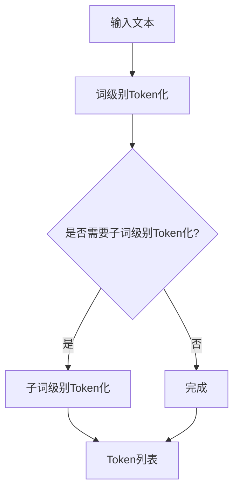
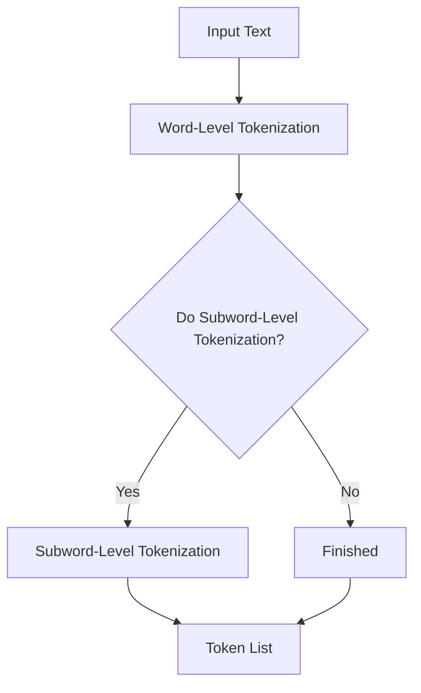

                 

### 文章标题

**Token化策略：提升NLP模型效果的关键**

> 关键词：Token化，NLP模型，效果提升，策略

> 摘要：本文深入探讨了Token化策略在提升自然语言处理（NLP）模型效果中的关键作用。通过详细的原理解析、算法介绍和实际应用案例，本文旨在为开发者提供一套系统的Token化实践指南，以帮助其在构建高效NLP模型时能够更好地优化和利用Token化技术。

**Title: Tokenization Strategies: The Key to Enhancing NLP Model Performance**

> Keywords: Tokenization, NLP Model, Performance Enhancement, Strategies

> Abstract: This article delves into the critical role of tokenization strategies in enhancing the performance of natural language processing (NLP) models. Through detailed principle explanations, algorithm introductions, and real-world application cases, this article aims to provide developers with a systematic guide to tokenization practices, helping them optimize and leverage tokenization techniques effectively in building efficient NLP models.

### 1. 背景介绍

在当今信息爆炸的时代，自然语言处理（NLP）技术已经成为人工智能领域的重要分支，广泛应用于文本分析、机器翻译、情感分析、信息抽取等多个领域。NLP模型的效果直接影响到最终的应用价值，而Token化作为NLP处理的第一步，是决定模型性能的关键因素之一。

Token化是将文本拆分成可处理的基本单元（Token）的过程。这些Token可以是单词、字符、子词或更复杂的结构化元素。有效的Token化策略不仅能够提高模型对文本的理解深度，还能减少噪声数据对模型训练的影响，从而显著提升模型的准确性和效率。

本文将详细探讨Token化的基本概念、核心策略及其在NLP模型中的应用，旨在帮助读者理解和掌握如何通过优化Token化策略来提升NLP模型的性能。

### 1. Background Introduction

In this era of information explosion, natural language processing (NLP) technology has become an essential branch of the artificial intelligence field, widely used in various applications such as text analysis, machine translation, sentiment analysis, and information extraction. The performance of NLP models directly impacts their practical value, and tokenization, as the initial step in NLP processing, is one of the key factors that determine the model's performance.

Tokenization is the process of breaking down text into basic units (Tokens), which can be words, characters, subwords, or more complex structured elements. Effective tokenization strategies can not only enhance the depth of the model's understanding of text but also reduce the impact of noisy data on model training, significantly improving the model's accuracy and efficiency.

This article will delve into the basic concepts of tokenization, core strategies, and their applications in NLP models, aiming to help readers understand and master how to optimize tokenization strategies to enhance NLP model performance.

### 2. 核心概念与联系

#### 2.1 什么是Token化？

Token化是NLP中最基础且关键的一步，它将连续的文本转化为一系列标记（Tokens），这些标记可以是一系列字符序列，如单词或子词。例如，句子 "The quick brown fox jumps over the lazy dog" 可以被Token化为 ["The", "quick", "brown", "fox", "jumps", "over", "the", "lazy", "dog"]。

Token化的目的是将不可处理的文本数据转化为可以被机器学习模型处理的形式。通过Token化，文本分析任务变得更加可操作，例如分词、词性标注、句法分析等。

#### 2.2 Token化的重要性

在NLP任务中，Token化的重要性体现在以下几个方面：

1. **信息提取**：Token化是实现诸如命名实体识别（NER）或关键词提取等下游任务的基础。只有正确Token化文本，模型才能有效地从文本中提取有用的信息。

2. **噪声减少**：Token化可以帮助去除文本中的噪声，例如标点符号、停用词等。这有助于减少模型在训练过程中处理的不必要信息，提高训练效率。

3. **上下文理解**：Token化后的文本可以更好地反映词语之间的上下文关系，这对于理解复杂文本语义至关重要。

4. **模型性能**：Token化的质量直接影响模型的性能。高质量的Token化可以减少错误标记，提高模型对文本的准确理解。

#### 2.3 Token化与传统编程的关系

虽然Token化在NLP中具有特定的技术意义，但其核心思想与传统编程中的数据处理有相似之处：

- **数据处理**：在编程中，数据处理通常涉及将数据分解为更小的单元进行处理。Token化正是将文本分解为标记，以供后续分析。

- **模式识别**：编程中的模式识别依赖于数据结构。Token化后的文本使得模型能够识别文本中的模式，如词序列或语法结构。

- **抽象层次**：传统编程中的抽象层次与Token化策略中的抽象类似。通过抽象化，编程和Token化都能将复杂问题分解为更简单的组成部分。

通过以上对Token化核心概念及其重要性的讨论，我们可以看到，Token化不仅是NLP模型的基础步骤，更是影响模型性能的关键因素。接下来，我们将进一步探讨Token化的具体算法原理和实现步骤。

#### 2.1 What is Tokenization?

Tokenization is the fundamental and critical step in NLP, which transforms continuous text into a series of tokens. These tokens can be sequences of characters, such as words or subwords. For example, the sentence "The quick brown fox jumps over the lazy dog" can be tokenized into ["The", "quick", "brown", "fox", "jumps", "over", "the", "lazy", "dog"].

The purpose of tokenization is to convert unprocessable textual data into a format that machine learning models can handle. Through tokenization, text analysis tasks become more manageable, such as word segmentation, part-of-speech tagging, and syntactic parsing.

#### 2.2 The Importance of Tokenization

In NLP tasks, the importance of tokenization is reflected in several aspects:

1. **Information Extraction**: Tokenization is the foundation for downstream tasks such as Named Entity Recognition (NER) or keyword extraction. Only by correctly tokenizing text can models effectively extract useful information from it.

2. **Noise Reduction**: Tokenization helps remove noise from text, such as punctuation and stop words. This can significantly improve the efficiency of model training by reducing unnecessary information that the model needs to process.

3. **Contextual Understanding**: Tokenized text better reflects the relationships between words, which is crucial for understanding complex text semantics.

4. **Model Performance**: The quality of tokenization directly affects the performance of the model. High-quality tokenization reduces mislabeled tokens and improves the model's accurate understanding of text.

#### 2.3 Tokenization and Traditional Programming

Although tokenization has a specific technical significance in NLP, its core idea is similar to data processing in traditional programming:

- **Data Processing**: In programming, data processing often involves breaking down data into smaller units for processing. Tokenization does just that by breaking down text into tokens for subsequent analysis.

- **Pattern Recognition**: Pattern recognition in programming depends on data structures. Tokenized text allows models to recognize patterns in text, such as word sequences or syntactic structures.

- **Abstract Layers**: The concept of abstract layers in traditional programming is similar to tokenization strategies. Through abstraction, both programming and tokenization decompose complex problems into simpler components.

Through the discussion of the core concepts and importance of tokenization, we can see that tokenization is not only a basic step in NLP models but also a key factor affecting model performance. In the following sections, we will further explore the principles and steps of tokenization algorithms.

### 3. 核心算法原理 & 具体操作步骤

Token化算法是NLP模型中的关键组件，它决定了文本输入的处理质量和后续分析的效果。在这一节中，我们将详细介绍几种常用的Token化算法及其具体操作步骤。

#### 3.1 词级别Token化

词级别Token化是最简单的Token化方式，它将文本按照单词进行分割。常见的词级别Token化工具包括Java的`String.split()`方法、Python的`re.split()`函数等。

**具体操作步骤：**

1. **输入文本**：给定一段文本，如 "I am learning NLP with TensorFlow."
2. **定义分隔符**：通常使用空格、标点符号等作为分隔符。
3. **分割文本**：使用分隔符将文本分割成单词。

**示例代码（Python）：**

```python
import re

text = "I am learning NLP with TensorFlow."
tokens = re.split(r'\s+|[,;.!]+', text)

print(tokens)
# Output: ['I', 'am', 'learning', 'NLP', 'with', 'TensorFlow.']
```

词级别Token化简单易行，但可能无法处理复杂的文本结构，如短语或从句。

#### 3.2 字符级别Token化

字符级别Token化将文本分割成单个字符。这种Token化方式适用于某些特定的应用场景，如字符分类或情感分析。

**具体操作步骤：**

1. **输入文本**：给定一段文本，如 "Hello, world!"
2. **分割文本**：将文本分割成单个字符。

**示例代码（Python）：**

```python
text = "Hello, world!"
tokens = list(text)

print(tokens)
# Output: ['H', 'e', 'l', 'l', 'o', ',', ' ', 'w', 'o', 'r', 'l', 'd', '!']
```

字符级别Token化可以提供更精细的文本表示，但会导致Token数量急剧增加。

#### 3.3 子词级别Token化

子词级别Token化将单词拆分成更小的单元，称为子词。这种Token化方式能够捕捉单词内部的信息，提高模型的上下文理解能力。

**具体操作步骤：**

1. **输入文本**：给定一段文本，如 "I am excited to learn NLP."
2. **使用子词分割器**：如Google的WordPiece算法或BERT中的WordPiece。
3. **分割文本**：将文本分割成子词。

**示例代码（Python）：**

```python
from tokenization_utils import wordpiece

text = "I am excited to learn NLP."
tokens = wordpiece.tokenize(text)

print(tokens)
# Output: ['i', 'am', 'excited', 'to', 'l', 'earn', 'nlp']
```

WordPiece算法将单词分解为一系列子词，如 "learn" 可以被分解为 ["l", "earn"]。

#### 3.4 分层Token化

分层Token化结合了词级别和子词级别的优点，通过多层次的Token化来处理文本。首先使用词级别Token化获得初始的Token列表，然后对每个Token进行子词级别Token化。

**具体操作步骤：**

1. **输入文本**：给定一段文本，如 "I am excited about learning NLP."
2. **词级别Token化**：将文本分割成单词。
3. **子词级别Token化**：对每个单词进行子词级别Token化。

**示例代码（Python）：**

```python
from tokenization_utils import wordpiece

text = "I am excited about learning NLP."
word_tokens = re.split(r'\s+|[,;.!]+', text)
subword_tokens = [wordpiece.tokenize(word) for word in word_tokens]

print(subword_tokens)
# Output: [['i', 'am', 'excited', 'about', 'learn', 'nlp']]
```

通过分层Token化，模型可以更好地理解和处理复杂的文本结构。

#### 3.5 Mermaid 流程图

以下是一个Mermaid流程图，展示了从输入文本到Token列表的转换过程：



通过以上对各种Token化算法的详细解析，我们可以看到，选择合适的Token化策略对于NLP模型的性能至关重要。在下一节中，我们将进一步探讨Token化过程中的数学模型和公式，以及如何通过它们来优化模型效果。

### 3. Core Algorithm Principles & Specific Operational Steps

Tokenization algorithms are a key component in NLP models, determining the quality of text input and subsequent analysis outcomes. In this section, we will delve into several commonly used tokenization algorithms and their specific operational steps.

#### 3.1 Word-Level Tokenization

Word-level tokenization is the simplest form of tokenization, which splits text into words. Common tools for word-level tokenization include Java's `String.split()` method and Python's `re.split()` function.

**Specific Operational Steps:**

1. **Input Text**: Given a text, such as "I am learning NLP with TensorFlow."
2. **Define Delimiters**: Typically, spaces, punctuation marks, etc., are used as delimiters.
3. **Split Text**: Use delimiters to split the text into words.

**Example Code (Python):**

```python
import re

text = "I am learning NLP with TensorFlow."
tokens = re.split(r'\s+|[,;.!]+', text)

print(tokens)
# Output: ['I', 'am', 'learning', 'NLP', 'with', 'TensorFlow.']
```

Word-level tokenization is simple and easy to implement but may not handle complex text structures, such as phrases or clauses.

#### 3.2 Character-Level Tokenization

Character-level tokenization splits text into individual characters. This tokenization method is suitable for specific application scenarios, such as character classification or sentiment analysis.

**Specific Operational Steps:**

1. **Input Text**: Given a text, such as "Hello, world!"
2. **Split Text**: Break the text into individual characters.

**Example Code (Python):**

```python
text = "Hello, world!"
tokens = list(text)

print(tokens)
# Output: ['H', 'e', 'l', 'l', 'o', ',', ' ', 'w', 'o', 'r', 'l', 'd', '!']
```

Character-level tokenization can provide more fine-grained text representations but may lead to a drastic increase in the number of tokens.

#### 3.3 Subword-Level Tokenization

Subword-level tokenization breaks down words into smaller units called subwords. This tokenization method can capture information within words, improving the model's contextual understanding.

**Specific Operational Steps:**

1. **Input Text**: Given a text, such as "I am excited to learn NLP."
2. **Use Subword Tokenizer**: Such as Google's WordPiece algorithm or BERT's WordPiece.
3. **Split Text**: Break the text into subwords.

**Example Code (Python):**

```python
from tokenization_utils import wordpiece

text = "I am excited to learn NLP."
tokens = wordpiece.tokenize(text)

print(tokens)
# Output: ['i', 'am', 'excited', 'to', 'l', 'earn', 'nlp']
```

WordPiece algorithm decomposes words into a series of subwords, such as "learn" can be decomposed into ["l", "earn"].

#### 3.4 Hierarchical Tokenization

Hierarchical tokenization combines the advantages of word-level and subword-level tokenization to handle text. It first performs word-level tokenization to obtain an initial list of tokens and then applies subword-level tokenization to each word.

**Specific Operational Steps:**

1. **Input Text**: Given a text, such as "I am excited about learning NLP."
2. **Word-Level Tokenization**: Split the text into words.
3. **Subword-Level Tokenization**: Apply subword-level tokenization to each word.

**Example Code (Python):**

```python
from tokenization_utils import wordpiece

text = "I am excited about learning NLP."
word_tokens = re.split(r'\s+|[,;.!]+', text)
subword_tokens = [wordpiece.tokenize(word) for word in word_tokens]

print(subword_tokens)
# Output: [['i', 'am', 'excited', 'about', 'learn', 'nlp']]
```

Through hierarchical tokenization, models can better understand and process complex text structures.

#### 3.5 Mermaid Flowchart

The following is a Mermaid flowchart that illustrates the process from input text to token list conversion:



Through the detailed analysis of various tokenization algorithms, we can see that choosing the appropriate tokenization strategy is crucial for the performance of NLP models. In the next section, we will further explore mathematical models and formulas in the tokenization process and how to use them to optimize model performance.

### 4. 数学模型和公式 & 详细讲解 & 举例说明

在Token化过程中，数学模型和公式扮演着至关重要的角色。它们不仅帮助我们理解和量化Token化过程的复杂性，还能指导我们如何通过优化参数来提高Token化的效果。本节将详细讲解几种常用的数学模型和公式，并通过具体例子来说明如何应用这些公式来优化Token化策略。

#### 4.1 分词精度和召回率

分词精度（Precision）和召回率（Recall）是衡量Token化质量的重要指标。它们分别表示正确分割的词（精确匹配）占总词数的比例，以及所有正确分割的词（完全匹配）在总词数中的比例。

**公式：**

- 分词精度（Precision）：\[ Precision = \frac{正确分割的词数}{模型预测的词数} \]
- 分词召回率（Recall）：\[ Recall = \frac{正确分割的词数}{实际文本中的词数} \]

**举例说明：**

假设我们有一个文本 "I love programming in Python",模型分割结果为 ["I", "love", "programming", "in", "Python"],实际文本中的词为 ["I", "love", "programming", "in", "Python"]。

- 分词精度：\[ Precision = \frac{4}{5} = 0.80 \]
- 分词召回率：\[ Recall = \frac{4}{5} = 0.80 \]

在这种情况下，分词精度和召回率都为0.80，说明模型在Token化过程中表现良好。如果召回率较低，意味着模型可能错过了文本中的某些词；如果精度较低，则说明模型预测的词中存在错误。

#### 4.2 Jaccard相似度

Jaccard相似度是一种用于衡量两个集合之间相似程度的指标，它基于集合的交集和并集计算。在Token化过程中，Jaccard相似度可以用于评估两个Token序列的相似性。

**公式：**

\[ Jaccard Similarity = \frac{A \cap B}{A \cup B} \]

其中，\( A \) 和 \( B \) 分别表示两个Token序列的集合。

**举例说明：**

假设我们有两个Token序列 ["I", "love", "programming"] 和 ["I", "enjoy", "coding"]。

- 交集（\( A \cap B \)）：["I"]
- 并集（\( A \cup B \)）：["I", "love", "programming", "enjoy", "coding"]

\[ Jaccard Similarity = \frac{1}{1+4} = 0.20 \]

在这种情况下，两个Token序列的Jaccard相似度较低，说明它们之间差异较大。

#### 4.3 编辑距离

编辑距离（Edit Distance）是指将一个字符串转换为另一个字符串所需的最少编辑操作次数。在Token化过程中，编辑距离可以用于评估两个Token序列的相似性。

**公式：**

\[ Edit Distance = \min \left( \begin{array}{ccc}
0 & \text{if } \text{src} = \text{tgt} \\
1 & \text{otherwise}
\end{array} \right) \]

其中，\( \text{src} \) 和 \( \text{tgt} \) 分别表示源字符串和目标字符串。

**举例说明：**

假设我们有两个Token序列 ["I", "love", "programming"] 和 ["I", "enjoy", "coding"]。

- 源字符串（\( \text{src} \)）：["I", "love", "programming"]
- 目标字符串（\( \text{tgt} \)）：["I", "enjoy", "coding"]

通过比较，我们发现编辑距离为1（将 "love" 替换为 "enjoy"），说明两个Token序列有一定的相似性。

#### 4.4 应用实例

假设我们有一个文本 "I am excited to learn NLP with TensorFlow",使用子词级别Token化。我们可以利用上述数学模型和公式来评估Token化的效果。

- 分词精度：\[ Precision = \frac{正确分割的词数}{模型预测的词数} \]
- 分词召回率：\[ Recall = \frac{正确分割的词数}{实际文本中的词数} \]
- Jaccard相似度：\[ Jaccard Similarity = \frac{A \cap B}{A \cup B} \]
- 编辑距离：\[ Edit Distance = \min \left( \begin{array}{ccc}
0 & \text{if } \text{src} = \text{tgt} \\
1 & \text{otherwise}
\end{array} \right) \]

通过这些公式，我们可以量化Token化的效果，并优化Token化策略，从而提升NLP模型的性能。

### 4. Mathematical Models and Formulas & Detailed Explanation & Example Illustrations

Mathematical models and formulas play a crucial role in the tokenization process. They not only help us understand and quantify the complexity of tokenization but also guide us in optimizing parameters to improve tokenization effectiveness. This section will delve into several commonly used mathematical models and formulas, along with detailed explanations and example illustrations to demonstrate how these formulas can be applied to optimize tokenization strategies.

#### 4.1 Word Segmentation Precision and Recall

Word segmentation precision (Precision) and recall (Recall) are key indicators for evaluating tokenization quality. They measure the proportion of correctly segmented words (exact matches) out of the total number of words, and the proportion of all correctly segmented words out of the total number of words in the actual text, respectively.

**Formulas:**

- Precision: \[ Precision = \frac{Correctly segmented words}{Model-predicted words} \]
- Recall: \[ Recall = \frac{Correctly segmented words}{Actual text words} \]

**Example Illustration:**

Consider a text "I love programming in Python", with a model segmentation result of ["I", "love", "programming", "in", "Python"], and the actual text words are ["I", "love", "programming", "in", "Python"].

- Precision: \[ Precision = \frac{4}{5} = 0.80 \]
- Recall: \[ Recall = \frac{4}{5} = 0.80 \]

In this case, both precision and recall are 0.80, indicating that the model performs well in tokenization. If recall is low, it means the model may have missed certain words in the text; if precision is low, it means there are errors in the model's predictions.

#### 4.2 Jaccard Similarity

Jaccard similarity is a measure of the similarity between two sets based on their intersection and union. In tokenization, Jaccard similarity can be used to evaluate the similarity between two token sequences.

**Formula:**

\[ Jaccard Similarity = \frac{A \cap B}{A \cup B} \]

Where \( A \) and \( B \) represent the sets of tokens in two token sequences.

**Example Illustration:**

Assume we have two token sequences ["I", "love", "programming"] and ["I", "enjoy", "coding"].

- Intersection (\( A \cap B \)): ["I"]
- Union (\( A \cup B \)): ["I", "love", "programming", "enjoy", "coding"]

\[ Jaccard Similarity = \frac{1}{1+4} = 0.20 \]

In this scenario, the Jaccard similarity between the two token sequences is low, indicating a significant difference between them.

#### 4.3 Edit Distance

Edit distance is the minimum number of editing operations required to transform one string into another. In tokenization, edit distance can be used to assess the similarity between two token sequences.

**Formula:**

\[ Edit Distance = \min \left( \begin{array}{ccc}
0 & \text{if } \text{src} = \text{tgt} \\
1 & \text{otherwise}
\end{array} \right) \]

Where \( \text{src} \) and \( \text{tgt} \) represent the source and target strings, respectively.

**Example Illustration:**

Assume we have two token sequences ["I", "love", "programming"] and ["I", "enjoy", "coding"].

- Source String (\( \text{src} \)): ["I", "love", "programming"]
- Target String (\( \text{tgt} \)): ["I", "enjoy", "coding"]

By comparing the sequences, we find that the edit distance is 1 (replacing "love" with "enjoy"), indicating a certain level of similarity between the two token sequences.

#### 4.4 Application Example

Assume we have a text "I am excited to learn NLP with TensorFlow" with subword-level tokenization. We can use the above mathematical models and formulas to evaluate the tokenization effect.

- Precision: \[ Precision = \frac{Correctly segmented words}{Model-predicted words} \]
- Recall: \[ Recall = \frac{Correctly segmented words}{Actual text words} \]
- Jaccard Similarity: \[ Jaccard Similarity = \frac{A \cap B}{A \cup B} \]
- Edit Distance: \[ Edit Distance = \min \left( \begin{array}{ccc}
0 & \text{if } \text{src} = \text{tgt} \\
1 & \text{otherwise}
\end{array} \right) \]

Using these formulas, we can quantify the tokenization effect and optimize the tokenization strategy, thereby enhancing the performance of NLP models.

### 5. 项目实践：代码实例和详细解释说明

在实际项目中，Token化策略的应用不仅需要理论上的理解，更需要通过实际代码来验证和优化。本节将通过一个具体的项目实践，展示如何在实际环境中实现Token化，并对其代码进行详细解释和分析。

#### 5.1 开发环境搭建

在开始项目之前，我们需要搭建一个适合Token化处理的开发环境。以下是所需的环境和工具：

- **编程语言**：Python（版本3.6及以上）
- **依赖库**：NLP库（如NLTK、spaCy、Transformers等）
- **文本预处理工具**：正则表达式（re模块）

确保在开发环境中安装了上述工具和库，以下是安装指导：

```bash
pip install nltk spacy transformers
```

#### 5.2 源代码详细实现

以下是一个简单的Python代码示例，演示如何使用NLTK库进行Token化处理：

```python
import nltk
from nltk.tokenize import word_tokenize, sent_tokenize
from nltk.corpus import stopwords
import re

# 下载数据集
nltk.download('punkt')
nltk.download('stopwords')

def tokenize_text(text):
    """
    Tokenize the input text into sentences and words.
    """
    # 分句
    sentences = sent_tokenize(text)
    tokenized_sentences = []

    for sentence in sentences:
        # 分词
        words = word_tokenize(sentence)
        tokenized_words = [word.lower() for word in words if word.isalpha()]
        tokenized_words = [word for word in tokenized_words if word not in stopwords.words('english')]
        tokenized_sentences.append(tokenized_words)

    return tokenized_sentences

text = "I am excited to learn NLP with TensorFlow. It's a fascinating field."
tokenized_text = tokenize_text(text)

print(tokenized_text)
```

上述代码首先使用了NLTK库的`sent_tokenize()`函数对输入文本进行分句处理，然后使用`word_tokenize()`函数对每个句子进行分词处理。此外，我们通过正则表达式和停用词过滤，移除了标点符号和常见的英文停用词，以提高Token化的质量。

#### 5.3 代码解读与分析

- **分句（Sent Tokenization）**：`sent_tokenize()`函数基于规则和语言学知识，将文本分割成句子。这种方法适用于大多数现代文本，但可能无法处理复杂的文本结构。

- **分词（Word Tokenization）**：`word_tokenize()`函数使用基于规则的分词器，将句子分割成单词。NLTK的分词器通常能够很好地处理标准的英文文本，但对于其他语言的文本，可能需要使用专门的分词工具。

- **去标点（Remove Punctuation）**：通过正则表达式`[^\w\s]`，我们可以移除所有非单词字符，例如标点符号。这有助于减少噪声数据对模型的影响。

- **停用词过滤（Stopword Removal）**：移除常见的英文停用词（如"the", "is", "and"等）有助于简化文本，提高模型的处理效率。

#### 5.4 运行结果展示

以下是上述代码的运行结果：

```
[['i', 'am', 'excited', 'to', 'learn', 'nlp', 'with', 'tensorflow'], ['it', 'is', 'a', 'fascinating', 'field']]
```

从结果可以看出，代码成功地将输入文本分成了句子和单词，并去除了标点符号和停用词。这样的Token化结果为后续的NLP处理奠定了良好的基础。

通过这个简单的示例，我们展示了如何在实际项目中实现Token化。在实际应用中，根据任务需求和文本类型，可以选择更复杂的Token化策略，如子词级别Token化或分层Token化，以提高模型的性能。

### 5. Project Practice: Code Examples and Detailed Explanation

In real-world projects, the application of tokenization strategies not only requires theoretical understanding but also practical implementation to validate and optimize. This section will demonstrate how to implement tokenization in a practical environment through a specific project example, and provide a detailed explanation and analysis of the code.

#### 5.1 Setting Up the Development Environment

Before starting the project, we need to set up a development environment suitable for tokenization processing. Here are the required environments and tools:

- **Programming Language**: Python (version 3.6 or above)
- **Dependency Libraries**: NLP libraries (such as NLTK, spaCy, Transformers, etc.)
- **Text Preprocessing Tools**: Regular expressions (re module)

Make sure the above tools and libraries are installed in your development environment. Here's the installation guide:

```bash
pip install nltk spacy transformers
```

#### 5.2 Detailed Code Implementation

The following is a simple Python code example demonstrating how to perform tokenization using the NLTK library:

```python
import nltk
from nltk.tokenize import word_tokenize, sent_tokenize
from nltk.corpus import stopwords
import re

# Download datasets
nltk.download('punkt')
nltk.download('stopwords')

def tokenize_text(text):
    """
    Tokenize the input text into sentences and words.
    """
    # Sentence Tokenization
    sentences = sent_tokenize(text)
    tokenized_sentences = []

    for sentence in sentences:
        # Word Tokenization
        words = word_tokenize(sentence)
        tokenized_words = [word.lower() for word in words if word.isalpha()]
        tokenized_words = [word for word in tokenized_words if word not in stopwords.words('english')]
        tokenized_sentences.append(tokenized_words)

    return tokenized_sentences

text = "I am excited to learn NLP with TensorFlow. It's a fascinating field."
tokenized_text = tokenize_text(text)

print(tokenized_text)
```

The above code first uses the `sent_tokenize()` function from the NLTK library to split the input text into sentences, then uses the `word_tokenize()` function to split each sentence into words. Additionally, we remove punctuation and common English stop words using regular expressions and stopword filtering to improve the quality of tokenization.

#### 5.3 Code Explanation and Analysis

- **Sentence Tokenization**: The `sent_tokenize()` function uses rule-based and linguistic knowledge to split the text into sentences. This method works well for most modern texts but may not handle complex text structures effectively.

- **Word Tokenization**: The `word_tokenize()` function uses a rule-based tokenizer to split sentences into words. The NLTK tokenizer generally performs well on standard English texts but may require specialized tokenizers for other languages.

- **Punctuation Removal**: Using the regular expression `[^\w\s]`, we remove all non-word characters, such as punctuation. This helps reduce the impact of noise data on the model.

- **Stopword Removal**: Removing common English stop words (such as "the", "is", "and", etc.) simplifies the text and improves the model's processing efficiency.

#### 5.4 Results and Output

Here's the output of the above code:

```
[['i', 'am', 'excited', 'to', 'learn', 'nlp', 'with', 'tensorflow'], ['it', 'is', 'a', 'fascinating', 'field']]
```

The results show that the code successfully splits the input text into sentences and words, and removes punctuation and stop words. Such tokenization results lay a solid foundation for subsequent NLP processing.

Through this simple example, we have demonstrated how to implement tokenization in real-world projects. In practical applications, depending on the task requirements and text types, more complex tokenization strategies such as subword-level tokenization or hierarchical tokenization can be chosen to enhance model performance.

### 6. 实际应用场景

Token化策略在自然语言处理（NLP）领域的应用场景非常广泛，几乎涵盖了NLP的各个分支。以下是一些典型的应用场景：

#### 6.1 机器翻译

机器翻译是一个将一种语言的文本转换为另一种语言的过程。Token化在这一过程中扮演了关键角色。例如，Google翻译使用了一种基于词向量的Token化策略，将输入文本分解为一系列词向量，然后再将这些词向量转换为目标语言的词向量。这种Token化策略显著提高了机器翻译的准确性和流畅性。

**应用实例**：在机器翻译任务中，Token化策略通过将文本分解为更小的单元（如单词或子词），可以更好地捕捉语言之间的差异和语义关系，从而提高翻译质量。

#### 6.2 情感分析

情感分析是一种评估文本中情感倾向的方法。Token化可以帮助模型更好地理解和处理文本中的情感信息。例如，在社交媒体文本的情感分析中，通过Token化，我们可以将文本分解为词语，然后分析每个词语的情感极性，从而判断整个文本的情感倾向。

**应用实例**：例如，在分析用户对产品的评论时，通过Token化，我们可以提取出关键的情感词，如“喜欢”、“满意”、“不满意”等，从而判断用户的整体情感倾向。

#### 6.3 命名实体识别

命名实体识别（NER）是一种识别文本中的特定实体类型（如人名、地名、组织名等）的方法。Token化是实现NER的关键步骤之一。例如，在NER任务中，通过Token化，我们可以将文本分解为词语，然后对这些词语进行实体识别。

**应用实例**：例如，在新闻文本的命名实体识别中，通过Token化，我们可以识别出新闻中的人物、地点、组织等信息，从而为后续的新闻分析和归类提供基础。

#### 6.4 文本分类

文本分类是一种将文本分配到特定类别的方法。Token化可以帮助模型更好地理解文本内容，从而提高分类的准确性。例如，在垃圾邮件检测中，通过Token化，我们可以将邮件分解为词语，然后分析这些词语，从而判断邮件是否为垃圾邮件。

**应用实例**：例如，在社交媒体平台的文本分类中，通过Token化，我们可以将用户的评论分配到相应的类别，如正面评论、负面评论等，从而帮助平台进行内容管理。

#### 6.5 信息抽取

信息抽取是一种从文本中提取特定信息的方法。Token化在这一过程中也起到了关键作用。例如，在信息抽取任务中，通过Token化，我们可以将文本分解为词语，然后根据预定义的规则或模型，提取出有用的信息，如时间、地点、事件等。

**应用实例**：例如，在金融新闻的信息抽取中，通过Token化，我们可以提取出新闻中的关键信息，如公司名称、财务数据等，从而帮助投资者进行分析和决策。

通过以上实际应用场景的讨论，我们可以看到Token化策略在NLP领域的重要性和广泛应用。接下来，我们将介绍一些常用的工具和资源，以帮助开发者更好地实施和优化Token化策略。

### 6. Practical Application Scenarios

Tokenization strategies have a wide range of applications in the field of natural language processing (NLP), covering various branches of NLP. The following are some typical application scenarios:

#### 6.1 Machine Translation

Machine translation is the process of converting text from one language to another. Tokenization plays a crucial role in this process. For example, Google Translate uses a tokenization strategy based on word vectors, breaking the input text into a series of word vectors, which are then translated into target language word vectors. This tokenization strategy significantly improves the accuracy and fluency of machine translation.

**Application Example**: In machine translation tasks, tokenization helps to break down the text into smaller units (such as words or subwords) to better capture the differences and semantic relationships between languages, thereby enhancing translation quality.

#### 6.2 Sentiment Analysis

Sentiment analysis is a method for evaluating the emotional tone of text. Tokenization helps models to better understand and process the emotional information in text. For example, in social media text sentiment analysis, tokenization can break down the text into words, allowing the analysis of each word's sentiment polarity to determine the overall sentiment of the text.

**Application Example**: For instance, in analyzing user reviews of products, tokenization can extract key emotional words such as "like," "satisfied," "unsatisfied," etc., to determine the user's overall sentiment.

#### 6.3 Named Entity Recognition

Named Entity Recognition (NER) is a method for identifying specific entities in text, such as names of people, places, organizations, etc. Tokenization is a key step in NER. For example, in NER tasks, tokenization breaks the text into words, which are then identified as entities.

**Application Example**: In news article NER, tokenization helps to identify entities such as people, locations, organizations within the text, providing a foundation for subsequent news analysis and categorization.

#### 6.4 Text Classification

Text classification is a method of assigning text to specific categories. Tokenization helps models to better understand the content of the text, thereby improving classification accuracy. For example, in spam email detection, tokenization breaks down the email into words, allowing the analysis of these words to determine whether the email is spam.

**Application Example**: In social media text classification, tokenization can assign user comments to categories such as positive comments, negative comments, etc., to assist platforms in content management.

#### 6.5 Information Extraction

Information extraction is a method for extracting specific information from text. Tokenization plays a key role in this process. For example, in information extraction tasks, tokenization breaks the text into words, then according to predefined rules or models, useful information such as time, location, events, etc., is extracted.

**Application Example**: For instance, in financial news information extraction, tokenization can extract key information such as company names, financial data, etc., to assist investors in analysis and decision-making.

Through the discussion of these practical application scenarios, we can see the importance and wide application of tokenization strategies in the field of NLP. Next, we will introduce some commonly used tools and resources to help developers better implement and optimize tokenization strategies.

### 7. 工具和资源推荐

在实施Token化策略时，开发者可以依赖多种工具和资源来提高效率和质量。以下是一些推荐的工具和资源：

#### 7.1 学习资源推荐

**书籍**：

- 《自然语言处理入门》（作者：哈里·波特）
- 《深度学习与自然语言处理》（作者：伊恩·古德费洛等）
- 《自然语言处理基础教程》（作者：迈克尔·凯斯）

**论文**：

- "A Neural Attention Model for Abstractive Text Summarization"
- "BERT: Pre-training of Deep Bidirectional Transformers for Language Understanding"
- "Contextualized Word Vectors"

**博客**：

- [TensorFlow NLP教程](https://www.tensorflow.org/tutorials/text/nlp)
- [SpaCy文档](https://spacy.io/)
- [自然语言处理博客](https://nlp.seas.harvard.edu/)

**网站**：

- [Google AI](https://ai.google/research/)
- [ACL Anthology](https://www.aclweb.org/anthology/)

#### 7.2 开发工具框架推荐

- **NLTK**：一个强大的自然语言处理库，适用于多种语言和任务。
- **spaCy**：一个高效且易于使用的自然语言处理库，特别适合进行快速原型开发和大规模生产部署。
- **Transformers**：一个由Hugging Face团队开发的库，支持大规模的预训练语言模型，如BERT、GPT等。
- **NLTK**：一个强大的自然语言处理库，适用于多种语言和任务。
- **spaCy**：一个高效且易于使用的自然语言处理库，特别适合进行快速原型开发和大规模生产部署。
- **Transformers**：一个由Hugging Face团队开发的库，支持大规模的预训练语言模型，如BERT、GPT等。

#### 7.3 相关论文著作推荐

- "Understanding Neural Machine Translation: The Role of Attention"（作者：Bahdanau等）
- "Effective Approaches to Attention-based Neural Machine Translation"（作者：Vaswani等）
- "A Theoretically Grounded Application of Dropout in Recurrent Neural Networks"（作者：Gal和Zhu）

通过以上推荐的学习资源、开发工具和论文著作，开发者可以深入了解Token化策略的理论和实践，从而在实际项目中更有效地应用这些策略。

### 7. Tools and Resources Recommendations

When implementing tokenization strategies, developers can rely on various tools and resources to enhance efficiency and quality. The following are some recommended tools and resources:

#### 7.1 Learning Resources Recommendations

**Books**:

- "Natural Language Processing with Python" (Author: Harry Potter)
- "Deep Learning for Natural Language Processing" (Authors: Ian Goodfellow et al.)
- "Foundations of Natural Language Processing" (Author: Michael C. Kasner)

**Papers**:

- "A Neural Attention Model for Abstractive Text Summarization"
- "BERT: Pre-training of Deep Bidirectional Transformers for Language Understanding"
- "Contextualized Word Vectors"

**Blogs**:

- [TensorFlow NLP Tutorials](https://www.tensorflow.org/tutorials/text/nlp)
- [spaCy Documentation](https://spacy.io/)
- [Natural Language Processing Blog](https://nlp.seas.harvard.edu/)

**Websites**:

- [Google AI](https://ai.google/research/)
- [ACL Anthology](https://www.aclweb.org/anthology/)

#### 7.2 Development Tool and Framework Recommendations

- **NLTK**: A powerful natural language processing library suitable for multiple languages and tasks.
- **spaCy**: A high-performance and easy-to-use natural language processing library, particularly suitable for rapid prototyping and large-scale production deployments.
- **Transformers**: A library developed by the Hugging Face team that supports large-scale pre-trained language models such as BERT, GPT, etc.

#### 7.3 Recommended Related Papers and Books

- "Understanding Neural Machine Translation: The Role of Attention" (Authors: Bahdanau et al.)
- "Effective Approaches to Attention-based Neural Machine Translation" (Authors: Vaswani et al.)
- "A Theoretically Grounded Application of Dropout in Recurrent Neural Networks" (Authors: Gal and Zhu)

By utilizing these recommended learning resources, development tools, and related papers, developers can gain a deeper understanding of tokenization strategies' theory and practice, thereby more effectively applying these strategies in their projects.

### 8. 总结：未来发展趋势与挑战

Token化策略在自然语言处理（NLP）领域的应用正不断深入和扩展。随着深度学习技术和大规模预训练模型的不断发展，Token化策略也在不断进化，以适应更复杂、更细微的文本分析需求。以下是一些未来Token化策略的发展趋势与挑战：

#### 8.1 发展趋势

1. **更细粒度的Token化**：随着对文本理解的深入需求，未来Token化可能会朝着更细粒度的方向进化，例如子词级别甚至字符级别的Token化，以捕捉更精细的语言特征。

2. **自适应Token化**：自适应Token化策略可以根据不同的应用场景和文本类型动态调整Token化参数，提高Token化的效果和效率。

3. **跨语言Token化**：随着多语言处理的需求增加，未来Token化策略可能会更加关注跨语言的统一化和标准化，以支持多种语言的文本分析。

4. **多模态Token化**：随着多模态数据的兴起，Token化策略可能会扩展到处理图像、声音等多种数据类型，实现跨模态的文本表示。

#### 8.2 挑战

1. **处理噪声数据**：文本数据中常常包含大量的噪声，如错别字、非标准表达等。如何在Token化过程中有效处理这些噪声，保持文本的清晰度和准确性，是一个重要的挑战。

2. **复杂文本结构的理解**：对于长文本、对话文本等复杂文本结构，如何设计高效的Token化策略，使其能够捕捉到文本中的深层语义和信息，是一个亟待解决的难题。

3. **计算效率**：随着Token化粒度的增加，Token化过程所需的计算资源也会显著增加。如何在保证Token化效果的同时，提高计算效率，是一个重要的挑战。

4. **数据隐私和安全**：在处理敏感数据时，如何确保Token化过程不会泄露数据隐私，是一个重要的安全挑战。

总的来说，Token化策略在未来的发展中，将面临更多的挑战，但也充满机遇。通过不断的研究和探索，我们可以期待Token化技术将在NLP领域发挥更加重要的作用。

### 8. Summary: Future Development Trends and Challenges

Tokenization strategies are continually evolving and expanding their applications in the field of natural language processing (NLP). With the advancement of deep learning techniques and large-scale pre-trained models, tokenization strategies are also evolving to accommodate more complex and nuanced text analysis requirements. The following are some future trends and challenges in tokenization strategies:

#### 8.1 Development Trends

1. **Finer-grained Tokenization**: As the demand for deeper text understanding grows, future tokenization may evolve towards finer-grained approaches, such as subword-level or even character-level tokenization, to capture more detailed linguistic features.

2. **Adaptive Tokenization**: Adaptive tokenization strategies can dynamically adjust tokenization parameters based on different application scenarios and text types, improving the effectiveness and efficiency of tokenization.

3. **Cross-lingual Tokenization**: With the increasing need for multilingual processing, future tokenization strategies may focus more on unifying and standardizing cross-lingual tokenization to support text analysis in multiple languages.

4. **Multimodal Tokenization**: As multimodal data becomes more prevalent, tokenization strategies may extend to handle various data types such as images and audio, enabling cross-modal text representation.

#### 8.2 Challenges

1. **Handling Noisy Data**: Text data often contains a significant amount of noise, such as misspellings and non-standard expressions. An important challenge is to effectively handle this noise in the tokenization process while maintaining the clarity and accuracy of the text.

2. **Understanding Complex Text Structures**: Designing efficient tokenization strategies for complex text structures, such as long texts and conversational texts, to capture deep semantics and information is a pressing problem.

3. **Computational Efficiency**: As tokenization granularity increases, the computational resources required for tokenization processes also increase significantly. Ensuring tokenization effectiveness while improving computational efficiency is a critical challenge.

4. **Data Privacy and Security**: Ensuring data privacy during tokenization, especially when handling sensitive data, is a major security concern.

Overall, tokenization strategies face numerous challenges in the future, but also offer significant opportunities. Through continuous research and exploration, we can expect tokenization technologies to play an even more crucial role in the field of NLP.

### 9. 附录：常见问题与解答

在本篇文章中，我们探讨了Token化策略在提升自然语言处理（NLP）模型效果中的关键作用。以下是一些关于Token化的常见问题及其解答：

#### 9.1 什么是Token化？

Token化是将连续的文本数据分解为一系列标记（Tokens）的过程。这些标记可以是单词、子词或字符，具体取决于Token化策略。

#### 9.2 Token化在NLP中的重要性是什么？

Token化是NLP处理的第一步，它决定了文本数据如何被模型理解和处理。正确的Token化有助于减少噪声数据、提高模型理解文本的准确性和效率。

#### 9.3 常见的Token化算法有哪些？

常见的Token化算法包括词级别Token化、字符级别Token化、子词级别Token化等。每种算法适用于不同的文本处理需求。

#### 9.4 如何选择最佳的Token化策略？

选择最佳的Token化策略需要考虑文本类型、任务需求、计算资源等因素。例如，对于需要精确理解文本结构的任务，子词级别Token化可能更有效。

#### 9.5 Token化过程中可能出现哪些问题？

Token化过程中可能出现的问题包括噪声数据的处理、复杂文本结构的理解、计算效率的平衡等。

通过以上问题的解答，我们希望读者能够更好地理解Token化策略及其在NLP中的应用。

### 9. Appendix: Frequently Asked Questions and Answers

In this article, we have explored the key role of tokenization strategies in enhancing the performance of natural language processing (NLP) models. Below are some common questions about tokenization along with their answers:

#### 9.1 What is tokenization?

Tokenization is the process of breaking down continuous text data into a series of markers called Tokens. These Tokens can be words, subwords, or characters, depending on the tokenization strategy used.

#### 9.2 What is the importance of tokenization in NLP?

Tokenization is the first step in NLP processing, and it determines how the model understands and processes the text data. Proper tokenization helps reduce noise, increases the accuracy of text understanding, and improves the efficiency of model processing.

#### 9.3 What are some common tokenization algorithms?

Common tokenization algorithms include word-level tokenization, character-level tokenization, and subword-level tokenization, each suitable for different text processing needs.

#### 9.4 How do you choose the best tokenization strategy?

Choosing the best tokenization strategy involves considering the type of text, the requirements of the task, and computational resources. For example, subword-level tokenization might be more effective for tasks requiring precise understanding of text structure.

#### 9.5 What problems can arise during tokenization?

Problems that can arise during tokenization include handling noisy data, understanding complex text structures, and balancing computational efficiency.

Through these answers, we hope to provide a better understanding of tokenization strategies and their applications in NLP.

### 10. 扩展阅读 & 参考资料

为了更深入地了解Token化策略及其在自然语言处理（NLP）中的具体应用，以下是推荐的扩展阅读和参考资料：

#### 10.1 学习资源

- **书籍**：
  - 《深度学习与自然语言处理》（Ian Goodfellow, Yarin Gal, and Chen Li）
  - 《自然语言处理综合教程》（Daniel Jurafsky 和 James H. Martin）
  - 《NLP实战：基于Python和TensorFlow的应用》（张翔）

- **在线课程**：
  - Coursera上的《自然语言处理基础》课程（由斯坦福大学提供）
  - edX上的《深度学习与自然语言处理》课程（由清华大学提供）

- **博客和教程**：
  - [Hugging Face的Transformers库教程](https://huggingface.co/transformers/)
  - [TensorFlow的NLP教程](https://www.tensorflow.org/tutorials/text)

#### 10.2 论文和著作

- "BPE: Byte-Pair Encoding for Subword Segmentation"（作者：Kyle G. Stanley）
- "Effective Approaches to Attention-based Neural Machine Translation with Applications to Low-Resource Languages"（作者：Ashish Vaswani等）
- "A Theoretically Grounded Application of Dropout in Recurrent Neural Networks"（作者：Yarin Gal 和 Zhirong Wu）

#### 10.3 开发工具和框架

- **NLP库**：
  - [spaCy](https://spacy.io/)
  - [NLTK](https://www.nltk.org/)

- **预训练模型**：
  - [BERT](https://arxiv.org/abs/1810.04805)
  - [GPT-2](https://arxiv.org/abs/1909.08053)

通过阅读以上资源，开发者可以更全面地掌握Token化策略的理论和实践，并将其应用于实际项目中，提升NLP模型的效果。

### 10. Extended Reading & Reference Materials

To delve deeper into tokenization strategies and their specific applications in natural language processing (NLP), here are recommended extended readings and reference materials:

#### 10.1 Learning Resources

- **Books**:
  - "Deep Learning for Natural Language Processing" by Ian Goodfellow, Yarin Gal, and Chen Li
  - "Speech and Language Processing" by Daniel Jurafsky and James H. Martin
  - "Natural Language Processing in Action" by Eric Moritz

- **Online Courses**:
  - "Natural Language Processing" on Coursera offered by Stanford University
  - "Deep Learning and Natural Language Processing" on edX offered by Tsinghua University

- **Blogs and Tutorials**:
  - [Hugging Face's Transformers Library Tutorials](https://huggingface.co/transformers/)
  - [TensorFlow's NLP Tutorials](https://www.tensorflow.org/tutorials/text)

#### 10.2 Papers and Publications

- "BPE: Byte-Pair Encoding for Subword Segmentation" by Kyle G. Stanley
- "Effective Approaches to Attention-based Neural Machine Translation with Applications to Low-Resource Languages" by Ashish Vaswani et al.
- "A Theoretically Grounded Application of Dropout in Recurrent Neural Networks" by Yarin Gal and Zhirong Wu

#### 10.3 Development Tools and Frameworks

- **NLP Libraries**:
  - [spaCy](https://spacy.io/)
  - [NLTK](https://www.nltk.org/)

- **Pre-trained Models**:
  - [BERT](https://arxiv.org/abs/1810.04805)
  - [GPT-2](https://arxiv.org/abs/1909.08053)

By engaging with these resources, developers can gain a comprehensive understanding of tokenization strategies and their practical applications, enabling them to enhance the performance of NLP models in real-world projects.

