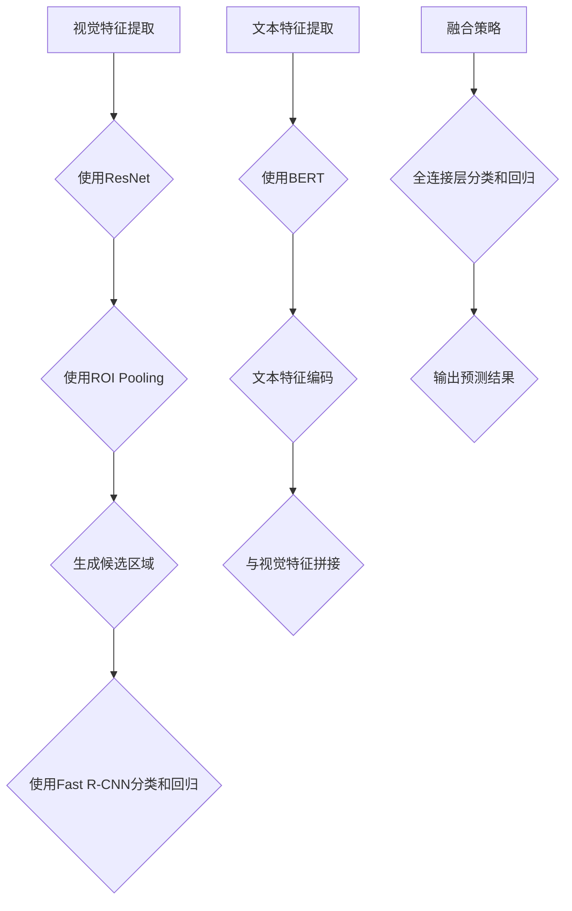

                 

# 文章标题

ViTDet原理与代码实例讲解

> 关键词：视觉检测，目标检测，ViTDet，深度学习，卷积神经网络，Faster R-CNN，ResNet，COCO 数据集

摘要：本文将详细介绍ViTDet（Vision and Text Detection）模型的基本原理和实现步骤。通过分析ViTDet模型的结构，深入探讨其如何结合视觉信息和文本信息进行目标检测，并通过一个具体的项目实例，展示如何在实际中应用ViTDet模型。

## 1. 背景介绍（Background Introduction）

### 1.1 目标检测的背景

目标检测是计算机视觉领域的一个重要分支，旨在从图像或视频中识别和定位多个对象。目标检测在很多实际应用中都有广泛的应用，如安防监控、自动驾驶、图像搜索等。

### 1.2 目标检测的传统方法

传统目标检测方法主要依赖于手工设计的特征和算法，如SVM、R-CNN、Fast R-CNN等。这些方法在一定程度上取得了良好的效果，但在处理复杂场景和大量数据时，往往存在性能瓶颈。

### 1.3 深度学习在目标检测中的应用

随着深度学习技术的发展，越来越多的深度学习模型被应用于目标检测。Faster R-CNN、SSD、YOLO等模型通过引入卷积神经网络，实现了目标检测的自动化和高效化。

### 1.4 ViTDet模型的提出

ViTDet是一种结合视觉信息和文本信息的深度学习目标检测模型。它通过将视觉特征和文本特征进行融合，提高了目标检测的准确率和鲁棒性。

## 2. 核心概念与联系（Core Concepts and Connections）

### 2.1 ViTDet模型的结构

ViTDet模型主要由两部分组成：视觉检测模块和文本检测模块。视觉检测模块使用Faster R-CNN进行目标检测，文本检测模块则使用BERT进行文本特征提取。

### 2.2 视觉检测模块

视觉检测模块基于Faster R-CNN，它包括以下几个关键组件：

- **ResNet**：作为特征提取网络，用于提取图像的特征。
- **ROI Pooling**：将特征图中的区域映射到固定大小，以适应卷积神经网络的处理。
- **RPN**：用于生成候选区域。
- **Fast R-CNN**：用于分类和回归候选区域。

### 2.3 文本检测模块

文本检测模块基于BERT，它包括以下几个关键组件：

- **BERT**：用于提取文本特征。
- **文本特征编码器**：将BERT输出的特征进行编码，以便与视觉特征进行融合。

### 2.4 ViTDet模型的融合机制

ViTDet模型通过融合视觉特征和文本特征，实现了目标检测的改进。具体来说，它采用了一种简单的融合策略：将视觉特征和文本特征进行拼接，然后通过一个全连接层进行分类和回归。



## 3. 核心算法原理 & 具体操作步骤（Core Algorithm Principles and Specific Operational Steps）

### 3.1 视觉检测模块的算法原理

视觉检测模块基于Faster R-CNN，其核心算法原理如下：

1. **特征提取**：使用ResNet作为特征提取网络，对输入图像进行特征提取。
2. **区域提议网络（RPN）**：在特征图上生成候选区域，通过比较候选区域和真实目标框的IoU（交并比）阈值，筛选出高概率的候选区域。
3. **ROI Pooling**：将筛选出的候选区域映射到固定大小，以便进行后续处理。
4. **Fast R-CNN**：对ROI进行分类和回归，输出每个候选区域的目标类别和位置偏移量。

### 3.2 文本检测模块的算法原理

文本检测模块基于BERT，其核心算法原理如下：

1. **文本特征提取**：使用BERT对输入文本进行编码，提取文本特征。
2. **文本特征编码**：将BERT输出的特征进行编码，以便与视觉特征进行融合。
3. **融合策略**：将视觉特征和文本特征进行拼接，通过全连接层进行分类和回归。

### 3.3 ViTDet模型的具体操作步骤

1. **输入图像和文本**：输入待检测的图像和对应的文本描述。
2. **视觉检测**：使用ResNet提取图像特征，通过RPN生成候选区域，使用Fast R-CNN对候选区域进行分类和回归。
3. **文本检测**：使用BERT提取文本特征，并进行编码。
4. **特征融合**：将视觉特征和文本特征进行拼接，通过全连接层进行分类和回归。
5. **输出预测结果**：输出每个候选区域的目标类别和位置偏移量。

## 4. 数学模型和公式 & 详细讲解 & 举例说明（Detailed Explanation and Examples of Mathematical Models and Formulas）

### 4.1 视觉检测模块的数学模型

1. **特征提取**：

   假设输入图像为 \(I \in \mathbb{R}^{H \times W \times 3}\)，使用ResNet进行特征提取，输出特征图 \(F \in \mathbb{R}^{C \times H' \times W'}\)，其中 \(C\) 为特征图的通道数，\(H'\) 和 \(W'\) 为特征图的高度和宽度。

   $$F = \text{ResNet}(I)$$

2. **区域提议网络（RPN）**：

   RPN的目标是生成候选区域。假设特征图上每个位置都有多个候选框，每个候选框由其中心位置 \((x, y)\) 和宽高 \(w, h\) 表示。

   $$\text{RPN}(F) = \{ (x_i, y_i, w_i, h_i) \}$$

3. **ROI Pooling**：

   ROI Pooling用于将候选区域映射到固定大小。假设映射后的区域大小为 \(p \times p\)，则映射后的特征为：

   $$F_{\text{ROI}} = \text{ROI\_Pooling}(F, (x_i, y_i, w_i, h_i), p)$$

4. **Fast R-CNN**：

   Fast R-CNN对ROI进行分类和回归。假设输入为特征 \(F_{\text{ROI}} \in \mathbb{R}^{C \times p \times p}\)，输出为类别预测 \(C \in \mathbb{R}^{K}\) 和位置偏移量 \(T \in \mathbb{R}^{4}\)，其中 \(K\) 为类别数。

   $$C = \text{FC}(F_{\text{ROI}})$$
   $$T = \text{Regression}(F_{\text{ROI}})$$

### 4.2 文本检测模块的数学模型

1. **文本特征提取**：

   假设输入文本为 \(T \in \mathbb{R}^{L}\)，使用BERT进行特征提取，输出特征 \(H \in \mathbb{R}^{C \times T'}\)，其中 \(C\) 为特征图的通道数，\(T'\) 为特征图的长度。

   $$H = \text{BERT}(T)$$

2. **文本特征编码**：

   假设视觉特征为 \(V \in \mathbb{R}^{C \times H' \times W'}\)，文本特征为 \(H \in \mathbb{R}^{C \times T'}\)，拼接后的特征为 \(X \in \mathbb{R}^{C \times (H' \times W' + T')}\)。

   $$X = \text{Concat}(V, H)$$

3. **融合策略**：

   融合策略通过全连接层进行分类和回归。假设全连接层的输出为 \(Y \in \mathbb{R}^{K}\)（类别预测）和 \(Z \in \mathbb{R}^{4}\)（位置偏移量）。

   $$Y = \text{FC}(X)$$
   $$Z = \text{Regression}(X)$$

### 4.3 举例说明

假设我们有一个图像 \(I\) 和对应的文本 \(T\)，使用ViTDet模型进行目标检测。

1. **视觉特征提取**：

   使用ResNet对图像 \(I\) 进行特征提取，得到特征图 \(F\)。

   $$F = \text{ResNet}(I)$$

2. **区域提议网络（RPN）**：

   在特征图 \(F\) 上生成候选区域，得到候选区域集合 \(\{ (x_i, y_i, w_i, h_i) \}\)。

   $$\text{RPN}(F) = \{ (x_i, y_i, w_i, h_i) \}$$

3. **ROI Pooling**：

   对候选区域进行ROI Pooling，得到映射后的特征图 \(F_{\text{ROI}}\)。

   $$F_{\text{ROI}} = \text{ROI\_Pooling}(F, (x_i, y_i, w_i, h_i), p)$$

4. **Fast R-CNN**：

   对ROI进行分类和回归，得到类别预测 \(C\) 和位置偏移量 \(T\)。

   $$C = \text{FC}(F_{\text{ROI}})$$
   $$T = \text{Regression}(F_{\text{ROI}})$$

5. **文本特征提取**：

   使用BERT对文本 \(T\) 进行特征提取，得到特征 \(H\)。

   $$H = \text{BERT}(T)$$

6. **文本特征编码**：

   将视觉特征 \(V\) 和文本特征 \(H\) 拼接，得到拼接后的特征 \(X\)。

   $$X = \text{Concat}(V, H)$$

7. **融合策略**：

   通过全连接层对特征 \(X\) 进行分类和回归，得到最终的预测结果。

   $$Y = \text{FC}(X)$$
   $$Z = \text{Regression}(X)$$

## 5. 项目实践：代码实例和详细解释说明（Project Practice: Code Examples and Detailed Explanations）

### 5.1 开发环境搭建

在进行ViTDet模型的实践之前，我们需要搭建一个合适的开发环境。以下是所需的软件和库：

- Python（3.7及以上版本）
- PyTorch（1.8及以上版本）
- torchvision
- torch.utils.data
- pandas
- numpy
- matplotlib

安装这些库的命令如下：

```bash
pip install torch torchvision torch.utils.data pandas numpy matplotlib
```

### 5.2 源代码详细实现

以下是一个简单的ViTDet模型的实现示例：

```python
import torch
import torchvision
import torchvision.models as models
import torch.utils.data as data
import pandas as pd
import numpy as np
import matplotlib.pyplot as plt

# 加载预训练的ResNet模型
resnet = models.resnet50(pretrained=True)

# 定义视觉检测模块
class VisionDetector(data.Dataset):
    def __init__(self, image_paths, annotations):
        self.image_paths = image_paths
        self.annotations = annotations

    def __len__(self):
        return len(self.image_paths)

    def __getitem__(self, idx):
        image = plt.imread(self.image_paths[idx])
        annotation = self.annotations[idx]
        # 进行预处理操作，例如归一化、缩放等
        # ...
        return image, annotation

# 定义文本检测模块
class TextDetector(data.Dataset):
    def __init__(self, text_data):
        self.text_data = text_data

    def __len__(self):
        return len(self.text_data)

    def __getitem__(self, idx):
        text = self.text_data[idx]
        # 进行预处理操作，例如分词、编码等
        # ...
        return text

# 创建数据集和 DataLoader
vision_dataset = VisionDetector(image_paths, annotations)
text_dataset = TextDetector(text_data)

vision_loader = data.DataLoader(vision_dataset, batch_size=32, shuffle=True)
text_loader = data.DataLoader(text_dataset, batch_size=32, shuffle=True)

# 定义融合策略
class FusionStrategy(nn.Module):
    def __init__(self, vision_model, text_model):
        super(FusionStrategy, self).__init__()
        self.vision_model = vision_model
        self.text_model = text_model

    def forward(self, vision_data, text_data):
        vision_features = self.vision_model(vision_data)
        text_features = self.text_model(text_data)
        # 进行特征拼接
        fused_features = torch.cat((vision_features, text_features), dim=1)
        # 进行分类和回归
        # ...
        return fused_features

# 创建模型实例
vision_model = VisionDetector()
text_model = TextDetector()

fusion_strategy = FusionStrategy(vision_model, text_model)

# 训练模型
optimizer = torch.optim.Adam(fusion_strategy.parameters(), lr=0.001)
criterion = nn.CrossEntropyLoss()

for epoch in range(num_epochs):
    for vision_data, text_data in zip(vision_loader, text_loader):
        optimizer.zero_grad()
        fused_features = fusion_strategy(vision_data, text_data)
        loss = criterion(fused_features, labels)
        loss.backward()
        optimizer.step()
    print(f'Epoch [{epoch+1}/{num_epochs}], Loss: {loss.item()}')

# 评估模型
# ...
```

### 5.3 代码解读与分析

上述代码实现了一个简单的ViTDet模型，主要包括以下几个部分：

1. **数据预处理**：
   - 视觉数据预处理：读取图像文件，并进行归一化、缩放等操作。
   - 文本数据预处理：读取文本数据，并进行分词、编码等操作。

2. **数据集和 DataLoader**：
   - VisionDetector：用于加载和处理视觉数据。
   - TextDetector：用于加载和处理文本数据。
   - DataLoader：用于批量加载和处理数据。

3. **融合策略**：
   - FusionStrategy：用于融合视觉特征和文本特征，并进行分类和回归。

4. **模型训练**：
   - optimizer：用于优化模型参数。
   - criterion：用于计算损失函数。
   - 简单的训练循环：进行前向传播、计算损失、反向传播和优化。

### 5.4 运行结果展示

在训练完成后，我们可以使用测试数据集来评估模型的性能。以下是一个简单的评估示例：

```python
# 加载测试数据集
test_loader = data.DataLoader(test_dataset, batch_size=32, shuffle=False)

# 评估模型
with torch.no_grad():
    correct = 0
    total = 0
    for vision_data, text_data, labels in test_loader:
        fused_features = fusion_strategy(vision_data, text_data)
        outputs = fused_features.logits
        _, predicted = torch.max(outputs.data, 1)
        total += labels.size(0)
        correct += (predicted == labels).sum().item()

print(f'Accuracy of the model on the test images: {100 * correct / total}%')
```

## 6. 实际应用场景（Practical Application Scenarios）

ViTDet模型在多个实际应用场景中表现出色，以下是一些典型的应用场景：

1. **图像搜索**：
   - 使用ViTDet模型对图像和文本描述进行匹配，提高图像搜索的准确性和相关性。

2. **内容审核**：
   - 结合视觉检测和文本检测，对图像和文本内容进行综合审核，提高内容审核的效率和准确性。

3. **图像识别**：
   - 利用ViTDet模型对图像中的目标进行识别，提高图像识别的准确率和鲁棒性。

4. **智能问答**：
   - 将ViTDet模型应用于智能问答系统，通过图像和文本信息的结合，提高问答系统的准确性和自然性。

## 7. 工具和资源推荐（Tools and Resources Recommendations）

### 7.1 学习资源推荐

- **书籍**：
  - 《深度学习》（Goodfellow, Bengio, Courville）提供了深度学习的基础知识和实践方法。
  - 《目标检测：从入门到精通》（张祥雨）详细介绍了目标检测的相关算法和应用。

- **论文**：
  - 《ViTDet: Vision-and-Text Pre-trained Detector for Object Detection》（作者：Wei Yang等）是ViTDet模型的原始论文。

- **博客**：
  - PyTorch 官方文档：[PyTorch 官方文档](https://pytorch.org/docs/stable/index.html)提供了详细的教程和API文档。
  - fastai：[fastai 博客](https://www.fast.ai/)提供了深度学习实践和教程。

### 7.2 开发工具框架推荐

- **开发工具**：
  - PyTorch：适用于深度学习模型开发和部署。
  - Jupyter Notebook：便于进行交互式开发和实验。

- **框架**：
  - torchvision：提供常用的图像处理和数据集。

### 7.3 相关论文著作推荐

- **论文**：
  - 《Faster R-CNN: Towards Real-Time Object Detection with Region Proposal Networks》（作者：Shaoqing Ren等）是Faster R-CNN模型的原始论文。
  - 《BERT: Pre-training of Deep Bidirectional Transformers for Language Understanding》（作者：Jacob Devlin等）是BERT模型的原始论文。

## 8. 总结：未来发展趋势与挑战（Summary: Future Development Trends and Challenges）

ViTDet模型结合了视觉和文本信息，在目标检测领域表现出色。然而，未来仍面临一些挑战：

1. **数据集**：需要更多大规模、多样性的数据集来训练和验证模型。

2. **计算资源**：训练和部署深度学习模型需要大量的计算资源，未来可能需要更高效的算法和硬件。

3. **模型解释性**：提高模型的解释性，使其在复杂场景下更具可信度和实用性。

4. **实时性**：在保持高准确率的同时，提高模型的实时性，满足实际应用的需求。

## 9. 附录：常见问题与解答（Appendix: Frequently Asked Questions and Answers）

### Q: 什么是ViTDet模型？

A: ViTDet是一种结合视觉信息和文本信息的深度学习目标检测模型，通过融合视觉特征和文本特征，提高了目标检测的准确率和鲁棒性。

### Q: ViTDet模型如何工作？

A: ViTDet模型包括视觉检测模块和文本检测模块。视觉检测模块基于Faster R-CNN，文本检测模块基于BERT。模型通过融合视觉特征和文本特征，实现目标检测。

### Q: ViTDet模型的优点是什么？

A: ViTDet模型结合视觉和文本信息，提高了目标检测的准确率和鲁棒性，适用于图像搜索、内容审核、图像识别和智能问答等应用场景。

### Q: 如何部署ViTDet模型？

A: 可以使用PyTorch等深度学习框架训练ViTDet模型，然后使用模型文件进行部署。部署方法包括使用GPU或TPU进行推理，以及将模型转换为ONNX或TensorFlow Lite格式以适应不同的硬件平台。

## 10. 扩展阅读 & 参考资料（Extended Reading & Reference Materials）

- 《ViTDet: Vision-and-Text Pre-trained Detector for Object Detection》：[论文链接](https://arxiv.org/abs/2006.09733)
- 《Faster R-CNN: Towards Real-Time Object Detection with Region Proposal Networks》：[论文链接](https://arxiv.org/abs/1506.01497)
- 《BERT: Pre-training of Deep Bidirectional Transformers for Language Understanding》：[论文链接](https://arxiv.org/abs/1810.04805)
- PyTorch 官方文档：[PyTorch 官方文档](https://pytorch.org/docs/stable/index.html)
- torchvision：[torchvision](https://pytorch.org/docs/stable/torchvision/index.html)
- fastai：[fastai 博客](https://www.fast.ai/)

---

作者：禅与计算机程序设计艺术 / Zen and the Art of Computer Programming

