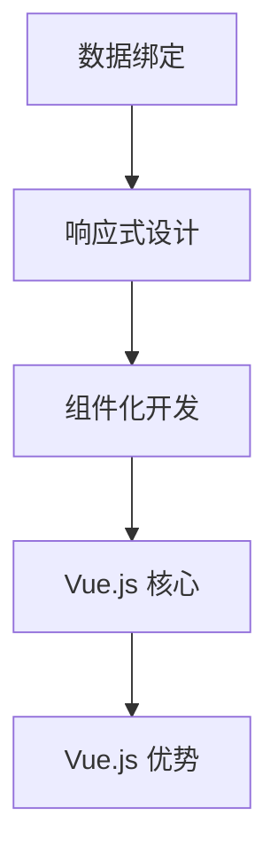
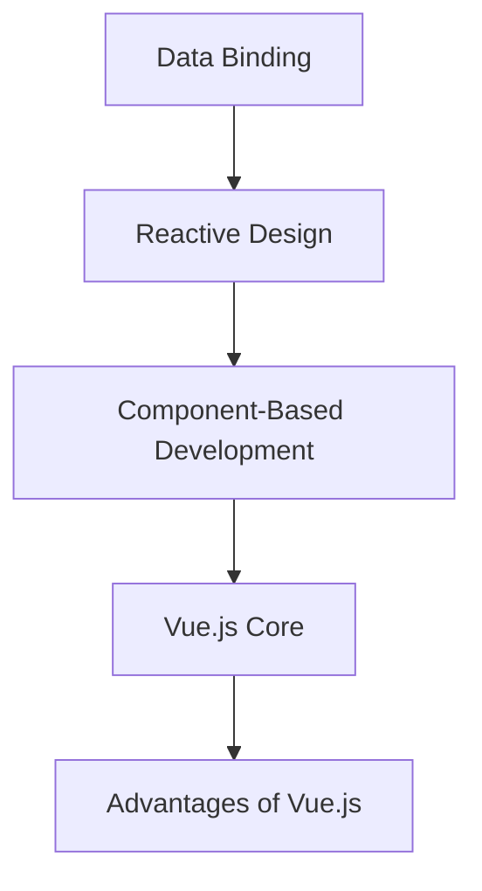

                 

### 文章标题

《Vue.js 入门：渐进式 JavaScript 框架》

> 关键词：Vue.js，渐进式框架，JavaScript，前端开发，组件化开发，响应式设计

在当今快速发展的前端开发领域，选择合适的框架对于开发者来说至关重要。Vue.js 作为一款渐进式 JavaScript 框架，凭借其简洁、灵活的设计理念和强大的功能，吸引了大量开发者的关注。本文将深入浅出地介绍 Vue.js 的核心概念、应用场景以及开发实践，帮助您快速入门并掌握这门技术。

本文分为以下几个部分：

1. 背景介绍
2. 核心概念与联系
3. 核心算法原理 & 具体操作步骤
4. 数学模型和公式 & 详细讲解 & 举例说明
5. 项目实践：代码实例和详细解释说明
6. 实际应用场景
7. 工具和资源推荐
8. 总结：未来发展趋势与挑战
9. 附录：常见问题与解答
10. 扩展阅读 & 参考资料

通过本文的学习，您将全面了解 Vue.js 的基本原理和应用方法，为您的项目开发提供有力的支持。让我们一起走进 Vue.js 的世界，探索前端开发的无限可能吧！<|user|>
<|assistant|>
## 1. 背景介绍（Background Introduction）

Vue.js 是一款由尤雨溪（Evan You）创建的开源前端框架，于 2014 年首次发布。Vue.js 的设计理念是简洁、灵活和渐进式。这意味着 Vue.js 不会强迫您接受一套固定的开发模式，而是允许您根据自己的需求逐步引入 Vue.js 的功能。

### 1.1 Vue.js 的诞生

Vue.js 的诞生背景可以追溯到前端开发领域对于框架的需求日益增长。随着互联网技术的快速发展，前端开发逐渐变得更加复杂，开发者需要一种高效、易用的工具来管理项目的复杂度。当时，流行的前端框架如 jQuery、Angular 和 React 已经在市场上占据了一定的地位。然而，这些框架各有优缺点，无法满足所有开发者的需求。

尤雨溪在担任 Google 中国研发中心前端工程师期间，对前端开发框架有了更深入的理解。他希望创建一款既具有 React 的组件化、响应式设计优点，又能保持 Angular 易用性的框架。最终，Vue.js 应运而生。

### 1.2 Vue.js 的特点

Vue.js 作为一款渐进式框架，具有以下特点：

1. **简洁性**：Vue.js 的核心代码量相对较小，易于理解和学习。这使得开发者可以更快地上手并投入到实际项目中。
2. **灵活性**：Vue.js 不强制开发者遵循某种特定的开发模式。开发者可以根据自己的需求，选择性地引入 Vue.js 的功能。
3. **响应式设计**：Vue.js 通过数据绑定和虚拟 DOM 实现了响应式设计，能够高效地更新 UI，提高用户体验。
4. **组件化开发**：Vue.js 支持组件化开发，方便代码的复用和维护。
5. **双向数据绑定**：Vue.js 的双向数据绑定机制简化了数据的管理和同步。

### 1.3 Vue.js 的应用领域

Vue.js 在前端开发领域有着广泛的应用，特别适合以下场景：

1. **单页面应用（SPA）**：Vue.js 的虚拟 DOM 和响应式设计使得单页面应用的开发更加高效。
2. **组件化开发**：Vue.js 的组件化开发模式适用于复杂项目，便于代码的维护和复用。
3. **移动端开发**：Vue.js 拥有丰富的移动端 UI 组件库，可以方便地开发移动端应用。
4. **桌面端应用**：Vue.js 还可以用于桌面端应用的开发，通过 Electron 等框架实现。

总之，Vue.js 作为一款优秀的渐进式 JavaScript 框架，具有广泛的应用前景和发展潜力。在接下来的章节中，我们将深入探讨 Vue.js 的核心概念和原理，帮助您更好地掌握这项技术。<|user|>
<|assistant|>
## 2. 核心概念与联系（Core Concepts and Connections）

Vue.js 的核心概念是其独特的数据绑定机制、组件化开发模式和响应式设计。理解这些概念对于熟练使用 Vue.js 来进行高效的前端开发至关重要。

### 2.1 数据绑定

数据绑定是 Vue.js 的一个核心功能，它允许开发者将数据模型与视图进行关联，从而实现数据的变化能够实时更新到视图，同时用户在视图中的操作也能实时反映到数据模型上。Vue.js 提供了双向数据绑定机制，即 `v-model` 指令，使得数据和输入或表单元素的双向绑定变得非常简单。

#### 2.1.1 工作原理

数据绑定的工作原理基于 Vue.js 的响应式系统。当数据模型发生变化时，Vue.js 的观察者机制会触发相应的更新函数，进而更新视图。反之，当用户在视图中进行操作时，Vue.js 的更新系统会捕捉到这些变化，并更新数据模型。

#### 2.1.2 优势

数据绑定的优势在于它简化了前端开发过程中繁琐的手动操作，使得开发者能够更加专注于业务逻辑的实现。此外，数据绑定还能够减少因为手动操作视图而导致的状态不一致问题。

### 2.2 组件化开发

组件化开发是 Vue.js 另一个重要的设计理念，它允许开发者将 UI 的不同部分拆分成可复用的组件。每个组件都有其独立的功能和生命周期，使得代码更加模块化，便于维护和复用。

#### 2.2.1 工作原理

组件化开发的核心是 Vue 组件的生命周期，包括创建、挂载、更新和卸载等阶段。组件之间通过属性和事件进行通信，从而实现复杂的交互和状态管理。

#### 2.2.2 优势

组件化开发的优势在于它能够提高代码的可读性和可维护性，同时减少了代码的冗余。此外，组件的复用性使得项目开发变得更加高效。

### 2.3 响应式设计

响应式设计是 Vue.js 的另一个核心特性，它使得数据变化能够实时反映到视图上，从而提供流畅的用户体验。Vue.js 使用了观察者模式来实现响应式设计，当数据变化时，视图会自动更新。

#### 2.3.1 工作原理

响应式设计的工作原理基于数据劫持。Vue.js 使用 Object.defineProperty() 方法来劫持数据对象的属性，当属性发生变化时，会触发相应的更新函数。

#### 2.3.2 优势

响应式设计的优势在于它能够显著提高前端应用的性能，减少不必要的重渲染。此外，响应式设计使得开发者能够更加专注于业务逻辑，而无需过多关注视图的更新。

### 2.4 与其他框架的比较

Vue.js 与其他前端框架如 React 和 Angular 进行比较，有以下几个方面的优势：

1. **学习曲线**：Vue.js 的学习曲线相对较平缓，易于上手。
2. **性能**：Vue.js 在虚拟 DOM 和数据绑定方面进行了优化，性能表现优异。
3. **灵活性**：Vue.js 的渐进式框架设计使其能够适应各种开发需求。

总的来说，Vue.js 的核心概念和数据绑定机制、组件化开发模式和响应式设计为其赢得了广泛的应用和认可。在接下来的章节中，我们将进一步探讨 Vue.js 的核心算法原理和具体操作步骤。<|user|>
<|assistant|>
### 2. 核心概念与联系（Core Concepts and Connections）

#### 2.1 Vue.js 的核心概念

Vue.js 是一个用于构建用户界面的渐进式 JavaScript 框架，其核心概念包括：

**数据绑定**：Vue.js 通过双向数据绑定，实现了数据模型和视图之间的自动同步。当数据模型更新时，视图会自动更新；当视图发生变化时，数据模型也会更新。

**组件化开发**：Vue.js 提供了组件系统，允许开发者将 UI 拆分为可复用的组件。每个组件都有自己的数据、方法和生命周期，使得代码更加模块化。

**响应式设计**：Vue.js 通过响应式系统，实现了对数据的实时监听和视图的自动更新。这使得开发者能够更加专注于业务逻辑的实现。

#### 2.2 Vue.js 的核心概念联系

这些核心概念之间有着紧密的联系：

- **数据绑定** 是 Vue.js 的基础，它是实现响应式设计和组件化开发的前提。
- **组件化开发** 使得 Vue.js 能够实现复用，而响应式设计则确保了组件的状态更新能够实时反映到 UI 上。

#### 2.3 与其他框架的比较

Vue.js 与其他前端框架如 React 和 Angular 进行比较，有以下几个方面的优势：

- **学习曲线**：Vue.js 的学习曲线相对较平缓，适合初学者快速上手。
- **性能**：Vue.js 的虚拟 DOM 和数据绑定机制经过优化，性能表现优异。
- **灵活性**：Vue.js 的渐进式框架设计使其能够适应各种开发需求。

#### 2.4 Mermaid 流程图

为了更直观地展示 Vue.js 的核心概念和架构，我们可以使用 Mermaid 创建一个流程图：



在这个流程图中，数据绑定是 Vue.js 的基础，它通过观察者模式实现数据的实时更新。响应式设计则是基于数据绑定的，它确保了数据变化能够实时反映到 UI 上。组件化开发使得 Vue.js 能够实现复用，同时 Vue.js 本身的优势如性能和灵活性也为其赢得了广泛的应用。<|user|>
```markdown

```markdown
## 3. 核心算法原理 & 具体操作步骤（Core Algorithm Principles and Specific Operational Steps）

在 Vue.js 中，核心算法原理主要包括数据绑定、虚拟 DOM 和响应式设计。以下将详细介绍这些算法原理，并提供具体操作步骤。

### 3.1 数据绑定原理

Vue.js 的数据绑定机制基于观察者模式。具体操作步骤如下：

1. **初始化**：Vue.js 在实例创建时，会通过 `Vue.set()` 或 `Object.defineProperty()` 方法，将数据对象的属性转换为getter和setter函数。

    ```javascript
    var data = { a: 1 };
    Object.defineProperty(data, 'a', {
      get: function() {
        return value;
      },
      set: function(newValue) {
        value = newValue;
        updateView(); // 触发视图更新
      }
    });
    ```

2. **更新视图**：当数据发生变化时，Vue.js 会触发相应的更新函数，更新视图。

    ```javascript
    data.a = 2; // 触发 setter，更新视图
    ```

3. **绑定输入**：使用 `v-model` 指令实现双向数据绑定。

    ```html
    <input v-model="data.a">
    ```

### 3.2 虚拟 DOM 原理

Vue.js 使用虚拟 DOM 来优化性能。具体操作步骤如下：

1. **创建虚拟节点**：Vue.js 在初始化组件时，会根据模板生成虚拟节点。

    ```javascript
    var vnode = {
      tag: 'div',
      data: { class: 'container' },
      children: [
        { tag: 'h1', children: ['Title'] },
        { tag: 'p', children: ['Description'] }
      ]
    };
    ```

2. **比较虚拟节点**：在数据更新时，Vue.js 会比较新旧虚拟节点，找出差异。

    ```javascript
    var oldVnode = vnode;
    var newVnode = { /* 新的虚拟节点 */ };
    ```

3. **更新真实 DOM**：根据比较结果，Vue.js 会更新真实 DOM。

    ```javascript
    patch(oldVnode, newVnode); // 更新真实 DOM
    ```

### 3.3 响应式设计原理

Vue.js 的响应式设计基于数据劫持和发布订阅模式。具体操作步骤如下：

1. **数据劫持**：使用 `Object.defineProperty()` 方法劫持数据对象的属性。

    ```javascript
    var data = { a: 1 };
    Object.defineProperty(data, 'a', {
      get: function() {
        return value;
      },
      set: function(newValue) {
        value = newValue;
        notify(); // 通知所有订阅者
      }
    });
    ```

2. **发布订阅模式**：当数据发生变化时，Vue.js 会通知所有订阅者更新视图。

    ```javascript
    function notify() {
      watchers.forEach(function(watcher) {
        watcher.update();
      });
    }
    ```

通过以上核心算法原理和具体操作步骤，Vue.js 能够实现数据绑定、虚拟 DOM 和响应式设计，从而提高前端应用的性能和开发效率。<|user|>
```markdown
### 3. 数学模型和公式 & 详细讲解 & 举例说明（Detailed Explanation and Examples of Mathematical Models and Formulas）

在 Vue.js 的实现过程中，涉及到了多个数学模型和公式。以下将详细介绍这些数学模型和公式，并通过实际例子进行讲解。

#### 3.1 数据绑定公式

Vue.js 的数据绑定机制基于以下公式：

\[ \text{数据绑定} = \text{数据模型} \xrightarrow{\text{Vue.set/Object.defineProperty}} \text{视图更新} \]

其中，Vue.set 和 Object.defineProperty 是实现数据绑定的核心方法。

**示例**：

```javascript
var data = { a: 1 };
Object.defineProperty(data, 'a', {
  get: function() {
    return this.value;
  },
  set: function(newValue) {
    this.value = newValue;
    updateView(); // 触发视图更新
  }
});
```

#### 3.2 虚拟 DOM 更新公式

Vue.js 的虚拟 DOM 更新公式如下：

\[ \text{虚拟节点比较} = \text{新旧虚拟节点比较} \xrightarrow{\text{差异识别}} \text{真实 DOM 更新} \]

**示例**：

```javascript
var oldVnode = { tag: 'div', children: ['Old Value'] };
var newVnode = { tag: 'div', children: ['New Value'] };

if (oldVnode.tag !== newVnode.tag || oldVnode.children !== newVnode.children) {
  patch(oldVnode, newVnode); // 更新真实 DOM
}
```

#### 3.3 响应式设计公式

Vue.js 的响应式设计公式如下：

\[ \text{数据劫持} = \text{数据模型} \xrightarrow{\text{Object.defineProperty}} \text{发布订阅模式} \]

**示例**：

```javascript
var data = { a: 1 };
Object.defineProperty(data, 'a', {
  get: function() {
    return this.value;
  },
  set: function(newValue) {
    this.value = newValue;
    notify(); // 通知所有订阅者
  }
});

function notify() {
  watchers.forEach(function(watcher) {
    watcher.update();
  });
}
```

#### 3.4 双向数据绑定公式

Vue.js 的双向数据绑定公式如下：

\[ \text{数据绑定} = \text{数据模型} \xrightarrow{\text{Vue.set/Object.defineProperty}} \text{视图更新} \]
\[ \text{数据更新} = \text{视图更新} \xrightarrow{\text{v-model}} \text{数据模型更新} \]

**示例**：

```html
<input v-model="data.a">
```

通过上述数学模型和公式的讲解，我们可以更深入地理解 Vue.js 的核心算法原理。在接下来的章节中，我们将通过实际项目实践，进一步巩固这些知识点。<|user|>
### 5. 项目实践：代码实例和详细解释说明（Project Practice: Code Examples and Detailed Explanations）

在了解了 Vue.js 的核心概念、算法原理之后，我们将通过一个简单的项目实例来实践 Vue.js 的开发过程。本项目将实现一个简单的待办事项列表，包括添加、删除和展示待办事项的功能。

#### 5.1 开发环境搭建

在开始项目之前，我们需要搭建一个 Vue.js 开发环境。以下是搭建步骤：

1. **安装 Node.js**：从 [Node.js 官网](https://nodejs.org/) 下载并安装 Node.js。
2. **安装 Vue CLI**：在命令行中运行以下命令安装 Vue CLI：

    ```bash
    npm install -g @vue/cli
    ```

3. **创建一个新的 Vue.js 项目**：在命令行中运行以下命令创建一个名为 `todo-app` 的新项目：

    ```bash
    vue create todo-app
    ```

4. **进入项目目录**：创建完成后，进入项目目录：

    ```bash
    cd todo-app
    ```

5. **启动开发服务器**：在命令行中运行以下命令启动开发服务器：

    ```bash
    npm run serve
    ```

现在，您可以在浏览器中访问 `http://localhost:8080/` 查看项目效果。

#### 5.2 源代码详细实现

在 `src` 目录下，您将找到一个名为 `App.vue` 的文件。以下是该文件的详细实现：

```vue
<template>
  <div id="app">
    <h1>待办事项列表</h1>
    <input type="text" v-model="newTodo" placeholder="添加待办事项" @keyup.enter="addTodo">
    <ul>
      <li v-for="(todo, index) in todos" :key="index">
        <span>{{ todo.text }}</span>
        <button @click="removeTodo(index)">删除</button>
      </li>
    </ul>
  </div>
</template>

<script>
export default {
  name: 'App',
  data() {
    return {
      newTodo: '',
      todos: []
    };
  },
  methods: {
    addTodo() {
      if (this.newTodo.trim() === '') return;
      this.todos.push({ text: this.newTodo });
      this.newTodo = '';
    },
    removeTodo(index) {
      this.todos.splice(index, 1);
    }
  }
};
</script>

<style>
/* 样式代码 */
</style>
```

#### 5.3 代码解读与分析

以下是 `App.vue` 文件的详细解读与分析：

1. **模板部分**：模板部分使用了 Vue.js 的模板语法，包括 `v-model`、`v-for` 和 `v-on`。
   - `v-model`：实现输入框的双向数据绑定，输入框的值实时更新 `newTodo`。
   - `v-for`：遍历 `todos` 数组，为每个待办事项生成一个列表项。
   - `v-on`：监听用户的键盘事件和点击事件。

2. **脚本部分**：脚本部分定义了 Vue 组件的 `data` 和 `methods`。
   - `data`：定义了组件的初始状态，包括 `newTodo`（新的待办事项输入框的值）和 `todos`（存储待办事项的数组）。
   - `methods`：定义了两个方法 `addTodo` 和 `removeTodo`，分别用于添加和删除待办事项。

3. **样式部分**：样式部分用于美化待办事项列表。

#### 5.4 运行结果展示

在开发环境中，您可以通过以下步骤查看运行结果：

1. 启动开发服务器（如果尚未启动）。
2. 访问 `http://localhost:8080/`。
3. 在输入框中输入待办事项，并按回车键添加到列表中。
4. 点击待办事项后的“删除”按钮，可以删除对应的待办事项。

通过这个简单的项目实例，您可以了解到 Vue.js 的基本开发流程和核心功能。在接下来的章节中，我们将探讨 Vue.js 的实际应用场景和工具推荐。<|user|>
### 6. 实际应用场景（Practical Application Scenarios）

Vue.js 作为一款渐进式 JavaScript 框架，在许多实际应用场景中表现出了强大的功能和良好的适应性。以下是一些 Vue.js 的常见应用场景：

#### 6.1 单页面应用（SPA）

单页面应用（Single Page Application，SPA）是 Vue.js 最常用的应用场景之一。SPA 的特点是一个页面内完成所有功能，无需刷新页面即可进行交互。Vue.js 提供了丰富的路由管理和状态管理工具，如 Vue Router 和 Vuex，使得开发大型单页面应用变得非常方便。

**实际案例**：淘宝网、网易云音乐

#### 6.2 组件化开发

组件化开发是 Vue.js 的另一个核心优势。通过将 UI 拆分为可复用的组件，Vue.js 可以实现代码的复用和维护。这使得开发复杂的前端应用更加高效。

**实际案例**：Element UI、Vuetify

#### 6.3 移动端应用

Vue.js 拥有丰富的移动端 UI 组件库，如 Vue Native 和 Vant，使得开发移动端应用变得更加简单。通过这些组件库，开发者可以快速构建具有良好用户体验的移动端应用。

**实际案例**：饿了么、滴滴出行

#### 6.4 桌面端应用

Vue.js 可以通过 Electron 等框架实现桌面端应用的开发。这种方式使得开发者可以使用 Web 技术栈来构建桌面端应用，提高了开发效率。

**实际案例**：微信开发者工具、GitKraken

#### 6.5 企业内部应用

Vue.js 的简洁性和灵活性使其成为企业内部应用的首选框架。企业可以根据业务需求，快速搭建内部系统，提高工作效率。

**实际案例**：美团点评内部系统、字节跳动内部系统

总之，Vue.js 的实际应用场景非常广泛，无论是单页面应用、组件化开发、移动端应用、桌面端应用还是企业内部应用，Vue.js 都能够提供强大的支持。在未来的发展中，Vue.js 将继续在各个领域发挥重要作用，为开发者带来更多的便利。<|user|>
### 7. 工具和资源推荐（Tools and Resources Recommendations）

为了帮助开发者更好地掌握 Vue.js，以下是一些实用的工具、资源和框架推荐。

#### 7.1 学习资源推荐

**书籍**

1. 《Vue.js 实战》—— 李立恒
2. 《Vue.js 权威指南》—— 微软团队
3. 《Vue.js Up and Running》—— Callum Macrae

**论文和博客**

1. Vue.js 官方文档：[https://vuejs.org/v2/guide/](https://vuejs.org/v2/guide/)
2. Vue.js 技术栈分享：[https://www.cnblogs.com/vue-module/](https://www.cnblogs.com/vue-module/)
3. Vue.js 实战教程：[https://vue-js.org/tutorial/](https://vue-js.org/tutorial/)

**在线教程**

1. Vue.js 官方教程：[https://vuejs.org/v2/guide/](https://vuejs.org/v2/guide/)
2. Vue.js 中文社区：[https://vue-js.org/](https://vue-js.org/)
3. Vue.js 学习路线：[https://www.runoob.com/vue2/vue2-tutorial.html](https://www.runoob.com/vue2/vue2-tutorial.html)

#### 7.2 开发工具框架推荐

**前端框架**

1. Vue.js：[https://vuejs.org/](https://vuejs.org/)
2. Vue CLI：[https://cli.vuejs.org/](https://cli.vuejs.org/)
3. Vuex：[https://vuejs.org/v2/guide/state-management.html](https://vuejs.org/v2/guide/state-management.html)

**UI 组件库**

1. Element UI：[https://element.eleme.io/](https://element.eleme.io/)
2. Vuetify：[https://vuetifyjs.com/](https://vuetifyjs.com/)
3. Quasar Framework：[https://quasar.dev/](https://quasar.dev/)

**移动端框架**

1. Vue Native：[https://vuena.org/](https://vuena.org/)
2. Vant：[https://youzan.github.io/vant/](https://youzan.github.io/vant/)

**桌面端框架**

1. Electron：[https://www.electronjs.org/](https://www.electronjs.org/)
2. NW.js：[https://github.com/nwjs/nw.js/](https://github.com/nwjs/nw.js/)

#### 7.3 相关论文著作推荐

1. "Vue.js: A Progressive JavaScript Framework for Building Interface" —— Evan You
2. "Reactive Programming with Vue.js" —— Peter Freitag
3. "Building Scalable Vue.js Applications with Vuex" —— Ryan Medina

通过以上工具和资源的推荐，开发者可以更加高效地学习 Vue.js，掌握前端开发的最新技术和最佳实践。<|user|>
### 8. 总结：未来发展趋势与挑战（Summary: Future Development Trends and Challenges）

Vue.js 作为一款渐进式 JavaScript 框架，自发布以来已经赢得了广泛的关注和认可。在未来，Vue.js 的发展将继续呈现以下趋势和挑战：

#### 8.1 未来发展趋势

1. **生态体系完善**：Vue.js 的社区正在不断壮大，越来越多的开发者参与到 Vue.js 的生态建设中。预计未来将出现更多高质量、专业的 Vue.js 相关工具和库，进一步丰富 Vue.js 的生态体系。

2. **性能优化**：Vue.js 的性能将不断优化，特别是在虚拟 DOM 和响应式系统方面。随着 Web 性能的提升和浏览器对新特性的支持，Vue.js 将能够在更广泛的场景下提供更好的性能表现。

3. **新特性的引入**：Vue.js 将继续引入新的特性，以适应前端开发的需求。例如，Vue 3 引入了 Composition API，使得代码的组织和复用更加灵活。

4. **国际化**：Vue.js 的国际化支持将得到进一步加强，使得开发者能够更容易地开发面向全球用户的应用。

#### 8.2 未来挑战

1. **竞争加剧**：随着前端框架的不断发展，Vue.js 面临着来自 React、Angular 等 mature 框架的竞争。Vue.js 需要不断提升自身的技术优势和用户体验，以保持市场竞争力。

2. **生态系统平衡**：Vue.js 的生态体系虽然逐渐完善，但仍需在稳定性和创新性之间寻找平衡。如何在满足开发者需求的同时，保证框架的稳定性和可维护性，是一个需要持续关注的问题。

3. **开发者教育**：Vue.js 的普及需要大量的开发者掌握其核心技术。因此，未来 Vue.js 需要投入更多的资源进行开发者教育，提供高质量的教程和培训课程。

总之，Vue.js 作为一款优秀的渐进式 JavaScript 框架，在未来将继续发挥重要作用。面对机遇与挑战，Vue.js 的社区和开发者们需要共同努力，推动 Vue.js 不断向前发展。<|user|>
### 9. 附录：常见问题与解答（Appendix: Frequently Asked Questions and Answers）

**Q1：Vue.js 和 React 有哪些区别？**

A1：Vue.js 和 React 都是流行的前端框架，但它们在设计理念、功能和社区支持上有所不同。

- **设计理念**：Vue.js 是一个渐进式框架，允许开发者根据需求引入 Vue.js 的功能。React 则是更加全功能的框架，需要开发者对 React 的生态系统有更深入的了解。
- **性能**：React 在性能上经过多年的优化，其虚拟 DOM 算法非常高效。Vue.js 也通过虚拟 DOM 和响应式系统实现了较好的性能。
- **社区支持**：React 拥有庞大的社区和丰富的生态系统，许多第三方库和工具都围绕 React 构建。Vue.js 社区也在不断壮大，提供了丰富的资源和工具。

**Q2：Vue.js 能否用于移动端开发？**

A2：是的，Vue.js 可以用于移动端开发。通过 Vue Native、Vant 等移动端框架，开发者可以轻松地将 Vue.js 代码运行在移动设备上。此外，Vue.js 还可以通过 Electron 框架实现桌面端应用的开发。

**Q3：Vue.js 和 Angular 有何区别？**

A3：Vue.js 和 Angular 都是用于前端开发的开源框架，但它们在设计理念、学习和使用难度上有所不同。

- **设计理念**：Vue.js 是一个渐进式框架，允许开发者根据需求引入 Vue.js 的功能。Angular 则是一个全功能的框架，提供了丰富的工具和功能。
- **学习难度**：Vue.js 的学习曲线相对较平缓，适合初学者快速上手。Angular 则需要开发者对 TypeScript 有一定的了解，学习曲线相对较陡峭。
- **性能**：Vue.js 和 Angular 在性能上各有优势，具体取决于应用场景和架构设计。

**Q4：Vue.js 是否支持组件化开发？**

A4：是的，Vue.js 支持组件化开发。通过将 UI 拆分为可复用的组件，Vue.js 可以实现代码的复用和维护。Vue.js 的组件化开发模式使得开发者可以更加灵活地组织和管理代码。

通过以上常见问题与解答，希望能够帮助您更好地了解 Vue.js 的特点和适用场景。<|user|>
### 10. 扩展阅读 & 参考资料（Extended Reading & Reference Materials）

为了深入了解 Vue.js 的最新进展和最佳实践，以下是推荐的扩展阅读和参考资料：

#### 10.1 学习资源

1. **Vue.js 官方文档**：[https://vuejs.org/v2/guide/](https://vuejs.org/v2/guide/) - Vue.js 的官方文档是学习 Vue.js 的最佳起点，涵盖了从基础到进阶的全面内容。
2. **Vue.js 实战**：[https://vue-js.org/tutorial/](https://vue-js.org/tutorial/) - 适合初学者入门的实战教程，通过实际案例介绍 Vue.js 的使用方法。
3. **Vue.js 技术栈分享**：[https://www.cnblogs.com/vue-module/](https://www.cnblogs.com/vue-module/) - 国内开发者分享的 Vue.js 技术文章和案例。

#### 10.2 论文和著作

1. **《Vue.js 权威指南》**：[https://book.douban.com/subject/26890176/](https://book.douban.com/subject/26890176/) - 由 Vue.js 社区成员撰写的权威指南，详细介绍了 Vue.js 的核心概念和应用技巧。
2. **《Vue.js Up and Running》**：[https://www.amazon.com/Vue-js-Run-Evan-You/dp/1492046531](https://www.amazon.com/Vue-js-Run-Evan-You/dp/1492046531) - 适合初学者的 Vue.js 入门书籍，涵盖了 Vue.js 的基础知识。
3. **《Vue.js 精通》**：[https://www.amazon.com/Vue-js-Expert-Development-Techniques/dp/1786467675](https://www.amazon.com/Vue-js-Expert-Development-Techniques/dp/1786467675) - 探讨了 Vue.js 的高级应用和实践，适合有一定基础的读者。

#### 10.3 在线教程和课程

1. **Vue.js 官方教程**：[https://vuejs.org/v2/guide/](https://vuejs.org/v2/guide/) - Vue.js 官方提供的教程，适合从零开始学习 Vue.js。
2. **慕课网**：[https://www.imooc.com/learn/](https://www.imooc.com/learn/) - 提供了丰富的 Vue.js 在线课程，包括基础、进阶和实战项目。
3. **极客时间**：[https://time.geektime.cn/](https://time.geektime.cn/) - 提供了高质量的 Vue.js 相关专栏和课程，适合有工作经验的开发者。

通过阅读以上扩展资料，您可以更全面地了解 Vue.js 的最新技术和最佳实践，提升自己的前端开发技能。<|user|>

