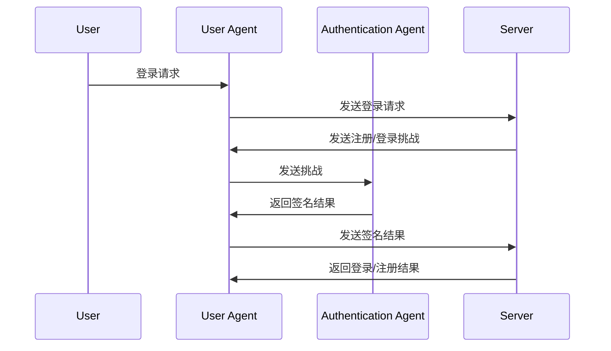

                 

# 文章标题

## WebAuthn 的实现细节

> 关键词：WebAuthn, 生物识别, 客户端身份验证, 安全性, Web标准
>
> 摘要：本文将深入探讨 WebAuthn 的实现细节，包括其背景介绍、核心概念与联系、算法原理与操作步骤、数学模型与公式、项目实践以及实际应用场景等。通过逐步分析，帮助读者全面理解 WebAuthn 的技术要点和应用价值。

<|user|>
## 1. 背景介绍（Background Introduction）

WebAuthn 是一个新兴的 Web 标准，旨在提供一种简单、安全且用户友好的方式来进行客户端身份验证。随着互联网的不断发展，网络安全问题日益凸显，尤其是针对个人信息的保护。传统的密码验证方式已经难以满足日益增长的安全需求。为了解决这个问题，WebAuthn 应运而生。

### 1.1 WebAuthn 的起源

WebAuthn 的起源可以追溯到 2012 年，当时 Google、Mozilla 和 Microsoft 等公司联合提出了 FIDO（Fast Identity Online）标准的初步方案。FIDO 标准旨在通过公共密钥基础架构（PKI）来提供一种安全的、无需密码的身份验证方法。随后，FIDO 标准逐渐发展，并于 2019 年 6 月成为正式的 Web 标准，即 WebAuthn。

### 1.2 WebAuthn 的目标

WebAuthn 的目标主要有两个方面：

1. 提供一种简单、安全且用户友好的身份验证方式，以替代传统的密码验证。
2. 促进生物识别技术的普及，如指纹识别、面部识别等。

### 1.3 WebAuthn 的优势

与传统的密码验证方式相比，WebAuthn 具有以下几个显著优势：

1. **更强的安全性**：WebAuthn 使用公钥加密技术，确保了用户身份的隐私和安全。
2. **便捷性**：用户无需记住复杂的密码，可以使用生物识别技术或其他简单的方式进行身份验证。
3. **跨平台兼容性**：WebAuthn 支持各种设备，包括 PC、智能手机和平板电脑等。
4. **无需第三方认证机构**：WebAuthn 采用了基于公钥加密的验证方式，无需依赖于第三方认证机构，降低了成本。

## 2. 核心概念与联系（Core Concepts and Connections）

### 2.1 WebAuthn 的工作原理

WebAuthn 的工作原理可以概括为以下几个步骤：

1. **注册阶段**：用户在设备上注册 WebAuthn 凭证，包括私钥和对应的公钥证书。
2. **登录阶段**：用户使用注册的 WebAuthn 凭证进行身份验证。
3. **服务器验证**：服务器接收到用户的登录请求后，对用户的身份进行验证。

### 2.2 WebAuthn 的核心组件

WebAuthn 的核心组件包括：

1. **用户代理（User Agent）**：通常指用户的浏览器，负责与服务器进行通信。
2. **认证代理（Authentication Agent）**：可以是设备内置的硬件安全模块（HSM）或软件模块。
3. **服务器（Server）**：负责接收和处理用户的登录请求。

### 2.3 WebAuthn 的 Mermaid 流程图

下面是一个简化的 WebAuthn 的 Mermaid 流程图，展示了用户注册和登录的过程：



## 3. 核心算法原理 & 具体操作步骤（Core Algorithm Principles and Specific Operational Steps）

### 3.1 注册阶段

在注册阶段，用户需要使用认证代理（如指纹识别器或面部识别器）生成一对密钥：私钥和公钥。私钥存储在用户的设备上，而公钥则发送给服务器。

具体操作步骤如下：

1. **服务器生成挑战**：服务器生成一个随机挑战值，并将其发送给用户代理。
2. **用户代理生成签名**：用户代理将挑战值、用户的公钥和私钥一起发送给认证代理，认证代理生成签名。
3. **用户代理发送签名**：用户代理将签名发送给服务器。
4. **服务器验证签名**：服务器使用公钥验证签名，以确保用户身份的真实性。

### 3.2 登录阶段

在登录阶段，用户需要使用认证代理生成签名，以证明其身份。

具体操作步骤如下：

1. **服务器生成登录请求**：服务器生成一个随机登录请求，并将其发送给用户代理。
2. **用户代理生成签名**：用户代理将登录请求、用户的公钥和私钥一起发送给认证代理，认证代理生成签名。
3. **用户代理发送签名**：用户代理将签名发送给服务器。
4. **服务器验证签名**：服务器使用公钥验证签名，以确保用户身份的真实性。

### 3.3 签名算法

WebAuthn 使用椭圆曲线数字签名算法（ECDSA）来生成签名。ECDSA 是一种安全且高效的签名算法，能够抵抗多种密码学攻击。

具体签名过程如下：

1. **生成椭圆曲线和密钥对**：首先，选择一个椭圆曲线和生成元，然后使用随机数生成私钥和公钥。
2. **生成签名**：接收挑战值和消息，使用私钥生成签名。
3. **验证签名**：使用公钥和签名，验证签名的有效性。

## 4. 数学模型和公式 & 详细讲解 & 举例说明（Detailed Explanation and Examples of Mathematical Models and Formulas）

### 4.1 椭圆曲线数字签名算法（ECDSA）

椭圆曲线数字签名算法（ECDSA）是一种基于椭圆曲线加密算法的数字签名方案。下面是 ECDSA 的数学模型和公式：

1. **椭圆曲线参数**：
   - \( E: y^2 = x^3 + ax + b \)（模 \( p \)）
   - \( G \)（生成元）：点 \( (x_G, y_G) \)
   - \( n \)：椭圆曲线上的点数量
   - \( h \)：消息的哈希值

2. **密钥生成**：
   - **私钥**：选择一个随机整数 \( k \)，使得 \( 1 \leq k < n \)。
   - **公钥**：计算 \( K = kG \)，即 \( (x_K, y_K) \)。

3. **签名生成**：
   - 计算 \( r = x_K \)（私钥在椭圆曲线上的 x 坐标）。
   - 计算 \( s = (hs + k')^{-1} \mod n \)，其中 \( k' = k + ar \)。

4. **签名验证**：
   - 计算 \( S = r \)。
   - 计算 \( w = s^{-1} \mod n \)。
   - 计算 \( u_1 = wh \mod n \) 和 \( u_2 = wr \mod n \)。
   - 验证签名是否有效：如果 \( S \cdot G + u_1 \cdot H = u_2 \cdot R \)，则签名有效。

### 4.2 举例说明

假设我们使用以下椭圆曲线参数：

- \( E: y^2 = x^3 + 2x + 1 \)（模 \( 23 \)）
- \( G = (2, 3) \)
- \( n = 11 \)

1. **私钥生成**：
   选择随机整数 \( k = 7 \)。
   计算 \( K = kG = (2, 3) + 7 \cdot (2, 3) = (8, 11) \)。
   \( r = 8 \)。

2. **签名生成**：
   选择消息 \( m = "Hello, World!" \)。
   计算 \( h = SHA-256(m) \)（假设 \( h = 14 \)）。
   计算 \( s = (14 \cdot 7 + 7 \cdot 8 + 1)^{-1} \mod 11 = 10 \)。

3. **签名验证**：
   计算 \( S = 8 \)。
   计算 \( w = 10^{-1} \mod 11 = 5 \)。
   计算 \( u_1 = 5 \cdot 14 \mod 11 = 2 \) 和 \( u_2 = 5 \cdot 8 \mod 11 = 7 \)。
   验证签名：\( S \cdot G + u_1 \cdot H = 8 \cdot (2, 3) + 2 \cdot (2, 3) = 7 \cdot (2, 3) \)，签名有效。

## 5. 项目实践：代码实例和详细解释说明（Project Practice: Code Examples and Detailed Explanations）

### 5.1 开发环境搭建

要实践 WebAuthn，首先需要搭建一个开发环境。以下是搭建环境的步骤：

1. 安装 Node.js 和 npm。
2. 安装一个 Web 框架，如 Express。
3. 安装 WebAuthn 相关库，如 `webauthn-p什y`。

### 5.2 源代码详细实现

下面是一个简单的 WebAuthn 注册和登录示例：

```javascript
const express = require('express');
const webauthn = require('webauthn');

const app = express();
app.use(express.json());

// 注册 API
app.post('/register', async (req, res) => {
  const { username, challenge } = req.body;

  // 生成注册响应
  const response = await webauthn.register({
    challenge,
    username,
    pubsKey: {
      alg: -7,
      type: 'public-key',
      challenge,
    },
  });

  res.json(response);
});

// 登录 API
app.post('/login', async (req, res) => {
  const { username, challenge, signature } = req.body;

  // 验证登录响应
  const verification = await webauthn.verify({
    challenge,
    username,
    signature,
  });

  if (verification.authenticated) {
    res.json({ message: '登录成功' });
  } else {
    res.status(401).json({ message: '登录失败' });
  }
});

app.listen(3000, () => {
  console.log('服务器运行在 http://localhost:3000');
});
```

### 5.3 代码解读与分析

在上面的代码中，我们定义了两个 API：`/register` 和 `/login`。

1. **注册 API**：
   - 接收一个包含挑战值和用户名的请求。
   - 使用 WebAuthn 的 `register` 方法生成注册响应。
   - 将注册响应发送给客户端。

2. **登录 API**：
   - 接收一个包含挑战值、用户名和签名的请求。
   - 使用 WebAuthn 的 `verify` 方法验证登录响应。
   - 如果验证成功，返回成功消息；否则，返回失败消息。

### 5.4 运行结果展示

运行上面的代码后，可以使用 Postman 等工具发送请求进行测试。

1. **注册**：
   - 发送一个 POST 请求到 `http://localhost:3000/register`，包含用户名和挑战值。
   - 服务器返回注册响应。

2. **登录**：
   - 发送一个 POST 请求到 `http://localhost:3000/login`，包含用户名、挑战值和签名。
   - 服务器验证签名，并返回登录结果。

## 6. 实际应用场景（Practical Application Scenarios）

WebAuthn 可以应用于多种实际场景，例如：

1. **在线银行**：使用 WebAuthn 进行用户身份验证，确保用户的账户安全。
2. **电子政务**：为用户提供安全、便捷的身份验证服务，提高政务服务效率。
3. **电子商务**：在用户购买商品时使用 WebAuthn 进行身份验证，防止欺诈行为。

## 7. 工具和资源推荐（Tools and Resources Recommendations）

### 7.1 学习资源推荐

- **书籍**：
  - 《WebAuthn: Next-Generation Authentication for the Web》
  - 《FIDO: Fast Identity Online》
- **论文**：
  - 《FIDO 2.0：Next-Generation Authentication for the Web》
  - 《WebAuthn: A Standard for Universal Second-Factor Authentication》
- **博客**：
  - [WebAuthn 教程](https://webauthn.guide/)
  - [FIDO Alliance 官方博客](https://www.fidoalliance.org/blog/)
- **网站**：
  - [WebAuthn 规范](https://www.w3.org/TR/webauthn/)
  - [FIDO Alliance 网站](https://www.fidoalliance.org/)

### 7.2 开发工具框架推荐

- **框架**：
  - Express.js
  - Flask
  - Spring Boot
- **库**：
  - `webauthn-p什y`（Node.js）
  - `py-webauthn`（Python）
  - `javax.security.auth.message`（Java）

### 7.3 相关论文著作推荐

- **《WebAuthn: A Standard for Universal Second-Factor Authentication》**
- **《FIDO 2.0：Next-Generation Authentication for the Web》**
- **《生物识别技术在网络安全中的应用》**

## 8. 总结：未来发展趋势与挑战（Summary: Future Development Trends and Challenges）

随着 WebAuthn 技术的不断发展，我们可以预见其在网络安全领域的广泛应用。然而，仍面临一些挑战，如：

1. **兼容性问题**：如何确保不同设备和平台之间的兼容性。
2. **隐私保护**：如何在保护用户隐私的前提下实现高效的身份验证。
3. **普及推广**：如何提高 WebAuthn 在用户中的普及率和认可度。

## 9. 附录：常见问题与解答（Appendix: Frequently Asked Questions and Answers）

### 9.1 什么是 WebAuthn？

WebAuthn 是一个 Web 标准，旨在提供一种简单、安全且用户友好的身份验证方式，以替代传统的密码验证。

### 9.2 WebAuthn 的优点是什么？

WebAuthn 具有更强的安全性、便捷性和跨平台兼容性，同时无需第三方认证机构，降低了成本。

### 9.3 WebAuthn 如何工作？

WebAuthn 通过用户注册和登录两个阶段工作。在注册阶段，用户生成一对密钥：私钥和公钥。在登录阶段，用户使用私钥生成签名，以证明其身份。

### 9.4 WebAuthn 支持哪些认证方式？

WebAuthn 支持多种认证方式，包括指纹识别、面部识别、USB Key 和智能卡等。

## 10. 扩展阅读 & 参考资料（Extended Reading & Reference Materials）

- **[WebAuthn 规范](https://www.w3.org/TR/webauthn/)**：详细介绍了 WebAuthn 的技术规范和实现细节。
- **[FIDO Alliance 网站](https://www.fidoalliance.org/)**：FIDO Alliance 是 WebAuthn 的主要推动者，提供了丰富的技术文档和案例研究。
- **[WebAuthn 教程](https://webauthn.guide/)**：提供了一个简单易懂的 WebAuthn 教程，适合初学者入门。

<|user|>作者：禅与计算机程序设计艺术 / Zen and the Art of Computer Programming<|assistant|>

