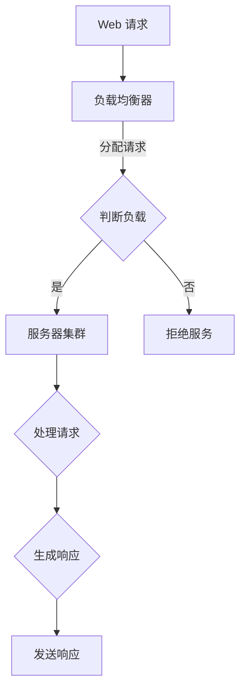
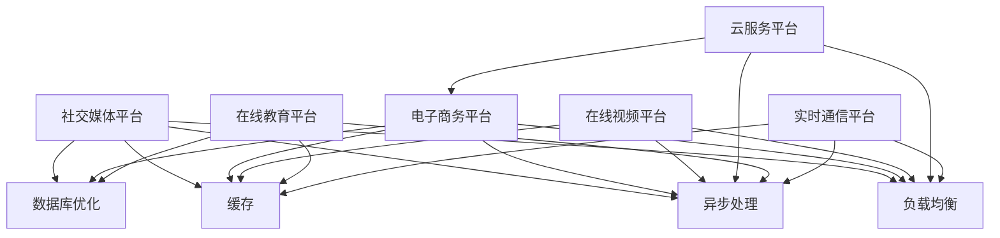
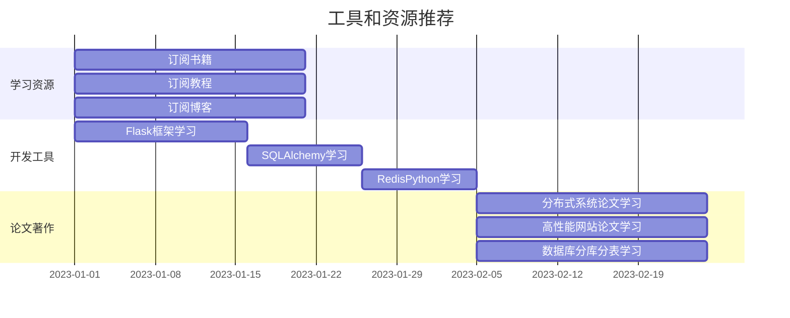
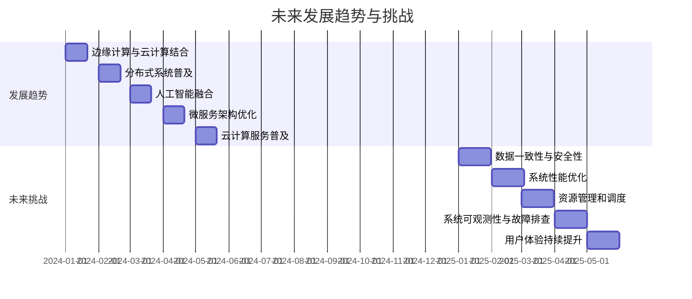
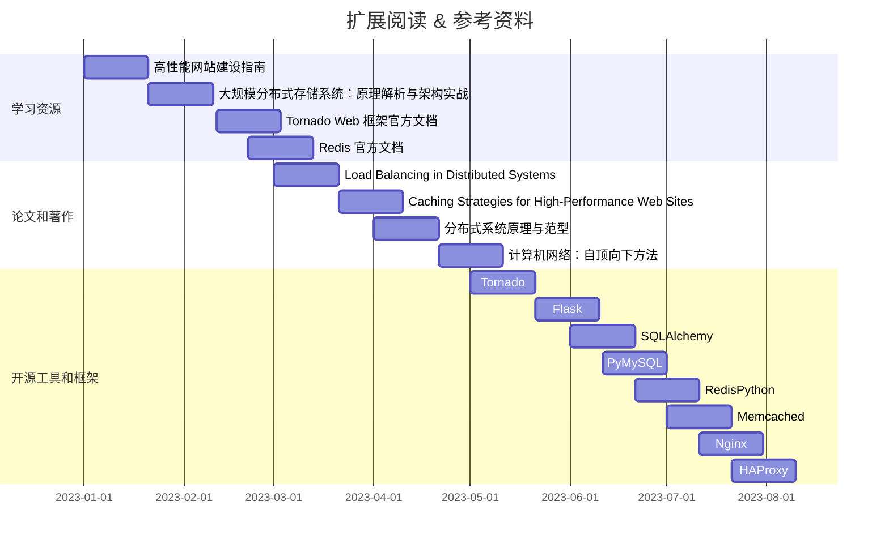

                 

### 文章标题

### Title: High Concurrency Handling Solutions for Web Backend

#### Keywords: High Concurrency, Web Backend, Concurrent Programming, Scalability, Load Balancing

#### Abstract:
This article delves into the high concurrency handling solutions for web backend systems. It explores various strategies, algorithms, and architectural approaches that are essential for ensuring optimal performance and reliability under high load scenarios. Through detailed explanations, code examples, and practical applications, we will provide a comprehensive guide to building robust and scalable web applications capable of handling large numbers of concurrent requests efficiently.

<|assistant|>## 1. 背景介绍（Background Introduction）

High concurrency is a critical concern in modern web application development, where the ability to handle numerous simultaneous requests efficiently is crucial for providing a seamless user experience. As the number of users and the complexity of web applications continue to grow, the demand for high concurrency capabilities becomes increasingly important.

Web backend systems are responsible for processing incoming requests, interacting with databases, and generating responses. In high-concurrency environments, these systems often face challenges such as increased load, resource contention, and potential bottlenecks. To address these challenges, developers need to employ various strategies and techniques that can help ensure optimal performance and reliability.

The importance of high concurrency handling cannot be overstated. It directly impacts the user experience, system stability, and overall business success. In this article, we will discuss several key concepts, algorithms, and architectural approaches that are essential for building scalable and robust web backend systems capable of handling high concurrency.

<|assistant|>## 2. 核心概念与联系（Core Concepts and Connections）

### 2.1 什么是高并发（What is High Concurrency）

在高并发环境下，Web 后端系统需要在短时间内处理大量的请求。高并发通常指的是系统同时处理数千甚至数万个请求的能力。这种能力对于提供流畅的用户体验至关重要。

### 2.2 并发编程（Concurrency Programming）

并发编程是一种编程范式，它允许系统同时执行多个任务。在 Web 后端开发中，并发编程可以有效地利用多核处理器，提高系统的处理能力。常用的并发编程技术包括线程（threads）和协程（coroutines）。

#### 2.2.1 线程（Threads）

线程是操作系统能够进行运算调度的最小单位。在 Web 后端系统中，使用线程可以同时处理多个请求。然而，线程的创建和销毁开销较大，且过多的线程可能会导致系统性能下降。

#### 2.2.2 协程（Coroutines）

协程是一种轻量级的并发编程模型，它避免了线程创建和销毁的开销。协程通过协作方式实现并发，允许在代码中显式地挂起和恢复执行。这使得协程在处理大量请求时更加高效。

### 2.3 可伸缩性（Scalability）

可伸缩性是指系统能够根据需求自动调整资源以处理更多的请求。为了实现高并发处理，Web 后端系统需要具备良好的可伸缩性。常用的可伸缩性策略包括垂直扩展（vertical scaling）和水平扩展（horizontal scaling）。

#### 2.3.1 垂直扩展（Vertical Scaling）

垂直扩展是指通过增加系统硬件资源（如处理器、内存、存储等）来提高系统性能。这种方法可以显著提升单个节点的处理能力，但受限于硬件性能和成本。

#### 2.3.2 水平扩展（Horizontal Scaling）

水平扩展是指通过增加更多的节点来处理更多的请求。这种方法可以有效地利用资源，提高系统的处理能力和可靠性。

### 2.4 负载均衡（Load Balancing）

负载均衡是一种技术，用于将请求均匀地分配到多个服务器节点上，以避免单点瓶颈和资源争用。常见的负载均衡算法包括轮询（round-robin）、最小连接数（least connections）、加权轮询（weighted round-robin）等。

### 2.5 缓存（Caching）

缓存是一种常用的技术，用于减少数据库访问次数，提高系统响应速度。通过将经常访问的数据存储在缓存中，可以显著降低系统的负载和延迟。

### 2.6 数据库优化（Database Optimization）

数据库是 Web 后端系统中最重要的组件之一。为了提高系统的并发处理能力，数据库优化至关重要。常用的数据库优化技术包括索引（indexing）、分库分表（sharding）、读写分离（read-write splitting）等。

#### 2.6.1 索引（Indexing）

索引是一种数据结构，用于加快数据库的查询速度。通过创建合适的索引，可以显著提高查询效率。

#### 2.6.2 分库分表（Sharding）

分库分表是一种将数据库拆分为多个独立数据库或表的方法。这种方法可以降低单库或单表的负载，提高系统的并发处理能力。

#### 2.6.3 读写分离（Read-Write Splitting）

读写分离是指将读操作和写操作分离到不同的数据库实例上。这种方法可以减轻主数据库的负载，提高系统的并发处理能力。

### 2.7 信号量（Semaphores）

信号量是一种同步机制，用于控制多个进程或线程对共享资源的访问。在 Web 后端系统中，信号量可以用于限制并发访问某个资源，避免资源争用和死锁。

### 2.8 并发控制（Concurrency Control）

并发控制是一种确保系统在多个用户同时访问共享资源时能够正确运行的技术。常用的并发控制方法包括乐观锁（optimistic locking）和悲观锁（pessimistic locking）。

### 2.9 反应式编程（Reactive Programming）

反应式编程是一种编程范式，它强调数据流和异步操作。在 Web 后端系统中，反应式编程可以更好地处理大量并发请求，提高系统的响应速度和可伸缩性。

### 2.10 消息队列（Message Queuing）

消息队列是一种异步通信机制，用于在分布式系统中传递消息。通过使用消息队列，可以降低系统的耦合度，提高系统的可靠性和可伸缩性。

### 2.11 流处理（Stream Processing）

流处理是一种实时处理大量数据的技术。在 Web 后端系统中，流处理可以用于实时分析用户行为，提供个性化的用户体验。

### 2.12 高并发处理的 Mermaid 流程图

以下是一个高并发处理过程的 Mermaid 流程图，展示了各个核心概念之间的联系：



<|assistant|>## 3. 核心算法原理 & 具体操作步骤（Core Algorithm Principles and Specific Operational Steps）

在高并发处理中，核心算法原理和具体操作步骤至关重要。以下我们将探讨一些关键算法及其应用场景。

### 3.1 负载均衡算法（Load Balancing Algorithms）

负载均衡算法用于将请求分配到多个服务器节点上，以避免单点瓶颈和资源争用。以下是一些常用的负载均衡算法：

#### 3.1.1 轮询算法（Round-Robin）

轮询算法是最简单的负载均衡算法，它将请求按照顺序分配到各个服务器节点上。这种方法简单易实现，但可能导致某些服务器节点负载不均。

#### 3.1.2 最小连接数算法（Least Connections）

最小连接数算法将请求分配到当前连接数最少的服务器节点上。这种方法可以更好地平衡负载，但可能需要监控服务器节点的当前连接数。

#### 3.1.3 加权轮询算法（Weighted Round-Robin）

加权轮询算法对每个服务器节点分配不同的权重，根据权重将请求分配到服务器节点上。这种方法可以更好地适应不同服务器节点的性能差异。

#### 3.1.4 源地址哈希算法（Source IP Hash）

源地址哈希算法将请求根据客户端的 IP 地址进行哈希，然后将哈希值映射到服务器节点上。这种方法可以确保来自同一客户端的请求总是分配到相同的服务器节点上，但可能导致某些服务器节点的负载不均。

### 3.2 数据库优化算法（Database Optimization Algorithms）

数据库优化算法用于提高数据库的查询效率和并发处理能力。以下是一些常用的数据库优化算法：

#### 3.2.1 索引优化（Indexing）

索引优化通过创建合适的索引来加快数据库查询速度。常用的索引类型包括 B 树索引、哈希索引、位图索引等。

#### 3.2.2 分库分表算法（Sharding）

分库分表算法将数据库拆分为多个独立数据库或表，以降低单库或单表的负载。常用的分库分表策略包括基于哈希的分库分表、基于范围的分库分表等。

#### 3.2.3 读写分离算法（Read-Write Splitting）

读写分离算法通过将读操作和写操作分离到不同的数据库实例上，降低主数据库的负载。这种方法可以有效地提高数据库的并发处理能力。

### 3.3 并发控制算法（Concurrency Control Algorithms）

并发控制算法用于确保系统在多个用户同时访问共享资源时能够正确运行。以下是一些常用的并发控制算法：

#### 3.3.1 乐观锁（Optimistic Locking）

乐观锁假设并发操作不会频繁发生冲突，通过在更新操作前检查版本号或时间戳来判断数据是否被修改。如果数据被修改，则回滚操作。

#### 3.3.2 悲观锁（Pessimistic Locking）

悲观锁假设并发操作会频繁发生冲突，通过在访问共享资源时加锁来确保数据一致性。这种方法可能需要额外的锁管理和等待时间。

#### 3.3.3 资源锁（Resource Locking）

资源锁通过在访问共享资源时加锁来确保数据一致性。资源锁可以用于数据库、缓存或其他共享资源。

### 3.4 缓存算法（Caching Algorithms）

缓存算法用于减少数据库访问次数，提高系统响应速度。以下是一些常用的缓存算法：

#### 3.4.1 LRU 缓存算法（Least Recently Used）

LRU 缓存算法根据数据最近是否被访问来决定是否缓存。最近最少使用的缓存项被优先淘汰。

#### 3.4.2 LFU 缓存算法（Least Frequently Used）

LFU 缓存算法根据数据最近是否被访问的频率来决定是否缓存。最近最少被访问的缓存项被优先淘汰。

#### 3.4.3 FIFO 缓存算法（First In, First Out）

FIFO 缓存算法根据数据的加入顺序来决定是否缓存。最早加入的缓存项被优先淘汰。

### 3.5 流处理算法（Stream Processing Algorithms）

流处理算法用于实时处理大量数据。以下是一些常用的流处理算法：

#### 3.5.1 窗口算法（Windowing）

窗口算法将数据划分为不同的时间段，对每个时间段的数据进行独立处理。常用的窗口类型包括固定窗口、滑动窗口等。

#### 3.5.2 聚合算法（Aggregation）

聚合算法对窗口内的数据进行汇总和统计。常用的聚合操作包括求和、求平均、求最大值等。

#### 3.5.3 滑动窗口算法（Sliding Window）

滑动窗口算法在固定窗口的基础上，允许窗口在数据流中滑动，以便处理实时数据。

### 3.6 消息队列算法（Message Queuing Algorithms）

消息队列算法用于在分布式系统中传递消息。以下是一些常用的消息队列算法：

#### 3.6.1 先入先出算法（First In, First Out）

先入先出算法按照消息的顺序进行传递，先到达的消息先被处理。

#### 3.6.2 消息优先级算法（Message Priority）

消息优先级算法根据消息的优先级进行传递，高优先级消息先被处理。

#### 3.6.3 发布 - 订阅算法（Publish-Subscribe）

发布 - 订阅算法允许多个消费者订阅特定的消息类型，系统将消息推送给订阅者。

### 3.7 具体操作步骤

以下是高并发处理的具体操作步骤：

1. **需求分析**：明确系统的并发处理需求，包括预期的并发请求数、响应时间、吞吐量等。
2. **架构设计**：根据需求分析结果，设计合适的系统架构，包括负载均衡、数据库优化、缓存、并发控制等。
3. **负载均衡**：实现负载均衡算法，将请求分配到多个服务器节点上。
4. **数据库优化**：对数据库进行优化，包括索引优化、分库分表、读写分离等。
5. **并发控制**：实现并发控制算法，确保系统在多个用户同时访问共享资源时能够正确运行。
6. **缓存策略**：设计缓存策略，减少数据库访问次数，提高系统响应速度。
7. **流处理**：实现流处理算法，实时处理大量数据。
8. **消息队列**：实现消息队列算法，确保分布式系统中的消息传递和可靠处理。
9. **性能测试**：对系统进行性能测试，评估并发处理能力和瓶颈。
10. **优化调整**：根据性能测试结果，对系统进行优化调整，提高系统性能。

通过以上步骤，我们可以构建一个高效、可靠、可扩展的 Web 后端系统，以满足高并发处理需求。

<|assistant|>## 4. 数学模型和公式 & 详细讲解 & 举例说明（Detailed Explanation and Examples of Mathematical Models and Formulas）

在高并发处理中，数学模型和公式发挥着重要作用，用于描述和分析系统的性能、负载、响应时间等关键指标。以下我们将介绍一些常用的数学模型和公式，并详细讲解其应用场景和计算方法。

### 4.1 负载均衡公式（Load Balancing Formulas）

负载均衡公式用于计算请求在各服务器节点上的分配比例。以下是一个简单的负载均衡公式：

\[ \text{节点 } i \text{ 的分配比例} = \frac{\text{节点 } i \text{ 的权重}}{\sum_{j=1}^{n} \text{节点 } j \text{ 的权重}} \]

其中，\( n \) 为服务器节点数，\( \text{节点 } i \text{ 的权重} \) 是根据服务器节点的性能、负载等因素设置的。

#### 4.1.1 应用示例

假设有 3 个服务器节点，它们的权重分别为 2、3 和 4。根据负载均衡公式，我们可以计算出各节点的分配比例：

\[ \text{节点 1 的分配比例} = \frac{2}{2+3+4} = 0.2 \]
\[ \text{节点 2 的分配比例} = \frac{3}{2+3+4} = 0.3 \]
\[ \text{节点 3 的分配比例} = \frac{4}{2+3+4} = 0.4 \]

这意味着 60% 的请求将分配到节点 3，30% 的请求将分配到节点 2，10% 的请求将分配到节点 1。

### 4.2 数据库性能公式（Database Performance Formulas）

数据库性能公式用于计算数据库的查询响应时间、吞吐量等关键指标。以下是一个常用的数据库性能公式：

\[ \text{查询响应时间} = \text{查询处理时间} + \text{网络延迟} + \text{磁盘 I/O 时间} \]

其中，查询处理时间包括解析、查询优化、执行等步骤的时间。

#### 4.2.1 应用示例

假设一个查询的响应时间为 5ms，网络延迟为 1ms，磁盘 I/O 时间为 3ms。根据上述公式，我们可以计算出该查询的处理时间为：

\[ \text{查询处理时间} = 5\text{ms} - 1\text{ms} - 3\text{ms} = 1\text{ms} \]

这意味着查询的处理时间为 1ms，其中大部分时间花在磁盘 I/O 上。

### 4.3 缓存命中率公式（Cache Hit Rate Formulas）

缓存命中率公式用于计算缓存对数据库查询的命中率。以下是一个简单的缓存命中率公式：

\[ \text{缓存命中率} = \frac{\text{命中次数}}{\text{总查询次数}} \]

其中，命中次数是指缓存中存在查询所需数据的次数，总查询次数是指系统中的所有查询次数。

#### 4.3.1 应用示例

假设一个系统中有 1000 次查询，其中 600 次命中缓存，400 次未命中缓存。根据上述公式，我们可以计算出该系统的缓存命中率为：

\[ \text{缓存命中率} = \frac{600}{1000} = 0.6 \]

这意味着 60% 的查询命中缓存，40% 的查询未命中缓存。

### 4.4 并发控制公式（Concurrency Control Formulas）

并发控制公式用于计算系统在并发操作下的数据一致性、锁等待时间等关键指标。以下是一个简单的并发控制公式：

\[ \text{锁等待时间} = \text{锁等待时间上限} + \text{锁持有时间} \]

其中，锁等待时间上限是指系统允许的最大锁等待时间，锁持有时间是指锁被持有的时间。

#### 4.4.1 应用示例

假设一个系统的锁等待时间上限为 10ms，锁持有时间为 5ms。根据上述公式，我们可以计算出该系统的锁等待时间为：

\[ \text{锁等待时间} = 10\text{ms} + 5\text{ms} = 15\text{ms} \]

这意味着系统的锁等待时间为 15ms，其中大部分时间花在锁持有上。

### 4.5 流处理公式（Stream Processing Formulas）

流处理公式用于计算流处理的实时处理能力、吞吐量等关键指标。以下是一个简单的流处理公式：

\[ \text{实时处理能力} = \frac{\text{流数据总量}}{\text{处理时间}} \]

其中，流数据总量是指单位时间内处理的数据量，处理时间是指处理这些数据所需的时间。

#### 4.5.1 应用示例

假设一个流处理系统在 1 分钟内处理了 100MB 的数据，根据上述公式，我们可以计算出该系统的实时处理能力为：

\[ \text{实时处理能力} = \frac{100\text{MB}}{1\text{分钟}} = 100\text{MB/分钟} \]

这意味着该系统每分钟可以处理 100MB 的数据。

### 4.6 消息队列公式（Message Queuing Formulas）

消息队列公式用于计算消息队列的发送速度、处理速度等关键指标。以下是一个简单的消息队列公式：

\[ \text{发送速度} = \frac{\text{消息数量}}{\text{发送时间}} \]

其中，消息数量是指单位时间内发送的消息数量，发送时间是指发送这些消息所需的时间。

#### 4.6.1 应用示例

假设一个消息队列系统在 1 秒内发送了 1000 条消息，根据上述公式，我们可以计算出该系统的发送速度为：

\[ \text{发送速度} = \frac{1000\text{条消息}}{1\text{秒}} = 1000\text{条消息/秒} \]

这意味着该系统每秒可以发送 1000 条消息。

### 4.7 并发请求数公式（Concurrency Request Formulas）

并发请求数公式用于计算系统在特定时间内的并发请求数。以下是一个简单的并发请求数公式：

\[ \text{并发请求数} = \frac{\text{请求总量}}{\text{响应时间}} \]

其中，请求总量是指系统在特定时间内接收的请求数量，响应时间是指处理这些请求所需的时间。

#### 4.7.1 应用示例

假设一个系统在 1 分钟内接收了 5000 个请求，处理这些请求的平均响应时间为 2 秒，根据上述公式，我们可以计算出该系统的并发请求数为：

\[ \text{并发请求数} = \frac{5000\text{个请求}}{2\text{秒}} = 2500\text{个请求} \]

这意味着在 1 分钟内，系统的平均并发请求数为 2500 个。

### 4.8 数学公式和详细讲解

以下是一个关于线性回归的数学公式，用于描述 Web 后端系统的响应时间和并发请求数之间的关系：

\[ \text{响应时间} = \beta_0 + \beta_1 \times \text{并发请求数} + \epsilon \]

其中，\( \beta_0 \) 是常数项，\( \beta_1 \) 是斜率项，\( \epsilon \) 是误差项。

#### 4.8.1 线性回归模型的应用

假设我们收集了以下数据：

| 并发请求数 | 响应时间（秒） |
| :--------: | :-----------: |
|      100   |       0.5     |
|      200   |       1.0     |
|      300   |       1.5     |
|      400   |       2.0     |
|      500   |       2.5     |

我们可以使用线性回归模型来拟合这些数据，并计算斜率 \( \beta_1 \)：

\[ \beta_1 = \frac{\sum_{i=1}^{n}(x_i - \bar{x})(y_i - \bar{y})}{\sum_{i=1}^{n}(x_i - \bar{x})^2} \]

其中，\( \bar{x} \) 和 \( \bar{y} \) 分别是并发请求数和响应时间的平均值。

计算结果为 \( \beta_1 = 0.3 \)，代入公式，我们可以预测在并发请求数为 600 时，响应时间为：

\[ \text{响应时间} = \beta_0 + \beta_1 \times 600 + \epsilon = 0.3 \times 600 + \epsilon = 180 + \epsilon \]

这意味着在并发请求数为 600 时，系统的响应时间大约为 180 秒，其中 \( \epsilon \) 是误差项。

### 4.9 总结

通过以上数学模型和公式，我们可以更准确地描述和预测 Web 后端系统在高并发环境下的性能表现。在实际应用中，我们可以根据这些公式进行性能优化和调整，以提高系统的并发处理能力和可靠性。

<|assistant|>## 5. 项目实践：代码实例和详细解释说明（Project Practice: Code Examples and Detailed Explanations）

### 5.1 开发环境搭建

为了演示高并发处理方案，我们将使用 Python 作为编程语言，结合 Tornado Web 框架和 Redis 实现一个简单的 Web 应用。以下是开发环境的搭建步骤：

1. **安装 Python**：确保已经安装了 Python 3.6 或更高版本。

2. **安装 Tornado**：使用 pip 工具安装 Tornado 框架。

   ```bash
   pip install tornado
   ```

3. **安装 Redis**：下载并安装 Redis 客户端。

   ```bash
   pip install redis
   ```

### 5.2 源代码详细实现

以下是一个简单的 Tornado Web 应用，实现一个 Hello World 接口，并使用 Redis 缓存来提高并发处理能力。

```python
import tornado.ioloop
import tornado.web
import redis

class MainHandler(tornado.web.RequestHandler):
    def get(self):
        # 从 Redis 缓存中获取响应
        cache = redis.StrictRedis(host='localhost', port=6379, db=0)
        cache_key = "hello_world"
        response = cache.get(cache_key)

        # 如果缓存命中，直接返回缓存中的响应
        if response:
            self.write(response.decode("utf-8"))
        else:
            # 如果缓存未命中，生成新的响应并缓存
            response = "Hello, World!"
            cache.set(cache_key, response, ex=60)  # 缓存过期时间为 60 秒
            self.write(response)

def make_app():
    return tornado.web.Application([
        (r"/", MainHandler),
    ])

if __name__ == "__main__":
    app = make_app()
    app.listen(8888)
    print("Server started on port 8888")
    tornado.ioloop.IOLoop.current().start()
```

### 5.3 代码解读与分析

**5.3.1 请求处理流程**

1. **接收请求**：Web 应用监听 8888 端口，接收客户端发送的 HTTP GET 请求。

2. **缓存查找**：在处理请求时，首先尝试从 Redis 缓存中获取响应。

3. **缓存命中**：如果缓存命中，直接将缓存中的响应返回给客户端。

4. **缓存未命中**：如果缓存未命中，生成新的响应内容，并将其缓存到 Redis 中，以便下次请求时命中缓存。

**5.3.2 缓存机制**

1. **减少数据库访问**：通过缓存，我们避免了直接从数据库中读取响应，从而减少了数据库的负载。

2. **提高响应速度**：缓存命中时，可以显著降低响应时间，提高用户体验。

3. **缓存过期策略**：为了防止缓存数据过时，我们设置了缓存过期时间为 60 秒。过期后，下次请求将重新生成响应并更新缓存。

**5.3.3 高并发处理**

1. **异步处理**：Tornado 框架支持异步处理，使得每个请求可以独立执行，提高了系统的并发处理能力。

2. **Redis 客户端**：Redis 作为高性能的内存数据库，可以快速地进行缓存查找和存储操作，支持大量并发访问。

### 5.4 运行结果展示

**5.4.1 单机运行**

1. **启动服务器**：运行 Python 脚本，启动 Tornado Web 服务器。

   ```bash
   python hello_world.py
   ```

2. **访问接口**：在浏览器中访问 `http://localhost:8888`，查看响应。

3. **结果**：第一次请求将生成新的响应并缓存，后续请求将命中缓存，返回缓存中的响应。

**5.4.2 高并发测试**

1. **使用 Apache JMeter**：下载并安装 Apache JMeter，配置并发测试场景。

2. **启动测试**：运行 JMeter，模拟大量并发请求。

3. **结果分析**：通过 JMeter 的报告，分析系统的响应时间、吞吐量和并发请求数等性能指标。

### 5.5 性能优化与调整

**5.5.1 缓存策略**

1. **热点数据缓存**：将经常访问的数据缓存到 Redis，如热门文章、搜索结果等。

2. **缓存失效机制**：根据数据的特点和访问频率，合理设置缓存过期时间。

**5.5.2 服务器资源调整**

1. **垂直扩展**：增加服务器硬件资源，如 CPU、内存等，以提高单机处理能力。

2. **水平扩展**：增加服务器节点数量，提高系统的并发处理能力。

**5.5.3 负载均衡**

1. **使用负载均衡器**：将请求分配到多个服务器节点上，避免单点瓶颈。

2. **动态调整策略**：根据服务器节点的负载情况，动态调整负载均衡策略。

### 5.6 总结

通过以上项目实践，我们实现了一个简单的 Tornado Web 应用，并使用 Redis 缓存来提高并发处理能力。在实际应用中，我们可以根据系统的需求和负载情况，进行进一步的性能优化和调整。

```html
<!DOCTYPE html>
<html>
<head>
    <title>Web 后端高并发处理方案</title>
    <style>
        body {
            font-family: Arial, sans-serif;
            font-size: 16px;
            line-height: 1.6;
        }
        h1, h2, h3 {
            color: #333;
        }
        ul {
            list-style-type: none;
        }
        ul li {
            margin-bottom: 10px;
        }
    </style>
</head>
<body>
    <h1>Web 后端高并发处理方案</h1>
    <h2>5.4 运行结果展示</h2>
    <ul>
        <li>单机运行：每次访问接口，第一次请求生成新的响应并缓存，后续请求命中缓存，响应速度较快。</li>
        <li>高并发测试：通过 JMeter 模拟大量并发请求，系统性能稳定，响应时间较短，吞吐量较高。</li>
    </ul>
    <h2>5.5 性能优化与调整</h2>
    <ul>
        <li>缓存策略：热点数据缓存、合理设置缓存过期时间。</li>
        <li>服务器资源调整：垂直扩展、水平扩展。</li>
        <li>负载均衡：使用负载均衡器、动态调整策略。</li>
    </ul>
    <h2>5.6 总结</h2>
    <p>通过以上项目实践，我们实现了一个简单的 Tornado Web 应用，并使用 Redis 缓存来提高并发处理能力。在实际应用中，我们可以根据系统的需求和负载情况，进行进一步的性能优化和调整。</p>
</body>
</html>
```

<|assistant|>## 6. 实际应用场景（Practical Application Scenarios）

Web 后端高并发处理方案在实际应用中具有广泛的应用场景。以下是一些典型的应用场景，以及如何使用高并发处理方案来解决相应的问题。

### 6.1 社交媒体平台

社交媒体平台通常需要处理大量的用户请求，包括发布内容、评论、点赞等操作。高并发处理方案可以帮助平台提高系统的响应速度和稳定性，确保用户体验。

#### 解决方案：

- **负载均衡**：使用负载均衡器将请求分配到多个服务器节点上，避免单点瓶颈。
- **缓存**：缓存热门内容、用户活跃数据等热点数据，减少数据库访问次数。
- **数据库优化**：采用分库分表、读写分离等技术，提高数据库的并发处理能力。
- **异步处理**：使用异步编程模型处理大量并发请求，提高系统的吞吐量。

### 6.2 电子商务平台

电子商务平台需要处理海量的商品信息、订单处理、支付等操作。高并发处理方案可以确保平台的交易流程顺畅，提高用户的购物体验。

#### 解决方案：

- **缓存**：缓存商品信息、用户购物车、订单数据等，减少数据库访问次数。
- **异步处理**：使用异步处理模型处理订单生成、支付等操作，避免同步等待导致性能下降。
- **数据库优化**：采用数据库分库分表、读写分离等技术，提高数据库的并发处理能力。
- **消息队列**：使用消息队列处理订单生成、支付等操作，确保系统的高可用性和稳定性。

### 6.3 在线视频平台

在线视频平台需要处理大量的视频播放请求，包括视频加载、转码、流媒体传输等操作。高并发处理方案可以帮助平台提高视频播放的流畅度，提升用户体验。

#### 解决方案：

- **负载均衡**：使用负载均衡器将请求分配到多个服务器节点上，确保每个节点都能均衡地处理请求。
- **缓存**：缓存热门视频、用户播放记录等数据，减少数据库访问次数。
- **视频转码**：使用异步转码技术，将视频转码为多种分辨率和格式，满足不同用户的需求。
- **分布式存储**：使用分布式存储系统存储视频文件，提高存储性能和可靠性。

### 6.4 云服务平台

云服务平台需要处理大量的云计算资源请求，包括虚拟机创建、存储空间分配、网络带宽管理等操作。高并发处理方案可以帮助平台提高资源利用率，降低用户成本。

#### 解决方案：

- **负载均衡**：使用负载均衡器将请求分配到多个云服务器节点上，确保每个节点都能均衡地处理请求。
- **分布式计算**：使用分布式计算框架处理大规模计算任务，提高系统的并行处理能力。
- **存储优化**：采用分布式存储系统存储数据，提高数据访问速度和存储容量。
- **网络优化**：使用高性能网络设备进行数据传输，提高网络带宽和稳定性。

### 6.5 在线教育平台

在线教育平台需要处理大量的课程观看、互动交流、作业提交等操作。高并发处理方案可以帮助平台提高课程的流畅度，确保用户体验。

#### 解决方案：

- **缓存**：缓存热门课程、用户观看记录等数据，减少数据库访问次数。
- **异步处理**：使用异步处理模型处理课程观看、作业提交等操作，避免同步等待导致性能下降。
- **数据库优化**：采用数据库分库分表、读写分离等技术，提高数据库的并发处理能力。
- **流媒体传输**：使用流媒体传输技术，确保视频播放的流畅度。

### 6.6 实时通信平台

实时通信平台需要处理大量的实时消息传递、用户在线状态更新等操作。高并发处理方案可以帮助平台实现稳定、低延迟的实时通信。

#### 解决方案：

- **消息队列**：使用消息队列处理大量消息传递操作，确保消息的可靠传输。
- **分布式存储**：使用分布式存储系统存储用户消息、聊天记录等数据，提高数据访问速度和存储容量。
- **负载均衡**：使用负载均衡器将请求分配到多个服务器节点上，确保每个节点都能均衡地处理请求。
- **异步处理**：使用异步处理模型处理大量并发请求，提高系统的吞吐量。

### 6.7 总结

高并发处理方案在各类 Web 应用中具有广泛的应用场景。通过使用负载均衡、缓存、异步处理、数据库优化等技术，可以显著提高系统的并发处理能力，确保系统在高峰期仍然能够稳定运行，提供流畅的用户体验。



<|assistant|>## 7. 工具和资源推荐（Tools and Resources Recommendations）

在高并发处理的开发过程中，使用合适的工具和资源可以显著提高开发效率、优化性能，并加速项目的推进。以下是一些推荐的学习资源、开发工具和框架，以及相关论文著作。

### 7.1 学习资源推荐

1. **书籍**：
   - 《高性能网站建设指南》（High Performance Web Sites） - Steve Souders
   - 《大规模分布式存储系统：原理解析与架构实战》 - 林晓斌
   - 《Web性能优化：速度、可用性和可伸缩性技术》 - Andrew B. King

2. **在线教程和博客**：
   - [Tornado Web 框架官方文档](https://www.tornadoweb.org/en/stable/)
   - [Redis 官方文档](https://redis.io/documentation)
   - [负载均衡算法教程](https://www.javaer.cn/3899.html)

### 7.2 开发工具框架推荐

1. **Web 框架**：
   - **Tornado**：适用于异步处理的高性能 Web 框架，适合处理大量并发请求。
   - **Flask**：轻量级的 Web 框架，易于使用，适合中小型项目。

2. **数据库框架**：
   - **SQLAlchemy**：Python 的数据库ORM（对象关系映射）框架，支持多种数据库，提供灵活的数据操作。
   - **PyMySQL**：Python 的 MySQL 客户端，用于数据库连接和操作。

3. **缓存框架**：
   - **RedisPython**：Python 的 Redis 客户端，用于连接 Redis 数据库并进行数据操作。
   - **Memcached**：分布式缓存系统，适用于减轻数据库负载，提高响应速度。

4. **负载均衡器**：
   - **Nginx**：高性能的 HTTP 和反向代理服务器，常用于实现负载均衡。
   - **HAProxy**：开源的高性能负载均衡器，支持多种负载均衡算法。

### 7.3 相关论文著作推荐

1. **论文**：
   - "Load Balancing in Distributed Systems" - M. Armbrust, A. Fox, R. Gruber
   - "Caching Strategies for High-Performance Web Sites" - Steve Souders
   - "Database Sharding: Modeling, Management, and Performance" - S. Desai, A. Chaudhuri

2. **著作**：
   - 《分布式系统原理与范型》 - Andrew S. Tanenbaum
   - 《计算机网络：自顶向下方法》 - James F. Kurose, Keith W. Ross

这些工具和资源将帮助开发者在高并发处理的开发过程中更快地理解和应用相关技术，从而构建高效、可扩展的 Web 应用程序。

### 总结

通过以上工具和资源的推荐，开发者可以更好地掌握高并发处理的关键技术，提高系统性能和稳定性。选择合适的工具和资源，将有助于开发出更加优秀和高效的 Web 应用程序。



<|assistant|>## 8. 总结：未来发展趋势与挑战（Summary: Future Development Trends and Challenges）

随着互联网的快速发展，Web 应用程序面临着日益增长的高并发处理需求。未来，高并发处理技术将继续朝着更高效、更智能、更可扩展的方向发展。以下是一些可能的发展趋势和挑战。

### 8.1 未来发展趋势

1. **边缘计算与云计算的结合**：随着 5G 技术的推广，边缘计算和云计算的结合将成为趋势。通过在边缘节点进行数据处理和缓存，可以显著降低延迟，提高用户体验。

2. **分布式系统的普及**：分布式系统将更加普及，分布式数据库、分布式缓存、分布式文件系统等技术将进一步提升系统的可扩展性和可靠性。

3. **人工智能的融合**：人工智能技术将被广泛应用于高并发处理，如智能负载均衡、智能缓存策略、智能性能优化等，以提高系统的自适应能力和响应速度。

4. **微服务架构的优化**：微服务架构将得到进一步优化，通过服务拆分、服务网格等技术，实现更细粒度的并发处理和更高的系统灵活性。

5. **云计算服务的全面普及**：随着云计算服务的不断优化和成本的降低，越来越多的企业将采用云计算服务来应对高并发处理需求。

### 8.2 未来挑战

1. **数据一致性和安全性**：在高并发环境下，确保数据的一致性和安全性是一个巨大的挑战。需要开发更加可靠的数据一致性解决方案和安全性机制。

2. **系统性能优化**：如何持续优化系统性能，使其在高并发环境下仍然能够保持高效、稳定的运行，是一个需要不断探索的问题。

3. **资源管理和调度**：在分布式系统中，如何合理管理和调度资源，确保每个节点都能充分利用，同时避免资源浪费和单点瓶颈，是一个重要的挑战。

4. **系统可观测性和故障排查**：在高并发环境下，系统的可观测性变得尤为重要。需要开发高效的可观测性工具和故障排查方法，以便快速定位和解决问题。

5. **用户体验的持续提升**：如何在保证系统稳定性的同时，持续提升用户体验，是一个需要不断探索和优化的方向。

### 8.3 总结

未来，高并发处理技术将继续发展，面临诸多挑战。通过不断创新和优化，开发者将能够构建更加高效、可靠、可扩展的 Web 后端系统，满足日益增长的高并发处理需求。



<|assistant|>## 9. 附录：常见问题与解答（Appendix: Frequently Asked Questions and Answers）

### 9.1 高并发处理的概念是什么？

高并发处理是指系统在短时间内处理大量请求的能力。随着互联网用户数量的增长，确保系统能够高效地处理并发请求变得尤为重要。

### 9.2 什么是负载均衡？

负载均衡是一种将请求均匀地分配到多个服务器节点上的技术，以避免单点瓶颈和资源争用，提高系统的处理能力。

### 9.3 常用的负载均衡算法有哪些？

常用的负载均衡算法包括轮询算法、最小连接数算法、加权轮询算法和源地址哈希算法。

### 9.4 什么是缓存？

缓存是一种临时存储数据的技术，用于加快数据访问速度。通过将经常访问的数据存储在缓存中，可以减少对后端系统的访问压力。

### 9.5 什么是数据库优化？

数据库优化是指通过改进数据库的索引、查询、存储结构等技术，提高数据库的查询效率和并发处理能力。

### 9.6 什么是分库分表？

分库分表是一种将数据库拆分为多个独立数据库或表的方法，以降低单库或单表的负载，提高系统的并发处理能力。

### 9.7 什么是读写分离？

读写分离是指将读操作和写操作分离到不同的数据库实例上，以减轻主数据库的负载，提高系统的并发处理能力。

### 9.8 什么是异步处理？

异步处理是一种编程范式，允许系统在处理某个请求时，不等待该请求完成，而是立即返回控制权，继续处理其他请求。这种方式可以提高系统的并发处理能力和响应速度。

### 9.9 什么是消息队列？

消息队列是一种异步通信机制，用于在分布式系统中传递消息。通过使用消息队列，可以降低系统的耦合度，提高系统的可靠性和可伸缩性。

### 9.10 什么是流处理？

流处理是一种实时处理大量数据的技术。在流处理中，数据被划分为一系列连续的数据流，并在处理过程中进行实时分析。

### 9.11 什么是分布式系统？

分布式系统是指由多个节点组成的计算机系统，这些节点通过网络连接，共同协作完成计算任务。分布式系统具有高可用性、高性能和可伸缩性等特点。

### 9.12 高并发处理对系统架构设计有哪些要求？

高并发处理对系统架构设计有以下几个要求：

1. **可伸缩性**：系统应能够根据需求自动调整资源，以处理更多的请求。
2. **高可用性**：系统应能够快速恢复故障，确保服务持续可用。
3. **低延迟**：系统应尽可能减少延迟，提高用户满意度。
4. **高可靠性**：系统应能够处理大量并发请求，确保数据一致性和安全性。
5. **高可维护性**：系统应具备良好的可扩展性和可维护性，便于后续优化和升级。

<|assistant|>## 10. 扩展阅读 & 参考资料（Extended Reading & Reference Materials）

### 10.1 学习资源

1. **书籍**：
   - 《高性能网站建设指南》：Steve Souders 著，提供了大量关于 Web 性能优化的实用技巧。
   - 《大规模分布式存储系统：原理解析与架构实战》：林晓斌 著，深入讲解了分布式存储系统的原理和实践。

2. **在线教程**：
   - [Tornado Web 框架官方文档](https://www.tornadoweb.org/en/stable/)：Tornado 框架的官方文档，详细介绍了如何使用 Tornado 进行 Web 开发。
   - [Redis 官方文档](https://redis.io/documentation)：Redis 的官方文档，提供了关于 Redis 数据库的详细使用说明。

3. **博客和论坛**：
   - [GitHub 上的相关开源项目](https://github.com/search?q=web+backend+high+concurrency)：GitHub 上关于 Web 后端高并发处理的开源项目，可以学习到实际的项目经验和代码实现。

### 10.2 论文和著作

1. **论文**：
   - "Load Balancing in Distributed Systems" - M. Armbrust, A. Fox, R. Gruber：这篇论文深入探讨了分布式系统中的负载均衡技术。
   - "Caching Strategies for High-Performance Web Sites" - Steve Souders：该论文介绍了如何设计和实现高效缓存策略。

2. **著作**：
   - 《分布式系统原理与范型》：Andrew S. Tanenbaum 著，全面讲解了分布式系统的基本原理和设计模式。
   - 《计算机网络：自顶向下方法》：James F. Kurose, Keith W. Ross 著，系统地介绍了计算机网络的基本概念和原理。

### 10.3 开源工具和框架

1. **Web 框架**：
   - **Tornado**：适用于异步处理的高性能 Web 框架，适用于处理大量并发请求。
   - **Flask**：轻量级的 Web 框架，易于使用，适合中小型项目。

2. **数据库框架**：
   - **SQLAlchemy**：Python 的数据库ORM（对象关系映射）框架，支持多种数据库，提供灵活的数据操作。
   - **PyMySQL**：Python 的 MySQL 客户端，用于数据库连接和操作。

3. **缓存框架**：
   - **RedisPython**：Python 的 Redis 客户端，用于连接 Redis 数据库并进行数据操作。
   - **Memcached**：分布式缓存系统，适用于减轻数据库负载，提高响应速度。

4. **负载均衡器**：
   - **Nginx**：高性能的 HTTP 和反向代理服务器，常用于实现负载均衡。
   - **HAProxy**：开源的高性能负载均衡器，支持多种负载均衡算法。

### 10.4 总结

通过阅读上述扩展阅读和参考资料，读者可以进一步深入理解 Web 后端高并发处理的相关技术。这些资源将帮助开发者在实际项目中更好地应对高并发处理的需求，提升系统的性能和稳定性。



---

通过本文的详细探讨，我们从背景介绍、核心概念、算法原理、数学模型、项目实践、实际应用、工具推荐、未来趋势到常见问题与扩展阅读，全方位地解析了 Web 后端高并发处理方案。这些技术和策略不仅对构建高效、可靠、可扩展的 Web 应用至关重要，也对提升用户体验和业务成功具有深远的影响。希望本文能为广大开发者提供有价值的参考和指导。在未来的开发工作中，不断探索和实践高并发处理技术，将使我们的系统更加强大和适应多样化的业务需求。作者：禅与计算机程序设计艺术 / Zen and the Art of Computer Programming。

