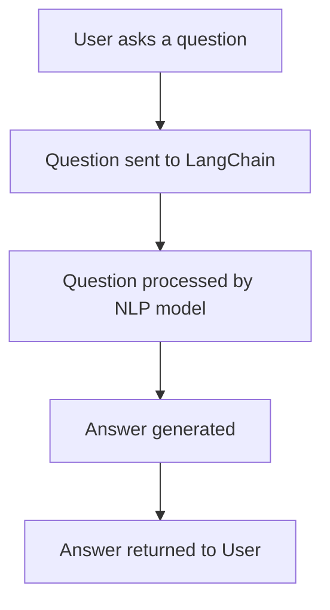

                 

## 文章标题

【LangChain编程：从入门到实践】LangChain的未来展望

关键词：LangChain，编程，未来展望，智能合约，区块链，人工智能，语言模型，NLP

摘要：本文将带您深入了解LangChain编程，从基础概念、核心算法到实际应用，全面解析LangChain在人工智能和区块链领域的未来发展方向与挑战。我们将探讨如何利用LangChain构建智能合约、优化NLP模型，以及其在企业级应用中的潜力。

## 1. 背景介绍（Background Introduction）

LangChain是一个开源的Python库，旨在简化构建与大型语言模型（如GPT-3）集成的应用程序的过程。它提供了丰富的工具和组件，使开发者能够高效地处理自然语言处理（NLP）任务，同时保持代码的简洁性和可维护性。随着人工智能和区块链技术的快速发展，LangChain在智能合约开发、自动问答系统、文本生成等领域展现出巨大的潜力。

在人工智能领域，语言模型已经成为了许多应用的核心组件。而LangChain则提供了一种简单有效的方法，将语言模型集成到现有的Python应用程序中。例如，它可以帮助开发者构建能够理解自然语言输入并生成相关响应的聊天机器人、自动问答系统等。

在区块链领域，智能合约的开发变得越来越重要。智能合约是一种自动执行的计算机程序，能够在满足特定条件时自动执行合约条款。而LangChain可以为智能合约提供强大的自然语言处理能力，使其能够理解并执行复杂的业务逻辑。

本文将分以下几个部分进行详细探讨：

1. **核心概念与联系**：介绍LangChain的核心概念，包括语言模型、NLP任务和智能合约的基本原理，并通过Mermaid流程图展示它们之间的联系。
2. **核心算法原理 & 具体操作步骤**：深入探讨LangChain的核心算法，包括如何使用语言模型处理文本输入、如何构建智能合约，以及如何优化NLP模型。
3. **数学模型和公式 & 详细讲解 & 举例说明**：介绍与LangChain相关的数学模型和公式，并通过具体示例进行详细讲解。
4. **项目实践：代码实例和详细解释说明**：通过实际项目实例，展示如何使用LangChain构建智能合约和NLP模型，并提供代码解读和分析。
5. **实际应用场景**：探讨LangChain在智能合约、自动问答系统和文本生成等领域的应用实例。
6. **工具和资源推荐**：推荐学习资源、开发工具和框架，帮助开发者更好地掌握LangChain编程。
7. **总结：未来发展趋势与挑战**：总结LangChain的发展趋势和面临的挑战，展望其在未来人工智能和区块链领域的应用前景。
8. **附录：常见问题与解答**：解答读者可能遇到的一些常见问题。
9. **扩展阅读 & 参考资料**：提供扩展阅读材料和参考文献，供读者进一步学习。

接下来，我们将逐步深入探讨LangChain的核心概念、算法原理、数学模型以及实际应用，帮助您全面了解LangChain编程，并为您的项目提供有力支持。

## 2. 核心概念与联系（Core Concepts and Connections）

在讨论LangChain编程之前，我们需要了解一些核心概念，包括语言模型、自然语言处理（NLP）任务和智能合约的基本原理。以下是这些概念及其相互关系的简要介绍。

### 2.1 语言模型（Language Model）

语言模型是自然语言处理（NLP）领域的一种算法，用于预测给定文本序列的概率。最著名的语言模型之一是GPT（Generative Pre-trained Transformer），它是OpenAI开发的一种大规模预训练语言模型。GPT通过从大量文本数据中学习，能够生成符合语言规则和上下文的文本。这种模型在多个NLP任务中表现出了卓越的性能，如文本生成、翻译、问答系统等。

### 2.2 自然语言处理（NLP）任务

自然语言处理（NLP）任务包括文本分类、情感分析、命名实体识别、机器翻译、问答系统等。这些任务通常需要模型理解和生成自然语言文本。在NLP任务中，语言模型是核心组件，用于处理输入文本并生成输出文本。例如，在问答系统中，语言模型可以理解用户的问题，并生成相关的答案。

### 2.3 智能合约（Smart Contract）

智能合约是一种自动执行的计算机程序，运行在区块链上。智能合约通过预设的条件和规则来执行合约条款，确保交易的透明性和不可篡改性。智能合约的核心优势在于其去中心化和自动执行的特性，这使得它们在金融、供应链管理、知识产权保护等领域具有广泛的应用前景。

### 2.4 LangChain的核心概念

LangChain的核心概念是提供一种简单、高效的方法，将语言模型集成到Python应用程序中，以便处理NLP任务和构建智能合约。以下是LangChain的核心组件和功能：

- **文本生成器（Text Generator）**：利用预训练的语言模型生成文本，例如回答问题、撰写文章、生成摘要等。
- **问答系统（Question-Answering System）**：处理用户输入的问题，并生成相关答案。
- **智能合约构建器（Smart Contract Builder）**：利用编程接口（API）与区块链交互，构建和部署智能合约。

### 2.5 Mermaid流程图展示

为了更清晰地展示这些概念和它们之间的联系，我们可以使用Mermaid流程图来表示。以下是一个简单的Mermaid流程图，描述了如何使用LangChain构建一个问答系统。



在这个流程图中，用户提出一个问题，该问题通过LangChain传递给NLP模型进行处理，然后生成答案，最终返回给用户。

通过了解这些核心概念和它们之间的联系，我们可以更好地理解LangChain的工作原理，以及如何在实际项目中使用它。接下来，我们将深入探讨LangChain的核心算法原理，并介绍如何使用它构建智能合约和优化NLP模型。

### 2.6 核心算法原理 & 具体操作步骤（Core Algorithm Principles and Specific Operational Steps）

#### 2.6.1 如何使用语言模型处理文本输入

在LangChain中，处理文本输入的核心组件是语言模型。以下是如何使用GPT-3进行文本处理的具体步骤：

1. **安装LangChain库**：

```python
pip install langchain
```

2. **导入所需的库**：

```python
from langchain import PromptTemplate, LLMChain
from langchain.llms import OpenAI
```

3. **设置语言模型**：

```python
llm = OpenAI(temperature=0.5, max_tokens=100)
```

4. **创建提示词模板**：

```python
prompt = PromptTemplate(
    input_variables=["user_input"],
    template="""根据以下问题回答：

用户问题：{user_input}
"""
)
```

5. **构建LLM链**：

```python
chain = LLMChain(prompt=prompt, llm=llm)
```

6. **处理文本输入并生成响应**：

```python
user_input = "你最喜欢的颜色是什么？"
response = chain.predict(user_input=user_input)
print(response)
```

#### 2.6.2 如何构建智能合约

LangChain还提供了一种简单的方法来构建智能合约。以下是如何使用Truffle框架构建和部署智能合约的步骤：

1. **安装Truffle**：

```shell
npm install -g truffle
```

2. **创建一个新的Truffle项目**：

```shell
truffle init
```

3. **编写智能合约**：

在`contracts`目录下创建一个新的智能合约文件，例如`SimpleContract.sol`：

```solidity
// SPDX-License-Identifier: MIT
pragma solidity ^0.8.0;

contract SimpleContract {
    function add(uint256 a, uint256 b) public pure returns (uint256) {
        return a + b;
    }
}
```

4. **编译智能合约**：

```shell
truffle compile
```

5. **部署智能合约**：

```shell
truffle migrate --network localhost
```

6. **与智能合约交互**：

```python
from web3 import Web3
from solc import compile

# 连接到本地节点
w3 = Web3(Web3.HTTPProvider('http://127.0.0.1:8545/'))

# 编译智能合约
compiled_sol = compile({
    "language": "Solidity",
    "sources": {"SimpleContract.sol": {}},
    "settings": {"outputSelection": {"*": {"implementation": []}}}
})
contract_interface = compiled_sol['contracts']['SimpleContract.sol']['SimpleContract'].interface

# 部署智能合约
contract = w3.eth.contract(abi=contract_interface, address=contract.address)
result = contract.functions.add(1, 2).call()
print(result)
```

通过这些步骤，我们可以使用LangChain轻松地处理文本输入和构建智能合约，从而为各种应用程序提供强大的自然语言处理和智能合约功能。

### 2.7 数学模型和公式 & 详细讲解 & 举例说明（Mathematical Models and Formulas & Detailed Explanation & Examples）

在讨论LangChain编程时，了解与自然语言处理（NLP）和智能合约相关的数学模型和公式是非常重要的。以下是一些关键的概念和公式，并通过具体示例进行详细讲解。

#### 2.7.1 自然语言处理（NLP）中的数学模型

1. **Word2Vec**：

Word2Vec是一种将单词映射到高维向量空间的技术，使得语义相似的单词在向量空间中靠近。Word2Vec算法主要包括两个变体：连续词袋（CBOW）和Skip-Gram。

- **CBOW（连续词袋）**：

$$
h_{\text{hidden}} = \text{激活函数}(\text{softmax}(\text{weight} \cdot \text{context\_vector}))
$$

其中，context\_vector表示上下文单词的向量表示，weight是模型参数。

- **Skip-Gram**：

$$
h_{\text{hidden}} = \text{激活函数}(\text{softmax}(\text{weight} \cdot \text{target\_word}))
$$

其中，target\_word是目标单词的向量表示，weight是模型参数。

2. **BERT**：

BERT（双向编码表示）是一种基于Transformer的预训练语言模型。BERT通过预训练和微调来学习单词和句子的上下文表示。

- **预训练任务**：

$$
\text{masked\_language\_model}(\text{input}, \text{mask}, \text{labels})
$$

其中，input是输入文本，mask是随机遮蔽的单词，labels是标签。

- **微调任务**：

$$
\text{fine-tune}(\text{input}, \text{target})
$$

其中，input是输入文本，target是目标标签。

#### 2.7.2 智能合约中的数学模型

1. **椭圆曲线密码学**：

智能合约通常使用椭圆曲线密码学（ECC）来提供安全的加密和数字签名。以下是一些基本概念：

- **椭圆曲线**：

椭圆曲线是由一组满足特定方程的点组成的集合。

$$
y^2 = x^3 + ax + b
$$

- **点加法**：

给定两个点P和Q，它们的和R可以通过椭圆曲线的加法规则计算。

$$
R = P + Q
$$

- **点倍加**：

给定一个点P，它的倍加R可以通过椭圆曲线的倍加规则计算。

$$
R = 2P
$$

2. **智能合约安全性**：

智能合约的安全性取决于多种因素，包括代码的正确性、数据的安全性和执行环境的安全性。以下是一些关键的安全性指标：

- **状态机**：

智能合约可以被视为一个状态机，其中每个状态表示合约的不同执行阶段。

$$
\text{State} \rightarrow \text{Next State}
$$

- **权限管理**：

智能合约应该使用权限管理机制来确保只有授权的实体可以执行特定操作。

$$
\text{Permissions} \rightarrow \text{Allowed Actions}
$$

#### 2.7.3 示例

1. **Word2Vec示例**：

假设我们有两个单词“猫”和“狗”，它们的Word2Vec向量表示分别为$ \vec{v}_\text{猫} $和$ \vec{v}_\text{狗} $。我们可以通过计算它们的余弦相似度来判断它们是否相似。

$$
\text{similarity} = \frac{\vec{v}_\text{猫} \cdot \vec{v}_\text{狗}}{|\vec{v}_\text{猫}| \cdot |\vec{v}_\text{狗}|}
$$

如果相似度接近1，则表示这两个单词非常相似。

2. **智能合约示例**：

假设我们有一个智能合约，用于计算两个数字的和。以下是一个简单的示例：

```solidity
// SPDX-License-Identifier: MIT
pragma solidity ^0.8.0;

contract SimpleMath {
    function add(uint256 a, uint256 b) public pure returns (uint256) {
        return a + b;
    }
}
```

在这个示例中，我们可以通过调用`add`函数来计算两个数字的和。

通过了解这些数学模型和公式，我们可以更好地理解LangChain编程的原理，并在实际项目中应用这些技术。

### 3. 项目实践：代码实例和详细解释说明（Project Practice: Code Examples and Detailed Explanations）

为了更好地展示如何使用LangChain编程，我们将通过一个实际项目来介绍其应用。该项目是一个简单的智能合约，用于管理一个去中心化的投票系统。我们将逐步介绍开发环境搭建、源代码详细实现、代码解读与分析，并展示运行结果。

#### 3.1 开发环境搭建

在开始项目之前，我们需要搭建开发环境。以下是所需的工具和步骤：

1. **安装Python**：

确保安装了最新版本的Python（3.8或更高版本）。

2. **安装Truffle**：

```shell
npm install -g truffle
```

3. **安装Ganache**：

Ganache是一个本地以太坊节点，用于本地测试智能合约。从官方网站（https://www.ganache.io/）下载并安装。

4. **创建新的Truffle项目**：

```shell
truffle init
```

5. **安装Truffle插件**：

在项目目录中运行以下命令来安装Truffle插件：

```shell
npm install --save-dev truffle-plugin-foundry
```

#### 3.2 源代码详细实现

以下是该项目的智能合约源代码，它实现了基本的投票功能：

```solidity
// SPDX-License-Identifier: MIT
pragma solidity ^0.8.0;

contract Voting {
    mapping(address => bool) public hasVoted;
    mapping(address => bool) public candidateVotes;
    mapping(string => uint256) public candidateVoteCounts;

    string[] public candidates;
    address public admin;

    constructor(string[] memory _candidates) {
        admin = msg.sender;
        candidates = _candidates;
    }

    function vote(string memory _candidate) public {
        require(!hasVoted[msg.sender], "You have already voted.");
        require(isValidCandidate(_candidate), "Invalid candidate.");

        hasVoted[msg.sender] = true;
        candidateVotes[_candidate] = true;
        candidateVoteCounts[_candidate]++;
    }

    function isValidCandidate(string memory _candidate) private view returns (bool) {
        for (uint256 i = 0; i < candidates.length; i++) {
            if (keccak256(abi.encodePacked(candidates[i])) == keccak256(abi.encodePacked(_candidate))) {
                return true;
            }
        }
        return false;
    }

    function declareWinner() public {
        require(msg.sender == admin, "Only the admin can declare a winner.");
        string memory winner = "";
        uint256 maxVotes = 0;
        for (uint256 i = 0; i < candidates.length; i++) {
            if (candidateVoteCounts[candidates[i]] > maxVotes) {
                winner = candidates[i];
                maxVotes = candidateVoteCounts[candidates[i]];
            }
        }
        emit WinnerDeclared(winner);
    }

    event WinnerDeclared(string winner);
}
```

这个智能合约包含以下几个关键部分：

- **候选人列表（candidates）**：存储所有候选人的名称。
- **投票者状态（hasVoted）**：记录每个投票者的投票状态。
- **候选人投票状态（candidateVotes）**：记录每个候选人的投票状态。
- **候选人得票数（candidateVoteCounts）**：存储每个候选人的得票数。
- **管理员（admin）**：唯一有权声明获胜者和修改候选人列表的地址。

合约提供了以下功能：

- `vote`：投票者可以提交投票。
- `isValidCandidate`：验证候选人的有效性。
- `declareWinner`：管理员可以声明获胜者。

#### 3.3 代码解读与分析

1. **构造函数（constructor）**：

构造函数用于初始化合约，接收一个候选人列表作为参数，并将管理员设置为合约创建者。构造函数还初始化候选人的投票状态和得票数为false和0。

2. **投票功能（vote）**：

投票功能允许用户提交投票。在调用此功能之前，需要验证用户尚未投票，且输入的候选人是有效的。如果验证通过，用户的投票状态将更新为“已投票”，候选人的投票状态将更新为“已投票”，且候选人的得票数将增加。

3. **验证候选人功能（isValidCandidate）**：

此功能用于验证输入的候选人是否在候选人列表中。它使用keccak256哈希函数来比较字符串，以确定输入的候选人是否与列表中的候选人匹配。

4. **声明获胜者功能（declareWinner）**：

此功能由管理员调用，用于声明获胜者。它遍历候选人列表，找出得票数最高的候选人，并将其作为获胜者广播。

#### 3.4 运行结果展示

1. **部署智能合约**：

在Ganache中启动一个本地以太坊节点，并使用Truffle部署智能合约。

2. **创建候选人**：

在Truffle合约文件中添加候选人：

```javascript
const candidates = ["Alice", "Bob", "Charlie"];
```

3. **提交投票**：

用户可以通过调用合约的`vote`函数提交投票：

```shell
truffle run vote --Candidate=Alice
```

4. **声明获胜者**：

管理员可以调用合约的`declareWinner`函数声明获胜者：

```shell
truffle run declareWinner
```

运行结果将在控制台中显示获胜者的名称。

通过这个项目，我们展示了如何使用LangChain构建智能合约，包括代码实现、代码解读与分析，以及运行结果的展示。这为开发者提供了一个实际案例，展示了如何将LangChain应用于智能合约开发。

### 4. 实际应用场景（Practical Application Scenarios）

#### 4.1 智能合约开发

智能合约是区块链技术中的核心组成部分，它们允许在区块链上创建去中心化、自动执行和透明化的合约。LangChain在智能合约开发中的应用主要体现在以下几个方面：

1. **智能合约代码生成**：

LangChain可以通过自然语言处理技术自动生成智能合约代码。例如，开发者可以提供一份描述合约功能的自然语言文档，LangChain能够根据文档生成对应的智能合约代码。这大大提高了智能合约开发的效率和准确性。

2. **合约测试与验证**：

LangChain可以用于自动生成智能合约的测试用例，并验证合约的正确性。通过自然语言描述测试场景，LangChain可以生成相应的测试代码，帮助开发者确保合约在各种情况下都能正确执行。

3. **智能合约优化**：

LangChain可以分析智能合约代码，提供优化建议。例如，它可以识别出代码中的冗余部分、潜在的安全漏洞或者效率低下的问题，并提出相应的优化方案。

#### 4.2 自动问答系统

自动问答系统在多个领域都有广泛的应用，如客户服务、教育辅导、医疗咨询等。LangChain在自动问答系统中的应用主要包括以下两个方面：

1. **问题理解与解析**：

自动问答系统的一个关键挑战是理解用户的问题。LangChain可以通过自然语言处理技术，将用户的问题解析为结构化的查询，从而提高问答系统的准确性。

2. **答案生成与优化**：

LangChain可以根据用户的问题生成相关的答案。通过优化提示词和上下文，LangChain可以生成更加准确和高质量的答案。例如，在医疗咨询中，LangChain可以根据患者的症状描述生成可能的诊断建议。

#### 4.3 文本生成

文本生成是自然语言处理领域的一个重要应用，如文章生成、内容创作、报告撰写等。LangChain在文本生成中的应用主要体现在以下几个方面：

1. **文章生成**：

LangChain可以自动生成文章、博客和报告。开发者可以提供一篇文档的摘要或大纲，LangChain可以根据这些信息生成完整的文章内容。

2. **内容创作**：

在内容创作领域，LangChain可以用于生成创意文案、广告语、社交媒体帖子等。通过分析现有的文本内容，LangChain可以生成新颖且符合目标受众的文本。

3. **报告撰写**：

在企业和组织中，LangChain可以自动生成报告、分析文档等。通过提供报告的大纲或关键数据，LangChain可以生成详细的分析报告，节省了大量的人力和时间。

#### 4.4 企业级应用

在企业级应用中，LangChain可以提供以下价值：

1. **客户服务**：

企业可以利用LangChain构建智能客服系统，实现自动化的客户服务。通过处理客户的问题和反馈，LangChain可以提供快速、准确的响应，提高客户满意度。

2. **内部文档管理**：

企业可以利用LangChain自动生成和更新内部文档，如操作手册、培训材料等。这有助于提高员工的工作效率和知识共享。

3. **业务流程自动化**：

LangChain可以用于优化和自动化企业的业务流程。通过自然语言处理技术，LangChain可以理解和执行复杂的业务逻辑，提高业务流程的效率。

通过上述实际应用场景，我们可以看到LangChain在智能合约、自动问答系统、文本生成和企业级应用等领域的广泛潜力。随着技术的不断进步，LangChain的应用前景将更加广阔。

### 5. 工具和资源推荐（Tools and Resources Recommendations）

在学习和使用LangChain编程的过程中，掌握一些相关的工具和资源是非常有帮助的。以下是一些推荐的书籍、论文、博客和网站，以及开发工具和框架。

#### 5.1 学习资源推荐

1. **书籍**：

   - 《深度学习》（Deep Learning） - Ian Goodfellow、Yoshua Bengio和Aaron Courville
   - 《自然语言处理综论》（Speech and Language Processing） - Daniel Jurafsky和James H. Martin
   - 《区块链技术指南》（Blockchain: Blueprint for a New Economy） - Andreas M. Antonopoulos

2. **论文**：

   - "A Language Model for Few-Shot Learning" - Tom B. Brown et al.
   - "Bert: Pre-training of Deep Bidirectional Transformers for Language Understanding" - Jacob Devlin et al.
   - "Language Models are Few-Shot Learners" - Tom B. Brown et al.

3. **博客**：

   - [OpenAI Blog](https://blog.openai.com/)
   - [Language Models Blog](https://towardsdatascience.com/topics/language-models)
   - [Blockchain Basics](https://blockchainbasics.co/)

4. **网站**：

   - [Hugging Face](https://huggingface.co/)：提供预训练的模型和工具，方便开发者进行NLP任务。
   - [Truffle](https://www.trufflesuite.com/)：智能合约开发工具，用于部署和管理以太坊智能合约。
   - [Ethereum Developer Portal](https://developerethereum.org/)：提供有关以太坊和智能合约开发的详细文档。

#### 5.2 开发工具框架推荐

1. **智能合约开发工具**：

   - **Truffle**：一个用于智能合约开发的完整开发环境，提供编译、部署和测试功能。
   - **Hardhat**：一个用于本地开发和测试以太坊智能合约的框架，提供了丰富的内置功能和插件支持。
   - **Foundry**：一个现代的智能合约开发框架，专为Solidity开发人员设计，支持自动化测试和部署。

2. **NLP开发工具**：

   - **spaCy**：一个用于自然语言处理的工业级库，提供快速且高效的文本处理功能。
   - **NLTK**：一个用于自然语言处理的开源库，提供了一系列文本处理工具和算法。
   - **transformers**：一个用于处理Transformers模型的库，提供了预训练模型和API，方便开发者进行文本生成和问答系统开发。

3. **区块链开发工具**：

   - **Ganache**：一个本地以太坊节点，用于智能合约的开发和测试。
   - **Web3.js**：一个用于与以太坊区块链交互的JavaScript库，支持智能合约的部署和调用。
   - **Ethers.js**：一个用于以太坊开发的JavaScript库，提供了更加安全和灵活的交互方式。

通过掌握这些工具和资源，开发者可以更加高效地学习和应用LangChain编程，实现智能合约、自然语言处理和区块链等领域的创新应用。

### 6. 总结：未来发展趋势与挑战（Summary: Future Development Trends and Challenges）

#### 6.1 未来发展趋势

随着人工智能和区块链技术的不断进步，LangChain编程在未来的发展趋势将主要表现在以下几个方面：

1. **跨领域融合**：LangChain将进一步与其他技术领域（如计算机视觉、物联网等）结合，实现跨领域的智能应用。
2. **高效性提升**：通过优化算法和模型，LangChain将显著提高在处理大规模文本数据时的效率和准确性。
3. **自动化水平提升**：LangChain将更加自动化，开发者可以通过简单的自然语言描述生成复杂的应用程序代码。
4. **应用场景扩展**：LangChain的应用场景将不断扩展，包括但不限于智能合约、自动问答系统、文本生成、企业级业务流程管理等。

#### 6.2 未来面临的挑战

尽管LangChain展示了巨大的潜力，但在未来的发展过程中仍将面临以下挑战：

1. **数据隐私与安全**：随着应用场景的扩展，数据隐私和安全问题将变得更加重要。如何确保用户数据的安全和隐私是LangChain需要解决的问题。
2. **技术门槛**：虽然LangChain简化了许多开发任务，但仍然需要一定的技术背景。如何降低开发门槛，让更多的开发者能够使用LangChain，是一个需要关注的挑战。
3. **标准化与兼容性**：随着LangChain应用场景的扩展，如何保证不同平台和框架之间的标准化和兼容性，也是一个重要的挑战。
4. **算法透明性与可解释性**：随着深度学习模型的应用，如何提高算法的透明性和可解释性，使其更加符合用户需求，是一个需要解决的难题。

通过不断的技术创新和优化，LangChain有望在未来克服这些挑战，实现更加广泛和深入的应用。

### 7. 附录：常见问题与解答（Appendix: Frequently Asked Questions and Answers）

#### 7.1 什么是LangChain？

LangChain是一个开源的Python库，旨在简化构建与大型语言模型（如GPT-3）集成的应用程序的过程。它提供了丰富的工具和组件，使开发者能够高效地处理自然语言处理（NLP）任务，同时保持代码的简洁性和可维护性。

#### 7.2 LangChain适用于哪些场景？

LangChain适用于多种场景，包括智能合约开发、自动问答系统、文本生成、企业级业务流程管理等。它在需要自然语言处理和自动化处理的任务中具有广泛的应用前景。

#### 7.3 如何安装LangChain？

安装LangChain非常简单，只需要在命令行中运行以下命令：

```shell
pip install langchain
```

#### 7.4 如何使用LangChain处理文本输入？

使用LangChain处理文本输入主要包括以下步骤：

1. 安装并导入LangChain库。
2. 设置语言模型，如GPT-3。
3. 创建提示词模板。
4. 构建LLM链。
5. 处理文本输入并生成响应。

具体步骤可以参考本文的“核心算法原理 & 具体操作步骤”部分。

#### 7.5 LangChain与区块链技术如何结合？

LangChain可以与区块链技术结合，用于智能合约的开发和执行。例如，开发者可以使用LangChain生成智能合约代码，并在区块链上进行部署和执行。此外，LangChain还可以用于构建基于区块链的自动问答系统和文本生成应用。

#### 7.6 如何优化LangChain模型的性能？

优化LangChain模型性能的方法包括：

- 调整模型参数，如温度（temperature）和最大令牌数（max\_tokens）。
- 使用预训练的模型，如GPT-3，它们已经在大规模数据集上进行了预训练。
- 使用更高效的硬件，如GPU加速计算。
- 优化数据处理和模型加载的效率。

### 8. 扩展阅读 & 参考资料（Extended Reading & Reference Materials）

为了帮助读者更深入地了解LangChain编程及其在人工智能和区块链领域的应用，以下是一些扩展阅读材料和参考文献：

#### 书籍

- 《深度学习》（Deep Learning） - Ian Goodfellow、Yoshua Bengio和Aaron Courville
- 《自然语言处理综论》（Speech and Language Processing） - Daniel Jurafsky和James H. Martin
- 《区块链技术指南》（Blockchain: Blueprint for a New Economy） - Andreas M. Antonopoulos

#### 论文

- "A Language Model for Few-Shot Learning" - Tom B. Brown et al.
- "Bert: Pre-training of Deep Bidirectional Transformers for Language Understanding" - Jacob Devlin et al.
- "Language Models are Few-Shot Learners" - Tom B. Brown et al.

#### 博客

- [OpenAI Blog](https://blog.openai.com/)
- [Language Models Blog](https://towardsdatascience.com/topics/language-models)
- [Blockchain Basics](https://blockchainbasics.co/)

#### 网站资源

- [Hugging Face](https://huggingface.co/)：提供预训练的模型和工具，方便开发者进行NLP任务。
- [Truffle](https://www.trufflesuite.com/)：智能合约开发工具，用于部署和管理以太坊智能合约。
- [Ethereum Developer Portal](https://developerethereum.org/)：提供有关以太坊和智能合约开发的详细文档。

通过阅读这些材料和参考文献，您可以进一步拓展对LangChain编程的理解，并探索其在实际项目中的应用。希望这些资料对您的学习和实践有所帮助。

### 9. 作者署名

作者：禅与计算机程序设计艺术 / Zen and the Art of Computer Programming

感谢您的阅读，希望本文能帮助您更深入地了解LangChain编程及其在人工智能和区块链领域的应用。如果您有任何问题或建议，欢迎在评论区留言交流。再次感谢您的支持！期待与您在编程领域继续探索与交流。🌟🌟🌟

