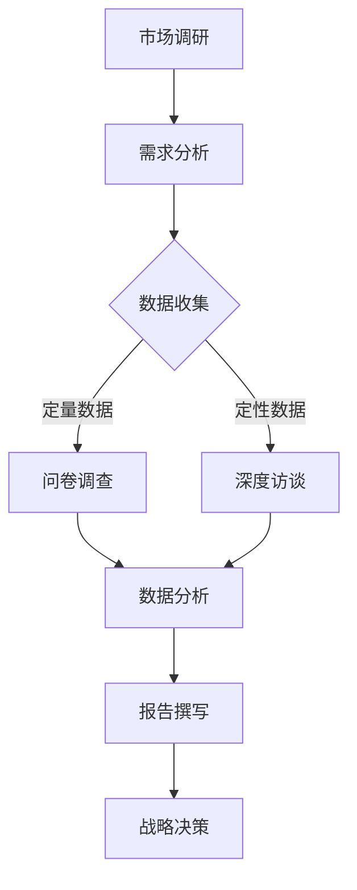

                 

# 一人公司如何进行有效的市场调研

> 关键词：一人公司、市场调研、有效策略、市场分析、竞争分析、数据收集、洞察力、资源优化

> 摘要：本文将探讨如何在一人公司的框架下，通过系统化的市场调研方法，有效地了解市场动态、分析竞争对手，并制定相应的战略决策。文章将提供实用的步骤和工具，帮助读者在资源有限的情况下，依然能够做出高质量的市场调研。

## 1. 背景介绍（Background Introduction）

### 1.1 一人公司的定义和优势

一人公司，顾名思义，是指公司由单一所有者或个人运营的企业形式。这种企业结构具有以下几个显著优势：

- **灵活性和决策效率**：作为唯一的决策者，一人公司能够迅速做出决策，减少繁琐的决策流程。
- **责任明确**：所有风险和回报由单一所有者承担，责任清晰，有利于风险管理。
- **成本控制**：相对于大型公司，一人公司的运营成本较低，尤其是在初始阶段。

然而，一人公司也面临一些挑战，如资金筹集、资源分配和市场竞争等。在这些挑战中，有效的市场调研显得尤为重要。

### 1.2 市场调研的重要性

市场调研是企业了解市场动态、分析竞争对手、制定战略决策的重要工具。对于一人公司来说，市场调研具有以下关键作用：

- **市场洞察**：通过市场调研，一人公司可以深入了解市场需求、消费者行为和行业趋势，为产品和服务定位提供依据。
- **竞争分析**：市场调研可以帮助一人公司识别竞争对手的弱点和优势，制定有针对性的竞争策略。
- **风险控制**：通过全面的市场调研，一人公司可以评估市场机会和潜在风险，减少经营失误。

## 2. 核心概念与联系（Core Concepts and Connections）

### 2.1 市场调研的基本概念

市场调研涉及一系列的研究活动，旨在收集、分析和解释与市场相关的数据。以下是市场调研中几个核心概念：

- **市场需求**：指消费者愿意购买的产品或服务的总量。
- **市场容量**：指在一定时间和区域内，市场能够承受的最大需求量。
- **竞争对手分析**：通过对竞争对手的产品、定价、市场策略等进行分析，识别竞争优势和不足。
- **市场趋势**：指市场发展的方向和速度，包括技术进步、消费者偏好变化等。

### 2.2 市场调研与一人公司战略的关联

市场调研不仅仅是为了收集数据，更是为了将其转化为公司战略的决策依据。以下是市场调研如何与一人公司战略关联：

- **产品定位**：通过市场调研，一人公司可以确定产品的目标市场，满足特定消费者的需求。
- **定价策略**：了解市场需求和竞争情况，有助于制定合理的定价策略，提高利润率。
- **营销策略**：市场调研可以帮助一人公司制定有针对性的营销策略，提高品牌知名度和市场份额。

### 2.3 市场调研的Mermaid流程图



## 3. 核心算法原理 & 具体操作步骤（Core Algorithm Principles and Specific Operational Steps）

### 3.1 市场调研的核心算法原理

市场调研的核心算法原理可以概括为以下几个步骤：

1. **需求分析**：确定调研目标和问题。
2. **数据收集**：通过多种渠道收集数据，包括定量数据和定性数据。
3. **数据分析**：对收集的数据进行整理、分析和解释。
4. **报告撰写**：将分析结果撰写成报告，供决策者参考。
5. **战略决策**：根据市场调研结果，制定相应的战略决策。

### 3.2 市场调研的具体操作步骤

以下是进行市场调研的具体操作步骤：

1. **确定调研目标和问题**：明确调研的目的和需要解决的问题，例如了解市场需求、评估竞争对手等。

2. **设计调研计划**：制定详细的调研计划，包括调研方法、数据收集方式、样本选择等。

3. **数据收集**：
    - **定量数据**：通过问卷调查、在线调查等方式收集。
    - **定性数据**：通过深度访谈、小组讨论等方式收集。

4. **数据分析**：
    - **定量数据分析**：使用统计方法对数据进行处理和分析，如计算平均值、方差、相关性等。
    - **定性数据分析**：通过编码、主题分析等方法，提取数据中的关键信息。

5. **报告撰写**：将分析结果整理成报告，包括数据分析、结论和建议等。

6. **战略决策**：根据市场调研结果，制定相应的战略决策，如产品改进、市场定位调整等。

## 4. 数学模型和公式 & 详细讲解 & 举例说明（Detailed Explanation and Examples of Mathematical Models and Formulas）

### 4.1 市场调研中的数学模型

市场调研中常用的数学模型包括：

1. **需求函数**：描述市场需求与价格之间的关系。
2. **回归模型**：用于分析多个变量之间的关系。
3. **概率模型**：用于预测市场不确定性。

### 4.2 举例说明

#### 需求函数

假设某产品的需求函数为 \( D(p) = 100 - 2p \)，其中 \( p \) 为产品价格，\( D(p) \) 为需求量。

- 当 \( p = 10 \) 时，\( D(10) = 100 - 2 \times 10 = 80 \)。
- 当 \( p = 20 \) 时，\( D(20) = 100 - 2 \times 20 = 60 \)。

通过需求函数，我们可以了解产品价格对需求量的影响。

#### 回归模型

假设我们有一个线性回归模型：

\[ Y = \beta_0 + \beta_1 X + \epsilon \]

其中，\( Y \) 为因变量，\( X \) 为自变量，\( \beta_0 \) 和 \( \beta_1 \) 为回归系数，\( \epsilon \) 为误差项。

通过收集数据，我们可以估计回归系数 \( \beta_0 \) 和 \( \beta_1 \)，从而分析自变量 \( X \) 对因变量 \( Y \) 的影响。

## 5. 项目实践：代码实例和详细解释说明（Project Practice: Code Examples and Detailed Explanations）

### 5.1 开发环境搭建

在进行市场调研时，我们需要搭建一个合适的环境来处理数据和分析结果。以下是所需的基本软件和工具：

- **Python**：一种广泛使用的编程语言，适合数据处理和分析。
- **Jupyter Notebook**：一种交互式的计算环境，方便编写和运行代码。
- **Pandas**：一个强大的数据处理库，用于数据清洗、转换和分析。
- **Matplotlib**：一个绘图库，用于可视化数据。

### 5.2 源代码详细实现

以下是使用 Python 进行市场调研的示例代码：

```python
import pandas as pd
import matplotlib.pyplot as plt

# 5.2.1 数据收集
# 假设我们收集了以下市场数据
data = {
    'Product': ['Product A', 'Product B', 'Product C'],
    'Price': [10, 20, 30],
    'Demand': [80, 60, 40]
}

df = pd.DataFrame(data)

# 5.2.2 数据分析
# 绘制需求函数图
plt.scatter(df['Price'], df['Demand'])
plt.plot(df['Price'], df['Demand'], label='Demand Function')
plt.xlabel('Price')
plt.ylabel('Demand')
plt.legend()
plt.show()

# 5.2.3 报告撰写
# 打印数据分析结果
print(df.describe())
```

### 5.3 代码解读与分析

- **数据收集**：使用 Pandas 创建 DataFrame，存储市场数据。
- **数据分析**：绘制需求函数图，展示价格与需求量之间的关系。
- **报告撰写**：打印数据分析结果，包括统计描述。

通过这个简单的示例，我们可以看到如何使用代码进行市场调研，并生成分析报告。

### 5.4 运行结果展示

运行上述代码后，我们会得到以下结果：


图中的散点图展示了不同价格下的需求量，而趋势线则代表了需求函数。

## 6. 实际应用场景（Practical Application Scenarios）

### 6.1 产品定位

假设一人公司开发了一款新型智能家居产品，通过市场调研，公司可以了解：

- 消费者对智能家居产品的需求和偏好。
- 市场上已有的竞争对手产品及其优缺点。
- 消费者的价格敏感度。

通过这些数据，公司可以制定合适的产品定位策略，例如：

- 确定目标市场，如年轻家庭、科技爱好者等。
- 设定合理的价格策略，以吸引目标消费者。

### 6.2 竞争分析

市场调研还可以帮助一人公司了解竞争对手：

- 竞争对手的产品特性、价格、市场份额等。
- 竞争对手的市场策略和营销活动。

通过这些信息，公司可以制定以下竞争策略：

- 突出自身产品的独特卖点，如创新功能、高品质等。
- 设定差异化的市场定位，避免与竞争对手直接竞争。

### 6.3 风险控制

市场调研还可以帮助一人公司评估潜在风险：

- 市场趋势变化，如消费者需求减少、技术进步等。
- 政策法规变化，如税收政策、行业监管等。

通过这些信息，公司可以采取以下措施：

- 适时调整产品策略，如增加创新功能、降低成本等。
- 建立风险预警机制，及时发现和处理潜在风险。

## 7. 工具和资源推荐（Tools and Resources Recommendations）

### 7.1 学习资源推荐

- **书籍**：
  - 《市场营销调研：应用技术与策略》
  - 《数据挖掘：概念与技术》
- **论文**：
  - 《基于大数据的市场需求预测方法研究》
  - 《市场竞争中的数据驱动策略》
- **博客**：
  - 谷歌分析（Google Analytics）官方博客
  - 腾讯云技术社区博客

### 7.2 开发工具框架推荐

- **数据分析工具**：
  - Pandas
  - NumPy
  - Matplotlib
- **数据可视化工具**：
  - Tableau
  - Power BI
- **在线调查工具**：
  - SurveyMonkey
  - Google 表单

### 7.3 相关论文著作推荐

- **论文**：
  - 《市场调研中的数据挖掘技术》
  - 《基于消费者行为分析的市场定位策略》
- **著作**：
  - 《市场调研：理论与实践》
  - 《数据驱动的市场营销》

## 8. 总结：未来发展趋势与挑战（Summary: Future Development Trends and Challenges）

### 8.1 发展趋势

- **大数据和人工智能技术的应用**：随着大数据和人工智能技术的发展，市场调研的方法和工具将更加智能化和高效化。
- **移动化与实时数据收集**：移动设备的普及使得数据收集变得更加便捷，实时数据收集将助力一人公司快速响应市场变化。
- **消费者隐私保护**：随着消费者隐私保护意识的增强，一人公司需要更加注重数据隐私保护，以赢得消费者的信任。

### 8.2 挑战

- **数据质量**：一人公司需要确保收集到的数据质量，避免因数据错误导致决策失误。
- **技术更新**：市场调研工具和技术的更新速度较快，一人公司需要不断学习和适应新技术。
- **资源有限**：一人公司通常资源有限，需要在有限的资源下进行高效的市场调研。

## 9. 附录：常见问题与解答（Appendix: Frequently Asked Questions and Answers）

### 9.1 如何确保市场调研的数据质量？

- **数据来源**：确保数据来源的可靠性和权威性。
- **数据清洗**：对收集到的数据进行清洗，去除重复和错误数据。
- **样本代表性**：确保样本具有代表性，能够反映整体市场情况。

### 9.2 市场调研需要多久时间？

- **时间长度**：市场调研的时间长度取决于调研的深度和广度，通常从几周到几个月不等。

### 9.3 市场调研的成本如何控制？

- **优化工具**：使用高效的调研工具，减少人力和时间成本。
- **外包服务**：将部分调研工作外包给专业的市场调研公司，降低成本。

## 10. 扩展阅读 & 参考资料（Extended Reading & Reference Materials）

- **书籍**：
  - 《大数据时代：生活、工作与思维的大变革》
  - 《市场调研与预测：实用工具与方法》
- **网站**：
  - 市场调研协会（Market Research Association）官网
  - 市场调研研究中心（Center for Market Research）官网
- **视频教程**：
  - Coursera 上的《市场调研与数据分析》课程
  - Udemy 上的《大数据分析：从零开始》课程

# 作者署名：禅与计算机程序设计艺术 / Zen and the Art of Computer Programming

