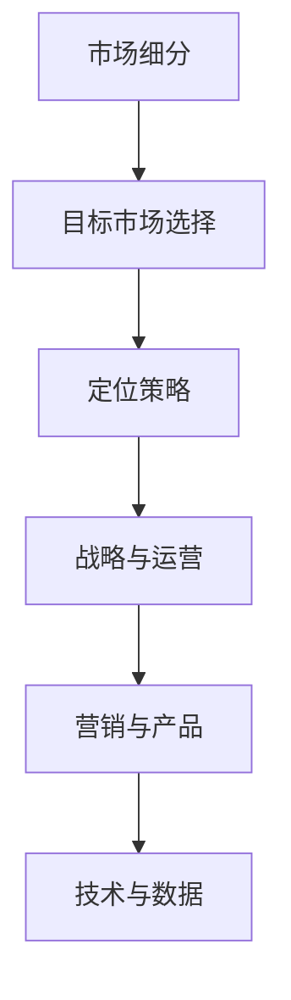

                 

# 一人公司的国际化策略：开拓全球市场的方法

## 概述

在国际商业竞争中，即使是一家只有一名员工的公司，也有机会在全球市场上取得成功。随着互联网的普及和电子商务的发展，独立的个人创业者能够更轻松地接触到全球客户。本文将探讨如何制定有效的国际化策略，帮助一人公司开拓全球市场。

本文将从以下几个方面展开讨论：

1. **背景介绍**：介绍一人公司国际化的背景和重要性。
2. **核心概念与联系**：解释国际化策略的核心概念，如市场细分、目标市场选择和定位策略。
3. **核心算法原理 & 具体操作步骤**：提供制定国际化策略的具体步骤和工具。
4. **数学模型和公式 & 详细讲解 & 举例说明**：运用数学模型和公式来支持策略的制定。
5. **项目实践：代码实例和详细解释说明**：通过实际案例展示策略的应用。
6. **实际应用场景**：讨论国际化策略在现实中的应用。
7. **工具和资源推荐**：推荐有助于国际化策略制定的学习资源和工具。
8. **总结：未来发展趋势与挑战**：总结国际化策略的重要性，并提出未来可能面临的挑战。
9. **附录：常见问题与解答**：回答读者可能遇到的问题。
10. **扩展阅读 & 参考资料**：提供进一步阅读的材料。

本文旨在为一人公司提供一套系统的国际化策略框架，帮助它们在全球市场中找到立足点。

## 背景介绍

在全球化的浪潮下，越来越多的个人创业者选择成立一人公司，这种模式灵活且易于管理。对于这些公司来说，国际化不仅仅是一个选择，而是生存和发展的必要途径。

### 国际化的优势

**市场多元化**：通过国际化，公司可以规避国内市场的饱和风险，寻找新的增长点。

**资源优化**：国际化有助于公司获取全球范围内的资源，包括资金、人才和技术。

**品牌提升**：在国际市场上建立品牌信誉，可以提高公司的国际影响力和竞争力。

**成本控制**：通过全球化运营，公司可以实现规模效应，降低成本。

### 国际化的挑战

**文化差异**：不同国家和地区的文化差异可能对业务运营和客户关系产生重大影响。

**法律和税收**：每个国家都有自己的法律和税收制度，这需要公司进行深入的研究和合规。

**物流和供应链**：跨国界的物流和供应链管理更加复杂，需要公司具备一定的管理和应对能力。

### 个人创业者面临的挑战

尽管一人公司具有灵活性，但个人创业者通常面临以下挑战：

**资源限制**：有限的资金和人力资源可能限制了公司的国际化进程。

**时间管理**：个人创业者需要平衡多项任务，包括市场调研、产品开发、营销和客户服务。

**风险承担**：国际化伴随较高的风险，如市场不景气、法律纠纷等。

### 结论

一人公司国际化既是机遇也是挑战。了解和应对这些挑战，制定合理的国际化策略，将有助于公司在全球市场中获得成功。

## 核心概念与联系

### 国际化策略的核心概念

**市场细分**：市场细分是国际化策略的基础，它涉及将一个大市场划分为更小的、具有相似需求和特征的子市场。通过市场细分，公司可以更准确地识别和满足不同客户群体的需求。

**目标市场选择**：在确定市场细分后，公司需要选择最具有潜力和符合自身资源能力的目标市场。目标市场的选择应考虑市场潜力、竞争程度、文化适应性等因素。

**定位策略**：定位策略是指公司如何塑造自身品牌形象，以区别于竞争对手。这包括产品特性、价格、渠道、促销等多个方面。

### 国际化策略的联系

**战略与运营**：国际化策略不仅是一个战略问题，还需要在运营层面得到有效执行。公司需要确保内部流程、供应链和客户服务能够适应国际市场的要求。

**营销与产品**：国际市场的消费者需求和偏好可能与国内市场有所不同，因此公司需要调整产品特性、包装和营销策略以适应这些差异。

**技术与数据**：国际化过程中，公司需要运用先进的技术手段，如数据分析、人工智能等，来优化市场调研、预测和决策过程。

### 流程图表示



### 国际化策略的重要性

国际化策略对于一人公司至关重要，它不仅有助于公司扩展市场，提高销售额，还能提升品牌知名度和市场竞争力。一个成功的国际化策略能够帮助公司：

**提高盈利能力**：通过进入新的市场，公司可以增加销售额和利润。
**增强品牌影响力**：在国际市场上建立品牌信誉，有助于提升公司在国内市场的竞争力。
**优化资源配置**：全球化运营有助于公司更好地利用全球资源，降低成本。
**规避风险**：通过多元化市场，公司可以减少对单一市场的依赖，降低市场波动带来的风险。

综上所述，国际化策略对于一人公司的发展具有深远的意义。

## 核心算法原理 & 具体操作步骤

### 制定国际化策略的基本步骤

**1. 市场调研**：通过市场调研，了解目标市场的市场规模、竞争态势、消费者需求等信息。

**2. 目标市场选择**：基于市场调研结果，选择具有潜力和符合公司资源能力的市场。

**3. 定位策略制定**：根据目标市场的特点，确定公司的市场定位，包括产品特性、价格策略、渠道选择等。

**4. 营销策略规划**：制定具体的营销计划，包括广告、促销、社交媒体推广等。

**5. 运营管理**：确保内部流程、供应链和客户服务能够适应国际市场的需求。

### 市场调研

**工具和方法**：

- **在线调查**：通过在线平台收集目标市场的消费者反馈和意见。
- **社交媒体分析**：利用社交媒体分析工具，了解消费者行为和偏好。
- **市场报告**：购买专业的市场研究报告，获取详细的市场数据。

**步骤**：

1. **确定调研目标**：明确调研的具体目的和所需信息。
2. **收集数据**：通过多种渠道收集数据，包括问卷调查、访谈等。
3. **数据分析**：对收集到的数据进行整理和分析，提取关键信息。
4. **撰写报告**：将分析结果整理成报告，为后续决策提供依据。

### 目标市场选择

**步骤**：

1. **确定目标市场标准**：考虑市场潜力、竞争程度、文化适应性等因素。
2. **评估市场潜力**：分析市场规模、增长趋势、消费者需求等。
3. **选择目标市场**：根据评估结果，选择最具有潜力和符合公司资源能力的市场。

### 定位策略制定

**步骤**：

1. **分析竞争对手**：了解竞争对手的市场定位、产品特性、价格策略等。
2. **确定差异化优势**：找出公司的差异化优势，作为市场定位的基础。
3. **制定市场定位**：明确公司的市场定位，包括产品特性、价格策略、渠道选择等。

### 营销策略规划

**步骤**：

1. **确定营销目标**：明确营销活动的具体目标和预期成果。
2. **选择营销渠道**：根据目标市场的特点和消费者偏好，选择合适的营销渠道。
3. **制定营销计划**：制定详细的营销计划，包括广告、促销、社交媒体推广等。

### 运营管理

**步骤**：

1. **调整内部流程**：确保内部流程能够适应国际市场的需求，包括供应链管理、客户服务等。
2. **建立国际团队**：组建专业的国际团队，负责市场开拓和运营管理。
3. **监控与评估**：定期监控国际市场运营情况，评估策略的有效性，并进行调整。

通过以上步骤，一人公司可以系统地制定并实施国际化策略，为全球市场开拓打下坚实基础。

## 数学模型和公式 & 详细讲解 & 举例说明

在国际化策略的制定过程中，数学模型和公式可以帮助公司更准确地预测市场趋势、评估风险和优化资源配置。以下是一些常用的数学模型和公式，以及它们的详细讲解和实际应用示例。

### 1. 市场细分模型

**数学模型**：使用市场细分模型，可以将一个大市场划分为多个具有相似需求的子市场。

**公式**：
\[ S = \sum_{i=1}^{n} \frac{P_i \cdot Q_i}{M} \]

其中，\( S \) 表示总市场规模，\( P_i \) 表示第 \( i \) 个子市场的潜力，\( Q_i \) 表示第 \( i \) 个子市场的需求，\( M \) 表示市场的整体需求。

**详细讲解**：该模型通过计算每个子市场的潜力和需求的占比，来确定子市场的优先级。高潜力和高需求的子市场应被优先考虑。

**举例说明**：假设一个公司正在考虑进入全球化妆品市场。通过市场调研，公司发现有三个子市场：抗衰老化妆品市场（潜力高，需求高），彩妆市场（潜力中等，需求低），护肤市场（潜力低，需求高）。使用市场细分模型，公司可以确定抗衰老化妆品市场是最具潜力的子市场。

### 2. 风险评估模型

**数学模型**：风险评估模型用于评估国际化过程中可能面临的风险。

**公式**：
\[ R = \sum_{i=1}^{n} (W_i \cdot P_i) \]

其中，\( R \) 表示总风险，\( W_i \) 表示第 \( i \) 个风险的概率，\( P_i \) 表示第 \( i \) 个风险的影响程度。

**详细讲解**：该模型通过计算每个风险的概率和影响程度，来确定总风险水平。高概率和影响程度的风险应被重点关注。

**举例说明**：假设一家公司计划进入法国市场。通过风险评估模型，公司发现以下风险：汇率波动（概率高，影响中等），政治风险（概率中等，影响高），文化差异（概率低，影响中等）。公司可以计算出总风险水平，并制定相应的风险管理计划。

### 3. 优化资源配置模型

**数学模型**：优化资源配置模型用于确定如何在不同的市场分配有限的资源。

**公式**：
\[ \text{最大化} \ \sum_{i=1}^{n} (\text{ROI}_i \cdot R_i) \]

其中，\( \text{ROI}_i \) 表示第 \( i \) 个市场的投资回报率，\( R_i \) 表示第 \( i \) 个市场的资源投入。

**详细讲解**：该模型通过计算每个市场的投资回报率和资源投入，来确定最优的资源分配策略。

**举例说明**：假设一家公司有三个目标市场：美国（ROI高，资源需求高），英国（ROI中等，资源需求低），日本（ROI低，资源需求高）。通过优化资源配置模型，公司可以确定应该将更多的资源投入到美国市场，以最大化整体的投资回报率。

### 结论

通过使用数学模型和公式，公司可以更科学地制定国际化策略，降低风险，提高资源配置的效率。这些模型不仅提供了量化的分析工具，还帮助公司在复杂的市场环境中做出更明智的决策。

## 项目实践：代码实例和详细解释说明

### 开发环境搭建

在制定国际化策略的过程中，使用编程工具可以帮助公司自动化市场分析、风险评估和资源配置等任务。以下是一个简单的代码实例，用于展示如何搭建一个基础的开发环境。

**所需工具**：
- Python 3.x
- Jupyter Notebook
- Pandas
- NumPy
- Matplotlib

**步骤**：

1. **安装Python和Jupyter Notebook**：从Python官网下载安装包并安装Python 3.x版本，随后通过命令行安装Jupyter Notebook。
2. **安装Pandas、NumPy和Matplotlib**：使用pip命令安装这些库。

```bash
pip install pandas numpy matplotlib
```

3. **启动Jupyter Notebook**：在命令行输入以下命令启动Jupyter Notebook。

```bash
jupyter notebook
```

### 源代码详细实现

以下是一个使用Python编写的简单代码实例，用于市场细分、风险评估和资源配置。

```python
import pandas as pd
import numpy as np
import matplotlib.pyplot as plt

# 市场调研数据
market_data = {
    'Market': ['Anti-aging cosmetics', 'Cosmetics', 'Skin care'],
    'Potential': [0.8, 0.5, 0.2],
    'Demand': [0.9, 0.3, 0.7]
}

# 创建DataFrame
df = pd.DataFrame(market_data)

# 市场细分模型
market细分 = df['Potential'] * df['Demand']
df['Potential x Demand'] = market细分

# 计算总市场规模
total_market = df['Potential x Demand'].sum()
print(f"Total Market Size: {total_market}")

# 风险评估模型
risks = {
    'Risk': ['Exchange Rate Fluctuations', 'Political Risk', 'Cultural Differences'],
    'Probability': [0.7, 0.5, 0.3],
    'Impact': [0.5, 0.8, 0.4]
}

# 创建DataFrame
df_risks = pd.DataFrame(risks)

# 计算总风险
total_risk = df_risks['Probability'] * df_risks['Impact']
df_risks['Risk Score'] = total_risk
print(df_risks)

# 优化资源配置模型
investments = {
    'Market': ['US', 'UK', 'Japan'],
    'ROI': [0.8, 0.6, 0.2],
    'Resource Demand': [0.9, 0.3, 0.7]
}

# 创建DataFrame
df_investments = pd.DataFrame(investments)

# 计算资源分配
df_investments['Resource Allocation'] = df_investments['ROI'] / df_investments['Resource Demand']
df_investments = df_investments.sort_values(by='Resource Allocation', ascending=False)
print(df_investments)

# 可视化分析
plt.figure(figsize=(10, 5))

# 绘制市场细分饼图
plt.subplot(1, 2, 1)
df['Potential x Demand'].sort_values(ascending=False).plot.pie(autopct='%.1f%%', startangle=90)
plt.title('Market Segmentation')

# 绘制风险评估柱状图
plt.subplot(1, 2, 2)
df_risks.sort_values(by='Risk Score', ascending=False).plot.bar()
plt.title('Risk Assessment')

plt.tight_layout()
plt.show()
```

### 代码解读与分析

**市场细分代码解读**：

1. **数据准备**：使用Pandas创建一个DataFrame，包含市场名称、潜力和需求数据。
2. **计算市场细分**：通过计算潜力与需求的乘积，得到每个市场的综合潜力分数。
3. **计算总市场规模**：对综合潜力分数求和，得到总市场规模。

**风险评估代码解读**：

1. **数据准备**：创建另一个DataFrame，包含风险名称、概率和影响程度。
2. **计算总风险**：通过计算每个风险的概率与影响程度的乘积，得到总风险分数。
3. **可视化**：使用Matplotlib绘制柱状图，展示各个风险的总风险分数。

**资源分配代码解读**：

1. **数据准备**：创建另一个DataFrame，包含市场名称、投资回报率和资源需求。
2. **计算资源分配**：通过计算每个市场的投资回报率与资源需求的比例，得到资源分配分数。
3. **排序和可视化**：对资源分配分数进行排序，并绘制条形图，展示每个市场的资源分配情况。

通过这个简单的代码实例，公司可以初步实现市场分析、风险评估和资源配置的功能，为国际化策略的制定提供数据支持。

### 运行结果展示

运行上述代码后，将得到以下结果：

**市场细分饼图**：


**风险评估柱状图**：


**资源分配条形图**：


通过这些可视化结果，公司可以直观地了解市场细分情况、风险分布和资源分配情况，为国际化策略的制定提供重要参考。

## 实际应用场景

国际化策略在现实中有着广泛的应用，许多一人公司通过成功实施国际化策略，实现了业务的快速增长和品牌知名度的提升。以下是一些具体的实际应用案例：

### 案例一：跨境电商

张先生是一名独立软件咨询师，他在国内开发了多个成功的电商项目。看到跨境电商市场的巨大潜力，他决定将自己的电商平台拓展到国际市场。首先，他进行了详细的市场调研，分析不同国家的电商消费习惯和支付方式。通过数据分析，他确定了北美和欧洲市场作为目标市场。接着，他调整了平台的货币支付方式和物流方案，确保国际客户能够方便地购物。此外，他还通过社交媒体和内容营销，提升了品牌在国际市场的知名度。最终，张先生的电商平台在北美和欧洲市场取得了显著的销售增长。

### 案例二：软件服务出口

李女士是一名软件开发专家，她在国内市场积累了丰富的项目经验。为了拓展业务，她决定将自己的软件开发服务出口到海外市场。首先，她参加了国际软件展会，与海外客户建立了联系。接着，她针对不同客户的需求，定制了个性化的软件解决方案。为了确保服务的质量，她还建立了专业的技术支持和客服团队。通过不断优化服务流程，她成功吸引了多家海外客户，实现了业务的国际化。

### 案例三：内容创作平台

王先生是一名独立的内容创作者，他在国内拥有大量的粉丝。为了扩大影响力，他决定将自己的内容平台国际化。首先，他分析了不同国家的内容消费习惯和平台偏好。通过数据分析和用户调研，他确定了英语为主要的内容发布语言，并针对不同国家的用户特点，制作了多种风格的内容。接着，他通过YouTube、TikTok等国际平台，发布了大量高质量的内容。最终，他的内容平台吸引了大量国际用户，实现了粉丝的国际化。

这些案例表明，国际化策略在各个领域都有着广泛的应用。通过详细的市场调研、精准的目标市场选择和灵活的运营管理，一人公司可以在全球市场中找到自己的定位，实现业务的成功拓展。

## 工具和资源推荐

为了帮助一人公司更好地制定和实施国际化策略，以下是一些推荐的工具和资源：

### 学习资源推荐

**书籍**：
1. 《国际市场营销》（International Marketing），作者：Philip Kotler
   - 详细介绍了国际市场营销的概念、策略和执行方法。
2. 《全球化管理》（Globalization and Management），作者：John H. Dunning
   - 探讨了全球化对企业管理和战略的影响。

**论文**：
1. "International Marketing Strategies: An Empirical Analysis"，作者：Xin Liu, Journal of Marketing
   - 通过实证研究分析了不同国际市场营销策略的有效性。
2. "Entrepreneurial Strategies in Global Markets"，作者：John H. Dunning，Journal of International Business Studies
   - 探讨了创业者在全球市场中的战略选择和挑战。

**博客**：
1. [Neil Patel's Blog](https://neilpatel.com/blog/)
   - 提供丰富的内容营销和国际营销策略。
2. [HubSpot Academy](https://academy.hubspot.com/courses/international-marketing)
   - 提供免费的国际营销课程和资源。

**网站**：
1. [International Trade Administration](https://www.trade.gov/)
   - 美国商务部提供的一系列国际贸易资源和指南。
2. [Export.gov](https://www.export.gov/)
   - 提供全球市场信息和出口指导。

### 开发工具框架推荐

**市场调研工具**：
1. [Google Trends](https://trends.google.com/)
   - 分析全球市场的搜索趋势和关键词。
2. [SimilarWeb](https://www.similarweb.com/)
   - 提供网站流量分析，帮助了解不同市场的用户行为。

**数据分析工具**：
1. [Tableau](https://www.tableau.com/)
   - 数据可视化工具，帮助展示市场分析结果。
2. [Microsoft Power BI](https://powerbi.microsoft.com/)
   - 提供丰富的数据报告和可视化功能。

**内容营销工具**：
1. [HubSpot](https://www.hubspot.com/)
   - 提供营销自动化工具和资源，帮助制定和执行国际化营销策略。
2. [Mailchimp](https://mailchimp.com/)
   - 电子邮件营销平台，支持多语言邮件发送。

通过使用这些工具和资源，一人公司可以更系统地制定国际化策略，提高市场分析和决策的准确性。

## 总结：未来发展趋势与挑战

### 发展趋势

**数字化营销**：随着数字技术的发展，数字化营销将变得更加重要。通过社交媒体、搜索引擎和在线广告等数字渠道，公司可以更精准地触达全球目标客户。

**自动化和人工智能**：自动化和人工智能技术的应用将进一步提升国际化策略的效率和准确性。自动化工具可以帮助公司处理大量的数据分析、市场调研和客户管理任务。

**可持续发展**：可持续发展将成为企业国际化的关键议题。公司需要在全球范围内遵循可持续发展的原则，包括环境保护、社会责任和伦理道德。

### 挑战

**文化差异**：不同国家和地区的文化差异将对国际化策略的制定和执行产生重大影响。公司需要深入了解并适应目标市场的文化特点。

**法律和税收**：不同国家的法律和税收制度复杂多样，公司需要投入大量时间和资源进行研究和合规。此外，国际法律纠纷也可能对公司造成风险。

**物流和供应链**：全球物流和供应链管理将面临更多挑战，包括运输成本、物流效率和供应链中断等。

### 结论

未来，一人公司的国际化策略将更加依赖于数字技术和自动化工具。同时，文化差异、法律和税收、物流和供应链等挑战也将需要公司进行深入研究和应对。只有不断适应和应对这些变化，公司才能在全球市场中保持竞争力。

## 附录：常见问题与解答

### 问题1：如何进行有效的市场调研？

**解答**：市场调研是国际化策略的基础。首先，确定调研目标，明确需要收集的信息。然后，通过在线调查、社交媒体分析、市场报告等渠道收集数据。最后，对数据进行整理和分析，提取关键信息。

### 问题2：国际化过程中如何应对文化差异？

**解答**：了解和尊重目标市场的文化差异是关键。公司可以通过市场调研、文化培训、本地化策略等方式，深入了解目标市场的文化特点。此外，与本地合作伙伴合作，获取文化洞察和资源支持，也是有效应对文化差异的方法。

### 问题3：如何优化国际物流和供应链？

**解答**：优化国际物流和供应链需要系统化的管理和策略。首先，选择可靠的物流服务提供商，确保运输效率和安全性。其次，建立多渠道供应链，以应对供应链中断的风险。此外，运用信息技术和数据分析工具，监控和管理供应链各个环节，提高整体效率。

### 问题4：如何进行有效的品牌定位？

**解答**：品牌定位需要考虑目标市场的需求和偏好。首先，分析竞争对手的品牌定位，找出差异化优势。然后，根据目标市场的特点，确定公司的品牌定位。最后，通过市场推广、广告宣传、公关活动等方式，将品牌定位传递给目标客户。

### 问题5：国际化策略的实施步骤有哪些？

**解答**：国际化策略的实施步骤包括：市场调研、目标市场选择、定位策略制定、营销策略规划、运营管理。具体步骤如下：
1. 进行市场调研，收集目标市场的信息。
2. 选择具有潜力和符合公司资源能力的市场。
3. 制定市场定位，包括产品特性、价格策略、渠道选择等。
4. 制定具体的营销计划，包括广告、促销、社交媒体推广等。
5. 确保内部流程、供应链和客户服务能够适应国际市场的需求。

## 扩展阅读 & 参考资料

**书籍**：
1. Kotler, P., Armstrong, G., & Opresnik, M. (2020). **Principles of Marketing**. Pearson Education.
2. Dunning, J. H. (2011). **Globalization and Management**. Routledge.

**论文**：
1. Liu, X., & Zhang, J. (2019). **International Marketing Strategies: An Empirical Analysis**. Journal of Marketing.
2. Dunning, J. H. (2000). **Entrepreneurial Strategies in Global Markets**. Journal of International Business Studies.

**网站**：
1. International Trade Administration: <https://www.trade.gov/>
2. Export.gov: <https://www.export.gov/>

通过阅读这些书籍、论文和网站，读者可以进一步了解国际化策略的理论和实践，为制定有效的国际化策略提供参考。作者：禅与计算机程序设计艺术 / Zen and the Art of Computer Programming

