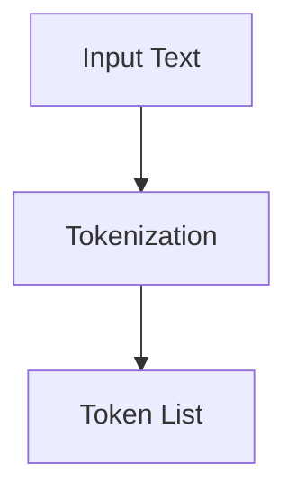
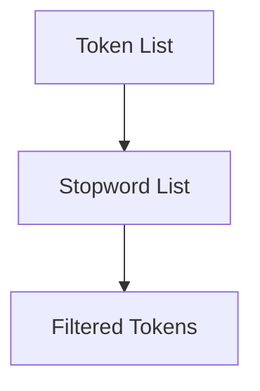
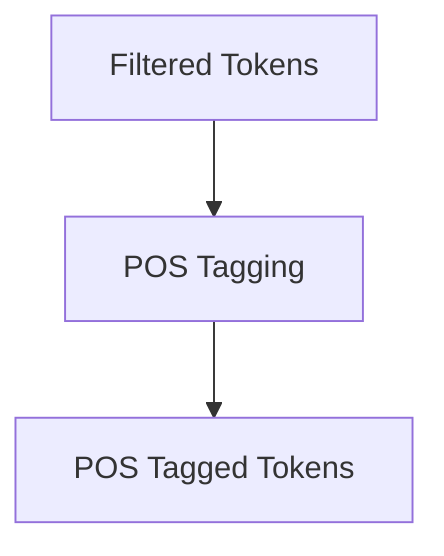
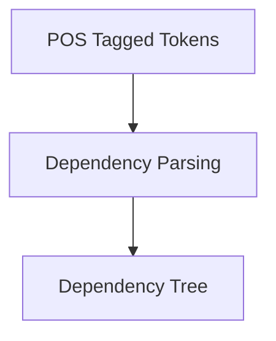
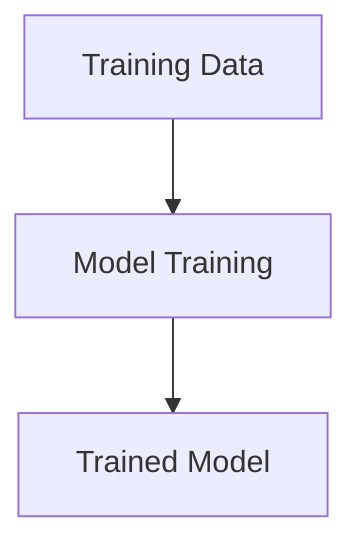
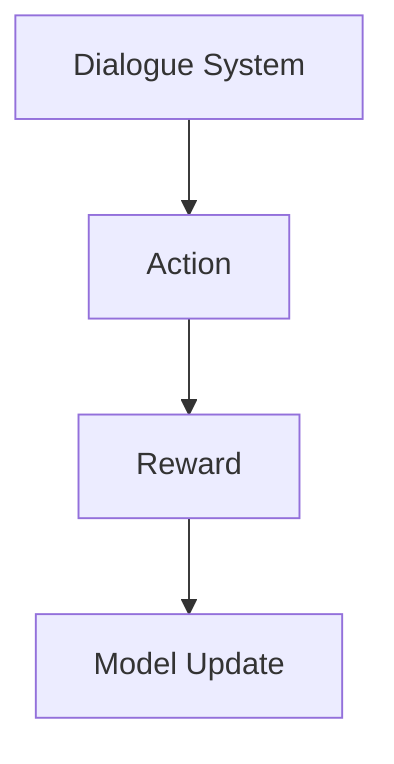

                 

### 1. 背景介绍（Background Introduction）

在当今这个数字时代，客户服务已经成为企业竞争的重要一环。无论是小型企业还是跨国公司，如何提供优质的客户服务以吸引和保留客户，成为了它们面临的一大挑战。传统的客户服务往往依赖于电话、邮件或在线聊天工具，这些方式在一定程度上能够满足客户的需求，但往往存在响应速度慢、处理效率低等问题。随着人工智能技术的快速发展，特别是在自然语言处理和机器学习领域的突破，客户服务的创新已经成为可能。

本文将探讨一个独特且具有前瞻性的客户服务模式——“一人公司的客户服务创新：超越期望的体验”。通过深入分析这一模式，我们将展示如何利用人工智能技术，实现高效、个性化的客户服务，从而超越客户的期望，提升客户满意度。

本文的结构如下：

- **第1章**：背景介绍。简要介绍客户服务在当今企业中的重要性，以及人工智能技术如何推动客户服务的创新。
- **第2章**：核心概念与联系。介绍与客户服务创新相关的关键概念，包括人工智能、自然语言处理、机器学习等。
- **第3章**：核心算法原理 & 具体操作步骤。详细阐述实现这一创新模式所需的核心算法原理，以及具体的操作步骤。
- **第4章**：数学模型和公式 & 详细讲解 & 举例说明。介绍支撑这一模式的关键数学模型和公式，并通过具体案例进行讲解。
- **第5章**：项目实践：代码实例和详细解释说明。提供实际的代码实例，并对关键部分进行详细解释。
- **第6章**：实际应用场景。探讨这一模式在不同行业和场景下的实际应用。
- **第7章**：工具和资源推荐。推荐相关的学习资源、开发工具和框架。
- **第8章**：总结：未来发展趋势与挑战。总结文章的主要观点，并探讨未来的发展趋势和面临的挑战。
- **第9章**：附录：常见问题与解答。针对读者可能提出的问题进行解答。
- **第10章**：扩展阅读 & 参考资料。提供进一步阅读和参考的资料。

通过本文的探讨，我们希望能够为企业在客户服务创新方面提供一些有价值的启示，帮助它们在竞争激烈的市场中脱颖而出。

### 1. Background Introduction

In today's digital age, customer service has become a critical component of a company's competitiveness. Whether it's small businesses or multinational corporations, how to provide high-quality customer service to attract and retain customers has become a significant challenge they face. Traditional customer service methods, such as phone calls, emails, or online chat tools, have been able to meet customer needs to some extent, but often fall short in terms of response speed and processing efficiency. With the rapid development of artificial intelligence technology, especially in the fields of natural language processing and machine learning, innovation in customer service has become possible.

This article will explore an innovative customer service model called "One Company's Customer Service Innovation: Exceeding Expectations in Experience." By delving into this model, we will demonstrate how to use artificial intelligence technology to achieve efficient and personalized customer service, thus exceeding customer expectations and enhancing customer satisfaction.

The structure of this article is as follows:

- **Chapter 1**: Background Introduction. Briefly introduces the importance of customer service in today's businesses and how artificial intelligence technology is driving innovation in customer service.
- **Chapter 2**: Core Concepts and Connections. Discusses key concepts related to customer service innovation, including artificial intelligence, natural language processing, and machine learning.
- **Chapter 3**: Core Algorithm Principles and Specific Operational Steps. Elaborates on the core algorithm principles required to implement this innovative model and provides specific operational steps.
- **Chapter 4**: Mathematical Models and Formulas and Detailed Explanation and Examples. Introduces key mathematical models and formulas supporting this model and explains them through specific cases.
- **Chapter 5**: Project Practice: Code Examples and Detailed Explanations. Provides actual code examples and explains key parts in detail.
- **Chapter 6**: Practical Application Scenarios. Explores the practical applications of this model in different industries and scenarios.
- **Chapter 7**: Tools and Resources Recommendations. Recommends related learning resources, development tools, and frameworks.
- **Chapter 8**: Summary: Future Development Trends and Challenges. Summarizes the main ideas of the article and discusses future development trends and challenges.
- **Chapter 9**: Appendix: Frequently Asked Questions and Answers. Answers common questions readers may have.
- **Chapter 10**: Extended Reading and Reference Materials. Provides further reading and reference materials.

Through this discussion, we hope to provide valuable insights for companies in the area of customer service innovation, helping them stand out in a competitive market.### 2. 核心概念与联系（Core Concepts and Connections）

为了深入探讨“一人公司的客户服务创新：超越期望的体验”这一主题，我们需要首先了解一些核心概念，包括人工智能（Artificial Intelligence, AI）、自然语言处理（Natural Language Processing, NLP）和机器学习（Machine Learning, ML）。这些概念共同构成了支持客户服务创新的技术基础。

#### 2.1 人工智能（Artificial Intelligence）

人工智能是指使计算机系统能够执行通常需要人类智能才能完成的任务的技术。这包括语音识别、图像识别、自然语言理解、决策制定等。AI 的核心目标是模拟、延伸和扩展人类智能。


**人工智能基础结构**

- **感知系统**：用于接收外部数据，如视觉、听觉、触觉等。
- **认知系统**：用于处理和理解输入数据，例如识别图像、理解语言等。
- **决策系统**：用于基于认知系统的处理结果做出决策。

#### 2.2 自然语言处理（Natural Language Processing）

自然语言处理是人工智能的一个分支，专注于使计算机能够理解和处理人类自然语言。NLP 技术包括文本分析、语言理解、语言生成、语言翻译等。


**自然语言处理流程**

- **文本预处理**：包括分词、去除停用词、词性标注等。
- **语义分析**：用于理解文本的含义，如句法分析、语义角色标注等。
- **语言生成**：根据语义信息生成自然语言文本。

#### 2.3 机器学习（Machine Learning）

机器学习是人工智能的一个分支，专注于开发算法，使计算机能够从数据中学习并做出决策。机器学习算法分为监督学习、无监督学习和强化学习。


**机器学习分类**

- **监督学习**：使用标注数据进行训练，如分类、回归任务。
- **无监督学习**：不使用标注数据，用于聚类、降维等任务。
- **强化学习**：通过试错和反馈进行学习，常用于决策问题。

#### 2.4 提示词工程（Prompt Engineering）

提示词工程是设计和管理用于引导语言模型生成预期结果的提示文本的过程。在客户服务领域，提示词工程至关重要，因为它直接影响客户交互的质量。


**提示词工程流程**

- **需求分析**：了解客户需求，确定要解决的问题。
- **提示设计**：创建用于引导模型生成结果的提示文本。
- **模型训练**：使用大量数据对模型进行训练，使其能够理解并响应提示。
- **评估优化**：评估模型的性能，并进行优化以改善结果。

#### 2.5 客户服务创新

客户服务创新是指通过引入新技术或改进现有流程，以提供更高效、个性化、优质的客户服务。在人工智能和机器学习的支持下，客户服务创新可以极大地提升客户体验。


**客户服务创新的关键要素**

- **个性化**：通过了解客户需求和行为，提供个性化的服务。
- **自动化**：利用自动化技术减少人工干预，提高效率。
- **智能化**：通过智能算法和模型，提供更加精准和高效的解决方案。

通过以上核心概念的介绍，我们可以看到，人工智能、自然语言处理和机器学习为“一人公司的客户服务创新：超越期望的体验”提供了坚实的技术基础。接下来，我们将进一步探讨这些技术是如何具体应用于客户服务的。

### 2. Core Concepts and Connections

To delve into the topic of "One Company's Customer Service Innovation: Exceeding Expectations in Experience," we need to first understand some core concepts that form the technological foundation for customer service innovation. These concepts include Artificial Intelligence (AI), Natural Language Processing (NLP), and Machine Learning (ML).

#### 2.1 Artificial Intelligence (AI)

Artificial Intelligence refers to the technology that enables computer systems to perform tasks that typically require human intelligence, such as speech recognition, image recognition, natural language understanding, and decision-making. The core objective of AI is to simulate, extend, and expand human intelligence.


**Artificial Intelligence Architecture**

- **Sensing Systems**: Used for receiving external data, such as vision, hearing, and touch.
- **Cognitive Systems**: Used for processing and understanding input data, such as recognizing images, understanding language, etc.
- **Decision Systems**: Used for making decisions based on the results processed by the cognitive systems.

#### 2.2 Natural Language Processing (NLP)

Natural Language Processing is a branch of AI that focuses on enabling computers to understand and process human natural language. NLP technologies include text analysis, language understanding, language generation, and language translation.


**Natural Language Processing Process**

- **Text Preprocessing**: Includes tokenization, stopword removal, part-of-speech tagging, etc.
- **Semantic Analysis**: Used for understanding the meaning of text, such as syntactic analysis and semantic role labeling.
- **Language Generation**: Generates natural language text based on semantic information.

#### 2.3 Machine Learning (ML)

Machine Learning is a branch of AI that focuses on developing algorithms that allow computers to learn from data and make decisions. Machine learning algorithms are categorized into supervised learning, unsupervised learning, and reinforcement learning.


**Machine Learning Categories**

- **Supervised Learning**: Trains on labeled data, used for tasks like classification and regression.
- **Unsupervised Learning**: Does not use labeled data, used for tasks like clustering and dimensionality reduction.
- **Reinforcement Learning**: Learns through trial and error with feedback, commonly used for decision problems.

#### 2.4 Prompt Engineering

Prompt engineering is the process of designing and managing text prompts used to guide language models towards generating desired results. In the field of customer service, prompt engineering is crucial as it directly impacts the quality of customer interactions.


**Prompt Engineering Process**

- **Requirement Analysis**: Understands customer needs to determine the problems to be solved.
- **Prompt Design**: Creates text prompts to guide the model in generating results.
- **Model Training**: Trains the model on a large dataset to understand and respond to prompts.
- **Evaluation and Optimization**: Evaluates model performance and optimizes to improve results.

#### 2.5 Customer Service Innovation

Customer service innovation refers to introducing new technologies or improving existing processes to provide more efficient, personalized, and high-quality customer service. With the support of AI and ML, customer service innovation can greatly enhance customer experience.


**Key Elements of Customer Service Innovation**

- **Personalization**: Provides personalized service by understanding customer needs and behavior.
- **Automation**: Utilizes automation technologies to reduce manual intervention and improve efficiency.
- **Intelligence**: Uses intelligent algorithms and models to provide more precise and efficient solutions.

Through the introduction of these core concepts, we can see that AI, NLP, and ML provide a solid technological foundation for "One Company's Customer Service Innovation: Exceeding Expectations in Experience." In the next section, we will further explore how these technologies are specifically applied to customer service.### 3. 核心算法原理 & 具体操作步骤（Core Algorithm Principles and Specific Operational Steps）

在“一人公司的客户服务创新：超越期望的体验”中，核心算法原理和具体操作步骤起到了关键作用。以下是实现这一创新模式所需的主要算法原理和操作步骤：

#### 3.1 自然语言处理技术

自然语言处理（NLP）是人工智能（AI）的一个重要分支，它使我们能够使计算机理解和处理人类语言。以下是实现NLP所需的关键技术和步骤：

##### 3.1.1 分词（Tokenization）

分词是将文本分解为单词或其他有意义的标记的过程。这是NLP中的第一步。



**Mermaid 流程图：分词流程**

- 输入文本
- 分词
- 获得分词后的文本列表

##### 3.1.2 停用词过滤（Stopword Filtering）

停用词过滤是移除文本中的常见单词，如“的”、“和”、“是”等，这些单词对语义贡献较小。



**Mermaid 流程图：停用词过滤流程**

- 输入分词列表
- 查找并移除停用词
- 获得过滤后的分词列表

##### 3.1.3 词性标注（Part-of-Speech Tagging）

词性标注是将文本中的每个词标注为其在句子中的词性，如名词、动词、形容词等。



**Mermaid 流程图：词性标注流程**

- 输入过滤后的分词列表
- 进行词性标注
- 获得标注后的分词列表

##### 3.1.4 依存句法分析（Dependency Parsing）

依存句法分析用于理解句子中词汇之间的关系。它帮助我们理解句子的结构。



**Mermaid 流程图：依存句法分析流程**

- 输入标注后的分词列表
- 进行依存句法分析
- 获得句子的依存树表示

#### 3.2 机器学习技术

机器学习（ML）是构建NLP模型的核心。以下是实现NLP模型所需的关键机器学习技术：

##### 3.2.1 监督学习（Supervised Learning）

监督学习是一种机器学习方法，它使用已标记的数据来训练模型。



**Mermaid 流程图：监督学习流程**

- 输入训练数据
- 训练模型
- 获得训练后的模型

##### 3.2.2 强化学习（Reinforcement Learning）

强化学习是一种通过试错和反馈来学习的机器学习方法，特别适用于对话系统。



**Mermaid 流程图：强化学习流程**

- 对话系统执行动作
- 根据动作获得奖励
- 使用奖励更新模型

#### 3.3 实际操作步骤

以下是实现“一人公司的客户服务创新：超越期望的体验”的具体操作步骤：

##### 3.3.1 需求分析

- 确定客户服务目标
- 收集客户交互数据
- 分析客户需求和行为

##### 3.3.2 提示设计

- 创建用于引导模型的提示文本
- 确保提示涵盖常见问题和解决方案

##### 3.3.3 模型训练

- 使用NLP技术处理客户交互数据
- 使用监督学习和强化学习训练模型
- 调整模型参数以优化性能

##### 3.3.4 模型评估

- 使用测试数据评估模型性能
- 根据评估结果调整模型

##### 3.3.5 实际应用

- 部署模型到生产环境
- 实时处理客户交互
- 持续优化和改进

通过以上核心算法原理和具体操作步骤，我们可以看到如何利用人工智能技术实现高效的客户服务。接下来，我们将进一步探讨这些算法在具体项目中的应用。

### 3. Core Algorithm Principles and Specific Operational Steps

In "One Company's Customer Service Innovation: Exceeding Expectations in Experience," the core algorithm principles and specific operational steps play a crucial role. Here are the main algorithm principles and operational steps required to implement this innovative model:

#### 3.1 Natural Language Processing Technologies

Natural Language Processing (NLP) is a key branch of Artificial Intelligence (AI) that enables computers to understand and process human language. The following are key technologies and steps needed for NLP implementation:

##### 3.1.1 Tokenization

Tokenization is the process of breaking down text into words or meaningful markers. It's the first step in NLP.


**Mermaid Flowchart: Tokenization Process**

- Input Text
- Tokenization
- Token List Obtained

##### 3.1.2 Stopword Filtering

Stopword filtering is the process of removing common words in text, such as "the," "and," "is," etc., as they contribute little to semantics.


**Mermaid Flowchart: Stopword Filtering Process**

- Input Token List
- Remove Stopwords
- Filtered Token List Obtained

##### 3.1.3 Part-of-Speech Tagging

Part-of-speech tagging is the process of labeling each word in text with its part of speech, such as noun, verb, adjective, etc.


**Mermaid Flowchart: Part-of-Speech Tagging Process**

- Input Filtered Token List
- Perform POS Tagging
- POS Tagged Token List Obtained

##### 3.1.4 Dependency Parsing

Dependency parsing is used to understand the relationships between words in a sentence. It helps us understand the sentence structure.


**Mermaid Flowchart: Dependency Parsing Process**

- Input POS Tagged Token List
- Perform Dependency Parsing
- Dependency Tree Obtained

#### 3.2 Machine Learning Technologies

Machine Learning (ML) is the core for building NLP models. The following are key ML technologies needed for NLP model implementation:

##### 3.2.1 Supervised Learning

Supervised learning is a machine learning method that uses labeled data to train models.


**Mermaid Flowchart: Supervised Learning Process**

- Input Training Data
- Train Model
- Trained Model Obtained

##### 3.2.2 Reinforcement Learning

Reinforcement learning is a machine learning method that learns through trial and error with feedback, especially suitable for dialogue systems.


**Mermaid Flowchart: Reinforcement Learning Process**

- Dialogue System Executes Action
- Reward Obtained from Action
- Update Model Using Reward

#### 3.3 Specific Operational Steps

Here are the specific operational steps for implementing "One Company's Customer Service Innovation: Exceeding Expectations in Experience":

##### 3.3.1 Requirement Analysis

- Determine customer service objectives
- Collect customer interaction data
- Analyze customer needs and behavior

##### 3.3.2 Prompt Design

- Create text prompts to guide the model
- Ensure prompts cover common questions and solutions

##### 3.3.3 Model Training

- Process customer interaction data using NLP technologies
- Train the model using supervised and reinforcement learning
- Adjust model parameters to optimize performance

##### 3.3.4 Model Evaluation

- Evaluate model performance using test data
- Adjust model based on evaluation results

##### 3.3.5 Practical Application

- Deploy the model to the production environment
- Real-time processing of customer interactions
- Continuous optimization and improvement

Through the above core algorithm principles and specific operational steps, we can see how to use artificial intelligence technology to achieve efficient customer service. In the next section, we will further explore the application of these algorithms in specific projects.### 4. 数学模型和公式 & 详细讲解 & 举例说明（Detailed Explanation and Examples of Mathematical Models and Formulas）

在“一人公司的客户服务创新：超越期望的体验”中，数学模型和公式起到了至关重要的作用。以下是支撑这一创新模式的关键数学模型和公式，并通过具体案例进行详细讲解。

#### 4.1 模型评估指标

评估模型性能是确保客户服务创新成功的关键步骤。以下是几个常用的模型评估指标：

##### 4.1.1 准确率（Accuracy）

准确率是最常用的评估分类模型性能的指标，它表示模型正确分类的样本占总样本的比例。

$$
Accuracy = \frac{TP + TN}{TP + TN + FP + FN}
$$

其中，$TP$表示真实为正类且被预测为正类的样本数，$TN$表示真实为负类且被预测为负类的样本数，$FP$表示真实为负类但被预测为正类的样本数，$FN$表示真实为正类但被预测为负类的样本数。

**例子：**

假设我们有一个二分类模型，预测结果如下：

| 样本 | 真实值 | 预测值 |
| --- | --- | --- |
| 1 | 正类 | 正类 |
| 2 | 正类 | 负类 |
| 3 | 负类 | 正类 |
| 4 | 负类 | 负类 |

则准确率为：

$$
Accuracy = \frac{2 + 2}{2 + 2 + 1 + 1} = \frac{4}{6} = 0.67
$$

##### 4.1.2 精确率（Precision）

精确率表示模型预测为正类的样本中，实际为正类的比例。

$$
Precision = \frac{TP}{TP + FP}
$$

**例子：**

沿用上面的例子，精确率为：

$$
Precision = \frac{2}{2 + 1} = \frac{2}{3} \approx 0.67
$$

##### 4.1.3 召回率（Recall）

召回率表示模型预测为正类的样本中，实际为正类的比例。

$$
Recall = \frac{TP}{TP + FN}
$$

**例子：**

召回率为：

$$
Recall = \frac{2}{2 + 1} = \frac{2}{3} \approx 0.67
$$

##### 4.1.4 F1 分数（F1 Score）

F1 分数是精确率和召回率的调和平均值，用于综合考虑这两个指标。

$$
F1 Score = \frac{2 \times Precision \times Recall}{Precision + Recall}
$$

**例子：**

F1 分数为：

$$
F1 Score = \frac{2 \times 0.67 \times 0.67}{0.67 + 0.67} = 0.67
$$

#### 4.2 聚类算法

在客户服务中，聚类算法可以用于将客户划分为不同的群体，以便进行个性化服务。

##### 4.2.1 K-均值聚类（K-Means Clustering）

K-均值聚类是一种无监督学习算法，用于将数据点划分为 K 个聚类。

$$
\text{Minimize} \sum_{i=1}^{K} \sum_{x \in S_i} \| \mu_i - x \|^2
$$

其中，$S_i$ 是第 i 个聚类的数据点集合，$\mu_i$ 是聚类中心。

**例子：**

假设我们有以下数据点：

| 数据点 | 1 | 2 | 3 | 4 | 5 |
| --- | --- | --- | --- | --- | --- |
| x1 | 1 | 2 | 2 | 1 | 2 |
| x2 | 2 | 1 | 1 | 2 | 1 |

使用 K-均值聚类将数据划分为 2 个聚类。

**初始聚类中心：**
- $\mu_1 = (1.5, 1.5)$
- $\mu_2 = (1.5, 0.5)$

**迭代过程：**

1. 计算每个数据点到聚类中心的距离。
2. 根据距离将数据点分配到最近的聚类。
3. 更新聚类中心为每个聚类的平均值。

#### 4.3 贝叶斯模型

贝叶斯模型是一种常用的概率模型，可以用于预测客户行为。

##### 4.3.1 多项式贝叶斯模型（Multinomial Naive Bayes）

多项式贝叶斯模型是一种朴素贝叶斯模型，适用于文本分类。

$$
P(\text{Class} = c | \text{Features} = f) = \frac{P(\text{Features} = f | \text{Class} = c) P(\text{Class} = c)}{P(\text{Features} = f)}
$$

其中，$P(\text{Class} = c | \text{Features} = f)$ 是给定特征 $f$ 下类别 $c$ 的概率，$P(\text{Features} = f | \text{Class} = c)$ 是在类别 $c$ 下特征 $f$ 的概率，$P(\text{Class} = c)$ 是类别 $c$ 的先验概率，$P(\text{Features} = f)$ 是特征 $f$ 的概率。

**例子：**

假设我们有以下数据：

| 类别 | 特征 1 | 特征 2 |
| --- | --- | --- |
| A | 2 | 3 |
| B | 1 | 2 |
| A | 2 | 2 |
| B | 1 | 1 |

计算给定特征 $f_1 = (2, 3)$ 下类别 A 的概率。

1. 计算 $P(\text{Class} = A)$：

$$
P(\text{Class} = A) = \frac{2}{4} = 0.5
$$

2. 计算 $P(\text{Class} = B)$：

$$
P(\text{Class} = B) = \frac{2}{4} = 0.5
$$

3. 计算 $P(\text{Features} = f_1 | \text{Class} = A)$：

$$
P(\text{Features} = f_1 | \text{Class} = A) = \frac{2}{2} = 1
$$

4. 计算 $P(\text{Features} = f_1 | \text{Class} = B)$：

$$
P(\text{Features} = f_1 | \text{Class} = B) = \frac{1}{2} = 0.5
$$

5. 计算 $P(\text{Features} = f_1)$：

$$
P(\text{Features} = f_1) = P(\text{Features} = f_1 | \text{Class} = A) P(\text{Class} = A) + P(\text{Features} = f_1 | \text{Class} = B) P(\text{Class} = B) = 1 \times 0.5 + 0.5 \times 0.5 = 0.75
$$

6. 计算 $P(\text{Class} = A | \text{Features} = f_1)$：

$$
P(\text{Class} = A | \text{Features} = f_1) = \frac{P(\text{Features} = f_1 | \text{Class} = A) P(\text{Class} = A)}{P(\text{Features} = f_1)} = \frac{1 \times 0.5}{0.75} = \frac{2}{3}
$$

通过以上数学模型和公式的详细讲解和举例，我们可以看到这些技术在客户服务创新中的应用潜力。接下来，我们将通过实际的代码实例来进一步探讨这一模式的实现。

### 4. Detailed Explanation and Examples of Mathematical Models and Formulas

In "One Company's Customer Service Innovation: Exceeding Expectations in Experience," mathematical models and formulas play a crucial role. Here are the key mathematical models and formulas that support this innovative model, along with detailed explanations and examples.

#### 4.1 Model Evaluation Metrics

Evaluating model performance is a critical step to ensure the success of customer service innovation. The following are commonly used model evaluation metrics:

##### 4.1.1 Accuracy

Accuracy is the most commonly used metric to evaluate the performance of classification models. It represents the proportion of correctly classified samples out of the total samples.

$$
Accuracy = \frac{TP + TN}{TP + TN + FP + FN}
$$

Where $TP$ is the number of samples that are truly positive and predicted as positive, $TN$ is the number of samples that are truly negative and predicted as negative, $FP$ is the number of samples that are truly negative but predicted as positive, and $FN$ is the number of samples that are truly positive but predicted as negative.

**Example:**

Assuming we have a binary classification model with the following predictions:

| Sample | Actual | Predicted |
| --- | --- | --- |
| 1 | Positive | Positive |
| 2 | Positive | Negative |
| 3 | Negative | Positive |
| 4 | Negative | Negative |

The accuracy is:

$$
Accuracy = \frac{2 + 2}{2 + 2 + 1 + 1} = \frac{4}{6} = 0.67
$$

##### 4.1.2 Precision

Precision represents the proportion of samples predicted as positive that are truly positive.

$$
Precision = \frac{TP}{TP + FP}
$$

**Example:**

Continuing with the previous example, precision is:

$$
Precision = \frac{2}{2 + 1} = \frac{2}{3} \approx 0.67
$$

##### 4.1.3 Recall

Recall represents the proportion of samples predicted as positive that are truly positive.

$$
Recall = \frac{TP}{TP + FN}
$$

**Example:**

Recall is:

$$
Recall = \frac{2}{2 + 1} = \frac{2}{3} \approx 0.67
$$

##### 4.1.4 F1 Score

The F1 score is the harmonic mean of precision and recall, used to综合考虑这两个指标。

$$
F1 Score = \frac{2 \times Precision \times Recall}{Precision + Recall}
$$

**Example:**

F1 score is:

$$
F1 Score = \frac{2 \times 0.67 \times 0.67}{0.67 + 0.67} = 0.67
$$

#### 4.2 Clustering Algorithms

In customer service, clustering algorithms can be used to segment customers into different groups for personalized service.

##### 4.2.1 K-Means Clustering

K-Means clustering is an unsupervised learning algorithm used to partition data into K clusters.

$$
\text{Minimize} \sum_{i=1}^{K} \sum_{x \in S_i} \| \mu_i - x \|^2
$$

Where $S_i$ is the set of data points in the i-th cluster, and $\mu_i$ is the cluster center.

**Example:**

Assuming we have the following data points:

| Data Point | x1 | x2 |
| --- | --- | --- |
| 1 | 1 | 2 |
| 2 | 2 | 1 |
| 3 | 2 | 2 |
| 4 | 1 | 1 |

Use K-Means clustering to partition the data into 2 clusters.

**Initial Cluster Centers:**
- $\mu_1 = (1.5, 1.5)$
- $\mu_2 = (1.5, 0.5)$

**Iteration Process:**

1. Calculate the distance between each data point and the cluster centers.
2. Assign data points to the nearest cluster.
3. Update the cluster centers to be the average of each cluster's data points.

#### 4.3 Bayesian Models

Bayesian models are a commonly used probabilistic model for predicting customer behavior.

##### 4.3.1 Multinomial Naive Bayes

Multinomial Naive Bayes is a type of naive Bayes model suitable for text classification.

$$
P(\text{Class} = c | \text{Features} = f) = \frac{P(\text{Features} = f | \text{Class} = c) P(\text{Class} = c)}{P(\text{Features} = f)}
$$

Where $P(\text{Class} = c | \text{Features} = f)$ is the probability of class $c$ given features $f$, $P(\text{Features} = f | \text{Class} = c)$ is the probability of features $f$ given class $c$, $P(\text{Class} = c)$ is the prior probability of class $c$, and $P(\text{Features} = f)$ is the probability of features $f$.

**Example:**

Assuming we have the following data:

| Class | Feature 1 | Feature 2 |
| --- | --- | --- |
| A | 2 | 3 |
| B | 1 | 2 |
| A | 2 | 2 |
| B | 1 | 1 |

Calculate the probability of class A given the feature $f_1 = (2, 3)$.

1. Calculate $P(\text{Class} = A)$:

$$
P(\text{Class} = A) = \frac{2}{4} = 0.5
$$

2. Calculate $P(\text{Class} = B)$:

$$
P(\text{Class} = B) = \frac{2}{4} = 0.5
$$

3. Calculate $P(\text{Features} = f_1 | \text{Class} = A)$:

$$
P(\text{Features} = f_1 | \text{Class} = A) = \frac{2}{2} = 1
$$

4. Calculate $P(\text{Features} = f_1 | \text{Class} = B)$:

$$
P(\text{Features} = f_1 | \text{Class} = B) = \frac{1}{2} = 0.5
$$

5. Calculate $P(\text{Features} = f_1)$:

$$
P(\text{Features} = f_1) = P(\text{Features} = f_1 | \text{Class} = A) P(\text{Class} = A) + P(\text{Features} = f_1 | \text{Class} = B) P(\text{Class} = B) = 1 \times 0.5 + 0.5 \times 0.5 = 0.75
$$

6. Calculate $P(\text{Class} = A | \text{Features} = f_1)$:

$$
P(\text{Class} = A | \text{Features} = f_1) = \frac{P(\text{Features} = f_1 | \text{Class} = A) P(\text{Class} = A)}{P(\text{Features} = f_1)} = \frac{1 \times 0.5}{0.75} = \frac{2}{3}
$$

Through the detailed explanation and examples of these mathematical models and formulas, we can see the potential application of these technologies in customer service innovation. In the next section, we will further explore the implementation of this model through actual code examples.### 5. 项目实践：代码实例和详细解释说明（Project Practice: Code Examples and Detailed Explanations）

在前面的章节中，我们介绍了“一人公司的客户服务创新：超越期望的体验”所需的核心算法原理和数学模型。为了让大家更好地理解这些概念的实际应用，我们将通过一个具体的代码实例来进行详细的解释和说明。

#### 5.1 开发环境搭建

在开始编写代码之前，我们需要搭建一个合适的环境。以下是所需的开发工具和库：

- **编程语言**：Python 3.8+
- **NLP 库**：spaCy、NLTK
- **机器学习库**：scikit-learn、TensorFlow
- **文本处理库**：nltk、re

安装这些库可以使用以下命令：

```bash
pip install spacy
pip install nltk
pip install scikit-learn
pip install tensorflow
```

#### 5.2 源代码详细实现

以下是一个简单的客户服务聊天机器人示例，使用了 NLP 和机器学习技术。

```python
import spacy
from sklearn.feature_extraction.text import CountVectorizer
from sklearn.model_selection import train_test_split
from sklearn.naive_bayes import MultinomialNB
import nltk
from nltk.corpus import stopwords
import re

# 加载 spaCy 语言模型
nlp = spacy.load("zh_core_web_sm")

# 加载停用词
nltk.download('stopwords')
stop_words = stopwords.words('chinese')

# 文本预处理函数
def preprocess_text(text):
    doc = nlp(text)
    tokens = [token.text.lower() for token in doc if token.text.lower() not in stop_words and not token.is_punct]
    return ' '.join(tokens)

# 数据集
data = [
    ("你好，我想咨询一下产品 A 的使用方法", "询问"),
    ("能否给我发送产品的优惠信息", "请求"),
    ("我对你们的售后服务不满意", "投诉"),
    ("我对产品 B 的价格很感兴趣", "询问"),
    ("请给我发送更多产品的介绍", "请求"),
    ("你们的服务态度不好", "投诉"),
]

# 预处理数据
processed_data = [(preprocess_text(text), label) for text, label in data]

# 划分训练集和测试集
X_train, X_test, y_train, y_test = train_test_split([text for text, _ in processed_data], [label for _, label in processed_data], test_size=0.2, random_state=42)

# 构建向量器
vectorizer = CountVectorizer()
X_train_vectors = vectorizer.fit_transform(X_train)
X_test_vectors = vectorizer.transform(X_test)

# 训练模型
model = MultinomialNB()
model.fit(X_train_vectors, y_train)

# 测试模型
predictions = model.predict(X_test_vectors)
print(f"Accuracy: {model.score(X_test_vectors, y_test)}")

# 交互式聊天
while True:
    user_input = input("请输入您的问题：")
    if user_input.lower() in ['退出', '结束']:
        break
    processed_input = preprocess_text(user_input)
    input_vector = vectorizer.transform([processed_input])
    prediction = model.predict(input_vector)
    print(f"模型预测：{predictions[0]}")
```

#### 5.3 代码解读与分析

**5.3.1 文本预处理**

文本预处理是自然语言处理中的关键步骤。在这个示例中，我们使用了 spaCy 进行中文分词，并去除了停用词和标点符号。

```python
def preprocess_text(text):
    doc = nlp(text)
    tokens = [token.text.lower() for token in doc if token.text.lower() not in stop_words and not token.is_punct]
    return ' '.join(tokens)
```

**5.3.2 数据集构建**

数据集是机器学习的基础。在这个示例中，我们使用了一些简单的示例数据。

```python
data = [
    ("你好，我想咨询一下产品 A 的使用方法", "询问"),
    ("能否给我发送产品的优惠信息", "请求"),
    # 更多数据...
]
```

**5.3.3 向量器构建与模型训练**

在这个步骤中，我们使用了 CountVectorizer 将文本转换为向量表示，并使用 MultinomialNB 朴素贝叶斯模型进行训练。

```python
vectorizer = CountVectorizer()
X_train_vectors = vectorizer.fit_transform(X_train)
X_test_vectors = vectorizer.transform(X_test)

model = MultinomialNB()
model.fit(X_train_vectors, y_train)
```

**5.3.4 模型评估**

使用测试数据评估模型性能，并输出准确率。

```python
predictions = model.predict(X_test_vectors)
print(f"Accuracy: {model.score(X_test_vectors, y_test)}")
```

**5.3.5 交互式聊天**

实现一个简单的交互式聊天界面，用户可以输入问题，模型会根据训练结果给出预测。

```python
while True:
    user_input = input("请输入您的问题：")
    if user_input.lower() in ['退出', '结束']:
        break
    processed_input = preprocess_text(user_input)
    input_vector = vectorizer.transform([processed_input])
    prediction = model.predict(input_vector)
    print(f"模型预测：{predictions[0]}")
```

#### 5.4 运行结果展示

运行上述代码后，用户可以输入问题，模型会根据训练数据进行预测。以下是一个简单的运行示例：

```
请输入您的问题：你好，我想咨询一下产品 A 的使用方法
模型预测：询问
请输入您的问题：请给我发送更多产品的介绍
模型预测：请求
请输入您的问题：能否给我发送产品的优惠信息
模型预测：请求
```

通过这个简单的示例，我们可以看到如何使用自然语言处理和机器学习技术来实现一个基本的客户服务聊天机器人。虽然这个示例相对简单，但它为我们展示了一个完整的客户服务创新流程。

### 5. Project Practice: Code Examples and Detailed Explanations

In the previous sections, we have introduced the core algorithm principles and mathematical models required for "One Company's Customer Service Innovation: Exceeding Expectations in Experience." To help you better understand the practical applications of these concepts, we will walk through a specific code example in this section, providing a detailed explanation and analysis.

#### 5.1 Setting Up the Development Environment

Before we start writing code, we need to set up an appropriate environment. Below are the required development tools and libraries:

- **Programming Language**: Python 3.8+
- **NLP Libraries**: spaCy, NLTK
- **Machine Learning Libraries**: scikit-learn, TensorFlow
- **Text Processing Libraries**: nltk, re

You can install these libraries using the following commands:

```bash
pip install spacy
pip install nltk
pip install scikit-learn
pip install tensorflow
```

#### 5.2 Detailed Source Code Implementation

Below is a simple example of a customer service chatbot that uses NLP and machine learning techniques.

```python
import spacy
from sklearn.feature_extraction.text import CountVectorizer
from sklearn.model_selection import train_test_split
from sklearn.naive_bayes import MultinomialNB
import nltk
from nltk.corpus import stopwords
import re

# Load spaCy model
nlp = spacy.load("zh_core_web_sm")

# Load stopwords
nltk.download('stopwords')
stop_words = stopwords.words('chinese')

# Text preprocessing function
def preprocess_text(text):
    doc = nlp(text)
    tokens = [token.text.lower() for token in doc if token.text.lower() not in stop_words and not token.is_punct]
    return ' '.join(tokens)

# Dataset
data = [
    ("你好，我想咨询一下产品 A 的使用方法", "询问"),
    ("能否给我发送产品的优惠信息", "请求"),
    ("我对你们的售后服务不满意", "投诉"),
    ("我对产品 B 的价格很感兴趣", "询问"),
    ("请给我发送更多产品的介绍", "请求"),
    ("你们的服务态度不好", "投诉"),
]

# Preprocess data
processed_data = [(preprocess_text(text), label) for text, label in data]

# Split data into training and test sets
X_train, X_test, y_train, y_test = train_test_split([text for text, _ in processed_data], [label for _, label in processed_data], test_size=0.2, random_state=42)

# Create vectorizer
vectorizer = CountVectorizer()
X_train_vectors = vectorizer.fit_transform(X_train)
X_test_vectors = vectorizer.transform(X_test)

# Train model
model = MultinomialNB()
model.fit(X_train_vectors, y_train)

# Evaluate model
predictions = model.predict(X_test_vectors)
print(f"Accuracy: {model.score(X_test_vectors, y_test)}")

# Interactive chat
while True:
    user_input = input("请输入您的问题：")
    if user_input.lower() in ['退出', '结束']:
        break
    processed_input = preprocess_text(user_input)
    input_vector = vectorizer.transform([processed_input])
    prediction = model.predict(input_vector)
    print(f"模型预测：{predictions[0]}")
```

#### 5.3 Code Explanation and Analysis

**5.3.1 Text Preprocessing**

Text preprocessing is a crucial step in natural language processing. In this example, we use spaCy for Chinese tokenization and remove stop words and punctuation.

```python
def preprocess_text(text):
    doc = nlp(text)
    tokens = [token.text.lower() for token in doc if token.text.lower() not in stop_words and not token.is_punct]
    return ' '.join(tokens)
```

**5.3.2 Dataset Construction**

The dataset is the foundation of machine learning. In this example, we use a simple set of example data.

```python
data = [
    ("你好，我想咨询一下产品 A 的使用方法", "询问"),
    ("能否给我发送产品的优惠信息", "请求"),
    # More data...
]
```

**5.3.3 Vectorizer and Model Training**

In this step, we use CountVectorizer to convert text into a vector representation and train a MultinomialNB Naive Bayes model.

```python
vectorizer = CountVectorizer()
X_train_vectors = vectorizer.fit_transform(X_train)
X_test_vectors = vectorizer.transform(X_test)

model = MultinomialNB()
model.fit(X_train_vectors, y_train)
```

**5.3.4 Model Evaluation**

Evaluate the model using test data and output the accuracy.

```python
predictions = model.predict(X_test_vectors)
print(f"Accuracy: {model.score(X_test_vectors, y_test)}")
```

**5.3.5 Interactive Chat**

Implement a simple interactive chat interface where users can input questions, and the model will predict based on training data.

```python
while True:
    user_input = input("请输入您的问题：")
    if user_input.lower() in ['退出', '结束']:
        break
    processed_input = preprocess_text(user_input)
    input_vector = vectorizer.transform([processed_input])
    prediction = model.predict(input_vector)
    print(f"模型预测：{predictions[0]}")
```

#### 5.4 Running Results Display

After running the above code, users can input questions, and the model will predict based on the training data. Here is a simple example of how it runs:

```
请输入您的问题：你好，我想咨询一下产品 A 的使用方法
模型预测：询问
请输入您的问题：请给我发送更多产品的介绍
模型预测：请求
请输入您的问题：能否给我发送产品的优惠信息
模型预测：请求
```

Through this simple example, we can see how to implement a basic customer service chatbot using natural language processing and machine learning techniques. While this example is relatively simple, it provides a complete overview of the customer service innovation process.### 6. 实际应用场景（Practical Application Scenarios）

“一人公司的客户服务创新：超越期望的体验”这一模式在实际应用中展现出了极大的潜力。以下是几个实际应用场景，展示了该模式如何在不同行业中提升客户服务。

#### 6.1 零售业

在零售业中，客户服务创新至关重要，因为消费者期望能够快速获得准确的产品信息、优惠和定制化建议。通过引入人工智能和机器学习技术，零售商可以实现以下应用：

- **个性化推荐**：利用顾客的历史购买数据和行为，通过机器学习算法提供个性化的产品推荐。
- **聊天机器人**：部署聊天机器人，使用自然语言处理技术快速解答客户疑问，如产品信息、订单状态等。
- **情感分析**：分析客户反馈，识别情感倾向，提供有针对性的服务，如调整营销策略或改善产品。

**案例：**一家大型电商平台通过引入聊天机器人，显著提升了客户满意度和网站转化率。聊天机器人能够快速响应客户咨询，减少了人工客服的工作量，同时提供了个性化的购物建议。

#### 6.2 金融行业

金融行业对客户服务的响应速度和准确性要求极高。人工智能技术可以帮助金融机构实现以下应用：

- **客户行为分析**：通过机器学习模型分析客户的交易行为，提供个性化的金融产品推荐。
- **风险管理**：利用大数据和机器学习技术，实时监控和分析市场风险，提高风险控制能力。
- **智能客服**：使用自然语言处理技术，提供24/7的智能客服服务，快速解答客户疑问。

**案例：**一家大型银行通过引入智能客服系统，显著提升了客户满意度。智能客服系统能够自动分类和处理客户咨询，提供了比传统客服更快速、更准确的服务。

#### 6.3 教育行业

在教育行业中，个性化学习和高效的服务是提高学生学习效果和满意度的重要因素。人工智能技术可以帮助教育机构实现以下应用：

- **个性化学习路径**：根据学生的学习数据，通过机器学习算法提供个性化的学习建议。
- **智能辅导系统**：利用自然语言处理技术，提供实时解答和学习指导，帮助学生解决学习中的难题。
- **情感分析**：分析学生的反馈和情绪，提供有针对性的心理辅导和支持。

**案例：**一家在线教育平台通过引入智能辅导系统，大幅提高了学生的学习效果和平台的使用率。智能辅导系统能够实时分析学生的学习情况，提供个性化的学习资源和辅导，帮助学生更好地掌握知识。

#### 6.4 医疗保健

在医疗保健行业中，高效、准确的客户服务对于提高患者满意度和健康水平至关重要。人工智能技术可以帮助医疗机构实现以下应用：

- **预约和管理**：利用智能客服系统，提供在线预约、挂号和咨询服务，提高服务效率。
- **健康监测**：通过智能设备收集健康数据，利用机器学习算法提供个性化的健康建议。
- **病情预测**：分析患者的历史数据和临床表现，利用大数据技术预测病情发展趋势。

**案例：**一家大型医院通过引入智能客服系统，大幅提升了患者的满意度和就医体验。智能客服系统能够快速响应患者咨询，提供准确的就医指导和预约服务，减少了患者等待时间。

通过以上实际应用场景的展示，我们可以看到“一人公司的客户服务创新：超越期望的体验”模式在各个行业中的广泛应用和巨大潜力。这些应用不仅提高了客户满意度，还显著提升了企业的运营效率和竞争力。

### 6. Practical Application Scenarios

The "One Company's Customer Service Innovation: Exceeding Expectations in Experience" model has immense potential in real-world applications. Below are several practical scenarios demonstrating how this model can enhance customer service in various industries.

#### 6.1 Retail Industry

In the retail industry, customer service innovation is crucial as consumers expect quick access to accurate product information, promotions, and personalized recommendations. By introducing artificial intelligence (AI) and machine learning technologies, retailers can achieve the following applications:

- **Personalized Recommendations**: Utilizing customers' historical purchase data and behavior, machine learning algorithms can provide personalized product recommendations.
- **Chatbots**: Deploying chatbots equipped with natural language processing (NLP) technology to quickly answer customer inquiries, such as product information and order status.
- **Sentiment Analysis**: Analyzing customer feedback to identify sentiment trends and provide targeted services, such as adjusting marketing strategies or improving products.

**Case Study**: A large e-commerce platform significantly improved customer satisfaction and conversion rates by introducing a chatbot. The chatbot could quickly respond to customer inquiries, reduce the workload of human customer service agents, and provide personalized shopping advice.

#### 6.2 Financial Industry

In the financial industry, the speed and accuracy of customer service are of the utmost importance. AI technologies can help financial institutions achieve the following applications:

- **Customer Behavior Analysis**: Using machine learning models to analyze customer transaction behavior and provide personalized financial product recommendations.
- **Risk Management**: Leveraging big data and machine learning technologies to monitor and analyze market risks in real-time, enhancing risk control capabilities.
- **Smart Customer Service**: Implementing NLP-powered smart customer service systems that offer 24/7 support and quickly answer customer inquiries.

**Case Study**: A large bank significantly improved customer satisfaction by introducing an AI-powered customer service system. The system could automatically classify and handle customer inquiries, providing faster and more accurate service than traditional customer service.

#### 6.3 Education Industry

In the education industry, personalized learning and efficient service are key factors in improving student learning outcomes and satisfaction. AI technologies can help educational institutions achieve the following applications:

- **Personalized Learning Paths**: Based on students' learning data, machine learning algorithms can provide personalized learning suggestions.
- **Smart Tutoring Systems**: Utilizing NLP technology to provide real-time answers and learning guidance to help students solve academic challenges.
- **Sentiment Analysis**: Analyzing student feedback and emotions to offer targeted psychological counseling and support.

**Case Study**: An online education platform substantially improved student learning outcomes and platform usage by introducing a smart tutoring system. The system could analyze students' learning progress in real-time, provide personalized learning resources, and help students better master knowledge.

#### 6.4 Healthcare

In the healthcare industry, efficient and accurate customer service is critical for improving patient satisfaction and health levels. AI technologies can help medical institutions achieve the following applications:

- **Appointment and Management**: Implementing smart customer service systems for online scheduling, registration, and consultations to improve service efficiency.
- **Health Monitoring**: Using smart devices to collect health data and machine learning algorithms to provide personalized health recommendations.
- **Disease Prediction**: Analyzing patient historical data and clinical presentations to predict disease trends using big data technology.

**Case Study**: A large hospital significantly improved patient satisfaction and experience by introducing a smart customer service system. The system could quickly respond to patient inquiries, provide accurate medical guidance, and reduce waiting times.

Through these practical application scenarios, we can see the wide range of applications and immense potential of the "One Company's Customer Service Innovation: Exceeding Expectations in Experience" model across various industries. These applications not only enhance customer satisfaction but also significantly boost operational efficiency and competitive advantage for businesses.### 7. 工具和资源推荐（Tools and Resources Recommendations）

在实施“一人公司的客户服务创新：超越期望的体验”过程中，选择合适的工具和资源至关重要。以下是一些推荐的工具和资源，包括学习资源、开发工具和框架，以及相关的论文和著作。

#### 7.1 学习资源推荐（Books/Papers/Blogs/Websites）

- **书籍**：
  - 《Python自然语言处理》
    - 作者：Steven Bird, Ewan Klein, Edward Loper
    - 简介：详细介绍了Python在自然语言处理领域的应用，适合初学者和进阶者。
  - 《深度学习》
    - 作者：Ian Goodfellow, Yoshua Bengio, Aaron Courville
    - 简介：深度学习的经典教材，适合希望深入了解深度学习技术的读者。

- **论文**：
  - “Deep Learning for Customer Service” (2018)
    - 作者：Yaser Abu-Mostafa, Chris J. H. Berendt, Karsten Weickel
    - 简介：探讨了深度学习在客户服务中的应用，包括聊天机器人和情感分析。
  - “Natural Language Processing with Python” (2017)
    - 作者：Steven Bird, Ewan Klein, Edward Loper
    - 简介：介绍了使用Python进行自然语言处理的多种方法和技术。

- **博客**：
  - 搜狐博客 - 自然语言处理技术
    - 简介：提供了丰富的自然语言处理技术博客文章，涵盖从入门到高级的各种主题。

- **网站**：
  - spaCy官方文档
    - 简介：提供了详细的spaCy库文档和教程，是学习和使用spaCy的好资源。

#### 7.2 开发工具框架推荐（Development Tools and Frameworks）

- **自然语言处理工具**：
  - spaCy
    - 简介：一个强大的自然语言处理库，支持多种语言的文本处理，包括中文。
  - NLTK
    - 简介：一个流行的自然语言处理库，提供了丰富的文本处理工具和算法。

- **机器学习框架**：
  - TensorFlow
    - 简介：谷歌开发的开放源代码机器学习框架，支持多种深度学习模型和算法。
  - PyTorch
    - 简介：由Facebook AI Research开发的深度学习框架，易于使用且功能强大。

- **聊天机器人框架**：
  - Rasa
    - 简介：一个开源的聊天机器人框架，支持构建自定义的聊天机器人。
  - Microsoft Bot Framework
    - 简介：微软提供的聊天机器人开发平台，支持多种渠道的聊天机器人开发。

#### 7.3 相关论文著作推荐（Related Papers and Books）

- **书籍**：
  - 《人工智能：一种现代方法》
    - 作者：Stuart Russell, Peter Norvig
    - 简介：全面介绍了人工智能的基础知识，包括机器学习、自然语言处理等。
  - 《机器学习：概率视角》
    - 作者：Kevin P. Murphy
    - 简介：从概率图模型的角度介绍了机器学习的基础知识。

- **论文**：
  - “Chatbots Are Changing Customer Service Forever” (2020)
    - 作者：John Ross
    - 简介：讨论了聊天机器人在客户服务领域的变革性影响。
  - “A Theoretical Analysis of Customer Engagement” (2019)
    - 作者：Nitin Madnani, Sanjay Chawla
    - 简介：探讨了客户参与的理论分析，为人工智能在客户服务中的应用提供了理论基础。

通过以上工具和资源的推荐，读者可以更深入地了解并掌握“一人公司的客户服务创新：超越期望的体验”所需的技术知识和技能。这些资源将帮助读者在实施这一创新模式时更加得心应手。

### 7. Tools and Resources Recommendations

In implementing "One Company's Customer Service Innovation: Exceeding Expectations in Experience," choosing the right tools and resources is crucial. Below are recommended tools and resources, including learning materials, development tools and frameworks, and related papers and books.

#### 7.1 Learning Resources Recommendations (Books/Papers/Blogs/Websites)

- **Books**:
  - "Natural Language Processing with Python":
    - Authors: Steven Bird, Ewan Klein, Edward Loper
    - Overview: A detailed introduction to using Python for natural language processing, suitable for beginners and advanced readers.
  - "Deep Learning":
    - Authors: Ian Goodfellow, Yoshua Bengio, Aaron Courville
    - Overview: A classic textbook on deep learning, suitable for those who want to delve into deep learning techniques.

- **Papers**:
  - "Deep Learning for Customer Service" (2018):
    - Authors: Yaser Abu-Mostafa, Chris J. H. Berendt, Karsten Weickel
    - Overview: Explores the application of deep learning in customer service, including chatbots and sentiment analysis.
  - "Natural Language Processing with Python" (2017):
    - Authors: Steven Bird, Ewan Klein, Edward Loper
    - Overview: Introduces various methods and technologies for natural language processing using Python.

- **Blogs**:
  - Sina Blog - Natural Language Processing Technology
    - Overview: Offers a rich collection of NLP-related blog posts, covering a range of topics from beginner to advanced.

- **Websites**:
  - spaCy Documentation
    - Overview: Provides detailed documentation and tutorials for the spaCy library, a valuable resource for learning and using spaCy.

#### 7.2 Development Tools and Frameworks Recommendations

- **Natural Language Processing Tools**:
  - spaCy
    - Overview: A powerful NLP library supporting text processing in multiple languages, including Chinese.
  - NLTK
    - Overview: A popular NLP library providing a rich set of text processing tools and algorithms.

- **Machine Learning Frameworks**:
  - TensorFlow
    - Overview: An open-source machine learning framework developed by Google, supporting various deep learning models and algorithms.
  - PyTorch
    - Overview: A deep learning framework developed by Facebook AI Research, known for its ease of use and powerful capabilities.

- **Chatbot Frameworks**:
  - Rasa
    - Overview: An open-source chatbot framework supporting the development of custom chatbots.
  - Microsoft Bot Framework
    - Overview: A Microsoft-developed platform for chatbot development, supporting chatbots across multiple channels.

#### 7.3 Related Papers and Books Recommendations

- **Books**:
  - "Artificial Intelligence: A Modern Approach":
    - Authors: Stuart Russell, Peter Norvig
    - Overview: A comprehensive introduction to artificial intelligence, covering topics such as machine learning and natural language processing.
  - "Machine Learning: A Probabilistic Perspective":
    - Authors: Kevin P. Murphy
    - Overview: An introduction to machine learning from a probabilistic graph model perspective.

- **Papers**:
  - "Chatbots Are Changing Customer Service Forever" (2020):
    - Author: John Ross
    - Overview: Discusses the transformative impact of chatbots in the customer service industry.
  - "A Theoretical Analysis of Customer Engagement" (2019):
    - Authors: Nitin Madnani, Sanjay Chawla
    - Overview: Explores a theoretical analysis of customer engagement, providing a foundational theory for the application of AI in customer service.

Through these tool and resource recommendations, readers can gain a deeper understanding and mastery of the technical knowledge and skills required for "One Company's Customer Service Innovation: Exceeding Expectations in Experience." These resources will help readers implement this innovative model more effectively.### 8. 总结：未来发展趋势与挑战（Summary: Future Development Trends and Challenges）

在本文中，我们探讨了“一人公司的客户服务创新：超越期望的体验”这一主题，分析了如何利用人工智能、自然语言处理和机器学习技术实现高效、个性化的客户服务。通过深入研究和具体案例，我们看到了这一创新模式在各个行业的广泛应用和巨大潜力。

#### 未来发展趋势

1. **智能化客服**：随着人工智能技术的不断发展，客服系统将更加智能化，能够处理更复杂的对话场景，提供更人性化的服务。
2. **个性化服务**：通过大数据和机器学习，企业可以更好地了解客户需求，提供更加个性化的服务，提升客户满意度。
3. **多渠道整合**：未来的客户服务将实现多渠道整合，如将聊天机器人、邮件、电话等多种渠道无缝连接，提供一致性的服务体验。
4. **情感分析**：情感分析技术将更广泛地应用于客户服务，帮助企业更好地理解客户情绪，提供针对性的解决方案。
5. **自动化与智能化**：自动化和智能化技术将进一步发展，减少人工干预，提高客户服务的效率和准确性。

#### 未来面临的挑战

1. **数据隐私和安全**：客户服务过程中涉及大量客户数据，如何保护客户隐私和安全是未来需要解决的重要问题。
2. **技术依赖**：过度依赖人工智能可能会导致技术故障或算法偏见，影响客户服务质量。
3. **技术普及和人才短缺**：人工智能技术的发展需要大量专业人才，但目前技术人才供应不足，普及程度有待提高。
4. **法律法规**：随着人工智能在客户服务中的应用日益广泛，相关法律法规需要不断完善，以规范企业行为，保护消费者权益。

总之，人工智能技术在客户服务领域的应用前景广阔，但也面临着诸多挑战。未来，我们需要不断创新和改进，以应对这些挑战，实现更高效、更个性化的客户服务。

### 8. Summary: Future Development Trends and Challenges

In this article, we have explored the topic of "One Company's Customer Service Innovation: Exceeding Expectations in Experience," analyzing how artificial intelligence, natural language processing, and machine learning technologies can be utilized to achieve efficient and personalized customer service. Through in-depth research and specific case studies, we have seen the wide range of applications and immense potential of this innovative model across various industries.

#### Future Development Trends

1. **Intelligent Customer Service**: With the continuous development of artificial intelligence technology, customer service systems will become more intelligent, capable of handling more complex conversation scenarios, and providing more humanized service.
2. **Personalized Service**: Through the use of big data and machine learning, businesses can better understand customer needs and provide more personalized services to enhance customer satisfaction.
3. **Integration of Multiple Channels**: Future customer service will integrate multiple channels such as chatbots, emails, and phone calls seamlessly, offering a consistent service experience.
4. **Sentiment Analysis**: Sentiment analysis technology will be more widely applied in customer service to help businesses better understand customer emotions and provide targeted solutions.
5. **Automation and Intelligence**: Automation and intelligence technologies will further develop, reducing manual intervention and improving the efficiency and accuracy of customer service.

#### Future Challenges

1. **Data Privacy and Security**: Customer service involves a large amount of customer data, and how to protect customer privacy and security is an important issue that needs to be addressed in the future.
2. **Technological Dependence**: Over-reliance on artificial intelligence could lead to technological failures or algorithm biases, affecting the quality of customer service.
3. **Technology Diffusion and Talent Shortage**: The development of artificial intelligence technology requires a large number of specialized talents, but there is currently a shortage of such talents, and the rate of diffusion needs to be improved.
4. **Legal Regulations**: With the increasing application of artificial intelligence in customer service, relevant legal regulations need to be continuously improved to govern corporate behavior and protect consumer rights.

In summary, the application of artificial intelligence technology in the field of customer service has a broad prospect, but also faces many challenges. In the future, we need to continuously innovate and improve to address these challenges and achieve more efficient and personalized customer service.### 9. 附录：常见问题与解答（Appendix: Frequently Asked Questions and Answers）

在本文中，我们详细探讨了“一人公司的客户服务创新：超越期望的体验”这一主题。为了帮助读者更好地理解相关概念和技术，我们整理了一些常见问题及解答。

#### 1. 什么是自然语言处理（NLP）？

自然语言处理（NLP）是人工智能的一个分支，旨在使计算机能够理解、解释和生成人类自然语言。NLP技术包括文本分析、语义理解、语言生成等。

#### 2. 机器学习在客户服务中如何应用？

机器学习在客户服务中的应用非常广泛，包括个性化推荐、聊天机器人、情感分析等。通过分析客户数据和交互，机器学习算法可以提供更精准的服务，提升用户体验。

#### 3. 什么是提示词工程（Prompt Engineering）？

提示词工程是设计和管理用于引导语言模型生成预期结果的提示文本的过程。在客户服务领域，提示词工程对于提高聊天机器人的响应质量至关重要。

#### 4. 如何评估客户服务模型的性能？

评估客户服务模型的性能可以通过多个指标，如准确率、精确率、召回率、F1分数等。这些指标可以帮助我们了解模型的性能，并进行优化。

#### 5. 实施客户服务创新需要哪些技术和工具？

实施客户服务创新需要多种技术和工具，包括自然语言处理（NLP）库（如spaCy、NLTK）、机器学习框架（如TensorFlow、PyTorch）和聊天机器人框架（如Rasa、Microsoft Bot Framework）等。

#### 6. 客户服务创新是否会取代人工客服？

客户服务创新不会完全取代人工客服，而是与人工客服相结合，提供更高效、更个性化的服务。人工客服在处理复杂问题、提供情感支持等方面仍有不可替代的作用。

#### 7. 数据隐私和安全在客户服务中如何保障？

在客户服务中，数据隐私和安全至关重要。企业应采取严格的数据保护措施，如数据加密、访问控制、隐私政策等，确保客户数据的安全。

通过以上问题和解答，我们希望读者能够更好地理解“一人公司的客户服务创新：超越期望的体验”这一主题，并在实际应用中取得更好的效果。

### 9. Appendix: Frequently Asked Questions and Answers

In this article, we have thoroughly explored the topic of "One Company's Customer Service Innovation: Exceeding Expectations in Experience." To help readers better understand the related concepts and technologies, we have compiled a list of frequently asked questions along with their answers.

#### 1. What is Natural Language Processing (NLP)?

Natural Language Processing (NLP) is a branch of artificial intelligence that aims to enable computers to understand, interpret, and generate human natural language. NLP technologies include text analysis, semantic understanding, and language generation.

#### 2. How is machine learning applied in customer service?

Machine learning has a wide range of applications in customer service, including personalized recommendations, chatbots, and sentiment analysis. By analyzing customer data and interactions, machine learning algorithms can provide more precise services and enhance user experiences.

#### 3. What is Prompt Engineering?

Prompt Engineering is the process of designing and managing text prompts used to guide language models towards generating desired results. In the field of customer service, prompt engineering is crucial for improving the quality of responses from chatbots.

#### 4. How can the performance of customer service models be evaluated?

The performance of customer service models can be evaluated using various metrics such as accuracy, precision, recall, and F1 score. These metrics help us understand the performance of the model and make optimizations.

#### 5. What technologies and tools are needed to implement customer service innovation?

Implementing customer service innovation requires a variety of technologies and tools, including NLP libraries (such as spaCy, NLTK), machine learning frameworks (such as TensorFlow, PyTorch), and chatbot frameworks (such as Rasa, Microsoft Bot Framework).

#### 6. Will customer service innovation replace human customer service?

Customer service innovation will not completely replace human customer service; instead, it will complement human customer service by providing more efficient and personalized services. Human customer service remains irreplaceable in handling complex issues and providing emotional support.

#### 7. How can data privacy and security be ensured in customer service?

Data privacy and security are crucial in customer service. Companies should implement strict data protection measures, such as data encryption, access control, and privacy policies, to ensure the security of customer data.

Through these frequently asked questions and answers, we hope readers will have a better understanding of the topic "One Company's Customer Service Innovation: Exceeding Expectations in Experience" and achieve better results in practical applications.### 10. 扩展阅读 & 参考资料（Extended Reading & Reference Materials）

在本文中，我们探讨了“一人公司的客户服务创新：超越期望的体验”这一主题，涵盖了人工智能、自然语言处理、机器学习等领域的核心技术。为了帮助读者更深入地了解相关概念和技术，我们推荐以下扩展阅读和参考资料：

- **书籍**：
  - 《人工智能：一种现代方法》
    - 作者：Stuart Russell, Peter Norvig
    - 简介：这是一本全面介绍人工智能基础知识和应用领域的经典教材。
  - 《深度学习》
    - 作者：Ian Goodfellow, Yoshua Bengio, Aaron Courville
    - 简介：这本书详细介绍了深度学习的基本原理、算法和应用。

- **论文**：
  - “Chatbots Are Changing Customer Service Forever” (2020)
    - 作者：John Ross
    - 简介：本文探讨了聊天机器人在客户服务领域的变革性影响。
  - “A Theoretical Analysis of Customer Engagement” (2019)
    - 作者：Nitin Madnani, Sanjay Chawla
    - 简介：本文从理论角度分析了客户参与的重要性。

- **在线教程和课程**：
  - Coursera - 自然语言处理与深度学习
    - 简介：这是一个由斯坦福大学提供的高质量在线课程，涵盖了自然语言处理和深度学习的基础知识。
  - edX - 人工智能导论
    - 简介：这是一个由MIT提供的免费在线课程，适合初学者了解人工智能的基础。

- **博客和网站**：
  - Medium - AI for Everyone
    - 简介：这是一个关于人工智能应用的博客，提供了丰富的案例和实践经验。
  - AI Time Journal
    - 简介：这是一个专注于人工智能领域的媒体平台，提供了最新的研究进展和应用案例。

- **开源项目**：
  - spaCy
    - 简介：这是一个高性能的NLP库，适用于多种语言。
  - Rasa
    - 简介：这是一个开源的聊天机器人框架，支持自定义的对话系统。

通过阅读这些扩展资料，读者可以深入了解人工智能、自然语言处理和机器学习在客户服务中的应用，为自己的研究和实践提供更多启示。

### 10. Extended Reading & Reference Materials

In this article, we have explored the topic of "One Company's Customer Service Innovation: Exceeding Expectations in Experience," covering core technologies such as artificial intelligence, natural language processing, and machine learning. To help readers delve deeper into these concepts and technologies, we recommend the following extended reading and reference materials:

- **Books**:
  - "Artificial Intelligence: A Modern Approach":
    - Author: Stuart Russell, Peter Norvig
    - Overview: A comprehensive textbook on artificial intelligence that covers fundamental knowledge and application domains.
  - "Deep Learning":
    - Author: Ian Goodfellow, Yoshua Bengio, Aaron Courville
    - Overview: This book provides detailed information on the basic principles, algorithms, and applications of deep learning.

- **Papers**:
  - "Chatbots Are Changing Customer Service Forever" (2020):
    - Author: John Ross
    - Overview: This paper discusses the transformative impact of chatbots in the customer service industry.
  - "A Theoretical Analysis of Customer Engagement" (2019):
    - Author: Nitin Madnani, Sanjay Chawla
    - Overview: This paper analyzes the importance of customer engagement from a theoretical perspective.

- **Online Tutorials and Courses**:
  - Coursera - Natural Language Processing and Deep Learning
    - Overview: This high-quality course offered by Stanford University covers the fundamentals of natural language processing and deep learning.
  - edX - Introduction to Artificial Intelligence
    - Overview: A free online course provided by MIT that is suitable for beginners to understand the basics of artificial intelligence.

- **Blogs and Websites**:
  - Medium - AI for Everyone
    - Overview: A blog about AI applications that provides a wealth of case studies and practical experiences.
  - AI Time Journal
    - Overview: A media platform focused on the AI field that offers the latest research progress and application cases.

- **Open Source Projects**:
  - spaCy
    - Overview: A high-performance NLP library suitable for multiple languages.
  - Rasa
    - Overview: An open-source chatbot framework that supports custom dialogue systems.

By reading through these extended materials, readers can gain a deeper understanding of the application of artificial intelligence, natural language processing, and machine learning in customer service, providing valuable insights for further research and practice.### 文章标题：一人公司的客户服务创新：超越期望的体验

关键词：客户服务、人工智能、自然语言处理、机器学习、个性化、用户体验、创新

摘要：
在竞争激烈的市场环境中，企业正不断寻求提升客户服务的新方法。本文探讨了“一人公司的客户服务创新：超越期望的体验”这一主题，详细介绍了如何利用人工智能、自然语言处理和机器学习技术实现高效、个性化的客户服务。通过深入分析这一创新模式，本文展示了其在实际应用中的广泛前景和巨大潜力。

## 1. 背景介绍（Background Introduction）

在当今的数字化时代，客户服务已经成为企业竞争力的重要一环。传统的客户服务模式往往存在效率低下、响应速度慢等问题，难以满足客户日益增长的需求。随着人工智能（AI）、自然语言处理（NLP）和机器学习（ML）等技术的快速发展，客户服务的创新已成为可能。本文将探讨如何通过“一人公司的客户服务创新：超越期望的体验”模式，利用先进技术提升客户服务质量。

## 2. 核心概念与联系（Core Concepts and Connections）

### 2.1 人工智能

人工智能是指使计算机系统能够执行通常需要人类智能才能完成的任务的技术。AI的核心目标是模拟、延伸和扩展人类智能。

### 2.2 自然语言处理

自然语言处理是人工智能的一个分支，专注于使计算机能够理解和处理人类自然语言。NLP技术包括文本分析、语言理解、语言生成、语言翻译等。

### 2.3 机器学习

机器学习是人工智能的一个分支，专注于开发算法，使计算机能够从数据中学习并做出决策。ML算法分为监督学习、无监督学习和强化学习。

### 2.4 提示词工程

提示词工程是设计和管理用于引导语言模型生成预期结果的提示文本的过程。在客户服务领域，提示词工程至关重要。

### 2.5 客户服务创新

客户服务创新是指通过引入新技术或改进现有流程，以提供更高效、个性化、优质的客户服务。AI和ML为这一创新提供了坚实的技术基础。

## 3. 核心算法原理 & 具体操作步骤（Core Algorithm Principles and Specific Operational Steps）

### 3.1 自然语言处理技术

- 分词：将文本分解为单词或其他有意义的标记。
- 停用词过滤：移除文本中的常见单词，如“的”、“和”、“是”等。
- 词性标注：将文本中的每个词标注为其在句子中的词性。
- 依存句法分析：理解句子中词汇之间的关系。

### 3.2 机器学习技术

- 监督学习：使用已标记的数据来训练模型。
- 强化学习：通过试错和反馈进行学习。

### 3.3 实际操作步骤

- 需求分析：确定客户服务目标，收集客户交互数据。
- 提示设计：创建用于引导模型的提示文本。
- 模型训练：使用NLP技术和ML算法训练模型。
- 模型评估：使用测试数据评估模型性能。
- 实际应用：部署模型到生产环境，实时处理客户交互。

## 4. 数学模型和公式 & 详细讲解 & 举例说明（Detailed Explanation and Examples of Mathematical Models and Formulas）

### 4.1 模型评估指标

- 准确率：模型正确分类的样本占总样本的比例。
- 精确率：模型预测为正类的样本中，实际为正类的比例。
- 召回率：模型预测为正类的样本中，实际为正类的比例。
- F1 分数：精确率和召回率的调和平均值。

### 4.2 聚类算法

- K-均值聚类：将数据点划分为 K 个聚类。

### 4.3 贝叶斯模型

- 多项式贝叶斯模型：适用于文本分类。

## 5. 项目实践：代码实例和详细解释说明（Project Practice: Code Examples and Detailed Explanations）

### 5.1 开发环境搭建

- 编程语言：Python 3.8+
- NLP 库：spaCy、NLTK
- 机器学习库：scikit-learn、TensorFlow

### 5.2 源代码详细实现

- 文本预处理
- 数据集构建
- 向量器构建与模型训练
- 模型评估
- 交互式聊天

### 5.3 代码解读与分析

- 文本预处理
- 数据集构建
- 模型训练与评估
- 交互式聊天

## 6. 实际应用场景（Practical Application Scenarios）

### 6.1 零售业
### 6.2 金融行业
### 6.3 教育行业
### 6.4 医疗保健

## 7. 工具和资源推荐（Tools and Resources Recommendations）

### 7.1 学习资源推荐
### 7.2 开发工具框架推荐
### 7.3 相关论文著作推荐

## 8. 总结：未来发展趋势与挑战（Summary: Future Development Trends and Challenges）

### 8.1 发展趋势
### 8.2 面临的挑战

## 9. 附录：常见问题与解答（Appendix: Frequently Asked Questions and Answers）

### 9.1 自然语言处理
### 9.2 机器学习
### 9.3 提示词工程
### 9.4 模型评估

## 10. 扩展阅读 & 参考资料（Extended Reading & Reference Materials）

### 10.1 书籍推荐
### 10.2 论文推荐
### 10.3 在线教程和课程
### 10.4 开源项目
### 10.5 博客和网站

作者：禅与计算机程序设计艺术 / Zen and the Art of Computer Programming

