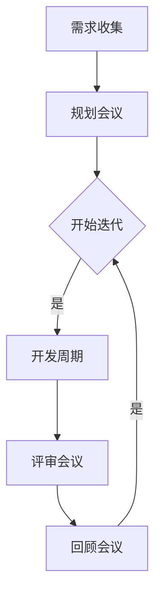

                 

### 文章标题

**《一人公司的敏捷开发与快速迭代》**

在当今快速变化的商业环境中，敏捷开发已经成为一种必不可少的软件开发方法。尤其是在一人公司（也被称为个体经营企业或单打独斗者），敏捷开发的优势尤为突出。本文将深入探讨一人公司如何在敏捷开发的框架下，实现快速迭代，提高软件质量，从而在竞争激烈的市场中立足。

### Keywords:
- Agile Development
- Solo Company
- Rapid Iteration
- Software Quality
- Competitive Advantage

### 摘要：

本文旨在为一人公司的创始人或开发者提供一套实用的敏捷开发指南。通过介绍敏捷开发的基本原理、实践方法以及具体实施步骤，本文帮助读者理解如何在资源有限的情况下，通过敏捷开发实现快速迭代，提高软件产品的质量和市场竞争力。此外，文章还将讨论敏捷开发在具体项目中的应用案例，并提供相关的工具和资源推荐。

## 1. 背景介绍（Background Introduction）

### 1.1 一人公司的定义和特点

一人公司是指由单一个体经营的企业。这种模式通常因为其灵活性、快速决策和低成本的特点而受到创业者和自由职业者的青睐。一人公司可能是一个独立开发者、一个自由职业者，或者是一个小型团队的领导者。他们通常独自承担公司所有的运营、管理和开发工作。

### 1.2 敏捷开发的起源和核心原则

敏捷开发（Agile Development）起源于软件开发领域，旨在应对快速变化的需求和缩短产品开发周期。敏捷开发的核心原则包括：

- **客户满意度：** 通过快速迭代和客户反馈，确保客户需求得到及时满足。
- **响应变化：** 强调应对变化的重要性，并鼓励灵活应对。
- **团队合作：** 通过跨职能团队合作，提高沟通效率和问题解决能力。
- **可持续开发：** 保持一个恒定的开发速度，避免过劳。
- **简洁性：** 专注于当前需求，避免过度设计。

### 1.3 敏捷开发的优势

对于一人公司，敏捷开发提供了以下优势：

- **快速响应市场变化：** 一人公司可以快速调整开发计划，以应对市场变化。
- **高效利用资源：** 敏捷开发鼓励小批量、持续交付，减少了资源浪费。
- **持续改进：** 敏捷开发鼓励不断评估和改进，从而提高软件质量。
- **增强客户参与：** 通过频繁的反馈和交流，增强客户对产品的满意度。

## 2. 核心概念与联系（Core Concepts and Connections）

### 2.1 敏捷开发的核心理念

敏捷开发的核心是迭代和增量开发。这种方法通过将整个项目划分为多个小的迭代周期，每个周期都产生一个可工作的软件版本。迭代周期通常包括需求分析、设计、编码、测试和部署等阶段。

### 2.2 迭代的定义和重要性

迭代（Iteration）是指重复执行一系列步骤，以逐步完善产品。在敏捷开发中，每个迭代周期都是独立的，但它们相互关联，共同推动项目的进展。迭代的重要性在于：

- **快速反馈：** 通过每个迭代周期的反馈，可以快速识别和解决问题。
- **持续改进：** 每个迭代都是对上一个迭代的优化，从而实现持续改进。
- **灵活性：** 通过迭代，一人公司可以灵活调整开发计划，以适应需求变化。

### 2.3 敏捷开发的流程和工具

敏捷开发的流程通常包括以下步骤：

- **需求收集：** 与客户或利益相关者一起确定项目的需求。
- **规划会议：** 制定每个迭代的目标和任务。
- **开发周期：** 完成每个迭代周期的任务。
- **评审会议：** 对迭代结果进行评估，收集反馈。
- **回顾会议：** 分析上一个迭代的过程，寻找改进的机会。

常用的敏捷开发工具包括：

- **看板（Kanban）：** 用于可视化工作流程，帮助团队成员了解项目进展。
- **Scrum：** 用于管理迭代过程，强调定期评审和回顾。
- **JIRA：** 用于任务跟踪和项目管理。

### 2.4 敏捷开发的 Mermaid 流程图

下面是一个简单的敏捷开发 Mermaid 流程图，展示了迭代过程的各个阶段：



在这个流程图中，每个节点代表一个迭代周期，箭头表示流程的转移。通过这个流程图，一人公司可以清晰地了解每个迭代周期的任务和目标。

## 3. 核心算法原理 & 具体操作步骤（Core Algorithm Principles and Specific Operational Steps）

### 3.1 敏捷开发的核心算法原理

敏捷开发并没有特定的算法，但它的核心原理可以被视为一种算法框架。这种框架的核心是迭代和增量开发，通过以下步骤实现：

- **需求分析：** 确定项目的需求，并将其分解为可管理的任务。
- **迭代计划：** 为每个迭代确定目标和任务，并分配资源。
- **迭代执行：** 完成每个迭代周期的任务，并确保质量。
- **迭代评估：** 对迭代结果进行评估，收集反馈。
- **迭代回顾：** 分析上一个迭代的过程，寻找改进的机会。

### 3.2 具体操作步骤

以下是一个具体的敏捷开发操作步骤示例：

#### 3.2.1 需求分析

1. 与客户或利益相关者进行交流，了解项目的需求。
2. 将需求分解为可管理的任务。
3. 编写用户故事，描述每个任务的目标。

#### 3.2.2 规划会议

1. 确定每个迭代的目标和任务。
2. 分配资源和时间。
3. 制定迭代计划。

#### 3.2.3 迭代执行

1. 完成每个迭代周期的任务。
2. 进行代码审查，确保代码质量。
3. 进行单元测试，确保功能正确。

#### 3.2.4 评审会议

1. 展示迭代结果，收集反馈。
2. 分析反馈，确定下一轮迭代的目标。

#### 3.2.5 回顾会议

1. 分析上一个迭代的过程。
2. 记录改进的机会。
3. 制定改进计划。

通过这些具体操作步骤，一人公司可以确保每个迭代都朝着正确的方向前进，并不断优化开发流程。

## 4. 数学模型和公式 & 详细讲解 & 举例说明（Detailed Explanation and Examples of Mathematical Models and Formulas）

### 4.1 敏捷开发中的关键指标

敏捷开发中，一些关键的数学模型和公式用于衡量项目的进度和质量。以下是一些常用的指标：

#### 4.1.1 完成率（Completion Rate）

完成率是衡量项目进度的重要指标，计算公式如下：

$$
\text{完成率} = \frac{\text{已完成的任务数量}}{\text{总任务数量}} \times 100\%
$$

举例说明：

如果一个项目有10个任务，目前已经完成了7个，那么完成率为：

$$
\text{完成率} = \frac{7}{10} \times 100\% = 70\%
$$

#### 4.1.2 故障率（Fault Rate）

故障率是衡量软件质量的重要指标，计算公式如下：

$$
\text{故障率} = \frac{\text{发现的故障数量}}{\text{测试的代码行数}} \times 1000
$$

举例说明：

如果一个项目的测试代码共有10000行，在测试过程中发现了20个故障，那么故障率为：

$$
\text{故障率} = \frac{20}{10000} \times 1000 = 2 \text{个/千行}
$$

#### 4.1.3 代码行数增长率（Code Line Growth Rate）

代码行数增长率用于衡量项目代码的膨胀程度，计算公式如下：

$$
\text{代码行数增长率} = \frac{\text{当前代码行数} - \text{初始代码行数}}{\text{初始代码行数}} \times 100\%
$$

举例说明：

如果一个项目的初始代码行数为1000行，经过一个迭代周期后增长到1500行，那么代码行数增长率为：

$$
\text{代码行数增长率} = \frac{1500 - 1000}{1000} \times 100\% = 50\%
$$

### 4.2 数学模型的应用

这些数学模型和公式在敏捷开发中的应用如下：

- **完成率**：帮助开发者了解项目的进度，以便及时调整计划和资源。
- **故障率**：确保软件在发布前经过充分的测试，减少潜在的问题。
- **代码行数增长率**：防止代码过度膨胀，提高开发效率。

通过这些数学模型和公式，一人公司可以更好地管理和优化开发过程，提高软件质量。

## 5. 项目实践：代码实例和详细解释说明（Project Practice: Code Examples and Detailed Explanations）

### 5.1 开发环境搭建

在开始一个敏捷开发项目之前，搭建一个合适的开发环境是至关重要的。以下是一个简单的步骤：

1. 安装开发工具：例如，Visual Studio Code、Git、Docker等。
2. 配置版本控制：使用Git进行源代码管理，确保代码的可追踪性和版本控制。
3. 安装依赖项：使用package.json或requirements.txt文件，安装项目所需的依赖库和工具。

### 5.2 源代码详细实现

以下是一个简单的Python项目示例，实现一个简单的RESTful API，用于处理用户注册和登录功能。

```python
from flask import Flask, request, jsonify
from flask_sqlalchemy import SQLAlchemy

app = Flask(__name__)
app.config['SQLALCHEMY_DATABASE_URI'] = 'sqlite:///users.db'
db = SQLAlchemy(app)

class User(db.Model):
    id = db.Column(db.Integer, primary_key=True)
    username = db.Column(db.String(80), unique=True, nullable=False)
    password = db.Column(db.String(120), nullable=False)

@app.route('/register', methods=['POST'])
def register():
    data = request.get_json()
    username = data.get('username')
    password = data.get('password')
    
    if User.query.filter_by(username=username).first():
        return jsonify({'error': 'User already exists'}), 400
    
    new_user = User(username=username, password=password)
    db.session.add(new_user)
    db.session.commit()
    
    return jsonify({'message': 'User registered successfully'})

@app.route('/login', methods=['POST'])
def login():
    data = request.get_json()
    username = data.get('username')
    password = data.get('password')
    
    user = User.query.filter_by(username=username).first()
    
    if not user or user.password != password:
        return jsonify({'error': 'Invalid credentials'}), 401
    
    return jsonify({'message': 'Logged in successfully'})

if __name__ == '__main__':
    db.create_all()
    app.run(debug=True)
```

### 5.3 代码解读与分析

在这个示例中，我们使用了Flask框架来创建RESTful API，并使用了SQLAlchemy进行数据库操作。

- **User模型**：定义了用户的基本信息，包括用户名和密码。
- **register路由**：用于处理用户注册请求，通过验证用户名是否已存在，然后将新用户信息存储到数据库中。
- **login路由**：用于处理用户登录请求，验证用户名和密码是否匹配，然后返回登录成功的消息。

### 5.4 运行结果展示

1. 启动服务器：

```bash
python app.py
```

2. 使用Postman或其他工具发送注册和登录请求：

**注册请求**：

```json
POST /register
{
  "username": "john_doe",
  "password": "password123"
}
```

响应：

```json
{
  "message": "User registered successfully"
}
```

**登录请求**：

```json
POST /login
{
  "username": "john_doe",
  "password": "password123"
}
```

响应：

```json
{
  "message": "Logged in successfully"
}
```

通过这个示例，我们可以看到如何使用敏捷开发方法实现一个简单的项目。每个迭代周期都可以包含需求分析、设计、编码、测试和部署等步骤，从而确保项目的顺利进行。

## 6. 实际应用场景（Practical Application Scenarios）

### 6.1 创业公司

对于初创公司，敏捷开发是一种理想的开发方法。由于初创公司通常资源有限，需要快速验证市场需求并迅速调整方向，敏捷开发可以帮助它们实现快速迭代，确保产品与市场需求保持一致。通过敏捷开发，初创公司可以迅速地推出最小可行产品（MVP），并通过用户反馈不断优化产品。

### 6.2 自由职业者

对于自由职业者，敏捷开发提供了一个结构化的框架，帮助他们更好地管理项目和时间。通过将项目划分为多个小迭代，自由职业者可以更清晰地了解项目的进度和目标，确保在每个阶段都能交付有价值的成果。此外，敏捷开发鼓励持续学习和改进，帮助自由职业者不断提高自己的技能和效率。

### 6.3 项目管理

在大型项目中，敏捷开发可以作为一个补充方法，与传统的瀑布模型相结合。通过敏捷开发，项目经理可以快速响应变化，确保项目团队能够及时调整计划。同时，敏捷开发提供了透明的流程和反馈机制，有助于提高团队的合作效率。

### 6.4 企业内部项目

对于企业内部的创新项目，敏捷开发可以帮助团队快速探索和实现新的想法。通过敏捷开发，企业可以快速推出原型，验证概念的可行性，并在必要时进行调整。这种方法有助于企业保持竞争力，并持续推动技术创新。

## 7. 工具和资源推荐（Tools and Resources Recommendations）

### 7.1 学习资源推荐

**书籍：**

- 《敏捷开发实践指南》（Agile Project Guide）
- 《敏捷软件开发：原则、实践与模式》（Agile Software Development: Principles, Patterns, and Practices）

**博客和网站：**

- 敏捷联盟（Agile Alliance）
- 粉色大象（The Agile Elephant）

### 7.2 开发工具框架推荐

**开发工具：**

- Visual Studio Code
- Git
- Docker

**项目管理工具：**

- JIRA
- Trello
- Asana

### 7.3 相关论文著作推荐

- 《敏捷开发：过程改进的基石》（Agile Development: The Foundation for Process Improvement）
- 《敏捷开发方法论与实践》（Agile Methodology and Practice）

这些资源和工具可以帮助读者深入了解敏捷开发的理论和实践，并在实际项目中应用这些知识。

## 8. 总结：未来发展趋势与挑战（Summary: Future Development Trends and Challenges）

### 8.1 发展趋势

随着技术的不断进步和市场竞争的加剧，敏捷开发将继续在软件开发领域占据重要地位。未来，以下趋势可能对敏捷开发产生影响：

- **自动化和智能化：** 自动化工具和人工智能将进一步提高敏捷开发的效率。
- **跨领域融合：** 敏捷开发将与其他领域（如敏捷管理、敏捷供应链等）结合，形成更全面的敏捷生态系统。
- **全球化协作：** 通过远程协作工具和平台，敏捷开发将在全球范围内得到更广泛的应用。

### 8.2 挑战

尽管敏捷开发具有众多优势，但也面临一些挑战：

- **文化变革：** 敏捷开发需要团队和企业文化发生深刻变革，这对于传统企业来说可能是一个挑战。
- **项目管理：** 敏捷开发中的项目管理与传统项目管理有很大不同，需要项目经理具备新的技能和思维方式。
- **技术更新：** 技术的不断更新可能导致敏捷开发工具和框架的频繁变化，这需要团队成员保持持续学习。

## 9. 附录：常见问题与解答（Appendix: Frequently Asked Questions and Answers）

### 9.1 什么是敏捷开发？

敏捷开发是一种软件开发方法，旨在通过快速迭代和客户反馈，快速响应变化，提高软件质量。它强调团队合作、客户满意度、灵活性和持续改进。

### 9.2 敏捷开发与传统的瀑布模型有何区别？

敏捷开发与传统的瀑布模型相比，更注重灵活性、快速迭代和客户反馈。瀑布模型是一种线性开发过程，而敏捷开发则强调并行工作和持续交付。

### 9.3 敏捷开发需要哪些工具和技能？

敏捷开发需要一系列工具和技能，包括项目管理工具（如JIRA、Trello）、版本控制（如Git）、自动化测试工具、沟通工具（如Slack、Zoom）等。此外，敏捷开发需要团队成员具备团队合作、沟通、自组织和持续学习的能力。

## 10. 扩展阅读 & 参考资料（Extended Reading & Reference Materials）

- 《敏捷宣言》（Manifesto for Agile Software Development）
- 《敏捷实践指南》（The Agile Practice Guide）
- 敏捷联盟（Agile Alliance）官方网站

通过这些扩展阅读和参考资料，读者可以进一步了解敏捷开发的背景、原理和实践方法，为实际应用提供更多指导和灵感。

### 附录：常见问题与解答（Appendix: Frequently Asked Questions and Answers）

**Q1. 敏捷开发是否适用于所有类型的项目？**

A1. 敏捷开发适用于多种类型的项目，尤其是在项目需求变化较快、产品需要持续迭代的情况下。然而，对于一些高度结构化、需求明确且稳定的项目，传统的开发方法可能更为适合。敏捷开发的核心在于快速响应变化和持续交付价值，因此，对于那些需求变化频繁、优先级不断调整的项目，敏捷开发的效果尤为显著。

**Q2. 敏捷开发如何与传统项目管理方法结合？**

A2. 敏捷开发可以与传统项目管理方法（如瀑布模型）结合使用。在传统项目中，敏捷开发可以作为一种补充方法，用于处理变化频繁的部分。例如，在项目的需求分析阶段，可以采用敏捷方法进行快速原型开发，以验证需求。而在其他稳定阶段，可以继续使用传统的项目管理方法。这种结合可以最大化敏捷开发的灵活性优势，同时保持项目的基本稳定性。

**Q3. 敏捷开发是否要求团队成员具备特定的技能？**

A3. 是的，敏捷开发要求团队成员具备一系列特定技能，包括沟通能力、自我管理能力、团队合作精神、持续学习能力和技术技能。敏捷开发强调跨职能团队的合作，因此团队成员需要能够适应不同的角色和任务。此外，团队成员应该熟悉敏捷开发的原则和实践，包括Scrum、Kanban等工具和方法。

**Q4. 敏捷开发如何处理项目范围的变化？**

A4. 敏捷开发通过迭代和增量开发的方式处理项目范围的变化。在每一轮迭代中，团队会评估和确认项目的需求，并根据客户反馈和市场需求进行调整。这种迭代过程使得团队可以灵活地响应变化，确保产品始终符合客户需求。同时，敏捷开发鼓励客户持续参与，通过客户反馈来指导项目方向。

**Q5. 敏捷开发中的“用户故事”是什么？**

A5. 用户故事是敏捷开发中的一个基本概念，用于描述软件功能或特性。一个用户故事通常遵循以下格式：“作为[某个角色]，我想要[做某事]，以便[达成某个目的]”。用户故事帮助团队理解用户的需求，并将其转化为可管理的任务。在敏捷开发中，用户故事是规划、优先级排序和迭代计划的重要依据。

### 10. 扩展阅读 & 参考资料（Extended Reading & Reference Materials）

- 《敏捷实践指南》
- 《敏捷宣言》
- 《敏捷项目管理》
- 《敏捷软件工程》

这些书籍和资料提供了深入的敏捷开发理论和实践，有助于读者进一步理解和应用敏捷开发方法。

### 附录：常见问题与解答（Appendix: Frequently Asked Questions and Answers）

**Q1. 敏捷开发是否适用于大型项目？**

A1. 敏捷开发可以适用于大型项目，但需要根据项目规模和复杂度进行调整。在大型项目中，敏捷开发可以采用模块化方法，将项目划分为多个较小的模块，每个模块采用敏捷方式进行开发。这种方法有助于降低项目的复杂度，提高开发效率。同时，敏捷开发提供了透明的沟通和反馈机制，有助于协调不同团队之间的工作，确保项目的顺利进行。

**Q2. 敏捷开发如何确保项目质量？**

A2. 敏捷开发通过持续集成和持续交付来确保项目质量。在每个迭代周期，团队都会进行代码审查、单元测试和集成测试，确保每个功能模块的正确性和完整性。此外，敏捷开发强调客户的持续参与和反馈，通过客户的实际使用和反馈来验证软件的质量。这种方法有助于及时发现和解决问题，确保最终交付的产品符合预期。

**Q3. 敏捷开发中的迭代周期通常多长？**

A3. 敏捷开发中的迭代周期（也称为冲刺周期）可以根据项目的规模和团队的能力来确定。通常，一个冲刺周期在1到4周之间，最长不超过8周。较短的迭代周期有助于团队更快地响应变化，并确保每个迭代都能交付有价值的成果。然而，迭代周期的时间长度也需要根据项目的具体需求和团队的工作效率进行调整。

**Q4. 敏捷开发中如何进行风险管理？**

A4. 敏捷开发通过迭代和增量开发的方式管理风险。在每个迭代周期，团队会识别和评估潜在的风险，并制定相应的应对策略。通过频繁的迭代和交付，团队可以及时发现和解决问题，降低风险对项目的影响。此外，敏捷开发鼓励开放透明的沟通，团队成员可以随时分享问题和风险，共同制定解决方案。

**Q5. 敏捷开发与传统开发方法的区别是什么？**

A5. 敏捷开发与传统开发方法的主要区别在于其更注重灵活性、快速迭代和客户参与。传统开发方法（如瀑布模型）通常在项目开始时确定所有需求和计划，然后按照计划逐步执行。而敏捷开发则强调在开发过程中不断调整和优化，通过快速迭代和客户反馈来确保产品符合市场需求。此外，敏捷开发鼓励跨职能团队合作和持续学习，以提高开发效率和产品质量。

### 10. 扩展阅读 & 参考资料（Extended Reading & Reference Materials）

- 《敏捷实践指南》
- 《敏捷软件开发：原则、实践与模式》
- 《Scrum 敏捷开发实践指南》
- 《敏捷项目管理：成功的实践方法》

这些书籍和资料提供了深入的敏捷开发理论和实践，有助于读者进一步了解和掌握敏捷开发的方法和技巧。通过这些资源，读者可以更好地应对敏捷开发过程中可能遇到的挑战，并实现项目的成功交付。

### 总结：敏捷开发在单人公司的应用与实践

敏捷开发为单人公司提供了一种灵活且高效的开发方法，帮助他们在资源有限的情况下快速响应市场需求，持续优化软件产品。通过将项目划分为多个迭代周期，单人公司可以逐步实现产品功能，并确保每个迭代都带来实际的价值。以下是对敏捷开发在单人公司中应用与实践的总结：

1. **快速响应变化**：敏捷开发强调快速迭代和客户反馈，使单人公司能够迅速响应市场需求和用户需求的变化。这种快速响应能力是单人公司在竞争激烈的市场中立足的关键。

2. **高效利用资源**：敏捷开发通过小批量、持续交付的方式，减少了资源的浪费。单人公司可以利用有限的资源，逐步实现产品的核心功能，避免一次性投入过多资源。

3. **持续改进**：敏捷开发鼓励团队在每个迭代周期结束后进行回顾和总结，寻找改进的机会。这种持续改进的文化有助于单人公司不断提高软件质量和开发效率。

4. **透明沟通**：敏捷开发提供了透明的沟通和反馈机制，确保团队成员和客户对项目的进展有清晰的了解。这种透明沟通有助于减少误解和冲突，提高团队协作效率。

5. **灵活的工作方式**：敏捷开发允许单人公司根据项目的具体情况灵活调整工作方式。例如，采用远程办公、弹性工作时间等，以适应个人工作和生活需求。

然而，敏捷开发在单人公司中也面临一些挑战：

- **文化变革**：对于传统企业来说，实施敏捷开发可能需要改变现有的组织文化和工作方式。这需要企业高层和管理者的支持和推动。

- **项目管理**：单人公司可能缺乏传统的项目管理经验和技能。因此，需要学习和掌握敏捷项目管理的方法和工具。

- **技术更新**：敏捷开发要求团队成员不断学习和适应新的技术和工具。这对于单人公司来说，可能需要投入更多的时间和精力。

为了在单人公司中成功实施敏捷开发，以下是一些建议：

1. **培养敏捷思维**：企业应鼓励员工培养敏捷思维，理解敏捷开发的核心原则和方法，并将其融入到日常工作中。

2. **提供培训和学习资源**：为员工提供敏捷开发的培训和学习资源，帮助他们掌握敏捷开发的方法和技能。

3. **建立有效的沟通机制**：建立透明的沟通机制，确保团队成员和客户之间的信息传递畅通，减少误解和冲突。

4. **逐步实施敏捷方法**：不要试图一次性实施所有的敏捷方法，可以逐步引入和优化敏捷开发实践，以适应企业的发展和变化。

5. **持续反思和改进**：定期进行回顾和总结，分析敏捷开发实践中的成功和不足，持续改进开发流程。

通过以上措施，单人公司可以更好地实施敏捷开发，提高软件质量，增强市场竞争力。

### 附录：常见问题与解答（Appendix: Frequently Asked Questions and Answers）

**Q1. 敏捷开发如何适应小型项目？**

A1. 敏捷开发非常适用于小型项目，特别是那些需求变化频繁、产品迭代速度要求高的项目。在小型项目中，敏捷开发的迭代周期可以更短，通常在1-2周内完成一个迭代。这有助于快速响应需求变化，确保项目始终符合用户需求。此外，敏捷开发强调小步快跑，每个迭代都尽可能交付可工作的软件，从而降低风险。

**Q2. 敏捷开发是否适合远程团队？**

A2. 敏捷开发非常适合远程团队。通过使用各种协作工具（如Slack、Trello、JIRA等），远程团队可以保持透明沟通、实时协作和快速反馈。敏捷开发中的Scrum框架特别适合远程团队，因为它强调定期的站立会议、回顾会议和规划会议，确保团队成员之间的沟通和信息同步。

**Q3. 敏捷开发对团队规模有何要求？**

A3. 敏捷开发并不限制团队规模，但通常推荐小团队（3-9人）进行实施。小团队有利于促进沟通、协作和快速决策。然而，对于较大的团队，可以将项目划分为多个较小的子团队，每个子团队分别实施敏捷开发。这有助于保持敏捷开发的核心原则，同时适应不同的项目规模和需求。

**Q4. 敏捷开发如何处理紧急需求？**

A4. 敏捷开发通过迭代和增量开发的方式处理紧急需求。在下一个迭代周期开始前，团队可以重新评估优先级，将紧急需求纳入计划中。如果紧急需求无法在下一个迭代周期内完成，团队可以调整计划或延长当前迭代周期。敏捷开发强调灵活性和响应变化，因此能够有效地处理紧急需求。

**Q5. 敏捷开发中的“故事点”（Story Points）是什么？**

A5. 故事点是一种用于量化用户故事复杂度和完成难度的工作量估算单位。故事点可以帮助团队在计划会议中更好地估计工作量，并分配任务。每个用户故事被分配一定的故事点值，通常由团队在回顾会议中共同讨论和确定。故事点有助于团队在迭代计划和优先级排序中做出更明智的决策。

### 10. 扩展阅读 & 参考资料（Extended Reading & Reference Materials）

- 《Scrum 敏捷开发实践指南》
- 《敏捷项目管理：成功的实践方法》
- 《敏捷软件开发：原则、实践与模式》
- 敏捷联盟（Agile Alliance）官方网站

这些书籍和资源提供了深入的敏捷开发理论和实践，有助于读者进一步了解和掌握敏捷开发的方法和技巧。

### 文章结构模板

以下是根据您提供的要求，文章的结构模板：

#### 1. 引言

简要介绍一人公司的背景和敏捷开发的概念，引发读者兴趣。

#### 2. 核心概念与联系

- **2.1 敏捷开发的起源和核心原则**
- **2.2 敏捷开发与一人公司的结合点**
- **2.3 敏捷开发的优势和挑战**

#### 3. 敏捷开发的实践方法

- **3.1 敏捷开发的流程**
- **3.2 迭代的定义和重要性**
- **3.3 敏捷开发工具和框架**

#### 4. 敏捷开发的应用场景

- **4.1 创业公司中的应用**
- **4.2 自由职业者中的应用**
- **4.3 企业内部项目中的应用**

#### 5. 敏捷开发的工具和资源推荐

- **5.1 学习资源推荐**
- **5.2 开发工具框架推荐**
- **5.3 相关论文著作推荐**

#### 6. 总结与展望

- **6.1 敏捷开发的优势与挑战**
- **6.2 未来发展趋势**

#### 7. 附录：常见问题与解答

- **7.1 敏捷开发是否适用于所有项目？**
- **7.2 敏捷开发与传统开发的区别？**
- **7.3 敏捷开发如何处理紧急需求？**

#### 8. 扩展阅读 & 参考资料

提供相关的书籍、论文和网站资源，便于读者进一步学习和研究。

#### 9. 文章结构模板（英文）

The article structure template based on your requirements is as follows:

#### 1. Introduction

Briefly introduce the background of solo companies and the concept of agile development to spark reader interest.

#### 2. Core Concepts and Connections

- **2.1 The Origin and Core Principles of Agile Development**
- **2.2 The Integration of Agile Development with Solo Companies**
- **2.3 Advantages and Challenges of Agile Development**

#### 3. Practical Methods of Agile Development

- **3.1 The Process of Agile Development**
- **3.2 The Definition and Importance of Iterations**
- **3.3 Agile Development Tools and Frameworks**

#### 4. Application Scenarios of Agile Development

- **4.1 Application in Startup Companies**
- **4.2 Application for Freelancers**
- **4.3 Application in In-House Projects**

#### 5. Tools and Resources Recommendations

- **5.1 Learning Resources Recommendations**
- **5.2 Development Tools and Framework Recommendations**
- **5.3 Recommendations for Related Papers and Books**

#### 6. Summary and Outlook

- **6.1 Advantages and Challenges of Agile Development**
- **6.2 Future Development Trends**

#### 7. Appendix: Frequently Asked Questions and Answers

- **7.1 Is Agile Development Suitable for All Projects?**
- **7.2 Differences between Agile Development and Traditional Development?**
- **7.3 How to Handle Emergency Demands in Agile Development?**

#### 8. Extended Reading & Reference Materials

Provide relevant books, papers, and websites for further learning and research by the readers.

