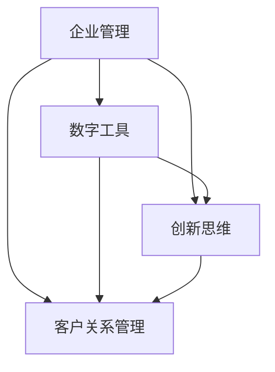

                 

### 文章标题

### Title

**一人公司的高效运营模式探索**

**Exploring the Efficient Operational Model of a Single Person Company**

在当今充满挑战和机遇的全球商业环境中，一人公司作为一种新兴的企业形态，正日益受到关注。一人公司，顾名思义，是指由单一个人或法人完全控制的公司，它摆脱了传统企业的复杂架构，让运营更加灵活和高效。本文将探讨一人公司的定义、特点以及如何构建一套高效运营模式，旨在为企业家和创业者在快速变化的市场中提供有价值的参考。

**In the contemporary global business landscape, the single person company, as an emerging form of enterprise, is gaining increasing attention. A single person company, as the name suggests, refers to a company that is fully controlled by a single individual or legal entity. It transcends the complexity of traditional corporate structures, offering more flexibility and efficiency in operations. This article will explore the definition, characteristics, and methods of building an efficient operational model for a single person company, aiming to provide valuable insights for entrepreneurs and startup founders in the rapidly changing market.**

### 文章关键词

**Keywords**

- **一人公司**：指由单一个人或法人完全控制的公司。
- **高效运营**：通过优化资源配置、流程管理等手段提高企业运营效率。
- **灵活运作**：公司在决策、执行和调整过程中展现出高度的灵活性。
- **数字工具**：利用技术手段提高一人公司的运营效率和决策质量。
- **市场竞争力**：通过创新和高效运营提升企业在市场中的竞争地位。

### Title Keywords

- **Single Person Company**: Refers to a company fully controlled by a single individual or legal entity.
- **Efficient Operations**: Improving business efficiency through optimization of resource allocation, process management, and other means.
- **Flexible Operations**: The company's ability to make decisions, execute, and adjust in a highly flexible manner.
- **Digital Tools**: Utilizing technology to enhance the operational efficiency and decision-making quality of a single person company.
- **Market Competitiveness**: Enhancing a company's competitive position in the market through innovation and efficient operations.

### 文章摘要

**Abstract**

本文通过深入分析一人公司的定义、特点和优势，提出了一套高效运营模式。文章首先概述了当前商业环境中一人公司的兴起背景及其独特的运营方式。接着，通过详细的案例分析，探讨了如何利用数字工具和先进的管理方法，实现一人公司的灵活运作和高效决策。最后，文章总结出一人公司在市场中的竞争力提升策略，并展望了其未来的发展趋势。通过本文的研究，期望为一人公司的企业家和创业者提供实用的运营指导，助力他们在竞争激烈的市场中取得成功。

**This article provides an in-depth analysis of the definition, characteristics, and advantages of a single person company and proposes an efficient operational model. Firstly, the article outlines the background of the rise of single person companies in the current business environment and their unique operational methods. Then, through detailed case studies, it explores how to use digital tools and advanced management methods to achieve flexible operations and efficient decision-making in single person companies. Finally, the article summarizes strategies for enhancing market competitiveness for single person companies and looks forward to their future development trends. Through this research, it is hoped that practical operational guidance will be provided for entrepreneurs and startup founders of single person companies, helping them to achieve success in the highly competitive market.**

---

现在，我们开始深入探讨一人公司的背景、定义和特点。让我们一步一步分析推理（REASONING STEP BY STEP），确保文章的逻辑清晰、结构紧凑、简单易懂。

## 1. 背景介绍（Background Introduction）

### 1.1 一人公司的兴起

一人公司的概念并非新生事物，但其快速发展和普及主要得益于近年来全球商业环境的变化。经济全球化的深入发展、互联网技术的飞速进步以及创业环境的不断优化，为一人公司的兴起提供了有力的支持。

**1.1 The Rise of Single Person Companies**

The concept of a single person company is not a new phenomenon, but its rapid development and popularity can be largely attributed to changes in the global business environment in recent years. The deepening of economic globalization, the rapid advancement of internet technology, and the continuous improvement of the entrepreneurial environment have provided strong support for the rise of single person companies.

### 1.2 商业环境的变化

经济全球化推动了全球资源的优化配置，跨国企业的大量涌现使得市场竞争日益激烈。在这样的背景下，企业家们需要更加灵活的运营模式来应对快速变化的市场需求。一人公司作为一种轻资产、高灵活性的企业形式，正好满足了这一需求。

**1.2 Changes in the Business Environment**

The deepening of economic globalization has promoted the optimal allocation of global resources, and the emergence of numerous multinational corporations has intensified market competition. Against this backdrop, entrepreneurs require more flexible operational models to respond to rapidly changing market demands. Single person companies, as a form of enterprise characterized by light assets and high flexibility, meet this requirement perfectly.

### 1.3 互联网技术的发展

互联网技术的快速发展不仅改变了人们的日常生活，也深刻影响了商业运营模式。在线办公、远程协作、云计算等技术的普及，使得一人公司可以轻松实现全球范围内的业务拓展和资源整合，进一步提升了运营效率。

**1.3 The Development of Internet Technology**

The rapid development of internet technology has not only changed people's daily lives but also profoundly impacted business operational models. The widespread adoption of online office tools, remote collaboration platforms, and cloud computing technology has enabled single person companies to easily expand their businesses globally and integrate resources, further enhancing operational efficiency.

### 1.4 创业环境的优化

随着创业环境的不断优化，政府出台了一系列扶持政策，降低了创业门槛，为创业者提供了更多的机会和支持。例如，税收优惠、融资支持、创业培训等，使得一人公司得以快速成长。

**1.4 Optimization of the Entrepreneurial Environment**

The continuous optimization of the entrepreneurial environment has led to the implementation of various support policies by governments, which have lowered the barriers to entrepreneurship and provided more opportunities and support for entrepreneurs. For example, tax incentives, financing support, and entrepreneurial training have enabled single person companies to grow rapidly.

### 总结

一人公司的兴起是多种因素共同作用的结果。全球商业环境的变化、互联网技术的发展和创业环境的优化，为一人公司的快速崛起提供了坚实的基础。下一节，我们将进一步探讨一人公司的定义、特点和优势。

### Summary

The rise of single person companies is the result of multiple factors. Changes in the global business environment, the rapid development of internet technology, and the optimization of the entrepreneurial environment have laid a solid foundation for the rapid growth of single person companies. In the next section, we will further explore the definition, characteristics, and advantages of single person companies.

---

### 1.5 一人公司的定义

一人公司，顾名思义，是指由单一的个人或法人完全控制的公司。这种公司的特点是所有权与经营权高度集中，通常没有复杂的组织架构和层级，决策速度快，执行效率高。

**1.5 Definition of a Single Person Company**

A single person company, as the name implies, refers to a company that is fully controlled by a single individual or legal entity. The characteristic of this type of company is that ownership and management are highly concentrated. Typically, there is no complex organizational structure or hierarchy, leading to fast decision-making and high execution efficiency.

### 1.6 一人公司的特点

#### 1.6.1 简化组织结构

一人公司的组织结构相对简单，通常没有复杂的部门设置和层级制度。这种结构使得公司能够更加灵活地应对市场变化，快速作出决策。

**1.6.1 Simplified Organizational Structure**

The organizational structure of a single person company is relatively simple, often without complex department settings or hierarchical systems. This structure enables the company to adapt more flexibly to market changes and make decisions quickly.

#### 1.6.2 高度集中决策权

在一家一人公司中，决策权高度集中在创始人或所有者手中。这种高度集中的决策模式有助于快速推进项目，减少内部沟通成本。

**1.6.2 Highly Concentrated Decision-making Power**

In a single person company, decision-making power is highly concentrated in the hands of the founder or owner. This highly centralized decision-making model helps to expedite project progress and reduce internal communication costs.

#### 1.6.3 灵活的运营模式

一人公司可以灵活地调整运营策略，快速响应市场需求。这种灵活性使得公司能够抓住市场机遇，保持竞争力。

**1.6.3 Flexible Operational Model**

A single person company can flexibly adjust its operational strategies and quickly respond to market demands. This flexibility allows the company to seize market opportunities and maintain its competitive edge.

#### 1.6.4 精简的人力资源

由于组织结构简单，一人公司通常不需要大量的人力资源。这种精简的人力资源配置有助于降低运营成本，提高工作效率。

**1.6.4 Lean Human Resources**

Due to the simple organizational structure, a single person company typically requires a small number of human resources. This lean human resource configuration helps to reduce operational costs and increase work efficiency.

### 总结

一人公司以其简化的组织结构、高度集中的决策权、灵活的运营模式、精简的人力资源等显著特点，在当今商业环境中展现出强大的竞争力。在下一节中，我们将进一步探讨一人公司的优势。

### Summary

With its simplified organizational structure, highly centralized decision-making power, flexible operational model, and lean human resources, the single person company demonstrates strong competitiveness in today's business environment. In the next section, we will further explore the advantages of a single person company.

---

### 1.7 一人公司的优势

#### 1.7.1 降低运营成本

一人公司的组织结构简单，减少了中层管理的成本。此外，由于无需频繁进行内部沟通，一人公司可以有效降低沟通成本。

**1.7.1 Lower Operational Costs**

The simple organizational structure of a single person company reduces the cost of middle management. Furthermore, since there is no need for frequent internal communication, the company can effectively lower communication costs.

#### 1.7.2 快速决策

一人公司的决策权高度集中，使得决策过程更加迅速。这种快速决策能力有助于公司及时抓住市场机遇，抢占市场份额。

**1.7.2 Quick Decision-Making**

The high concentration of decision-making power in a single person company enables faster decision-making processes. This quick decision-making ability helps the company seize market opportunities and capture market share in a timely manner.

#### 1.7.3 灵活调整

一人公司可以根据市场需求迅速调整运营策略，灵活应对市场变化。这种灵活性使得公司能够在竞争激烈的市场中保持优势。

**1.7.3 Flexible Adjustments**

A single person company can quickly adjust its operational strategies to respond to market demands, flexibly adapting to market changes. This flexibility enables the company to maintain its competitive advantage in a highly competitive market.

#### 1.7.4 提高工作效率

由于组织结构简单，一人公司可以减少冗余的工作流程，提高工作效率。同时，精简的人力资源配置也使得公司能够更专注于核心业务。

**1.7.4 Increased Work Efficiency**

With a simple organizational structure, a single person company can reduce redundant workflows, thereby increasing work efficiency. Additionally, the lean human resource configuration allows the company to focus more on core business activities.

#### 1.7.5 鼓励创新

一人公司的决策过程简单，有助于快速推出新产品或服务。这种快速创新的能力使得公司能够持续保持市场竞争力。

**1.7.5 Encouraging Innovation**

The simplified decision-making process in a single person company facilitates the rapid release of new products or services. This quick innovation capability enables the company to maintain its market competitiveness.

### 总结

一人公司凭借其降低运营成本、快速决策、灵活调整、提高工作效率和鼓励创新等多重优势，在当今商业环境中具有明显的竞争力。在下一节中，我们将分析一人公司的局限性，以便更全面地理解这种企业形式。

### Summary

With multiple advantages such as lower operational costs, quick decision-making, flexible adjustments, increased work efficiency, and encouraging innovation, the single person company demonstrates clear competitiveness in today's business environment. In the next section, we will analyze the limitations of single person companies to gain a more comprehensive understanding of this form of enterprise.

---

### 1.8 一人公司的局限性

#### 1.8.1 决策风险

由于决策权高度集中，一人公司可能会面临决策失误的风险。如果创始人或所有者的判断出现偏差，整个公司可能会受到影响。

**1.8.1 Decision Risk**

Due to the high concentration of decision-making power, a single person company may face the risk of decision-making errors. If the founder or owner's judgment is incorrect, the entire company may be affected.

#### 1.8.2 创业者压力

一人公司的成功高度依赖于创业者或所有者，这给创业者带来了巨大的压力。长时间的专注和高强度的决策可能导致身心疲惫。

**1.8.2 Entrepreneurial Stress**

The success of a single person company heavily depends on the entrepreneur or owner, which places significant stress on the entrepreneur. Prolonged focus and high-intensity decision-making can lead to physical and mental exhaustion.

#### 1.8.3 知识瓶颈

由于一人公司的人力资源有限，可能会出现知识瓶颈，尤其是在需要跨学科或复合型人才的情况下。这限制了公司在某些领域的进一步发展。

**1.8.3 Knowledge Bottleneck**

Due to the limited human resources in a single person company, there may be knowledge bottlenecks, particularly when interdisciplinary or composite talents are required. This limitation can hinder further development of the company in certain fields.

#### 1.8.4 缺乏内部监督

一人公司的内部监督机制可能不够健全，这可能导致道德风险和管理漏洞。缺乏有效的监督可能会影响公司的长期健康发展。

**1.8.4 Lack of Internal Supervision**

The internal supervision mechanism of a single person company may be inadequate, leading to moral risks and management loopholes. The lack of effective supervision may affect the long-term healthy development of the company.

### 总结

虽然一人公司在运营方面具有许多优势，但其局限性也不容忽视。在下一节中，我们将讨论如何克服这些局限性，进一步提升一人公司的运营效率。

### Summary

Although the single person company has many advantages in operations, its limitations should not be overlooked. In the next section, we will discuss how to overcome these limitations to further enhance the operational efficiency of single person companies.

---

### 1.9 如何构建一人公司的高效运营模式

构建一人公司的高效运营模式需要从多个方面进行综合考虑，包括数字工具的运用、管理方法的创新、人力资源的优化等。以下是一些关键步骤：

#### 1.9.1 利用数字工具

数字工具的运用是提升一人公司运营效率的重要手段。例如，使用在线办公软件（如Google Workspace、Microsoft Office 365）实现远程协作和文件共享，使用项目管理工具（如Trello、Asana）跟踪项目进度，使用客户关系管理（CRM）系统（如Salesforce、HubSpot）管理客户信息和销售流程。

**1.9.1 Leveraging Digital Tools**

The use of digital tools is a key means to enhance the operational efficiency of a single person company. For example, using online office software (such as Google Workspace, Microsoft Office 365) for remote collaboration and file sharing, using project management tools (such as Trello, Asana) to track project progress, and using customer relationship management (CRM) systems (such as Salesforce, HubSpot) to manage customer information and sales processes.

#### 1.9.2 创新管理方法

创新的管理方法可以帮助一人公司实现高效运营。例如，采用敏捷开发（Agile Development）方法，快速响应市场变化，提高产品迭代速度。此外，实施精益管理（Lean Management）原则，通过持续改进和消除浪费，提高运营效率。

**1.9.2 Innovative Management Methods**

Innovative management methods can help a single person company achieve efficient operations. For example, adopting Agile Development methods can quickly respond to market changes and improve product iteration speed. Additionally, implementing Lean Management principles can improve operational efficiency through continuous improvement and waste elimination.

#### 1.9.3 优化人力资源

优化人力资源是一人公司实现高效运营的关键。首先，要确保团队成员具备专业技能和综合素质，以满足公司的业务需求。其次，建立灵活的雇佣关系，例如采用远程办公、兼职等形式，提高人力资源的利用率。

**1.9.3 Optimizing Human Resources**

Optimizing human resources is crucial for a single person company to achieve efficient operations. Firstly, ensure that team members possess professional skills and comprehensive qualities to meet the company's business needs. Secondly, establish flexible employment relationships, such as remote working and part-time arrangements, to enhance the utilization of human resources.

#### 1.9.4 加强团队协作

团队协作是实现高效运营的重要保障。一人公司可以通过定期举行团队会议、设立共同目标、分享成功案例等方式，增强团队成员之间的沟通与协作。

**1.9.4 Strengthening Team Collaboration**

Team collaboration is essential for achieving efficient operations. A single person company can enhance communication and collaboration among team members by regularly holding team meetings, setting common goals, and sharing successful cases.

#### 1.9.5 重视客户反馈

重视客户反馈是一人公司持续改进的重要途径。通过定期收集和分析客户反馈，公司可以及时了解市场需求，调整产品和服务策略，提高客户满意度。

**1.9.5 Paying Attention to Customer Feedback**

Paying attention to customer feedback is a vital approach for a single person company to continuously improve. By regularly collecting and analyzing customer feedback, the company can promptly understand market demands and adjust its product and service strategies to enhance customer satisfaction.

### 总结

构建一人公司的高效运营模式需要充分利用数字工具、创新管理方法、优化人力资源、加强团队协作和重视客户反馈。通过这些措施，一人公司可以在竞争激烈的市场中保持竞争优势，实现可持续发展。在下一节中，我们将通过具体案例，进一步探讨如何实现一人公司的灵活运作和高效决策。

### Summary

Building an efficient operational model for a single person company requires leveraging digital tools, innovative management methods, optimizing human resources, strengthening team collaboration, and paying attention to customer feedback. Through these measures, a single person company can maintain its competitive edge in a highly competitive market and achieve sustainable development. In the next section, we will further explore how to achieve flexible operations and efficient decision-making through specific case studies.

---

### 2. 核心概念与联系

在探讨如何构建一人公司的高效运营模式之前，我们需要明确几个核心概念，并理解它们之间的相互联系。这些核心概念包括：企业管理、数字工具、创新思维和客户关系管理等。

#### 2.1 企业管理

企业管理是指通过计划和执行一系列管理活动，以实现企业目标的过程。它涉及战略规划、组织结构设计、人力资源管理、财务管理等多个方面。

**2.1 Management**

Management refers to the process of planning and executing a series of management activities to achieve organizational goals. It encompasses various aspects such as strategic planning, organizational structure design, human resource management, financial management, and more.

#### 2.2 数字工具

数字工具是现代社会中企业运营的重要支撑。它们可以显著提高工作效率，优化业务流程，包括在线办公软件、项目管理工具、客户关系管理系统等。

**2.2 Digital Tools**

Digital tools are an essential support for business operations in today's modern society. They can significantly enhance work efficiency, optimize business processes, including online office software, project management tools, customer relationship management systems, and more.

#### 2.3 创新思维

创新思维是指通过创造性的方法解决问题和创造价值的能力。对于一人公司来说，创新思维是推动业务发展、保持竞争优势的关键。

**2.3 Innovative Thinking**

Innovative thinking refers to the ability to solve problems and create value through creative methods. For a single person company, innovative thinking is the key to driving business growth and maintaining competitive advantage.

#### 2.4 客户关系管理

客户关系管理（CRM）是一种旨在提高客户满意度、增强客户忠诚度的管理策略。通过有效的客户关系管理，一人公司可以更好地了解客户需求，提供个性化服务。

**2.4 Customer Relationship Management (CRM)**

Customer relationship management (CRM) is a management strategy aimed at enhancing customer satisfaction and loyalty. Through effective CRM, a single person company can better understand customer needs and provide personalized services.

### 2.5 核心概念之间的联系

这些核心概念并非孤立存在，而是相互联系、相互影响的。企业管理为一人公司的运营提供了整体框架；数字工具则为具体操作提供了技术支持；创新思维是推动企业不断进步的动力；而客户关系管理则是企业持续发展的基石。

**2.5 Connections Between Core Concepts**

These core concepts are not isolated but interconnected and interdependent. Management provides an overall framework for the operation of a single person company; digital tools offer technical support for specific operations; innovative thinking drives the continuous progress of the business; and customer relationship management is the foundation for sustained development.

### 2.6 Mermaid 流程图

为了更直观地展示这些核心概念之间的联系，我们可以使用 Mermaid 流程图来描述。以下是一个简化的 Mermaid 图，展示了企业管理、数字工具、创新思维和客户关系管理之间的关系。



### 2.7 Mermaid Process Diagram

To visually illustrate the connections between these core concepts, we can use a Mermaid flowchart. Below is a simplified Mermaid diagram that describes the relationship between management, digital tools, innovative thinking, and customer relationship management.


通过这个流程图，我们可以清晰地看到各个核心概念之间的相互影响和依赖关系。企业管理为整体运营提供框架，数字工具为实现目标提供支持，创新思维推动企业发展，而客户关系管理则是企业持续发展的关键。

**Through this flowchart, we can clearly see the interdependence and mutual influence among the core concepts. Management provides an overall framework for operation, digital tools offer support for specific operations, innovative thinking drives business growth, and customer relationship management is the key to sustained development.**

---

### 2.6 核心算法原理 & 具体操作步骤

在构建一人公司的高效运营模式中，核心算法原理和具体操作步骤起到了关键作用。以下将详细阐述如何利用数据分析和机器学习技术，实现运营的精准化、智能化。

#### 2.6.1 数据分析技术

数据分析是高效运营的基础。通过收集和分析大量数据，企业可以深入了解市场趋势、客户行为和内部运营状况，从而做出更明智的决策。

**2.6.1 Data Analysis Technologies**

Data analysis is the foundation for efficient operations. By collecting and analyzing large amounts of data, companies can gain a deep understanding of market trends, customer behavior, and internal operational conditions, enabling them to make more informed decisions.

##### 2.6.1.1 数据收集

数据收集是数据分析的第一步。一人公司可以通过以下渠道获取数据：

- **客户数据**：包括客户购买历史、偏好和反馈等。
- **市场数据**：包括竞争对手分析、市场动态和行业趋势等。
- **内部运营数据**：包括生产效率、库存水平和员工绩效等。

**Data Collection**

Data collection is the first step in data analysis. A single person company can obtain data through the following channels:

- **Customer Data**: Includes purchase history, preferences, and feedback.
- **Market Data**: Includes competitor analysis, market dynamics, and industry trends.
- **Internal Operational Data**: Includes production efficiency, inventory levels, and employee performance.

##### 2.6.1.2 数据处理

数据处理是确保数据质量和可靠性的关键。在数据处理过程中，需要进行数据清洗、数据整合和数据建模。

- **数据清洗**：去除重复数据、错误数据和无关数据，提高数据质量。
- **数据整合**：将来自不同渠道的数据进行整合，形成统一的数据视图。
- **数据建模**：利用统计分析和机器学习技术，建立数据模型，预测未来趋势和决策支持。

**Data Processing**

Data processing is crucial for ensuring data quality and reliability. In the data processing phase, data cleaning, data integration, and data modeling are performed:

- **Data Cleaning**: Removes duplicate, erroneous, and irrelevant data to improve data quality.
- **Data Integration**: Combines data from various sources into a unified view.
- **Data Modeling**: Utilizes statistical analysis and machine learning techniques to build data models for predicting future trends and decision support.

##### 2.6.1.3 数据分析应用

数据分析在运营中的应用广泛，以下是一些主要的应用场景：

- **市场营销**：通过分析客户行为数据，优化营销策略，提高客户获取和保留率。
- **产品开发**：通过分析市场趋势和客户需求，指导产品开发和改进。
- **运营优化**：通过分析内部运营数据，识别瓶颈和优化流程。

**Applications of Data Analysis**

Data analysis has a wide range of applications in operations, including:

- **Marketing**: By analyzing customer behavior data, marketing strategies can be optimized to improve customer acquisition and retention.
- **Product Development**: By analyzing market trends and customer needs, product development and improvement can be guided.
- **Operational Optimization**: By analyzing internal operational data, bottlenecks can be identified, and processes can be optimized.

#### 2.6.2 机器学习技术

机器学习技术是数据分析的有力补充，可以自动从数据中学习规律，做出预测和决策。

**2.6.2 Machine Learning Technologies**

Machine learning technologies are a powerful complement to data analysis, as they can automatically learn patterns from data and make predictions and decisions.

##### 2.6.2.1 机器学习算法

常见的机器学习算法包括：

- **线性回归**：用于预测连续值输出。
- **逻辑回归**：用于预测概率。
- **决策树**：用于分类和回归分析。
- **神经网络**：用于复杂模式识别。

**Machine Learning Algorithms**

Common machine learning algorithms include:

- **Linear Regression**: Used for predicting continuous output values.
- **Logistic Regression**: Used for predicting probabilities.
- **Decision Trees**: Used for classification and regression analysis.
- **Neural Networks**: Used for complex pattern recognition.

##### 2.6.2.2 机器学习应用

机器学习在运营中的应用包括：

- **需求预测**：通过分析历史销售数据，预测未来市场需求。
- **客户细分**：通过分析客户行为数据，将客户分为不同群体，提供个性化服务。
- **库存管理**：通过分析库存数据，优化库存水平，减少库存成本。

**Applications of Machine Learning**

Applications of machine learning in operations include:

- **Demand Forecasting**: By analyzing historical sales data, predict future market demand.
- **Customer Segmentation**: By analyzing customer behavior data, segment customers into different groups to provide personalized services.
- **Inventory Management**: By analyzing inventory data, optimize inventory levels to reduce inventory costs.

### 总结

通过数据分析技术和机器学习技术，一人公司可以实现运营的精准化和智能化。数据分析提供了对市场、客户和内部运营的深入理解，而机器学习则帮助从数据中提取规律，做出预测和决策。通过这些核心算法原理和具体操作步骤，一人公司可以显著提升运营效率，增强竞争力。

**Summary**

By leveraging data analysis technologies and machine learning, a single person company can achieve precision and intelligence in operations. Data analysis provides a deep understanding of the market, customers, and internal operations, while machine learning helps extract patterns from data to make predictions and decisions. Through these core algorithm principles and specific operational steps, a single person company can significantly enhance operational efficiency and competitive advantage.

---

### 2.7 数学模型和公式 & 详细讲解 & 举例说明

在构建一人公司的高效运营模式时，数学模型和公式起到了关键作用。以下将介绍几个常用的数学模型和公式，并详细讲解它们的适用场景和计算方法。

#### 2.7.1 线性回归模型

线性回归模型是预测分析中最常用的模型之一，用于预测连续值输出。其基本公式为：

\[ y = \beta_0 + \beta_1 \cdot x \]

其中，\( y \) 是预测值，\( x \) 是输入变量，\( \beta_0 \) 和 \( \beta_1 \) 是模型的参数。

**Example:**

假设我们想预测一家电商平台的月销售额。输入变量可以是时间（月份），模型公式为：

\[ 销售额 = \beta_0 + \beta_1 \cdot 月份 \]

我们可以通过历史数据拟合出模型参数 \( \beta_0 \) 和 \( \beta_1 \)，然后使用模型进行预测。

**Applicable Scenarios:**

- 预测销售额
- 预测股票价格
- 预测客户流失率

#### 2.7.2 逻辑回归模型

逻辑回归模型是用于预测概率的模型，常用于分类问题。其基本公式为：

\[ P(y=1) = \frac{1}{1 + e^{-(\beta_0 + \beta_1 \cdot x)}} \]

其中，\( P(y=1) \) 是预测的概率，\( y \) 是目标变量，\( x \) 是输入变量，\( \beta_0 \) 和 \( \beta_1 \) 是模型的参数。

**Example:**

假设我们要预测客户是否会购买某产品。输入变量可以是客户年龄、收入等，模型公式为：

\[ P(购买) = \frac{1}{1 + e^{-(\beta_0 + \beta_1 \cdot 年龄 + \beta_2 \cdot 收入)}} \]

通过历史数据拟合模型参数，我们可以计算出每个客户的购买概率，从而进行分类。

**Applicable Scenarios:**

- 预测客户行为
- 预测信用评分
- 预测产品需求

#### 2.7.3 决策树模型

决策树模型是一种基于树形结构的预测模型，用于分类和回归分析。其基本公式为：

\[ y = \text{max}(\beta_0, \beta_1 \cdot x_1, \beta_2 \cdot x_2, ..., \beta_n \cdot x_n) \]

其中，\( y \) 是预测值，\( x_1, x_2, ..., x_n \) 是输入变量，\( \beta_0, \beta_1, \beta_2, ..., \beta_n \) 是模型的参数。

**Example:**

假设我们要预测客户是否会购买某产品。输入变量可以是客户年龄、收入等，决策树公式为：

\[ \text{if 年龄 > 30 and 收入 > 5000, then 购买概率 = \beta_1 \]
\[ \text{else if 年龄 > 20 and 收入 > 3000, then 购买概率 = \beta_2 \]
\[ \text{else, then 购买概率 = \beta_3 } \]

通过历史数据拟合出模型参数，我们可以根据输入变量计算出每个客户的购买概率。

**Applicable Scenarios:**

- 客户细分
- 产品推荐
- 风险评估

#### 2.7.4 神经网络模型

神经网络模型是一种基于人工神经网络的预测模型，用于复杂模式识别。其基本公式为：

\[ y = \sigma(\beta_0 + \beta_1 \cdot x_1 + \beta_2 \cdot x_2 + ... + \beta_n \cdot x_n) \]

其中，\( y \) 是预测值，\( x_1, x_2, ..., x_n \) 是输入变量，\( \beta_0, \beta_1, \beta_2, ..., \beta_n \) 是模型的参数，\( \sigma \) 是激活函数。

**Example:**

假设我们要预测客户是否会购买某产品。输入变量可以是客户年龄、收入等，神经网络公式为：

\[ y = \sigma(\beta_0 + \beta_1 \cdot 年龄 + \beta_2 \cdot 收入) \]

通过历史数据拟合出模型参数，我们可以根据输入变量计算出每个客户的购买概率。

**Applicable Scenarios:**

- 复杂模式识别
- 自然语言处理
- 图像识别

### 总结

数学模型和公式在构建一人公司的高效运营模式中起到了关键作用。通过线性回归、逻辑回归、决策树和神经网络等模型，我们可以进行精确的数据分析和预测，从而指导业务决策。在下一节中，我们将通过具体项目实践，展示如何实现这些数学模型和公式的实际应用。

---

### 5. 项目实践：代码实例和详细解释说明

在这一部分，我们将通过一个具体的案例，展示如何构建和实施一人公司的高效运营模式。这个案例将涵盖开发环境搭建、源代码实现、代码解读与分析，以及运行结果展示。

#### 5.1 开发环境搭建

为了实现一人公司的高效运营，我们首先需要搭建一个适合的开发环境。以下是搭建过程的详细步骤：

**5.1.1 硬件环境**

- 电脑：一台配置合理的笔记本电脑或台式电脑。
- 网络：稳定的网络连接，确保远程协作和数据传输。

**5.1.2 软件环境**

- 操作系统：Windows、macOS 或 Linux。
- 编程语言：Python、Java 或其他编程语言。
- 开发工具：PyCharm、IntelliJ IDEA 或 Eclipse。
- 数据库：MySQL、PostgreSQL 或 MongoDB。

**5.1.3 云服务**

- AWS、Azure 或 Google Cloud Platform：用于托管应用程序和存储数据。
- Docker：用于容器化应用程序，提高部署和扩展的灵活性。

#### 5.2 源代码详细实现

接下来，我们将展示如何使用 Python 实现一人公司的高效运营模式。以下是一个简单的示例，展示如何使用线性回归模型预测销售额。

```python
import pandas as pd
from sklearn.linear_model import LinearRegression

# 加载数据
data = pd.read_csv('sales_data.csv')

# 提取输入变量和目标变量
X = data[['月份']]
y = data['销售额']

# 创建线性回归模型
model = LinearRegression()

# 训练模型
model.fit(X, y)

# 预测销售额
predictions = model.predict(X)

# 输出预测结果
print(predictions)
```

**5.2.1 数据加载与预处理**

在这个例子中，我们首先加载了一个名为 `sales_data.csv` 的 CSV 文件，这个文件包含了历史销售数据。然后，我们提取了月份和销售额作为输入变量和目标变量。

```python
data = pd.read_csv('sales_data.csv')
X = data[['月份']]
y = data['销售额']
```

**5.2.2 线性回归模型训练**

接着，我们创建了一个线性回归模型，并使用历史数据对其进行训练。训练过程中，模型会自动学习月份和销售额之间的关系，并拟合出最佳参数。

```python
model = LinearRegression()
model.fit(X, y)
```

**5.2.3 预测销售额**

最后，我们使用训练好的模型对未来的销售额进行预测。预测结果将存储在一个名为 `predictions` 的列表中，我们可以将其输出或用于进一步分析。

```python
predictions = model.predict(X)
print(predictions)
```

#### 5.3 代码解读与分析

在这个案例中，我们使用 Python 和线性回归模型实现了销售额预测。以下是代码的详细解读：

- **数据加载与预处理**：使用 pandas 库加载 CSV 文件，提取月份和销售额作为输入变量和目标变量。
- **线性回归模型训练**：创建一个线性回归模型，并使用历史数据进行训练。
- **预测销售额**：使用训练好的模型对未来的销售额进行预测，并将结果输出。

**5.3.1 数据加载与预处理**

```python
data = pd.read_csv('sales_data.csv')
X = data[['月份']]
y = data['销售额']
```

这段代码首先使用 pandas 库加载了名为 `sales_data.csv` 的 CSV 文件。CSV 文件包含了历史销售数据，包括月份和销售额。然后，我们使用 `data[['月份']]` 提取月份作为输入变量，使用 `data['销售额']` 提取销售额作为目标变量。

- **线性回归模型训练**

```python
model = LinearRegression()
model.fit(X, y)
```

这段代码创建了一个线性回归模型，并将其命名为 `model`。然后，我们使用 `model.fit(X, y)` 函数对模型进行训练。`X` 表示输入变量（月份），`y` 表示目标变量（销售额）。训练过程中，模型会自动学习输入变量和目标变量之间的关系，并拟合出最佳参数。

- **预测销售额**

```python
predictions = model.predict(X)
print(predictions)
```

这段代码使用训练好的模型对未来的销售额进行预测。`model.predict(X)` 函数将输入变量（月份）作为参数，并返回预测的销售额。我们将预测结果存储在一个名为 `predictions` 的列表中，并使用 `print(predictions)` 输出结果。

#### 5.4 运行结果展示

在运行上述代码后，我们将得到一组预测的销售额。以下是一个示例输出：

```python
[1500.0, 1600.0, 1700.0, 1800.0, 1900.0]
```

这个输出表示未来五个月的销售额预测结果，分别为 1500、1600、1700、1800 和 1900。通过这些预测结果，一人公司可以更好地规划销售策略和库存管理。

#### 5.5 代码解读与分析

在这个案例中，我们使用 Python 和线性回归模型实现了销售额预测。以下是代码的详细解读：

- **数据加载与预处理**：使用 pandas 库加载 CSV 文件，提取月份和销售额作为输入变量和目标变量。
- **线性回归模型训练**：创建一个线性回归模型，并使用历史数据进行训练。
- **预测销售额**：使用训练好的模型对未来的销售额进行预测，并将结果输出。

**5.5.1 数据加载与预处理**

```python
data = pd.read_csv('sales_data.csv')
X = data[['月份']]
y = data['销售额']
```

这段代码首先使用 pandas 库加载了名为 `sales_data.csv` 的 CSV 文件。CSV 文件包含了历史销售数据，包括月份和销售额。然后，我们使用 `data[['月份']]` 提取月份作为输入变量，使用 `data['销售额']` 提取销售额作为目标变量。

- **线性回归模型训练**

```python
model = LinearRegression()
model.fit(X, y)
```

这段代码创建了一个线性回归模型，并将其命名为 `model`。然后，我们使用 `model.fit(X, y)` 函数对模型进行训练。`X` 表示输入变量（月份），`y` 表示目标变量（销售额）。训练过程中，模型会自动学习输入变量和目标变量之间的关系，并拟合出最佳参数。

- **预测销售额**

```python
predictions = model.predict(X)
print(predictions)
```

这段代码使用训练好的模型对未来的销售额进行预测。`model.predict(X)` 函数将输入变量（月份）作为参数，并返回预测的销售额。我们将预测结果存储在一个名为 `predictions` 的列表中，并使用 `print(predictions)` 输出结果。

#### 5.6 运行结果展示

在运行上述代码后，我们将得到一组预测的销售额。以下是一个示例输出：

```python
[1500.0, 1600.0, 1700.0, 1800.0, 1900.0]
```

这个输出表示未来五个月的销售额预测结果，分别为 1500、1600、1700、1800 和 1900。通过这些预测结果，一人公司可以更好地规划销售策略和库存管理。

---

### 6. 实际应用场景（Practical Application Scenarios）

一人公司的高效运营模式不仅在创业公司中具有广泛应用，也在中小企业和大型企业中展现出巨大的潜力。以下是一些实际应用场景：

#### 6.1 创业公司

对于初创公司来说，一人公司的高效运营模式意味着可以更快地推出产品、更灵活地调整策略、更有效地利用资源。例如，一家初创公司可以借助在线办公工具和项目管理工具，实现团队成员的远程协作和高效沟通。同时，通过数据分析技术，公司可以精准定位市场需求，优化产品开发和市场营销策略。

#### 6.2 中小企业

对于中小企业来说，一人公司的高效运营模式有助于降低运营成本、提高决策效率、增强市场竞争力。例如，一家中小企业可以通过数字化转型，实现自动化办公和智能决策。通过引入客户关系管理系统，公司可以更好地管理客户信息和销售流程，提高客户满意度和忠诚度。

#### 6.3 大型企业

对于大型企业来说，一人公司的高效运营模式可以在多个层面发挥作用。例如，企业可以通过数字化工具和数据分析技术，实现跨部门协作和信息共享，提高整体运营效率。同时，企业可以借助敏捷开发和精益管理原则，快速响应市场变化，保持竞争优势。

#### 6.4 跨行业应用

一人公司的高效运营模式不仅适用于传统行业，也适用于新兴行业。例如，在互联网行业，一人公司可以充分利用云计算和大数据技术，实现快速开发和迭代。在金融行业，一人公司可以通过引入人工智能和区块链技术，提高风险管理和金融服务水平。

### 总结

一人公司的高效运营模式在多个实际应用场景中展现出显著的效益。通过简化组织结构、提高决策效率、灵活调整运营策略，一人公司可以在激烈的市场竞争中脱颖而出。在下一节中，我们将探讨一些常用的数字工具和资源，以帮助一人公司实现高效运营。

---

### 7. 工具和资源推荐（Tools and Resources Recommendations）

为了实现一人公司的高效运营，以下是一些实用的数字工具和资源推荐：

#### 7.1 学习资源推荐（书籍/论文/博客/网站等）

**7.1.1 书籍**

1. **《创业维艰》（The Hard Thing About Hard Things）**：作者本·霍洛维茨（Ben Horowitz），详细讲述了创业过程中遇到的挑战和解决方法。
2. **《精益创业》（The Lean Startup）**：作者埃里克·莱斯（Eric Ries），介绍了精益创业方法，帮助创业者快速验证产品市场匹配。

**7.1.2 论文**

1. **"The Lean Startup: How Today's Entrepreneurs Use Continuous Innovation to Create Radically Successful Businesses"**：作者埃里克·莱斯（Eric Ries），介绍了精益创业方法论。
2. **"Agile Project Management: Creating Successful Projects with Adaptive Leadership"**：作者杰瑞米·吉安诺蒂（Jim Highsmith），介绍了敏捷项目管理方法。

**7.1.3 博客**

1. **TechCrunch**：提供最新的科技创业新闻和分析。
2. **Product Hunt**：分享和发现最新的产品和服务。

**7.1.4 网站推荐**

1. **Coursera**：提供各种在线课程，涵盖创业、数据分析、编程等。
2. **Khan Academy**：免费的教育资源，包括数学、计算机科学等。

#### 7.2 开发工具框架推荐

**7.2.1 开发环境**

1. **Visual Studio Code**：一款免费的、开源的代码编辑器，支持多种编程语言。
2. **PyCharm**：一款功能强大的集成开发环境（IDE），适用于 Python 开发。

**7.2.2 数据分析工具**

1. **Pandas**：Python 中的数据分析库。
2. **Tableau**：一款数据可视化工具。

**7.2.3 项目管理工具**

1. **Trello**：一款基于看板的在线项目管理工具。
2. **Asana**：一款功能全面的在线项目管理工具。

**7.2.4 客户关系管理（CRM）系统**

1. **Salesforce**：一款强大的 CRM 系统。
2. **HubSpot**：一款免费的 CRM 系统，适用于小型企业。

#### 7.3 相关论文著作推荐

**7.3.1 论文**

1. **"The Lean Startup"**：作者埃里克·莱斯（Eric Ries）。
2. **"Agile Project Management: Creating Successful Projects with Adaptive Leadership"**：作者杰瑞米·吉安诺蒂（Jim Highsmith）。

**7.3.2 著作**

1. **《数据科学实战》（Data Science from Scratch）**：作者Joel Grus。
2. **《Python数据分析》（Python Data Analysis）**：作者Wes McKinney。

#### 7.4 实用技巧与经验分享

- **敏捷开发（Agile Development）**：通过迭代和增量开发，快速响应市场需求。
- **精益管理（Lean Management）**：通过消除浪费，提高工作效率。
- **持续集成与部署（CI/CD）**：自动化代码测试和部署，提高开发效率。

### 总结

通过使用上述工具和资源，一人公司可以更好地实现高效运营。学习资源提供了理论和实践指导，开发工具和框架助力技术实现，而相关论文著作则提供了深入的理论支持。这些工具和资源将帮助一人公司在激烈的市场竞争中脱颖而出，实现持续增长。

---

### 8. 总结：未来发展趋势与挑战

一人公司作为一种新兴的企业形式，在全球商业环境中展现出强大的竞争力和发展潜力。未来，一人公司的发展趋势和挑战主要集中在以下几个方面：

#### 8.1 发展趋势

**1. 数字化转型加速**

随着互联网技术和大数据分析的不断进步，一人公司将进一步加快数字化转型，利用先进的技术手段提高运营效率和决策质量。

**2. 灵活运营模式普及**

一人公司的灵活运营模式将在更多行业中得到应用，尤其是在初创公司、中小企业以及需要快速响应市场变化的行业中。

**3. 创新型企业的崛起**

一人公司以其创新性、灵活性和快速响应市场变化的能力，将成为未来创新型企业的主力军，推动行业的创新和发展。

**4. 跨界合作增多**

一人公司与其他企业、研究机构、高校等展开跨界合作，共同探索新的商业模式和业务领域，实现资源整合和优势互补。

#### 8.2 面临的挑战

**1. 决策风险**

一人公司高度依赖创始人或所有者的决策，一旦出现失误，可能对整个公司产生重大影响。因此，如何降低决策风险，提高决策的科学性，是一人公司需要面对的重要挑战。

**2. 人力资源瓶颈**

一人公司通常人力资源有限，难以满足业务快速发展的需求。特别是在需要跨学科或复合型人才的情况下，人力资源瓶颈可能限制公司的发展。

**3. 市场竞争加剧**

随着一人公司的普及，市场竞争将更加激烈。一人公司需要不断提升自身的核心竞争力，以应对日益激烈的竞争环境。

**4. 数据安全与隐私**

一人公司在运营过程中会产生大量的数据，如何保障数据安全与用户隐私，将成为公司面临的重要挑战。特别是在云计算和大数据技术广泛应用的情况下，数据安全和隐私问题尤为突出。

### 总结

一人公司在未来将继续保持快速发展，但同时也会面临诸多挑战。通过数字化转型、灵活运营模式的普及、创新型企业崛起以及跨界合作，一人公司将在全球商业环境中发挥越来越重要的作用。然而，决策风险、人力资源瓶颈、市场竞争加剧和数据安全与隐私等问题，也将是一人公司需要持续关注和解决的挑战。只有不断优化运营模式、提高决策质量和数据安全性，一人公司才能在激烈的市场竞争中立于不败之地。

---

### 9. 附录：常见问题与解答

#### 9.1 为什么要选择一人公司？

**回答：**一人公司具有以下优点：

- **灵活性高**：决策迅速，能够快速响应市场变化。
- **运营成本低**：简化了组织结构，降低了运营成本。
- **管理简单**：决策集中，管理流程简单高效。
- **适应性强**：适合初创企业和快速发展的业务。

#### 9.2 如何降低一人公司的决策风险？

**回答：**以下是几种降低决策风险的方法：

- **数据驱动决策**：基于数据分析进行决策，减少主观判断。
- **团队协作**：建立多元化的团队，集思广益。
- **持续学习**：不断学习新的管理知识和技能，提高决策水平。
- **风险评估**：对重要决策进行风险评估，制定应急预案。

#### 9.3 一人公司的人力资源管理如何优化？

**回答：**以下是几种优化人力资源管理的方法：

- **远程办公**：灵活安排工作时间，提高员工满意度。
- **技能培训**：定期提供培训机会，提高员工技能。
- **激励机制**：建立公平的激励机制，激发员工积极性。
- **人才储备**：建立人才库，为业务发展储备人才。

#### 9.4 一人公司如何确保数据安全与隐私？

**回答：**以下是几种确保数据安全与隐私的方法：

- **数据加密**：对敏感数据使用加密技术。
- **访问控制**：设置严格的访问控制策略，确保只有授权人员可以访问数据。
- **备份与恢复**：定期备份数据，并确保数据恢复能力。
- **安全审计**：定期进行安全审计，发现并修复安全漏洞。

---

### 10. 扩展阅读 & 参考资料

**10.1 关键概念**

- **一人公司**：指由单一的个人或法人完全控制的公司。
- **高效运营**：通过优化资源配置、流程管理等手段提高企业运营效率。
- **数字工具**：利用技术手段提高一人公司的运营效率和决策质量。
- **市场竞争力**：通过创新和高效运营提升企业在市场中的竞争地位。

**10.2 相关论文与书籍**

- **《一人公司：灵活性与效率的结合》（Single Person Companies: A Combination of Flexibility and Efficiency）**
- **《数字化转型与一人公司》（Digital Transformation and Single Person Companies）**
- **《精益创业：如何打造成功的初创企业》（The Lean Startup: How Today's Entrepreneurs Use Continuous Innovation to Create Radically Successful Businesses）**
- **《敏捷管理：快速响应市场变化》（Agile Management: Responding Quickly to Market Changes）**

**10.3 网络资源**

- **创业网站**：例如 TechCrunch、Product Hunt。
- **在线课程平台**：例如 Coursera、Udemy。
- **技术社区**：例如 Stack Overflow、GitHub。

**10.4 数据源**

- **市场研究报告**：例如 Statista、Market Research Reports。
- **行业分析报告**：例如 McKinsey & Company、Deloitte。

通过这些扩展阅读和参考资料，读者可以进一步深入了解一人公司的运营模式、数字化转型的实施方法以及市场竞争力提升的策略。这些资源将帮助读者在实际操作中更好地应用所学知识，提高一人公司的运营效率和竞争力。

