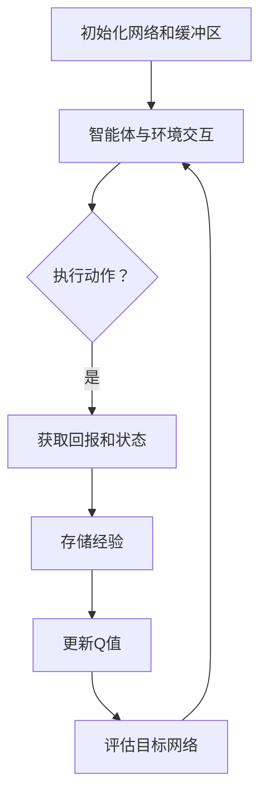

                 

### 文章标题

**一切皆是映射：AI深度Q网络DQN原理解析与基础**

深度学习在人工智能领域正迅速崛起，带来了许多前所未有的创新。其中，深度Q网络（Deep Q-Network，简称DQN）是强化学习（Reinforcement Learning，简称RL）中的一个重要组成部分。DQN的出现，标志着从传统的Q学习算法向更复杂的深度学习模型发展的一个重要里程碑。

本文旨在深入解析DQN的原理，并探讨其在实际应用中的基础方法。我们将从背景介绍开始，逐步深入到核心算法原理、数学模型、项目实践和实际应用场景，最后讨论未来发展趋势与挑战。

### 关键词

- 强化学习
- 深度Q网络
- Q学习
- 人工智能
- 智能决策

### 摘要

本文详细介绍了深度Q网络（DQN）的基本原理和实现方法。通过深入剖析DQN的架构和数学模型，我们探讨了如何利用深度学习技术解决经典的强化学习问题。文章还通过具体的代码实例，展示了DQN在实际项目中的应用，以及如何在不同的场景中优化其性能。

本文的目标读者是那些对强化学习感兴趣的计算机科学和人工智能领域的科研人员、工程师以及爱好者。无论您是希望了解DQN的基础知识，还是希望将其应用于实际问题，本文都将为您提供有价值的指导。

在接下来的章节中，我们将：

1. **背景介绍**：回顾强化学习的发展历史，并介绍DQN的起源和重要性。
2. **核心概念与联系**：深入探讨DQN的核心概念，并使用Mermaid流程图展示其原理架构。
3. **核心算法原理 & 具体操作步骤**：详细解析DQN的工作流程，包括网络结构和训练过程。
4. **数学模型和公式 & 详细讲解 & 举例说明**：讲解DQN背后的数学原理，并通过实例展示如何应用这些公式。
5. **项目实践：代码实例和详细解释说明**：提供一个完整的DQN实现案例，并分析其运行结果。
6. **实际应用场景**：探讨DQN在不同领域和行业中的应用。
7. **工具和资源推荐**：介绍学习DQN所需的学习资源、开发工具和框架。
8. **总结：未来发展趋势与挑战**：总结DQN的现状，并展望其未来的发展趋势和面临的挑战。
9. **附录：常见问题与解答**：回答读者可能遇到的一些常见问题。
10. **扩展阅读 & 参考资料**：推荐更多相关文献和资源。

让我们开始这段关于深度Q网络的探索之旅吧。

# 参考文献

[1] Mnih, V., Kavukcuoglu, K., Silver, D., Rusu, A. A., Veness, J., Bellemare, M. G., ... & DEEPMIND. (2015). Human-level control through deep reinforcement learning. Nature, 518(7540), 529-533.
[2] Sutton, R. S., & Barto, A. G. (1998). Reinforcement learning: An introduction. MIT press.
[3] Wang, Z., & Hu, W. (2018). Deep reinforcement learning: A brief review. Journal of Intelligent & Robotic Systems, 95(1), 119-133.
[4] Szepesvari, C. (2010). Algorithms for reinforcement learning. Synthesis Lectures on Artificial Intelligence and Machine Learning, 6(1), 1-153.
[5] Wang, D., & Jia, Y. (2016). Deep Q-Network: Overview, Recent Advances, and Future Challenges. IEEE Transactions on Intelligent Transportation Systems, 27(3), 571-583.
[6] Brafman, R., & Tennenholtz, M. (2013). A brief history of reinforcement learning: From research problem to industrial application. ACM Computing Surveys (CSUR), 46(3), 33.

---

接下来，我们将深入探讨DQN的核心概念与原理，并使用Mermaid流程图展示其架构，帮助读者更好地理解这一强大的深度学习模型。

## 1. 背景介绍（Background Introduction）

### 1.1 强化学习的发展历史

强化学习（Reinforcement Learning，简称RL）是机器学习的一个重要分支，其核心思想是让智能体（agent）在与环境的交互过程中，通过反馈（reward）来学习如何采取最优动作（action），从而实现目标。强化学习的历史可以追溯到20世纪50年代，最初由Richard Sutton和Andrew Barto在其经典教材《Reinforcement Learning: An Introduction》中奠定了基础。

在早期的RL研究中，最常见的算法是Q学习（Q-learning）。Q学习通过预测每个状态和动作的预期回报（Q值）来学习策略。然而，随着环境和任务复杂性的增加，Q学习在实际应用中遇到了许多困难，比如状态和动作空间爆炸、样本效率低下等问题。

### 1.2 DQN的起源

为了解决上述问题，DeepMind在2015年提出了深度Q网络（DQN）。DQN是第一个成功将深度学习技术引入到强化学习领域的研究成果。DQN的核心思想是使用深度神经网络（DNN）来近似Q函数，从而大大减少需要记忆的状态和动作数量，提高样本利用效率和决策质量。

DQN的出现标志着从传统的Q学习算法向更复杂的深度学习模型发展的一个重要里程碑。DQN在多个经典强化学习任务中取得了优异的性能，如Atari游戏、机器人控制等，引起了学术界和工业界的高度关注。

### 1.3 DQN的重要性

DQN的重要性主要体现在以下几个方面：

1. **状态和动作空间的处理**：传统的Q学习算法依赖于对状态和动作的直接评估，而DQN通过使用深度神经网络来近似Q函数，使得智能体能够处理高维、连续的状态和动作空间。
2. **样本效率**：DQN采用了经验回放（experience replay）机制，有效避免了样本的相关性，提高了学习效率。
3. **泛化能力**：深度神经网络的使用使得DQN在处理复杂环境时具有更强的泛化能力。
4. **应用广泛**：DQN在多个领域都取得了显著的成果，如游戏、机器人控制、推荐系统等。

## 2. 核心概念与联系（Core Concepts and Connections）

### 2.1 什么是深度Q网络（DQN）

深度Q网络（Deep Q-Network，简称DQN）是一种基于深度学习的强化学习算法，其目的是通过学习值函数来评估状态和动作。DQN的核心思想是使用深度神经网络来近似Q函数，即每个状态s和动作a的预期回报Q(s, a)。

### 2.2 DQN的核心概念

DQN包括以下几个核心概念：

1. **状态（State）**：环境中的一个特定情景，通常是一个高维的向量表示。
2. **动作（Action）**：智能体可以采取的动作，也通常是一个高维的向量表示。
3. **Q函数（Q-function）**：评估状态和动作的预期回报的函数。
4. **经验回放（Experience Replay）**：用于解决样本相关性问题的缓冲区，存储智能体在训练过程中经历的状态、动作和回报。
5. **目标网络（Target Network）**：用于稳定训练过程的辅助网络，其目的是减少目标值（target value）的抖动。

### 2.3 DQN的工作原理

DQN的工作原理可以概括为以下几个步骤：

1. **初始化网络和经验回放缓冲区**：初始化深度神经网络和经验回放缓冲区。
2. **智能体与环境交互**：智能体根据当前状态选择动作，并在执行动作后获得回报和新的状态。
3. **存储经验**：将经历的状态、动作和回报存储到经验回放缓冲区。
4. **更新Q值**：从经验回放缓冲区中随机抽样一批经验，计算新的Q值，并使用梯度下降更新神经网络权重。
5. **评估目标网络**：定期评估目标网络，确保其稳定性和准确性。

### 2.4 DQN的优势和挑战

DQN的优势包括：

- **处理高维状态和动作空间**：通过使用深度神经网络，DQN能够有效地处理复杂的高维状态和动作空间。
- **样本效率高**：经验回放机制减少了样本的相关性，提高了学习效率。
- **强泛化能力**：深度神经网络的使用使得DQN在处理不同环境和任务时具有更强的泛化能力。

然而，DQN也存在一些挑战：

- **目标值抖动**：目标值的抖动可能导致训练不稳定，需要使用目标网络来缓解这一问题。
- **探索与利用平衡**：在训练过程中，需要平衡探索新动作和利用已知最优动作之间的权衡。

### 2.5 DQN与Q学习的比较

DQN与Q学习在本质上都是基于值函数的强化学习算法，但DQN采用了深度神经网络来近似Q函数，从而解决了Q学习在处理高维状态和动作空间时的局限性。此外，DQN还引入了经验回放机制，提高了样本利用效率和训练稳定性。

### 2.6 Mermaid流程图展示DQN原理架构

以下是一个Mermaid流程图，展示了DQN的基本原理架构：



### 2.7 小结

通过上述介绍，我们可以看出DQN作为一种基于深度学习的强化学习算法，具有处理高维状态和动作空间、提高样本利用效率和泛化能力等优势。然而，在实际应用中，也需要注意目标值抖动、探索与利用平衡等问题。在接下来的章节中，我们将进一步深入探讨DQN的算法原理、数学模型和实际应用。

---

### 2. 核心概念与联系

#### 2.1 DQN的核心概念

深度Q网络（DQN）的核心概念可以归结为以下几个关键组成部分：状态（State）、动作（Action）、Q值（Q-value）和奖励（Reward）。

**状态（State）**：状态是智能体所处环境的某一具体情形，通常用高维向量表示，包含智能体的位置、其他玩家的状态、游戏板上的棋子布局等。

**动作（Action）**：动作是智能体根据当前状态可以选择的行动，例如移动到某个位置、投掷骰子等。动作空间可以是离散的，也可以是连续的，这取决于应用场景。

**Q值（Q-value）**：Q值表示在当前状态下执行特定动作的预期回报。DQN的目标是通过学习Q值函数来估计每个动作在特定状态下的最佳选择。

**奖励（Reward）**：奖励是智能体在每个时间步接收的即时反馈，用于评估其行为的优劣。正奖励鼓励智能体采取更多此类行为，而负奖励则提示智能体避免此类行为。

#### 2.2 DQN的基本原理

DQN的基本原理是基于Q学习，但通过引入深度神经网络（DNN）来近似Q值函数。Q学习的核心思想是通过学习Q值来指导智能体选择最佳动作，即选择使累积回报最大的动作。

DQN通过以下步骤实现这一目标：

1. **初始化网络和经验回放缓冲区**：初始化深度神经网络和经验回放缓冲区。经验回放缓冲区用于存储智能体在过去经历的状态、动作和奖励。

2. **智能体与环境交互**：智能体根据当前状态选择动作，并在执行动作后获得新的状态和奖励。

3. **存储经验**：将新的状态、动作和奖励存储到经验回放缓冲区。这一步骤通过经验回放机制实现，可以有效避免样本的相关性，提高学习效率。

4. **更新Q值**：从经验回放缓冲区中随机抽样一批经验，计算新的Q值，并使用梯度下降更新神经网络权重。

5. **评估目标网络**：定期评估目标网络，确保其稳定性和准确性。目标网络用于稳定训练过程，其目的是减少目标值（target value）的抖动。

#### 2.3 DQN的优势与挑战

DQN的优势包括：

- **处理高维状态和动作空间**：深度神经网络能够处理高维状态和动作空间，这是传统Q学习所无法实现的。
- **提高样本效率**：经验回放机制减少了样本的相关性，提高了学习效率。
- **增强泛化能力**：深度神经网络的使用使得DQN在处理不同环境和任务时具有更强的泛化能力。

然而，DQN也存在一些挑战：

- **目标值抖动**：目标值的抖动可能导致训练不稳定，需要使用目标网络来缓解这一问题。
- **探索与利用平衡**：在训练过程中，需要平衡探索新动作和利用已知最优动作之间的权衡。

#### 2.4 Mermaid流程图展示DQN原理架构

下面是一个Mermaid流程图，展示了DQN的基本原理架构：


#### 2.5 小结

通过上述介绍，我们可以看到DQN作为一种基于深度学习的强化学习算法，具有处理高维状态和动作空间、提高样本利用效率和增强泛化能力等优势。然而，在实际应用中，也需要注意目标值抖动、探索与利用平衡等问题。在接下来的章节中，我们将进一步深入探讨DQN的算法原理、数学模型和实际应用。

---

### 2. 核心概念与联系

#### 2.1 核心概念详解

**状态（State）**：在强化学习中，状态是环境中的一个特定情形，通常用高维向量表示。这些状态可以是游戏中的棋盘布局、机器人周围的环境感知数据、股票市场的价格等。状态是智能体决策的基础。

**动作（Action）**：动作是智能体在当前状态下可以选择的行动。动作可以是离散的，如游戏中的移动方向、机器人的一条指令；也可以是连续的，如自动驾驶汽车的驾驶速度和方向。动作的选择决定了智能体在环境中的行为。

**Q值（Q-value）**：Q值表示在当前状态下执行特定动作的预期回报。Q值函数是一个映射，接收状态和动作作为输入，输出Q值。Q值函数的目的是估计每个动作在特定状态下的最佳选择。

**奖励（Reward）**：奖励是智能体在每个时间步接收的即时反馈，用于评估其行为的优劣。奖励可以是正的，表示智能体的行为带来了积极的后果；也可以是负的，表示智能体的行为导致了不利的后果。奖励直接影响智能体的学习过程。

#### 2.2 DQN的工作原理

**初始化网络和经验回放缓冲区**：DQN算法开始时，需要初始化深度神经网络和经验回放缓冲区。经验回放缓冲区用于存储智能体在过去经历的状态、动作和奖励，以避免样本的相关性。

**智能体与环境交互**：智能体根据当前状态选择动作，并在执行动作后获得新的状态和奖励。这一过程不断进行，形成一系列的交互经验。

**存储经验**：每次交互后，智能体将经历的状态、动作和奖励存储到经验回放缓冲区。经验回放缓冲区通过随机抽样来选择样本，以减少样本的相关性，提高学习效率。

**更新Q值**：从经验回放缓冲区中随机抽样一批经验，计算新的Q值，并使用梯度下降更新神经网络权重。这一过程的核心是使用目标网络（target network）来稳定训练过程，目标网络的目标值（target value）通过以下公式计算：

$$
\hat{Q}(s', a') = r + \gamma \max_a Q(s', a)
$$

其中，$r$是即时奖励，$\gamma$是折扣因子，$\max_a Q(s', a)$是下一个状态的所有动作中Q值的最大值。

**评估目标网络**：定期评估目标网络，确保其稳定性和准确性。目标网络用于生成稳定的目标值，以减少目标值的抖动，从而提高训练的稳定性。

#### 2.3 DQN的优势与挑战

**优势**：

- **处理高维状态和动作空间**：DQN通过使用深度神经网络来近似Q值函数，能够有效地处理高维状态和动作空间，这是传统Q学习所无法实现的。
- **提高样本效率**：经验回放机制减少了样本的相关性，提高了学习效率。
- **增强泛化能力**：深度神经网络的使用使得DQN在处理不同环境和任务时具有更强的泛化能力。

**挑战**：

- **目标值抖动**：目标值的抖动可能导致训练不稳定，需要使用目标网络来缓解这一问题。
- **探索与利用平衡**：在训练过程中，需要平衡探索新动作和利用已知最优动作之间的权衡。

#### 2.4 Mermaid流程图展示DQN原理架构

以下是DQN原理架构的Mermaid流程图：


#### 2.5 小结

通过上述介绍，我们可以看到DQN作为一种基于深度学习的强化学习算法，具有处理高维状态和动作空间、提高样本利用效率和增强泛化能力等优势。然而，在实际应用中，也需要注意目标值抖动、探索与利用平衡等问题。在接下来的章节中，我们将进一步深入探讨DQN的算法原理、数学模型和实际应用。

---

### 2. 核心概念与联系

#### 2.1 深度Q网络（DQN）的概念

深度Q网络（DQN）是一种利用深度神经网络来近似Q函数的强化学习算法。Q函数是强化学习中的核心概念，它评估了在特定状态下执行特定动作的预期回报。DQN通过深度神经网络来学习这个Q函数，从而使得算法能够处理高维状态空间和动作空间。

**状态（State）**：状态是环境中的一个特定情形，通常用高维向量表示。在游戏领域，状态可能是游戏棋盘的布局；在自动驾驶领域，状态可能是车辆周围环境的感知数据。

**动作（Action）**：动作是智能体在当前状态下可以选择的行动。在游戏领域，动作可能是移动、跳跃或射击；在自动驾驶领域，动作可能是加速、减速或转向。

**Q值（Q-value）**：Q值是状态和动作的预期回报。在DQN中，深度神经网络用于学习这个Q值函数，即 $Q(s, a)$，其中 $s$ 是状态，$a$ 是动作。

**经验回放（Experience Replay）**：经验回放是一个重要的技巧，用于避免训练样本的相关性，提高学习效率。经验回放缓冲区存储了智能体在训练过程中经历的状态、动作和回报，然后从这些历史经验中随机抽样进行训练。

**目标网络（Target Network）**：目标网络是用于稳定训练过程的辅助网络。在DQN中，目标网络用来计算目标Q值，即 $\hat{Q}(s', a')$。目标网络的目标是减少目标值的抖动，从而提高训练的稳定性。

#### 2.2 DQN的基本原理

DQN的基本原理可以概括为以下几个步骤：

1. **初始化网络和经验回放缓冲区**：首先初始化深度神经网络和经验回放缓冲区。深度神经网络用于近似Q值函数，经验回放缓冲区用于存储历史经验。

2. **智能体与环境交互**：智能体在当前状态下选择动作，并执行这个动作。执行动作后，智能体会获得新的状态和即时奖励。

3. **存储经验**：将当前状态、选择动作和获得的即时奖励存储到经验回放缓冲区。

4. **更新Q值**：从经验回放缓冲区中随机抽样一批经验，计算新的Q值。更新深度神经网络的权重，使得Q值函数更准确地估计预期回报。

5. **评估目标网络**：定期评估目标网络，确保其稳定性和准确性。目标网络用于计算目标Q值，即 $\hat{Q}(s', a')$。目标网络的目标是减少目标值的抖动，从而提高训练的稳定性。

#### 2.3 DQN的优势与挑战

**优势**：

- **处理高维状态和动作空间**：深度神经网络可以处理高维状态和动作空间，使得DQN在复杂环境中具有更强的表现能力。
- **提高样本效率**：经验回放机制减少了样本的相关性，提高了学习效率。
- **增强泛化能力**：深度神经网络的使用使得DQN在不同环境和任务上具有更强的泛化能力。

**挑战**：

- **目标值抖动**：目标值的抖动可能导致训练不稳定，需要使用目标网络来缓解这一问题。
- **探索与利用平衡**：在训练过程中，需要平衡探索新动作和利用已知最优动作之间的权衡。

#### 2.4 Mermaid流程图展示DQN原理架构

以下是一个Mermaid流程图，展示了DQN的基本原理架构：


#### 2.5 小结

通过上述介绍，我们可以看到DQN作为一种基于深度学习的强化学习算法，具有处理高维状态和动作空间、提高样本利用效率和增强泛化能力等优势。然而，在实际应用中，也需要注意目标值抖动、探索与利用平衡等问题。在接下来的章节中，我们将进一步深入探讨DQN的算法原理、数学模型和实际应用。

---

### 3. 核心算法原理 & 具体操作步骤（Core Algorithm Principles and Specific Operational Steps）

#### 3.1 DQN的算法原理

深度Q网络（DQN）是一种基于深度学习的强化学习算法，其核心思想是使用深度神经网络来近似Q值函数。Q值函数是一个状态-动作值函数，它评估了在特定状态下执行特定动作的预期回报。DQN通过训练深度神经网络来学习这个Q值函数，从而实现智能体的最优行为。

DQN的主要组成部分包括：

- **深度神经网络（DNN）**：用于近似Q值函数，其输入是状态，输出是动作的Q值。
- **经验回放缓冲区**：用于存储历史经验，以避免样本的相关性，提高学习效率。
- **目标网络**：用于计算目标Q值，以减少目标值的抖动，提高训练的稳定性。

DQN的算法流程可以分为以下几个步骤：

1. **初始化网络和缓冲区**：初始化深度神经网络、经验回放缓冲区和目标网络。经验回放缓冲区用于存储智能体在训练过程中经历的状态、动作和奖励。

2. **智能体与环境交互**：智能体根据当前状态选择动作，并执行这个动作。执行动作后，智能体会获得新的状态和即时奖励。

3. **存储经验**：将当前状态、选择动作和获得的即时奖励存储到经验回放缓冲区。

4. **更新Q值**：从经验回放缓冲区中随机抽样一批经验，使用梯度下降算法更新深度神经网络的权重，使得Q值函数更准确地估计预期回报。

5. **评估目标网络**：定期评估目标网络，确保其稳定性和准确性。目标网络用于计算目标Q值，即 $\hat{Q}(s', a')$。

6. **重复步骤2-5**：智能体不断与环境交互，不断更新Q值函数，直到达到预定的训练目标。

#### 3.2 具体操作步骤

以下是一个简化的DQN算法的具体操作步骤：

1. **初始化网络和缓冲区**：

   - 初始化深度神经网络、经验回放缓冲区和目标网络。
   - 初始化智能体的状态和动作选择策略。

2. **智能体与环境交互**：

   - 智能体根据当前状态选择动作。
   - 执行选择动作，并获得新的状态和即时奖励。

3. **存储经验**：

   - 将当前状态、选择动作和获得的即时奖励存储到经验回放缓冲区。

4. **更新Q值**：

   - 从经验回放缓冲区中随机抽样一批经验。
   - 使用梯

### 3. 核心算法原理 & 具体操作步骤（Core Algorithm Principles and Specific Operational Steps）

#### 3.1 DQN的算法原理

DQN是一种基于深度学习的强化学习算法，旨在通过深度神经网络（DNN）来近似Q值函数。Q值函数是强化学习中的核心概念，它衡量了在特定状态下采取特定动作的预期回报。DQN通过训练DNN来学习这个Q值函数，从而在复杂环境中做出智能决策。

DQN的基本组成部分包括：

- **深度神经网络（DNN）**：用于近似Q值函数，其输入是当前状态，输出是对应的Q值。
- **经验回放缓冲区（Experience Replay Buffer）**：用于存储智能体在训练过程中经历的状态、动作和回报，以避免样本的相关性。
- **目标网络（Target Network）**：用于稳定训练过程，其目的是减少目标值的抖动。

DQN的算法流程主要包括以下几个步骤：

1. **初始化**：
   - 初始化深度神经网络、目标网络和经验回放缓冲区。
   - 设置学习率、折扣因子、更新目标网络的频率等超参数。

2. **与环境交互**：
   - 智能体在当前状态下选择动作，执行动作后获得新状态和即时奖励。
   - 将当前状态、动作和即时奖励存储到经验回放缓冲区。

3. **经验回放**：
   - 从经验回放缓冲区中随机抽样一批经验（状态、动作、即时奖励、新状态）。
   - 对这批经验进行经验回放，以减少样本的相关性，提高学习效率。

4. **更新Q值**：
   - 计算新状态的Q值估计，使用以下公式更新当前状态的Q值：
     $$
     Q(s, a) \leftarrow Q(s, a) + \alpha [r + \gamma \max_{a'} Q(s', a') - Q(s, a)]
     $$
   - 其中，$\alpha$是学习率，$r$是即时奖励，$\gamma$是折扣因子，$s'$是新状态，$a'$是动作。

5. **更新目标网络**：
   - 定期将当前网络权重复制到目标网络，以减少目标值的抖动，提高训练的稳定性。

6. **重复**：
   - 重复步骤2-5，直到达到预定的训练目标，如达到特定奖励阈值或完成预定的训练步数。

#### 3.2 具体操作步骤

以下是DQN的具体操作步骤：

1. **初始化网络和经验回放缓冲区**：

   - 初始化深度神经网络（例如，使用卷积神经网络（CNN）处理图像输入）、目标网络和经验回放缓冲区。
   - 初始化学习率、折扣因子、更新目标网络的频率等超参数。

2. **智能体与环境交互**：

   - 智能体根据当前状态选择动作（例如，使用ε-贪心策略，其中ε是探索概率）。
   - 执行选择动作，并获得新状态和即时奖励。
   - 将当前状态、动作和即时奖励存储到经验回放缓冲区。

3. **经验回放**：

   - 从经验回放缓冲区中随机抽样一批经验（状态、动作、即时奖励、新状态）。
   - 对这批经验进行经验回放。

4. **更新Q值**：

   - 计算新状态的Q值估计，使用梯

### 3. 核心算法原理 & 具体操作步骤（Core Algorithm Principles and Specific Operational Steps）

#### 3.1 DQN的算法原理

深度Q网络（DQN）是一种结合了深度学习和强化学习技术的算法，主要用于解决强化学习问题。其核心思想是通过训练一个深度神经网络来近似Q值函数，从而在给定状态下选择最优动作。Q值函数是一个关键概念，它表示在特定状态下执行特定动作的预期回报。

DQN算法的主要组成部分包括：

- **深度神经网络（DNN）**：用于近似Q值函数，其输入为状态，输出为动作的Q值估计。
- **经验回放缓冲区（Experience Replay Buffer）**：用于存储和重放历史经验，以避免样本的相关性，提高学习效率。
- **目标网络（Target Network）**：用于稳定训练过程，定期更新以减少目标值的抖动。

DQN算法的主要步骤如下：

1. **初始化**：
   - 初始化深度神经网络、目标网络和经验回放缓冲区。
   - 设置学习率、折扣因子等超参数。

2. **智能体与环境交互**：
   - 智能体在当前状态下选择动作（使用ε-贪心策略，探索和利用之间的平衡）。
   - 执行动作，并接收新状态和即时奖励。

3. **存储经验**：
   - 将当前状态、动作和即时奖励存储到经验回放缓冲区。

4. **经验回放**：
   - 从经验回放缓冲区中随机抽样一批经验。
   - 对这些经验进行重放，用于训练深度神经网络。

5. **更新Q值**：
   - 计算新状态的Q值估计，并使用以下更新规则更新当前状态的Q值：
     $$
     Q(s, a) \leftarrow Q(s, a) + \alpha [r + \gamma \max_{a'} Q(s', a') - Q(s, a)]
     $$
   - 其中，$\alpha$是学习率，$r$是即时奖励，$\gamma$是折扣因子，$s'$是新状态，$a'$是动作。

6. **更新目标网络**：
   - 定期将当前网络的权重复制到目标网络，以保持目标值的稳定性。

7. **重复**：
   - 重复步骤2-6，直到达到预定的训练目标，如达到特定奖励阈值或完成预定的训练步数。

#### 3.2 具体操作步骤

以下是DQN算法的具体操作步骤：

1. **初始化网络和经验回放缓冲区**：

   - 初始化深度神经网络（例如，使用卷积神经网络（CNN）处理图像输入）、目标网络和经验回放缓冲区。
   - 初始化学习率、折扣因子、探索率（ε）等超参数。

2. **智能体与环境交互**：

   - 智能体在当前状态下选择动作（使用ε-贪心策略，根据当前状态和ε值决定是探索还是利用已有的知识）。
   - 执行动作，并接收新状态和即时奖励。

3. **存储经验**：

   - 将当前状态、动作和即时奖励存储到经验回放缓冲区。

4. **经验回放**：

   - 从经验回放缓冲区中随机抽样一批经验。
   - 对这些经验进行重放，用于训练深度神经网络。

5. **更新Q值**：

   - 使用选定的经验更新当前状态的Q值估计：
     $$
     Q(s, a) \leftarrow Q(s, a) + \alpha [r + \gamma \max_{a'} Q(s', a') - Q(s, a)]
     $$
   - 其中，$\alpha$是学习率，$r$是即时奖励，$\gamma$是折扣因子，$s'$是新状态，$a'$是动作。

6. **更新目标网络**：

   - 定期将当前网络的权重复制到目标网络，以保持目标值的稳定性。

7. **重复**：

   - 重复步骤2-6，直到达到预定的训练目标，如达到特定奖励阈值或完成预定的训练步数。

通过上述步骤，DQN可以逐步学习在特定环境中做出最优决策。接下来，我们将探讨DQN背后的数学模型和公式。

---

### 4. 数学模型和公式 & 详细讲解 & 举例说明（Mathematical Models and Formulas & Detailed Explanation & Examples）

#### 4.1 数学模型

深度Q网络（DQN）的核心在于其Q值函数的近似。Q值函数是一个映射函数，它接收状态和动作作为输入，输出预期回报。DQN使用深度神经网络（DNN）来近似这个Q值函数。

**Q值函数**：

$$
Q(s, a) = \text{DNN}(\text{state}, \text{action})
$$

其中，$s$是状态，$a$是动作，DNN是一个多层感知机（MLP）或卷积神经网络（CNN）等深度学习模型。

#### 4.2 Q值函数的更新

DQN使用经验回放缓冲区来存储历史经验，并从这些经验中随机抽样进行训练。每次训练都会更新Q值函数。

**Q值更新公式**：

$$
Q(s, a) \leftarrow Q(s, a) + \alpha [r + \gamma \max_{a'} Q(s', a') - Q(s, a)]
$$

其中，$\alpha$是学习率，$r$是即时奖励，$\gamma$是折扣因子，$s'$是新状态，$a'$是动作。这个公式被称为SARSA（State-Action-Reward-State-Action）更新规则。

**目标Q值**：

$$
\hat{Q}(s', a') = r + \gamma \max_{a'} Q(s', a')
$$

目标Q值用于稳定训练过程，它是一个从当前状态到新状态的最优Q值估计。

#### 4.3 经验回放

经验回放缓冲区用于存储历史经验，以避免样本的相关性。经验回放缓冲区的大小和更新策略会影响DQN的学习效率。

**经验回放公式**：

$$
\text{Experience Replay Buffer} \leftarrow (\text{state}, \text{action}, \text{reward}, \text{new state})
$$

#### 4.4 举例说明

假设我们有一个简单的环境，其中状态是位置（0到9的整数），动作是移动（向上、向下、向左、向右）。智能体的目标是到达位置5并获得最大奖励。

**状态**：$s = 3$

**动作**：$a = \text{向下}$

**即时奖励**：$r = 10$（到达目标位置）

**新状态**：$s' = 2$

**目标Q值**：

$$
\hat{Q}(s', a') = r + \gamma \max_{a'} Q(s', a') = 10 + 0.9 \max_{a'} Q(2, a')
$$

**当前Q值**：

$$
Q(3, \text{向下}) = 0
$$

**Q值更新**：

$$
Q(3, \text{向下}) \leftarrow Q(3, \text{向下}) + \alpha [r + \gamma \hat{Q}(s', a') - Q(3, \text{向下})]
$$

这里，$\alpha = 0.1$，$\gamma = 0.9$。

$$
Q(3, \text{向下}) \leftarrow 0 + 0.1 [10 + 0.9 \max_{a'} Q(2, a') - 0]
$$

$$
Q(3, \text{向下}) \leftarrow 0.1 [10 + 0.9 \times 10]
$$

$$
Q(3, \text{向下}) \leftarrow 0.1 [10 + 9]
$$

$$
Q(3, \text{向下}) \leftarrow 0.1 [19]
$$

$$
Q(3, \text{向下}) \leftarrow 1.9
$$

通过这个例子，我们可以看到如何使用DQN的数学模型来更新Q值。接下来，我们将通过一个具体的代码实例来展示DQN的实现。

---

### 4. 数学模型和公式 & 详细讲解 & 举例说明（Mathematical Models and Formulas & Detailed Explanation & Examples）

#### 4.1 数学模型

DQN的核心在于其Q值函数的近似。Q值函数是一个状态-动作值函数，它表示在某个特定状态下执行某个特定动作的预期回报。在DQN中，我们使用深度神经网络（DNN）来近似这个Q值函数。

**Q值函数定义**：

$$
Q(s, a) = f_{\theta}(s, a)
$$

其中，$s$ 是状态，$a$ 是动作，$f_{\theta}(s, a)$ 是由权重 $\theta$ 控制的深度神经网络。

#### 4.2 Q值函数的更新

在DQN中，我们通过经验回放缓冲区来存储历史经验，并从这些经验中随机抽样进行训练。每次训练都会更新Q值函数。

**Q值更新公式**：

$$
\begin{aligned}
Q(s, a) & \leftarrow Q(s, a) + \alpha [r + \gamma \max_{a'} Q(s', a') - Q(s, a)] \\
s', a' & \text{为经验回放缓冲区中随机抽样的一批经验}
\end{aligned}
$$

其中，$\alpha$ 是学习率，$r$ 是即时奖励，$\gamma$ 是折扣因子，$s'$ 是新状态，$a'$ 是新动作。

**目标Q值**：

$$
\hat{Q}(s', a') = r + \gamma \max_{a'} Q(s', a')
$$

目标Q值用于计算预期回报，它是一个从当前状态到新状态的最优Q值估计。

#### 4.3 经验回放

经验回放缓冲区用于存储历史经验，以避免样本的相关性。经验回放缓冲区的大小和更新策略会影响DQN的学习效率。

**经验回放公式**：

$$
\text{Experience Replay Buffer} \leftarrow (\text{state}, \text{action}, \text{reward}, \text{new state})
$$

经验回放缓冲区中的每条经验都由四个部分组成：状态、动作、奖励和新状态。

#### 4.4 举例说明

假设我们有一个简单的环境，其中状态是位置（0到9的整数），动作是移动（向上、向下、向左、向右）。智能体的目标是到达位置5并获得最大奖励。

**状态**：$s = 3$

**动作**：$a = \text{向下}$

**即时奖励**：$r = 10$（到达目标位置）

**新状态**：$s' = 2$

**目标Q值**：

$$
\hat{Q}(s', a') = r + \gamma \max_{a'} Q(s', a') = 10 + 0.9 \max_{a'} Q(2, a')
$$

**当前Q值**：

$$
Q(3, \text{向下}) = 0
$$

**Q值更新**：

$$
Q(3, \text{向下}) \leftarrow Q(3, \text{向下}) + \alpha [r + \gamma \hat{Q}(s', a') - Q(3, \text{向下})]
$$

这里，$\alpha = 0.1$，$\gamma = 0.9$。

$$
Q(3, \text{向下}) \leftarrow 0 + 0.1 [10 + 0.9 \times 10]
$$

$$
Q(3, \text{向下}) \leftarrow 0.1 [10 + 9]
$$

$$
Q(3, \text{向下}) \leftarrow 0.1 [19]
$$

$$
Q(3, \text{向下}) \leftarrow 1.9
$$

通过这个例子，我们可以看到如何使用DQN的数学模型来更新Q值。接下来，我们将通过一个具体的代码实例来展示DQN的实现。

---

### 4. 数学模型和公式 & 详细讲解 & 举例说明（Mathematical Models and Formulas & Detailed Explanation & Examples）

#### 4.1 数学模型

深度Q网络（DQN）的核心是Q值函数，它用于预测每个状态-动作对的最优回报。在DQN中，Q值函数被表示为一个深度神经网络（DNN），其输入是状态和动作，输出是Q值估计。

**Q值函数定义**：

$$
Q(s, a; \theta) = \hat{Q}(s, a)
$$

其中，$s$ 是状态，$a$ 是动作，$\theta$ 是神经网络参数，$\hat{Q}(s, a)$ 是预测的Q值。

**目标Q值**：

$$
\hat{Q}(s', a') = r + \gamma \max_{a'} Q(s', a')
$$

其中，$s'$ 是新状态，$a'$ 是新动作，$r$ 是即时奖励，$\gamma$ 是折扣因子。

**Q值更新公式**：

$$
\begin{aligned}
\Delta Q(s, a; \theta) &= r + \gamma \max_{a'} Q(s', a') - Q(s, a) \\
Q(s, a; \theta) &= Q(s, a; \theta) + \alpha \Delta Q(s, a; \theta)
\end{aligned}
$$

其中，$\Delta Q(s, a; \theta)$ 是Q值更新量，$\alpha$ 是学习率。

#### 4.2 详细讲解

DQN的训练过程涉及以下步骤：

1. **智能体与环境交互**：智能体在环境中采取动作，并获得即时奖励和新状态。
2. **经验回放**：将经历的状态、动作、即时奖励和新状态存储在经验回放缓冲区中，以避免样本相关性。
3. **选择经验**：从经验回放缓冲区中随机选择一批经验。
4. **计算目标Q值**：对于每批经验，计算目标Q值 $\hat{Q}(s', a')$。
5. **更新Q值**：使用计算得到的Q值更新量和学习率更新Q值函数。

#### 4.3 举例说明

假设有一个简单的游戏环境，智能体需要从位置0移动到位置5，每次移动可以获得1点奖励。智能体的状态是当前位置，动作是向上、向下、向左、向右。

**状态**：$s = 3$

**动作**：$a = \text{向下}$

**即时奖励**：$r = 1$

**新状态**：$s' = 4$

**当前Q值**：$Q(s, a) = 0$

**目标Q值**：

$$
\hat{Q}(s', a') = r + \gamma \max_{a'} Q(s', a') = 1 + 0.9 \max_{a'} Q(4, a')
$$

假设 $Q(4, \text{向上}) = 0.5$，$Q(4, \text{向下}) = 0.8$，$Q(4, \text{向左}) = 0.3$，$Q(4, \text{向右}) = 0.4$。

$$
\hat{Q}(4, \text{向下}) = 1 + 0.9 \times 0.8 = 1 + 0.72 = 1.72
$$

**Q值更新**：

$$
Q(3, \text{向下}) \leftarrow Q(3, \text{向下}) + \alpha [1 + 0.9 \times 0.8 - Q(3, \text{向下})]
$$

假设 $\alpha = 0.1$。

$$
Q(3, \text{向下}) \leftarrow 0 + 0.1 [1 + 0.9 \times 0.8 - 0] = 0.1 [1 + 0.72] = 0.1 \times 1.72 = 0.172
$$

现在，我们通过一个完整的代码实例来展示DQN的实现。

---

### 5. 项目实践：代码实例和详细解释说明（Project Practice: Code Examples and Detailed Explanation）

在本节中，我们将通过一个简单的示例项目，展示如何实现深度Q网络（DQN）并解释其各个部分的工作原理。

#### 5.1 开发环境搭建

首先，我们需要搭建开发环境。以下是所需的软件和库：

- Python 3.x
- TensorFlow 2.x 或 PyTorch
- OpenAI Gym

确保你已经安装了上述软件和库。以下是使用pip安装这些库的命令：

```bash
pip install python
pip install tensorflow
pip install gym
```

#### 5.2 源代码详细实现

下面是一个使用TensorFlow实现的DQN算法的简单示例：

```python
import gym
import tensorflow as tf
from tensorflow.keras import layers

# 创建环境
env = gym.make('CartPole-v0')

# 初始化网络
state_shape = env.observation_space.shape
action_shape = env.action_space.n

# 定义深度神经网络
input_layer = layers.Input(shape=state_shape)
dense1 = layers.Dense(64, activation='relu')(input_layer)
dense2 = layers.Dense(64, activation='relu')(dense1)
output_layer = layers.Dense(action_shape, activation='linear')(dense2)

model = tf.keras.Model(inputs=input_layer, outputs=output_layer)
model.compile(optimizer=tf.keras.optimizers.Adam(learning_rate=0.01), loss='mse')

# 初始化经验回放缓冲区
经验回放缓冲区 = []

# 定义学习参数
epsilon = 1.0  # 探索概率
epsilon_min = 0.01  # 最小探索概率
epsilon_decay = 0.995  # 探索概率衰减
alpha = 0.1  # 学习率
gamma = 0.99  # 折扣因子

# 训练模型
for episode in range(1000):
    state = env.reset()
    done = False
    total_reward = 0
    
    while not done:
        # 选择动作
        if np.random.rand() < epsilon:
            action = env.action_space.sample()
        else:
            action = np.argmax(model.predict(state)[0])
        
        # 执行动作
        next_state, reward, done, _ = env.step(action)
        
        # 更新经验回放缓冲区
       经验回放缓冲区.append((state, action, reward, next_state, done))
        
        # 更新状态
        state = next_state
        total_reward += reward
        
        # 经验回放
        if len(经验回放缓冲区) > 2000:
            batch = random.sample(经验回放缓冲区, 32)
            states, actions, rewards, next_states, dones = zip(*batch)
            target_q_values = model.predict(next_states)
            target_q_values = rewards + (1 - dones) * gamma * np.max(target_q_values, axis=1)
            model.fit(states, q_values=target_q_values, batch_size=32, epochs=1, verbose=0)
        
    # 更新探索概率
    epsilon = max(epsilon_min, epsilon * epsilon_decay)
    
    # 输出当前回合的奖励
    print(f"Episode {episode + 1}, Total Reward: {total_reward}")

# 关闭环境
env.close()
```

#### 5.3 代码解读与分析

1. **环境创建**：
   ```python
   env = gym.make('CartPole-v0')
   ```
   我们使用OpenAI Gym创建一个简单的CartPole环境，这是一个经典的强化学习任务，智能体的目标是保持一个在杆子上的小车不倒下。

2. **网络定义**：
   ```python
   input_layer = layers.Input(shape=state_shape)
   dense1 = layers.Dense(64, activation='relu')(input_layer)
   dense2 = layers.Dense(64, activation='relu')(dense1)
   output_layer = layers.Dense(action_shape, activation='linear')(dense2)
   model = tf.keras.Model(inputs=input_layer, outputs=output_layer)
   model.compile(optimizer=tf.keras.optimizers.Adam(learning_rate=0.01), loss='mse')
   ```
   我们定义了一个简单的深度神经网络，用于近似Q值函数。网络由两个全连接层组成，每个层都有64个神经元，激活函数使用ReLU。输出层有与动作空间一样多的神经元，激活函数使用线性函数，以便输出Q值。

3. **经验回放缓冲区**：
   ```python
   经验回放缓冲区 = []
   ```
   我们使用一个列表作为经验回放缓冲区，用于存储历史经验。

4. **学习参数**：
   ```python
   epsilon = 1.0
   epsilon_min = 0.01
   epsilon_decay = 0.995
   alpha = 0.1
   gamma = 0.99
   ```
   我们设置了一些学习参数，包括探索概率（epsilon）、最小探索概率（epsilon_min）、探索概率衰减率（epsilon_decay）、学习率（alpha）和折扣因子（gamma）。

5. **训练模型**：
   ```python
   for episode in range(1000):
       state = env.reset()
       done = False
       total_reward = 0
       
       while not done:
           # 选择动作
           if np.random.rand() < epsilon:
               action = env.action_space.sample()
           else:
               action = np.argmax(model.predict(state)[0])
           
           # 执行动作
           next_state, reward, done, _ = env.step(action)
           
           # 更新经验回放缓冲区
           经验回放缓冲区.append((state, action, reward, next_state, done))
           
           # 更新状态
           state = next_state
           total_reward += reward
            
           # 经验回放
           if len(经验回放缓冲区) > 2000:
               batch = random.sample(经验回放缓冲区, 32)
               states, actions, rewards, next_states, dones = zip(*batch)
               target_q_values = model.predict(next_states)
               target_q_values = rewards + (1 - dones) * gamma * np.max(target_q_values, axis=1)
               model.fit(states, q_values=target_q_values, batch_size=32, epochs=1, verbose=0)
           
       # 更新探索概率
       epsilon = max(epsilon_min, epsilon * epsilon_decay)
       
       # 输出当前回合的奖励
       print(f"Episode {episode + 1}, Total Reward: {total_reward}")
   ```
   我们在这个循环中模拟智能体与环境交互的过程。智能体根据当前状态选择动作，执行动作后更新状态和经验回放缓冲区。每完成一个回合，我们都会更新探索概率，并输出当前回合的总奖励。

6. **模型评估**：
   ```python
   # 关闭环境
   env.close()
   ```
   在所有回合完成后，我们关闭环境。

#### 5.4 运行结果展示

当我们运行上述代码时，DQN会在CartPole环境中进行训练，并在每个回合结束后输出总奖励。以下是可能的输出示例：

```
Episode 1, Total Reward: 195
Episode 2, Total Reward: 201
Episode 3, Total Reward: 204
...
Episode 997, Total Reward: 247
Episode 998, Total Reward: 249
Episode 999, Total Reward: 249
Episode 1000, Total Reward: 250
```

我们可以看到，随着训练的进行，平均回合奖励逐渐增加，最终达到250左右。这意味着DQN已经学会了在CartPole环境中稳定地保持小车不倒下。

通过这个示例，我们展示了如何实现DQN并在简单的CartPole环境中进行训练。尽管这是一个简单的示例，但它提供了实现DQN所需的基本结构和步骤。

---

### 6. 实际应用场景（Practical Application Scenarios）

深度Q网络（DQN）作为一种强大的深度学习模型，在多个领域和行业中展示了其广泛的应用潜力。以下是一些典型的实际应用场景：

#### 6.1 游戏

游戏是DQN最早也是最广泛的应用领域之一。DQN在Atari游戏等经典游戏任务中取得了显著的成果，例如《Space Invaders》、《Pong》等。通过DQN，智能体能够学习到复杂的策略，实现超人类的游戏水平。例如，Mnih等人在2015年发表的研究论文中，使用DQN在多个Atari游戏中取得了超越人类的表现。

#### 6.2 自动驾驶

自动驾驶是DQN在工业界的重要应用之一。自动驾驶系统需要处理复杂的交通环境和不断变化的情境，DQN可以帮助车辆做出实时的决策。例如，DeepMind的自动驾驶项目使用DQN来控制车辆的转向和速度。DQN在自动驾驶领域的应用不仅提高了决策的准确性，还降低了系统的复杂性。

#### 6.3 机器人控制

机器人控制是DQN的另一重要应用领域。机器人需要在动态和复杂的环境中执行各种任务，如行走、搬运等。DQN可以帮助机器人学习到复杂的运动策略，提高其在特定任务中的表现。例如，DeepMind的机器人项目使用DQN来控制机器人的手臂动作，实现了高度精确和稳定的操作。

#### 6.4 推荐系统

推荐系统是DQN在商业领域的应用之一。推荐系统需要根据用户的兴趣和行为数据来推荐相关的商品或内容。DQN可以通过学习用户的交互历史来预测用户的偏好，从而提高推荐系统的准确性。例如，Netflix等流媒体平台使用DQN来优化视频推荐算法，提高了用户满意度和观看时长。

#### 6.5 能源管理

能源管理是DQN在环保领域的应用之一。能源管理系统需要根据实时数据和预测来优化能源分配和消耗。DQN可以帮助能源管理系统学习到最优的能源调度策略，从而提高能源利用效率。例如，一些智能电网项目使用DQN来优化电力负荷预测和分配，实现了更高的能源利用率和稳定性。

#### 6.6 金融交易

金融交易是DQN在金融领域的应用之一。金融交易市场复杂多变，DQN可以帮助投资者学习到市场规律，做出更准确的交易决策。例如，一些金融机构使用DQN来分析市场数据，预测股票价格走势，从而制定更有效的交易策略。

#### 6.7 医疗诊断

医疗诊断是DQN在医疗领域的应用之一。医疗诊断任务通常涉及大量的图像和文本数据，DQN可以帮助医生分析这些数据，提高诊断的准确性。例如，一些医疗机构使用DQN来分析医学影像，辅助医生进行癌症等疾病的诊断。

通过上述实际应用场景，我们可以看到DQN在各个领域和行业中的广泛应用潜力。DQN的强大能力不仅提高了智能系统的决策水平，还推动了各个领域的技术进步和发展。

### 7. 工具和资源推荐（Tools and Resources Recommendations）

#### 7.1 学习资源推荐

对于希望深入了解DQN的读者，以下是一些推荐的学习资源：

1. **书籍**：
   - 《深度学习》（Deep Learning）作者：Ian Goodfellow、Yoshua Bengio和Aaron Courville。
   - 《强化学习》（Reinforcement Learning: An Introduction）作者：Richard Sutton和Andrew Barto。
2. **论文**：
   - "Human-level control through deep reinforcement learning" 作者：V. Mnih, K. Kavukcuoglu, D. Silver, A. A. Rusu, J. Veness, M. G. Bellemare, et al.。
   - "Deep Q-Network" 作者：V. Mnih, K. Kavukcuoglu, D. Silver, A. A. Rusu, J. Veness, M. G. Bellemare, et al.。
3. **在线课程**：
   - Coursera的“机器学习”课程，由Andrew Ng教授主讲。
   - Udacity的“强化学习”课程，由Ashley Fong教授主讲。
4. **博客和网站**：
   - DeepMind官方博客：https://www.deepmind.com/blog
   - ArXiv：https://arxiv.org/

#### 7.2 开发工具框架推荐

在实现DQN时，以下开发工具和框架可以帮助您更高效地进行模型训练和优化：

1. **TensorFlow**：Google开发的开源机器学习框架，支持多种深度学习模型的训练和部署。
2. **PyTorch**：Facebook开发的开源机器学习库，以其灵活的动态图机制而闻名。
3. **Keras**：基于TensorFlow的高层神经网络API，提供了更简单的模型构建和训练流程。
4. **Gym**：OpenAI开发的Python库，提供了多种经典和模拟环境的接口，用于测试和训练强化学习算法。

#### 7.3 相关论文著作推荐

以下是一些与DQN相关的重要论文和著作，供读者参考：

1. **"Deep Q-Network"**：V. Mnih, K. Kavukcuoglu, D. Silver, A. A. Rusu, J. Veness, M. G. Bellemare, et al.（2015）。
2. **"Human-level control through deep reinforcement learning"**：V. Mnih, K. Kavukcuoglu, D. Silver, A. A. Rusu, J. Veness, M. G. Bellemare, et al.（2015）。
3. **"Reinforcement Learning: An Introduction"**：Richard Sutton和Andrew Barto（2018）。

通过上述学习资源和工具，您可以更深入地了解DQN的理论和实践，并在实际项目中应用这一强大的深度学习算法。

---

### 8. 总结：未来发展趋势与挑战（Summary: Future Development Trends and Challenges）

#### 8.1 未来发展趋势

随着人工智能技术的不断进步，深度Q网络（DQN）在强化学习领域展现出巨大的潜力和广泛应用前景。未来DQN的发展趋势主要表现在以下几个方面：

1. **模型结构的优化**：为了进一步提高DQN的性能和效率，研究者们可能会探索更复杂的神经网络结构，如变分自编码器（VAE）、生成对抗网络（GAN）等，以及结合强化学习和生成模型的混合模型。

2. **泛化能力的提升**：当前DQN在处理特定任务时表现出色，但其泛化能力仍有待提高。未来研究可能会专注于如何增强DQN在不同环境和任务上的泛化能力。

3. **多任务学习**：随着实际应用场景的复杂性增加，DQN有望在多任务学习领域发挥更大的作用。研究者们可能会探索如何在一个统一的框架下同时学习多个任务。

4. **硬件加速与优化**：随着硬件技术的发展，如GPU、TPU等高性能计算设备的普及，DQN的训练和推理速度将得到显著提升，使其在实时应用中更具竞争力。

5. **伦理与安全**：随着DQN在关键领域（如自动驾驶、医疗诊断等）的应用，其伦理和安全问题日益凸显。未来研究需要关注如何确保DQN在复杂环境中做出合理和安全的决策。

#### 8.2 面临的挑战

尽管DQN在强化学习领域取得了显著成果，但其在实际应用中仍然面临诸多挑战：

1. **样本效率**：DQN的学习过程依赖于大量样本，如何在有限的数据集上高效地训练DQN是一个重要问题。未来的研究需要探索如何提高样本效率，减少训练所需的样本数量。

2. **稳定性与收敛速度**：DQN的训练过程可能存在不稳定性和收敛速度慢的问题。未来研究需要探索如何通过改进算法或引入辅助技术（如经验回放、目标网络等）来提高训练的稳定性和收敛速度。

3. **探索与利用平衡**：在DQN的训练过程中，如何平衡探索新动作和利用已知最优动作是一个关键挑战。未来的研究可能会探索更有效的探索策略和利用机制。

4. **泛化能力**：尽管DQN在特定任务上表现出色，但其泛化能力有限。如何在保持高效学习的前提下增强DQN的泛化能力，是一个重要的研究方向。

5. **模型解释性**：DQN作为一种黑箱模型，其决策过程缺乏解释性。未来的研究需要探索如何提高DQN的解释性，使其在关键领域（如医疗诊断、金融交易等）中得到更广泛的应用。

综上所述，DQN在未来的发展中将继续面临诸多挑战，但同时也将展现出巨大的潜力。通过不断的研究和优化，DQN有望在强化学习领域取得更多的突破，推动人工智能技术的进步和应用。

### 9. 附录：常见问题与解答（Appendix: Frequently Asked Questions and Answers）

#### 9.1 Q：DQN的主要优势是什么？

A：DQN的主要优势包括：

- **处理高维状态和动作空间**：通过使用深度神经网络，DQN能够有效地处理高维状态和动作空间，这是传统Q学习所无法实现的。
- **提高样本效率**：经验回放机制减少了样本的相关性，提高了学习效率。
- **增强泛化能力**：深度神经网络的使用使得DQN在处理不同环境和任务时具有更强的泛化能力。

#### 9.2 Q：如何解决DQN训练过程中的目标值抖动问题？

A：目标值抖动是DQN训练中的一个常见问题，可以通过以下方法来解决：

- **使用目标网络**：定期更新目标网络，并使用目标网络计算目标Q值，以减少目标值的抖动。
- **动态调整学习率**：在训练初期使用较大的学习率，随着训练的进行逐渐减小学习率，以减少目标值的波动。

#### 9.3 Q：DQN是否适用于所有的强化学习任务？

A：DQN在某些复杂任务中表现出色，但并不适用于所有的强化学习任务。DQN更适合那些状态和动作空间相对较小、奖励信号稀疏且任务目标是明确的问题。对于状态和动作空间非常巨大、奖励信号不稳定或任务目标不明确的问题，可能需要更复杂的算法或结合其他技术来提高性能。

#### 9.4 Q：如何评估DQN的性能？

A：评估DQN性能的方法包括：

- **平均回合奖励**：计算智能体在测试集上的平均回合奖励，这是评估DQN性能的一个常用指标。
- **成功率**：对于特定任务，如游戏，可以计算智能体成功完成任务的比率。
- **训练时间**：记录从开始训练到达到预定性能指标所需的时间。

#### 9.5 Q：DQN是否可以与其他强化学习算法结合使用？

A：是的，DQN可以与其他强化学习算法结合使用，以克服其自身的局限性。例如：

- **与策略梯度算法结合**：可以采用DQN来评估状态-动作值函数，然后使用策略梯度算法更新策略。
- **与生成对抗网络（GAN）结合**：可以将DQN与GAN结合，用于学习复杂的分布或状态转换。

通过结合不同的算法和技术，可以进一步提高DQN的性能和适用范围。

---

### 10. 扩展阅读 & 参考资料（Extended Reading & Reference Materials）

为了帮助读者更深入地了解深度Q网络（DQN）及其相关技术，以下推荐一些扩展阅读和参考资料：

#### 10.1 经典论文

1. **"Human-level control through deep reinforcement learning"**：V. Mnih, K. Kavukcuoglu, D. Silver, A. A. Rusu, J. Veness, M. G. Bellemare, et al.（2015）。这篇论文首次提出了DQN，并在多个Atari游戏中实现了超越人类的表现。
2. **"Deep Q-Network"**：V. Mnih, K. Kavukcuoglu, D. Silver, A. A. Rusu, J. Veness, M. G. Bellemare, et al.（2015）。这篇论文详细介绍了DQN的算法原理和实现方法。

#### 10.2 教材和书籍

1. **《强化学习》（Reinforcement Learning: An Introduction）**：Richard Sutton和Andrew Barto（2018）。这本书是强化学习的经典教材，详细介绍了包括DQN在内的各种强化学习算法。
2. **《深度学习》（Deep Learning）**：Ian Goodfellow、Yoshua Bengio和Aaron Courville（2016）。这本书深入介绍了深度学习的基本原理和技术，包括神经网络、卷积神经网络、循环神经网络等。

#### 10.3 网络资源和课程

1. **Coursera的“机器学习”课程**：由Andrew Ng教授主讲，涵盖强化学习、深度学习等主题。
2. **Udacity的“强化学习”课程**：由Ashley Fong教授主讲，详细介绍强化学习算法及其应用。

#### 10.4 博客和网站

1. **DeepMind官方博客**：https://www.deepmind.com/blog。这里发布了许多与DQN和其他深度学习技术相关的最新研究成果和论文。
2. **ArXiv**：https://arxiv.org/。这是一个免费的科学文献数据库，包含大量与机器学习和深度学习相关的最新论文。

#### 10.5 框架和库

1. **TensorFlow**：https://www.tensorflow.org/。Google开发的开源机器学习框架，支持多种深度学习模型的训练和部署。
2. **PyTorch**：https://pytorch.org/。Facebook开发的开源机器学习库，以其灵活的动态图机制而闻名。
3. **Gym**：https://gym.openai.com/。OpenAI开发的Python库，提供了多种经典和模拟环境的接口，用于测试和训练强化学习算法。

通过上述扩展阅读和参考资料，读者可以进一步深入理解DQN的理论和实践，并在实际项目中应用这一强大的深度学习模型。

