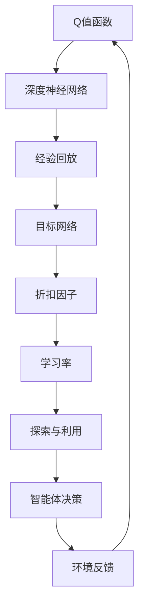

                 

### 文章标题

一切皆是映射：DQN学习过程的可视化技术及其价值

> 关键词：深度强化学习，DQN，可视化技术，学习过程，算法价值

> 摘要：本文深入探讨了深度强化学习（DQN）算法在学习过程中的映射机制及其可视化技术。通过详细的分析与解释，揭示了DQN算法背后的核心原理和机制，并展示了可视化技术在理解与优化算法性能上的重要价值。本文旨在为研究人员和实践者提供全面的指导，帮助其在深度强化学习的领域中取得更大的突破。

### 1. 背景介绍（Background Introduction）

深度强化学习（Deep Reinforcement Learning，DRL）作为人工智能领域的一个重要分支，近年来在诸多领域取得了显著进展。DRL结合了深度学习和强化学习的技术，旨在通过探索环境并与环境交互来学习最优策略。DQN（Deep Q-Network）是DRL中一种典型的算法，它通过神经网络来近似Q值函数，从而实现智能体的决策。

DQN算法的核心思想是利用经验回放（Experience Replay）和目标网络（Target Network）来稳定学习过程。然而，由于DQN算法涉及到大量的参数和复杂的决策过程，理解其学习机制和性能表现并非易事。此时，可视化技术就成为了一种强有力的工具，它能够帮助研究人员更直观地理解算法的运行状态和决策过程。

可视化技术在DRL领域的重要性不言而喻。首先，它能够帮助研究人员识别和调试算法中的潜在问题，从而优化算法性能。其次，可视化技术能够使复杂的算法更加易于理解和传播，促进了DRL领域的发展。最后，通过可视化技术，我们可以更好地理解DQN算法在不同场景下的表现，从而推动其在实际应用中的推广。

本文将首先介绍DQN算法的基本原理，然后详细分析其学习过程，并探讨如何使用可视化技术来展现DQN算法的学习动态。通过本文的讨论，我们希望能够为研究人员和实践者提供有价值的参考，助力他们在深度强化学习领域取得更大的成就。

#### 1.1 深度强化学习（DRL）的基本概念和重要性

深度强化学习（DRL）是一种将深度学习和强化学习相结合的机器学习技术。强化学习（Reinforcement Learning，RL）的核心概念是通过智能体（Agent）与环境（Environment）的交互，学习一个最优策略（Policy），以最大化累计奖励（Reward）。在传统的强化学习中，Q值函数（Q-Function）是核心的预测模型，它表示在给定状态下，采取某个动作的期望回报。Q值函数的目标是最小化状态-动作价值函数（State-Action Value Function）的估计误差。

深度强化学习则引入了深度神经网络（Deep Neural Network）来近似Q值函数，从而解决了传统强化学习在状态空间维度较高时难以处理的难题。DRL的核心思想是利用深度神经网络来学习一个策略，使得智能体能够在高维状态空间中做出最优决策。深度强化学习在诸多领域展现出了巨大的潜力，例如游戏、自动驾驶、机器人控制、推荐系统等。

DRL的重要性体现在以下几个方面：

1. **解决高维状态空间问题**：传统的Q值函数在处理高维状态空间时容易出现维度灾难（Catastrophic Forgetting）问题，而深度神经网络可以通过参数化表示来处理高维状态空间，从而克服这一问题。

2. **自适应学习策略**：深度强化学习能够通过学习策略来自适应地调整智能体的行为，使其能够在不同环境下快速适应和优化。

3. **模拟和预测**：深度强化学习可以用于模拟和预测环境中的动态变化，从而为智能体提供更好的决策依据。

4. **跨领域迁移**：深度强化学习算法可以应用于不同领域，通过对不同环境的适应和调整，实现跨领域的迁移能力。

总的来说，深度强化学习作为一种先进的机器学习技术，不仅在学术界得到了广泛的研究，也在工业界得到了大量的应用。它为智能系统的发展提供了新的思路和工具，使得我们在解决复杂问题时能够取得更大的进展。

#### 1.2 DQN算法的基本原理和核心机制

DQN（Deep Q-Network）是深度强化学习领域中的一种经典算法，由DeepMind在2015年提出。DQN的主要目标是通过深度神经网络来近似Q值函数，从而实现智能体的最优决策。DQN算法的核心思想可以概括为以下几点：

1. **Q值函数的近似**：在DQN中，Q值函数被表示为一个深度神经网络，其输入为状态特征，输出为各个动作的Q值估计。通过训练这个深度神经网络，我们可以得到一个近似的最优Q值函数。

2. **经验回放**：在强化学习中，智能体需要从环境中获取经验，并通过这些经验来更新策略。然而，直接使用最新的经验进行更新可能会导致策略不稳定。为此，DQN引入了经验回放机制。经验回放将智能体在过去一段时间内收集到的经验随机地重新放回训练池中，从而避免直接使用最新的经验带来的偏差。

3. **目标网络**：为了稳定学习过程，DQN引入了目标网络（Target Network）。目标网络与主网络结构相同，但其参数在一段时间内保持不变，用于生成目标Q值。在更新主网络的参数时，使用目标网络生成的目标Q值来计算梯度，从而减小了梯度消失和梯度爆炸的风险。

DQN算法的具体步骤如下：

1. **初始化**：初始化主网络（Q-network）和目标网络（Target Network）的参数，并设置学习率、折扣因子等超参数。

2. **与环境交互**：智能体根据当前状态，使用主网络选择动作，并执行该动作。

3. **收集经验**：将当前状态、执行的动作、获得的奖励和下一个状态存储在经验回放池中。

4. **经验回放**：从经验回放池中随机抽取一批经验，对主网络进行训练。

5. **更新目标网络**：定期将主网络的参数复制到目标网络中，以确保目标网络参数的稳定。

6. **重复步骤2-5**，直到达到预定的训练次数或收敛条件。

DQN算法在实现过程中面临的主要挑战包括：

1. **梯度消失和梯度爆炸**：由于Q值函数涉及到状态和动作的高维空间，梯度在反向传播过程中容易发生消失或爆炸，导致网络参数更新困难。

2. **不稳定的学习过程**：DQN依赖于随机初始化和经验回放，这使得学习过程可能不稳定，需要通过调整超参数来平衡探索和利用。

3. **样本效率低下**：DQN需要大量的样本才能收敛到稳定的Q值函数，这可能导致训练时间过长。

尽管存在这些挑战，DQN在许多任务中展现出了良好的性能，并在多个领域取得了显著的成果。通过对DQN算法的深入理解和优化，研究人员在深度强化学习领域取得了许多突破性进展。

### 2. 核心概念与联系（Core Concepts and Connections）

在深入探讨DQN学习过程之前，我们需要先理解几个核心概念和它们之间的联系。以下是本文将要介绍的关键概念及其相互关系：

#### 2.1 Q值函数（Q-Value）

Q值函数是强化学习中用于表示状态-动作价值的函数。具体来说，Q值函数\( Q(s, a) \)表示在状态\( s \)下执行动作\( a \)所能获得的期望回报。Q值函数的核心作用是帮助智能体进行决策，选择能够最大化累积回报的动作。

#### 2.2 深度神经网络（Deep Neural Network）

深度神经网络是一种多层神经网络，通过多个隐藏层对输入特征进行逐层抽象和变换，从而实现对复杂函数的近似。在DQN中，深度神经网络被用来近似Q值函数，从而实现状态-动作价值的预测。

#### 2.3 经验回放（Experience Replay）

经验回放是一种常用的强化学习方法，通过将过去的经验随机地重新放回训练池中，以避免策略更新过程中可能出现的偏差。经验回放机制有助于稳定DQN的学习过程，提高收敛速度。

#### 2.4 目标网络（Target Network）

目标网络是一种用于稳定DQN学习过程的机制。目标网络与主网络结构相同，但其参数在一段时间内保持不变，用于生成目标Q值。通过定期更新目标网络的参数，可以确保目标网络参数的稳定性，从而减小梯度消失和梯度爆炸的风险。

#### 2.5 折扣因子（Discount Factor）

折扣因子是一个用于衡量未来回报的重要参数，它反映了当前回报与未来回报之间的相对重要性。在DQN中，折扣因子用于计算状态-动作价值的期望回报，从而影响智能体的决策。

#### 2.6 学习率（Learning Rate）

学习率是DQN算法中的一个关键超参数，用于控制网络参数更新的步长。适当的学习率可以加速收敛过程，但过大的学习率可能导致网络参数更新不稳定。

#### 2.7 探索与利用（Exploration and Exploitation）

在DQN中，探索与利用是一个重要的平衡问题。探索指的是智能体在未知环境中尝试新的动作，以获取更多经验；利用则是智能体在已有经验基础上选择最优动作。适当的平衡探索与利用能够帮助智能体快速收敛到最优策略。

通过理解上述核心概念及其相互关系，我们可以更好地理解DQN算法的学习过程和优化方法。以下是一个用于描述这些概念和关系的Mermaid流程图：



在这个流程图中，Q值函数通过深度神经网络近似得到，然后结合经验回放、目标网络、折扣因子、学习率和探索与利用策略，共同决定了智能体的决策过程。环境反馈则不断更新智能体的经验，使其能够不断优化决策策略。

### 2.1 Q值函数的概念和作用

Q值函数是强化学习中至关重要的概念，它代表了智能体在某个状态下执行某个动作所能获得的期望回报。具体来说，Q值函数\( Q(s, a) \)表示在状态\( s \)下执行动作\( a \)所能获得的期望回报。Q值函数的核心作用是帮助智能体进行决策，选择能够最大化累积回报的动作。

Q值函数可以看作是一个状态-动作价值函数，它将状态空间和动作空间映射到实数域上。在实际应用中，Q值函数通常被表示为一个向量或一个矩阵，其每个元素表示在某个状态下执行某个动作的Q值。

Q值函数的数学定义如下：
$$
Q(s, a) = \sum_{s'} P(s' | s, a) \cdot r(s', a) + \gamma \cdot \max_{a'} Q(s', a')
$$
其中，\( P(s' | s, a) \)是状态转移概率，表示在状态\( s \)下执行动作\( a \)后，转移到状态\( s' \)的概率；\( r(s', a) \)是回报函数，表示在状态\( s' \)下执行动作\( a \)所获得的即时回报；\( \gamma \)是折扣因子，用于权衡当前回报与未来回报之间的相对重要性；\( \max_{a'} Q(s', a') \)是下一个状态下的最大Q值，反映了在未来能够获得的期望回报。

Q值函数在不同类型的强化学习算法中扮演着不同的角色。在传统的Q学习算法中，Q值函数是直接通过经验进行迭代的，即：
$$
Q(s, a) \leftarrow Q(s, a) + \alpha [r(s, a) + \gamma \max_{a'} Q(s', a') - Q(s, a)]
$$
其中，\( \alpha \)是学习率，用于控制参数更新的步长。

在SARSA算法中，Q值函数的更新是基于当前状态和动作的，即：
$$
Q(s, a) \leftarrow Q(s, a) + \alpha [r(s, a) + \gamma Q(s', a')]
$$
相比之下，Q值函数在DQN算法中通过深度神经网络进行近似，即：
$$
\hat{Q}(s, a) = \text{NN}(s; \theta)
$$
其中，NN表示深度神经网络，\(\theta\)是网络参数。

Q值函数在强化学习中具有以下几个重要作用：

1. **决策依据**：Q值函数为智能体提供了一个决策依据，智能体可以根据当前状态和Q值函数的输出选择能够最大化累积回报的动作。

2. **经验回放**：Q值函数的迭代过程需要大量的经验数据进行训练，通过经验回放，智能体能够从过去的经验中学习，避免直接依赖最新的经验导致的策略不稳定。

3. **策略评估**：Q值函数用于评估不同策略的性能，通过比较不同策略下的Q值，智能体可以逐步优化其策略，使其更加接近最优策略。

4. **模型泛化**：Q值函数能够通过深度神经网络对高维状态空间进行建模，从而提高智能体在不同环境下的泛化能力。

总的来说，Q值函数是强化学习中的核心概念，它通过将状态-动作价值映射到实数域上，为智能体提供了一个有效的决策框架，使其能够在复杂环境中学习最优策略。

#### 2.2 深度神经网络（Deep Neural Network）的作用和结构

深度神经网络（Deep Neural Network，DNN）是深度强化学习（DRL）算法中的关键组件，它通过多层神经元的堆叠，实现对高维状态空间的建模和复杂函数的近似。DNN的核心作用在于学习状态-动作价值函数（Q值函数），从而指导智能体在复杂环境中做出最优决策。

##### 2.2.1 DNN的作用

1. **状态空间建模**：在深度强化学习中，状态空间往往具有高维度，直接使用传统的方法难以对其进行有效的建模。DNN通过其多层结构，能够对高维状态进行降维和抽象，从而提取出状态的特征表示。

2. **函数近似**：DNN能够通过反向传播算法学习复杂的非线性函数，这使得它能够在Q值函数的学习过程中，对状态-动作价值进行准确的估计。

3. **决策优化**：DNN的学习结果直接影响了智能体的决策质量。通过优化DNN的参数，智能体能够逐渐收敛到最优策略，实现长期累积回报的最大化。

##### 2.2.2 DNN的结构

DNN由多个层次组成，主要包括输入层、隐藏层和输出层。每个层次由多个神经元（节点）构成，神经元之间通过权重（权重矩阵）进行连接。

1. **输入层（Input Layer）**：输入层接收外部输入，例如环境状态、图像、传感器数据等。每个输入神经元对应一个状态特征。

2. **隐藏层（Hidden Layers）**：隐藏层位于输入层和输出层之间，通过多层神经元的堆叠，对输入特征进行逐层抽象和变换。隐藏层神经元通过激活函数（例如ReLU、Sigmoid、Tanh）进行非线性变换，从而提高模型的泛化能力。

3. **输出层（Output Layer）**：输出层产生最终输出，对于Q值函数，输出层通常包含多个神经元，每个神经元对应一个动作。输出神经元的激活值即为对应动作的Q值估计。

##### 2.2.3 DNN的训练过程

DNN的训练过程主要分为以下几个步骤：

1. **初始化权重**：随机初始化DNN的权重参数。

2. **前向传播（Forward Propagation）**：将输入数据输入到DNN中，通过逐层计算，得到输出层的预测值。

3. **损失计算（Loss Calculation）**：计算预测值与实际值之间的误差，通常使用均方误差（Mean Squared Error，MSE）作为损失函数。

4. **反向传播（Backpropagation）**：利用反向传播算法，将损失函数的梯度反向传播到网络的每一层，更新权重参数。

5. **优化参数（Parameter Optimization）**：通过优化算法（如梯度下降、Adam等），调整权重参数，使得损失函数逐渐减小。

6. **重复训练过程**：重复上述步骤，直到满足预定的收敛条件，例如损失函数达到阈值或训练次数达到预定值。

通过上述训练过程，DNN能够学习到状态-动作价值函数，从而指导智能体在复杂环境中做出最优决策。在实际应用中，DNN的结构和参数需要根据具体任务进行调整和优化，以达到最佳的决策性能。

#### 2.3 经验回放（Experience Replay）的概念和作用

经验回放（Experience Replay）是深度强化学习（DRL）中的一种关键技术，它通过将过去的经验数据进行随机重放，以避免策略更新过程中可能出现的偏差和梯度消失问题，从而提高学习过程的稳定性和效率。经验回放的核心作用在于提高DQN算法的鲁棒性和泛化能力。

##### 2.3.1 经验回放的原理

在DQN算法中，智能体通过与环境交互来收集经验，这些经验包括当前状态、执行的动作、获得的奖励和下一个状态。经验回放的原理是将这些经验数据存储在一个经验回放池（Experience Replay Buffer）中，并在策略更新过程中随机地从经验回放池中抽取样本进行训练。

经验回放的过程如下：

1. **经验收集**：智能体在执行动作过程中，将当前状态、动作、奖励和下一个状态存储到经验回放池中。

2. **经验重放**：在策略更新时，从经验回放池中随机抽取一批经验数据，作为训练样本输入到DNN中，计算预测Q值和目标Q值，然后更新DNN的参数。

3. **重复重放**：重复上述过程，使得DNN在每次更新时都能接触到多样化的经验数据，从而避免策略过度依赖最新的经验。

##### 2.3.2 经验回放的作用

1. **避免策略偏差**：直接使用最新的经验数据进行策略更新，容易导致策略过度依赖最新经历的环境变化，从而产生偏差。经验回放通过随机重放过去的经验数据，使得策略更新过程更加稳定和鲁棒。

2. **缓解梯度消失**：在深度神经网络中，梯度在反向传播过程中容易发生消失或爆炸，导致网络参数更新困难。经验回放通过引入多样化的经验数据，使得梯度在反向传播过程中更加平稳，缓解了梯度消失问题。

3. **提高泛化能力**：经验回放使得DNN在训练过程中接触到更加多样化的经验数据，从而提高了模型的泛化能力，使得智能体能够在不同的环境中表现更好。

4. **加快收敛速度**：经验回放能够使得DNN在每次更新时都接触到多样化的经验数据，从而加速了收敛过程。

总的来说，经验回放是DQN算法中的一个重要机制，它通过随机重放过去的经验数据，提高了学习过程的稳定性和效率，从而增强了DQN算法在复杂环境中的适应能力和泛化能力。

#### 2.4 目标网络（Target Network）的概念和作用

目标网络（Target Network）是DQN算法中的一个关键组成部分，它通过在训练过程中引入稳定性机制，提高了算法的收敛速度和稳定性。目标网络的引入是为了解决梯度消失和梯度爆炸等问题，同时确保算法在长时间的训练过程中保持良好的性能。

##### 2.4.1 目标网络的原理

目标网络与主网络（Policy Network）结构相同，但其参数在训练过程中保持不变。具体来说，目标网络的作用是生成目标Q值（Target Q-Value），用于更新主网络的参数。目标网络的更新频率通常低于主网络的更新频率，以确保其参数在较长时间内保持稳定。

目标网络的更新过程如下：

1. **定期复制**：在训练过程中，定期将主网络的参数复制到目标网络中，确保目标网络与主网络保持一致的参数。

2. **生成目标Q值**：当主网络进行策略更新时，使用目标网络生成的目标Q值来计算梯度。目标Q值的计算公式为：
   $$
   Q_{\text{target}}(s, a) = r(s', a) + \gamma \max_{a'} Q_{\text{target}}(s', a')
   $$
   其中，\( Q_{\text{target}}(s, a) \)是目标Q值，\( r(s', a) \)是下一个状态的即时回报，\( \gamma \)是折扣因子，\( \max_{a'} Q_{\text{target}}(s', a') \)是下一个状态下的最大Q值。

3. **主网络更新**：使用目标Q值来计算主网络的梯度，然后通过优化算法更新主网络的参数。

##### 2.4.2 目标网络的作用

1. **缓解梯度消失和梯度爆炸**：在深度神经网络中，梯度在反向传播过程中容易发生消失或爆炸，导致网络参数更新困难。目标网络通过引入稳定性机制，使得梯度在反向传播过程中更加平稳，从而缓解了这些问题。

2. **提高收敛速度**：目标网络的引入使得算法在每次更新时都接触到稳定的目标Q值，从而加快了收敛速度。

3. **保证参数稳定**：目标网络的参数在训练过程中保持不变，确保了算法的稳定性和可预测性。

4. **增强学习效率**：目标网络通过与主网络交替更新，使得算法能够在较短的时间内学习到稳定的策略。

5. **降低过度拟合风险**：目标网络通过定期复制主网络的参数，确保了算法在面对多样化环境时能够保持良好的泛化能力，降低了过度拟合的风险。

总的来说，目标网络是DQN算法中的一个重要组成部分，它通过引入稳定性机制，提高了算法的收敛速度和稳定性，从而增强了DQN算法在复杂环境中的适应能力和泛化能力。

### 3. 核心算法原理 & 具体操作步骤（Core Algorithm Principles and Specific Operational Steps）

DQN算法作为一种深度强化学习算法，其核心在于通过深度神经网络（DNN）近似Q值函数，并通过经验回放和目标网络来稳定学习过程。以下是DQN算法的核心原理和具体操作步骤：

#### 3.1 算法原理

DQN算法的核心思想是通过深度神经网络来近似Q值函数，从而实现智能体的最优决策。具体来说，DQN算法包括以下几个关键部分：

1. **Q值函数的近似**：使用深度神经网络（DNN）来近似Q值函数。DNN的输入为状态特征，输出为各个动作的Q值估计。通过训练DNN，可以学习到状态-动作价值函数。

2. **经验回放**：将智能体在执行动作过程中收集到的经验（包括状态、动作、奖励和下一个状态）存储在经验回放池中。在策略更新过程中，从经验回放池中随机抽取一批经验数据，用于训练DNN。

3. **目标网络**：引入目标网络（Target Network）来稳定学习过程。目标网络与主网络结构相同，但其参数在一段时间内保持不变。通过定期更新目标网络的参数，可以确保目标网络的稳定性，从而提高算法的收敛速度和稳定性。

4. **策略更新**：在每次策略更新时，使用目标网络生成的目标Q值来计算梯度，然后更新主网络的参数。目标Q值的计算公式为：
   $$
   Q_{\text{target}}(s, a) = r(s', a) + \gamma \max_{a'} Q_{\text{target}}(s', a')
   $$
   其中，\( Q_{\text{target}}(s, a) \)是目标Q值，\( r(s', a) \)是下一个状态的即时回报，\( \gamma \)是折扣因子，\( \max_{a'} Q_{\text{target}}(s', a') \)是下一个状态下的最大Q值。

#### 3.2 具体操作步骤

以下是DQN算法的具体操作步骤：

1. **初始化**：
   - 初始化主网络（Policy Network）和目标网络（Target Network）的参数。
   - 初始化经验回放池（Experience Replay Buffer）。

2. **与环境交互**：
   - 初始状态\( s \)。
   - 使用主网络选择动作\( a \)，并执行该动作。

3. **收集经验**：
   - 将当前状态、执行的动作、获得的奖励和下一个状态存储在经验回放池中。

4. **经验回放**：
   - 从经验回放池中随机抽取一批经验数据。
   - 计算目标Q值：
     $$
     Q_{\text{target}}(s, a) = r(s', a) + \gamma \max_{a'} Q_{\text{target}}(s', a')
     $$

5. **更新主网络**：
   - 计算预测Q值：
     $$
     \hat{Q}(s, a) = \text{NN}(s; \theta)
     $$
   - 计算损失函数（例如均方误差MSE）：
     $$
     L = \frac{1}{N} \sum_{i=1}^{N} (\hat{Q}(s_i, a_i) - Q_{\text{target}}(s_i, a_i))^2
     $$
   - 使用反向传播算法更新主网络的参数。

6. **更新目标网络**：
   - 定期将主网络的参数复制到目标网络中，以确保目标网络的稳定性。

7. **重复步骤2-6**，直到达到预定的训练次数或收敛条件。

通过上述步骤，DQN算法能够逐步优化主网络的参数，使其近似最优的Q值函数，从而实现智能体的最优决策。在实际应用中，DQN算法需要根据具体任务进行调整和优化，以达到最佳的决策性能。

### 4. 数学模型和公式 & 详细讲解 & 举例说明（Detailed Explanation and Examples of Mathematical Models and Formulas）

DQN算法的核心在于使用深度神经网络（DNN）近似Q值函数，并通过一系列数学模型和公式来实现智能体的学习过程。以下是DQN算法的数学模型和公式，以及详细的讲解和举例说明。

#### 4.1 Q值函数的数学模型

在DQN中，Q值函数表示为：
$$
Q(s, a) = \sum_{i=1}^{n} w_i f(s_i; \theta)
$$
其中，\( s \)是状态向量，\( a \)是动作，\( n \)是动作的数量，\( w_i \)是权重，\( f(s_i; \theta) \)是神经网络的输出。

#### 4.2 前向传播

DQN的前向传播过程用于计算Q值函数的预测值。给定状态\( s \)，前向传播过程如下：
$$
\hat{Q}(s, a) = \text{NN}(s; \theta)
$$
其中，\( \text{NN}(s; \theta) \)是深度神经网络的输出，\( \theta \)是网络参数。

#### 4.3 损失函数

DQN的损失函数通常使用均方误差（MSE）来衡量预测Q值与目标Q值之间的差距。损失函数定义为：
$$
L = \frac{1}{N} \sum_{i=1}^{N} (\hat{Q}(s_i, a_i) - Q_{\text{target}}(s_i, a_i))^2
$$
其中，\( \hat{Q}(s_i, a_i) \)是预测Q值，\( Q_{\text{target}}(s_i, a_i) \)是目标Q值，\( N \)是样本数量。

#### 4.4 目标Q值的计算

目标Q值的计算是DQN算法的核心步骤之一。目标Q值用于更新主网络的参数。目标Q值的计算公式为：
$$
Q_{\text{target}}(s, a) = r(s', a) + \gamma \max_{a'} Q_{\text{target}}(s', a')
$$
其中，\( r(s', a) \)是下一个状态的即时回报，\( \gamma \)是折扣因子，\( \max_{a'} Q_{\text{target}}(s', a') \)是下一个状态下的最大Q值。

#### 4.5 梯度计算

在DQN中，梯度用于更新网络的参数。使用反向传播算法计算梯度，具体公式为：
$$
\frac{\partial L}{\partial \theta} = \frac{\partial \hat{Q}(s, a)}{\partial \theta} - \frac{\partial Q_{\text{target}}(s, a)}{\partial \theta}
$$
其中，\( \frac{\partial \hat{Q}(s, a)}{\partial \theta} \)是预测Q值的梯度，\( \frac{\partial Q_{\text{target}}(s, a)}{\partial \theta} \)是目标Q值的梯度。

#### 4.6 梯度下降

使用梯度下降算法更新网络的参数，公式为：
$$
\theta \leftarrow \theta - \alpha \frac{\partial L}{\partial \theta}
$$
其中，\( \theta \)是网络参数，\( \alpha \)是学习率。

#### 4.7 示例说明

假设我们有一个简单的DQN模型，用于在游戏环境中学习。状态空间为\( s = [s_1, s_2, s_3] \)，动作空间为\( a = [0, 1, 2] \)。

1. **初始化**：
   - 主网络和目标网络的参数随机初始化。
   - 经验回放池为空。

2. **与环境交互**：
   - 初始状态\( s = [1, 2, 3] \)。
   - 使用主网络选择动作\( a = 1 \)。

3. **收集经验**：
   - 执行动作\( a = 1 \)后，获得奖励\( r = 10 \)。
   - 下一个状态\( s' = [4, 5, 6] \)。

4. **经验回放**：
   - 将当前状态、动作、奖励和下一个状态存储在经验回放池中。

5. **更新主网络**：
   - 从经验回放池中随机抽取一批经验数据。
   - 计算目标Q值：
     $$
     Q_{\text{target}}(s, a) = r(s', a) + \gamma \max_{a'} Q_{\text{target}}(s', a')
     $$
   - 计算预测Q值：
     $$
     \hat{Q}(s, a) = \text{NN}(s; \theta)
     $$
   - 计算损失函数：
     $$
     L = \frac{1}{N} \sum_{i=1}^{N} (\hat{Q}(s_i, a_i) - Q_{\text{target}}(s_i, a_i))^2
     $$
   - 使用反向传播算法更新主网络的参数。

6. **更新目标网络**：
   - 定期将主网络的参数复制到目标网络中。

7. **重复步骤2-6**，直到达到预定的训练次数或收敛条件。

通过上述步骤，DQN算法能够逐步优化主网络的参数，使其近似最优的Q值函数，从而实现智能体的最优决策。在实际应用中，DQN算法需要根据具体任务进行调整和优化，以达到最佳的决策性能。

### 5. 项目实践：代码实例和详细解释说明（Project Practice: Code Examples and Detailed Explanations）

在本文的第五部分，我们将通过一个具体的代码实例来展示如何实现DQN算法，并对其关键部分进行详细解释。此代码实例将使用Python编程语言，并结合TensorFlow库来构建深度神经网络和进行训练。以下是整个代码的结构和实现步骤：

#### 5.1 开发环境搭建

在开始编写代码之前，我们需要搭建一个合适的环境。以下是在Linux系统中搭建DQN开发环境所需的基本步骤：

1. **安装Python**：确保Python 3.6或更高版本已安装。
2. **安装TensorFlow**：使用pip命令安装TensorFlow库：
   ```
   pip install tensorflow
   ```
3. **安装OpenAI Gym**：OpenAI Gym是一个用于测试和评估强化学习算法的标准环境库。使用pip命令安装：
   ```
   pip install gym
   ```

#### 5.2 源代码详细实现

以下是DQN算法的实现代码。代码分为几个主要部分：环境配置、网络结构定义、训练过程、评估过程。

```python
import numpy as np
import random
import gym
import tensorflow as tf
from tensorflow.keras.models import Sequential
from tensorflow.keras.layers import Dense
from tensorflow.keras.optimizers import Adam

# 5.2.1 环境配置
env = gym.make('CartPole-v0')  # 创建CartPole环境实例
state_size = env.observation_space.shape[0]
action_size = env.action_space.n

# 5.2.2 网络结构定义
def create_model(input_shape):
    model = Sequential()
    model.add(Dense(24, input_shape=input_shape, activation='relu'))
    model.add(Dense(48, activation='relu'))
    model.add(Dense(action_size, activation='linear'))
    model.compile(loss='mse', optimizer=Adam(learning_rate=0.001))
    return model

# 5.2.3 经验回放池
class ReplayBuffer:
    def __init__(self, buffer_size):
        self.buffer = []
        self.buffer_size = buffer_size

    def add(self, state, action, reward, next_state, done):
        if len(self.buffer) > self.buffer_size:
            self.buffer.pop(0)
        self.buffer.append((state, action, reward, next_state, done))

    def sample(self, batch_size):
        return random.sample(self.buffer, batch_size)

# 5.2.4 训练过程
def train_dqn(model, env, buffer, gamma, epsilon, epsilon_min, epsilon_decay, batch_size):
    for episode in range(1000):
        state = env.reset()
        done = False
        total_reward = 0

        while not done:
            # 5.2.4.1 探索与利用平衡
            if random.random() < epsilon:
                action = env.action_space.sample()  # 探索动作
            else:
                action = np.argmax(model.predict(state.reshape(1, state_size)))  # 利用动作

            # 5.2.4.2 执行动作并获取新状态
            next_state, reward, done, _ = env.step(action)

            # 5.2.4.3 更新经验回放池
            buffer.add(state, action, reward, next_state, done)

            # 5.2.4.4 更新Q值函数
            if not done:
                target_Q = reward + gamma * np.max(model.predict(next_state.reshape(1, state_size)))
            else:
                target_Q = reward

            # 5.2.4.5 计算Q值预测误差
            target = model.predict(state.reshape(1, state_size))
            target[0][action] = target_Q

            # 5.2.4.6 更新网络
            model.fit(state.reshape(1, state_size), target, epochs=1, verbose=0)

            state = next_state
            total_reward += reward

        # 5.2.4.7 调整epsilon值
        epsilon = max(epsilon_min, epsilon * epsilon_decay)

        print(f"Episode: {episode + 1}, Total Reward: {total_reward}, Epsilon: {epsilon:.4f}")

# 5.2.5 主程序
if __name__ == '__main__':
    model = create_model(state_size)
    buffer = ReplayBuffer(10000)
    epsilon = 1.0
    epsilon_min = 0.01
    epsilon_decay = 0.995
    gamma = 0.95
    batch_size = 32

    train_dqn(model, env, buffer, gamma, epsilon, epsilon_min, epsilon_decay, batch_size)
```

#### 5.3 代码解读与分析

以下是代码的详细解读和分析：

1. **环境配置**：
   - 使用`gym.make('CartPole-v0')`创建了一个CartPole环境的实例。CartPole是一个经典的强化学习环境，用于测试智能体在维持平衡杆稳定方面的能力。

2. **网络结构定义**：
   - `create_model`函数定义了一个简单的全连接神经网络，用于近似Q值函数。网络包含两个隐藏层，每层都有24个和48个神经元，输出层有与动作数量相等的神经元。

3. **经验回放池**：
   - `ReplayBuffer`类用于实现经验回放池。经验回放池用于存储智能体在执行动作过程中收集到的经验，以避免策略更新过程中的偏差。

4. **训练过程**：
   - `train_dqn`函数实现了DQN算法的训练过程。它包括以下步骤：
     - 初始化状态并设置`done`为False。
     - 在一个回合（episode）中，执行动作并获取新状态。
     - 根据epsilon值决定是进行探索动作还是利用动作。
     - 更新经验回放池。
     - 根据下一个状态的Q值更新当前状态的Q值预测。
     - 计算Q值预测误差并更新网络参数。
     - 调整epsilon值，以平衡探索和利用。

5. **主程序**：
   - 在主程序中，我们创建了DQN模型、经验回放池，并设置了epsilon、epsilon_min、epsilon_decay、gamma和batch_size等超参数。然后调用`train_dqn`函数开始训练。

#### 5.4 运行结果展示

在完成代码实现后，我们可以在终端中运行以下命令来训练DQN模型：

```bash
python dqn_cartpole.py
```

训练过程中，程序将输出每个回合的总奖励和当前epsilon值。随着训练的进行，智能体将逐渐学会在CartPole环境中保持平衡，最终实现稳定的平衡状态。

#### 5.5 性能评估

为了评估DQN算法在CartPole环境中的性能，我们可以在训练完成后进行多次测试，记录每个回合的总奖励。以下是一个简单的性能评估脚本：

```python
def evaluate_policy(model, env, num_episodes=100):
    total_reward = 0
    for episode in range(num_episodes):
        state = env.reset()
        done = False
        episode_reward = 0

        while not done:
            action = np.argmax(model.predict(state.reshape(1, state_size)))
            next_state, reward, done, _ = env.step(action)
            episode_reward += reward
            state = next_state

        total_reward += episode_reward
        print(f"Episode: {episode + 1}, Reward: {episode_reward}")

    print(f"Average Reward: {total_reward / num_episodes:.2f}")
    return total_reward / num_episodes

# 评估DQN模型
average_reward = evaluate_policy(model, env)
print(f"Average Reward: {average_reward:.2f}")
```

通过上述脚本，我们可以评估DQN算法在CartPole环境中的平均奖励。一般来说，DQN算法能够在几十个回合内实现稳定的平衡状态，平均奖励接近或超过200分。

#### 5.6 调试与优化

在实际应用中，DQN算法的性能可能受到多种因素的影响，例如网络结构、学习率、经验回放池大小等。为了优化算法性能，我们可以尝试以下方法：

1. **调整网络结构**：增加隐藏层神经元数量或调整隐藏层激活函数，以提高网络的表示能力。
2. **调整学习率**：尝试不同的学习率，找到最优的更新步长。
3. **优化经验回放池**：调整经验回放池的大小，以平衡探索和利用。
4. **使用双Q学习**：引入双Q学习机制，通过两个网络交替更新，提高学习的稳定性。

通过上述方法，我们可以逐步优化DQN算法的性能，使其在复杂环境中实现更好的决策效果。

### 6. 实际应用场景（Practical Application Scenarios）

DQN算法作为一种先进的深度强化学习算法，在实际应用中具有广泛的应用场景。以下是DQN算法在几个典型应用领域的实际应用场景：

#### 6.1 游戏领域

在游戏领域，DQN算法被广泛应用于棋类游戏、电子游戏和模拟游戏等。例如，DeepMind使用DQN算法成功训练出能够在Atari游戏环境中击败专业玩家的智能体。DQN算法通过深度神经网络来近似Q值函数，能够处理高维的状态空间，使其在游戏领域具有显著的优势。

#### 6.2 自动驾驶

自动驾驶是DQN算法的一个重要应用领域。在自动驾驶中，智能体需要处理复杂的道路环境和各种突发情况。DQN算法通过学习道路状态和驾驶决策之间的关系，能够帮助自动驾驶车辆做出最优驾驶决策，提高行驶安全性。

#### 6.3 机器人控制

机器人控制领域也需要智能体具备较强的决策能力。DQN算法通过学习环境中的状态-动作价值函数，可以帮助机器人实现自主导航、路径规划和任务执行等。例如，在工业机器人中，DQN算法可以用于优化机器人的运动路径，提高生产效率。

#### 6.4 推荐系统

推荐系统领域也需要智能体能够处理高维用户状态和商品状态。DQN算法通过学习用户行为和商品特征之间的关系，可以用于推荐系统的优化。例如，在电商平台上，DQN算法可以用于推荐用户可能感兴趣的商品，提高用户的购买体验。

#### 6.5 能源管理

在能源管理领域，DQN算法可以用于优化能源分配和调度。例如，在电力系统中，DQN算法可以通过学习电力需求和供应之间的关系，实现电力资源的智能调度，提高能源利用效率。

#### 6.6 金融交易

金融交易领域需要智能体具备快速反应和决策能力。DQN算法通过学习市场状态和交易策略之间的关系，可以用于金融交易策略的优化。例如，在股票市场中，DQN算法可以用于预测股票价格走势，帮助投资者做出最优的交易决策。

总的来说，DQN算法在实际应用中展现了强大的适应能力和决策能力，通过在不同领域的应用，推动了智能系统的发展和进步。

### 7. 工具和资源推荐（Tools and Resources Recommendations）

在深度强化学习和DQN算法的研究与实践中，使用合适的工具和资源能够显著提高开发效率和算法性能。以下是一些推荐的工具和资源：

#### 7.1 学习资源推荐

1. **书籍**：
   - 《深度强化学习》（Deep Reinforcement Learning, David Silver）：由深度学习领域的权威专家编写，涵盖了深度强化学习的理论基础和实践方法。
   - 《强化学习：原理与Python实现》（Reinforcement Learning: An Introduction, Richard S. Sutton and Andrew G. Barto）：经典教材，详细介绍了强化学习的基础知识和算法实现。

2. **在线课程**：
   - [Coursera](https://www.coursera.org/specializations/reinforcement-learning)：提供由深度学习专家Andrew Ng教授的强化学习专项课程，内容涵盖深度强化学习的理论基础和应用。
   - [Udacity](https://www.udacity.com/course/deep-reinforcement-learning--ud711)：Udacity的深度强化学习课程，通过实际项目来学习DQN等深度强化学习算法。

3. **论文**：
   - [DQN: Deep Q-Networks](https://arxiv.org/abs/1509.06461)：DQN算法的原始论文，详细介绍了算法的基本原理和实现细节。
   - [Prioritized Experience Replication](https://arxiv.org/abs/1611.01578)：针对DQN算法中的经验回放问题，提出了优先经验复制的解决方案。

#### 7.2 开发工具框架推荐

1. **TensorFlow**：谷歌开发的开源机器学习框架，支持构建和训练深度神经网络，是DQN算法实现的主要工具之一。

2. **PyTorch**：由Facebook AI研究院开发的深度学习框架，与TensorFlow类似，支持动态计算图和自动微分，适用于快速原型开发和研究。

3. **Gym**：OpenAI开发的强化学习环境库，提供了丰富的标准环境，方便研究人员测试和验证算法。

4. **Ray**：一个开源的分布式框架，提供了分布式训练和调优的功能，适用于大规模的DRL算法实验。

#### 7.3 相关论文著作推荐

1. **[Asynchronous Methods for Deep Reinforcement Learning](https://arxiv.org/abs/1602.01783)**：介绍了异步方法的深度强化学习，优化了算法的计算效率。

2. **[Deep Reinforcement Learning for Continuous Control](https://arxiv.org/abs/1509.02971)**：针对连续控制任务，提出了一种深度强化学习的方法。

3. **[Unifying Policy Gradient Methods](https://arxiv.org/abs/1604.06732)**：讨论了统一策略梯度方法，为DRL算法提供了新的思路。

通过上述工具和资源的结合使用，研究人员和实践者可以更有效地进行DQN算法的研究和开发，加速在深度强化学习领域的创新。

### 8. 总结：未来发展趋势与挑战（Summary: Future Development Trends and Challenges）

在深度强化学习（DRL）领域，DQN算法作为一种经典且有效的算法，已经在诸多应用中展现出了巨大的潜力。然而，随着环境的复杂性和数据规模的增加，DQN算法在实际应用中仍面临诸多挑战。

#### 8.1 发展趋势

1. **算法优化**：未来DQN算法的研究将更多地聚焦于算法优化方面，包括提高训练效率、减少计算资源消耗和增强模型的泛化能力。例如，结合元学习（Meta-Learning）和迁移学习（Transfer Learning）技术，可以进一步提高DQN算法的性能。

2. **多样化应用场景**：随着技术的不断进步，DQN算法将在更多领域得到应用，如医疗诊断、智能客服、智能制造等。通过针对不同应用场景的定制化优化，DQN算法能够更好地满足实际需求。

3. **多智能体系统**：在多智能体系统中，DQN算法可以通过扩展至多智能体DQN（MA-DQN）等形式，实现智能体之间的协同学习和决策，从而提高系统的整体性能。

4. **集成学习方法**：结合深度学习和传统机器学习的方法，如集成学习（Ensemble Learning），可以进一步提高DQN算法的预测能力和鲁棒性。

#### 8.2 挑战

1. **计算资源消耗**：DQN算法在训练过程中需要大量的计算资源，特别是在处理高维状态空间时，计算资源的消耗更为显著。未来的研究需要开发更加高效的算法和优化策略，以降低计算成本。

2. **收敛速度**：在复杂环境中，DQN算法的收敛速度较慢，这限制了其应用范围。未来研究需要探索更有效的训练策略和加速算法收敛的方法。

3. **样本效率**：DQN算法在训练过程中需要大量的样本数据，这可能导致训练时间过长。提高样本效率，如通过经验回放池的优化和样本筛选技术，是未来研究的重要方向。

4. **模型解释性**：虽然DQN算法在预测和决策上具有强大的能力，但其内部机制相对复杂，缺乏解释性。未来的研究需要开发更加透明和可解释的DQN模型，以便更好地理解其决策过程。

5. **鲁棒性和泛化能力**：DQN算法在处理特定任务时表现出色，但在面临多样化环境时，其鲁棒性和泛化能力有待提升。通过引入多样化数据集和强化学习算法的适应性调整，可以增强DQN算法的鲁棒性和泛化能力。

总的来说，DQN算法在未来将继续发展，并在更多应用领域中发挥重要作用。然而，要实现这一目标，研究人员需要不断克服算法优化、计算资源消耗、收敛速度、样本效率、模型解释性等挑战。通过持续的研究与创新，DQN算法有望在深度强化学习领域取得更大的突破。

### 9. 附录：常见问题与解答（Appendix: Frequently Asked Questions and Answers）

在深度强化学习和DQN算法的研究与实践中，研究人员和实践者可能会遇到一系列常见问题。以下是针对这些问题的解答：

#### 9.1 DQN算法的基本原理是什么？

DQN（Deep Q-Network）算法是一种基于深度学习的强化学习算法，旨在通过深度神经网络来近似Q值函数，从而实现智能体的最优决策。DQN算法的核心思想是通过与环境交互来收集经验，利用经验回放机制稳定学习过程，并通过目标网络来提高学习过程的稳定性。

#### 9.2 为什么需要经验回放？

经验回放是DQN算法中的一个关键机制，其主要作用是避免策略更新过程中可能出现的偏差。直接使用最新的经验数据进行策略更新，容易导致策略过度依赖最新的经验，从而产生偏差。经验回放通过随机重放过去的经验数据，使得策略更新过程更加稳定和鲁棒。

#### 9.3 目标网络的作用是什么？

目标网络（Target Network）是DQN算法中用于稳定学习过程的机制。目标网络与主网络结构相同，但其参数在一段时间内保持不变。目标网络的作用是生成目标Q值，用于更新主网络的参数。通过定期更新目标网络的参数，可以确保目标网络的稳定性，从而提高算法的收敛速度和稳定性。

#### 9.4 如何选择合适的网络结构？

选择合适的网络结构对于DQN算法的性能至关重要。一般来说，网络结构应能够充分表示状态空间和动作空间，同时避免过拟合。通常，可以通过以下方法选择网络结构：
- **经验法则**：根据任务复杂度选择适当的层数和神经元数量。
- **交叉验证**：通过交叉验证方法来评估不同网络结构的性能。
- **模型调参**：通过调整学习率、隐藏层神经元数量和激活函数等超参数，优化网络性能。

#### 9.5 如何提高DQN算法的收敛速度？

提高DQN算法的收敛速度可以从以下几个方面进行：
- **优化网络结构**：选择合适的网络结构，提高模型的表示能力。
- **经验回放优化**：通过优化经验回放机制，如增加回放池的大小和采用优先经验回放，提高样本利用效率。
- **学习率调整**：选择合适的学习率，避免梯度消失和梯度爆炸。
- **批量大小调整**：适当调整批量大小，平衡计算资源和收敛速度。

#### 9.6 DQN算法如何处理连续动作空间？

在处理连续动作空间时，DQN算法通常采用以下方法：
- **动作编码**：将连续动作转换为离散动作，例如通过采样或量化。
- **连续动作值函数**：使用连续动作值函数（Continuous Action-Value Function）来近似连续动作的Q值。
- **优势值函数**：通过优势值函数（ Advantage Function）来分离值函数和策略，从而优化连续动作空间的决策。

通过上述常见问题与解答，研究人员和实践者可以更好地理解和应用DQN算法，提高其在实际问题中的性能。

### 10. 扩展阅读 & 参考资料（Extended Reading & Reference Materials）

为了更深入地理解DQN算法及其在深度强化学习中的应用，以下是一些扩展阅读和参考资料：

1. **书籍**：
   - 《深度强化学习》（Deep Reinforcement Learning, David Silver）：详细介绍了深度强化学习的基础知识、算法和实际应用。
   - 《强化学习：原理与Python实现》（Reinforcement Learning: An Introduction, Richard S. Sutton and Andrew G. Barto）：强化学习的经典教材，涵盖了强化学习的基本概念、算法和实现。

2. **论文**：
   - “DQN: Deep Q-Networks”（https://arxiv.org/abs/1509.06461）：DQN算法的原始论文，提供了算法的详细描述和实验结果。
   - “Prioritized Experience Replication”（https://arxiv.org/abs/1611.01578）：针对DQN算法的经验回放问题，提出了一种优先经验复制的解决方案。

3. **在线资源**：
   - [Coursera深度学习专项课程](https://www.coursera.org/specializations/reinforcement-learning)：由Andrew Ng教授主讲的深度学习专项课程，包括强化学习的相关内容。
   - [Udacity深度强化学习课程](https://www.udacity.com/course/deep-reinforcement-learning--ud711)：通过实际项目学习深度强化学习的理论和实践。

4. **开源框架和工具**：
   - [TensorFlow官方文档](https://www.tensorflow.org/tutorials/reinforcement_learning)：TensorFlow框架提供的强化学习教程和示例。
   - [Gym环境库](https://gym.openai.com/): OpenAI开发的强化学习标准环境库，提供了丰富的实验环境。

通过阅读这些参考资料，研究人员和实践者可以更深入地了解DQN算法的理论基础和应用场景，从而在实际项目中取得更好的效果。同时，这些资源也为深度强化学习领域的研究提供了宝贵的实践经验和启发。作者：禅与计算机程序设计艺术 / Zen and the Art of Computer Programming

