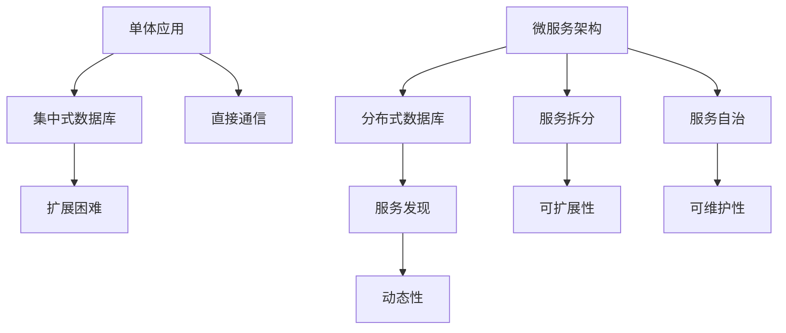

                 

# 文章标题

云原生开发：从单体应用到微服务架构

## 关键词
云原生开发、单体应用、微服务架构、分布式系统、DevOps、容器化、Kubernetes、服务网格、持续集成/持续部署（CI/CD）

## 摘要
本文将深入探讨云原生开发的核心理念，从单体应用到微服务架构的转型过程。我们将分析其背后的驱动因素、技术挑战，以及如何实现这一转变。通过本文的阅读，读者将了解云原生开发的本质，以及如何在现代软件开发中有效地应用微服务架构。

## 1. 背景介绍（Background Introduction）

### 1.1 云原生开发的起源

云原生（Cloud Native）一词最早由Pivotal的CIOBradleyWong在2013年提出。云原生不仅仅是一种技术，更是一种软件开发和运维的新方法。它的核心理念是利用云平台提供的弹性和灵活性，加速软件的开发和部署。

#### 1.2 单体应用（Monolithic Application）

单体应用是一种传统的软件架构，其中所有的功能都集中在一个单一的应用程序中。这种架构在小型或中型的项目中有其优势，因为它们易于开发和维护。然而，随着项目规模的扩大，单体应用逐渐暴露出其局限性。

#### 1.3 微服务架构（Microservices Architecture）

微服务架构是一种基于组件的分布式系统设计方法，它将应用程序分解为多个小型、独立的、可复用的服务。每个服务都负责一个特定的业务功能，并可以通过轻量级的通信协议（如HTTP/REST、gRPC）相互通信。这种架构的优点在于其高可扩展性和灵活性。

### 1.4 云原生开发的优势

云原生开发提供了以下几个关键优势：

1. **快速迭代和部署**：通过使用容器化（Containerization）和自动化部署，开发者可以更快地交付新功能和改进。
2. **可扩展性和弹性**：云原生架构可以根据需求动态地分配和调整资源。
3. **高可用性和容错性**：通过分布式架构和自动化部署，系统能够在出现故障时快速恢复。
4. **灵活性和可移植性**：云原生应用可以在不同的云平台和本地环境中运行，提高了可移植性。

## 2. 核心概念与联系（Core Concepts and Connections）

### 2.1 单体应用与微服务架构的比较

#### 2.1.1 单体应用

- **架构**：所有的功能都集中在一个单一的应用程序中。
- **数据库**：通常使用单一数据库来存储所有数据。
- **通信**：内部组件通过直接调用进行通信。
- **扩展性**：困难，通常通过增加硬件资源来处理增加的负载。

#### 2.1.2 微服务架构

- **架构**：应用程序被分解为多个小型、独立的、可复用的服务。
- **数据库**：每个服务可能有自己的数据库，或者使用共享数据库。
- **通信**：服务之间通过轻量级的通信协议（如HTTP/REST、gRPC）进行通信。
- **扩展性**：通过增加或减少服务的实例来处理负载。

### 2.2 云原生技术栈

#### 2.2.1 容器化（Containerization）

- **定义**：容器是一种轻量级的、可执行的沙盒环境，它封装了应用程序及其依赖项。
- **优势**：提供一致的开发、测试和生产环境，加快部署速度。
- **工具**：Docker、Kubernetes。

#### 2.2.2 持续集成/持续部署（CI/CD）

- **定义**：CI/CD是一种自动化软件交付流程，通过将代码集成到共享仓库并自动执行测试和部署。
- **优势**：提高代码质量和交付速度。
- **工具**：Jenkins、GitLab CI、CircleCI。

### 2.3 微服务架构的核心概念

#### 2.3.1 服务自治（Service Autonomy）

- **定义**：每个服务都可以独立开发、部署和扩展。
- **优势**：降低服务之间的耦合，提高系统的可维护性和可扩展性。

#### 2.3.2 服务拆分（Service Decomposition）

- **定义**：将大型应用分解为多个小型服务。
- **优势**：提高系统的可扩展性、灵活性和可维护性。

#### 2.3.3 服务发现（Service Discovery）

- **定义**：服务实例在运行时被发现和注册。
- **优势**：提高系统的动态性和灵活性。

### 2.4 Mermaid 流程图



## 3. 核心算法原理 & 具体操作步骤（Core Algorithm Principles and Specific Operational Steps）

### 3.1 单体应用到微服务架构的转型过程

#### 3.1.1 分析和设计阶段

1. **功能拆分**：将单体应用的功能拆分为多个小型服务。
2. **定义服务边界**：明确每个服务的职责和边界。
3. **数据库分离**：确定每个服务所需的数据库，并考虑数据一致性。

#### 3.1.2 开发阶段

1. **服务独立开发**：每个服务都可以独立开发，不受其他服务的影响。
2. **API设计**：为每个服务定义RESTful API或其他通信协议。
3. **代码库管理**：使用Git等版本控制系统来管理服务代码库。

#### 3.1.3 部署和运维阶段

1. **容器化**：使用Docker将服务容器化。
2. **编排和管理**：使用Kubernetes等工具来部署和管理容器化服务。
3. **服务发现**：使用服务网格（如Istio）来管理服务实例的发现和通信。
4. **监控和日志**：使用Prometheus和ELK（Elasticsearch、Logstash、Kibana）等工具来监控和日志分析。

## 4. 数学模型和公式 & 详细讲解 & 举例说明（Detailed Explanation and Examples of Mathematical Models and Formulas）

### 4.1 费用效益分析模型（Cost-Benefit Analysis Model）

#### 4.1.1 成本（Cost）

- **开发成本**：包括人力、时间和其他资源。
- **维护成本**：包括监控、备份、升级等。

#### 4.1.2 收益（Benefit）

- **速度**：快速迭代和部署。
- **可扩展性**：根据需求动态分配资源。
- **可维护性**：降低故障率和降低维护成本。

#### 4.1.3 公式

$$
C = C_{dev} + C_{maintenance}
$$

$$
B = B_{speed} + B_{scalability} + B_{maintainability}
$$

$$
\text{Net Benefit} = B - C
$$

### 4.2 例子说明

假设：

- **开发成本**：$50,000/年
- **维护成本**：$20,000/年
- **速度收益**：每年节省$30,000
- **可扩展性收益**：每年节省$20,000
- **可维护性收益**：每年节省$10,000

计算：

$$
C = 50,000 + 20,000 = 70,000
$$

$$
B = 30,000 + 20,000 + 10,000 = 60,000
$$

$$
\text{Net Benefit} = 60,000 - 70,000 = -10,000
$$

结论：在这个例子中，虽然收益为正，但净收益为负，说明在当前情况下转型到微服务架构可能不是一个经济效益最优的选择。

## 5. 项目实践：代码实例和详细解释说明（Project Practice: Code Examples and Detailed Explanations）

### 5.1 开发环境搭建

#### 5.1.1 安装Docker

```bash
# 安装Docker
sudo apt-get update
sudo apt-get install docker.io
sudo systemctl start docker
```

#### 5.1.2 安装Kubernetes

```bash
# 安装Kubernetes
curl -s https://packages.cloud.google.com/apt/doc/apt-key.gpg | sudo apt-key add -
echo "deb https://apt.kubernetes.io/ kubernetes-xenial main" | sudo tee -a /etc/apt/sources.list.d/kubernetes.list
sudo apt-get update
sudo apt-get install -y kubelet kubeadm kubectl
```

### 5.2 源代码详细实现

#### 5.2.1 创建服务（Service）

```yaml
# service.yaml
apiVersion: v1
kind: Service
metadata:
  name: my-service
spec:
  selector:
    app: my-app
  ports:
    - protocol: TCP
      port: 80
      targetPort: 8080
  type: LoadBalancer
```

#### 5.2.2 创建部署（Deployment）

```yaml
# deployment.yaml
apiVersion: apps/v1
kind: Deployment
metadata:
  name: my-deployment
spec:
  selector:
    matchLabels:
      app: my-app
  template:
    metadata:
      labels:
        app: my-app
    spec:
      containers:
      - name: my-container
        image: my-image
        ports:
        - containerPort: 8080
```

### 5.3 代码解读与分析

#### 5.3.1 服务（Service）

服务定义了一个服务的名称、端口映射和类型。在这个例子中，我们创建了一个名为`my-service`的服务，它将流量路由到名为`my-container`的容器，并暴露在80端口上。

#### 5.3.2 部署（Deployment）

部署定义了一个应用的状态，并确保该状态得到满足。在这个例子中，我们创建了一个名为`my-deployment`的部署，它确保了容器化应用`my-container`始终处于运行状态。

### 5.4 运行结果展示

```bash
# 创建服务
kubectl apply -f service.yaml

# 创建部署
kubectl apply -f deployment.yaml

# 查看部署状态
kubectl get pods

# 查看服务状态
kubectl get services
```

输出：

```
NAME                     READY   STATUS    RESTARTS   AGE
my-deployment-5d564c64d-5ph7v   1/1     Running     0        5m

NAME       TYPE       CLUSTER-IP      EXTERNAL-IP      PORT(S)        AGE
my-service   LoadBalancer   10.99.189.221   <pending>        80:31675/TCP   5m
```

在上述输出中，我们可以看到部署和服务的状态。部署状态为`Running`，表明容器化应用已成功启动。服务状态为`LoadBalancer`，表明服务已通过负载均衡器暴露在网络上。

## 6. 实际应用场景（Practical Application Scenarios）

### 6.1 金融行业

在金融行业中，微服务架构可以帮助金融机构快速响应市场需求，实现业务的快速迭代和部署。例如，银行的支付系统可以分解为多个微服务，如支付处理、账户验证、交易记录等。每个服务都可以独立开发、部署和扩展，从而提高系统的稳定性和可靠性。

### 6.2 零售行业

零售行业的电商平台通常需要处理大量的并发请求，微服务架构可以帮助电商平台实现高并发处理能力和弹性扩展。例如，电商平台的购物车服务、订单服务、库存服务等都可以作为独立的微服务，通过服务网格进行通信和协调。

### 6.3 医疗行业

医疗行业的IT系统通常具有复杂的数据处理需求和高可靠性要求。微服务架构可以帮助医疗机构实现数据的高效管理和实时处理。例如，医疗记录管理系统、预约系统、电子病历系统等都可以作为独立的微服务，通过服务网格进行通信和数据共享。

## 7. 工具和资源推荐（Tools and Resources Recommendations）

### 7.1 学习资源推荐

- **书籍**：
  - 《云原生应用架构指南》
  - 《微服务设计》
  - 《Docker实战》
  - 《Kubernetes权威指南》

- **论文**：
  - "Microservices: A Definition of the Term" by Martin Fowler
  - "Container-Based Microservices" by Kief Morris

- **博客**：
  - Kubernetes官方博客
  - Docker官方博客
  - InfoQ云原生专栏

- **网站**：
  - Kubernetes官网
  - Docker官网
  - Cloud Native Computing Foundation官网

### 7.2 开发工具框架推荐

- **容器化工具**：
  - Docker
  - Podman

- **编排和管理工具**：
  - Kubernetes
  - Docker Swarm

- **服务网格**：
  - Istio
  - Linkerd

- **持续集成/持续部署（CI/CD）工具**：
  - Jenkins
  - GitLab CI/CD
  - CircleCI

### 7.3 相关论文著作推荐

- **论文**：
  - "Microservices: The Next Big Thing in Software Architecture" by Sam Newman
  - "Building Microservices" by Sam Newman

- **著作**：
  - "云原生应用架构指南" by 陈亮
  - "Docker深度实践" by 薛究

## 8. 总结：未来发展趋势与挑战（Summary: Future Development Trends and Challenges）

### 8.1 发展趋势

1. **自动化和智能化**：随着人工智能技术的发展，云原生架构的自动化和智能化程度将进一步提高。
2. **混合云和多云**：企业将更加倾向于使用混合云和多云策略，以实现更好的弹性和灵活性。
3. **边缘计算**：随着物联网（IoT）和5G技术的发展，边缘计算将成为云原生架构的重要补充。

### 8.2 挑战

1. **运维复杂性**：分布式系统的运维复杂性较高，需要企业投入更多资源和精力。
2. **数据一致性和安全性**：在分布式系统中，如何保证数据一致性和安全性是一个挑战。
3. **服务治理**：随着服务数量的增加，如何有效地进行服务治理和管理也是一个重要问题。

## 9. 附录：常见问题与解答（Appendix: Frequently Asked Questions and Answers）

### 9.1 什么是云原生？

云原生是一种软件开发和运维方法，它利用云平台提供的弹性和灵活性，加速软件的开发和部署。

### 9.2 微服务架构和云原生有什么区别？

微服务架构是一种软件架构风格，它强调将应用程序分解为多个小型、独立的、可复用的服务。而云原生是一种软件开发和运维方法，它利用云平台的特性，如弹性、可扩展性等，来加速软件的开发和部署。

### 9.3 容器化对开发有什么影响？

容器化提供了一种轻量级、可执行的沙盒环境，使得开发人员可以在一致的环境中开发和测试应用程序，从而加快部署速度和提高代码质量。

### 9.4 如何确保微服务架构的安全性？

确保微服务架构的安全性需要从多个方面进行考虑，包括服务之间的通信安全、数据安全、身份验证和授权等。使用加密、身份验证、访问控制等安全措施可以帮助确保系统的安全性。

## 10. 扩展阅读 & 参考资料（Extended Reading & Reference Materials）

- **书籍**：
  - 《云原生应用架构指南》
  - 《微服务设计》
  - 《Docker实战》
  - 《Kubernetes权威指南》

- **论文**：
  - "Microservices: A Definition of the Term" by Martin Fowler
  - "Container-Based Microservices" by Kief Morris

- **博客**：
  - Kubernetes官方博客
  - Docker官方博客
  - InfoQ云原生专栏

- **网站**：
  - Kubernetes官网
  - Docker官网
  - Cloud Native Computing Foundation官网

```

这篇文章详细介绍了云原生开发的概念、优势、核心概念与联系，以及如何从单体应用到微服务架构的转型过程。同时，还提供了实际应用场景、工具和资源推荐，以及未来发展趋势和挑战。希望这篇文章能够帮助读者更好地理解和应用云原生开发。作者：禅与计算机程序设计艺术 / Zen and the Art of Computer Programming。

