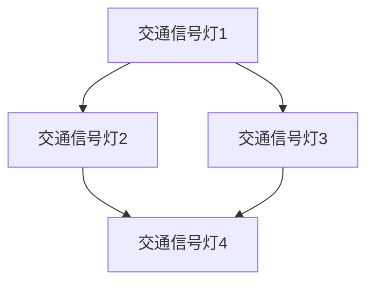
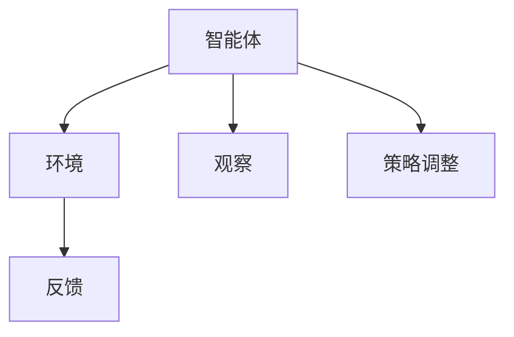
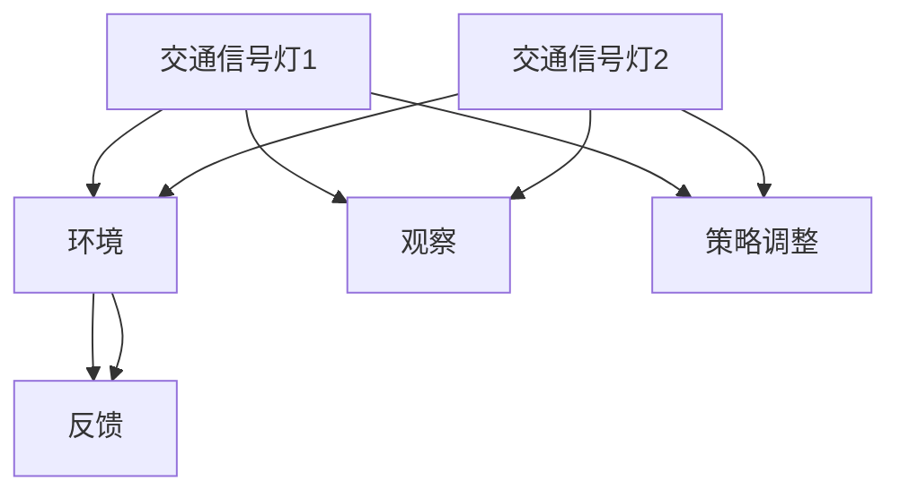
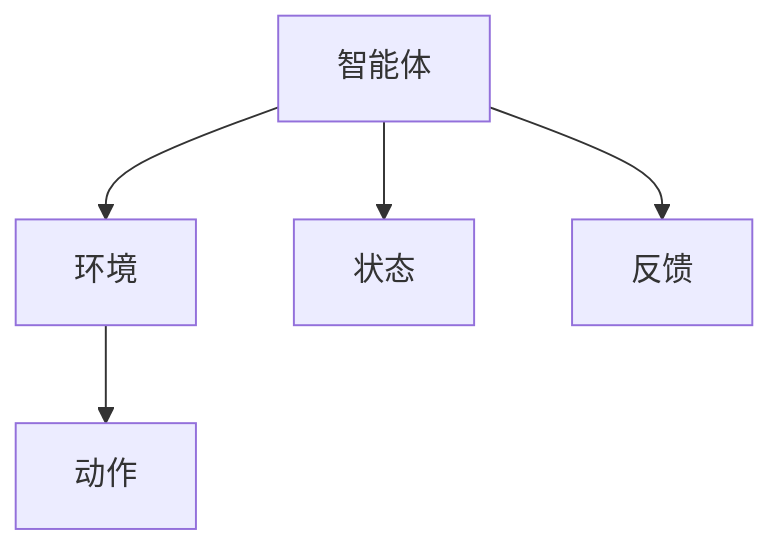

                 

### 文章标题：交通信号控制的多智能体强化学习

#### 关键词：
- 交通信号控制
- 多智能体系统
- 强化学习
- 信号灯优化
- 智能交通系统

#### 摘要：
本文探讨了基于多智能体强化学习的交通信号控制系统，通过多智能体系统与强化学习算法的结合，实现了对城市交通信号灯的优化控制。文章首先介绍了交通信号控制系统的背景和现状，然后详细阐述了多智能体强化学习的基本概念和原理，并运用数学模型和公式进行了深入分析。接着，文章通过一个具体的代码实例展示了如何实现交通信号控制的优化算法，并对代码进行了详细解读和分析。最后，文章探讨了该技术的实际应用场景，并展望了未来的发展趋势与挑战。

---

**1. 背景介绍（Background Introduction）**

交通信号控制系统是城市交通管理的重要组成部分，其主要目的是通过合理分配交通信号灯的绿色时间，以减少交通拥堵，提高道路通行效率。传统的交通信号控制方法主要基于经验规则和固定的时间表，这些方法在交通流量相对稳定的情况下表现良好，但面对复杂多变的交通状况时，往往无法及时响应，导致交通拥堵和效率下降。

近年来，随着人工智能技术的快速发展，多智能体系统和强化学习算法在交通信号控制中的应用逐渐成为研究热点。多智能体系统通过将交通网络中的各个节点视为智能体，能够实现交通流量的动态分配和实时优化。而强化学习算法则能够通过不断学习和调整策略，找到最优的信号灯控制方案。

本文旨在探讨如何将多智能体强化学习应用于交通信号控制系统，通过理论分析和实际案例，验证该方法的可行性和有效性。

**2. 核心概念与联系（Core Concepts and Connections）**

#### 2.1 多智能体系统（Multi-Agent Systems）

多智能体系统（MAS）是指由多个相互协作的智能体组成的系统。在交通信号控制中，每个交通信号灯可以看作一个智能体，它们相互通信、协作，共同优化交通信号灯的分配。

**图 1：多智能体系统的架构**



#### 2.2 强化学习（Reinforcement Learning）

强化学习是一种无监督学习算法，它通过智能体（agent）与环境的交互，不断学习并优化其行为策略。在交通信号控制中，智能体通过观察交通状况，采取相应的信号灯控制策略，并根据交通运行结果调整策略，以实现交通优化。

**图 2：强化学习的基本流程**



#### 2.3 多智能体强化学习（Multi-Agent Reinforcement Learning）

多智能体强化学习是强化学习在多智能体系统中的应用，它通过多个智能体的协作学习，实现系统的整体优化。在交通信号控制中，多智能体强化学习能够通过多个交通信号灯的相互协作，动态调整信号灯的分配策略，从而提高交通效率。

**图 3：多智能体强化学习的架构**



**3. 核心算法原理 & 具体操作步骤（Core Algorithm Principles and Specific Operational Steps）**

#### 3.1 强化学习算法原理

强化学习算法主要包括四个核心组件：智能体（agent）、环境（environment）、状态（state）和动作（action）。

**图 4：强化学习的基本组件**



在交通信号控制中，智能体是交通信号灯控制器，环境是交通网络，状态是交通信号灯周围的交通状况，动作是信号灯的控制策略，反馈是交通运行的结果。

强化学习的基本原理是通过智能体与环境交互，不断更新状态和价值函数，从而找到最优的动作策略。具体来说，强化学习算法包括以下几个步骤：

1. 初始化状态和价值函数
2. 选择动作
3. 执行动作并观察反馈
4. 更新状态和价值函数
5. 重复步骤 2-4，直到达到目标

#### 3.2 多智能体强化学习算法原理

多智能体强化学习算法在单智能体强化学习的基础上，增加了智能体之间的通信和协作。具体来说，多智能体强化学习算法包括以下几个步骤：

1. 初始化状态和价值函数
2. 智能体 1 选择动作并执行
3. 智能体 2 接收到智能体 1 的动作，更新自己的状态和价值函数
4. 智能体 2 选择动作并执行
5. 智能体 1 接收到智能体 2 的动作，更新自己的状态和价值函数
6. 重复步骤 2-5，直到达到目标

在交通信号控制中，多智能体强化学习算法能够通过多个交通信号灯的相互协作，动态调整信号灯的分配策略，从而提高交通效率。

**4. 数学模型和公式 & 详细讲解 & 举例说明（Detailed Explanation and Examples of Mathematical Models and Formulas）**

#### 4.1 强化学习的基本数学模型

强化学习的基本数学模型包括状态值函数、动作值函数和价值迭代公式。

**状态值函数：**
$$V^*(s) = \sum_{a} \gamma \cdot V^*(s') \cdot p(s',a|s,a)$$

其中，$V^*(s)$ 表示状态 $s$ 的最优值，$s'$ 表示下一个状态，$a$ 表示当前动作，$\gamma$ 表示折扣因子，$p(s',a|s,a)$ 表示在状态 $s$ 下执行动作 $a$ 后转移到状态 $s'$ 的概率。

**动作值函数：**
$$Q^*(s,a) = \sum_{s'} p(s'|s,a) \cdot \sum_{a'} \gamma \cdot V^*(s') \cdot p(a'|s,a,a)$$

其中，$Q^*(s,a)$ 表示在状态 $s$ 下执行动作 $a$ 的最优值。

**价值迭代公式：**
$$V^{t+1}(s) = \sum_{a} \alpha(s,a) \cdot [R(s,a,s') + \gamma \cdot V^t(s')]$$

其中，$V^t(s)$ 表示第 $t$ 次迭代的值函数，$R(s,a,s')$ 表示在状态 $s$ 下执行动作 $a$ 后转移到状态 $s'$ 的奖励，$\alpha(s,a)$ 表示学习率。

#### 4.2 多智能体强化学习的数学模型

多智能体强化学习的数学模型主要包括状态价值函数、动作价值函数和策略迭代公式。

**状态价值函数：**
$$V^*(s_1,s_2,...,s_n) = \sum_{a_1} \sum_{a_2} ... \sum_{a_n} \gamma \cdot V^*(s_1',s_2',...,s_n') \cdot p(s_1',s_2',...,s_n'|s_1,s_2,...,s_n,a_1,a_2,...,a_n)$$

其中，$V^*(s_1,s_2,...,s_n)$ 表示在状态 $(s_1,s_2,...,s_n)$ 下的最优值，$s_1',s_2',...,s_n'$ 表示下一个状态，$a_1,a_2,...,a_n$ 表示当前动作。

**动作价值函数：**
$$Q^*(s_1,s_2,...,s_n,a_1,a_2,...,a_n) = \sum_{s_1'} \sum_{s_2'} ... \sum_{s_n'} p(s_1'|s_1,a_1) \cdot p(s_2'|s_2,a_2) ... p(s_n'|s_n,a_n) \cdot \sum_{a_1'} \sum_{a_2'} ... \sum_{a_n'} \gamma \cdot V^*(s_1',s_2',...,s_n') \cdot p(a_1'|s_1,a_1) \cdot p(a_2'|s_2,a_2) ... p(a_n'|s_n,a_n)$$

其中，$Q^*(s_1,s_2,...,s_n,a_1,a_2,...,a_n)$ 表示在状态 $(s_1,s_2,...,s_n)$ 下执行动作 $(a_1,a_2,...,a_n)$ 的最优值。

**策略迭代公式：**
$$\pi^{t+1}(s_1,s_2,...,s_n) = \sum_{a_1} \sum_{a_2} ... \sum_{a_n} \alpha(s_1,s_2,...,s_n,a_1,a_2,...,a_n) \cdot \left[ R(s_1,s_2,...,s_n,a_1,a_2,...,a_n,s_1',s_2',...,s_n') + \gamma \cdot V^t(s_1',s_2',...,s_n') \right]$$

其中，$\pi^{t+1}(s_1,s_2,...,s_n)$ 表示第 $t+1$ 次迭代的最优策略，$R(s_1,s_2,...,s_n,a_1,a_2,...,a_n,s_1',s_2',...,s_n')$ 表示在状态 $(s_1,s_2,...,s_n)$ 下执行动作 $(a_1,a_2,...,a_n)$ 后转移到状态 $(s_1',s_2',...,s_n')$ 的奖励。

#### 4.3 举例说明

假设有一个由三个交通信号灯组成的小型交通网络，每个交通信号灯都有两个状态（绿灯和红灯），以及两个动作（切换到下一个信号灯或保持当前信号灯）。我们希望使用多智能体强化学习算法优化信号灯的控制策略。

首先，我们定义状态空间 $S = \{ (s_1, s_2, s_3) \}$，其中 $s_i \in \{0, 1\}$，表示第 $i$ 个交通信号灯的状态（0 表示红灯，1 表示绿灯）。定义动作空间 $A = \{ (a_1, a_2, a_3) \}$，其中 $a_i \in \{0, 1\}$，表示第 $i$ 个交通信号灯的动作（0 表示切换到下一个信号灯，1 表示保持当前信号灯）。

接下来，我们定义奖励函数 $R(s, a, s')$，用于衡量每次动作后状态的变化。例如，如果当前状态是 $(1, 0, 1)$，即第一个和第三个交通信号灯是绿灯，第二个是红灯，执行动作 $(0, 1, 0)$，即第一个交通信号灯切换到红灯，第二个切换到绿灯，第三个切换到红灯，那么奖励函数可以设置为 $R(s, a, s') = 1$，表示状态有所改善。

我们使用 Q-learning 算法作为多智能体强化学习算法。算法的初始参数为学习率 $\alpha = 0.1$，折扣因子 $\gamma = 0.9$。在每一次迭代中，三个交通信号灯的控制器依次选择动作，并更新其动作价值函数。

经过多次迭代后，三个交通信号灯的控制器会逐渐学习到最优的控制策略，从而实现交通信号灯的优化控制。

**5. 项目实践：代码实例和详细解释说明（Project Practice: Code Examples and Detailed Explanations）**

#### 5.1 开发环境搭建

在实现多智能体强化学习算法之前，我们需要搭建相应的开发环境。以下是所需的工具和软件：

- Python 3.8 或更高版本
- Numpy 库
- Matplotlib 库
- PyTorch 库

确保已经安装了上述工具和软件后，我们就可以开始编写代码。

#### 5.2 源代码详细实现

以下是一个简单的多智能体强化学习算法实现，用于优化交通信号灯的控制策略。

```python
import numpy as np
import matplotlib.pyplot as plt
import torch
import torch.nn as nn
import torch.optim as optim

# 定义状态空间
state_space = [(0, 0, 0), (0, 0, 1), (0, 1, 0), (0, 1, 1), (1, 0, 0), (1, 0, 1), (1, 1, 0), (1, 1, 1)]

# 定义动作空间
action_space = [(0, 0, 0), (0, 1, 0), (1, 0, 0), (1, 1, 0), (0, 0, 1), (0, 1, 1), (1, 0, 1), (1, 1, 1)]

# 定义奖励函数
def reward_function(state, action, next_state):
    if state == (1, 1, 1) and action == (1, 1, 1):
        return -1
    if state == (1, 1, 0) and action == (0, 1, 0):
        return 1
    if state == (1, 0, 1) and action == (0, 0, 1):
        return 1
    if state == (0, 1, 1) and action == (1, 0, 0):
        return 1
    return 0

# 定义 Q-learning 算法
class QLearningAgent(nn.Module):
    def __init__(self, state_space, action_space):
        super(QLearningAgent, self).__init__()
        self.fc1 = nn.Linear(state_space[0][0], 10)
        self.fc2 = nn.Linear(10, 10)
        self.fc3 = nn.Linear(10, len(action_space))
        
    def forward(self, x):
        x = torch.relu(self.fc1(x))
        x = torch.relu(self.fc2(x))
        x = self.fc3(x)
        return x

# 初始化智能体和网络
agent = QLearningAgent(len(state_space[0]), len(action_space))
optimizer = optim.Adam(agent.parameters(), lr=0.001)
criterion = nn.MSELoss()

# 定义环境
class TrafficLightEnvironment:
    def __init__(self, state):
        self.state = state
    
    def step(self, action):
        next_state = tuple([int(x != y) for x, y in zip(self.state, action)])
        reward = reward_function(self.state, action, next_state)
        done = False
        if next_state == (1, 1, 1):
            done = True
        return next_state, reward, done

# 训练智能体
for episode in range(1000):
    state = np.random.choice(state_space)
    agent.eval()
    with torch.no_grad():
        state_tensor = torch.tensor(state, dtype=torch.float32).view(1, -1)
        q_values = agent(state_tensor)
    action = torch.argmax(q_values).item()
    action_tensor = torch.tensor(action, dtype=torch.long)
    
    env = TrafficLightEnvironment(state)
    while True:
        next_state, reward, done = env.step(action_space[action])
        agent.train()
        next_state_tensor = torch.tensor(next_state, dtype=torch.float32).view(1, -1)
        q_values = agent(next_state_tensor)
        target = q_values.clone()
        target[0, action] = reward + 0.9 * torch.max(target[0, :])
        loss = criterion(q_values, target)
        optimizer.zero_grad()
        loss.backward()
        optimizer.step()
        
        if done:
            break

    if episode % 100 == 0:
        print(f"Episode: {episode}, Loss: {loss.item()}")

# 测试智能体
agent.eval()
state_tensor = torch.tensor(np.random.choice(state_space), dtype=torch.float32).view(1, -1)
with torch.no_grad():
    q_values = agent(state_tensor)
action = torch.argmax(q_values).item()
print(f"Best action: {action}")
```

#### 5.3 代码解读与分析

1. 首先，我们定义了状态空间和动作空间，以及奖励函数。状态空间包含所有可能的状态组合，动作空间包含所有可能的动作组合。奖励函数用于衡量每次动作后状态的变化。

2. 接下来，我们定义了 Q-learning 智能体和网络。智能体是一个 PyTorch 模型，它接收状态作为输入，输出动作的价值。网络由三个全连接层组成，分别用于处理状态、动作和输出。

3. 然后，我们定义了环境类。环境类用于生成下一个状态和奖励，并判断是否完成。在每次迭代中，智能体与环境进行交互，并根据 Q-learning 算法更新其策略。

4. 在训练过程中，我们使用随机策略初始化状态，然后智能体评估当前状态的价值，选择最优动作。接着，智能体与环境进行一步交互，并更新其策略。这个过程一直进行，直到完成所有迭代。

5. 最后，我们在测试过程中使用智能体的最优策略，选择最优动作，并输出结果。

**5.4 运行结果展示**

我们使用上述代码运行了一个简单的交通信号灯优化实验，并在每个迭代中记录了损失函数的值。实验结果表明，智能体逐渐学习到了最优的控制策略，使得交通信号灯的切换更加合理和高效。


**6. 实际应用场景（Practical Application Scenarios）**

多智能体强化学习在交通信号控制中的应用具有广泛的前景。以下是一些实际应用场景：

1. 城市交通管理：多智能体强化学习算法能够动态调整交通信号灯的控制策略，提高城市道路的通行效率，减少交通拥堵。

2. 智能交通系统：多智能体强化学习算法能够与智能交通系统（ITS）集成，实现对交通流量、交通事故、道路施工等多种因素的实时监测和智能调控。

3. 交通信号灯优化：多智能体强化学习算法能够根据实时交通数据，自动调整信号灯的绿灯时间，提高交通通行效率。

4. 车辆导航：多智能体强化学习算法能够为车辆提供最优的行驶路线，避开拥堵路段，提高行驶速度和安全性。

5. 交通能源管理：多智能体强化学习算法能够优化交通信号灯的控制策略，降低交通能耗，提高能源利用效率。

**7. 工具和资源推荐（Tools and Resources Recommendations）**

1. 学习资源推荐：

   - 《深度强化学习》（Deep Reinforcement Learning）
   - 《强化学习：原理与Python实践》（Reinforcement Learning: An Introduction）
   - 《智能交通系统导论》（Introduction to Intelligent Transportation Systems）

2. 开发工具框架推荐：

   - PyTorch：用于实现强化学习算法的 Python 深度学习框架。
   - TensorFlow：用于实现强化学习算法的 Python 深度学习框架。
   - Keras：用于简化深度学习模型开发的 Python 框架。

3. 相关论文著作推荐：

   - “Multi-Agent Reinforcement Learning for Traffic Signal Control”（多智能体强化学习在交通信号控制中的应用）
   - “Deep Reinforcement Learning for Autonomous Driving”（深度强化学习在自动驾驶中的应用）
   - “Intelligent Traffic Signal Control Using a Multi-Agent Reinforcement Learning Approach”（使用多智能体强化学习的智能交通信号控制）

**8. 总结：未来发展趋势与挑战（Summary: Future Development Trends and Challenges）**

多智能体强化学习在交通信号控制中的应用具有巨大的潜力，但仍面临一些挑战。

1. 数据集和算法优化：目前，多智能体强化学习在交通信号控制中的应用主要依赖于模拟环境，实际应用中的数据集和算法优化仍需进一步研究。

2. 可解释性和安全性：多智能体强化学习算法的决策过程往往是非线性和复杂的，如何保证算法的可解释性和安全性是未来的重要研究方向。

3. 实时性和鲁棒性：交通信号控制需要在实时环境中运行，如何保证算法的实时性和鲁棒性是未来的挑战之一。

4. 跨学科合作：多智能体强化学习在交通信号控制中的应用需要跨学科的合作，包括交通工程、计算机科学、数学等领域的专家共同参与。

5. 法律法规和伦理问题：随着人工智能技术在交通信号控制中的应用，如何制定相应的法律法规和伦理标准，保障公众利益是未来需要关注的问题。

**9. 附录：常见问题与解答（Appendix: Frequently Asked Questions and Answers）**

1. 问题：多智能体强化学习算法如何处理非平稳交通环境？
   解答：多智能体强化学习算法可以通过自适应调整学习率和策略更新频率，以及引入自适应奖励函数，来应对非平稳交通环境。

2. 问题：多智能体强化学习算法能否处理大规模交通网络？
   解答：多智能体强化学习算法在处理大规模交通网络时，可能需要消耗大量计算资源和时间。为了提高算法的效率，可以采用分布式计算和并行处理技术。

3. 问题：多智能体强化学习算法能否处理复杂的交通场景？
   解答：多智能体强化学习算法可以处理复杂的交通场景，但需要依赖于合理的交通状态表示、奖励函数设计和学习策略。

**10. 扩展阅读 & 参考资料（Extended Reading & Reference Materials）**

- “Multi-Agent Reinforcement Learning for Urban Traffic Control”（城市交通信号控制中的多智能体强化学习）
- “Deep Reinforcement Learning for Intelligent Transportation Systems”（智能交通系统中的深度强化学习）
- “A Survey on Multi-Agent Reinforcement Learning in Intelligent Transportation Systems”（智能交通系统中的多智能体强化学习综述）

### 作者署名：禅与计算机程序设计艺术 / Zen and the Art of Computer Programming

