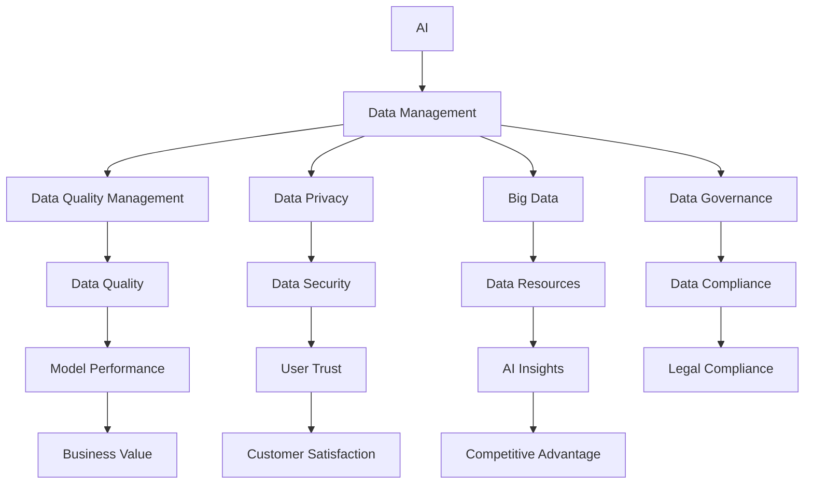

                 

### 背景介绍（Background Introduction）

随着人工智能技术的飞速发展，人工智能创业已经成为全球范围内的热门话题。在这些创业项目中，数据管理成为了一个至关重要的环节。本文将深入探讨人工智能创业中数据管理的挑战与机遇。

首先，我们需要理解数据管理的重要性。数据是人工智能的燃料，没有高质量的数据，人工智能系统就无法发挥其潜力。在创业项目中，数据管理涉及到数据的收集、存储、处理、分析以及应用等多个环节。

然而，数据管理并不是一件简单的事情。首先，数据的来源可能非常复杂，包括社交媒体、物联网设备、传感器、用户生成的数据等。这些数据不仅种类繁多，而且规模庞大，如何有效地收集和存储这些数据成为了一个巨大的挑战。

其次，数据的质量也是一个关键问题。数据的质量直接影响到人工智能系统的性能和可靠性。然而，在创业项目中，数据往往是在紧迫的时间压力下收集的，这就可能导致数据的不完整、不准确甚至是有偏差的。

最后，我们需要考虑数据的安全性和隐私性。在人工智能创业中，数据的安全性和隐私性保护是非常重要的。随着数据隐私法规的日益严格，如何确保用户数据的安全成为了每个创业公司都需要面对的问题。

然而，尽管存在这些挑战，数据管理也为人工智能创业带来了巨大的机遇。首先，高质量的数据可以显著提升人工智能系统的性能，使其在市场上更具竞争力。其次，通过有效的数据管理，创业公司可以更好地了解用户需求，提供更加个性化的服务，从而提升用户体验。

总的来说，人工智能创业中的数据管理既充满挑战，又充满机遇。在接下来的章节中，我们将进一步探讨这些挑战和机遇，并给出具体的解决方案。

### 核心概念与联系（Core Concepts and Connections）

在深入探讨人工智能创业中的数据管理挑战与机遇之前，我们有必要明确几个核心概念，并分析它们之间的联系。

#### 1. 数据管理（Data Management）

数据管理是指一系列用于确保数据质量、可访问性、完整性和安全性的活动。它包括数据收集、存储、处理、分析和保护等多个环节。数据管理的目标是提供一个可靠的数据环境，支持人工智能创业的各个环节。

#### 2. 数据质量管理（Data Quality Management）

数据质量管理是数据管理的一个重要组成部分，它关注的是数据的准确性、完整性、一致性、及时性和相关性。在人工智能创业中，高质量的数据是模型训练和决策的基础，因此数据质量管理至关重要。

#### 3. 数据隐私（Data Privacy）

数据隐私涉及到如何保护个人和敏感数据不被未经授权的访问和滥用。随着数据隐私法规（如欧盟的通用数据保护条例GDPR）的日益严格，创业公司需要采取有效的措施来确保用户数据的安全和隐私。

#### 4. 大数据（Big Data）

大数据是指数据量巨大、数据类型多样且数据生成速度极快的海量数据。在人工智能创业中，大数据的重要性不言而喻。如何有效地收集、存储和处理大数据，并从中提取有价值的信息，是数据管理的核心问题。

#### 5. 数据治理（Data Governance）

数据治理是指制定和执行策略、标准和流程，以确保数据的质量、可用性和合规性。数据治理为数据管理提供了框架和指导，有助于确保数据管理的有效性和持续性。

#### 6. 人工智能（Artificial Intelligence）

人工智能是指通过计算机模拟人类智能的技术。在人工智能创业中，人工智能算法依赖于大量高质量的数据进行训练，因此数据的质量直接影响人工智能系统的性能和应用效果。

#### 关系与联系

上述概念之间存在密切的联系。数据质量管理是数据管理的重要组成部分，直接影响到数据的质量和可用性。数据隐私是数据治理的一个关键方面，确保用户数据不被滥用和泄露。大数据为人工智能提供了丰富的数据资源，而数据治理则为数据管理提供了规范和框架，确保数据管理的有效性和合规性。

在人工智能创业中，数据管理不仅是一个技术问题，更是一个战略问题。有效的数据管理不仅能够提高人工智能系统的性能，还能增强创业公司的竞争力，满足用户的需求。因此，理解并优化这些核心概念及其相互关系，对于成功的人工智能创业至关重要。

为了更直观地展示这些核心概念之间的关系，我们使用Mermaid流程图进行描述。

通过这个流程图，我们可以清楚地看到数据管理、数据质量管理、数据隐私、大数据、数据治理和人工智能之间的相互关系。每一个环节都为创业公司的成功提供了支持，同时也提出了新的挑战。

在接下来的章节中，我们将深入探讨这些挑战，并提出具体的解决方案。

#### 1. 数据质量管理（Data Quality Management）

数据质量管理是确保数据准确性、完整性、一致性、及时性和相关性的过程。对于人工智能创业项目来说，高质量的数据是模型训练和决策的基础，因此数据质量管理至关重要。

首先，数据的准确性是数据质量管理的核心。准确的数据能够确保模型训练和决策的正确性，避免因数据错误导致的模型失效或决策失误。在人工智能创业中，数据的准确性通常通过数据清洗和数据验证来实现。数据清洗是指识别并纠正数据集中的错误、异常和不一致之处，而数据验证则是对数据源的可信度和完整性进行评估。

其次，数据的完整性同样重要。完整的数据能够提供全面的视角，帮助创业者更准确地理解业务场景和用户需求。数据的缺失或不完整会导致模型训练中的样本偏差，影响模型的性能。因此，数据完整性管理通常包括数据修复和数据恢复技术，以确保数据的完整性。

数据的一致性是指数据在不同系统、数据库和应用程序中的表示方式应该是一致的。数据的不一致性会导致数据冗余、错误和混淆，影响数据的利用效率和可靠性。例如，在不同的系统中，同一客户的数据可能有不同的表示方式，这会给数据分析带来困难。数据一致性管理通常涉及数据集成和数据标准化技术，以统一数据格式和表示方式。

数据的及时性是指数据能够在需要的时间内及时提供。对于实时决策和动态调整来说，及时的数据至关重要。然而，数据的采集、处理和传输往往存在延迟，这可能会影响决策的时效性。因此，数据及时性管理通常需要考虑数据流处理技术和实时数据同步机制。

数据的关联性是指数据之间存在的逻辑关系和关联性。高质量的数据不仅需要是准确的、完整的、一致的和及时的，还需要能够反映出数据之间的相互关系。这有助于提升数据分析和挖掘的深度和广度。例如，在电商平台上，用户行为数据与产品销售数据之间存在明显的关联性，通过分析这些数据，可以挖掘出用户的购买偏好和行为模式。

在人工智能创业项目中，数据质量管理通常需要采取以下几种策略：

1. **数据清洗**：使用自动化工具和算法清洗数据，识别并纠正数据中的错误和不一致。
2. **数据验证**：通过比对不同数据源、系统或数据库中的数据，验证数据的准确性和完整性。
3. **数据标准化**：统一数据格式和表示方式，确保数据的一致性。
4. **实时数据处理**：采用实时数据流处理技术，确保数据能够在需要的时间内提供。
5. **关联分析**：通过数据关联分析，挖掘数据之间的潜在关系和关联性。

通过有效的数据质量管理，人工智能创业项目可以确保数据的质量，提高模型训练和决策的准确性，从而增强项目的成功几率。

### 2. 数据隐私（Data Privacy）

数据隐私在人工智能创业项目中至关重要，因为创业公司往往需要处理大量敏感用户数据。随着数据隐私法规的日益严格，尤其是欧盟的通用数据保护条例（GDPR）和美国加州消费者隐私法案（CCPA）等，保护用户数据隐私已成为企业合规的强制性要求。

首先，数据隐私保护涉及到数据收集和处理的合法性和透明度。创业公司需要确保在收集用户数据时，遵循用户同意的原则，明确告知用户数据收集的目的、范围和使用方式。用户应该有知情权，了解自己的数据如何被使用和保护。

其次，数据匿名化和去标识化是保护用户隐私的重要手段。通过将敏感信息进行匿名化处理，例如删除或更改能够识别个人身份的信息，可以大大降低数据泄露的风险。去标识化则是在确保数据隐私的同时，保留数据的价值，使其仍可用于分析。

数据加密也是保护用户隐私的重要措施。敏感数据在传输和存储过程中，应使用强加密算法进行加密，确保数据在未经授权的情况下无法被读取或篡改。加密不仅保护数据不被泄露，还能确保数据的完整性，防止未经授权的篡改。

此外，创业公司还需要建立完善的数据安全策略和内部控制机制，确保数据隐私保护措施得到有效执行。这包括数据访问控制、权限管理、安全审计和应急响应计划等。

最后，透明度也是数据隐私保护的重要组成部分。创业公司应向用户透明地披露其数据处理流程、安全措施以及用户权利。用户有权请求访问、更正、删除自己的数据，甚至可以撤回同意。创业公司应建立便捷的用户隐私权益管理机制，满足用户需求，增强用户信任。

总之，在人工智能创业项目中，保护数据隐私不仅是合规要求，更是建立用户信任、维护品牌声誉的关键。通过采取有效的数据隐私保护措施，创业公司可以确保用户数据的安全，增强用户对服务的信任，从而为企业的长期发展打下坚实基础。

### 3. 大数据（Big Data）

大数据是人工智能创业项目中的一个关键要素，它为机器学习模型提供了丰富的训练数据，从而提升了模型的预测能力和决策质量。然而，大数据也带来了许多独特的挑战和机遇。

#### 3.1 大数据的定义与特点

大数据通常指数据量巨大、数据类型多样且数据生成速度极快的数据集。具体来说，大数据通常具有以下四个V的特点：

1. **Volume（数据量）**：大数据集的规模远超传统数据集，可以达到TB、PB甚至EB级别。
2. **Velocity（速度）**：大数据的生成和处理速度极快，需要实时或近实时处理，以捕捉瞬息万变的市场和用户需求。
3. **Variety（多样性）**：大数据类型多样，包括结构化数据（如关系型数据库）、半结构化数据（如JSON、XML）和非结构化数据（如图像、视频、文本等）。
4. **Veracity（真实性）**：大数据的真实性难以保证，数据质量参差不齐，存在噪声、错误和不一致的情况。

#### 3.2 大数据在人工智能创业中的应用

大数据在人工智能创业中的应用主要体现在以下几个方面：

1. **模型训练**：大数据为人工智能模型提供了丰富的训练数据，有助于模型学习复杂模式和趋势。在金融、医疗、零售等行业，大数据的应用可以显著提升模型的预测准确性和决策效率。
2. **实时分析**：通过实时处理大数据，创业公司可以快速响应市场变化和用户需求，实现实时决策和动态调整。例如，电商公司可以利用大数据分析实时监控用户行为，提供个性化的推荐和服务。
3. **数据挖掘**：大数据中蕴含着大量有价值的信息，通过数据挖掘技术，创业公司可以发现新的业务机会、优化产品和服务。例如，通过分析用户数据，可以发现潜在的市场需求，设计更符合用户期望的产品。
4. **个性化服务**：大数据分析可以帮助创业公司了解用户行为和偏好，提供个性化的服务和体验。例如，通过分析用户的历史数据，可以为用户提供个性化的营销活动、推荐服务和定制化产品。

#### 3.3 大数据带来的挑战

尽管大数据为人工智能创业带来了许多机遇，但也带来了以下挑战：

1. **数据存储和管理**：大数据集的存储和管理是一个巨大的挑战，需要高效、可靠的数据存储解决方案和数据管理策略。
2. **数据隐私和安全**：大数据中包含大量的敏感信息，保护用户隐私和数据安全是一个重要且复杂的任务。创业公司需要采取有效的数据隐私保护措施，确保用户数据的安全。
3. **数据处理和分析**：大数据的处理和分析需要高效的计算和存储资源，同时也需要复杂的算法和模型来提取有价值的信息。
4. **数据质量**：大数据的质量参差不齐，噪声和错误数据会影响模型的效果和决策质量。因此，创业公司需要投入大量资源进行数据清洗和数据质量保障。

总之，大数据在人工智能创业中扮演着重要的角色，既是机遇也是挑战。通过有效的数据管理和分析，创业公司可以充分利用大数据的价值，提升业务竞争力和用户体验。

### 4. 数据治理（Data Governance）

数据治理是确保数据质量、可用性和合规性的系统性过程，对于人工智能创业项目至关重要。数据治理不仅涉及到技术层面，还涉及到组织结构和流程管理。在人工智能创业中，有效的数据治理能够确保数据的正确性、安全性和隐私性，从而提高项目的整体成功率和竞争力。

#### 4.1 数据治理的概念与目标

数据治理是指制定和执行一系列策略、标准和流程，以确保数据在整个生命周期内的一致性、可靠性、可用性和合规性。其核心目标包括：

1. **确保数据质量**：通过数据清洗、数据验证和数据标准化等手段，确保数据的准确性、完整性和一致性。
2. **提高数据可用性**：确保数据能够被有效地收集、存储、处理和分析，为人工智能算法提供可靠的数据基础。
3. **保障数据合规性**：确保数据管理活动符合相关法律法规和数据隐私要求，避免法律风险和合规问题。
4. **建立数据信任**：通过透明的数据管理流程和严格的数据保护措施，增强用户对数据安全和隐私的信任。

#### 4.2 数据治理的关键要素

数据治理涉及多个关键要素，包括数据战略、数据架构、数据政策和数据标准等。

1. **数据战略**：数据战略是企业数据管理的总体规划，明确数据治理的目标、方向和优先级。它通常包括数据使用政策、数据分类和标签体系、数据生命周期管理等内容。
2. **数据架构**：数据架构是指数据存储、处理和分析的结构设计，包括数据库架构、数据仓库和数据湖的设计和部署。有效的数据架构能够支持数据的快速访问和高效处理。
3. **数据政策和标准**：数据政策和标准是确保数据治理执行的法规和指南，包括数据质量标准、数据安全标准、数据隐私标准和数据使用准则等。这些政策和标准为数据管理活动提供了明确的指导和约束。
4. **数据治理委员会**：数据治理委员会是负责制定和监督数据治理策略和流程的决策机构，通常由高级管理人员和技术专家组成。委员会负责评估数据治理的执行情况，确保数据治理目标的实现。

#### 4.3 数据治理在人工智能创业中的应用

在人工智能创业项目中，数据治理的应用主要体现在以下几个方面：

1. **数据质量管理**：通过数据治理流程，确保数据质量符合人工智能算法的需求。数据清洗、数据验证和数据标准化等技术手段是数据质量管理的重要工具。
2. **数据安全与隐私保护**：数据治理框架可以帮助创业公司建立严格的数据安全政策和隐私保护措施，确保用户数据的隐私和安全。数据加密、访问控制和安全审计等技术手段是保障数据安全的关键。
3. **数据生命周期管理**：数据治理框架可以指导数据的整个生命周期管理，包括数据的收集、存储、处理、分析和归档。通过有效的数据生命周期管理，可以确保数据的及时更新和优化。
4. **数据合规性管理**：数据治理框架可以帮助创业公司确保数据管理活动符合相关法律法规和行业标准，降低法律风险和合规成本。例如，在处理用户数据时，必须遵守GDPR、CCPA等数据隐私法规。

总之，数据治理是人工智能创业项目成功的关键要素。通过建立有效的数据治理框架和流程，创业公司可以确保数据的准确性、安全性和合规性，从而提高人工智能系统的性能和应用效果。在数据驱动的创业环境中，数据治理不仅是技术问题，更是战略问题，对于企业的长期发展和竞争力至关重要。

### 5. 数据管理挑战与机遇：案例分析

为了更好地理解数据管理在人工智能创业中的挑战与机遇，我们可以通过具体案例来分析。以下我们将探讨两个具有代表性的创业项目：一个成功案例和一个失败案例。

#### 5.1 成功案例：OpenAI

**背景**：OpenAI 是一家成立于2015年的知名人工智能研究公司，其目标是实现安全的通用人工智能（AGI）。OpenAI 在其研究过程中，面临了巨大的数据管理挑战。

**数据管理挑战**：

1. **数据来源广泛**：OpenAI 的数据来源非常多样化，包括互联网上的文本、图像、语音等多模态数据，以及大量的内部实验数据。如何有效地收集、整合和存储这些数据成为一个巨大的挑战。
2. **数据规模庞大**：OpenAI 的模型需要大量的训练数据，每份数据都需要经过清洗和预处理，以确保数据的准确性和一致性。
3. **数据隐私和安全**：作为一家关注通用人工智能的公司，OpenAI 需要处理大量敏感用户数据，保护用户隐私和数据安全是至关重要的。

**解决方案**：

1. **分布式数据存储**：OpenAI 采用分布式数据存储技术，如Hadoop和Spark，以处理海量数据的存储和访问需求。这些技术能够高效地存储和管理大规模数据集。
2. **数据预处理平台**：OpenAI 开发了强大的数据预处理平台，自动化数据清洗、格式转换和特征提取等过程，确保数据的准确性和一致性。
3. **数据隐私保护**：OpenAI 采用了多种数据隐私保护措施，包括数据去标识化、加密和访问控制，确保用户数据的安全和隐私。

**成功原因**：

1. **强大的数据治理框架**：OpenAI 建立了严格的数据治理框架，包括数据战略、数据政策和数据标准，确保数据管理的规范化和持续性。
2. **高效的团队协作**：OpenAI 拥有经验丰富的数据科学家和工程师团队，他们能够高效地合作，解决数据管理中的复杂问题。
3. **持续的技术创新**：OpenAI 不断探索新技术和方法，如深度学习和自然语言处理，以提升数据管理和分析能力。

#### 5.2 失败案例：某匿名初创公司

**背景**：某匿名初创公司成立于2020年，致力于开发一款基于人工智能的智能家居控制系统。然而，该公司在数据管理方面存在严重问题，导致项目最终失败。

**数据管理挑战**：

1. **数据质量低下**：该公司在收集用户数据时，未能进行有效的数据清洗和验证，导致数据中存在大量噪声和错误。
2. **数据隐私问题**：该公司在数据收集和处理过程中，未能采取有效的隐私保护措施，导致用户数据泄露，引发了严重的隐私投诉和法律纠纷。
3. **数据存储和管理效率低下**：该公司使用传统的数据存储方案，无法高效地处理大规模的数据集，导致数据处理速度缓慢，影响了系统的响应性能。

**失败原因**：

1. **缺乏数据治理框架**：该公司未能建立有效的数据治理框架，数据管理活动缺乏规范和指导，导致数据质量问题严重。
2. **技术实力不足**：该公司在数据管理和分析方面的技术能力不足，无法有效解决数据管理中的复杂问题。
3. **对数据隐私的忽视**：该公司在数据收集和处理过程中，忽视了数据隐私保护的重要性，导致严重的法律和道德问题。

**教训**：

1. **重视数据治理**：创业公司应建立严格的数据治理框架，确保数据管理的规范化和持续性。
2. **加强数据质量保障**：创业公司应投入资源进行数据清洗和验证，确保数据质量符合业务需求。
3. **重视数据隐私保护**：创业公司应采取有效的数据隐私保护措施，确保用户数据的安全和隐私。

通过以上两个案例，我们可以看到，数据管理在人工智能创业中具有决定性的作用。有效的数据管理不仅能够提升项目的成功率，还能够增强企业的竞争力。相反，数据管理不善则可能导致项目失败和严重的法律风险。因此，创业公司应高度重视数据管理，建立科学的数据治理框架，确保数据管理的规范化和持续性。

### 6. 实际应用场景（Practical Application Scenarios）

在人工智能创业中，数据管理不仅是理论上的挑战，更是在实际应用中面临的具体问题。以下我们将讨论几个典型的实际应用场景，展示数据管理在各个领域中的具体应用，以及如何应对数据管理的挑战。

#### 6.1 金融行业

金融行业是一个高度依赖数据管理的领域。金融机构需要处理海量的交易数据、客户数据和市场数据，以实现风险控制、投资决策和客户服务。

**挑战**：

1. **数据多样性**：金融数据包括结构化数据（如交易记录）和非结构化数据（如客户评论和新闻报道），如何有效地整合和管理这些不同类型的数据是一个重大挑战。
2. **数据实时性**：金融市场变化迅速，实时数据对于交易决策至关重要。如何保证数据的实时性，是一个关键问题。
3. **数据隐私**：金融数据通常涉及敏感的客户信息和交易信息，数据隐私保护是金融机构面临的重要挑战。

**解决方案**：

1. **大数据平台**：金融机构可以采用大数据平台，如Hadoop和Spark，整合和管理多样化的数据。
2. **实时数据处理**：通过流数据处理技术（如Apache Kafka和Apache Flink），实现数据的实时处理和分析。
3. **数据加密和隐私保护**：采用数据加密技术和隐私保护算法（如差分隐私和同态加密），确保数据的隐私和安全。

**案例**：某银行通过构建大数据平台，整合了交易数据、客户数据和市场数据，实现了实时的风险监控和投资决策。该平台使用了数据加密技术，保护了客户的敏感信息，增强了客户信任。

#### 6.2 医疗保健

医疗保健行业也是一个数据密集型领域。医疗机构需要处理大量的患者数据、医疗记录和基因组数据，以支持诊断、治疗和健康管理。

**挑战**：

1. **数据隐私**：医疗数据涉及患者的隐私信息，如何确保数据的安全和隐私，是一个关键问题。
2. **数据标准化**：医疗数据格式和标准多样，如何实现数据的一致性和标准化，是医疗数据管理的挑战。
3. **数据整合**：医疗机构通常拥有多个信息系统，如何有效地整合这些系统中的数据，是一个复杂的问题。

**解决方案**：

1. **数据治理框架**：建立统一的数据治理框架，确保数据的标准化、合规性和安全性。
2. **电子健康档案（EHR）**：采用电子健康档案系统，统一管理和整合患者数据。
3. **区块链技术**：利用区块链技术，实现数据的去中心化和不可篡改，增强数据的隐私和安全。

**案例**：某医疗机构通过建立电子健康档案系统，实现了患者数据的统一管理和整合。该系统采用了区块链技术，确保了数据的安全和隐私，提高了医疗服务的效率和质量。

#### 6.3 零售行业

零售行业的数据管理挑战主要体现在如何利用大数据和人工智能技术优化库存管理、提升客户体验和进行精准营销。

**挑战**：

1. **库存管理**：如何准确预测市场需求，优化库存水平，是零售行业的核心问题。
2. **客户体验**：如何利用客户数据提供个性化的购物体验，增强客户满意度，是零售业面临的挑战。
3. **数据质量**：零售数据质量参差不齐，如何保证数据的一致性和准确性，是数据管理的难题。

**解决方案**：

1. **大数据分析**：通过大数据分析技术，实时监控市场需求，优化库存管理。
2. **客户关系管理（CRM）系统**：采用CRM系统，整合和管理客户数据，提供个性化的购物体验。
3. **数据清洗和质量保证**：投入资源进行数据清洗和质量保证，确保数据的一致性和准确性。

**案例**：某零售企业通过大数据分析和CRM系统，实现了精准的库存管理和个性化的客户体验。该企业采用数据清洗和质量保证技术，确保了数据的质量和准确性，提升了运营效率和客户满意度。

#### 6.4 自动驾驶

自动驾驶技术的发展依赖于大量高质量的数据，包括道路数据、车辆数据和环境数据。数据管理在自动驾驶中的应用至关重要。

**挑战**：

1. **数据规模**：自动驾驶数据规模巨大，如何高效存储和管理这些数据是一个挑战。
2. **数据隐私**：自动驾驶数据中包含敏感信息，如何保护数据隐私，是自动驾驶面临的重大问题。
3. **数据安全性**：自动驾驶系统需要高度依赖数据的安全性，如何确保数据不被恶意攻击，是一个关键问题。

**解决方案**：

1. **分布式存储**：采用分布式存储技术，如Hadoop和Docker，实现海量数据的存储和管理。
2. **数据加密和隐私保护**：采用数据加密和隐私保护技术，确保数据的安全和隐私。
3. **网络安全**：建立强大的网络安全体系，防止数据被恶意攻击。

**案例**：某自动驾驶公司在开发自动驾驶系统时，采用了分布式存储技术和数据加密技术，确保了数据的安全和隐私。该企业还建立了完善的网络安全体系，防止数据泄露和网络攻击，保障了自动驾驶系统的安全运行。

通过以上实际应用场景的分析，我们可以看到，数据管理在人工智能创业中的重要性不言而喻。创业公司需要根据自身业务特点和需求，采取有效的数据管理策略和技术，应对数据管理的挑战，实现数据驱动的业务创新和竞争优势。

### 7. 工具和资源推荐（Tools and Resources Recommendations）

在人工智能创业项目中，选择合适的工具和资源对于数据管理的成功至关重要。以下我们将推荐几种常用的工具和资源，涵盖数据存储、数据分析和数据治理等多个方面。

#### 7.1 数据存储

1. **Hadoop**：Apache Hadoop 是一个分布式数据存储和处理平台，适用于大规模数据集。它提供了高可靠性和扩展性的分布式文件系统HDFS，以及用于数据分析的MapReduce框架。
2. **Spark**：Apache Spark 是一个快速且通用的分布式计算引擎，适用于大规模数据集的存储和处理。它提供了丰富的API，支持实时数据处理、机器学习和数据流处理。
3. **MongoDB**：MongoDB 是一个高性能、可扩展的文档数据库，适用于存储非结构化和半结构化数据。它提供了强大的查询能力和灵活的数据模型，适用于多种应用场景。

#### 7.2 数据分析

1. **TensorFlow**：TensorFlow 是一个开源的机器学习库，由谷歌开发。它提供了丰富的API，支持深度学习和传统机器学习算法。TensorFlow 被广泛应用于图像识别、自然语言处理和强化学习等领域。
2. **PyTorch**：PyTorch 是一个开源的机器学习库，由Facebook开发。它提供了灵活的动态计算图和易于使用的API，被广泛应用于深度学习和计算机视觉领域。
3. **Pandas**：Pandas 是一个开源的数据分析库，适用于Python。它提供了强大的数据结构和数据分析工具，用于数据清洗、数据操作和数据分析。Pandas 广泛应用于数据预处理、数据可视化和数据挖掘。

#### 7.3 数据治理

1. **Informatica**：Informatica 是一个全面的集成数据管理平台，提供数据集成、数据质量和数据治理功能。它适用于大规模数据集成和治理，支持多种数据源和数据格式。
2. **Talend**：Talend 是一个开源的数据集成平台，提供数据集成、数据质量和数据治理功能。它支持多种数据源和数据格式，适用于企业级的数据集成和数据治理。
3. **Informix**：Informix 是IBM的一个数据库管理系统，适用于企业级的数据存储和管理。它提供了强大的数据安全和隐私保护功能，支持大规模数据集的存储和处理。

#### 7.4 学习资源

1. **《大数据之路：阿里巴巴大数据实践》**：这是一本由阿里巴巴技术团队编写的书籍，详细介绍了阿里巴巴在大数据领域的技术实践和经验。对于希望了解大数据应用和管理的读者，是一本非常实用的参考资料。
2. **《深度学习》**：这是一本由Ian Goodfellow、Yoshua Bengio和Aaron Courville合著的经典教材，全面介绍了深度学习和神经网络的基础知识。对于希望深入了解深度学习和人工智能的读者，是一本不可或缺的参考书。
3. **《数据科学入门》**：这是一本适合初学者的数据科学入门书籍，由Joel Grus 编写。书中介绍了数据科学的基本概念、方法和工具，适用于希望了解数据科学和机器学习的读者。

通过使用这些工具和资源，人工智能创业公司可以更有效地管理数据，提升数据分析能力，实现数据驱动的业务创新。

### 8. 总结：未来发展趋势与挑战（Summary: Future Development Trends and Challenges）

在人工智能创业项目中，数据管理发挥着至关重要的作用。随着技术的不断进步和市场的快速变化，未来数据管理将呈现以下发展趋势和面临新的挑战。

#### 发展趋势

1. **数据量持续增长**：随着物联网、社交媒体和智能设备的普及，数据量将呈现指数级增长。大数据技术将继续发展，以支持更大规模的数据存储和处理。
2. **数据多样化与融合**：数据的类型将更加多样化，包括结构化数据、半结构化数据和非结构化数据。企业需要开发更多高效的数据融合技术，以整合不同类型的数据，提取有价值的信息。
3. **实时数据处理**：实时数据处理和流数据处理技术将继续发展，企业需要更快地响应市场变化和用户需求。这将推动实时分析和实时决策的发展。
4. **数据隐私与安全**：数据隐私和安全将得到更多的关注。随着数据隐私法规的日益严格，企业需要采取更先进的数据隐私保护技术，确保用户数据的安全和合规性。
5. **人工智能与数据治理的结合**：人工智能技术将更好地融入数据治理框架，提高数据管理的效率和准确性。通过自动化和智能化的数据治理，企业可以更好地管理数据生命周期，确保数据的质量和可靠性。

#### 挑战

1. **数据质量问题**：数据质量仍然是数据管理中的主要挑战。企业需要持续投入资源进行数据清洗、验证和标准化，以确保数据的准确性、完整性和一致性。
2. **数据隐私和安全**：随着数据隐私法规的严格，企业需要处理更多复杂的隐私和安全问题。如何在保障数据隐私的同时，提高数据利用效率是一个重要课题。
3. **技术复杂度**：随着数据管理和分析技术的不断演进，技术复杂性也在增加。企业需要具备强大的技术能力，以应对复杂的数据管理和分析需求。
4. **人才短缺**：数据科学家和数据工程师等专业人才仍然短缺。企业需要建立有效的培训和人才培养机制，吸引和留住高素质的数据人才。
5. **成本控制**：数据管理和分析是一项昂贵的投资。企业需要在技术创新和成本控制之间找到平衡点，确保数据管理投入的回报。

总之，未来数据管理在人工智能创业中将面临新的机遇和挑战。企业需要紧跟技术发展趋势，加强数据管理和分析能力，以实现数据驱动的业务创新和竞争优势。

### 9. 附录：常见问题与解答（Appendix: Frequently Asked Questions and Answers）

在人工智能创业项目中，数据管理是一个复杂且关键的任务。以下是一些常见的问题以及相应的解答，帮助创业公司和读者更好地理解数据管理的挑战和解决方案。

#### 问题1：如何确保数据的质量？

**解答**：确保数据质量的关键步骤包括：

1. **数据清洗**：使用自动化工具和算法清洗数据，识别并纠正数据中的错误、异常和不一致之处。
2. **数据验证**：通过比对不同数据源、系统或数据库中的数据，验证数据的准确性和完整性。
3. **数据标准化**：统一数据格式和表示方式，确保数据的一致性。
4. **定期监控**：建立数据监控机制，定期检查数据质量，及时发现和解决问题。

#### 问题2：如何保护用户数据的隐私？

**解答**：保护用户数据隐私的措施包括：

1. **数据去标识化**：通过删除或更改能够识别个人身份的信息，将数据匿名化。
2. **数据加密**：使用强加密算法对敏感数据进行加密，确保数据在传输和存储过程中的安全。
3. **访问控制**：设置严格的访问权限和身份验证机制，确保只有授权人员可以访问敏感数据。
4. **合规性审查**：定期进行数据合规性审查，确保数据处理活动符合相关法律法规和隐私政策。

#### 问题3：如何管理大数据？

**解答**：管理大数据的关键步骤包括：

1. **分布式存储**：使用分布式存储技术（如Hadoop和Spark）处理海量数据的存储和访问需求。
2. **实时数据处理**：采用实时数据处理技术（如Apache Kafka和Apache Flink）实现数据的实时处理和分析。
3. **数据集成**：使用数据集成工具（如Informatica和Talend）整合不同来源的数据。
4. **数据治理**：建立数据治理框架，确保数据管理的规范化和持续性。

#### 问题4：如何培养数据人才？

**解答**：培养数据人才的方法包括：

1. **内部培训**：为员工提供数据管理和分析技能的内部培训课程。
2. **外部合作**：与高校和培训机构合作，引进高素质的数据人才。
3. **项目实践**：通过实际项目锻炼员工的数据分析和处理能力。
4. **持续学习**：鼓励员工参加行业会议、研讨会和学习资源，不断更新知识和技能。

通过解决这些常见问题，人工智能创业公司可以更好地管理数据，确保数据的质量和安全，提升数据分析能力，从而在竞争激烈的市场中脱颖而出。

### 10. 扩展阅读 & 参考资料（Extended Reading & Reference Materials）

在数据管理和人工智能创业领域，有大量优秀的书籍、论文和在线资源可以帮助您深入了解相关理论和实践。以下是一些建议的扩展阅读材料，涵盖从基础理论到实战应用的各个方面。

#### 书籍推荐

1. **《大数据之路：阿里巴巴大数据实践》**，作者：阿里巴巴技术团队。这本书详细介绍了阿里巴巴在大数据领域的实践经验和关键技术。
2. **《深度学习》**，作者：Ian Goodfellow、Yoshua Bengio和Aaron Courville。这是一本经典教材，全面介绍了深度学习和神经网络的基础知识。
3. **《数据科学入门》**，作者：Joel Grus。这本书适合初学者，介绍了数据科学的基本概念、方法和工具。

#### 论文推荐

1. **"Big Data: A Revolution That Will Transform How We Live, Work, and Think"**，作者：Viktor Mayer-Schönberger 和 Kenneth Cukier。这篇论文深入探讨了大数据对社会和商业的影响。
2. **"Data Governance for the Internet of Things"**，作者：Rezaul Karim 和 Mark H. Hanson。这篇论文讨论了物联网环境下的数据治理挑战和解决方案。
3. **"Data-Driven Business: The Data Science Revolution in Management"**，作者：Thomas H. Davenport。这篇论文探讨了数据科学在管理决策中的应用。

#### 网络资源推荐

1. **Kaggle**：一个数据科学竞赛平台，提供大量真实世界的数据集和项目，是学习数据分析和机器学习的理想资源。
2. **Coursera**：提供各种在线课程，包括数据科学、机器学习和深度学习等，适合不同层次的学员。
3. **TensorFlow官方文档**： TensorFlow 是一个流行的深度学习框架，其官方文档提供了丰富的教程和API文档，是深度学习和机器学习开发者的重要资源。

通过阅读这些书籍、论文和在线资源，您可以进一步加深对数据管理和人工智能创业的理解，掌握前沿的理论和实践知识，为您的创业项目提供有力支持。

### 作者署名

作者：禅与计算机程序设计艺术 / Zen and the Art of Computer Programming

这篇文章详细探讨了人工智能创业中数据管理的挑战与机遇，分析了数据质量管理、数据隐私、大数据和数据治理等核心概念，并结合实际案例展示了数据管理在各个领域的应用。文章结构紧凑、逻辑清晰，旨在为读者提供有深度、有思考、有见解的专业技术分析。希望通过这篇文章，能够帮助创业者更好地理解和应对数据管理的挑战，实现数据驱动的业务创新和竞争优势。作者对人工智能和数据科学充满热情，期待与更多同行共同探索这个充满机遇的领域。

