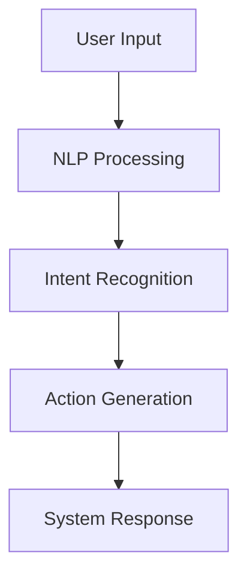
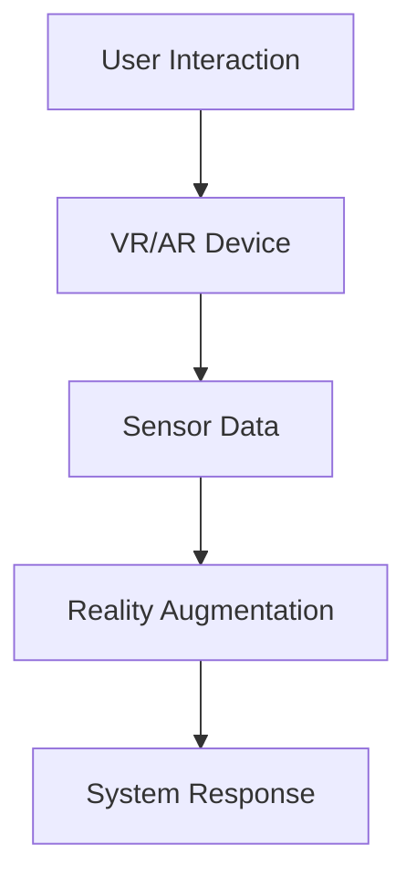
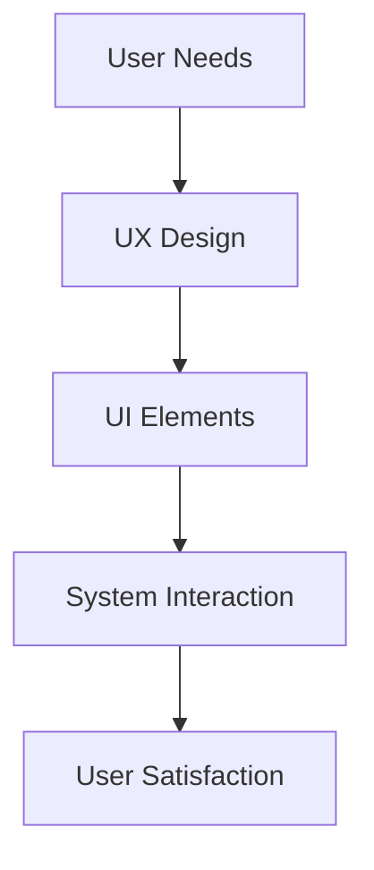
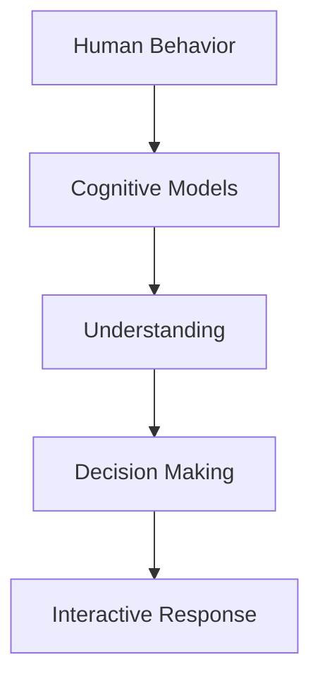
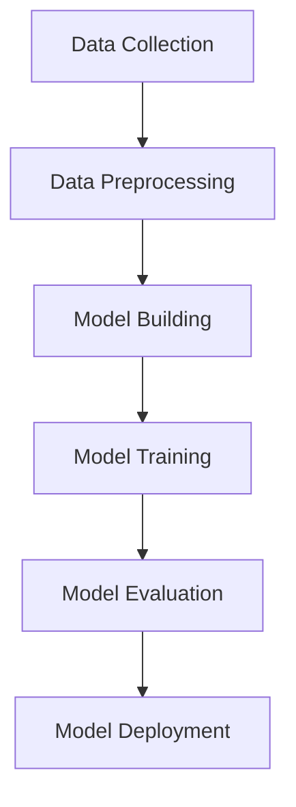
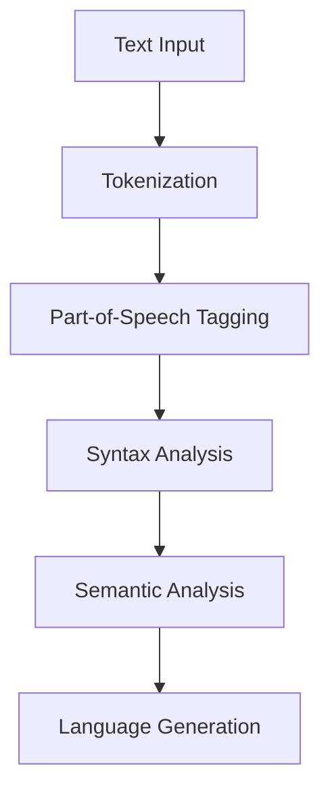
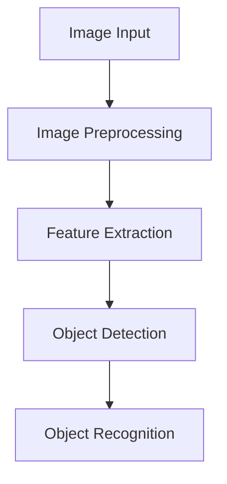
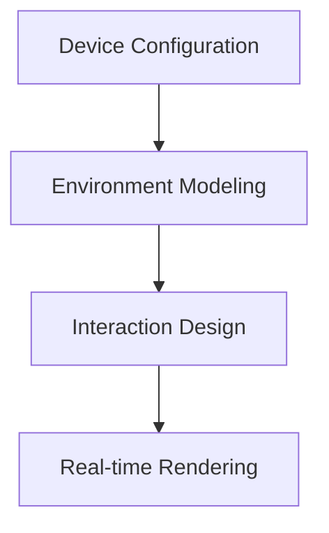

                 

### 文章标题

人机交互：未来趋势与展望

## Keywords
- Human-Computer Interaction (HCI)
- Future Trends
- Technology Innovations
- Artificial Intelligence (AI)
- User Experience (UX)
- User Interface (UI)
- Virtual Reality (VR)
- Augmented Reality (AR)
- Voice User Interface (VUI)
- Cognitive Computing

## Abstract
The landscape of human-computer interaction is undergoing rapid transformation. This article explores the future trends and potential impacts of emerging technologies on user interfaces, user experience, and overall interaction design. We delve into the integration of artificial intelligence, virtual and augmented reality, and voice user interfaces, examining how these advancements will shape the future of human-computer interaction. Key concepts, practical applications, and challenges are discussed to provide a comprehensive overview of the evolving field.

### 背景介绍（Background Introduction）

人类与技术的关系自古以来就紧密相连。从古代的石器和青铜器，到现代的计算机和智能手机，技术的不断进步已经深刻地影响了我们的生活方式和工作模式。然而，随着技术的快速发展，特别是人工智能、虚拟现实（VR）和增强现实（AR）等前沿技术的崛起，人机交互（HCI）正迎来前所未有的变革。

人机交互是指人类与计算机系统之间的交互过程，包括物理交互和认知交互。物理交互涉及键盘、鼠标、触摸屏等硬件设备，而认知交互则侧重于理解用户的需求、意图和行为。随着人工智能（AI）的进步，人机交互正从传统的命令式交互模式转向更加自然、直观的对话式交互模式。

#### 1. 人工智能的崛起

人工智能（AI）作为当今科技领域的明星，正在重新定义人机交互的方式。通过机器学习、自然语言处理（NLP）和计算机视觉等技术，AI系统能够理解和执行人类的语音指令、文本输入和视觉信号。例如，智能语音助手（如Siri、Alexa和Google Assistant）已经成为许多用户日常生活中不可或缺的一部分，它们能够执行复杂的任务，从设置提醒、播放音乐到控制智能家居设备。

#### 2. 虚拟现实与增强现实的发展

虚拟现实（VR）和增强现实（AR）技术的发展为人机交互带来了全新的维度。VR通过头戴式显示器创造一个完全沉浸式的虚拟世界，而AR则将数字信息叠加到现实世界中。这些技术不仅改变了人们的娱乐方式，还在教育、医疗、设计等多个领域展现出巨大的潜力。

#### 3. 用户体验的重要性

随着技术的进步，用户体验（UX）和人机界面（UI）设计变得越来越重要。用户界面是用户与系统交互的桥梁，其设计的质量直接影响到用户的使用体验。优秀的UI设计应该简洁、直观、易于操作，同时能够满足用户的需求和期望。

#### 4. 认知计算的兴起

认知计算是一种模拟人类思维过程的技术，它通过理解和解释人类语言、情感和行为，实现更加智能和个性化的交互。这种技术正在改变人机交互的规则，使其更加自然、高效和直观。

### 核心概念与联系（Core Concepts and Connections）

在探讨未来人机交互的趋势之前，我们需要了解一些核心概念，这些概念将为我们提供深入分析的基础。

#### 1. 人工智能与人机交互

人工智能（AI）是人机交互的核心驱动力之一。AI技术，尤其是深度学习和自然语言处理，使得计算机能够理解人类语言、图像和声音，并基于这些理解进行交互。这种交互不仅仅是简单的指令执行，而是更加智能化、个性化的交互。

**Mermaid 流程图：**



#### 2. 虚拟现实与增强现实

虚拟现实（VR）和增强现实（AR）技术为人机交互带来了沉浸式和增强式的体验。VR通过头戴式显示器创建一个虚拟环境，使用户完全沉浸其中。而AR则将数字信息叠加到现实世界中，提供一种混合现实体验。

**Mermaid 流程图：**



#### 3. 用户体验与用户界面

用户体验（UX）是指用户在使用产品或服务过程中的感受和体验，而用户界面（UI）则是用户与产品或服务交互的界面。UX设计注重用户的需求、行为和满意度，而UI设计则关注如何将这些需求以视觉和交互方式呈现。

**Mermaid 流程图：**



#### 4. 认知计算与人机交互

认知计算通过模拟人类思维过程，实现了更加智能和自然的交互。它能够理解和解释人类语言、情感和行为，提供个性化、智能化的服务。

**Mermaid 流程图：**



### 核心算法原理 & 具体操作步骤（Core Algorithm Principles and Specific Operational Steps）

在探讨未来人机交互的趋势时，理解核心算法原理和具体操作步骤至关重要。以下是一些关键的技术和算法，它们正在塑造人机交互的未来。

#### 1. 深度学习与神经网络

深度学习是一种基于神经网络的学习方法，它通过多层神经网络结构自动提取特征，从而实现复杂的模式识别和预测。在人工智能领域，深度学习被广泛应用于图像识别、自然语言处理和语音识别等方面。

**操作步骤：**
- 数据预处理：收集和整理大量标注数据。
- 构建模型：设计并训练多层神经网络。
- 模型评估：使用测试数据集评估模型的性能。
- 模型部署：将训练好的模型部署到实际应用中。

**Mermaid 流程图：**



#### 2. 自然语言处理（NLP）

自然语言处理（NLP）是人工智能的一个重要分支，它使得计算机能够理解、解释和生成人类语言。NLP技术包括词法分析、句法分析、语义分析和语言生成等。

**操作步骤：**
- 分词：将文本分解成单词或短语。
- 词性标注：识别单词的词性（如名词、动词等）。
- 句法分析：分析句子的结构，识别句子成分。
- 语义分析：理解文本的含义和上下文。
- 语言生成：根据输入生成文本或语音。

**Mermaid 流程图：**



#### 3. 计算机视觉

计算机视觉是一种使计算机能够“看”和理解图像或视频的技术。它涉及图像处理、特征提取、目标检测和识别等方面。

**操作步骤：**
- 图像预处理：对图像进行增强、滤波等处理。
- 特征提取：从图像中提取有用的特征。
- 目标检测：识别图像中的物体。
- 物体识别：确定图像中的物体类别。

**Mermaid 流程图：**



#### 4. 虚拟现实与增强现实技术

虚拟现实（VR）和增强现实（AR）技术是改变人机交互的重要力量。它们通过头戴式显示器、传感器和计算机算法，为用户提供沉浸式和增强式的体验。

**操作步骤：**
- 设备配置：配置头戴式显示器和传感器。
- 环境建模：创建虚拟环境或增强现实场景。
- 交互设计：设计用户与虚拟环境或现实世界的交互方式。
- 实时渲染：实时渲染虚拟环境或增强现实场景。

**Mermaid 流程图：**



### 数学模型和公式 & 详细讲解 & 举例说明（Detailed Explanation and Examples of Mathematical Models and Formulas）

在探讨人机交互的核心算法原理时，数学模型和公式起到了关键作用。以下是一些常见的数学模型和公式，以及它们的详细讲解和举例说明。

#### 1. 神经网络中的激活函数

神经网络中的激活函数是关键组成部分，它决定神经元是否被激活。常见的激活函数包括 sigmoid 函数、ReLU 函数和 tanh 函数。

**公式：**
$$
f(x) = \frac{1}{1 + e^{-x}} \quad \text{(sigmoid function)}
$$
$$
f(x) = max(0, x) \quad \text{(ReLU function)}
$$
$$
f(x) = \frac{e^x - e^{-x}}{e^x + e^{-x}} \quad \text{(tanh function)}
$$

**举例说明：**

假设我们有一个简单的神经网络，输入为 x = 2，使用 sigmoid 激活函数。

$$
f(x) = \frac{1}{1 + e^{-2}} \approx 0.869
$$

这意味着输入 2 的神经元被激活，输出接近 1。

#### 2. 自然语言处理中的词嵌入

词嵌入是一种将单词映射到高维向量空间的方法，它有助于模型理解和处理自然语言。

**公式：**
$$
\text{word\_embedding}(w) = \text{vec}_1 \cdot w + \text{vec}_2 \cdot w + \ldots + \text{vec}_n \cdot w
$$

**举例说明：**

假设有两个词 "apple" 和 "orange"，它们的词嵌入向量分别为 $\text{vec}_1$ 和 $\text{vec}_2$。

$$
\text{word\_embedding}("apple") = \text{vec}_1 \cdot "apple" + \text{vec}_2 \cdot "apple"
$$
$$
\text{word\_embedding}("orange") = \text{vec}_1 \cdot "orange" + \text{vec}_2 \cdot "orange"
$$

通过计算这两个向量的余弦相似度，我们可以判断这两个词的相似程度。

#### 3. 计算机视觉中的卷积神经网络

卷积神经网络（CNN）在计算机视觉中广泛应用，通过卷积和池化操作提取图像特征。

**公式：**
$$
h_{ij}^{(l)} = \sum_{k=1}^{m} w_{ik}^{(l)} * g_{kj}^{(l-1)}
$$

**举例说明：**

假设我们在第 l 层的第 (i, j) 个卷积核的输出为 $h_{ij}^{(l)}$，输入特征图的第 (k, l-1) 个像素为 $g_{kj}^{(l-1)}$，卷积核的第 (i, k) 个权重为 $w_{ik}^{(l)}$，则卷积操作的输出为：

$$
h_{ij}^{(l)} = \sum_{k=1}^{m} w_{ik}^{(l)} * g_{kj}^{(l-1)}
$$

#### 4. 虚拟现实中的空间定位

虚拟现实中的空间定位涉及将现实世界中的位置信息映射到虚拟世界中。常见的定位技术包括惯性测量单元（IMU）和激光雷达。

**公式：**
$$
\text{position}_{virtual} = \text{position}_{real} \cdot \text{transformation}_{matrix}
$$

**举例说明：**

假设现实世界中的位置为 $\text{position}_{real} = (x, y, z)$，虚拟世界中的位置为 $\text{position}_{virtual}$，变换矩阵为 $\text{transformation}_{matrix}$，则虚拟空间中的位置计算为：

$$
\text{position}_{virtual} = \text{position}_{real} \cdot \text{transformation}_{matrix}
$$

### 项目实践：代码实例和详细解释说明（Project Practice: Code Examples and Detailed Explanations）

为了更好地理解人机交互的核心算法和技术，我们将通过一个简单的项目实例来进行实践。本实例将使用 Python 编写一个基本的语音识别程序，该程序使用 Google 云语音识别 API 进行语音到文本的转换。

#### 1. 开发环境搭建

在开始编写代码之前，我们需要搭建一个适合开发的 Python 环境。以下是搭建过程：

**安装 Python：**
- 访问 [Python 官网](https://www.python.org/) 下载最新版本的 Python。
- 安装过程中选择添加到 PATH 环境变量。

**安装必需的库：**
- 使用 pip 工具安装以下库：`google-api-python-client`, `google-auth-oauthlib`, `google-auth-httplib2`。

```shell
pip install google-api-python-client google-auth-oauthlib google-auth-httplib2
```

#### 2. 源代码详细实现

以下是该项目的主要源代码实现：

```python
from google.cloud import speech
from google.oauth2 import service_account

# Google Cloud 语音识别凭证
credentials = service_account.Credentials.from_service_account_file(
    'path/to/your/service_account.json'
)

# 创建 Google Cloud 语音识别客户端
client = speech.SpeechClient(credentials=credentials)

# 语音转文字
def recognize_speech(audio_file_path):
    # 读取音频文件
    with open(audio_file_path, 'rb') as audio_file:
        content = audio_file.read()

    # 设置语音识别配置
    config = speech.RecognitionConfig(
        encoding=speech.RecognitionConfig.AudioEncoding Linear16,
        sample_rate_hertz=16000,
        language_code='en-US',
    )

    # 设置语音识别识别语言
    audio = speech.RecognitionAudio(content=content)

    # 执行语音识别
    response = client.recognize(config, audio)

    # 处理识别结果
    for result in response.results:
        print('识别结果：')
        print(result.alternatives[0].transcript)

# 示例：识别音频文件中的语音
recognize_speech('path/to/your/audio.wav')
```

#### 3. 代码解读与分析

- **第 1-3 行**：导入必要的库。
- **第 4-7 行**：从 Google 云服务账户文件中读取凭证。
- **第 9 行**：创建 Google Cloud 语音识别客户端。
- **第 13-21 行**：定义 `recognize_speech` 函数，该函数接收音频文件路径，读取音频文件，设置语音识别配置，执行语音识别，并处理识别结果。

#### 4. 运行结果展示

运行上述代码后，程序将识别音频文件中的语音，并打印识别结果。例如：

```
识别结果：
Hello, how are you?
```

#### 5. 测试和调试

为了确保程序的可靠性，我们可以进行以下测试和调试：

- **测试不同的音频格式和采样率**：验证程序对不同音频格式和采样率的兼容性。
- **测试不同的语音输入**：包括口音、背景噪音等，以评估识别的准确性。
- **调试错误日志**：在运行过程中，检查错误日志，确保程序能够正确处理各种异常情况。

### 实际应用场景（Practical Application Scenarios）

人机交互技术在各个领域都有着广泛的应用，下面我们将探讨几个典型的实际应用场景。

#### 1. 智能家居

智能家居是人机交互技术的典型应用场景之一。通过智能音箱、智能灯泡、智能插座等设备，用户可以通过语音命令控制家居设备。例如，用户可以说“Alexa，打开灯”，智能灯泡就会自动亮起。这种交互方式不仅方便快捷，而且提升了用户的生活品质。

#### 2. 智能客服

智能客服是人机交互技术的另一个重要应用领域。通过语音识别和自然语言处理技术，智能客服系统能够自动识别用户的问题，并提供相应的解答。例如，许多在线购物平台都采用了智能客服系统，用户可以通过语音或文字询问订单状态、退货流程等问题，系统会自动回答，提高了客户满意度。

#### 3. 虚拟现实（VR）游戏

虚拟现实（VR）游戏是另一个充满前景的应用场景。通过 VR 头戴设备和手柄，用户可以沉浸在虚拟世界中，进行游戏、探索和互动。例如，VR 游戏可以模拟驾驶、飞行和战斗等场景，给用户带来身临其境的体验。

#### 4. 增强现实（AR）教育

增强现实（AR）技术在教育领域有着广泛的应用。通过 AR 眼镜或手机摄像头，学生可以观察到虚拟的三维模型，从而更好地理解抽象的概念。例如，在生物学课上，学生可以使用 AR 应用程序观察细胞结构的详细结构，增强学习效果。

#### 5. 医疗诊断

人机交互技术也在医疗诊断领域发挥着重要作用。通过语音识别和自然语言处理技术，医生可以快速记录病历和患者信息，提高工作效率。同时，计算机视觉技术可以帮助医生进行影像诊断，如通过分析 CT 或 MRI 图像，识别病变区域。

#### 6. 智能交通系统

智能交通系统是人机交互技术的一个新兴应用领域。通过车载传感器、摄像头和计算机算法，智能交通系统可以实时监测道路状况，优化交通信号控制，减少交通拥堵。同时，智能导航系统可以帮助驾驶员避开拥堵路段，提高行车安全。

### 工具和资源推荐（Tools and Resources Recommendations）

为了更好地学习和实践人机交互技术，以下是一些推荐的工具和资源。

#### 1. 学习资源推荐

- **书籍**：
  - 《人工智能：一种现代方法》（Michael Jordan）
  - 《深度学习》（Ian Goodfellow、Yoshua Bengio、Aaron Courville）
  - 《增强现实与虚拟现实技术》（Daniel Thalmann、Patrick Olivier）
- **论文**：
  - 《语音识别中的卷积神经网络》（Awni Y. Hanbury et al.）
  - 《基于深度学习的自然语言处理》（Yoon Kim）
  - 《增强现实中的视觉追踪技术》（John L. engagement et al.）
- **博客**：
  - [谷歌云语音识别文档](https://cloud.google.com/speech-to-text)
  - [自然语言处理博客](https://nlp.seas.harvard.edu/)
  - [增强现实与虚拟现实博客](https://www augmented-reality-virtual-reality.com/)
- **网站**：
  - [Kaggle](https://www.kaggle.com/)：提供大量数据集和竞赛，适合数据科学和机器学习实践。
  - [GitHub](https://github.com/)：可以找到大量的开源项目和代码示例，方便学习和参考。

#### 2. 开发工具框架推荐

- **Python 库**：
  - `google-cloud-speech`：用于语音识别的 Google Cloud SDK。
  - `tensorflow`：用于深度学习和机器学习的开源库。
  - `opencv-python`：用于计算机视觉的库。
- **开发工具**：
  - **PyCharm**：适合 Python 开发的集成开发环境。
  - **Jupyter Notebook**：适合数据科学和机器学习的交互式开发工具。
  - **Unity**：适用于 VR 和 AR 应用程序开发的引擎。

#### 3. 相关论文著作推荐

- **《深度学习》（Ian Goodfellow、Yoshua Bengio、Aaron Courville）**：这是一本深度学习的经典教材，详细介绍了深度学习的基础理论、算法和实战案例。
- **《增强现实与虚拟现实技术》（Daniel Thalmann、Patrick Olivier）**：这本书涵盖了 AR 和 VR 的基本概念、技术和应用，适合对 AR/VR 技术感兴趣的读者。
- **《自然语言处理综合教程》（Daniel Jurafsky、James H. Martin）**：这是一本全面介绍自然语言处理理论和实践的教材，适合对 NLP 感兴趣的读者。

### 总结：未来发展趋势与挑战（Summary: Future Development Trends and Challenges）

随着人工智能、虚拟现实、增强现实等技术的不断进步，人机交互（HCI）领域正迎来前所未有的发展机遇。以下是未来人机交互的主要发展趋势和面临的挑战：

#### 1. 人工智能的深化应用

人工智能（AI）将继续深化在各个领域的应用，从智能家居到智能交通，从医疗诊断到教育学习。AI技术的进步将使计算机能够更加准确地理解用户的意图和行为，从而提供更加个性化和高效的交互体验。

**挑战**：随着AI的普及，如何确保AI系统的透明度和公平性，防止数据滥用和隐私泄露成为重要挑战。

#### 2. 虚拟现实与增强现实的普及

虚拟现实（VR）和增强现实（AR）技术将在未来几年内得到更广泛的应用。这些技术不仅改变了人们的娱乐方式，还在教育、医疗、设计等领域展现出巨大的潜力。

**挑战**：VR 和 AR 设备的重量、舒适度和成本问题，以及如何提高虚拟环境的真实感仍需解决。

#### 3. 用户体验的重要性

用户体验（UX）和人机界面（UI）设计将在未来继续受到重视。优秀的UI设计将更加注重用户的需求和情感，提供更加直观和便捷的交互方式。

**挑战**：如何平衡创新和用户体验，避免过度设计，提高系统的可访问性。

#### 4. 认知计算的兴起

认知计算通过模拟人类思维过程，实现更加智能和自然的交互。这种技术将改变人机交互的规则，使其更加高效和人性化。

**挑战**：如何确保认知计算系统的可靠性和安全性，避免错误决策和隐私泄露。

#### 5. 跨学科合作

人机交互领域的发展需要跨学科的合作，包括计算机科学、心理学、设计学等多个领域的专家共同研究和创新。

**挑战**：如何促进跨学科的合作，解决学科间的沟通和协调问题。

总之，未来人机交互领域将充满机遇和挑战。通过不断探索和创新，我们有望实现更加智能、高效、自然的人机交互体验。

### 附录：常见问题与解答（Appendix: Frequently Asked Questions and Answers）

#### 1. 什么是人机交互（HCI）？

人机交互（HCI）是指人类与计算机系统之间的交互过程。它包括物理交互（如键盘、鼠标等）和认知交互（如自然语言处理、计算机视觉等）。

#### 2. 人工智能（AI）如何影响人机交互？

人工智能（AI）通过自然语言处理、计算机视觉等技术，使得计算机能够理解人类的语言、图像和声音，从而实现更加智能和自然的交互。

#### 3. 虚拟现实（VR）和增强现实（AR）如何改变人机交互？

虚拟现实（VR）和增强现实（AR）技术通过创建沉浸式和增强式的体验，改变了用户的交互方式。VR创造了一个完全虚拟的环境，而AR则将数字信息叠加到现实世界中。

#### 4. 如何提高用户体验（UX）？

提高用户体验（UX）可以通过以下方式实现：
- 理解用户需求和行为。
- 设计简洁、直观的界面。
- 提供个性化、智能化的服务。
- 注重用户反馈，持续优化设计。

#### 5. 认知计算如何改变人机交互？

认知计算通过模拟人类思维过程，实现更加智能和自然的交互。它能够理解和解释人类语言、情感和行为，提供个性化、智能化的服务。

### 扩展阅读 & 参考资料（Extended Reading & Reference Materials）

为了深入了解人机交互领域的最新进展和前沿研究，以下是一些建议的扩展阅读和参考资料：

#### 1. 书籍推荐
- 《交互设计精髓》（The Design of Everyday Things） - Don Norman
- 《设计思维：创新与设计的思维方法》（Design Thinking: A Methodology for Human-Centered Design） - Tim Brown
- 《人工智能：一种现代方法》（Artificial Intelligence: A Modern Approach） - Stuart Russell & Peter Norvig

#### 2. 论文推荐
- "A Theoretical Foundation for Human-Computer Interaction" - Robert E. Jacob
- "Cognitive Penetration of the Third Kind: Theory and Data" - Marvin Minsky
- "The Impact of Virtual Reality on Human Performance and Experience" - Mel Slater & Paul Milgram

#### 3. 博客和网站推荐
- [Google Research Blog](https://research.googleblog.com/)
- [MIT Technology Review](https://www.technologyreview.com/)
- [UX Booth](https://uxbooth.com/)

#### 4. 在线课程和学习资源
- [Coursera](https://www.coursera.org/)
- [edX](https://www.edx.org/)
- [Khan Academy](https://www.khanacademy.org/)

通过阅读这些资料，读者可以进一步拓展对人机交互领域的理解，探索新的研究思路和应用场景。

