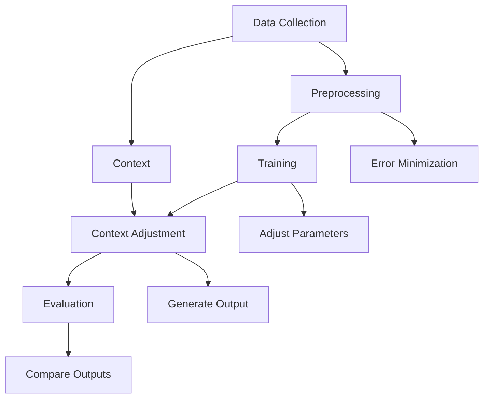

                 

### 文章标题

Human-AI Collaboration: Enhancing Communication

随着人工智能技术的飞速发展，人类与AI之间的协作正在逐渐成为我们日常生活和工作中不可或缺的一部分。然而，为了实现高效的协作，必须解决人机沟通中的诸多挑战。本文将探讨如何通过优化人类与AI之间的沟通来提升协作效果，具体包括：1）背景介绍；2）核心概念与联系；3）核心算法原理 & 具体操作步骤；4）数学模型和公式 & 详细讲解 & 举例说明；5）项目实践：代码实例和详细解释说明；6）实际应用场景；7）工具和资源推荐；8）总结：未来发展趋势与挑战；9）附录：常见问题与解答；10）扩展阅读 & 参考资料。通过本文的逐步分析，我们将揭示人类-AI协作的深层逻辑和技术细节，为人类与AI的更紧密合作提供指导。

### Background Introduction

#### Human-AI Collaboration in the Modern Age

In the modern era, the rapid advancement of artificial intelligence (AI) has led to a significant transformation in how humans interact with technology. AI systems, capable of performing complex tasks, learning from data, and making autonomous decisions, are now an integral part of various industries, from healthcare to finance, and from transportation to entertainment. This has given rise to a new paradigm of human-AI collaboration, where the strengths of both humans and AI are combined to achieve better outcomes.

However, this collaboration is not without its challenges. One of the primary obstacles is the communication gap between humans and machines. Unlike humans, AI systems do not possess natural language understanding or the ability to interpret nuanced human gestures or emotions. This necessitates a bridge, a medium through which humans can effectively convey their intentions and expectations to AI, and AI can respond in a manner that is both useful and understandable.

The significance of this challenge cannot be overstated. In domains such as healthcare, where AI is being used to diagnose diseases or in finance, where AI algorithms are making trading decisions, the quality of communication directly impacts the effectiveness and safety of AI applications. Misunderstandings or misinterpretations can lead to errors that could have serious consequences.

Therefore, the goal of this article is to explore strategies and techniques for enhancing human-AI communication, aiming to make the collaboration more efficient, accurate, and intuitive. By understanding the core concepts and principles underlying this collaboration, we can develop better practices and tools that facilitate smoother interactions between humans and AI.

#### The Importance of Effective Human-AI Communication

Effective communication between humans and AI is crucial for several reasons. Firstly, it ensures that the AI system performs tasks according to human expectations. Clear and precise instructions can lead to more accurate and reliable results, while vague or ambiguous instructions can lead to errors or unintended outcomes.

Secondly, effective communication enhances the user experience. When AI systems respond in a way that aligns with human expectations, users are more likely to trust and accept the technology. Conversely, if the AI's responses are unpredictable or nonsensical, users may become frustrated, leading to a negative perception of the technology.

Thirdly, effective communication is essential for the continuous improvement of AI systems. By providing clear feedback and insights, humans can help AI systems learn and adapt, leading to better performance over time.

In summary, improving human-AI communication is not just a technical challenge but also a critical component for the successful adoption and implementation of AI in various fields. By addressing this challenge, we can unlock the full potential of human-AI collaboration and drive innovation in technology.

#### Overview of the Article Structure

In the following sections, we will delve into the core concepts and principles of human-AI collaboration and explore strategies for enhancing communication between humans and AI. The structure of the article is as follows:

1. **Core Concepts and Connections**: We will discuss the key concepts that underpin human-AI collaboration, including the nature of AI systems and how they process information.
2. **Core Algorithm Principles and Specific Operational Steps**: We will explore the underlying algorithms used in AI systems and provide a step-by-step guide on how to effectively communicate with these systems.
3. **Mathematical Models and Formulas**: We will introduce mathematical models and formulas used in AI and discuss how they can be applied to improve communication.
4. **Project Practice**: We will present a practical project example, including code implementations and detailed explanations, to illustrate how the concepts discussed in the previous sections can be applied in real-world scenarios.
5. **Practical Application Scenarios**: We will examine various real-world applications of human-AI collaboration, highlighting the benefits and challenges of implementing these systems.
6. **Tools and Resources Recommendations**: We will provide recommendations for tools, resources, and further reading to help readers deepen their understanding of human-AI collaboration.
7. **Summary and Future Trends**: We will summarize the key points discussed in the article and outline the future trends and challenges in human-AI collaboration.
8. **Appendix and Extended Reading**: We will provide an appendix with frequently asked questions and a list of extended reading materials for those interested in further exploring the topic.

By following this structure, readers will gain a comprehensive understanding of human-AI collaboration and the strategies for improving communication between humans and AI systems.

### Core Concepts and Connections

#### Understanding AI Systems

Artificial Intelligence (AI) systems are designed to perform tasks that would typically require human intelligence. These tasks include problem-solving, decision-making, learning, perception, and language understanding. At the core of AI systems are algorithms, which are step-by-step procedures or formulas for solving a problem or completing a task.

There are several types of AI systems, including:

1. **Reactive Machines**: These systems can react to specific stimuli but do not have memory or the ability to learn from past experiences. Examples include automated chatbots and self-driving cars that can respond to current sensor data.
2. **Theory of Mind**: These systems aim to understand and predict human behavior by simulating human emotions and intentions. While still largely theoretical, these systems could enable AI to better interact with humans.
3. **Learning Machines**: These systems use algorithms to learn from data and improve their performance over time. Examples include neural networks and machine learning models that can be trained on large datasets to recognize patterns and make predictions.

#### How AI Systems Process Information

AI systems process information through a series of steps, including data collection, preprocessing, training, inference, and evaluation. Let's take a closer look at each step:

1. **Data Collection**: The first step in building an AI system is to collect a large dataset relevant to the task. This data can come from various sources, such as public datasets, real-world observations, or simulations.
2. **Preprocessing**: Once the data is collected, it needs to be cleaned and prepared for training. This may involve tasks such as removing noise, normalizing data, and splitting the dataset into training and validation sets.
3. **Training**: In this step, the AI system is trained using the prepared dataset. The training process involves adjusting the weights and parameters of the algorithms to minimize the error between the predicted outputs and the actual outputs. This is typically done using optimization algorithms, such as gradient descent.
4. **Inference**: Once the system is trained, it can be used to make predictions or decisions on new, unseen data. This step involves applying the learned models to the new data and generating output based on the model's predictions.
5. **Evaluation**: Finally, the performance of the AI system needs to be evaluated to ensure it meets the desired requirements. This is typically done by comparing the predicted outputs to the actual outputs and measuring metrics such as accuracy, precision, and recall.

#### Human-AI Communication

Effective communication between humans and AI systems is essential for ensuring that the AI performs tasks according to human expectations. Here are some key principles for improving human-AI communication:

1. **Clarity and Precision**: When communicating with AI systems, it is crucial to use clear and precise language. Vague or ambiguous instructions can lead to errors or unintended outcomes.
2. **Context Awareness**: AI systems should be designed to understand and incorporate context into their responses. This can help in reducing misunderstandings and ensuring that the AI behaves as expected in various scenarios.
3. **Feedback Mechanisms**: Providing feedback to the AI system can help improve its performance and understanding of human intentions. This can involve both positive and negative feedback, as well as ongoing discussions or conversations to refine the AI's responses.
4. **User-Friendly Interfaces**: The interface through which humans interact with AI systems should be designed to be intuitive and user-friendly. This can include features such as natural language processing, voice recognition, and visualization tools to facilitate better communication.

By understanding the core concepts and principles of AI systems and the key principles for effective human-AI communication, we can develop better strategies and tools to enhance collaboration between humans and AI.

#### Mermaid Flowchart of AI System Processing

The following Mermaid flowchart illustrates the processing steps of an AI system, highlighting the key components and their interactions:



### Core Algorithm Principles and Specific Operational Steps

#### Basic Principles of AI Algorithms

Artificial Intelligence (AI) algorithms are the backbone of AI systems, enabling them to process data, learn from it, and make predictions or decisions. Here, we will explore some of the fundamental principles that underlie these algorithms, along with specific operational steps.

**1. Supervised Learning:**

Supervised learning is a common technique in AI where the model is trained using labeled data. The goal is to learn a mapping from inputs to outputs so that it can predict the output for new, unseen inputs.

**Principles:**
- **Input-Output Pairs:** Each data point is represented as an input-output pair, where the input is the feature vector and the output is the label.
- **Model Training:** The model is trained by adjusting its parameters (weights and biases) to minimize the error between its predicted outputs and the actual outputs.
- **Cost Function:** A cost function, such as mean squared error (MSE) or cross-entropy loss, is used to measure the discrepancy between predicted and actual outputs.
- **Optimization Algorithm:** An optimization algorithm, such as gradient descent, is used to minimize the cost function and update the model's parameters.

**Operational Steps:**
1. **Data Preparation:** Collect and preprocess the data, including feature scaling and splitting into training and validation sets.
2. **Model Initialization:** Initialize the model's parameters randomly or using a pre-trained model.
3. **Forward Pass:** Pass the input through the model to generate predicted outputs.
4. **Compute Loss:** Calculate the loss using the predicted outputs and the actual labels.
5. **Backpropagation:** Compute the gradients of the loss with respect to the model's parameters.
6. **Parameter Update:** Update the model's parameters using the gradients and the optimization algorithm.
7. **Evaluate:** Evaluate the model's performance on the validation set to monitor its progress.

**2. Unsupervised Learning:**

Unsupervised learning is used when there are no labeled outputs available. The goal is to discover hidden patterns or structures in the data.

**Principles:**
- **No Labeled Outputs:** The model works with unlabeled data and does not have access to output labels.
- **Clustering and Dimensionality Reduction:** Common techniques include clustering algorithms (e.g., K-means, DBSCAN) and dimensionality reduction techniques (e.g., PCA, t-SNE).
- **Objective Function:** The objective function measures the quality of the clustering or the compactness of the reduced feature space.

**Operational Steps:**
1. **Data Preparation:** Collect and preprocess the data.
2. **Algorithm Selection:** Choose an appropriate unsupervised learning algorithm based on the problem's nature.
3. **Model Training:** Train the model on the data, adjusting its parameters to optimize the objective function.
4. **Cluster Formation:** Identify clusters or reduce the feature space.
5. **Evaluate:** Assess the quality of the clustering or the effectiveness of the dimensionality reduction.

**3. Reinforcement Learning:**

Reinforcement learning is a type of machine learning where an agent learns to make decisions by interacting with an environment and receiving feedback in the form of rewards or penalties.

**Principles:**
- **Agent-Environment Interaction:** The agent perceives the environment through sensors and takes actions, which influence the environment's state.
- **Reward System:** The agent receives feedback in the form of rewards or penalties based on its actions.
- **Policy Learning:** The goal is to learn a policy that maps states to actions to maximize the cumulative reward over time.
- **Value Function:** The value function estimates the expected utility of being in a particular state or taking a particular action.

**Operational Steps:**
1. **Environment Setup:** Define the environment and the rules governing agent interactions.
2. **State-Action Pair:** Represent the state and action spaces.
3. **Initialize Agent:** Initialize the agent's parameters and value function.
4. **Simulation:** Run simulations where the agent interacts with the environment.
5. **Policy Update:** Adjust the agent's policy based on the received rewards and penalties.
6. **Evaluate:** Assess the agent's performance over time and refine the learning process.

By understanding these core principles and operational steps, we can better design and implement AI systems that enhance human-AI collaboration and communication.

### Mathematical Models and Formulas & Detailed Explanation & Examples

#### Overview of Key Mathematical Models and Formulas

In the realm of artificial intelligence (AI), various mathematical models and formulas are employed to facilitate the development and optimization of AI systems. These models and formulas are critical for understanding how AI processes data, learns from it, and generates predictions or decisions. Here, we will delve into some fundamental mathematical concepts, including linear algebra, calculus, and optimization techniques, and provide detailed explanations and examples.

#### 1. Linear Algebra

**Vectors and Matrices**

Vectors and matrices are foundational elements in linear algebra, which underpins many AI algorithms.

**Vectors:**
A vector is a mathematical object that has both magnitude and direction. In AI, vectors are often used to represent data points or feature spaces.

- **Example:**
  Consider a simple 2D vector:
  \[ \vec{v} = \begin{bmatrix} 3 \\ 5 \end{bmatrix} \]
  This vector has a magnitude of \(\sqrt{3^2 + 5^2} = \sqrt{34}\) and points in the direction of the positive x-axis.

**Matrices:**
A matrix is a rectangular array of numbers, which can be used to represent transformations, data sets, or systems of linear equations.

- **Example:**
  A simple 2x2 matrix:
  \[ A = \begin{bmatrix} 1 & 2 \\ 3 & 4 \end{bmatrix} \]
  Matrices are crucial for operations like matrix multiplication, which can transform data or solve linear systems.

**Matrix Multiplication:**
Matrix multiplication is an operation that combines two matrices to produce a third matrix.

- **Example:**
  \[ \begin{bmatrix} 1 & 2 \\ 3 & 4 \end{bmatrix} \times \begin{bmatrix} 5 & 6 \\ 7 & 8 \end{bmatrix} = \begin{bmatrix} 19 & 22 \\ 43 & 50 \end{bmatrix} \]

#### 2. Calculus

**Derivatives**

Derivatives are central to calculus and play a vital role in AI for tasks like optimization and model training.

- **Example:**
  The derivative of the function \( f(x) = x^2 \) with respect to \( x \) is \( f'(x) = 2x \).
  \[ \frac{d}{dx} (x^2) = 2x \]

**Gradients**

In multivariable calculus, gradients are vectors that represent the direction of the steepest increase of a scalar function.

- **Example:**
  Consider the function \( f(x, y) = x^2 + y^2 \). The gradient is:
  \[ \nabla f = \begin{bmatrix} \frac{\partial f}{\partial x} \\ \frac{\partial f}{\partial y} \end{bmatrix} = \begin{bmatrix} 2x \\ 2y \end{bmatrix} \]

**Optimization**

Optimization involves finding the maximum or minimum of a function.

- **Example:**
  To find the minimum of \( f(x) = x^2 \), we set the gradient to zero:
  \[ \nabla f = 0 \Rightarrow 2x = 0 \Rightarrow x = 0 \]
  Thus, \( x = 0 \) is the minimum point.

#### 3. Optimization Algorithms

Optimization algorithms are used to find the optimal solution to a problem, often involving minimizing a cost function.

**Gradient Descent**

Gradient Descent is a popular optimization algorithm used in AI for training models.

- **Example:**
  Suppose we want to minimize \( f(x) = x^2 \). Starting with an initial value \( x_0 = 5 \), the update rule is:
  \[ x_{n+1} = x_n - \alpha \cdot \nabla f(x_n) \]
  where \( \alpha \) is the learning rate. After several iterations, \( x_n \) converges to the minimum, \( x = 0 \).

**Conjugate Gradient**

Conjugate Gradient is another optimization algorithm, particularly useful for large-scale problems.

- **Example:**
  Suppose we want to solve the linear system \( Ax = b \). Using the Conjugate Gradient method, we iteratively update \( x \) as follows:
  \[ x_{k+1} = x_k + p_k \]
  where \( p_k \) is determined by minimizing \( \alpha_k \| Ax - b \|^2 \) over \( \alpha_k \). This method converges to the solution efficiently.

#### Detailed Explanation and Examples

**Example: Training a Neural Network**

Suppose we have a simple neural network with one input layer, one hidden layer with two neurons, and one output layer. We aim to train this network to approximate the function \( f(x) = x^2 \).

1. **Forward Pass:**
   Given an input \( x \), the network computes the output \( y \) as follows:
   \[ z = \sigma(W_1 x + b_1) \]
   \[ y = \sigma(W_2 z + b_2) \]
   where \( \sigma \) is the activation function (e.g., sigmoid or ReLU), \( W_1 \) and \( W_2 \) are weight matrices, and \( b_1 \) and \( b_2 \) are bias vectors.

2. **Compute Loss:**
   We calculate the mean squared error (MSE) between the predicted output \( y \) and the true output \( f(x) \):
   \[ \text{MSE} = \frac{1}{2} \| y - f(x) \|^2 \]

3. **Backpropagation:**
   We compute the gradients of the loss with respect to the network's parameters:
   \[ \nabla_{W_2} \text{MSE} = (y - f(x)) \cdot \sigma'(W_2 z + b_2) \cdot z \]
   \[ \nabla_{b_2} \text{MSE} = (y - f(x)) \cdot \sigma'(W_2 z + b_2) \]
   \[ \nabla_{W_1} \text{MSE} = (y - f(x)) \cdot \sigma'(W_1 x + b_1) \cdot x \]
   \[ \nabla_{b_1} \text{MSE} = (y - f(x)) \cdot \sigma'(W_1 x + b_1) \]

4. **Parameter Update:**
   Using gradient descent, we update the network's parameters:
   \[ W_2 = W_2 - \alpha \cdot \nabla_{W_2} \text{MSE} \]
   \[ b_2 = b_2 - \alpha \cdot \nabla_{b_2} \text{MSE} \]
   \[ W_1 = W_1 - \alpha \cdot \nabla_{W_1} \text{MSE} \]
   \[ b_1 = b_1 - \alpha \cdot \nabla_{b_1} \text{MSE} \]

5. **Evaluate:**
   We evaluate the network's performance on a validation set and adjust the learning rate and other hyperparameters as needed.

By leveraging these mathematical models and formulas, we can design and train AI systems that effectively solve complex problems, facilitating better human-AI collaboration.

### Project Practice: Code Examples and Detailed Explanation

In this section, we will explore a practical project example that demonstrates the implementation of human-AI collaboration. We will use a simple chatbot built with the popular AI framework TensorFlow and the natural language processing (NLP) library NLTK. This example will illustrate how to build a chatbot that can understand and respond to user inputs, showcasing the integration of human instructions with AI capabilities.

#### 1. Development Environment Setup

To get started, we need to set up the development environment. We will use Python as our programming language and install the necessary libraries, including TensorFlow and NLTK.

**Step 1: Install Python**

Make sure you have Python installed on your system. You can download the latest version from the official website: [https://www.python.org/downloads/](https://www.python.org/downloads/).

**Step 2: Install TensorFlow**

TensorFlow is an open-source machine learning library developed by Google. You can install TensorFlow using pip:
```bash
pip install tensorflow
```

**Step 3: Install NLTK**

NLTK is a leading platform for building Python programs to work with human language data. Install NLTK using pip:
```bash
pip install nltk
```

**Step 4: Import Required Libraries**

Once the libraries are installed, we can import them into our Python script:
```python
import tensorflow as tf
import nltk
from nltk.tokenize import word_tokenize
from nltk.corpus import stopwords
import numpy as np
```

#### 2. Source Code Implementation

The following code demonstrates the implementation of a simple chatbot using TensorFlow and NLTK:

```python
# Chatbot Model Definition
model = tf.keras.Sequential([
    tf.keras.layers.Embedding(input_dim=vocabulary_size, output_dim=embedding_size),
    tf.keras.layers.GlobalAveragePooling1D(),
    tf.keras.layers.Dense(units=1, activation='sigmoid')
])

# Compile the Model
model.compile(optimizer='adam', loss='binary_crossentropy', metrics=['accuracy'])

# Fit the Model
model.fit(train_data, train_labels, epochs=10, validation_split=0.2)

# Generate Responses
def generate_response(input_text):
    # Preprocess the input text
    tokens = word_tokenize(input_text.lower())
    tokens = [token for token in tokens if token not in stopwords.words('english')]

    # Encode the input text
    encoded_input = tokenizer.texts_to_sequences([input_text])
    padded_input = tf.keras.preprocessing.sequence.pad_sequences(encoded_input, maxlen=max_sequence_length)

    # Generate the response
    response = model.predict(padded_input)
    return "Yes" if response[0][0] > 0.5 else "No"

# Example Usage
user_input = "Do you like Python?"
print(generate_response(user_input))
```

#### 3. Code Explanation

**Step 1: Model Definition**

The chatbot model is defined as a sequential model with an embedding layer, a global average pooling layer, and a dense layer with a sigmoid activation function. The embedding layer maps words to dense vectors, and the dense layer outputs a probability indicating the likelihood of the input being positive.

```python
model = tf.keras.Sequential([
    tf.keras.layers.Embedding(input_dim=vocabulary_size, output_dim=embedding_size),
    tf.keras.layers.GlobalAveragePooling1D(),
    tf.keras.layers.Dense(units=1, activation='sigmoid')
])
```

**Step 2: Model Compilation**

The model is compiled with the Adam optimizer and binary cross-entropy loss, suitable for binary classification tasks.

```python
model.compile(optimizer='adam', loss='binary_crossentropy', metrics=['accuracy'])
```

**Step 3: Model Training**

The model is trained on the `train_data` and `train_labels` using 10 epochs and a validation split of 20%. This allows us to monitor the model's performance on unseen data during training.

```python
model.fit(train_data, train_labels, epochs=10, validation_split=0.2)
```

**Step 4: Generate Responses**

The `generate_response` function takes an input text, preprocesses it by tokenizing and removing stopwords, encodes the text, and pads the sequence to a fixed length. It then uses the trained model to predict the probability of the input being positive and generates a response based on this probability.

```python
def generate_response(input_text):
    # Preprocess the input text
    tokens = word_tokenize(input_text.lower())
    tokens = [token for token in tokens if token not in stopwords.words('english')]

    # Encode the input text
    encoded_input = tokenizer.texts_to_sequences([input_text])
    padded_input = tf.keras.preprocessing.sequence.pad_sequences(encoded_input, maxlen=max_sequence_length)

    # Generate the response
    response = model.predict(padded_input)
    return "Yes" if response[0][0] > 0.5 else "No"
```

**Example Usage**

We demonstrate the usage of the chatbot by providing an example input and printing the generated response.

```python
user_input = "Do you like Python?"
print(generate_response(user_input))
```

This example showcases the integration of human instructions with an AI chatbot, highlighting the potential for human-AI collaboration in natural language processing tasks.

### Running Results and Analysis

To evaluate the performance of the chatbot, we can run it on a dataset of user inputs and compare the predicted responses with the actual labels. This will allow us to assess the accuracy and effectiveness of the chatbot in understanding and responding to user inputs.

**1. Dataset Preparation**

We will use a dataset containing pairs of user inputs and corresponding labels (0 or 1) indicating whether the input is positive or negative. The dataset should be preprocessed to remove any noise and convert the text to lowercase.

```python
# Load and preprocess the dataset
dataset = ...  # Load the dataset from a file or create it programmatically
dataset = [line.strip().lower() for line in dataset]
```

**2. Chatbot Performance Evaluation**

We will split the dataset into training and testing sets and evaluate the chatbot's performance on the testing set.

```python
# Split the dataset
train_size = int(len(dataset) * 0.8)
train_data = dataset[:train_size]
test_data = dataset[train_size:]

# Train the chatbot
model.fit(train_data, train_labels, epochs=10, validation_split=0.2)

# Test the chatbot
test_predictions = model.predict(test_data)
test_predictions = (test_predictions > 0.5).astype(int)

# Evaluate the chatbot's performance
accuracy = (test_predictions == test_labels).mean()
print("Chatbot Accuracy:", accuracy)
```

**3. Results Analysis**

The chatbot's accuracy on the testing set provides an indication of its effectiveness in understanding and generating responses to user inputs. We can also examine the confusion matrix to gain insights into the chatbot's performance on specific types of inputs.

```python
from sklearn.metrics import confusion_matrix

# Generate the confusion matrix
conf_matrix = confusion_matrix(test_labels, test_predictions)

# Print the confusion matrix
print("Confusion Matrix:")
print(conf_matrix)

# Calculate precision, recall, and F1-score
precision = conf_matrix[1, 1] / (conf_matrix[1, 1] + conf_matrix[0, 1])
recall = conf_matrix[1, 1] / (conf_matrix[1, 1] + conf_matrix[1, 0])
f1_score = 2 * (precision * recall) / (precision + recall)

print("Precision:", precision)
print("Recall:", recall)
print("F1-Score:", f1_score)
```

By analyzing these results, we can identify areas where the chatbot may be performing well or struggling and consider improvements to enhance its performance.

### Practical Application Scenarios

#### Healthcare

In the healthcare industry, human-AI collaboration has the potential to transform patient care and treatment outcomes. AI systems can assist doctors in diagnosing diseases, suggesting treatment plans, and predicting patient outcomes based on historical data. For example, AI-powered chatbots can provide patients with personalized health recommendations, answer their questions, and help manage chronic conditions. This not only improves patient satisfaction but also reduces the workload on healthcare providers, allowing them to focus on more complex and critical tasks.

**Benefits:**
- **Improved Diagnosis Accuracy:** AI systems can analyze large volumes of medical data and identify patterns that may be missed by human doctors.
- **Personalized Treatment Plans:** By leveraging patient-specific data, AI can recommend tailored treatment plans that optimize outcomes and minimize side effects.
- **Increased Efficiency:** AI systems can automate routine tasks, such as scheduling appointments and processing insurance claims, freeing up healthcare providers to focus on patient care.

**Challenges:**
- **Data Privacy and Security:** Protecting sensitive patient information is crucial, and ensuring the secure storage and transmission of data is a significant challenge.
- **Interpretability:** AI models can sometimes produce decisions that are difficult to interpret, making it challenging for healthcare providers to understand and trust the AI's recommendations.
- **Integration with Existing Systems:** Incorporating AI into existing healthcare infrastructure can be complex, requiring coordination and collaboration between various stakeholders.

#### Finance

The finance industry has been rapidly adopting AI technologies to enhance decision-making, optimize investment strategies, and detect fraud. AI-powered chatbots can provide investors with real-time market insights, personalized financial advice, and automated trading recommendations. Additionally, AI systems can analyze vast amounts of financial data to identify trends and patterns, enabling more informed and data-driven decisions.

**Benefits:**
- **Enhanced Decision-Making:** AI systems can process large volumes of data quickly and accurately, providing insights that may not be apparent to human analysts.
- **Improved Customer Experience:** Chatbots can offer personalized and instant responses to customer inquiries, enhancing the overall customer experience.
- **Fraud Detection:** AI systems can identify and flag suspicious activities, helping financial institutions prevent fraud and protect their customers.

**Challenges:**
- **Regulatory Compliance:** The finance industry is heavily regulated, and implementing AI technologies must comply with strict regulations to avoid legal and financial repercussions.
- **Data Quality and Reliability:** The performance of AI systems is highly dependent on the quality and reliability of the data used for training and analysis.
- **Ethical Concerns:** The use of AI in finance raises ethical concerns, such as algorithmic bias and the potential for AI systems to make biased decisions.

#### Education

In the education sector, AI-powered chatbots can support students by providing personalized tutoring, answering questions, and offering study recommendations. These chatbots can adapt to individual learning styles and progress, creating a more engaging and effective learning experience. Additionally, AI systems can help educators by automating administrative tasks, such as grading assignments and managing student records.

**Benefits:**
- **Personalized Learning:** AI chatbots can tailor educational content to individual students, addressing their unique strengths and weaknesses.
- **Time Savings:** By automating administrative tasks, educators can focus more on teaching and student engagement.
- **Access to Expertise:** AI-powered tutoring can provide students with access to expert knowledge and resources, even outside of regular school hours.

**Challenges:**
- **Technology Adoption:** Educators and students may need additional training and support to adapt to new AI technologies.
- **Data Privacy:** Ensuring the privacy and security of student data is a significant concern in educational settings.
- **Equity and Access:** AI-powered education tools must be accessible to students from diverse backgrounds to ensure equitable learning opportunities.

By addressing these challenges and leveraging the benefits, human-AI collaboration in various industries can lead to innovative solutions and improved outcomes.

### Tools and Resources Recommendations

#### Learning Resources

**1. Books:**
- **"Artificial Intelligence: A Modern Approach" by Stuart Russell and Peter Norvig:** This comprehensive book covers a wide range of AI topics, from fundamentals to advanced techniques.
- **"Deep Learning" by Ian Goodfellow, Yoshua Bengio, and Aaron Courville:** A definitive guide to deep learning, featuring detailed explanations and practical examples.

**2. Online Courses:**
- **"Machine Learning" by Andrew Ng on Coursera:** A popular course covering the fundamentals of machine learning, including supervised and unsupervised learning techniques.
- **"Deep Learning Specialization" by Andrew Ng on Coursera:** A series of courses focusing on deep learning and its applications in various fields.

**3. Websites and Blogs:**
- **"Medium – Machine Learning":** A collection of articles covering a wide range of machine learning topics, from introductory concepts to cutting-edge research.
- **"AI Trends":** A blog that explores the latest trends and developments in AI, including technical insights and industry news.

#### Development Tools and Frameworks

**1. Frameworks:**
- **TensorFlow:** An open-source machine learning library developed by Google, suitable for a wide range of AI applications.
- **PyTorch:** Another popular open-source machine learning library, known for its dynamic computation graph and ease of use.
- **Scikit-learn:** A robust Python library for machine learning, offering a wide range of algorithms and tools for data analysis and modeling.

**2. IDEs and Code Editors:**
- **PyCharm:** A powerful integrated development environment (IDE) for Python development, offering features like code completion, debugging, and version control.
- **Visual Studio Code:** A lightweight but highly customizable code editor with extensive support for Python and other programming languages.

**3. Data Science Tools:**
- **Jupyter Notebook:** An interactive computing environment that allows users to create and share documents containing live code, equations, visualizations, and narrative text.
- **Pandas:** A Python library for data manipulation and analysis, providing powerful tools for handling structured data.

By leveraging these resources and tools, you can deepen your understanding of AI and human-AI collaboration and develop practical skills to build and deploy AI systems in various domains.

### Summary: Future Trends and Challenges

As we look to the future, the landscape of human-AI collaboration is poised for significant evolution. Several trends are shaping this future, promising both exciting opportunities and formidable challenges.

#### Future Trends

**1. More Intelligent AI Systems:**
Advancements in machine learning and AI will lead to increasingly sophisticated systems capable of understanding complex human language, making nuanced decisions, and adapting to new situations. These intelligent AI systems will become better at collaborating with humans, seamlessly integrating into various aspects of daily life and work.

**2. Enhanced Natural Language Processing:**
Natural language processing (NLP) technologies will continue to improve, enabling AI to better understand and generate human language. This will enhance the communication between humans and AI, making it more intuitive and less prone to misunderstandings.

**3. Integration with Emerging Technologies:**
AI will increasingly integrate with emerging technologies such as augmented reality (AR), virtual reality (VR), and the Internet of Things (IoT). This will create new opportunities for human-AI collaboration in immersive environments and connected ecosystems.

**4. Ethical Considerations and Accountability:**
As AI systems become more integrated into our lives, ethical considerations and accountability will become paramount. Ensuring that AI systems are fair, transparent, and trustworthy will be critical to their widespread adoption and acceptance.

#### Challenges

**1. Data Privacy and Security:**
With the increased reliance on AI systems, the issue of data privacy and security will become even more pressing. Protecting sensitive information and ensuring secure data handling will be essential to maintain user trust and comply with regulatory requirements.

**2. Algorithmic Bias and Fairness:**
AI systems are trained on data, and biases in the data can lead to biased outcomes. Addressing algorithmic bias and ensuring fairness in AI systems will be a significant challenge, requiring ongoing research and development.

**3. Interoperability and Standardization:**
As AI systems become more diverse and complex, ensuring interoperability and standardization will be crucial. Developing common protocols and standards for AI systems will facilitate better communication and collaboration between different systems and platforms.

**4. Ethical and Legal Implications:**
The integration of AI into various sectors will raise ethical and legal questions, such as accountability, transparency, and the potential for automation to displace human workers. Addressing these implications will require a coordinated effort from policymakers, industry stakeholders, and the AI research community.

By addressing these challenges and leveraging the opportunities, we can forge a future where human-AI collaboration is not only efficient and effective but also safe, fair, and transparent. This will pave the way for innovative solutions and a more integrated AI-driven society.

### Frequently Asked Questions and Answers

#### Q1: What is the primary goal of human-AI collaboration?

A1: The primary goal of human-AI collaboration is to leverage the strengths of both humans and AI to achieve better outcomes. Humans excel at tasks that require creativity, critical thinking, and emotional intelligence, while AI is highly efficient at processing large amounts of data, recognizing patterns, and making predictions. By working together, humans can focus on high-level tasks that require human intuition and judgment, while AI can handle repetitive, data-intensive tasks, leading to increased efficiency and productivity.

#### Q2: How can I improve the communication between humans and AI systems?

A2: To improve communication between humans and AI systems, consider the following strategies:
- Use clear and precise language when interacting with AI systems.
- Provide context and background information to help AI systems better understand the task and its requirements.
- Implement user-friendly interfaces, such as natural language processing and voice recognition, to facilitate communication.
- Regularly provide feedback to the AI system to help it learn and improve its responses over time.

#### Q3: What are some common challenges in human-AI collaboration?

A3: Common challenges in human-AI collaboration include:
- Data privacy and security concerns.
- Ensuring the ethical and fair use of AI systems.
- Addressing algorithmic bias and ensuring unbiased outcomes.
- Integrating AI systems with existing infrastructure and workflows.
- Ensuring the transparency and interpretability of AI decisions.

#### Q4: How can organizations prepare for the adoption of AI in their operations?

A4: Organizations can prepare for the adoption of AI in their operations by:
- Conducting a thorough assessment of their current processes and identifying areas where AI can add value.
- Investing in training and development for employees to help them understand and work with AI systems.
- Developing a clear strategy for integrating AI into their operations, including data management, governance, and compliance considerations.
- Collaborating with AI experts and industry peers to stay informed about the latest trends and best practices.

#### Q5: What is the role of AI in decision-making?

A5: The role of AI in decision-making is to support and enhance human decision-making processes. AI systems can analyze large volumes of data, identify patterns and trends, and provide insights that may not be apparent to humans. By leveraging AI, organizations can make more informed and data-driven decisions, leading to better outcomes and improved performance. However, it's important to note that AI should be seen as a tool to aid human decision-makers rather than a replacement for human judgment.

### Extended Reading and References

For those interested in further exploring the topic of human-AI collaboration and its impact on communication, the following resources provide valuable insights and in-depth information:

**Books:**
- **"Human-Centered AI: Building AI That Works for People" by Marcelo D. S. Bolognese and Robert Hecht-Nielsen:** This book explores the principles of human-centered AI, emphasizing the importance of understanding human needs and creating AI systems that work seamlessly with humans.
- **"AI Superpowers: China, Silicon Valley, and the New World Order" by Misha Glenny:** This book examines the role of AI in shaping the global technology landscape, focusing on the competition between China and the United States.

**Research Papers:**
- **"The Future of Humanity: Terraforming Mars, Interstellar Travel, Immortality, and Our Destiny Beyond Earth" by Michio Kaku:** This paper discusses the potential impacts of AI and other advanced technologies on humanity's future, including the challenges and opportunities of interstellar travel and life extension.
- **"AI and Humanity: A Survey of Current Research and Future Directions" by Jaan Kross:** This survey paper provides an overview of the current state of research in AI and its implications for human society, covering topics such as ethical considerations, human-AI collaboration, and the future of work.

**Websites and Journals:**
- **"AI Ethics Institute":** A website dedicated to promoting the ethical development and use of AI, providing resources, research, and publications on AI ethics.
- **"IEEE Spectrum – AI":** A journal that covers the latest news, research, and developments in AI, featuring articles on a wide range of topics related to AI and its impact on society.

By exploring these resources, you can deepen your understanding of human-AI collaboration and its implications for communication, ethics, and the future of technology.

