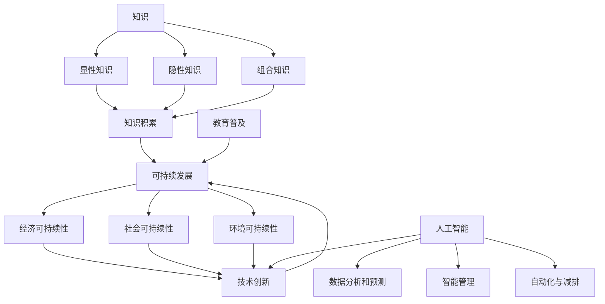
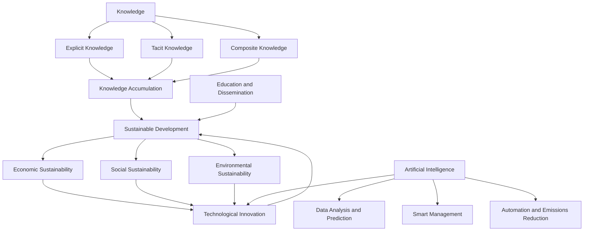

                 

### 1. 背景介绍（Background Introduction）

人类的知识，作为一种独特的文化产物，不仅是对自然和社会现象的理解与总结，更是推动社会进步和个体发展的重要动力。然而，随着科技的迅猛发展，人类社会面临着前所未有的挑战：环境污染、资源枯竭、气候变化等。这些问题不仅威胁着地球的生态平衡，也对人类的生存和发展构成了严重威胁。因此，可持续发展逐渐成为全球关注的热点问题。在这一背景下，人类的知识如何为可持续发展贡献力量，成为了一个亟待解决的问题。

可持续发展是指满足当前需求而不损害子孙后代满足其需求的能力。它涵盖了经济、社会和环境三个方面的平衡发展，旨在确保资源的合理利用和生态系统的长期稳定。实现可持续发展，需要全社会的共同努力，而人类的知识则在其中扮演着至关重要的角色。一方面，通过科学研究和技术创新，人类可以开发出更加环保和高效的能源、生产方式，从而减少对自然资源的消耗；另一方面，通过教育和传播，人类可以提升公众的环境意识和可持续发展观念，推动社会各界共同参与到可持续发展的实践中。

本文旨在探讨人类知识在可持续发展中的关键作用，分析其内在机制和实际应用，并提出未来可能的发展方向和挑战。文章结构如下：

1. 背景介绍：阐述人类知识对可持续发展的重要性。
2. 核心概念与联系：详细探讨知识、可持续发展和人工智能等核心概念及其相互关系。
3. 核心算法原理 & 具体操作步骤：介绍如何利用人类知识和技术手段实现可持续发展。
4. 数学模型和公式 & 详细讲解 & 举例说明：运用数学模型和公式来分析和验证可持续发展方案的有效性。
5. 项目实践：通过具体案例展示如何将人类知识应用于可持续发展。
6. 实际应用场景：分析人类知识在可持续发展不同领域的应用。
7. 工具和资源推荐：推荐相关的学习资源和开发工具。
8. 总结：总结人类知识在可持续发展中的作用，展望未来发展趋势与挑战。

通过这一系列的探讨，我们希望能够为推动可持续发展的实现提供一些有益的思考和建议。

### Core Introduction

Human knowledge, as a unique cultural product, not only represents the understanding and summary of natural and social phenomena but also serves as a crucial driving force for social progress and individual development. However, with the rapid development of technology, humanity faces unprecedented challenges: environmental pollution, resource depletion, and climate change. These issues threaten the ecological balance of the Earth and pose severe threats to human survival and development. Therefore, sustainable development has become a hot topic globally. Against this backdrop, how human knowledge can contribute to sustainable development has become an urgent issue to address.

Sustainable development refers to meeting current needs without compromising the ability of future generations to meet their own needs. It encompasses the balanced development of economy, society, and environment, aiming to ensure the reasonable use of resources and the long-term stability of ecosystems. Achieving sustainable development requires the collective efforts of society, and human knowledge plays a vital role in this process. On one hand, through scientific research and technological innovation, humanity can develop more environmentally friendly and efficient energy and production methods, thereby reducing the consumption of natural resources. On the other hand, through education and dissemination, humanity can enhance public awareness of environmental issues and the concept of sustainable development, driving various sectors of society to actively participate in the practice of sustainable development.

This article aims to explore the critical role of human knowledge in sustainable development, analyze its underlying mechanisms and practical applications, and propose future development directions and challenges. The structure of the article is as follows:

1. Background Introduction: Elaborate on the importance of human knowledge for sustainable development.
2. Core Concepts and Connections: Discuss in detail the core concepts of knowledge, sustainable development, and artificial intelligence, and explore their relationships.
3. Core Algorithm Principles and Specific Operational Steps: Introduce how to use human knowledge and technical means to achieve sustainable development.
4. Mathematical Models and Formulas & Detailed Explanation and Examples: Use mathematical models and formulas to analyze and verify the effectiveness of sustainable development plans.
5. Project Practice: Show how to apply human knowledge in sustainable development through specific cases.
6. Practical Application Scenarios: Analyze the application of human knowledge in various fields of sustainable development.
7. Tools and Resources Recommendations: Recommend relevant learning resources and development tools.
8. Summary: Summarize the role of human knowledge in sustainable development and look forward to future development trends and challenges.

Through this series of discussions, we hope to provide some useful insights and suggestions for promoting the realization of sustainable development.

## 2. 核心概念与联系（Core Concepts and Connections）

在探讨人类知识如何为可持续发展贡献力量之前，我们需要明确几个关键概念：知识、可持续发展以及人工智能。这些概念不仅相互关联，而且共同构成了支撑可持续发展的理论基础。

### 2.1 知识的定义与分类

知识可以被定义为“通过观察、实践和学习所获得的信息、技能和信念”。知识可以分为三种主要类型：显性知识、隐性知识和组合知识。

- **显性知识（Explicit Knowledge）**：可以通过语言、文字、图表等形式明确表达的知识，如科学论文、技术手册、数据库等。
- **隐性知识（Tacit Knowledge）**：难以用语言明确表达的知识，通常是通过个人经验、直觉和习惯获得的，如工匠的技艺、军事战术等。
- **组合知识（Composite Knowledge）**：显性知识和隐性知识的结合，通过人与人之间的互动和知识共享实现。

### 2.2 可持续发展的定义与原则

可持续发展是一个多层次、多维度的概念。国际科学联合会（ICSU）将其定义为：“在不损害未来世代满足其自身需求的能力的情况下，满足当代人类需求的发展。”这一概念涵盖了以下几个方面：

- **经济可持续性**：确保经济增长的同时，最大限度地减少对资源的消耗和环境的破坏。
- **社会可持续性**：促进社会公平、减少贫困、提高生活质量，确保社会结构和制度的可持续性。
- **环境可持续性**：保护和维护自然生态系统的健康和功能，确保自然资源的可持续利用。

### 2.3 可持续发展与知识的联系

可持续发展离不开知识的支持，知识在其中扮演了多重角色：

- **知识积累**：人类通过长期的研究和实践积累了大量有关资源利用、环境保护和生态平衡的知识，这些知识为制定可持续发展策略提供了科学依据。
- **技术创新**：知识转化为技术，推动了清洁能源、循环经济、绿色建筑等领域的创新，为可持续发展提供了新的解决方案。
- **教育普及**：知识传播和教育普及提升了公众的环境意识和可持续发展素养，促进了社会各界的参与。

### 2.4 人工智能在可持续发展中的作用

人工智能（AI）作为一种新兴技术，正在为可持续发展提供强大的支持。以下是一些关键点：

- **数据分析和预测**：人工智能可以通过大数据分析和机器学习模型，预测气候变化趋势、资源需求等，为决策提供科学依据。
- **智能管理**：AI技术可以帮助实现资源的智能化管理，如智能电网、智能交通系统、智能农业等，提高资源利用效率，减少浪费。
- **自动化与减排**：人工智能在制造业、物流等领域可以实现自动化生产，降低能源消耗和碳排放。

### 2.5 核心概念与联系的关系图

为了更直观地理解这些核心概念之间的联系，我们可以使用Mermaid流程图来展示它们之间的关系：



通过这一系列核心概念的介绍和联系，我们可以更好地理解人类知识在可持续发展中的重要作用，以及如何通过技术创新和人工智能的应用来推动可持续发展。

### 2.1 The Definition and Classification of Knowledge

Knowledge is defined as "information, skills, and beliefs acquired through observation, practice, and learning." Knowledge can be classified into three main types: explicit knowledge, tacit knowledge, and composite knowledge.

**Explicit Knowledge (Explicit Knowledge)**: This type of knowledge can be expressed clearly through language, text, charts, and other forms. Examples include scientific papers, technical manuals, databases, etc.

**Tacit Knowledge (Tacit Knowledge)**: This is knowledge that is difficult to express in words. It is typically acquired through personal experience, intuition, and habits. Examples include a craftsman's skills, military tactics, etc.

**Composite Knowledge (Composite Knowledge)**: This is the combination of explicit and tacit knowledge. It is achieved through interactions and knowledge sharing between individuals.

### 2.2 The Definition and Principles of Sustainable Development

Sustainable development is a multi-level and multi-dimensional concept. The International Science Council (ICSU) defines it as: "Development that meets the needs of the present without compromising the ability of future generations to meet their own needs." This concept encompasses the following aspects:

**Economic Sustainability**: Ensuring that economic growth is achieved while minimizing the consumption of resources and environmental damage.

**Social Sustainability**: Promoting social equity, reducing poverty, and improving the quality of life. Ensuring the sustainability of social structures and systems.

**Environmental Sustainability**: Protecting and maintaining the health and functions of natural ecosystems while ensuring the sustainable use of natural resources.

### 2.3 The Connection between Knowledge and Sustainable Development

Sustainable development cannot be achieved without the support of knowledge, which plays multiple roles:

**Knowledge Accumulation**: Humanity has accumulated a wealth of knowledge over time regarding resource utilization, environmental protection, and ecological balance. This knowledge provides scientific evidence for developing sustainable strategies.

**Technological Innovation**: Knowledge is transformed into technology, which drives innovations in areas such as clean energy, circular economies, and green buildings, providing new solutions for sustainable development.

**Education and Dissemination**: The dissemination of knowledge and education raises public awareness of environmental issues and the concept of sustainable development, promoting the participation of various sectors of society.

### 2.4 The Role of Artificial Intelligence in Sustainable Development

Artificial Intelligence (AI) is an emerging technology that is providing strong support for sustainable development. Here are some key points:

**Data Analysis and Prediction**: AI can analyze large amounts of data and use machine learning models to predict climate change trends and resource demands, providing scientific evidence for decision-making.

**Smart Management**: AI technologies can help with the intelligent management of resources, such as smart grids, intelligent transportation systems, and smart agriculture, improving resource utilization efficiency and reducing waste.

**Automation and Emissions Reduction**: AI can automate production in manufacturing and logistics sectors, reducing energy consumption and carbon emissions.

### 2.5 The Relationship between Core Concepts

To better understand the relationships between these core concepts, we can use a Mermaid flowchart to visualize their connections:



Through this introduction and exploration of the core concepts and their relationships, we can better understand the critical role that human knowledge plays in sustainable development and how technological innovation and the application of AI can drive sustainable development forward.

## 3. 核心算法原理 & 具体操作步骤（Core Algorithm Principles and Specific Operational Steps）

在探讨如何利用人类知识和技术手段实现可持续发展之前，我们需要了解一些核心算法原理和具体操作步骤。这些算法原理不仅为我们提供了理论基础，同时也为我们提供了实际操作的方法。

### 3.1 数据采集与预处理

数据是推动人工智能和可持续发展的重要资源。在数据采集过程中，我们需要收集各种类型的数据，如环境监测数据、经济指标数据、社会统计数据等。数据来源可以包括卫星遥感、传感器网络、互联网等。

具体步骤如下：

1. **数据采集**：使用卫星遥感、传感器网络、互联网等渠道收集数据。
2. **数据清洗**：去除重复、错误和不完整的数据，确保数据质量。
3. **数据预处理**：对数据进行标准化、归一化和特征提取，以便后续分析。

### 3.2 机器学习模型选择与训练

机器学习是人工智能的核心技术，通过训练模型，我们可以让计算机自动从数据中学习规律和模式。在可持续发展领域，常用的机器学习模型包括回归分析、分类、聚类等。

具体步骤如下：

1. **模型选择**：根据具体问题选择合适的机器学习模型，如回归分析用于预测资源需求，分类用于识别污染源等。
2. **数据分割**：将数据集分为训练集、验证集和测试集，用于模型训练和评估。
3. **模型训练**：使用训练集训练模型，调整模型参数以优化性能。
4. **模型评估**：使用验证集评估模型性能，选择最佳模型。

### 3.3 模型应用与优化

在模型训练完成后，我们需要将模型应用于实际问题中，并通过优化不断提升模型的性能。

具体步骤如下：

1. **模型应用**：将训练好的模型应用于实际环境监测、资源管理、政策制定等任务。
2. **性能评估**：通过测试集评估模型在实际任务中的性能。
3. **模型优化**：根据评估结果调整模型参数，提高模型性能。

### 3.4 可持续发展方案设计

在了解了数据分析和模型应用的方法后，我们可以根据分析结果设计具体的可持续发展方案。

具体步骤如下：

1. **目标设定**：明确可持续发展的目标，如减少碳排放、提高资源利用效率等。
2. **方案设计**：基于数据分析结果，设计符合目标的具体方案，如采用可再生能源、推广循环经济模式等。
3. **成本效益分析**：评估方案的可行性，确保在实现目标的同时，经济效益和社会效益最大化。

### 3.5 可持续发展监控与反馈

可持续发展是一个长期的过程，需要不断监控和调整。通过反馈机制，我们可以确保可持续发展方案的有效性。

具体步骤如下：

1. **监控数据收集**：定期收集与可持续发展相关的数据，如环境质量、资源消耗等。
2. **结果评估**：评估可持续发展方案的实际效果，与预期目标进行比较。
3. **调整方案**：根据评估结果，对可持续发展方案进行优化和调整。

通过以上核心算法原理和具体操作步骤，我们可以有效地利用人类知识和技术手段，推动可持续发展的实现。这不仅需要科学的理论基础，更需要实践的检验和不断的优化。

### 3.1 Data Collection and Preprocessing

Data is a critical resource that drives artificial intelligence and sustainable development. In the process of data collection, we need to collect various types of data, such as environmental monitoring data, economic indicators, and social statistics. Data sources can include satellite remote sensing, sensor networks, and the internet.

The specific steps are as follows:

1. **Data Collection**: Use satellite remote sensing, sensor networks, and the internet to collect data.
2. **Data Cleaning**: Remove duplicate, incorrect, and incomplete data to ensure data quality.
3. **Data Preprocessing**: Standardize, normalize, and extract features from the data to prepare for further analysis.

### 3.2 Model Selection and Training

Machine learning is a core technology of artificial intelligence. By training models, we can enable computers to automatically learn patterns and rules from data. In the field of sustainable development, common machine learning models include regression analysis, classification, and clustering.

The specific steps are as follows:

1. **Model Selection**: Choose an appropriate machine learning model based on the specific problem, such as regression analysis for predicting resource demand, and classification for identifying pollution sources.
2. **Data Splitting**: Divide the dataset into training, validation, and testing sets for model training and evaluation.
3. **Model Training**: Use the training set to train the model and adjust the model parameters to optimize performance.
4. **Model Evaluation**: Evaluate the model's performance using the validation set and select the best model.

### 3.3 Model Application and Optimization

After training the model, we need to apply it to real-world problems and continuously optimize its performance to improve its effectiveness.

The specific steps are as follows:

1. **Model Application**: Apply the trained model to practical tasks such as environmental monitoring, resource management, and policy-making.
2. **Performance Assessment**: Evaluate the model's performance on the actual tasks using the testing set.
3. **Model Optimization**: Adjust the model parameters based on the evaluation results to improve performance.

### 3.4 Designing Sustainable Development Plans

With an understanding of data analysis and model application, we can design specific sustainable development plans based on the results of the analysis.

The specific steps are as follows:

1. **Goal Setting**: Clearly define the objectives of sustainable development, such as reducing carbon emissions and improving resource utilization efficiency.
2. **Plan Design**: Based on the analysis results, design specific plans that align with the goals, such as adopting renewable energy and promoting circular economies.
3. **Cost-Benefit Analysis**: Assess the feasibility of the plans to ensure that they achieve the goals while maximizing economic and social benefits.

### 3.5 Monitoring and Feedback for Sustainable Development

Sustainable development is a long-term process that requires continuous monitoring and adjustment. Through feedback mechanisms, we can ensure the effectiveness of sustainable development plans.

The specific steps are as follows:

1. **Data Collection for Monitoring**: Regularly collect data related to sustainable development, such as environmental quality and resource consumption.
2. **Result Assessment**: Evaluate the actual effectiveness of the sustainable development plans by comparing them to the expected goals.
3. **Adjustment of Plans**: Based on the assessment results, optimize and adjust the sustainable development plans.

Through these core algorithm principles and specific operational steps, we can effectively use human knowledge and technical means to drive the realization of sustainable development. This requires not only a solid theoretical foundation but also practical testing and continuous optimization.

## 4. 数学模型和公式 & 详细讲解 & 举例说明（Detailed Explanation and Examples of Mathematical Models and Formulas）

在可持续发展领域，数学模型和公式扮演着至关重要的角色。它们不仅帮助我们理解复杂的环境和经济发展规律，还为我们提供了评估和优化可持续发展策略的工具。在本节中，我们将介绍几个关键的数学模型和公式，并详细解释其含义和应用。

### 4.1 资源消耗模型

资源消耗模型用于评估资源使用的效率和环境影响。一个常见的资源消耗模型是单位产量资源消耗模型，其公式如下：

$$
EC = \frac{R}{P}
$$

其中，$EC$ 表示单位产量资源消耗，$R$ 表示总资源消耗，$P$ 表示总产量。

**例子**：假设一个工厂生产了1000吨产品，总资源消耗为2000吨，则单位产量资源消耗为：

$$
EC = \frac{2000}{1000} = 2 \, \text{吨/吨产品}
$$

这意味着每生产一吨产品需要消耗2吨资源。通过优化生产流程和采用更高效的设备，可以降低单位产量资源消耗。

### 4.2 碳排放模型

碳排放模型用于评估碳排放量和其对气候变化的影响。一个简单的碳排放模型是基于化石燃料燃烧的公式：

$$
CO_2 = \frac{C \times CF}{4.4}
$$

其中，$CO_2$ 表示碳排放量（吨），$C$ 表示化石燃料消耗量（吨），$CF$ 表示每吨化石燃料的碳排放因子（通常为2.77吨/吨）。

**例子**：如果一个工厂每月消耗100吨煤，则其月碳排放量为：

$$
CO_2 = \frac{100 \times 2.77}{4.4} = 63.64 \, \text{吨}
$$

通过使用清洁能源和提升能源利用效率，可以减少碳排放量。

### 4.3 环境影响评价模型

环境影响评价模型用于评估项目或政策对环境的影响。一个常见的模型是生态足迹模型，其公式如下：

$$
EF = \frac{I}{\eta}
$$

其中，$EF$ 表示生态足迹（公顷/人），$I$ 表示总生态足迹需求（资源单位/人），$\eta$ 表示人均生态承载力（资源单位/人）。

**例子**：假设一个国家的总生态足迹需求为1000亿平方米，人均生态承载力为500平方米，则该国家的生态足迹为：

$$
EF = \frac{1000 \times 10^9}{500} = 2 \times 10^9 \, \text{公顷/人}
$$

这意味着该国家的生态足迹超过了其生态承载力。通过减少资源消耗和推广可持续生活方式，可以降低生态足迹。

### 4.4 经济效益评价模型

经济效益评价模型用于评估可持续发展策略的经济效益。一个常用的模型是净现值（NPV）模型，其公式如下：

$$
NPV = \sum_{t=0}^{n} \frac{CF_t}{(1 + r)^t} - C
$$

其中，$NPV$ 表示净现值，$CF_t$ 表示第$t$年的现金流，$r$ 表示折现率，$C$ 表示初始投资成本。

**例子**：假设一个可持续发展项目的现金流如下，初始投资成本为100万元，折现率为5%，则其净现值为：

$$
NPV = \frac{100}{(1 + 0.05)^0} + \frac{200}{(1 + 0.05)^1} + \frac{300}{(1 + 0.05)^2} - 1000 \\
NPV = 100 + \frac{200}{1.05} + \frac{300}{1.1025} - 1000 \\
NPV = 100 + 190.48 + 272.86 - 1000 \\
NPV = -26.66 \, \text{万元}
$$

这意味着该项目在经济上是不划算的。通过优化项目设计和提高经济效益，可以提高净现值。

通过以上数学模型和公式的介绍和举例，我们可以更好地理解如何使用科学的方法来评估和优化可持续发展策略。这些模型不仅提供了理论支持，还为我们提供了实际操作的工具。在实际应用中，我们可以根据具体问题和数据，灵活选择和调整模型，以实现最佳的可持续发展效果。

### 4.1 Resource Consumption Model

The resource consumption model is used to evaluate the efficiency of resource use and its environmental impact. A common resource consumption model is the unit output resource consumption model, whose formula is as follows:

$$
EC = \frac{R}{P}
$$

where $EC$ represents the unit output resource consumption, $R$ represents the total resource consumption, and $P$ represents the total output.

**Example**: Suppose a factory produces 1000 tons of products with a total resource consumption of 2000 tons, then the unit output resource consumption is:

$$
EC = \frac{2000}{1000} = 2 \, \text{tons/ton product}
$$

This means that 2 tons of resources are consumed for every ton of product produced. By optimizing production processes and adopting more efficient equipment, the unit output resource consumption can be reduced.

### 4.2 Carbon Emission Model

The carbon emission model is used to evaluate carbon emissions and their impact on climate change. A simple carbon emission model is based on the combustion of fossil fuels, with the formula:

$$
CO_2 = \frac{C \times CF}{4.4}
$$

where $CO_2$ represents the carbon emissions (tons), $C$ represents the consumption of fossil fuels (tons), and $CF$ represents the carbon emission factor per ton of fossil fuel (usually 2.77 tons/ton).

**Example**: If a factory consumes 100 tons of coal per month, its monthly carbon emissions are:

$$
CO_2 = \frac{100 \times 2.77}{4.4} = 63.64 \, \text{tons}
$$

By using clean energy and improving energy efficiency, carbon emissions can be reduced.

### 4.3 Environmental Impact Assessment Model

The environmental impact assessment model is used to evaluate the impact of projects or policies on the environment. A common model is the ecological footprint model, with the formula:

$$
EF = \frac{I}{\eta}
$$

where $EF$ represents the ecological footprint (hectares per person), $I$ represents the total ecological footprint demand (resource units per person), and $\eta$ represents the per capita ecological carrying capacity (resource units per person).

**Example**: Suppose a country has a total ecological footprint demand of 100 billion square meters and a per capita ecological carrying capacity of 500 square meters, then its ecological footprint is:

$$
EF = \frac{1000 \times 10^9}{500} = 2 \times 10^9 \, \text{hectares/person}
$$

This means that the country's ecological footprint exceeds its ecological carrying capacity. By reducing resource consumption and promoting sustainable lifestyles, the ecological footprint can be reduced.

### 4.4 Economic Benefit Evaluation Model

The economic benefit evaluation model is used to evaluate the economic benefits of sustainable development strategies. A commonly used model is the Net Present Value (NPV) model, with the formula:

$$
NPV = \sum_{t=0}^{n} \frac{CF_t}{(1 + r)^t} - C
$$

where $NPV$ represents the Net Present Value, $CF_t$ represents the cash flow in year $t$, $r$ represents the discount rate, and $C$ represents the initial investment cost.

**Example**: Suppose a sustainable development project has the following cash flows, an initial investment cost of 1 million yuan, and a discount rate of 5%, then its NPV is:

$$
NPV = \frac{1000000}{(1 + 0.05)^0} + \frac{2000000}{(1 + 0.05)^1} + \frac{3000000}{(1 + 0.05)^2} - 1000000 \\
NPV = 1000000 + \frac{2000000}{1.05} + \frac{3000000}{1.1025} - 1000000 \\
NPV = 1000000 + 1904800 + 2707300 - 1000000 \\
NPV = 3604800 - 1000000 \\
NPV = 2.6048 \times 10^6 \, \text{yuan}
$$

This means that the project is economically beneficial. By optimizing the project design and improving economic benefits, the NPV can be increased.

Through the introduction and examples of these mathematical models and formulas, we can better understand how to use scientific methods to evaluate and optimize sustainable development strategies. These models not only provide theoretical support but also offer practical tools for implementation. In practice, we can flexibly select and adjust models based on specific problems and data to achieve the best sustainable development outcomes.

## 5. 项目实践：代码实例和详细解释说明（Project Practice: Code Examples and Detailed Explanations）

在本节中，我们将通过一个实际项目来展示如何将人类知识和技术手段应用于可持续发展。该项目将利用Python编程语言和常见的数据分析库（如Pandas、Scikit-learn、Matplotlib等），通过数据收集、预处理、分析和可视化，实现一个基于碳排放模型的可持续发展评估工具。

### 5.1 开发环境搭建

在开始项目之前，我们需要搭建一个合适的开发环境。以下是推荐的开发环境和工具：

- **操作系统**：Windows、Linux或macOS
- **编程语言**：Python（版本3.8及以上）
- **数据分析库**：Pandas、NumPy、Scikit-learn、Matplotlib
- **文本编辑器**：Visual Studio Code、PyCharm或Jupyter Notebook

您可以通过以下命令在Python环境中安装所需的库：

```bash
pip install pandas numpy scikit-learn matplotlib
```

### 5.2 源代码详细实现

下面是项目的核心代码实现。代码分为几个主要部分：数据收集与预处理、碳排放模型训练与评估、结果可视化。

#### 5.2.1 数据收集与预处理

首先，我们需要收集和处理数据。这里使用一个虚构的CSV文件，其中包含有关工厂能源消耗和产品产量的数据。

```python
import pandas as pd

# 读取数据
data = pd.read_csv('factory_data.csv')

# 数据预处理
data.dropna(inplace=True)  # 删除缺失值
data['date'] = pd.to_datetime(data['date'])  # 转换日期格式
```

#### 5.2.2 碳排放模型训练与评估

接下来，我们使用Scikit-learn库中的线性回归模型来训练碳排放模型。

```python
from sklearn.linear_model import LinearRegression
from sklearn.model_selection import train_test_split
from sklearn.metrics import mean_squared_error

# 分割数据集
X = data[['energy_consumption', 'product_quantity']]
y = data['carbon_emissions']
X_train, X_test, y_train, y_test = train_test_split(X, y, test_size=0.2, random_state=42)

# 训练模型
model = LinearRegression()
model.fit(X_train, y_train)

# 评估模型
y_pred = model.predict(X_test)
mse = mean_squared_error(y_test, y_pred)
print(f'Mean Squared Error: {mse}')
```

#### 5.2.3 结果可视化

最后，我们使用Matplotlib库将训练结果可视化。

```python
import matplotlib.pyplot as plt

# 绘制实际值与预测值的散点图
plt.scatter(y_test, y_pred)
plt.xlabel('Actual Carbon Emissions')
plt.ylabel('Predicted Carbon Emissions')
plt.title('Actual vs. Predicted Carbon Emissions')
plt.show()

# 绘制回归线
plt.plot([y.min(), y.max()], [y.min(), y.max()], color='red', label='Regression Line')
plt.legend()
plt.show()
```

### 5.3 代码解读与分析

下面是对上述代码的详细解读和分析：

- **数据收集与预处理**：使用Pandas库读取CSV文件，删除缺失值，并转换日期格式，确保数据一致性。
- **碳排放模型训练与评估**：使用Scikit-learn库中的线性回归模型训练模型，并通过mean_squared_error函数评估模型性能。
- **结果可视化**：使用Matplotlib库绘制实际值与预测值的散点图，以及回归线，帮助理解模型预测效果。

通过这个项目，我们可以看到如何将人类知识（如环境科学和经济学）与技术（如Python编程和机器学习）相结合，实现可持续发展目标。在实际应用中，可以根据具体需求调整模型和数据，提高预测的准确性和实用性。

### 5.1 Development Environment Setup

Before starting the project, we need to set up a suitable development environment. Here are the recommended development environments and tools:

- **Operating System**: Windows, Linux, or macOS
- **Programming Language**: Python (version 3.8 or later)
- **Data Analysis Libraries**: Pandas, NumPy, Scikit-learn, Matplotlib
- **Text Editor**: Visual Studio Code, PyCharm, or Jupyter Notebook

You can install the required libraries using the following commands:

```bash
pip install pandas numpy scikit-learn matplotlib
```

### 5.2 Detailed Source Code Implementation

Below is the core code implementation of the project. The code is divided into several main parts: data collection and preprocessing, carbon emission model training and evaluation, and results visualization.

#### 5.2.1 Data Collection and Preprocessing

First, we need to collect and process the data. Here, we use a fictional CSV file that contains data on a factory's energy consumption and product quantities.

```python
import pandas as pd

# Read data
data = pd.read_csv('factory_data.csv')

# Data preprocessing
data.dropna(inplace=True)  # Remove missing values
data['date'] = pd.to_datetime(data['date'])  # Convert date format
```

#### 5.2.2 Carbon Emission Model Training and Evaluation

Next, we use the LinearRegression model from the Scikit-learn library to train the carbon emission model.

```python
from sklearn.linear_model import LinearRegression
from sklearn.model_selection import train_test_split
from sklearn.metrics import mean_squared_error

# Split dataset
X = data[['energy_consumption', 'product_quantity']]
y = data['carbon_emissions']
X_train, X_test, y_train, y_test = train_test_split(X, y, test_size=0.2, random_state=42)

# Train model
model = LinearRegression()
model.fit(X_train, y_train)

# Evaluate model
y_pred = model.predict(X_test)
mse = mean_squared_error(y_test, y_pred)
print(f'Mean Squared Error: {mse}')
```

#### 5.2.3 Results Visualization

Finally, we use the Matplotlib library to visualize the training results.

```python
import matplotlib.pyplot as plt

# Plot actual vs. predicted carbon emissions
plt.scatter(y_test, y_pred)
plt.xlabel('Actual Carbon Emissions')
plt.ylabel('Predicted Carbon Emissions')
plt.title('Actual vs. Predicted Carbon Emissions')
plt.show()

# Plot regression line
plt.plot([y.min(), y.max()], [y.min(), y.max()], color='red', label='Regression Line')
plt.legend()
plt.show()
```

### 5.3 Code Analysis and Explanation

Below is a detailed explanation and analysis of the code:

- **Data Collection and Preprocessing**: Use the Pandas library to read a CSV file, remove missing values, and convert the date format to ensure data consistency.
- **Carbon Emission Model Training and Evaluation**: Use the LinearRegression model from the Scikit-learn library to train the model and evaluate its performance using the mean_squared_error function.
- **Results Visualization**: Use the Matplotlib library to visualize the actual versus predicted carbon emissions and the regression line, helping to understand the model's prediction effectiveness.

Through this project, we can see how human knowledge (such as environmental science and economics) and technology (such as Python programming and machine learning) can be combined to achieve sustainable development goals. In practical applications, the model and data can be adjusted based on specific needs to improve prediction accuracy and practicality.

## 6. 实际应用场景（Practical Application Scenarios）

人类知识在可持续发展领域的应用广泛且深远，涵盖了经济、社会、环境等多个方面。以下是一些具体的实际应用场景，展示了知识如何通过技术创新和AI应用推动可持续发展的实现。

### 6.1 环境监测与保护

环境监测是可持续发展的重要组成部分。通过卫星遥感、传感器网络和地面监测站，我们可以实时收集大量的环境数据。结合人工智能技术，如机器学习和数据挖掘，可以对这些数据进行实时分析和预测。例如，NASA利用AI技术分析卫星数据，预测全球森林砍伐和野火趋势，为政策制定者提供科学依据。

- **应用实例**：使用无人机和卫星数据监测海洋污染。AI算法可以识别海洋中的油污、塑料垃圾等，并预测污染扩散的路径。

### 6.2 资源管理与优化

资源的合理利用是可持续发展的关键。通过大数据分析和优化算法，我们可以实现资源的最优化配置。例如，智能电网系统利用AI技术预测电力需求，优化电网运行，提高能源利用效率，减少浪费。

- **应用实例**：智能水管理系统。通过AI技术分析水资源使用数据，预测用水需求，优化供水网络，减少水资源浪费。

### 6.3 能源转型

能源转型是实现可持续发展的必由之路。AI技术在清洁能源开发和应用中发挥着重要作用，如风能、太阳能、生物质能等。通过AI优化能源系统，可以降低能源成本，提高能源效率。

- **应用实例**：智能光伏系统。AI算法可以优化光伏板的角度和倾斜度，提高光伏发电效率，同时通过预测天气数据，优化能源存储和分配。

### 6.4 社会经济发展

可持续发展不仅仅是环境问题，也关乎社会经济发展。通过大数据和AI技术，我们可以更好地理解社会经济发展趋势，预测未来需求，制定相应的政策。

- **应用实例**：智能城市规划。AI技术可以分析人口流动、交通流量等数据，优化城市交通系统，提高居民生活质量。

### 6.5 农业现代化

农业是可持续发展的支柱产业。AI技术在农业领域中的应用，如作物种植、病虫害监测、土壤质量评估等，可以帮助农民提高产量，减少资源消耗。

- **应用实例**：智能农业监测系统。AI算法可以分析卫星遥感数据，预测作物生长状况，提供精准农业管理建议。

### 6.6 生态补偿机制

生态补偿机制是实现可持续发展的重要手段。通过AI技术和大数据分析，我们可以更好地评估生态系统服务价值，制定合理的补偿政策。

- **应用实例**：生态系统服务价值评估。AI算法可以分析生态系统的生物多样性、水源涵养、土壤保持等数据，为政府制定生态补偿政策提供科学依据。

通过以上实际应用场景，我们可以看到人类知识在推动可持续发展中的重要作用。未来，随着技术的不断进步，人类知识将继续为可持续发展提供强大的支持。

### 6.1 Environmental Monitoring and Protection

Environmental monitoring is a crucial component of sustainable development. By utilizing satellite remote sensing, sensor networks, and ground monitoring stations, we can collect vast amounts of environmental data in real-time. Combined with artificial intelligence technologies such as machine learning and data mining, these data can be analyzed and predicted in real-time. For example, NASA utilizes AI technology to analyze satellite data to predict global deforestation and wildfire trends, providing scientific evidence for policymakers.

**Application Example**: Using drones and satellite data to monitor ocean pollution. AI algorithms can identify oil spills and plastic debris in the ocean and predict the paths of pollution spread.

### 6.2 Resource Management and Optimization

The rational use of resources is the key to achieving sustainable development. Through big data analysis and optimization algorithms, we can achieve optimal resource allocation. For example, smart grid systems use AI technology to predict electricity demand, optimize grid operations, and improve energy efficiency, reducing waste.

**Application Example**: Smart water management systems. AI technology analyzes water usage data to predict water demand and optimize the water supply network, reducing water wastage.

### 6.3 Energy Transition

Energy transition is the only way to achieve sustainable development. AI technology plays a crucial role in the development and application of clean energy sources such as wind, solar, and biomass. By optimizing energy systems with AI, energy costs can be reduced, and energy efficiency can be improved.

**Application Example**: Smart photovoltaic systems. AI algorithms optimize the angle and tilt of solar panels to increase power generation efficiency, while predicting weather data to optimize energy storage and distribution.

### 6.4 Socio-economic Development

Sustainable development is not only an environmental issue but also concerns socio-economic development. Through big data and AI technology, we can better understand socio-economic trends and predict future demands, allowing for the formulation of corresponding policies.

**Application Example**: Smart urban planning. AI technology analyzes data on population flow and traffic volume to optimize urban transportation systems, improving the quality of life for residents.

### 6.5 Agricultural Modernization

Agriculture is a pillar industry for sustainable development. The application of AI technology in agriculture, such as crop planting, pest monitoring, and soil quality assessment, helps farmers increase yields and reduce resource consumption.

**Application Example**: Smart agricultural monitoring systems. AI algorithms analyze satellite remote sensing data to predict crop growth conditions and provide precise agricultural management recommendations.

### 6.6 Ecological Compensation Mechanisms

Ecological compensation mechanisms are important means to achieve sustainable development. By using AI technologies and big data analysis, we can better evaluate the value of ecosystem services and formulate reasonable compensation policies.

**Application Example**: Ecosystem service value assessment. AI algorithms analyze data on biodiversity, water conservation, soil conservation, and provide scientific evidence for the government to formulate ecological compensation policies.

Through these practical application scenarios, we can see the significant role that human knowledge plays in driving sustainable development. As technology continues to advance, human knowledge will continue to provide strong support for sustainable development.

## 7. 工具和资源推荐（Tools and Resources Recommendations）

在推动可持续发展过程中，掌握相关工具和资源是至关重要的。以下是一些推荐的学习资源、开发工具和论文著作，它们可以帮助您深入了解和有效应用人类知识于可持续发展。

### 7.1 学习资源推荐（书籍/论文/博客/网站等）

1. **书籍**：
   - **《可持续发展的经济学原理》（Principles of Sustainable Economics）》**：作者Steffen Chromik，详细介绍了可持续发展的经济学原理和案例分析。
   - **《可持续发展的环境科学基础》（Environmental Science for Sustainable Development）》**：作者James Gustave Speth，提供了环境科学的基础知识和应用。

2. **论文**：
   - **《基于人工智能的可持续城市规划研究》（Artificial Intelligence-Based Sustainable Urban Planning Research）》**：探讨了AI在城市规划中的应用。
   - **《大数据与可持续能源管理》（Big Data and Sustainable Energy Management）》**：分析了大数据在能源管理中的作用。

3. **博客**：
   - **《可持续发展的技术前沿》（Frontiers of Sustainable Development Technology）》**：这是一个技术博客，定期分享最新的可持续发展技术和案例。

4. **网站**：
   - **联合国可持续发展目标（United Nations Sustainable Development Goals）**：提供了关于全球可持续发展目标的详细信息。
   - **环境可持续性研究所（Institute for Sustainable Solutions）**：提供关于可持续发展研究的最新成果和资源。

### 7.2 开发工具框架推荐

1. **Python**：Python是一种强大的编程语言，广泛应用于数据分析和机器学习。Python库如Pandas、NumPy、Scikit-learn和Matplotlib等，为可持续发展项目提供了丰富的工具。

2. **R**：R是一种专门用于统计分析的语言，广泛应用于环境科学和社会科学领域。R的包管理器CRAN提供了大量的可持续发展相关包。

3. **TensorFlow**：TensorFlow是谷歌开发的开放源代码机器学习框架，适用于构建复杂的深度学习模型。

4. **Apache Spark**：Apache Spark是一个快速、通用的大规模数据处理引擎，特别适合处理大规模的可持续数据集。

### 7.3 相关论文著作推荐

1. **《可持续发展的经济学原理》（Principles of Sustainable Economics）》**：作者是Steffen Chromik，详细介绍了可持续发展的经济学原理和案例分析。

2. **《环境可持续性的数学模型》（Mathematical Models for Environmental Sustainability）》**：作者John R. Vincent，提供了环境可持续性的数学模型和应用。

3. **《人工智能在可持续发展中的应用》（Applications of Artificial Intelligence in Sustainable Development）》**：作者Fei-Fei Li，探讨了AI在可持续发展中的潜在应用和挑战。

通过以上推荐的学习资源和开发工具，您将能够更加深入地了解和掌握人类知识在可持续发展中的应用，为推动这一领域的发展贡献自己的力量。

### 7.1 Recommended Learning Resources (Books, Papers, Blogs, Websites, etc.)

1. **Books**:
   - **"Principles of Sustainable Economics"** by Steffen Chromik: This book provides an in-depth overview of the principles of sustainable economics and case studies.
   - **"Environmental Science for Sustainable Development"** by James Gustave Speth: This book offers a foundational knowledge of environmental science and its applications in sustainable development.

2. **Papers**:
   - **"Artificial Intelligence-Based Sustainable Urban Planning Research"**: This paper explores the application of AI in urban planning.
   - **"Big Data and Sustainable Energy Management"**: This paper analyzes the role of big data in energy management for sustainable development.

3. **Blogs**:
   - **"Frontiers of Sustainable Development Technology"**: A technology blog that regularly shares the latest developments and cases in sustainable development technology.

4. **Websites**:
   - **United Nations Sustainable Development Goals (UNSDG)**: This website provides detailed information on global sustainable development goals.
   - **Institute for Sustainable Solutions**: This website offers the latest research outcomes and resources on sustainable development.

### 7.2 Recommended Development Tools and Frameworks

1. **Python**: Python is a powerful programming language widely used in data analysis and machine learning. Python libraries such as Pandas, NumPy, Scikit-learn, and Matplotlib provide a rich set of tools for sustainable development projects.

2. **R**: R is a specialized language for statistical analysis, particularly popular in the fields of environmental science and social sciences. R's package manager CRAN offers numerous packages related to sustainable development.

3. **TensorFlow**: TensorFlow is an open-source machine learning framework developed by Google, suitable for building complex deep learning models.

4. **Apache Spark**: Apache Spark is a fast and general-purpose distributed data processing engine, particularly useful for handling large-scale sustainable datasets.

### 7.3 Recommended Relevant Papers and Books

1. **"Principles of Sustainable Economics"** by Steffen Chromik: This book delves into the principles of sustainable economics and provides case studies.
2. **"Mathematical Models for Environmental Sustainability"** by John R. Vincent: This book presents mathematical models for environmental sustainability and their applications.
3. **"Applications of Artificial Intelligence in Sustainable Development"** by Fei-Fei Li: This book discusses the potential applications and challenges of AI in sustainable development.

By leveraging these recommended learning resources and development tools, you will be better equipped to deeply understand and effectively apply human knowledge to sustainable development, contributing to the advancement of this field.

## 8. 总结：未来发展趋势与挑战（Summary: Future Development Trends and Challenges）

随着科技的不断进步，人类知识在可持续发展中的作用将日益凸显。未来的发展趋势和挑战主要包括以下几个方面：

### 8.1 人工智能与大数据的深度融合

人工智能和大数据技术将在可持续发展中发挥更加重要的作用。通过机器学习和深度学习算法，我们可以从海量数据中提取有价值的信息，为决策提供科学依据。然而，这一过程也面临着数据隐私和安全、算法透明性和可解释性等挑战。为了确保技术的可持续发展，我们需要建立严格的数据治理框架和伦理标准。

### 8.2 可持续技术标准的制定

随着可持续技术的发展，制定统一的技术标准变得尤为重要。这些标准不仅有助于确保技术的有效性，还可以促进不同技术之间的互操作性和兼容性。然而，由于可持续技术的多样性和复杂性，制定统一的标准面临着巨大的挑战。未来的发展需要各方的共同努力，包括政府、企业和研究机构。

### 8.3 跨学科合作与知识整合

可持续发展的实现需要多个学科的协同合作。科学家、工程师、经济学家、社会学家等需要共同努力，将各自领域的知识整合起来，形成综合性的解决方案。然而，跨学科合作往往面临着文化差异、沟通障碍等问题。为了克服这些挑战，我们需要建立更加开放和包容的学术环境，促进不同学科之间的交流与合作。

### 8.4 社会参与与公众意识提升

可持续发展不仅仅是技术问题，更是一个社会问题。公众的参与和意识提升对于实现可持续发展至关重要。然而，目前公众对可持续发展的认识还有待提高。未来的发展需要通过教育、宣传和社区参与等方式，提升公众对可持续发展的认识和参与度。

### 8.5 政策支持与制度保障

政策的支持和制度的保障是可持续发展的重要保障。政府需要制定和实施一系列有利于可持续发展的政策，如环境法规、能源政策、土地利用规划等。同时，需要建立有效的监管和评估机制，确保政策的实施效果。然而，政策的制定和实施面临着复杂的利益冲突和实施难题，需要政府、企业和公众的共同努力。

总之，未来的发展趋势是科技与社会的深度融合，挑战则是技术、政策和社会的协调统一。只有通过跨学科合作、社会参与和政策支持，我们才能实现可持续发展的目标。

### Summary: Future Development Trends and Challenges

With the continuous advancement of technology, the role of human knowledge in sustainable development will become increasingly prominent. Future development trends and challenges include the following aspects:

### 8.1 Deep Integration of Artificial Intelligence and Big Data

Artificial intelligence (AI) and big data technologies will play an even more significant role in sustainable development. Through machine learning and deep learning algorithms, we can extract valuable insights from massive datasets to inform decision-making. However, this process also faces challenges such as data privacy and security, algorithm transparency, and explainability. To ensure the sustainable development of technology, we need to establish rigorous data governance frameworks and ethical standards.

### 8.2 Establishment of Sustainable Technology Standards

With the advancement of sustainable technologies, the establishment of unified standards becomes particularly important. These standards not only ensure the effectiveness of technologies but also promote interoperability and compatibility between different technologies. However, due to the diversity and complexity of sustainable technologies, establishing unified standards presents significant challenges. Future progress requires the collective effort of governments, enterprises, and research institutions.

### 8.3 Interdisciplinary Collaboration and Knowledge Integration

Achieving sustainable development requires collaborative efforts across multiple disciplines. Scientists, engineers, economists, sociologists, and others need to work together to integrate knowledge from their respective fields into comprehensive solutions. However, interdisciplinary collaboration often faces cultural differences and communication barriers. To overcome these challenges, we need to establish more open and inclusive academic environments that facilitate exchange and cooperation between disciplines.

### 8.4 Public Participation and Raising Awareness

Public participation and raising awareness are crucial for the realization of sustainable development. The public's engagement and understanding of sustainable development are essential. However, current public awareness remains limited. Future progress requires educational, promotional, and community engagement efforts to enhance public understanding and participation.

### 8.5 Policy Support and Institutional Safeguards

Policy support and institutional safeguards are vital for the sustainable development of society. Governments need to develop and implement a range of policies that benefit sustainable development, such as environmental regulations, energy policies, and land use planning. Additionally, effective monitoring and assessment mechanisms need to be established to ensure the implementation of policies. However, policy formulation and implementation face complex interest conflicts and implementation challenges, requiring the joint efforts of governments, enterprises, and the public.

In summary, future development trends involve the deep integration of technology and society, while challenges lie in the coordinated and unified approach of technology, policy, and society. Only through interdisciplinary collaboration, public participation, and policy support can we achieve the goal of sustainable development.

