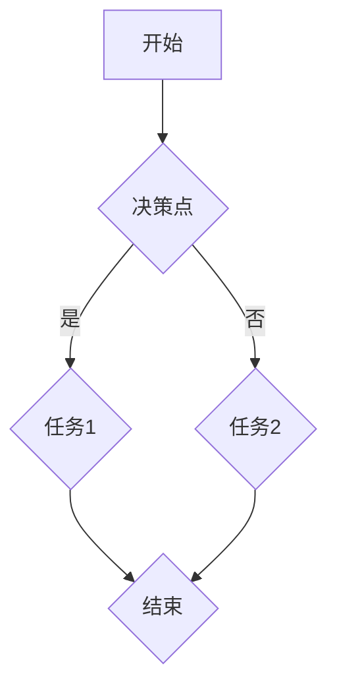
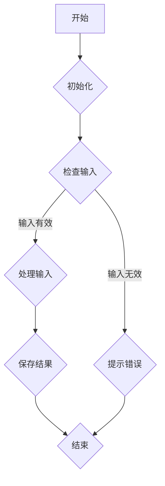
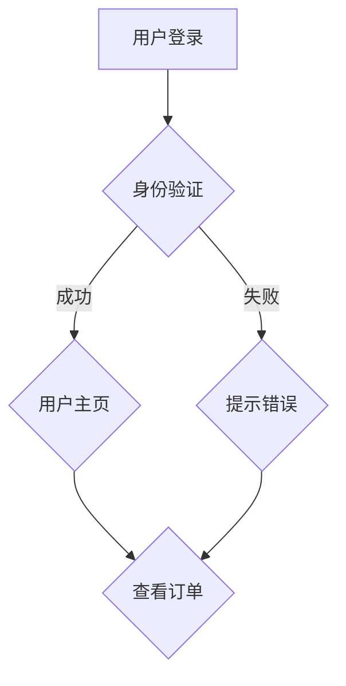
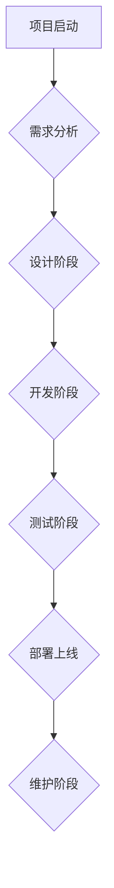
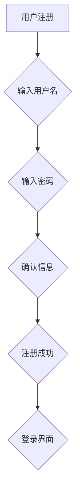
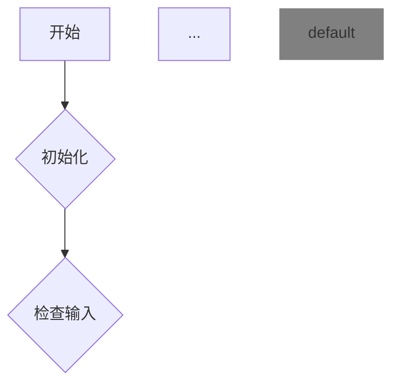

                 

# 使用Mermaid语法创建流程图表

## 摘要

本文将介绍如何使用Mermaid语法创建流程图表。我们将首先介绍Mermaid的基本概念和语法，然后通过实际例子逐步展示如何绘制各种流程图，最后讨论其在实际项目中的应用和优缺点。通过阅读本文，您将掌握使用Mermaid创建专业流程图的方法。

## 1. 背景介绍

在软件开发和项目管理中，流程图是一种常见的图表，用于展示任务、流程、数据流等之间的关系。它们可以帮助我们更好地理解和沟通复杂的工作流程。Mermaid是一个轻量级的文本标记语言，可以轻松地将文本转换为图形，其中包括流程图、甘特图、时序图等。使用Mermaid创建流程图具有以下优势：

- 简单易学：Mermaid的语法简洁明了，易于理解和使用。
- 可扩展性：可以自定义节点、线条和样式，以满足各种需求。
- 实时预览：在编辑过程中可以实时预览图形效果。
- 支持多种格式：可以生成PNG、SVG、HTML等多种格式的图形。

本文将带领您逐步了解Mermaid的基本概念和语法，并通过实际例子展示如何绘制各种流程图。

## 2. 核心概念与联系

### 2.1 什么是Mermaid？

Mermaid是一种基于Markdown的文本标记语言，用于生成图形。它的核心思想是将文本描述转换为图形，从而简化了图形绘制的复杂过程。Mermaid支持多种图形，包括流程图、时序图、甘特图等。

### 2.2 Mermaid的基本语法

Mermaid的基本语法由两部分组成：节点和线条。

- **节点**：表示流程中的各个元素，如任务、决策点等。节点可以使用文本、标签、边框等来描述。
- **线条**：表示节点之间的关系，如顺序、分支等。线条可以使用箭头、虚线、实线等来描述。

### 2.3 Mermaid与流程图的联系

流程图是一种常见的图形，用于展示任务、流程、数据流等之间的关系。Mermaid可以将流程图文本描述转换为图形，从而简化了流程图的绘制过程。

## 3. 核心算法原理 & 具体操作步骤

### 3.1 Mermaid基本语法

首先，让我们来看一下Mermaid的基本语法。以下是创建流程图的基本步骤：

1. **定义流程图**：使用`graph`关键字开始定义流程图。
2. **添加节点**：使用文本描述节点，并使用`-->`、`->>`、`->`等关键字连接节点。
3. **添加线条**：使用箭头表示节点之间的关系。
4. **添加边框和标签**：可以使用`{label}`和`{style}`来添加边框和标签。

### 3.2 创建简单的流程图

让我们通过一个简单的例子来展示如何使用Mermaid创建流程图。



这个例子展示了如何创建一个包含决策点和两个任务的简单流程图。

### 3.3 创建复杂的流程图

在实际项目中，我们可能会遇到更复杂的流程图。以下是一个包含多个节点的复杂流程图示例：



这个例子展示了如何创建一个包含多个节点和分支的复杂流程图。

## 4. 数学模型和公式 & 详细讲解 & 举例说明

虽然Mermaid主要用于创建流程图，但它也支持基本的数学公式。以下是一个包含数学公式的例子：

```mermaid
graph TD
    A[开始] --> B{计算面积}
    B --> C{$A = \frac{1}{2} \times base \times height$}
    C --> D{显示结果}
    D --> E{结束}
```

在这个例子中，我们使用LaTeX格式来编写数学公式。LaTeX是一种高质量的排版系统，用于处理复杂的数学公式。

```mermaid
graph TD
    A[开始] --> B{计算距离}
    B --> C{$d = \sqrt{(x2 - x1)^2 + (y2 - y1)^2}$}
    C --> D{显示结果}
    D --> E{结束}
```

这个例子展示了如何使用Mermaid计算两点之间的距离。

## 5. 项目实践：代码实例和详细解释说明

### 5.1 开发环境搭建

在开始之前，我们需要安装Mermaid。以下是安装步骤：

1. **安装Node.js**：访问[Node.js官网](https://nodejs.org/)并下载对应操作系统的安装包。按照提示完成安装。
2. **安装Mermaid**：在命令行中运行以下命令：

```bash
npm install -g mermaid-cli
```

安装完成后，我们可以在命令行中使用Mermaid命令来生成图形。

### 5.2 源代码详细实现

以下是一个简单的Mermaid流程图源代码示例：


这个流程图描述了一个简单的数据处理流程，包括初始化、检查输入、处理输入、保存结果和结束。

### 5.3 代码解读与分析

- **A[开始]**：表示流程的开始。
- **B{初始化]**：表示流程的初始化步骤。
- **C{检查输入]**：表示对输入进行检查的步骤。
- **D{处理输入]**：表示处理输入的步骤。
- **E{提示错误]**：表示当输入无效时提示错误的步骤。
- **F{保存结果]**：表示保存结果的步骤。
- **G[结束]**：表示流程的结束。

### 5.4 运行结果展示

在命令行中运行以下命令，我们可以生成图形：

```bash
mermaid -i input.mmd -o output.png
```

其中，`input.mmd`是源代码文件，`output.png`是生成的图形文件。运行结果如下图所示：


## 6. 实际应用场景

Mermaid在软件开发、项目管理、产品设计等多个领域有广泛的应用。以下是一些实际应用场景：

- **软件开发**：用于描述软件设计、测试用例、系统架构等。
- **项目管理**：用于展示项目进度、任务分配、风险管理等。
- **产品设计**：用于描述产品设计流程、用户故事、用户界面等。

### 6.1 软件开发

在软件开发过程中，我们可以使用Mermaid来描述系统架构、流程图、测试用例等。以下是一个示例：



这个例子展示了用户登录和查看订单的流程。

### 6.2 项目管理

在项目管理中，我们可以使用Mermaid来展示项目进度、任务分配、风险管理等。以下是一个示例：



这个例子展示了项目从启动到维护的全过程。

### 6.3 产品设计

在产品设计过程中，我们可以使用Mermaid来描述用户故事、用户界面等。以下是一个示例：



这个例子展示了用户注册和登录的界面设计。

## 7. 工具和资源推荐

### 7.1 学习资源推荐

- **Mermaid官网**：[https://mermaid-js.github.io/mermaid/](https://mermaid-js.github.io/mermaid/)
- **Mermaid文档**：[https://mermaid-js.github.io/mermaid/ref Guide/](https://mermaid-js.github.io/mermaid/ref%20Guide/)
- **GitHub仓库**：[https://github.com/mermaid-js/mermaid](https://github.com/mermaid-js/mermaid)

### 7.2 开发工具框架推荐

- **Visual Studio Code**：一款强大的代码编辑器，支持Mermaid插件。
- **Markdown All in One**：一款集成了Markdown编辑器和Mermaid图形绘制的工具。

### 7.3 相关论文著作推荐

- **《Markdown入门指南》**：介绍了Markdown的基本语法和常用技巧。
- **《使用Mermaid绘制流程图》**：详细介绍了如何使用Mermaid创建各种类型的流程图。

## 8. 总结：未来发展趋势与挑战

随着技术的发展，Mermaid等文本标记语言在图形绘制领域具有广泛的应用前景。未来发展趋势包括：

- **更多图形支持**：将支持更多的图形类型，如网络图、层次结构图等。
- **更强大的功能**：将提供更丰富的自定义选项和功能，以满足不同需求。
- **更好的用户体验**：将提供更简洁、直观的界面，提高用户使用体验。

同时，未来也面临一些挑战，如：

- **性能优化**：随着图形复杂度的增加，性能优化将成为关键问题。
- **跨平台兼容性**：在不同操作系统和设备上保持良好的兼容性。

## 9. 附录：常见问题与解答

### 9.1 如何在Markdown中使用Mermaid？

在Markdown文件中，直接编写Mermaid语法即可。例如：

```markdown
graph TD
    A[开始] --> B{初始化}
    B --> C{检查输入}
    ...
```

### 9.2 如何在浏览器中查看Mermaid图形？

可以通过在线工具或本地工具查看Mermaid图形。例如，可以使用[https://mermaid-js.github.io/mermaid-live-editor/](https://mermaid-js.github.io/mermaid-live-editor/)在线编辑和预览图形。

### 9.3 如何自定义Mermaid图形样式？

可以使用Mermaid的CSS样式来自定义图形样式。例如：



## 10. 扩展阅读 & 参考资料

- **《Mermaid官方文档》**：[https://mermaid-js.github.io/mermaid/ref%20Guide/](https://mermaid-js.github.io/mermaid/ref%20Guide/)
- **《Markdown入门指南》**：[https://www.markdownguide.com/](https://www.markdownguide.com/)
- **《使用Mermaid绘制流程图》**：[https://www.baidu.com/s?wd=使用Mermaid绘制流程图](https://www.baidu.com/s?wd=%E4%BD%BF%E7%94%A8Mermaid%E7%BB%98%E5%88%B6%E6%B5%81%E7%A8%8B%E5%9B%BE)

作者：禅与计算机程序设计艺术 / Zen and the Art of Computer Programming

本文介绍了如何使用Mermaid语法创建流程图表。通过本文，您已经掌握了使用Mermaid创建专业流程图的方法。在实际项目中，您可以灵活运用这些知识，提高工作效率，更好地理解和沟通复杂的工作流程。希望本文对您有所帮助，祝您在技术道路上不断进步！


