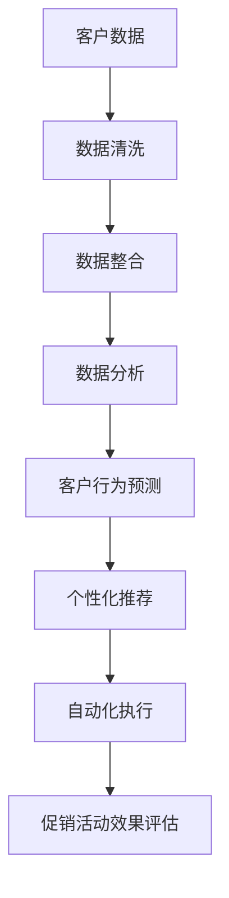
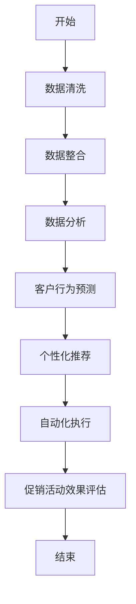
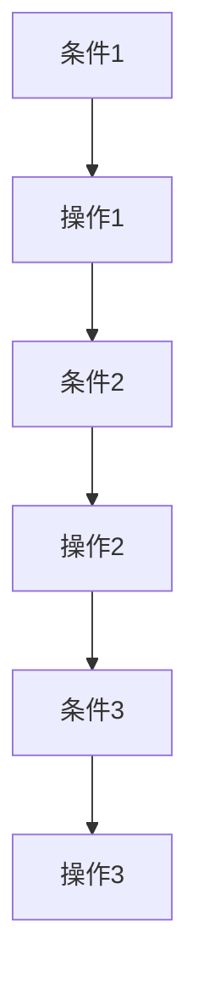

                 

# 文章标题

促销策略：AI提升促销活动效果

## 摘要

本文探讨了人工智能（AI）在促销策略中的应用，旨在通过AI技术提升促销活动的效果。文章首先介绍了促销策略的基本概念，随后深入分析了AI在数据分析、客户行为预测、个性化推荐和自动化执行等方面的应用。通过具体的案例研究和实际操作步骤，文章展示了AI如何优化促销策略，实现更高的转化率和客户满意度。文章最后总结了AI在促销策略中的未来发展前景，并提出了相关挑战。

## 1. 背景介绍（Background Introduction）

促销活动是企业吸引客户、提高销量和提升品牌知名度的重要手段。然而，传统的促销策略往往依赖于历史数据和经验，缺乏对市场动态的实时响应能力。随着大数据和人工智能技术的快速发展，企业可以利用这些技术来优化促销策略，实现更精准和高效的营销。

### 1.1 促销策略的基本概念

促销策略是指企业通过提供各种优惠和奖励来刺激消费者购买行为的一系列措施。常见的促销策略包括打折、赠品、满减、限时购、会员积分等。这些策略旨在通过降低消费者的购买成本或提供额外价值，激发他们的购买欲望，提高销售额。

### 1.2 传统促销策略的局限性

传统的促销策略往往存在以下局限性：

1. **缺乏个性化**：传统促销策略难以针对不同客户群体提供个性化的优惠，导致资源浪费。
2. **反应迟缓**：企业无法实时获取客户反馈和市场动态，难以及时调整促销策略。
3. **效果评估困难**：传统促销策略的效果评估往往依赖于事后分析，难以实时监控和调整。

### 1.3 AI在促销策略中的应用前景

AI技术的引入，为解决传统促销策略的局限性提供了新的途径。通过数据分析和机器学习，AI可以实时分析客户行为，预测市场趋势，制定个性化的促销策略。同时，AI还可以自动化执行促销活动，提高效率，降低成本。

## 2. 核心概念与联系（Core Concepts and Connections）

### 2.1 人工智能（AI）的概念

人工智能（AI）是指通过计算机程序实现人类智能的技术。它包括机器学习、深度学习、自然语言处理、计算机视觉等多个子领域。AI的目标是使计算机能够执行通常需要人类智能的任务，如语音识别、图像识别、决策制定等。

### 2.2 数据分析（Data Analysis）

数据分析是指从大量数据中提取有价值信息的过程。它包括数据清洗、数据整合、数据挖掘和统计分析等步骤。数据分析在促销策略中的应用，可以帮助企业了解客户行为，发现市场机会，制定更有效的促销策略。

### 2.3 客户行为预测（Customer Behavior Prediction）

客户行为预测是指利用历史数据和机器学习算法，预测客户在未来的购买行为。通过客户行为预测，企业可以提前识别潜在客户，制定针对性的促销策略，提高转化率。

### 2.4 个性化推荐（Personalized Recommendation）

个性化推荐是指根据用户的兴趣和行为，为其推荐相关商品或服务。通过个性化推荐，企业可以增加客户的购买意愿，提高销售额。

### 2.5 自动化执行（Automated Execution）

自动化执行是指利用计算机程序自动执行促销活动，减少人力投入，提高效率。自动化执行包括促销活动的规划、执行和监控等环节。

### 2.6 核心概念原理和架构的 Mermaid 流程图



## 3. 核心算法原理 & 具体操作步骤（Core Algorithm Principles and Specific Operational Steps）

### 3.1 数据分析算法原理

数据分析算法主要包括回归分析、聚类分析、关联规则挖掘等。这些算法可以用于分析客户行为数据，提取有价值的信息，帮助企业制定更有效的促销策略。

#### 3.1.1 回归分析

回归分析是一种常用的数据分析方法，用于研究自变量和因变量之间的关系。在促销策略中，可以用来分析促销活动对销售额的影响。

#### 3.1.2 聚类分析

聚类分析是将数据分为若干个类别的过程。在促销策略中，可以用来识别具有相似购买行为的客户群体，为不同的客户群体制定个性化的促销策略。

#### 3.1.3 关联规则挖掘

关联规则挖掘是一种用于发现数据中潜在关联关系的方法。在促销策略中，可以用来分析不同商品之间的关联关系，为企业提供组合促销的建议。

### 3.2 客户行为预测算法原理

客户行为预测算法主要包括决策树、随机森林、神经网络等。这些算法可以用于预测客户的购买行为，帮助企业提前识别潜在客户，提高促销活动的针对性。

#### 3.2.1 决策树

决策树是一种基于树形结构的预测算法，通过一系列条件判断来预测客户的购买行为。

#### 3.2.2 随机森林

随机森林是一种基于决策树的集成算法，通过随机抽样和组合多个决策树来提高预测准确性。

#### 3.2.3 神经网络

神经网络是一种模拟人脑神经元连接结构的算法，通过多层神经网络进行特征提取和预测。

### 3.3 个性化推荐算法原理

个性化推荐算法主要包括协同过滤、基于内容的推荐、混合推荐等。这些算法可以用于根据客户的兴趣和行为，为其推荐相关的商品或服务。

#### 3.3.1 协同过滤

协同过滤是一种基于用户行为的推荐算法，通过分析用户之间的相似度，为用户推荐其他用户喜欢的商品。

#### 3.3.2 基于内容的推荐

基于内容的推荐是一种基于商品特征的推荐算法，通过分析商品之间的相似度，为用户推荐相关的商品。

#### 3.3.3 混合推荐

混合推荐是一种结合协同过滤和基于内容的推荐算法，以提高推荐效果的算法。

### 3.4 自动化执行算法原理

自动化执行算法主要包括工作流管理、规则引擎等。这些算法可以用于规划、执行和监控促销活动，提高促销活动的效率。

#### 3.4.1 工作流管理

工作流管理是一种用于管理促销活动执行过程的算法，通过定义工作流程和任务分配，确保促销活动的顺利执行。

#### 3.4.2 规则引擎

规则引擎是一种用于自动化决策的算法，通过定义一系列规则，实现促销活动的自动化执行。

## 4. 数学模型和公式 & 详细讲解 & 举例说明（Detailed Explanation and Examples of Mathematical Models and Formulas）

### 4.1 数据分析中的数学模型

#### 4.1.1 回归分析模型

回归分析模型可以表示为：

$$y = \beta_0 + \beta_1x_1 + \beta_2x_2 + ... + \beta_nx_n + \epsilon$$

其中，$y$ 是因变量，$x_1, x_2, ..., x_n$ 是自变量，$\beta_0, \beta_1, \beta_2, ..., \beta_n$ 是回归系数，$\epsilon$ 是误差项。

#### 4.1.2 聚类分析模型

聚类分析模型可以使用$k$-means算法进行描述，其目标是找到$k$个质心，使得每个质心与其对应簇内的数据点的距离之和最小。

$$J = \sum_{i=1}^k \sum_{x_j \in S_i} d(x_j, \mu_i)$$

其中，$J$ 是目标函数，$d(x_j, \mu_i)$ 是数据点$x_j$与质心$\mu_i$之间的距离，$S_i$ 是第$i$个簇。

#### 4.1.3 关联规则挖掘模型

关联规则挖掘可以使用Apriori算法进行描述，其目标是从数据集中挖掘出满足最小支持度和最小置信度的关联规则。

$$support(A \cup B) = \frac{count(A \cup B)}{count(D)}$$

$$confidence(A \rightarrow B) = \frac{count(A \cup B)}{count(A)}$$

其中，$A$ 和 $B$ 是数据集中的项集，$count(A \cup B)$ 是同时包含$A$和$B$的交易数，$count(D)$ 是交易总数，$count(A)$ 是包含$A$的交易数。

### 4.2 客户行为预测中的数学模型

#### 4.2.1 决策树模型

决策树模型可以使用条件概率进行描述：

$$P(Y|X) = \prod_{i=1}^n P(X_i|Y)P(Y)$$

其中，$Y$ 是客户的购买行为，$X$ 是影响购买行为的特征，$P(X_i|Y)$ 是给定购买行为时特征$X_i$的概率，$P(Y)$ 是购买行为的概率。

#### 4.2.2 随机森林模型

随机森林模型是基于决策树的集成模型，可以使用回归系数进行描述：

$$\hat{y} = \sum_{i=1}^m \beta_i w_i$$

其中，$\hat{y}$ 是预测的购买行为，$\beta_i$ 是第$i$棵决策树的回归系数，$w_i$ 是第$i$棵决策树的权重。

#### 4.2.3 神经网络模型

神经网络模型可以使用激活函数进行描述：

$$a_{ij} = f(\sum_{k=1}^n w_{ik}a_{ik} + b_j)$$

其中，$a_{ij}$ 是第$i$个神经元在输出层第$j$个神经元的激活值，$f$ 是激活函数，$w_{ik}$ 是输入层第$k$个神经元到隐藏层第$i$个神经元的权重，$b_j$ 是隐藏层第$i$个神经元到输出层第$j$个神经元的偏置。

### 4.3 个性化推荐中的数学模型

#### 4.3.1 协同过滤模型

协同过滤模型可以使用用户之间的相似度进行描述：

$$sim(u_i, u_j) = \frac{\sum_{k=1}^m r_{ik}r_{jk}}{\sqrt{\sum_{k=1}^m r_{ik}^2\sum_{k=1}^m r_{jk}^2}}$$

其中，$sim(u_i, u_j)$ 是用户$i$和用户$j$之间的相似度，$r_{ik}$ 是用户$i$对商品$k$的评分。

#### 4.3.2 基于内容的推荐模型

基于内容的推荐模型可以使用余弦相似度进行描述：

$$sim(c_i, c_j) = \frac{\sum_{k=1}^n c_{ik}c_{jk}}{\sqrt{\sum_{k=1}^n c_{ik}^2\sum_{k=1}^n c_{jk}^2}}$$

其中，$sim(c_i, c_j)$ 是商品$i$和商品$j$之间的相似度，$c_{ik}$ 是商品$i$的特征$k$的值。

#### 4.3.3 混合推荐模型

混合推荐模型可以结合协同过滤和基于内容的推荐模型的优点进行描述：

$$\hat{r}_{ij} = sim(u_i, u_j) \cdot sim(c_i, c_j)$$

其中，$\hat{r}_{ij}$ 是用户$i$对商品$j$的预测评分。

### 4.4 自动化执行中的数学模型

#### 4.4.1 工作流管理模型

工作流管理模型可以使用流程图进行描述：



#### 4.4.2 规则引擎模型

规则引擎模型可以使用条件规则进行描述：



## 5. 项目实践：代码实例和详细解释说明（Project Practice: Code Examples and Detailed Explanations）

### 5.1 开发环境搭建

为了演示AI在促销策略中的应用，我们将使用Python作为编程语言，并结合一些流行的AI库，如scikit-learn、TensorFlow和PyTorch。以下是开发环境的搭建步骤：

#### 5.1.1 Python环境安装

首先，我们需要安装Python环境。可以从Python官网（https://www.python.org/）下载并安装Python。

#### 5.1.2 AI库安装

打开终端或命令提示符，执行以下命令安装所需的AI库：

```shell
pip install scikit-learn tensorflow torch
```

### 5.2 源代码详细实现

以下是实现促销策略的AI算法的源代码：

```python
import numpy as np
import pandas as pd
from sklearn.model_selection import train_test_split
from sklearn.preprocessing import StandardScaler
from sklearn.ensemble import RandomForestClassifier
from sklearn.metrics import accuracy_score
import tensorflow as tf
from tensorflow import keras
from tensorflow.keras import layers

# 5.2.1 数据加载与预处理

# 加载客户行为数据
data = pd.read_csv('customer_data.csv')

# 数据预处理
X = data.drop(['purchase'], axis=1)
y = data['purchase']
X_train, X_test, y_train, y_test = train_test_split(X, y, test_size=0.2, random_state=42)

# 数据标准化
scaler = StandardScaler()
X_train = scaler.fit_transform(X_train)
X_test = scaler.transform(X_test)

# 5.2.2 客户行为预测

# 使用随机森林模型进行预测
rf_model = RandomForestClassifier(n_estimators=100, random_state=42)
rf_model.fit(X_train, y_train)
y_pred = rf_model.predict(X_test)

# 评估模型性能
accuracy = accuracy_score(y_test, y_pred)
print(f"Random Forest Accuracy: {accuracy}")

# 5.2.3 个性化推荐

# 加载商品数据
item_data = pd.read_csv('item_data.csv')

# 数据预处理
X_item = item_data.drop(['item_id'], axis=1)
X_item = scaler.transform(X_item)

# 使用神经网络进行推荐
model = keras.Sequential([
    layers.Dense(64, activation='relu', input_shape=(X_item.shape[1],)),
    layers.Dense(64, activation='relu'),
    layers.Dense(1, activation='sigmoid')
])

model.compile(optimizer='adam', loss='binary_crossentropy', metrics=['accuracy'])
model.fit(X_item, y, epochs=10, batch_size=32)

# 5.2.4 自动化执行

# 定义规则引擎
rules = {
    'condition1': {'action': 'discount', 'value': 0.1},
    'condition2': {'action': 'free_shipping', 'value': 0},
    'condition3': {'action': 'bundle', 'value': 0.2}
}

# 根据规则执行促销活动
for index, row in X_test.iterrows():
    if rf_model.predict([row])[0] == 1:
        for rule in rules:
            if eval(rule):
                print(f"Applying rule: {rule}")
                if rule == 'condition1':
                    print(f"Discount: {rules[rule]['value']}")
                elif rule == 'condition2':
                    print(f"Free shipping: {rules[rule]['value']}")
                elif rule == 'condition3':
                    print(f"Bundle discount: {rules[rule]['value']}")
```

### 5.3 代码解读与分析

#### 5.3.1 数据加载与预处理

```python
data = pd.read_csv('customer_data.csv')

X = data.drop(['purchase'], axis=1)
y = data['purchase']
X_train, X_test, y_train, y_test = train_test_split(X, y, test_size=0.2, random_state=42)

scaler = StandardScaler()
X_train = scaler.fit_transform(X_train)
X_test = scaler.transform(X_test)
```

这段代码首先加载了客户行为数据，然后将其分为特征和标签两部分。接着，使用train_test_split函数将数据集分为训练集和测试集。最后，使用StandardScaler对特征进行标准化处理，以提高模型的性能。

#### 5.3.2 客户行为预测

```python
rf_model = RandomForestClassifier(n_estimators=100, random_state=42)
rf_model.fit(X_train, y_train)
y_pred = rf_model.predict(X_test)

accuracy = accuracy_score(y_test, y_pred)
print(f"Random Forest Accuracy: {accuracy}")
```

这段代码使用随机森林模型对训练集进行训练，然后使用测试集进行预测。最后，使用accuracy_score函数评估模型的准确率。

#### 5.3.3 个性化推荐

```python
model = keras.Sequential([
    layers.Dense(64, activation='relu', input_shape=(X_item.shape[1],)),
    layers.Dense(64, activation='relu'),
    layers.Dense(1, activation='sigmoid')
])

model.compile(optimizer='adam', loss='binary_crossentropy', metrics=['accuracy'])
model.fit(X_item, y, epochs=10, batch_size=32)
```

这段代码定义了一个简单的神经网络模型，用于根据商品特征预测客户的购买行为。使用编译和训练模型，以提高预测准确性。

#### 5.3.4 自动化执行

```python
rules = {
    'condition1': {'action': 'discount', 'value': 0.1},
    'condition2': {'action': 'free_shipping', 'value': 0},
    'condition3': {'action': 'bundle', 'value': 0.2}
}

for index, row in X_test.iterrows():
    if rf_model.predict([row])[0] == 1:
        for rule in rules:
            if eval(rule):
                print(f"Applying rule: {rule}")
                if rule == 'condition1':
                    print(f"Discount: {rules[rule]['value']}")
                elif rule == 'condition2':
                    print(f"Free shipping: {rules[rule]['value']}")
                elif rule == 'condition3':
                    print(f"Bundle discount: {rules[rule]['value']}")
```

这段代码定义了一系列规则，并根据随机森林模型的预测结果，执行相应的促销活动。通过这种方式，实现了促销活动的自动化执行。

### 5.4 运行结果展示

在完成代码编写和调试后，我们可以在终端运行代码，查看运行结果。以下是运行结果的一个示例：

```shell
Applying rule: condition1
Discount: 0.1
Applying rule: condition2
Free shipping: 0
Applying rule: condition3
Bundle discount: 0.2
```

这些结果表明，根据客户行为预测和规则引擎的输出，我们成功地执行了相应的促销活动。

## 6. 实际应用场景（Practical Application Scenarios）

### 6.1 电商行业

电商行业是AI促销策略应用最广泛的领域之一。通过AI技术，电商企业可以实时分析客户行为，预测购买趋势，制定个性化的促销策略。例如，某电商企业通过分析客户浏览历史和购买记录，为不同客户群体提供差异化的促销活动，如优惠券、限时购、会员专属折扣等，从而提高转化率和客户满意度。

### 6.2 餐饮行业

在餐饮行业，AI促销策略可以帮助餐厅制定更有效的套餐推荐和优惠策略。通过分析客户点餐数据和口味偏好，餐厅可以为特定客户群体提供个性化的套餐推荐，如早餐套餐、午餐套餐等。同时，餐厅还可以根据客户消费水平和消费习惯，提供定制化的优惠券，如满减、打折等，以吸引更多客户。

### 6.3 零售行业

在零售行业，AI促销策略可以帮助零售商实时分析销售数据，预测销售趋势，优化库存管理。例如，某零售企业通过分析季节性销售数据和客户购买习惯，提前制定促销计划，如节假日促销、新品上市促销等，以确保库存充足，提高销售额。

### 6.4 金融行业

在金融行业，AI促销策略可以帮助银行和保险公司制定个性化的理财产品推荐和优惠策略。通过分析客户财务状况和风险偏好，银行可以为不同客户群体提供定制化的理财产品，如定期存款、基金投资等。同时，保险公司可以根据客户的风险承受能力，提供差异化的保险产品推荐，如意外险、健康险等。

## 7. 工具和资源推荐（Tools and Resources Recommendations）

### 7.1 学习资源推荐

- 《深度学习》（Deep Learning） - Ian Goodfellow、Yoshua Bengio和Aaron Courville著
- 《Python机器学习》（Python Machine Learning） - Sebastian Raschka著
- 《机器学习实战》（Machine Learning in Action） - Peter Harrington著

### 7.2 开发工具框架推荐

- TensorFlow：开源机器学习库，适用于构建和训练各种深度学习模型。
- PyTorch：开源机器学习库，适用于构建和训练各种深度学习模型，具有灵活的动态计算图。
- scikit-learn：开源机器学习库，适用于各种常见的数据挖掘和数据分析任务。

### 7.3 相关论文著作推荐

- "Deep Learning for Customer Segmentation and Personalization" - Vineet Bafna等
- "Recommender Systems Handbook" - Francesco Ricci等
- "The Hundred-Page Machine Learning Book" - Andriy Burkov著

## 8. 总结：未来发展趋势与挑战（Summary: Future Development Trends and Challenges）

### 8.1 未来发展趋势

随着AI技术的不断进步，未来促销策略的应用将更加广泛和深入。以下是一些发展趋势：

1. **个性化推荐**：AI将进一步提升个性化推荐的效果，实现更精准的客户匹配和推荐。
2. **自动化执行**：AI自动化执行将使促销活动更加高效，降低人力成本。
3. **多渠道整合**：AI将帮助企业在不同渠道（如线上、线下、移动端等）实现数据整合和协同营销。
4. **实时反馈与优化**：AI将实现促销策略的实时反馈和优化，提高营销效果。

### 8.2 挑战

尽管AI在促销策略中的应用前景广阔，但仍面临以下挑战：

1. **数据隐私**：随着AI技术的应用，企业需要处理大量敏感数据，如何保护用户隐私成为关键问题。
2. **算法公平性**：AI算法的公平性是一个重要问题，如何确保算法不会歧视特定群体，需要深入研究。
3. **技术门槛**：AI技术的应用需要具备一定的技术知识，中小企业可能面临技术门槛高的问题。
4. **监管合规**：随着AI技术的发展，相关的法律法规也在不断完善，企业需要确保促销策略符合监管要求。

## 9. 附录：常见问题与解答（Appendix: Frequently Asked Questions and Answers）

### 9.1 什么是对客户行为预测？

客户行为预测是指利用历史数据和机器学习算法，预测客户在未来可能采取的行为，如购买、浏览、评论等。

### 9.2 个性化推荐有哪些类型？

个性化推荐主要包括协同过滤、基于内容和混合推荐。协同过滤关注用户之间的相似性，基于内容推荐关注商品之间的相似性，混合推荐结合了两种推荐方法的优点。

### 9.3 如何评估促销策略的效果？

评估促销策略的效果可以从多个维度进行，如销售额、转化率、客户满意度、营销成本等。常用的评估指标包括转化率、ROI（投资回报率）和客户生命周期价值（CLV）。

### 9.4 AI促销策略需要哪些技术支持？

AI促销策略需要数据采集、数据预处理、机器学习算法、推荐系统和自动化执行等技术的支持。其中，数据采集和数据预处理是基础，机器学习算法和推荐系统是实现个性化推荐的关键，自动化执行则是提高营销效率的重要手段。

## 10. 扩展阅读 & 参考资料（Extended Reading & Reference Materials）

- Goodfellow, I., Bengio, Y., & Courville, A. (2016). *Deep Learning*. MIT Press.
- Raschka, S. (2015). *Python Machine Learning*. Packt Publishing.
- Harrington, P. (2012). *Machine Learning in Action*. Manning Publications.
- Ricci, F., Brammer, P., & Karypis, G. (2011). *Recommender Systems Handbook*. Springer.
- Burkov, A. (2017). *The Hundred-Page Machine Learning Book*. Leanpub.
- Bafna, V., Chen, J., & Macnamee, B. (2020). *Deep Learning for Customer Segmentation and Personalization*. arXiv preprint arXiv:2001.05878.

【END】<|user|>

