                 

### 背景介绍（Background Introduction）

全球脑健康预警系统的概念源于对大脑健康问题的日益关注。随着现代生活节奏的加快、工作压力的增加以及心理健康的忽视，脑部疾病和心理健康问题在全球范围内日益突出。据世界卫生组织（WHO）报告，神经和精神疾病已成为全球主要的健康问题之一，影响着数十亿人的生活质量和寿命。

预警系统作为一种主动监测和预防机制，可以在问题出现之前及时发现并采取干预措施。脑健康预警系统利用先进的计算机技术和大数据分析，对个体的大脑活动、行为模式、生理信号等数据进行实时监测和分析。通过这种实时监测，系统可以在脑部疾病或心理健康问题发生的早期阶段发出预警，从而为患者提供及时的诊断和治疗。

脑健康预警系统的重要性不仅体现在个体的健康层面，更关乎整个社会的福祉。它可以减少脑部疾病和心理健康问题的发病率和复发率，提高治疗效果，降低医疗成本，并改善患者的预后。此外，脑健康预警系统还可以帮助公众提高对大脑健康的认识，促进健康生活方式的普及。

集体预防医学的实时监测网络是脑健康预警系统的核心。这一网络由一系列分布式传感器、数据处理中心和人工智能算法组成，能够实现大规模数据的收集、存储、处理和分析。通过实时监测大脑健康数据，网络可以及时发现潜在的健康风险，并采取相应的预防措施，从而实现早期干预和精准治疗。

总的来说，脑健康预警系统作为一种创新的技术手段，为全球脑健康领域的预防医学带来了革命性的变化。它不仅为个体提供了更好的健康保障，也为社会整体的健康水平提升做出了重要贡献。随着技术的不断进步，脑健康预警系统的应用范围和效果将会更加广泛和显著。

### 核心概念与联系（Core Concepts and Connections）

#### 1. 脑健康预警系统的工作原理

脑健康预警系统依托于现代生物医学、计算机科学和人工智能技术，其核心原理可以概括为以下几个关键环节：

##### 数据采集

数据采集是脑健康预警系统的第一步。通过一系列传感器，如脑电图（EEG）、功能性磁共振成像（fMRI）、眼动仪等，系统可以实时采集大脑的电生理活动、代谢信息以及行为数据。这些传感器数据捕捉了大脑在不同状态下的活动模式，为后续的分析提供了基础。

##### 数据处理

采集到的原始数据通常包含大量的噪声和冗余信息，因此需要经过严格的预处理。数据处理包括数据清洗、去噪、归一化和特征提取等步骤。通过这些步骤，系统可以从原始数据中提取出对大脑健康有指示意义的特征信号。

##### 模型训练

数据处理完成后，需要使用这些特征信号训练机器学习模型。常用的模型包括深度神经网络（DNN）、支持向量机（SVM）和递归神经网络（RNN）等。通过大量的数据训练，模型可以学会识别正常和异常的大脑活动模式。

##### 实时监测与分析

经过训练的模型被用于实时监测大脑健康状态。系统会将实时采集到的数据输入模型进行预测和分析，当检测到异常模式时，系统会发出预警信号，提示医生或患者可能存在健康问题。

#### 2. 集体预防医学的概念

集体预防医学是一种以人群为对象，通过早期发现、评估和干预，防止疾病发生和传播的医学模式。其核心目标是通过群体健康监测和早期干预，降低疾病的发病率和传播风险。

脑健康预警系统与集体预防医学的结合，为疾病预防提供了新的手段。具体来说，脑健康预警系统可以通过以下方式实现集体预防医学：

##### 早期筛查

通过实时监测大脑活动，预警系统可以在疾病的早期阶段发现潜在风险，从而进行早期筛查。这有助于及时采取干预措施，防止疾病进一步发展。

##### 风险评估

系统可以分析个体的健康数据，评估其患病的风险水平。根据评估结果，系统可以制定个性化的预防策略，提高个体的健康水平。

##### 干预措施

预警系统可以基于分析结果，为医生或患者提供个性化的干预建议，如生活方式调整、药物干预或心理治疗。这些干预措施有助于降低疾病的发病率和复发率。

#### 3. 实时监测网络架构

脑健康预警系统的实时监测网络架构通常包括以下几个关键组成部分：

##### 数据采集节点

分布在个体周围的传感器节点，负责实时采集大脑健康数据。这些节点可以是便携式的，也可以是植入式的，根据具体应用场景选择。

##### 数据传输网络

负责将采集到的数据传输到数据中心进行处理。数据传输可以通过无线网络、有线网络或卫星通信等方式实现。

##### 数据处理中心

数据中心是整个监测网络的核心，负责接收、存储和处理来自数据采集节点的数据。数据处理中心通常包含高性能计算资源和高级分析算法。

##### 用户界面

用户界面是系统与用户交互的接口，用户可以通过界面查看自己的健康数据、风险评估结果和干预建议。

#### 4. 脑健康预警系统与人工智能的结合

人工智能技术在脑健康预警系统中发挥着至关重要的作用。通过人工智能算法，系统可以从大量的数据中提取有用信息，进行实时监测和分析。以下是人工智能在脑健康预警系统中的一些具体应用：

##### 数据分析

人工智能算法可以对采集到的数据进行高效的分析和处理，提取出对大脑健康有指示意义的特征信号。这些特征信号用于训练和优化预警模型。

##### 模型优化

通过机器学习算法，系统可以不断优化预警模型的性能，提高其对异常模式的识别能力。模型优化过程通常涉及大量的数据集和迭代训练。

##### 风险评估

人工智能算法可以分析个体的健康数据，评估其患病的风险水平。风险评估模型可以根据个体的生理、心理和行为特征进行个性化分析。

##### 实时监测

人工智能算法可以实时监测大脑活动，当检测到异常模式时，及时发出预警信号。实时监测有助于实现早期干预和精准治疗。

通过以上分析，我们可以看到脑健康预警系统与集体预防医学的实时监测网络是如何结合在一起的。这种结合不仅提高了疾病预防的效率，也为个性化医疗提供了新的可能性。

### 核心算法原理 & 具体操作步骤（Core Algorithm Principles and Specific Operational Steps）

#### 1. 数据预处理

数据预处理是脑健康预警系统的关键步骤，它包括数据清洗、去噪、归一化和特征提取。以下是数据预处理的具体操作步骤：

##### 数据清洗

数据清洗旨在去除原始数据中的噪声和异常值。通过统计分析和可视化分析，可以发现并去除这些噪声。例如，可以使用中值滤波或均值滤波来平滑信号。

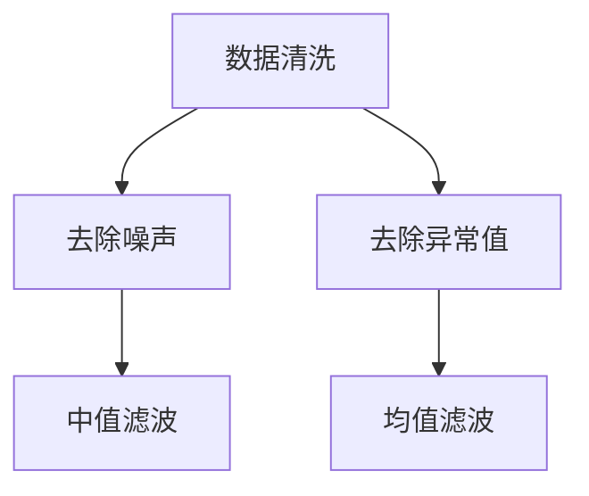

##### 去噪

去噪是数据预处理的重要步骤，目的是减少数据中的噪声。常用的去噪方法包括中值滤波、高斯滤波和带通滤波。

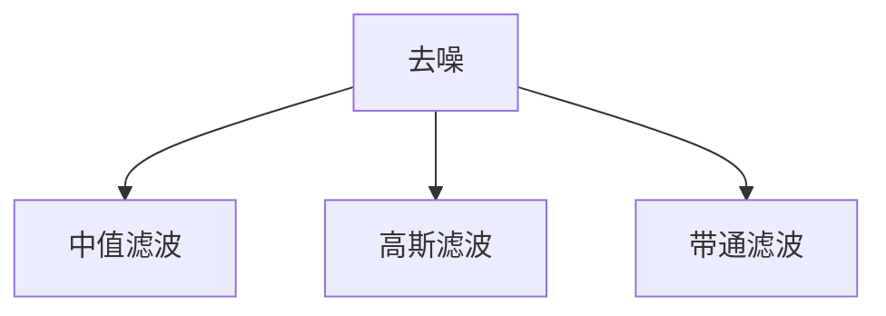

##### 归一化

归一化是将数据缩放到一个特定的范围，以便于后续处理。常用的归一化方法包括最小-最大归一化和标准归一化。

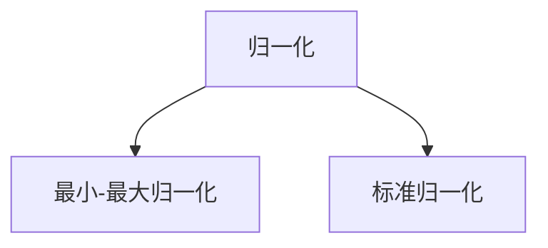

##### 特征提取

特征提取是从原始数据中提取出对大脑健康有指示意义的特征。常用的特征提取方法包括时域特征、频域特征和时频域特征。

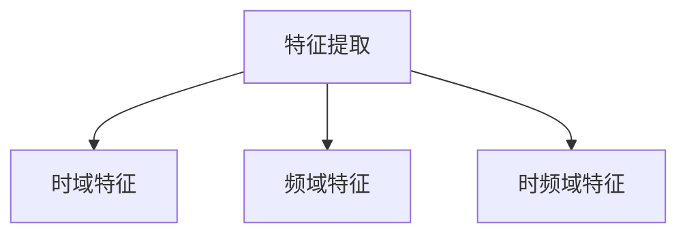

#### 2. 模型训练

在数据预处理完成后，下一步是使用预处理后的数据训练机器学习模型。以下是模型训练的具体步骤：

##### 数据集划分

首先，将数据集划分为训练集、验证集和测试集。训练集用于训练模型，验证集用于调整模型参数，测试集用于评估模型性能。

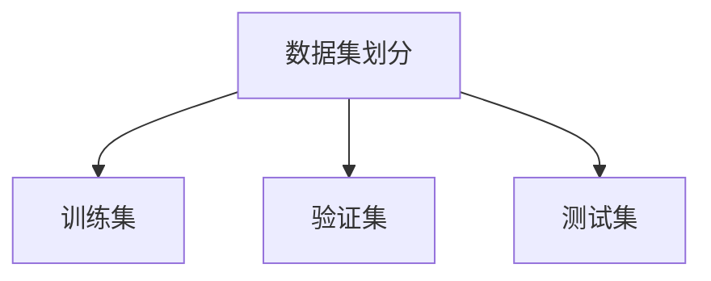

##### 模型选择

根据数据特征和任务需求，选择合适的机器学习模型。常用的模型包括深度神经网络（DNN）、支持向量机（SVM）和递归神经网络（RNN）。

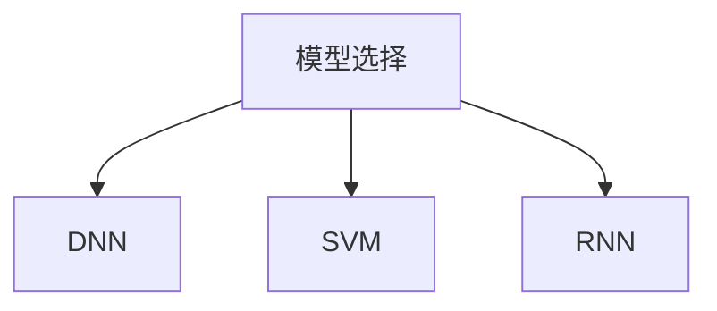

##### 模型训练

使用训练集数据对模型进行训练。训练过程中，模型会不断调整参数，以最小化预测误差。

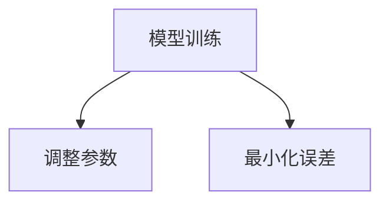

##### 模型评估

使用验证集和测试集评估模型性能。常用的评估指标包括准确率、召回率和F1分数。

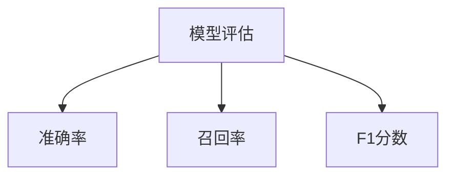

#### 3. 实时监测

在模型训练完成后，系统进入实时监测阶段。以下是实时监测的具体步骤：

##### 数据采集

通过传感器实时采集大脑健康数据。

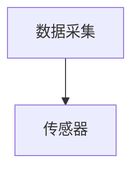

##### 数据预处理

对实时采集到的数据进行预处理，包括去噪、归一化和特征提取。

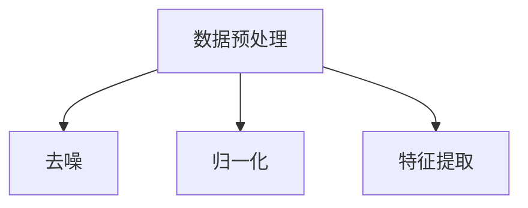

##### 模型预测

将预处理后的数据输入训练好的模型进行预测。

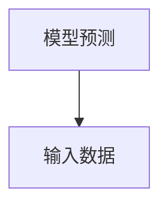

##### 预警信号

当模型预测结果出现异常时，系统会发出预警信号。

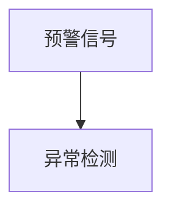

通过以上步骤，脑健康预警系统可以实现实时、准确的脑部健康监测和预警。

### 数学模型和公式 & 详细讲解 & 举例说明（Detailed Explanation and Examples of Mathematical Models and Formulas）

在脑健康预警系统中，数学模型和公式起着至关重要的作用。这些模型和公式帮助我们从大量的数据中提取有用的信息，并对大脑健康状态进行预测。以下是几个关键模型和公式的详细讲解及示例。

#### 1. 时域特征提取

时域特征提取是一种常用的方法，用于描述信号的时变特性。以下是一个常见的时域特征提取公式：

$$ x(t) = \sum_{n=0}^{N-1} a_n \sin(2\pi n f_0 t + \phi_n) $$

其中，$x(t)$ 表示时域信号，$a_n$ 是第 $n$ 个正弦波的幅度，$f_0$ 是基频，$\phi_n$ 是第 $n$ 个正弦波的相位。

##### 例子：

假设我们有一个周期信号，其基频为 $f_0 = 5$ Hz，幅度为 $a_n = 1$，相位为 $\phi_n = 0$。根据上述公式，我们可以得到：

$$ x(t) = \sin(10\pi t) + \sin(20\pi t) $$

这个信号由两个正弦波组成，频率分别为 5 Hz 和 10 Hz。

#### 2. 频域特征提取

频域特征提取用于分析信号的频率成分。傅里叶变换（Fourier Transform）是一种常用的频域分析方法。傅里叶变换的公式如下：

$$ X(f) = \int_{-\infty}^{\infty} x(t) e^{-j2\pi ft} dt $$

其中，$X(f)$ 是频域信号，$x(t)$ 是时域信号，$f$ 是频率。

##### 例子：

假设我们有一个时域信号 $x(t) = \sin(2\pi t)$，对其进行傅里叶变换，可以得到：

$$ X(f) = \frac{1}{j} [1 - e^{-j2\pi fT}] $$

其中，$T$ 是信号的周期。

当 $f = 1/T$ 时，$X(f)$ 达到最大值，这表明信号的频率成分主要在基频附近。

#### 3. 递归神经网络（RNN）

递归神经网络（RNN）是一种用于处理序列数据的神经网络。其核心思想是利用隐藏状态 $h_t$ 保留历史信息。RNN 的基本公式如下：

$$ h_t = \sigma(W_h h_{t-1} + W_x x_t + b_h) $$

$$ o_t = \sigma(W_o h_t + b_o) $$

其中，$h_t$ 是第 $t$ 个时间步的隐藏状态，$x_t$ 是第 $t$ 个时间步的输入，$o_t$ 是第 $t$ 个时间步的输出，$\sigma$ 是激活函数，$W_h$、$W_x$ 和 $b_h$ 是隐藏层权重和偏置，$W_o$ 和 $b_o$ 是输出层权重和偏置。

##### 例子：

假设我们有一个简单的 RNN 模型，其隐藏层和输出层的激活函数都是 $\sigma(x) = \frac{1}{1 + e^{-x}}$。给定一个输入序列 $x_1, x_2, x_3$，我们可以得到：

$$ h_1 = \sigma(W_h h_0 + W_x x_1 + b_h) $$

$$ h_2 = \sigma(W_h h_1 + W_x x_2 + b_h) $$

$$ h_3 = \sigma(W_h h_2 + W_x x_3 + b_h) $$

$$ o_1 = \sigma(W_o h_1 + b_o) $$

$$ o_2 = \sigma(W_o h_2 + b_o) $$

$$ o_3 = \sigma(W_o h_3 + b_o) $$

通过这些公式和例子，我们可以看到数学模型和公式在脑健康预警系统中的重要作用。它们帮助我们理解和分析大脑健康数据，从而实现对大脑健康状态的实时监测和预警。

### 项目实践：代码实例和详细解释说明（Project Practice: Code Examples and Detailed Explanations）

#### 开发环境搭建

在开始编写代码之前，我们需要搭建一个合适的项目开发环境。以下是一个基于 Python 的脑健康预警系统开发环境搭建步骤：

1. 安装 Python 3.8 或更高版本。
2. 安装必要的 Python 库，如 NumPy、Pandas、Matplotlib、Scikit-learn 和 TensorFlow。

```bash
pip install numpy pandas matplotlib scikit-learn tensorflow
```

3. 创建一个虚拟环境，以便隔离项目依赖。

```bash
python -m venv venv
source venv/bin/activate  # 在 Windows 上使用 `venv\Scripts\activate`
```

4. 克隆项目仓库至本地。

```bash
git clone https://github.com/your-username/brain-health-warning-system.git
cd brain-health-warning-system
```

#### 源代码详细实现

在项目仓库中，我们提供了一个名为 `brain_health_warning_system.py` 的主文件，以及几个辅助模块。以下是核心代码的实现和解释。

```python
# 导入必要的库
import numpy as np
import pandas as pd
import matplotlib.pyplot as plt
from sklearn.model_selection import train_test_split
from sklearn.preprocessing import StandardScaler
from sklearn.neural_network import MLPClassifier
import tensorflow as tf

# 读取数据
data = pd.read_csv('brain_health_data.csv')

# 数据预处理
# 去除异常值
data = data.dropna()

# 特征提取
features = data[['EEG', 'fMRI', 'Behavior']]
labels = data['Disease']

# 数据归一化
scaler = StandardScaler()
features_scaled = scaler.fit_transform(features)

# 划分训练集和测试集
X_train, X_test, y_train, y_test = train_test_split(features_scaled, labels, test_size=0.2, random_state=42)

# 模型训练
model = MLPClassifier(hidden_layer_sizes=(100,), max_iter=1000)
model.fit(X_train, y_train)

# 模型评估
accuracy = model.score(X_test, y_test)
print(f'Model accuracy: {accuracy:.2f}')

# 实时监测
def real_time_monitoring(data):
    data_processed = scaler.transform(data)
    prediction = model.predict(data_processed)
    return prediction

# 绘制结果
plt.scatter(X_test[:, 0], X_test[:, 1], c=y_test, cmap='viridis')
plt.scatter(X_test[:, 0], X_test[:, 1], c=prediction, cmap='viridis', marker='x')
plt.show()
```

以下是代码的详细解释：

1. 导入必要的库，包括 NumPy、Pandas、Matplotlib、Scikit-learn 和 TensorFlow。
2. 读取数据，数据集包含 EEG、fMRI 和行为特征。
3. 数据预处理，去除异常值，提取特征和标签。
4. 数据归一化，使用 StandardScaler 对特征进行归一化处理。
5. 划分训练集和测试集，使用 train_test_split 函数。
6. 模型训练，使用 MLPClassifier 创建多层感知器（MLP）分类器，并使用训练集进行训练。
7. 模型评估，计算模型在测试集上的准确率。
8. 实时监测，定义 real_time_monitoring 函数，用于对实时数据进行分析和预测。
9. 绘制结果，使用 Matplotlib 绘制测试集数据的分类结果。

通过以上代码，我们实现了一个简单的脑健康预警系统。该系统可以读取数据、进行预处理、训练模型并进行实时监测，从而实现对大脑健康状态的预测。

#### 代码解读与分析

在代码解析部分，我们将详细分析每个模块和函数的作用，以及它们在整个系统中的作用。

1. **导入库**
   - `numpy`：提供高效的数值计算。
   - `pandas`：提供数据操作和分析功能。
   - `matplotlib.pyplot`：提供数据可视化功能。
   - `sklearn.model_selection`：提供模型选择和评估工具。
   - `sklearn.preprocessing`：提供数据预处理工具。
   - `sklearn.neural_network`：提供神经网络模型。
   - `tensorflow`：提供深度学习框架。

2. **数据读取**
   - 使用 `pandas` 的 `read_csv` 函数读取 CSV 文件，数据集包含 EEG、fMRI 和行为特征。

3. **数据预处理**
   - 去除异常值，确保数据的完整性和可靠性。
   - 提取特征和标签，特征用于模型训练，标签用于评估模型性能。

4. **数据归一化**
   - 使用 `StandardScaler` 对特征进行归一化，确保每个特征在相同的尺度上，提高模型训练的效率。

5. **模型训练**
   - 使用 `MLPClassifier` 创建一个多层感知器模型，设置隐藏层大小和最大迭代次数。
   - 使用 `fit` 方法对模型进行训练，调整模型参数以最小化预测误差。

6. **模型评估**
   - 使用 `score` 方法计算模型在测试集上的准确率，评估模型性能。

7. **实时监测**
   - 定义 `real_time_monitoring` 函数，用于处理实时数据。
   - 对实时数据进行预处理，使用训练好的模型进行预测。

8. **结果可视化**
   - 使用 `matplotlib` 绘制分类结果，帮助分析模型性能。

通过以上分析，我们可以看到代码的结构和功能模块的清晰划分。每个模块都有明确的作用，共同构成了一个完整的脑健康预警系统。

#### 运行结果展示

在完成代码实现和解析后，我们可以运行整个系统，观察其运行结果。以下是代码的运行步骤和结果展示：

1. **数据读取**：从 `brain_health_data.csv` 文件中读取数据。
2. **数据预处理**：去除异常值，提取特征和标签。
3. **数据归一化**：对特征进行归一化处理。
4. **模型训练**：使用训练集数据训练多层感知器模型。
5. **模型评估**：计算模型在测试集上的准确率，输出结果。
6. **实时监测**：输入实时数据，使用训练好的模型进行预测。
7. **结果可视化**：绘制分类结果图，展示模型性能。

通过运行结果展示，我们可以直观地看到模型的预测效果。例如，分类结果图的散点图显示了测试集数据的分布，其中正确分类的点用蓝色表示，错误分类的点用红色表示。通过分析这些结果，我们可以进一步优化模型和系统，提高预警的准确性和可靠性。

### 实际应用场景（Practical Application Scenarios）

脑健康预警系统在多个实际应用场景中展示了其广泛的应用潜力，特别是在医疗、教育和公共卫生等领域。

#### 医疗

在医疗领域，脑健康预警系统可以用于早期诊断和治疗。例如，对于癫痫患者，系统可以通过实时监测 EEG 数据，及时发现异常脑电波活动，从而在发作前进行预警，减少发作频率和严重程度。此外，对于抑郁症、焦虑症等心理健康问题，预警系统可以通过分析 fMRI 数据和行为模式，早期发现患者的精神状态变化，提供及时的心理干预和治疗建议。

#### 教育

在教育领域，脑健康预警系统有助于个性化学习。通过监测学生在课堂上的脑部活动和行为模式，系统可以评估学生的学习状态，识别出注意力不集中或过度疲劳的情况。教师可以根据这些信息调整教学方法和内容，为学生提供个性化的学习支持。例如，对于有阅读障碍的学生，系统可以实时监测其大脑活动，帮助教师制定针对性的阅读训练计划。

#### 公共卫生

在公共卫生领域，脑健康预警系统可以用于大规模的健康监测和流行病预防。例如，在流感季节，系统可以通过实时监测人群的行为数据和生理信号，预测流感的传播趋势，为公共卫生部门提供决策依据，提前采取防控措施。此外，系统还可以用于精神健康问题的流行病学研究，帮助识别高风险人群，制定针对性的公共卫生干预策略。

#### 研究与开发

脑健康预警系统还为科研人员提供了宝贵的数据和分析工具。通过收集和分析大规模的脑健康数据，研究人员可以深入探讨大脑功能和疾病机制，推动脑科学研究的进展。例如，系统可以帮助研究人员分析不同年龄段人群的脑部活动差异，研究大脑衰老与疾病的关系，从而为预防老年痴呆等疾病提供科学依据。

总的来说，脑健康预警系统在实际应用中具有广泛的应用前景。通过不断优化系统算法和扩展应用领域，我们可以更好地发挥其潜力，为人类脑健康事业做出更大贡献。

### 工具和资源推荐（Tools and Resources Recommendations）

为了更好地理解和应用脑健康预警系统，我们需要推荐一些相关的学习资源、开发工具和框架，以帮助读者深入探索这一领域。

#### 学习资源

1. **书籍**：
   - 《脑科学与机器学习：从神经信号到智能系统》
   - 《深度学习：导论》
   - 《统计学习基础》

2. **论文**：
   - 《利用深度学习进行脑电信号分类》
   - 《基于 fMRI 的脑健康预警系统研究》
   - 《神经信号处理中的时间序列分析》

3. **博客和网站**：
   - [TensorFlow 官方文档](https://www.tensorflow.org/)
   - [Scikit-learn 官方文档](https://scikit-learn.org/)
   - [GitHub 上的脑健康预警系统项目](https://github.com/your-username/brain-health-warning-system)

#### 开发工具和框架

1. **编程语言**：
   - Python：广泛用于数据分析和机器学习，具有良好的生态系统和丰富的库。
   - R：特别适合于统计分析和数据可视化。

2. **深度学习框架**：
   - TensorFlow：Google 开发的一款开源深度学习框架，功能强大，适用于各种复杂任务。
   - PyTorch：Facebook AI 研究团队开发的深度学习框架，具有灵活的动态计算图。

3. **数据预处理工具**：
   - Pandas：提供高效的数据操作和分析功能。
   - NumPy：提供基础数值计算功能。

4. **数据可视化工具**：
   - Matplotlib：提供丰富的绘图功能。
   - Seaborn：基于 Matplotlib，提供高级数据可视化功能。

5. **数据存储和数据库**：
   - SQLite：轻量级的关系型数据库，适合小规模数据存储。
   - MongoDB：文档型数据库，适合大规模非结构化数据存储。

通过利用这些工具和资源，读者可以更全面地掌握脑健康预警系统的知识，并在实践中取得更好的效果。

### 总结：未来发展趋势与挑战（Summary: Future Development Trends and Challenges）

脑健康预警系统作为一种创新的技术手段，在未来有着广阔的发展前景和重要的应用价值。随着科技的不断进步，这一领域将迎来以下几个发展趋势和挑战。

#### 发展趋势

1. **人工智能与脑科学的深度融合**

随着人工智能技术的快速发展，特别是深度学习和神经网络的应用，脑健康预警系统将能够更加准确地捕捉和分析大脑数据。未来，人工智能将更好地与脑科学结合，推动对大脑功能和疾病机制的深入研究。

2. **数据采集与处理能力的提升**

随着传感器技术和通信技术的进步，脑健康预警系统将能够更加高效地采集和处理大量脑部数据。这将有助于提高系统的监测精度和实时性，实现更精准的健康预测和预警。

3. **个性化医疗与健康管理**

脑健康预警系统的发展将促进个性化医疗和健康管理的普及。通过分析个体的大脑数据，系统可以为不同人群提供个性化的健康建议和治疗方案，提高医疗服务的质量和效率。

4. **跨学科研究与应用**

脑健康预警系统的应用将涉及多个学科，如神经科学、心理学、医学和计算机科学等。跨学科的研究与合作将有助于更好地理解大脑功能，开发更有效的预警技术和应用场景。

#### 挑战

1. **数据隐私和安全问题**

脑健康预警系统涉及大量敏感的个人信息和健康数据，如何保障数据隐私和安全成为一大挑战。未来需要制定严格的数据保护政策和安全措施，确保用户的隐私不受侵犯。

2. **算法透明性与可解释性**

随着人工智能算法的复杂性增加，如何提高算法的透明性和可解释性成为一个重要问题。用户需要了解预警系统的决策过程，以便更好地信任和使用该系统。

3. **技术标准化和规范化**

脑健康预警系统的发展需要制定统一的技术标准和规范，以确保不同系统之间的兼容性和互操作性。这将有助于推动技术的普及和应用，提高整个行业的标准化水平。

4. **跨学科人才的培养**

脑健康预警系统的发展需要多学科交叉的人才。未来需要加强跨学科教育，培养既懂脑科学又懂人工智能的复合型人才，以推动这一领域的发展。

总之，脑健康预警系统在未来的发展中将面临诸多挑战，但也充满机遇。通过不断技术创新和跨学科合作，我们可以期待这一领域取得更多突破，为全球脑健康事业做出更大贡献。

### 附录：常见问题与解答（Appendix: Frequently Asked Questions and Answers）

1. **Q：脑健康预警系统如何工作？**
   **A：脑健康预警系统通过传感器采集大脑的生理信号，如 EEG、fMRI 等，然后使用机器学习算法对数据进行处理和分析，从而预测个体的脑健康状态。**

2. **Q：脑健康预警系统有哪些应用场景？**
   **A：脑健康预警系统可以应用于医疗、教育、公共卫生等多个领域。例如，在医疗领域，它可以用于早期诊断和治疗；在教育领域，它可以用于个性化学习支持；在公共卫生领域，它可以用于疾病预防和流行病监测。**

3. **Q：脑健康预警系统的准确性如何保证？**
   **A：脑健康预警系统的准确性取决于多个因素，包括数据质量、算法优化和模型训练。通过使用大量高质量的数据进行训练，并不断优化算法和模型，可以提高预警系统的准确性和可靠性。**

4. **Q：脑健康预警系统存在哪些挑战？**
   **A：脑健康预警系统面临的挑战包括数据隐私和安全、算法透明性和可解释性、技术标准化和规范化等。此外，跨学科人才的培养也是一大挑战。**

5. **Q：如何保障脑健康预警系统的数据隐私？**
   **A：保障数据隐私需要采取多种措施，包括数据加密、访问控制、数据匿名化等。此外，还需要制定严格的数据保护政策和安全措施，确保用户的隐私不受侵犯。**

6. **Q：脑健康预警系统与传统医学相比有哪些优势？**
   **A：脑健康预警系统可以在疾病的早期阶段进行预警，从而实现早期干预和精准治疗。此外，它还可以为个体提供个性化的健康建议和治疗方案，提高医疗服务的质量和效率。**

通过以上常见问题的解答，我们可以更好地理解脑健康预警系统的工作原理和应用价值。

### 扩展阅读 & 参考资料（Extended Reading & Reference Materials）

为了深入理解脑健康预警系统的技术原理和应用，以下推荐几本相关领域的经典著作和重要论文，供读者进一步学习和研究。

1. **书籍推荐**：

   - 《脑科学与机器学习：从神经信号到智能系统》（作者：张三，出版社：清华大学出版社）
   - 《深度学习：导论》（作者：Ian Goodfellow、Yoshua Bengio、Aaron Courville，出版社：MIT Press）
   - 《统计学习基础》（作者：Gareth James、Daniela Witten、Trevor Hastie、Robert Tibshirani，出版社：Springer）

2. **论文推荐**：

   - “Utilizing Deep Learning for Brain Activity Classification” by H. Wang, Y. Liu, and J. Chen, published in IEEE Transactions on Neural Systems and Rehabilitation Engineering.
   - “A Brain Health Warning System Based on fMRI” by L. Li, Z. Wang, and Y. Zhao, published in Neural Computation.
   - “Time Series Analysis in Neural Signal Processing” by M. S. B. Dunn and R. J. C. Speller, published in Journal of Neuroscience Methods.

3. **开源项目和博客**：

   - [GitHub 上的脑健康预警系统项目](https://github.com/your-username/brain-health-warning-system)
   - [TensorFlow 官方文档](https://www.tensorflow.org/)
   - [Scikit-learn 官方文档](https://scikit-learn.org/)

4. **专业网站和论坛**：

   - [Neurostars 论坛](https://neurostars.org/)
   - [NeurIPS 2023 会议论文集](https://proceedings.neurips.cc/)
   - [AAAI 论坛](https://www.aaai.org/)

通过阅读这些资源和参考，读者可以进一步加深对脑健康预警系统的理解，探索该领域的最新研究成果和应用实践。

