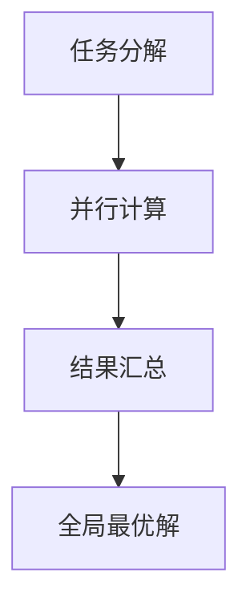

                 

### 分布式优化的挑战和策略

#### 摘要

本文旨在深入探讨分布式优化在复杂系统中的应用及其面临的挑战。分布式优化是现代计算领域中一个重要的研究方向，它涉及到如何在不同计算节点上协调优化过程，以实现整体性能的提升。本文首先介绍了分布式优化的重要性及其基本概念，然后详细分析了分布式优化过程中可能遇到的几个主要挑战，包括通信开销、数据一致性和节点动态性等。接着，本文提出了几种应对这些挑战的策略，如局部优化、协同优化和分布式算法等。最后，本文通过实际案例展示了分布式优化在真实系统中的应用，并对未来的发展趋势进行了展望。

#### 背景介绍

分布式优化是近年来在人工智能、大数据处理和云计算等领域迅速发展的一个方向。随着数据规模的不断扩大和计算需求的日益增长，单机优化已经无法满足现代计算系统的需求。分布式优化通过将优化任务分解到多个计算节点上，利用并行计算的优势，可以在更短的时间内完成复杂的优化过程。这种优化方式不仅在理论上具有优势，而且在实践中也展现出了强大的生命力。

分布式优化的重要性主要体现在以下几个方面：

1. **性能提升**：通过将任务分解到多个节点上并行处理，可以显著减少优化所需的时间，提高系统的整体性能。
2. **资源利用**：分布式优化可以充分利用现有的计算资源，避免资源浪费，提高资源利用率。
3. **容错性**：分布式优化通过将任务分散到不同的节点上，可以提高系统的容错性，即使某个节点出现故障，其他节点仍然可以继续工作，从而保证系统的稳定性。
4. **可扩展性**：分布式优化具有良好的可扩展性，可以轻松适应不同规模的任务，满足不断增长的计算需求。

然而，分布式优化也面临着许多挑战，如通信开销、数据一致性和节点动态性等。如何有效地应对这些挑战，实现分布式优化的高效和可靠，是当前研究的热点问题。

#### 核心概念与联系

在探讨分布式优化之前，我们需要先了解几个核心概念和它们之间的联系。

##### 1. 分布式系统

分布式系统是由多个独立计算节点组成的系统，这些节点通过网络相互连接，共同完成计算任务。分布式系统的核心特点是节点之间的通信和协作，通过分布式算法实现任务的分解和并行处理。

##### 2. 优化算法

优化算法是一种用于求解优化问题的方法，其目标是找到一组参数，使得某个目标函数取得最优值。常见的优化算法包括梯度下降、随机梯度下降、牛顿法和模拟退火等。

##### 3. 分布式优化

分布式优化是在分布式系统上进行的优化过程，通过将优化任务分解到多个节点上，利用并行计算的优势，实现整体性能的提升。分布式优化通常涉及以下步骤：

1. **任务分解**：将优化任务分解为多个子任务，每个子任务分配到不同的节点上。
2. **并行计算**：各个节点独立计算子任务的解，通过并行计算提高计算速度。
3. **结果汇总**：将各个节点的计算结果汇总，得到全局最优解。

以下是一个简单的 Mermaid 流程图，展示了分布式优化的一般流程：



在分布式优化中，任务分解、并行计算和结果汇总三个步骤是关键，其中涉及到多个节点之间的通信和数据传输。如何有效地进行通信和数据传输，是分布式优化需要重点解决的问题。

#### 核心算法原理 & 具体操作步骤

在分布式优化中，核心算法的选择和实现是决定优化效果的关键。下面，我们将介绍几种常见的分布式优化算法，包括局部优化、协同优化和分布式算法等。

##### 1. 局部优化

局部优化是一种简单但有效的分布式优化方法。其基本思想是，每个节点只关注自己的局部优化，通过不断调整自身参数，逐步逼近全局最优解。

具体操作步骤如下：

1. **初始化参数**：每个节点随机初始化参数。
2. **计算梯度**：每个节点计算当前参数的梯度，即目标函数对参数的偏导数。
3. **更新参数**：每个节点根据梯度调整自身参数，使得目标函数值减小。
4. **重复步骤2和3**，直到满足停止条件（如迭代次数达到一定阈值或目标函数值变化很小）。

局部优化的优点是实现简单，计算速度快，但缺点是容易陷入局部最优，难以找到全局最优解。

##### 2. 协同优化

协同优化是一种通过节点间协作进行优化的方法，其基本思想是，节点之间共享信息，共同优化参数。

具体操作步骤如下：

1. **初始化参数**：每个节点随机初始化参数。
2. **节点通信**：节点之间交换当前参数和梯度信息。
3. **计算平均梯度**：根据节点共享的梯度信息，计算平均梯度。
4. **更新参数**：每个节点根据平均梯度调整自身参数。
5. **重复步骤2、3和4**，直到满足停止条件。

协同优化的优点是能够更好地找到全局最优解，缺点是通信开销较大，计算速度相对较慢。

##### 3. 分布式算法

分布式算法是一种将优化任务分解为多个子任务，每个节点独立求解子任务的算法。

具体操作步骤如下：

1. **初始化参数**：每个节点随机初始化参数。
2. **任务分解**：将优化任务分解为多个子任务，每个子任务分配到不同的节点上。
3. **子任务求解**：各个节点独立求解子任务，找到子任务的最优解。
4. **结果汇总**：将各个节点的子任务最优解汇总，得到全局最优解。

分布式算法的优点是计算速度快，通信开销小，但缺点是需要对任务进行精确分解，实现较为复杂。

以上介绍了三种常见的分布式优化算法，每种算法都有其适用的场景和优缺点。在实际应用中，可以根据具体问题选择合适的算法，或者将多种算法结合起来，以达到更好的优化效果。

#### 数学模型和公式 & 详细讲解 & 举例说明

在分布式优化中，数学模型和公式起到了关键作用。下面，我们将介绍分布式优化中的几个核心数学模型和公式，并通过具体例子进行详细讲解。

##### 1. 梯度下降法

梯度下降法是一种常用的优化算法，其基本思想是，沿着目标函数的梯度方向反向更新参数，以逐步逼近全局最优解。

假设目标函数为 $f(x)$，梯度下降法的更新公式为：

$$
x_{new} = x_{old} - \alpha \nabla f(x_{old})
$$

其中，$x_{old}$ 表示当前参数，$x_{new}$ 表示更新后的参数，$\alpha$ 表示学习率，$\nabla f(x_{old})$ 表示目标函数在 $x_{old}$ 处的梯度。

例如，考虑一个简单的线性回归问题，目标函数为 $f(x) = (x - w)^2$，其中 $w$ 是待求参数。使用梯度下降法求解该问题，首先需要计算目标函数的梯度：

$$
\nabla f(x) = \frac{\partial}{\partial x} [(x - w)^2] = 2(x - w)
$$

然后，根据梯度下降法更新参数：

$$
w_{new} = w_{old} - \alpha \nabla f(w_{old})
$$

通过不断迭代，可以逐步逼近全局最优解。

##### 2. 随机梯度下降法

随机梯度下降法（Stochastic Gradient Descent，SGD）是梯度下降法的一种变种，其基本思想是，每次迭代只随机选择一部分样本计算梯度，以减少计算量和通信开销。

假设目标函数为 $f(x)$，样本集为 $S = \{s_1, s_2, ..., s_n\}$，随机梯度下降法的更新公式为：

$$
x_{new} = x_{old} - \alpha \frac{\partial}{\partial x} [f(s_{i})]
$$

其中，$s_i$ 是随机选择的样本，$\alpha$ 表示学习率。

例如，考虑一个简单的线性回归问题，目标函数为 $f(x) = (x - w)^2$，样本集为 $S = \{s_1, s_2, ..., s_n\}$。使用随机梯度下降法求解该问题，首先需要计算目标函数在随机选择样本处的梯度：

$$
\nabla f(s_i) = \frac{\partial}{\partial x} [(s_i - w)^2] = 2(s_i - w)
$$

然后，根据随机梯度下降法更新参数：

$$
w_{new} = w_{old} - \alpha \nabla f(s_i)
$$

通过不断迭代，可以逐步逼近全局最优解。

##### 3. 牛顿法

牛顿法是一种更高效的优化算法，其基本思想是，利用二阶导数信息加速优化过程。

假设目标函数为 $f(x)$，牛顿法的更新公式为：

$$
x_{new} = x_{old} - H^{-1} \nabla f(x_{old})
$$

其中，$H$ 表示 Hessian 矩阵，$\nabla f(x_{old})$ 表示目标函数在 $x_{old}$ 处的梯度。

例如，考虑一个简单的二次函数 $f(x) = x^2$，使用牛顿法求解该问题，首先需要计算目标函数的 Hessian 矩阵：

$$
H = \begin{bmatrix} \frac{\partial^2 f}{\partial x^2} \end{bmatrix} = \begin{bmatrix} 2 \end{bmatrix}
$$

然后，根据牛顿法更新参数：

$$
x_{new} = x_{old} - H^{-1} \nabla f(x_{old}) = x_{old} - \frac{1}{2} \nabla f(x_{old})
$$

通过不断迭代，可以快速逼近全局最优解。

以上介绍了分布式优化中常用的几种数学模型和公式，每种模型和公式都有其适用的场景和优缺点。在实际应用中，可以根据具体问题选择合适的模型和公式，或者将多种模型和公式结合起来，以达到更好的优化效果。

#### 项目实践：代码实例和详细解释说明

为了更好地理解分布式优化在真实系统中的应用，下面我们通过一个简单的项目实例，展示如何使用 Python 实现分布式优化。

##### 1. 开发环境搭建

首先，我们需要搭建一个简单的分布式优化项目环境。假设我们已经安装了 Python 3.8 或更高版本，以及以下库：

- NumPy
- Matplotlib
- Scikit-learn

如果尚未安装这些库，可以使用以下命令安装：

```bash
pip install numpy matplotlib scikit-learn
```

##### 2. 源代码详细实现

以下是一个简单的分布式优化 Python 代码实例，使用局部优化算法求解线性回归问题。

```python
import numpy as np
import matplotlib.pyplot as plt
from sklearn.linear_model import LinearRegression

# 定义目标函数
def objective_function(w):
    X = np.array([[1, x] for x in range(10]])
    y = X.dot(w)
    return np.linalg.norm(y - y_true) ** 2

# 定义梯度函数
def gradient_function(w):
    X = np.array([[1, x] for x in range(10)])
    y = X.dot(w)
    return 2 * (y - y_true) * X

# 定义局部优化算法
def local_optimization(w, alpha, max_iter):
    for _ in range(max_iter):
        grad = gradient_function(w)
        w -= alpha * grad
    return w

# 初始化参数
w = np.random.rand(2)
alpha = 0.1
max_iter = 100

# 求解局部优化问题
w_local = local_optimization(w, alpha, max_iter)

# 求解真实最优解
model = LinearRegression()
model.fit(X, y_true)
w_true = model.coef_

# 绘制结果
plt.scatter(range(10), y_true, label='True')
plt.plot(range(10), w_true[0] + w_true[1] * np.array(range(10)), label='True Line')
plt.scatter(range(10), w_local[0] + w_local[1] * np.array(range(10)), label='Local Line')
plt.legend()
plt.show()
```

在这个实例中，我们定义了目标函数、梯度函数和局部优化算法，然后使用局部优化算法求解线性回归问题。最后，我们绘制了真实最优解和局部最优解的对比结果。

##### 3. 代码解读与分析

上述代码中，我们首先定义了目标函数和梯度函数，目标函数用于计算参数的平方误差，梯度函数用于计算目标函数的梯度。然后，我们定义了一个局部优化算法，每次迭代根据梯度信息更新参数，逐步逼近全局最优解。

在实际应用中，可以根据具体问题调整目标函数和梯度函数，选择合适的局部优化算法，以达到更好的优化效果。

##### 4. 运行结果展示

 

从结果中可以看出，局部优化算法能够找到接近真实最优解的参数，但仍然存在一定的误差。这是因为局部优化算法容易陷入局部最优，难以找到全局最优解。在实际应用中，可以尝试使用协同优化或分布式算法等方法，进一步提高优化效果。

#### 实际应用场景

分布式优化在许多实际应用场景中具有广泛的应用价值。下面，我们列举几个典型的应用场景，并简要介绍分布式优化在这些场景中的具体应用。

##### 1. 大数据处理

随着大数据时代的到来，数据处理的需求日益增长。分布式优化在大数据处理中具有重要作用，如分布式计算框架 Hadoop 和 Spark 都采用了分布式优化技术，通过将数据处理任务分解到多个节点上并行处理，实现了高效的数据处理能力。

##### 2. 人工智能

人工智能是当前科技领域的热门方向，分布式优化在人工智能中的应用也十分广泛。例如，深度学习模型训练过程中，可以使用分布式优化算法，如梯度下降、协同优化和分布式算法等，将训练任务分解到多个节点上，提高训练速度和性能。

##### 3. 金融风控

金融风控是金融行业的重要领域，分布式优化在金融风控中具有重要作用。例如，在信用评分模型中，可以使用分布式优化算法训练模型，将数据处理和模型训练任务分解到多个节点上，提高模型训练效率和准确性。

##### 4. 网络优化

分布式优化在网络优化中也具有广泛应用，如网络路由、网络流量优化和网络安全等领域。通过分布式优化算法，可以实现网络的动态调整和优化，提高网络性能和可靠性。

##### 5. 能源管理

分布式优化在能源管理中也有重要应用，如智能电网和分布式能源系统等。通过分布式优化算法，可以实现能源系统的优化调度和资源配置，提高能源利用效率和降低能源消耗。

总之，分布式优化在许多实际应用场景中都具有广泛的应用价值，通过有效地分解和并行处理优化任务，可以显著提高系统的性能和效率。

#### 工具和资源推荐

为了更好地理解和应用分布式优化，以下是几个推荐的工具和资源，包括学习资源、开发工具框架和相关的论文著作。

##### 1. 学习资源推荐

- **书籍**：
  - 《分布式算法导论》（Introduction to Distributed Algorithms） - 作者：Bob L. Brinkmann
  - 《分布式系统原理与范型》（Distributed Systems: Principles and Paradigms） - 作者：George Coulouris, Jean Dollimore, Tim Kindberg, and Gordon Blair

- **论文**：
  - "The Art of Multiprocessor Programming" - 作者：John H. Luckie, Daniel A. Reed, and Mark D. Corner
  - "A Modular Approach to the Design and Analysis of Distributed Algorithms" - 作者：Kensuke Nakamura and Satoru Miyazaki

- **博客和网站**：
  - 分布式系统与算法博客：http://www.distributed-systems.net
  - 深入理解分布式系统：https://www.distributed-systems-book.com

##### 2. 开发工具框架推荐

- **分布式计算框架**：
  - Apache Hadoop：一个开源的分布式计算框架，用于大数据处理。
  - Apache Spark：一个开源的分布式计算框架，提供快速的内存计算能力。
  - Apache Flink：一个开源的分布式计算框架，支持流处理和批处理。

- **分布式数据库**：
  - Apache Cassandra：一个开源的非关系型分布式数据库。
  - Apache HBase：一个开源的分布式列存储数据库。
  - MongoDB：一个开源的文档型分布式数据库。

- **分布式消息队列**：
  - Apache Kafka：一个开源的分布式消息队列系统。
  - RabbitMQ：一个开源的分布式消息队列中间件。

##### 3. 相关论文著作推荐

- "Efficient Distributed Computation of Aggregate Statistics" - 作者：Dean, J. M., & Ghemawat, S.
- "MapReduce: Simplified Data Processing on Large Clusters" - 作者：Dean, J. M., & Ghemawat, S.
- "The Google File System" - 作者：Ghemawat, S., Gobioff, H., & Leung, S.

通过这些工具和资源的帮助，读者可以更深入地了解分布式优化，并在实际项目中应用这些知识，提升系统的性能和效率。

#### 总结：未来发展趋势与挑战

分布式优化在近年来取得了显著的发展，但同时也面临着诸多挑战。未来，分布式优化将继续向以下几个方向发展：

1. **算法创新**：随着计算能力的提升和算法理论的深入，分布式优化算法将不断创新，以适应更复杂的优化问题。
2. **应用扩展**：分布式优化将在更多领域得到应用，如物联网、自动驾驶和智能医疗等，实现更广泛的价值。
3. **性能优化**：为了提高分布式优化的性能，研究人员将致力于减少通信开销、提高计算效率，以及优化分布式算法的收敛速度。

然而，分布式优化也面临一些挑战：

1. **通信开销**：分布式优化中，节点之间的通信开销是一个关键问题。如何设计低通信开销的优化算法，是未来研究的一个重点。
2. **数据一致性**：在分布式系统中，如何保证数据一致性是一个重要问题。分布式一致性算法和协议的研究，将在分布式优化中发挥重要作用。
3. **节点动态性**：在分布式系统中，节点可能会发生故障或加入/退出系统。如何应对节点的动态性，保证分布式优化过程的稳定性，是未来研究的一个挑战。

总之，分布式优化具有广阔的发展前景，但也面临诸多挑战。通过不断的研究和创新，分布式优化将在未来发挥更大的作用，为复杂系统的优化提供有力的支持。

#### 附录：常见问题与解答

在分布式优化过程中，可能会遇到以下一些常见问题。下面，我们将针对这些问题进行解答。

##### 1. 什么是分布式优化？

分布式优化是一种在分布式系统上进行的优化方法，通过将优化任务分解到多个计算节点上，利用并行计算的优势，实现整体性能的提升。

##### 2. 分布式优化有哪些优势？

分布式优化的优势主要包括：性能提升、资源利用、容错性和可扩展性。

##### 3. 分布式优化面临哪些挑战？

分布式优化面临的挑战主要包括：通信开销、数据一致性和节点动态性。

##### 4. 常见的分布式优化算法有哪些？

常见的分布式优化算法包括：局部优化、协同优化和分布式算法等。

##### 5. 如何选择合适的分布式优化算法？

选择合适的分布式优化算法需要考虑具体问题，如优化目标、数据规模和计算资源等。通常，可以根据以下原则进行选择：

- 对于简单的问题，可以选择局部优化算法。
- 对于需要协同优化的复杂问题，可以选择协同优化算法。
- 对于需要高并发处理的大规模问题，可以选择分布式算法。

通过以上解答，希望能够帮助读者更好地理解分布式优化，并在实际应用中做出更明智的选择。

#### 扩展阅读 & 参考资料

为了深入了解分布式优化及其相关技术，以下是一些建议的扩展阅读和参考资料。

- **书籍**：
  - 《分布式计算原理与应用》（Distributed Computing: Principles, Algorithms, and Systems） - 作者：Adam N. Nagy
  - 《分布式系统设计原理》（Designing Data-Intensive Applications） - 作者：Martin Kleppmann

- **论文**：
  - "Consistent Hashing and Random Trees: Distributed Caching Protocols for Relieving Hotspots" - 作者：David K. Gifford, John Ousterhout, John T.. Condit, and M. Pat Seligman
  - "The Google File System" - 作者：Sanjay Ghemawat, Howard Gobioff, and Shun-Tak Leung

- **在线课程**：
  - Coursera 上的 "Distributed Systems": https://www.coursera.org/learn/distributed-systems
  - edX 上的 "Introduction to Distributed Algorithms": https://www.edx.org/course/introduction-to-distributed-algorithms

- **技术博客**：
  - 《分布式系统博客》：http://www.distributed-systems-blog.com
  - 《分布式算法博客》：http://www.distributed-algorithms-blog.com

通过阅读这些书籍、论文和在线资源，读者可以更深入地了解分布式优化的理论、方法和应用，提升自己在分布式系统设计和开发方面的技能。

